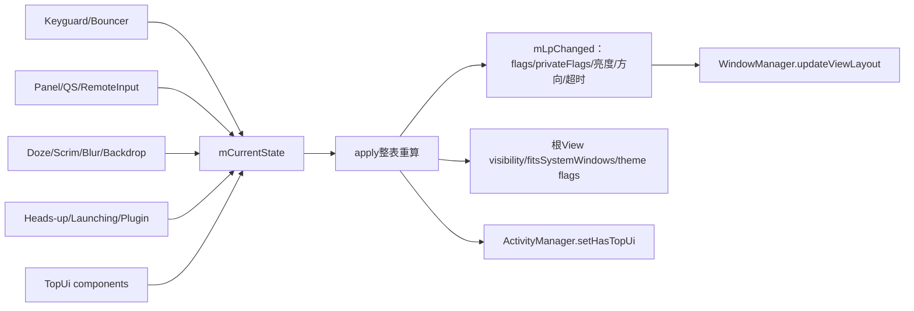
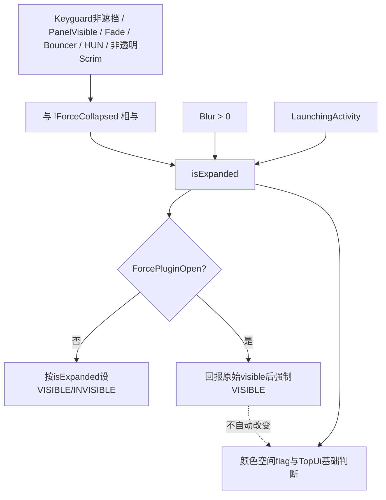
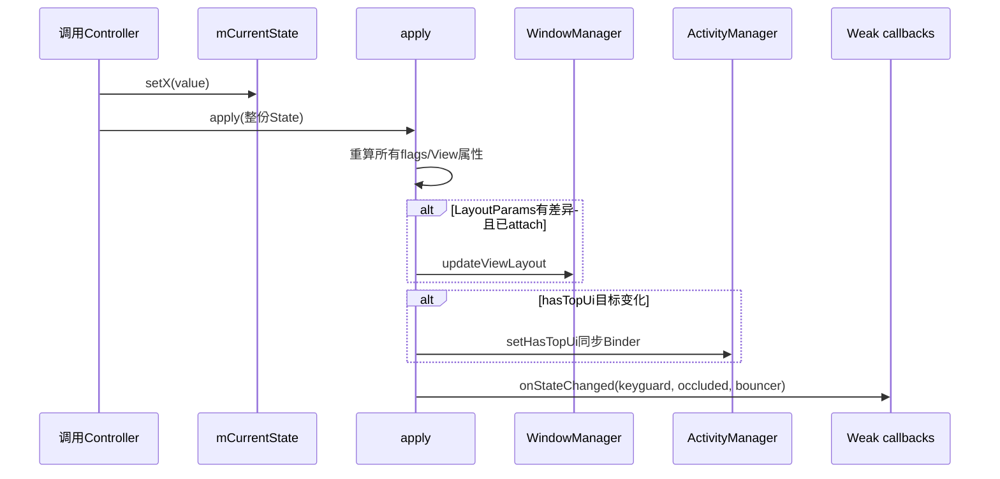

# 第 416 章 Android SystemUI NotificationShadeWindowController：窗口可见性、焦点、亮度与 Wallpaper

> 源码基线：Android 11 / API 30 / `android-11.0.0_r48`。本章只在 macOS 阅读、检索和推演源码，不编译。上一章是折叠条内容，本章是承载通知面板、QS、Keyguard、Scrim和Backdrop的全屏`TYPE_NOTIFICATION_SHADE`窗口。

## 1. 本章要解决什么问题

同一扇全屏Window有时透明收起，有时显示通知面板，有时承载Keyguard或Bouncer，还要决定能否获取焦点、能否弹IME、是否展示壁纸、是否强制低亮度。NotificationShadeWindowController把几十个输入状态合并成一份LayoutParams和根View状态。

## 2. 一句话心智模型

它是“状态归约器”：各模块调用setX写入mCurrentState，`apply()`按固定顺序把整份状态重新计算为Window flags、private flags、orientation、brightness、timeout、input features、View可见性和top-ui。

## 3. 与StatusBarWindowController的区别

第412章的StatusBarWindowController只管理顶部条形`TYPE_STATUS_BAR`高度与force-visible；本类管理MATCH_PARENT×MATCH_PARENT的`TYPE_NOTIFICATION_SHADE`，复杂焦点、Keyguard、Doze、Wallpaper和触摸政策都在这里。

## 4. 本章源码地图

主文件是`NotificationShadeWindowController.java`；根布局是`super_notification_shade.xml`；调用者包括StatusBar、StatusBarKeyguardViewManager、NotificationPanelViewController、BiometricUnlockController、DepthController、Bubble与GlobalActions。

## 5. 它运行在哪个进程

Controller、State、View和WindowManager客户端调用都在SystemUI进程。`IActivityManager.setHasTopUi`会跨Binder到system_server，WindowManager.add/update也跨WindowManager会话进入系统端。

## 6. 它主要运行在哪个线程

正常调用来自SystemUI主线程，且会直接改View。源码没有线程锁；State HashSet、LayoutParams和callback列表都依赖主线程串行使用。

## 7. 根View承载什么

`super_notification_shade.xml`根节点是NotificationShadeWindowView，内部有Backdrop、前后Scrim、status_bar_expanded通知/QS内容、亮度镜像、锁图标和Keyguard消息区域。

## 8. 根View与Window不是一回事

View visibility决定这棵树是否绘制；LayoutParams flags决定WMS级焦点、触摸、壁纸和亮度等政策；Window本身attach后一直存在，View设INVISIBLE不是removeView。

## 9. 状态来自哪些模块

Keyguard管理showing/occluded/bouncer/input/fade，Panel管理visible/expanded/focusable/QS，Scrim与Depth管理遮罩和blur，Doze/Biometric管理亮度，插件/气泡/GlobalActions管理强开或top-ui。

## 10. 图一：多输入归约为一扇Window



## 11. Controller为何是Singleton

全屏Shade Window在SystemUI主进程中只有一个中央状态账。多个业务模块都向同一实例写状态，避免各自持有互相覆盖的LayoutParams。

## 12. 构造期注册什么

向DumpManager注册自身，读取锁屏timeout，按指定rank注册StatusBarStateController listener，并向ConfigurationController注册主题回调。

## 13. StateListener回放初值吗

StatusBarStateController addCallback只登记、不回放；构造后State的statusBarState和dozing仍是Java默认值，直到后续回调或其他初始化路径设置。

## 14. 锁屏旋转如何决定

系统属性`lockscreen.rot_override`为true，或SystemUI资源`config_enableLockScreenRotation`为true，即允许锁屏按USER方向；否则Keyguard/AOD使用NOSENSOR。

## 15. Keyguard刷新率如何挑选

读取`config_keyguardRefreshRate`，在当前display支持模式中找“整数刷新率相等且物理分辨率与当前模式相同”的第一项；找不到则mKeyguardDisplayMode为null。

## 16. 整数强转的边界

源码把mode.getRefreshRate()强转int后比较资源值。59.94会变59，不等于配置60；因此产品配置与实际mode浮点值必须匹配这套截断规则。

## 17. 默认配置可能不启用此功能

r48默认`config_keyguardRefreshRate`为-1，通常找不到模式，因此preferredDisplayModeId逻辑不生效；产品overlay才可能开启。

## 18. View必须先注入

StatusBar inflate窗口内容后调用`setNotificationShadeView`，再setup ViewController，最后在createAndAddWindows中attach。attach前mNotificationShadeView为null会在addView或theme处理中失败。

## 19. attach创建的尺寸与类型

宽高都是MATCH_PARENT，类型为TYPE_NOTIFICATION_SHADE，格式TRANSLUCENT。它是真正的全屏Shade承载窗口。

## 20. 初始public flags

包含NOT_FOCUSABLE、TOUCHABLE_WHEN_WAKING、SPLIT_TOUCH、WATCH_OUTSIDE_TOUCH和DRAWS_SYSTEM_BAR_BACKGROUNDS。初始不获取键盘焦点，但具备触摸与外部触摸观察相关能力。

## 21. NOT_FOCUSABLE不等于NOT_TOUCHABLE

前者阻止键盘焦点；只有mNotTouchable置位后applyNotTouchable才加FLAG_NOT_TOUCHABLE。窗口能否接收pointer还受TouchableRegion和根View分发共同影响。

## 22. attach的其他LayoutParams

独立Binder token、TOP gravity、fitInsetsTypes(0)、SOFT_INPUT_ADJUST_RESIZE、标题NotificationShade、SystemUI package、cutout mode ALWAYS。

## 23. Insets行为为何特殊

privateFlags加BEHAVIOR_CONTROLLED，insets behavior设SHOW_TRANSIENT_BARS_BY_SWIPE；注释说明WMS仍有特殊逻辑禁用某些transient行为，是迁移到Shell前的兼容设置。

## 24. 两份LayoutParams模型

mLp是已提交/本地实际副本，mLpChanged是每次apply修改的期望副本。attach addView后把mLp完整copy到mLpChanged，后续apply再差分提交。

## 25. attach是否幂等

不是。真实WindowManager对同一已attach View再次addView通常报错；测试用mock重复attach不能证明生产代码可重复调用。

## 26. attach后为什么调用onThemeChanged

根View已经存在，Controller根据ColorExtractor中性颜色是否支持dark text，设置LIGHT_STATUS_BAR和LIGHT_NAVIGATION_BAR系统UI位，保证Keyguard栏文字/图标对比度。

## 27. setKeyguardDark名字为何易误解

参数dark为true时反而设置LIGHT_*标志；这些标志的语义是“背景够亮，可使用深色内容”。真正调用传入的是`supportsDarkText()`，应按代码而不是方法名理解。

## 28. attach如何补偿Keyguard初值

若KeyguardViewMediator报告showing且未occluded，attach末尾调用setKeyguardShowing(true)，触发一次完整apply，使Window初始状态与Mediator setupLocked一致。

## 29. 非Keyguard时attach会完整apply吗

不会。attach只复制基础LayoutParams和theme；若Mediator条件为false，不主动apply mCurrentState。正常启动随后各Controller会推状态，但attach前调用的setter期望可能被copy基线覆盖，不能依赖预attach提交。

## 30. 预attach状态为何可能丢失到参数层

setter会改State并apply到mLpChanged，但mLp为null不提交；attach随后新建基础mLp并copy到mLpChanged。除非attach末尾Keyguard补偿或之后又apply，先前State不会立即重新归约到参数。

## 31. apply的固定顺序

依次处理Keyguard flags、焦点、强制导航、方向、可见性、用户活动timeout、input features、fitsSystemWindows、touch modal、亮度、top-ui、not-touchable和色彩空间flag，再提交LayoutParams、Binder top-ui并通知callback。

## 32. 为什么每次都整表重算

多个输出互相依赖，例如Keyguard、Bouncer和remote input共同决定焦点；只在setter里改一个flag容易留下旧位。集中apply用同一State重新设置或清除每项。

## 33. Wallpaper的基础条件

`keyguardOrAod = keyguardShowing || (dozing && alwaysOn)`。还必须Backdrop未显示、Scrim不是OPAQUE，才加FLAG_SHOW_WALLPAPER，否则清除。

## 34. Keyguard occluded参与Wallpaper判断吗

没有。这里使用mKeyguardShowing而不是`isKeyguardShowingAndNotOccluded()`；即使occluded，只要其他条件满足仍可能保留SHOW_WALLPAPER flag。

## 35. OPAQUE Scrim为何压住壁纸

完全不透明遮罩已经挡住壁纸，再让Window声明SHOW_WALLPAPER没有视觉收益。SEMI_TRANSPARENT不等于OPAQUE，仍可保留壁纸。

## 36. Backdrop是什么

Backdrop通常承载媒体封面等背景。mBackdropShowing为true时清SHOW_WALLPAPER，避免系统壁纸与自有背景同时参与合成。

## 37. mWallpaperSupportsAmbientMode是否参与

r48 setter只把值存进State并apply，但本类任何apply方法都没有读取它。该字段只会出现在反射dump，是未完成或迁移残留；ScrimController另有真正使用同名信息的逻辑。

## 38. isShowingWallpaper真的查询Window flag吗

不是。它只返回`!mBackdropShowing`，忽略Keyguard/AOD、OPAQUE Scrim和FLAG_SHOW_WALLPAPER。因此方法名比实现承诺更强，不能作为WMS真实壁纸显示证据。

## 39. Doze如何保护非系统Overlay

mDozing为true时加SYSTEM_FLAG_HIDE_NON_SYSTEM_OVERLAY_WINDOWS，false时清除，防止AOD/锁屏上被非系统悬浮窗覆盖。

## 40. 决定性源码：可见性的括号边界

```java
private boolean isExpanded(State state) {
    return !state.mForceCollapsed && (state.isKeyguardShowingAndNotOccluded()
            || state.mPanelVisible || state.mKeyguardFadingAway || state.mBouncerShowing
            || state.mHeadsUpShowing
            || state.mScrimsVisibility != ScrimController.TRANSPARENT)
            || state.mBackgroundBlurRadius > 0
            || state.mLaunchingActivity;
}
```

## 41. forceCollapsed压制哪些条件

只压制括号内的Keyguard未遮挡、panelVisible、keyguardFadingAway、Bouncer、Heads-up和非透明Scrim。

## 42. forceCollapsed压不住什么

由于`&&`优先且括号位置明确，backgroundBlurRadius>0或launchingActivity仍会让isExpanded为true，即使mForceCollapsed为true。

## 43. 为什么blur单独保持窗口

DepthController的模糊效果需要Shade Window参与合成；即使面板逻辑上收起，只要blur半径非0，根View仍要VISIBLE直到动画归零。

## 44. launchingActivity为何单独保持

从Shade启动Activity的过渡期间需要窗口继续参与动画；force collapse不应过早让根View消失。

## 45. ForcePluginOpen在哪一层覆盖

applyVisibility先算isExpanded；若mForcePluginOpen，就通知listener“若无插件时的visible值”，然后无条件把visible设true。

## 46. listener参数名字的边界

接口叫setWouldOtherwiseCollapse，但实际传的是force前的`visible`，StatusBar再把这个布尔值传给OverlayPlugin.setCollapseDesired。应以插件协议的实际消费验证，不要仅按英文名取反。

## 47. ForcePluginOpen是否进入isExpanded

不进入。它只覆盖根View visibility；applyHasTopUi和COLOR_SPACE_AGNOSTIC仍调用原始isExpanded，所以插件强开并不会自动改变这两项。

## 48. ForcePluginOpen是否自动申请top-ui

不会。插件若需要进程top-ui优先级，应另走setRequestTopUi，或者由其他expanded条件成立。

## 49. 根View为何用INVISIBLE而不是GONE

collapsed时setVisibility(INVISIBLE)，保留Window/View布局对象，便于Heads-up、触摸区域或面板快速重新打开；不会执行removeView。

## 50. 图二：可见性优先级



## 51. Keyguard方向何时受限

Keyguard showing且未occluded，或正在Doze时，方向设USER或NOSENSOR；其他场景恢复UNSPECIFIED，让应用/display常规政策决定。

## 52. Occluded为何恢复普通方向

被showWhenLocked Activity遮挡时，顶层应用应能使用自己的方向政策；因此只有真正可见的Keyguard才施加锁屏方向。

## 53. preferredDisplayMode何时设置

若找到目标模式，并且Dozing或“bypass开启 + 状态KEYGUARD + 未fading/going away”，就设置modeId；否则清为0。

## 54. bypass与Keyguard showing是同一条件吗

不是。它检查statusBarState==KEYGUARD，没有直接检查mKeyguardShowing。不同状态字段在切换瞬间可能暂不一致，输出以当前组合为准。

## 55. display mode变化如何诊断

每次apply都用Trace counter记录`display_mode_id`；dump也打印选中的mKeyguardDisplayMode。最终刷新率仍需Display/WMS证据，preferred只是请求。

## 56. 焦点计算的第一级

若`bouncerShowing && (keyguardOccluded || keyguardNeedsInput)`，或remote input功能开启且active，则同时清NOT_FOCUSABLE和ALT_FOCUSABLE_IM：窗口可聚焦且允许连接IME。

## 57. 为什么RemoteInput优先

通知内联回复必须让输入框获取焦点并显示软键盘，因此即使普通面板条件不满足，也进入最强焦点分支。

## 58. Bouncer什么时候需要IME

需要输入，或在occluded场景显示Bouncer时进入第一分支。仅Bouncer showing但不满足括号时，还要看Keyguard/panel的第二级条件。

## 59. 焦点计算的第二级

Keyguard showing且未occluded，或`notificationShadeFocusable && panelExpanded`时，清NOT_FOCUSABLE；窗口能够拿焦点。

## 60. ALT_FOCUSABLE_IM是什么意思

第二级默认加ALT_FOCUSABLE_IM，使窗口可聚焦但位于IME政策的另一侧、不按普通输入窗口连接键盘；若未遮挡Keyguard明确needsInput，则清该flag允许IME。

## 61. 焦点计算的第三级

其他情况加NOT_FOCUSABLE并清ALT_FOCUSABLE_IM，回到折叠/非交互基础状态。

## 62. panelVisible和panelExpanded为何分开

visible控制Window是否需要显示；expanded描述面板展开状态。panel focus还要求mNotificationShadeFocusable，单独visible不等于可获取键盘焦点。

## 63. setPanelVisible的副作用

它同时把mNotificationShadeFocusable设为同一个visible，再apply；之后专用setter仍可覆盖focusable。最终panelFocusable还要与mPanelExpanded相与。

## 64. softInputMode是否随分支变化

每次applyFocusableFlag末尾都重设SOFT_INPUT_ADJUST_RESIZE，保持IME出现时窗口按resize策略处理。

## 65. 强制导航栏何时开启

Panel expanded、Bouncer showing，或remote input active时，加PRIVATE_FLAG_STATUS_FORCE_SHOW_NAVIGATION；否则清除。

## 66. 为什么panelVisible不够

仅开始显示/拖拽但尚未达到expanded政策时不一定强制导航；r48明确使用mPanelExpanded而不是mPanelVisible。

## 67. Heads-up如何改变touch modal

mHeadsUpShowing为true时加FLAG_NOT_TOUCH_MODAL，让窗口外部区域触摸可传给其他Window；false时清除，恢复默认modal政策。

## 68. 全屏Window还需要NOT_TOUCH_MODAL吗

实际可触摸区域可能被WMS region收缩为Heads-up附近；flag决定区域外触摸是否被本Window阻断，是Heads-up交互链的一部分。

## 69. mNotTouchable是更强覆盖

true时直接加FLAG_NOT_TOUCHABLE，整个Window不接收触摸；false清除。它与是否VISIBLE、focusable、modal是不同维度。

## 70. Keyguard时fitsSystemWindows如何处理

未遮挡Keyguard时设false，让锁屏内容自行延伸/处理系统栏区域；其他状态设true。值变化才requestApplyInsets。

## 71. Doze但Keyguard字段为false时呢

fitsSystemWindows只看`isKeyguardShowingAndNotOccluded()`，不直接看Dozing；因此纯Doze输入不会自动设false，仍取当前Keyguard组合。

## 72. 锁屏用户活动timeout的条件

必须Keyguard未遮挡、statusBarState正是KEYGUARD且QS未展开；Bouncer显示时用AWAKE_INTERVAL_BOUNCER_MS，否则用config_lockScreenDisplayTimeout。

## 73. 为什么还要求statusBarState

mKeyguardShowing与状态机状态可能在过渡期不同步。三重条件避免只因showing布尔就覆盖其他场景的Window timeout。

## 74. QS展开为何取消timeout

用户正在主动操作Quick Settings时，不应用锁屏固定短timeout，LayoutParams恢复-1交给系统常规策略。

## 75. INPUT_FEATURE_DISABLE_USER_ACTIVITY何时加

条件与锁屏timeout相似，还要求`!mForceUserActivity`。置位后触摸不会像普通窗口那样重置用户活动计时。

## 76. forceUserActivity的作用

它只让applyInputFeatures清除DISABLE_USER_ACTIVITY，不直接改timeout。名字容易让人误以为同时强制延长屏幕时间，源码并非如此。

## 77. brightness何时覆盖

mForceDozeBrightness为true时，把screenBrightness设为mScreenBrightnessDoze；false设BRIGHTNESS_OVERRIDE_NONE。

## 78. force brightness是否要求mDozing

不要求。两个State字段彼此独立，调用者BiometricUnlockController负责在正确阶段成对开启/关闭。

## 79. setDozeScreenBrightness如何换算

传入0—255整数除以255f保存为float。源码不clamp，也不立即apply；若force已经开启，新亮度要等下一次任意apply才提交。

## 80. 为什么“不立即apply”值得注意

DozeServiceHost只调用setDozeScreenBrightness时，mLpChanged不变；正常Doze/biometric状态还会触发apply，但单独调用完成不能证明WMS已收到亮度。

## 81. collapsed时的色彩空间flag

若`!isExpanded`，加PRIVATE_FLAG_COLOR_SPACE_AGNOSTIC；expanded时清除。收起的透明/简单窗口可避免参与不必要的色彩空间转换政策。

## 82. plugin强开与此flag的错位

ForcePluginOpen可让View VISIBLE，但若原始isExpanded为false，COLOR_SPACE_AGNOSTIC仍被置位。它是r48有意或历史上的分层结果，不能用View visibility反推flag。

## 83. Background blur如何影响色彩flag

blur>0直接使isExpanded为true，即使forceCollapsed，因而清除COLOR_SPACE_AGNOSTIC并让Window保持VISIBLE。

## 84. applyHasTopUi如何判断

只要componentsForcingTopUi集合非空，或isExpanded为true，就把mHasTopUiChanged设true；否则false。

## 85. top-ui是什么

它通过IActivityManager告诉system_server SystemUI当前承担顶层交互/动画，帮助调度与进程重要性，避免关键动画卡顿；不是Window z-order本身。

## 86. 为何用tag集合

Bubble、GlobalActions等多个组件可独立request/release。同一tag重复request天然幂等，只有所有不同tag都移除且窗口不expanded才释放top-ui。

## 87. tag冲突有什么风险

集合只按字符串身份计数；两个独立组件误用同一tag时，一个remove会清掉共享项，另一个仍需要却无法表达引用计数。调用方应使用唯一稳定tag。

## 88. Binder调用何时发生

只有mHasTopUi与mHasTopUiChanged不同才调用setHasTopUi，避免每个State setter都跨进程。

## 89. Binder失败会重试吗

catch RemoteException后仍把本地mHasTopUi更新为期望值；下一次相同期望不会重试，直到状态先反向变化。这是本地账与system_server可能暂时不一致的边界。

## 90. whitelistIpcs是什么意思

DejankUtils标记这次主线程同步IPC为已知允许路径，避免严格IPC检测报警；并不把调用变为异步，也不保证远端成功。

## 91. 图三：一次setter到提交与通知



## 92. LayoutParams差分如何提交

`mLp.copyFrom(mLpChanged)`返回非0才updateViewLayout。即使setter重复调用，若参数不变就不跨WMS；但View visibility、fits或callback仍可能执行。

## 93. updateViewLayout异常后的边界

copyFrom先修改mLp本地副本，再调用WMS。若update抛异常，下一次相同State可能因copyFrom返回0而不重试，导致本地mLp与WMS真实状态短暂分叉。

## 94. callback何时通知

每次apply末尾都通知，不要求LayoutParams真的变化。回调只收到keyguardShowing、keyguardOccluded和bouncerShowing三个布尔值。

## 95. callback如何存储

使用WeakReference数组，register按引用身份防止当前存活对象重复；没有显式unregister，GC后的弱引用槽也不会被清理。

## 96. 弱引用数组会不会增长

会。notify只跳过get()==null，不remove；长期反复注册短命callback会留下空WeakReference。典型SystemUI对象数量有限，但实现不是自动压缩列表。

## 97. callback异常有隔离吗

没有逐个try/catch。某个callback抛运行时异常会中断后续通知，并从setter调用栈向上传播；此前View/LayoutParams/top-ui可能已经改变。

## 98. setScrimsVisibility的额外通知

先更新State并apply，再无条件调用mScrimsVisibilityListener.accept。监听者通常由NotificationShadeDepthController安装，用OPAQUE状态停止不必要blur。

## 99. Scrim listener可以为空吗

字段初始为null，setter只接受非null listener且不能用null清除；setScrimsVisibility却不判null。启动接线必须先安装listener，否则会NPE。

## 100. Blur setter为何有相等短路

它是少数先比较旧值的setter，半径不变就不apply，减少动画每帧的重复工作；大多数其他setter即使值相同也会apply和通知callback。

## 101. ForcePlugin listener何时调用

setForcePluginOpen先apply，再若listener非null调用onChange；没有相等短路，因此重复传同值也会通知plugin listener。

## 102. 主题变化是否更新LayoutParams

onThemeChanged只改NotificationShadeView的systemUiVisibility LIGHT flags，不调用apply或updateViewLayout；这是View级系统栏外观状态。

## 103. dump打印什么

打印选中的Keyguard display mode和State.toString。State用反射遍历声明字段，包括HashSet与未使用字段，便于看到输入账本。

## 104. dump看不到什么

没有直接打印mLp/mLpChanged、真实WMS flags、mHasTopUi两份值、callback空槽或根View visibility，因此需配合Window dump、View hierarchy和Trace。

## 105. State反射打印的边界

IllegalAccessException被静默忽略；字段顺序依赖反射返回顺序，不应作为稳定机器协议解析。

## 106. 本章的进程边界

State归约和View属性在SystemUI内；updateViewLayout进入WMS，setHasTopUi进入ActivityManager。Wallpaper与display mode最终生效还要由system_server政策裁决。

## 107. 本章的线程边界

正常setter在主线程同步完成归约；WMS/AMS调用可能同步IPC；View绘制、Insets重算和Display模式切换在之后的系统/帧时序完成。

## 108. 最重要的状态分层

mCurrentState是输入账；mLpChanged是期望参数；mLp是已复制的客户端参数；WMS有真正窗口状态；View还有visibility/fits/systemUiVisibility。五层不能互相代替。

## 109. 最重要的优先级

RemoteInput/Bouncer输入优先焦点，blur/launch可越过forceCollapsed，forcePlugin只覆盖View visibility，components或isExpanded才决定top-ui，notTouchable又独立覆盖触摸。

## 110. 最重要的版本边界

r48保留WallpaperSupportsAmbientMode只存不读、弱callback不清槽、Scrim listener隐含非空、预attach State可能被参数基线覆盖等历史实现；后续版本重构后应重新逐行验证。

## 111. 阅读本章后的自测

你应能解释：为什么Keyguard needs input要清ALT_FOCUSABLE_IM；forceCollapsed为何挡不住blur；plugin强开为何不自动top-ui；Doze亮度setter为何不立即提交；isShowingWallpaper为何不能证明FLAG_SHOW_WALLPAPER。

## 112. macOS只读练习一：建立State到输出矩阵

用`rg`列出所有setX，再为每个State字段记录被哪些apply方法读取。特别标记mWallpaperSupportsAmbientMode只写不读、mComponentsForcingTopUi只影响top-ui，以及mForcePluginOpen只在visibility路径使用。

## 113. macOS只读练习二：手算六种焦点组合

分别推演：完全收起；Keyguard无需输入；Keyguard需要输入；Panel visible但未expanded；Panel expanded且focusable；RemoteInput active。写出NOT_FOCUSABLE、ALT_FOCUSABLE_IM与FORCE_SHOW_NAVIGATION最终位。

## 114. macOS只读练习三：验证可见性括号

把isExpanded抄成布尔表达式，依次令forceCollapsed=true并单独开启Heads-up、blur、launchingActivity，再加入forcePluginOpen。记录View visibility、COLOR_SPACE_AGNOSTIC与hasTopUi是否一致，解释不一致来源。

## 115. macOS只读练习四：追一次Doze亮度提交

从DozeServiceHost.setDozeScreenBrightness追到本类，证明它只改float不apply；再从BiometricUnlockController找setForceDozeBrightness调用，记录哪次apply才把screenBrightness写进LayoutParams。

## 116. 易错点一：Shade View不可见就代表Window已移除

错误。Controller只把根View设INVISIBLE，TYPE_NOTIFICATION_SHADE仍attach；LayoutParams和TouchableRegion政策继续存在。

## 117. 易错点二：forceCollapsed能压住所有展开来源

错误。它只压住括号内那组；blur>0和launchingActivity在括号外仍使isExpanded为true，forcePluginOpen又可最终强制View可见。

## 118. 易错点三：isShowingWallpaper等价于SHOW_WALLPAPER

错误。r48方法只检查Backdrop未显示，真实flag还要求Keyguard/AOD且Scrim不OPAQUE；两者证据强度不同。

## 119. 复读源码后的修正

复读r48后，本章明确了运算符优先级与分层差异：forceCollapsed不压blur/launch，forcePlugin仅覆盖View visibility而不进入isExpanded/top-ui/color-space；焦点分支又把Bouncer、Keyguard、panel与RemoteInput按IME需求分级。进一步补出WallpaperSupportsAmbientMode在本类未消费、isShowingWallpaper名不副实、setDozeScreenBrightness不apply、Scrim listener无空判断、弱callback不清理、top-ui IPC失败不重试，以及预attach State可能被attach基线覆盖。

## 120. 本章结论

NotificationShadeWindowController的难点不在某一个flag，而在多输入共同归约：可见性、焦点/IME、触摸、壁纸、方向、刷新率、timeout、亮度、Insets、色彩空间与top-ui彼此相关却又不完全共享条件。始终区分State、期望LayoutParams、客户端副本、WMS真实状态和View像素，才能准确解释Shade窗口“看得见但不聚焦、强开但非top-ui、低亮度未及时提交”等问题。下一章进入NotificationPanelViewController，研究触摸、展开高度、fling和最终状态收敛。
