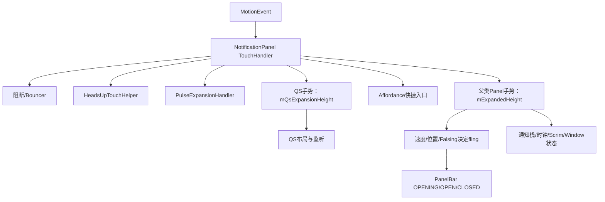
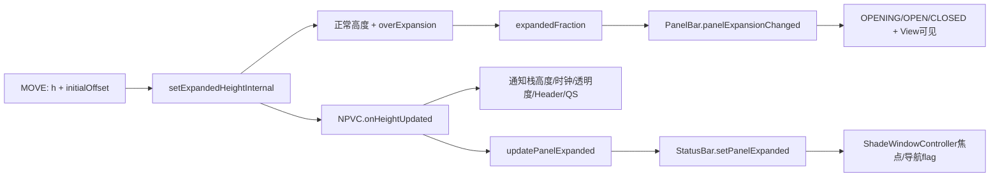
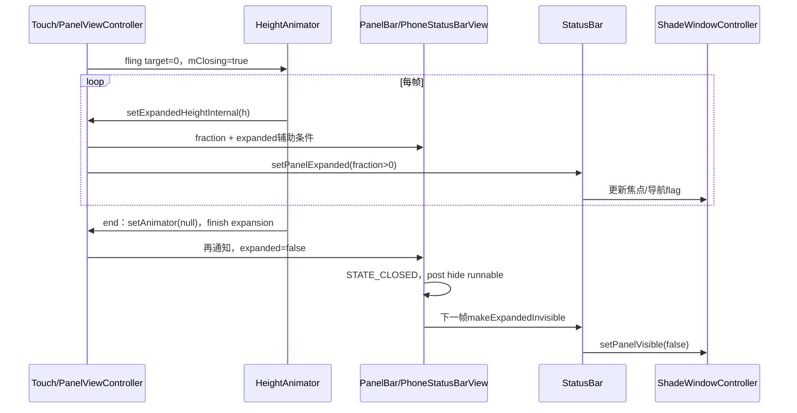

# 第 417 章 Android SystemUI NotificationPanelViewController：触摸、展开、Fling 与状态收敛

> 源码基线：Android 11 / API 30 / `android-11.0.0_r48`。本章只在 macOS 阅读、检索和推演源码，不编译。主类有3763行；本章围绕“手指输入怎样最终让Shade稳定打开或关闭”组织，而不是逐方法罗列。

## 1. 本章先解决什么问题

手指从顶部下拉时，通知面板不是简单跟着Y坐标移动：Heads-up、Pulse、QS、锁屏快捷入口可能抢先处理，触摸要越过slop，抬手要结合速度、位置和误触决定方向，动画结束后还要让PanelBar、StatusBar、WindowController和监听状态共同收敛。

## 2. 一句话心智模型

NotificationPanelViewController负责“具体通知面板语义”，父类PanelViewController负责“通用一维高度手势与fling引擎”，PanelBar/PhoneStatusBarView负责“把高度阶段翻译成窗口开关和上层事件”。

## 3. 为什么必须同时读父类

子类覆盖TouchHandler入口与高度回调，但真正的mExpandedHeight、VelocityTracker、flingExpands、ValueAnimator、mTracking/mClosing/mExpanding和终点通知都定义在PanelViewController。只读子类会漏掉主状态机。

## 4. 本章源码地图

主线文件：`NotificationPanelViewController.java`、`PanelViewController.java`、`PanelBar.java`、`PhoneStatusBarView.java`与StatusBar的makeExpandedVisible/Invisible、onTracking回调。

## 5. 它运行在哪个进程

全部手势判定、动画与View更新运行在SystemUI进程。面板展开导致WindowController updateLayout时才进入WMS；本章触摸主链没有每个MOVE都跨Binder。

## 6. 它主要运行在哪个线程

MotionEvent分发、VelocityTracker、ValueAnimator update、PanelBar状态和View布局都在主线程。源码没有锁，监听列表和大量布尔字段依赖主线程顺序。

## 7. 三个容易混淆的“展开”

`mExpandedHeight`是像素高度；`mExpandedFraction`是相对当前最大高度的比例；PanelBar的`expanded`布尔还会因peek、tracking、Heads-up、instantExpand或animator存在而为true，即使fraction正好是0。

## 8. mTracking、mExpanding与mClosing不同

mTracking表示手指正在直接控制；mExpanding表示一次扩/收过程尚未finish，包含拖拽和动画；mClosing表示目标是收起或正在收尾。三者可同时或交错存在。

## 9. QS又有独立高度状态

通知面板高度用mExpandedHeight；QS用mQsExpansionHeight、mQsTracking和mQsExpansionAnimator。QS可能在面板已完全展开后继续下拉，因此不能把两套高度合成一个数。

## 10. 图一：输入优先级与两套高度



## 11. View如何接上TouchHandler

PanelViewController构造时给PanelView设置OnTouchListener、OnLayoutChangeListener和配置回调。子类通过override `createTouchHandler()`返回扩展后的匿名TouchHandler。

## 12. 事件最早还会经过哪里

顶部PhoneStatusBarView的onTouchEvent先调用StatusBar.interceptTouchEvent，再可能走自身/PanelBar分发；进入NotificationPanelView后才由上述OnTouchListener处理。

## 13. 子类onIntercept的第一道门

mBlockTouches为true，或QS fully expanded且QS禁止panel触摸时，直接false；这表示当前手势不由面板拦截。

## 14. initDownStates记录什么

ACTION_DOWN保存downX/Y、是否初始collapsed、是否从QQS区域可收起、是否监听pinned Heads-up、是否期待合成DOWN，并重置本次affordance/QS falsing等标志。

## 15. Bouncer为何优先拦截

普通Bouncer显示时onIntercept直接true，不让事件落到Shade/QS子View，但仍允许后续向下拖动面板来解除Bouncer场景。

## 16. Scrimmed Bouncer更严格

onTouch中若`isBouncerShowingScrimmed()`直接false，注释明确不允许拉开QS或Shade。普通Bouncer拦截和scrimmed Bouncer拒绝是两种政策。

## 17. Heads-up优先级

面板enabled且HeadsUpTouchHelper愿意拦截时，子类立即返回true并记录panel open/peek metrics；后续onTouch先让Heads-up helper消费。

## 18. Pulse Expansion何时介入

当前DOWN不属于Quick Settings区域时，PulseExpansionHandler可在intercept或touch阶段接管AOD pulse通知的展开；一旦它开始扩展，其他处理器不再继续。

## 19. QS拦截何时介入

面板非完全收起且`onQsIntercept`判定成功时返回true。完全收起时通常先开整个panel，两指/触控笔/鼠标特殊动作可请求QS immediate。

## 20. 父类最后兜底

Heads-up、Pulse、QS等都不接管时，调用PanelViewController.TouchHandler完成通用纵向拖拽。子类不是替换父类，而是在前后插入语义。

## 21. onTouch的处理顺序

检查block与scrimmed Bouncer，处理合成DOWN补偿、Pulse、Heads-up侦测、锁屏affordance，再给Heads-up真正消费，然后QS，最后父类Panel手势。

## 22. Affordance为何只在锁屏类状态使用

只有非SHADE、非Dozing、QS未展开且当前不是普通扩展过程，才把事件交给左右快捷入口；mOnlyAffordanceInThisMotion为true后不再进入面板主链。

## 23. Dozing时返回值为何特殊

末尾返回`!mDozing || mPulsing || handled`。Dozing且不pulsing时，只有确实被某处理器消费才返回true，避免透明地吞掉无效事件。

## 24. 父类onIntercept先检查什么

instant expanding、产品禁止通知拖拽、touch disabled，或当前motion已aborted且不是新DOWN时直接false。

## 25. 为什么能从内容区任意位置向上收起

若通知列表已允许collapse、触点在空白区或按下时正有动画，向上位移超过slop且纵向分量大于横向，就取消旧动画并开始tracking。

## 26. ACTION_DOWN如何处理中途动画

若按下时height animator正在closing且非hint，或peek animator存在，立即cancel并拦截，让用户接管当前高度，不必等动画结束。

## 27. KEYGUARD为何中止多指主手势

ACTION_POINTER_DOWN时若状态为KEYGUARD，设置mMotionAborted并清VelocityTracker；onTouch路径还会forceCancel结束当前motion，降低锁屏多指误操作风险。

## 28. active pointer切换

被跟踪手指抬起时选择另一个pointer，并重置initial X/Y或以当前高度重启expand motion，避免坐标跳变。

## 29. VelocityTracker为何使用raw坐标

父类临时把MotionEvent offset到raw screen X/Y后addMovement，再还原。Window frame可能随手势移动，使用window局部坐标会把窗口运动混进速度。

## 30. 完全收起时鼠标如何操作

若事件来自SOURCE_MOUSE，ACTION_UP直接`expand(true)`，不要求像触摸那样拖动；桌面/外设交互走点击展开语义。

## 31. ACTION_DOWN是否立刻tracking

由`shouldGestureWaitForTouchSlop()`决定。完全收起或非SHADE状态通常等待越过slop；已有未完成height/peek动画时可立即接管并onTrackingStarted。

## 32. 合成DOWN为何不等slop

输入焦点从状态栏转到Shade时可能设置mExpectingSynthesizedDown；override会清该标志并返回false，允许立即tracking，避免转移手势卡住。

## 33. 手势高度公式

MOVE先算`h = currentY - initialTouchY`，再算`newHeight = max(0, h + initialOffsetOnTouch)`，最后受mMinExpandHeight与tracking blocked约束后写入setExpandedHeightInternal。

## 34. 为什么还比较横向位移

纵向绝对位移必须大于横向，除非mIgnoreXTouchSlop为true。锁屏affordance图标附近保留横向手势，其余区域可放宽横向干扰。

## 35. ambiguous gesture的slop

若MotionEvent classification为AMBIGUOUS_GESTURE，touch slop乘系统配置的ambiguous multiplier，要求更明确移动才开始tracking。

## 36. peek是什么

短按顶部或刚开始下拉时，父类可用200ms initial opening peek或360ms普通peek先把面板拉到opening/peek height，让用户看到可展开提示。

## 37. peek与真正拖拽如何衔接

手指超过peek height会cancel peek；若peek已结束但手指尚未拖到该高度，代码把initial offset提升到当前peek高度并重置initialY，避免高度突然倒退。

## 38. 短点击的结局

若没有形成拖拽，面板原本closed、无pinned HUN/Bouncer/Fade，短于long-press timeout就运行peek并随后post collapse；时间更长则直接安排collapse。

## 39. 空白区点击的结局

若不是上述closed peek分支且Bouncer未显示，调用onEmptySpaceClick/onMiddleClicked，由具体状态决定展开、锁屏提示或其他动作。

## 40. 决定性源码：PanelBar可见不只看fraction

```java
mBar.panelExpansionChanged(
        mExpandedFraction,
        mExpandedFraction > 0f || mPeekAnimator != null || mInstantExpanding
                || isPanelVisibleBecauseOfHeadsUp() || mTracking
                || mHeightAnimator != null);
```

## 41. 为什么fraction为0仍可能expanded

peek尚在、程序化expand等布局、手指tracking、Heads-up维持可见，或height animator还没清理时，都要求PanelBar/Window继续存在。

## 42. startExpandMotion做什么

保存当前高度为initial offset并重置触摸原点；若startTracking为true，还把高度同步一次、设slop exceeded并进入onTrackingStarted。

## 43. onTrackingStarted的父类状态

先endClosing避免旧closing残留，设mTracking=true，通知PanelBar/StatusBar，调用notifyExpandingStarted，并广播一次panel expansion。

## 44. 子类tracking开始的附加工作

通知FalsingManager，若QS fully expanded则开启QS immediate与shelf-only；锁屏/locked shade隐藏左右affordance，通知StackScroller开始panel tracking。

## 45. tracking开始为何取消待隐藏

PhoneStatusBarView.onTrackingStarted会remove pending hide-expanded runnable。若上一轮刚close又立刻重新拖开，不能让旧下一帧任务把Window关掉。

## 46. onExpandingStarted只执行一次吗

notify方法检查mExpanding，false才设true并调用override。拖拽转fling仍属于同一轮，不会重复通知StackScroller expansion started。

## 47. 子类expanding开始做什么

设置mIsExpanding，记录开始时QS是否fully expanded，更新MediaHierarchy collapsing标志，必要时启动QS expansion，并让QS header立即listening。

## 48. MOVE高度写入的第一层

setExpandedHeightInternal检查NaN、结束首次展开latency计时，并以`maxPanelHeight - overExpansionAmount`为基础分离正常高度和overscroll。

## 49. NaN只记录不返回的后果

源码Log.wtf后继续计算；NaN会传播到fraction，随后PanelBar明确拒绝NaN并抛IllegalArgumentException。因此日志不是安全兜底，调用者必须保证有限数值。

## 50. 图二：从拖拽高度到窗口状态



## 51. 手指拖过最大高度会怎样

无height animator且tracking时，超过正常满高的像素交给setOverExpansion；NPVC在非Keyguard、非QS冲突时把它转给StackScroller overscroll。

## 52. 动画期间overExpansion如何处理

若fling前已有over-expansion，mOverExpandedBeforeFling为true，动画每帧按目标高度逐步回收overExpansion amount。

## 53. fraction如何计算

用expandedHeight除以不含over-expansion的满高，并只用`min(1f, ...)`限制上界。正常输入已被max(0)保证非负；外部负值并没有在这里统一clamp。

## 54. 高度更新会影响哪些子系统

子类重新定位Clock与通知，可能联动QS高度，更新StackScroller展开高度、Header、通知透明度、panel expanded布尔、gesture exclusion和状态栏图标显示政策。

## 55. 为什么有测量递归保护

positionClockAndNotifications可能改top padding，进而触发panel height变化再回调。mStackScrollerMeasuringPass超过2时放弃本次位置更新，防止无限递归/栈溢出。

## 56. getMaxPanelHeight不是固定屏高

它根据Keyguard bypass、通知数量、QS immediate/expanded、当前expanding起始QS状态、Pulsing、StackScroller内容和最小状态栏/QS高度动态计算。

## 57. Bypass的满高为何不同

Keyguard bypass时满高由expanded clock位置、KeyguardStatusView高度与可见通知相关的Shelf/Icon偏移构成，不直接使用普通Shade内容满高。

## 58. 动画中最大高度变化怎么办

requestPanelHeightUpdate发现mHeightAnimator非null时只设mPanelUpdateWhenAnimatorEnds。setAnimator(null)后再调用request更新，避免中途突然改动画终点。

## 59. cancel animator会保留这个延迟更新吗

若cancelHeightAnimator发现动画仍running，会先把mPanelUpdateWhenAnimatorEnds=false再cancel，因此用户接管动画时不自动跳到旧请求的新满高。

## 60. updatePanelExpanded判定什么

`!isFullyCollapsed() || mExpectingSynthesizedDown`视为expanded。变化时同步通知HeadsUpManager、TouchableRegionManager、StatusBar，后者再让NotificationShadeWindowController更新panelExpanded相关焦点与导航flag。

## 61. 这与PanelBar expanded完全相同吗

不同。NPVC这里主要看fraction和合成DOWN；PanelBar expanded还看peek、tracking、HUN、instantExpand与height animator，所以两层在过渡边界可能暂时不同。

## 62. 抬手如何计算速度

VelocityTracker以每秒1000单位计算Y速度，同时用X/Y速度hypot得到vectorVel。vertical vel符号决定方向，vector magnitude决定是否达到fling阈值。

## 63. ACTION_CANCEL回到哪里

Keyguard上强制expand；其他状态回到gesture开始时——如果down时panel已开则expand，否则collapse。Cancel不是简单使用当前一半阈值。

## 64. 普通UP如何决定expand

调用flingExpands：unlocking disabled或false touch会保守expand；总速度低于最小阈值时按fraction/子类规则；达到阈值时Y速度>0展开，<0收起。

## 65. 低速默认阈值

父类使用expandedFraction>0.5。子类还为来自Launcher的合成触摸提供小展开宽容：在限定时间内可选择展开。

## 66. QS动画为何强制主panel保持展开

NPVC override flingExpands后，若mQsExpansionAnimator非null就把结果改为true，防止QS自身动画尚在时整个Shade被收起。

## 67. false touch为何选择展开

锁屏向上收起可能意味着解锁；可疑触摸时保守留在锁屏/展开态比误解锁更安全。更完整的Falsing与锁屏边界放在第418章。

## 68. endMotionEvent随后做什么

调用fling后立即onTrackingStopped(expand)，并在“从closed开始且尚未layout、目标expand”时记录mUpdateFlingOnLayout和原速度。

## 69. 为什么要layout后重启fling

窗口刚从closed开启时满高可能尚未按全屏Window布局稳定。OnLayout listener会abort旧动画，再用保存速度重新fling到新的准确max height。

## 70. tracking结束不等动画结束

onTrackingStopped先把mTracking=false并通知PanelBar/StatusBar/StackScroller；height animator仍可继续，mExpanding仍为true，终点由animator listener负责。

## 71. 锁屏向上收起后的Bouncer

StatusBar.onTrackingStopped若KEYGUARD/SHADE_LOCKED、expand=false且锁屏不可直接dismiss，就show Bouncer。手势目标“收起”在安全语义上转成认证入口。

## 72. fling先选择哪个target

expand目标是getMaxPanelHeight，collapse目标0；collapse先设mClosing=true，然后进入flingToHeight。

## 73. 子类flingToHeight先插入什么

通知HeadsUpTouchHelper本次是否收起，并在非Keyguard、收起、fadeoutAlpha恰为1时开启closing alpha fadeout优化，然后调用父类。

## 74. Clear All特殊终点

展开且footer/clear-all条件满足时，动画先到“满高减clear-all高度”，结束后无cancel才瞬间set到真正max，让Clear All以淡入方式出现而非影响减速轨迹。

## 75. target已等于当前高度会怎样

或已有overExpansion且目标expand时，flingToHeight直接notifyExpandingFinished并返回，不创建height animator。终点通知仍必须发生。

## 76. 展开动画如何选参数

使用普通FlingAnimationUtils；若因Falsing被迫展开且原vel向上，则把vel归0；零速度统一设350ms。

## 77. 收起动画有几套参数

锁屏类dismissing条件可用PANEL_CLOSE_ACCELERATED或Dismissing FlingUtils；普通Shade使用Closing FlingUtils。零速度还除以collapseSpeedUpFactor，显式fixed duration可最终覆盖。

## 78. 速度方向与目标相反怎么办

主panel展开路径只对“Falsing强制展开但vel<0”归零；QS flingSettings则对任意速度与目标相反情况归零并固定350ms，两套实现不能混写。

## 79. height animator每帧做什么

ValueAnimator从当前expandedHeight到target，每帧调用setExpandedHeightInternal，因而完整触发通知栈、fraction、PanelBar与Window状态联动。

## 80. 接近0为何提前end

closing时若高度小于1但非0，强制设0并调用heightAnimator.end，避免慢减速插值长期停在极小非零值，让PanelBar迟迟不能CLOSED。

## 81. animation cancel与正常end的区别

listener在cancel时记mCancelled；end总会setAnimator(null)并重新通知PanelBar，但只有未cancel才执行Clear All跳转和notifyExpandingFinished。

## 82. cancelHeightAnimator为何不直接finish expanding

取消通常是用户接管或马上启动新动画，同一轮expansion仍继续；它只cancel并endClosing。真正终止该轮的调用方在instant collapse等路径另行notify finished。

## 83. endClosing会触发什么

mClosing从true变false时调用NPVC.onClosingFinished：重置横向panel位置、关闭alpha fadeout优化，并让MediaHierarchyManager关闭guts；PhoneStatusBarView/StatusBar还执行collapse后任务与focus补偿。

## 84. StatusBar为何在closing aborted时补焦点

onClosingFinished发现Presenter并未fully collapsed，就把Shade Window重新设focusable；因为开始collapse时可能提前取消焦点，用户中断后必须恢复。

## 85. notifyExpandingFinished的父类语义

先endClosing，再仅当mExpanding为true时设false并调用onExpandingFinished，防止重复finish回调。

## 86. 子类expanding finished如何清理

通知StackScroller、HeadsUp和Conversation manager，清mIsExpanding/Media状态；collapsed时post-after-traversal停止QS/Keyguard status监听，非collapsed则保持监听；还清QS immediate、shelf-only、two-finger、tracked HUN和scrim min fraction。

## 87. 延迟停止listening的竞态边界

collapsed分支post一个不重新检查当前展开状态的Runnable。若同一traversal前快速重新expand并先setListening(true)，旧Runnable之后仍可能set false；源码没有generation保护。

## 88. QS动画取消是否区分cancel

flingSettings的listener没有mCancelled标志；ValueAnimator.cancel仍会进入onAnimationEnd，执行notifyExpandingFinished、清animator并运行onFinishRunnable。这是“取消也做终态清理”的实现。

## 89. QS起点坐标的反直觉赋值

handleQsTouch/handleQsDown先出现`mInitialTouchY=event.getX()`、`mInitialTouchX=event.getY()`，但同一ACTION_DOWN随后进入onQsTouch又用真实y/x覆盖。当前流程通常无持续影响，重构控制流时不能依赖这组临时交换值。

## 90. PanelBar状态机有哪些状态

STATE_CLOSED、STATE_OPENING和STATE_OPEN。expanded布尔第一次从false变true时进入OPENING/onPanelPeeked；fraction满1且不tracking时OPEN；expanded false且不tracking时CLOSED。

## 91. 图三：收起动画的最终收敛



## 92. 为什么animator到0时Window还不能立刻隐藏

在end listener清mHeightAnimator之前，PanelBar expanded表达式仍因animator非null为true。清空后再次notify，才满足真正closed。

## 93. onPanelPeeked做什么

PhoneStatusBarView在PanelBar从CLOSED进OPENING时调用StatusBar.makeExpandedVisible，后者让Shade Window panelVisible=true并重算disable/focus政策。

## 94. onPanelCollapsed为何post下一帧

PhoneStatusBarView希望先显示收起动画最后一帧，再post mHideExpandedRunnable；Runnable还检查fraction仍为0，防止刚关闭又重开时误隐藏。

## 95. makeExpandedInvisible完成哪些收尾

强制panel高度归零、关闭QS、清expandedVisible，setPanelVisible(false)，清顶部status bar force-visible，关闭guts、执行post-collapse任务并结束interacting。

## 96. fraction到1是否等于所有内容完成

PanelBar可进入OPEN并发无障碍窗口状态事件，但QS、通知View、RenderThread或Surface仍可能在后续帧完成；fraction只是几何状态。

## 97. updateStatusBarIcons如何反向触发disable

展开高度低于opening height且HUN或全宽时可能保留折叠条图标；布尔变化会CommandQueue.recomputeDisableFlags，让第415章Fragment重新adjust。

## 98. r48中的硬编码残留

该方法声明`boolean noVisibleNotifications = true`且没有实际统计，因此Keyguard分支总把showIconsWhenExpanded改false。不能按变量名假定它已计算真实通知数量。

## 99. 横向panel translation为何存在

在宽屏非全宽通知列上，从左/右侧下拉会把通知栈和QS Frame横向靠近触点；closing finished重置为0。

## 100. 程序化expand为何等待global layout

先设mInstantExpanding并requestLayout，等Shade Window真正visibleToUser后才按animate选择fling或直接fraction=1，确保max height基于正确窗口尺寸。

## 101. instantCollapse如何收敛

abort peek/height/delayed runnable，直接fraction=0；若mExpanding则finish，若还在instant expanding则清标志并通知PanelBar，避免辅助expanded条件永久撑住Window。

## 102. collapse delayed做什么

先cancel animator、start expanding并设mClosing；若delayed就在View上post 120ms后fling，否则立即fling。abortAnimations会移除该Runnable。

## 103. 触摸禁用时如何解卡

setTouchAndAnimationDisabled(true)会cancel height animator；若tracking则onTrackingStopped(true)，再notifyExpandingFinished，避免只拒绝新事件却留下半展开状态机。

## 104. 本章的进程边界

MotionEvent到PanelBar/Controller高度更新都在SystemUI；StatusBar.setPanelExpanded进一步调用ShadeWindowController，后者update LayoutParams时才进入WMS。

## 105. 本章的线程边界

输入、动画update/end、layout listener、postOnAnimation与postAfterTraversal都在主线程，但发生在不同消息/帧阶段；“同线程”不等于“同一调用栈原子完成”。

## 106. 最重要的几何分层

手指位移、expandedHeight、overExpansion、maxPanelHeight、fraction、QS height和StackScroller height是不同量。调试必须同时记录单位与当前状态。

## 107. 最重要的阶段分层

tracking停止、fling开始、height到终点、animator引用清空、mExpanding finish、PanelBar CLOSED、下一帧Window invisible是七个不同节点。

## 108. 最重要的所有权分层

父类拥有通用手势/height animator；NPVC拥有通知/QS/Keyguard语义；PanelBar拥有OPEN状态；StatusBar拥有Window显示与全局收尾。

## 109. 最重要的取消语义

主height animator取消不finish当前expanding，便于后续接管；QS animator取消却照常执行end清理与finish。看到`cancel()`必须阅读各自listener。

## 110. 最重要的版本边界

r48含坐标临时交换、noVisibleNotifications硬编码、延迟listening无generation等历史痕迹；后续版本可能拆成PanelExpansionStateManager等结构，不能跨版本套字段。

## 111. 阅读本章后的自测

你应能解释：fraction为0为何Window仍可见；tracking stopped为何不是expansion finished；为何closed后还要下一帧hide；为什么布局变化会重启fling；为什么主panel与QS的cancel语义不同。

## 112. macOS只读练习一：手推一次完整下拉

只用`rg`/`sed`从ACTION_DOWN开始，记录touch slop、onTrackingStarted、每次newHeight、ACTION_UP速度、fling target、animator end、PanelBar OPEN和StatusBar Window变化。给每一步标出mTracking/mExpanding/mClosing。

## 113. macOS只读练习二：手推一次快速上滑收起

假设panel已开、fraction=0.7、Y速度为负且非false touch，沿flingToHeight到0。特别记录高度小于1时的end重入、animator清空前后PanelBar expanded值，以及下一帧makeExpandedInvisible。

## 114. macOS只读练习三：比较三种取消

分别追cancelHeightAnimator、cancelQsAnimation与ACTION_CANCEL。写出是否notifyExpandingFinished、目标回到初始open/closed还是继续新gesture、onFinishRunnable是否执行，避免把所有cancel理解成同一语义。

## 115. macOS只读练习四：验证布局后重启fling

假设从closed开始下拉，抬手时尚未发生新Window layout。追mUpdateFlingOnLayout、保存velocity、OnLayout abortAnimations与第二次fling，说明为什么第一次动画终点可能基于旧max height。

## 116. 易错点一：NotificationPanelViewController独自实现全部拖拽

错误。通用Motion/height/fling在PanelViewController；子类主要插入Heads-up、Pulse、QS、Keyguard、通知布局与收尾语义。

## 117. 易错点二：expandedFraction为0就可立即隐藏Window

错误。peek、instant expanding、Heads-up、tracking或height animator仍可把PanelBar expanded保持true，必须等辅助条件清空。

## 118. 易错点三：cancel动画一定执行正常完成回调

错误。主height animator用mCancelled跳过notifyExpandingFinished；QS animator没有该判断，cancel仍走end清理与finish。

## 119. 复读源码后的修正

复读r48后，本章把主线从NPVC单类扩展到PanelViewController→PanelBar→PhoneStatusBarView→StatusBar，因为最终Window收敛跨越四层。进一步核准PanelBar expanded不等fraction、layout后可能以原速度重启fling、height cancel与QS cancel语义相反、closing小于1会end重入、collapsed后下一帧才隐藏Window。还补出QS起点X/Y临时交换会被同DOWN覆盖、状态栏图标方法把noVisibleNotifications硬编码true，以及collapsed后的异步setListening(false)无generation复查等r48边界。

## 120. 本章结论

NotificationPanel的打开/关闭是一条跨帧收敛协议：触摸优先级选出处理器，父类把纵向位移变成height，速度/位置/Falsing选fling方向，ValueAnimator逐帧驱动通知/QS布局，PanelBar用fraction加辅助条件决定OPEN状态，最后StatusBar在下一帧收起Shade Window。只看某个布尔或动画终点都不足以证明完成。下一章专门研究PanelExpansion、Falsing、锁屏拖动、双击与误触边界。
