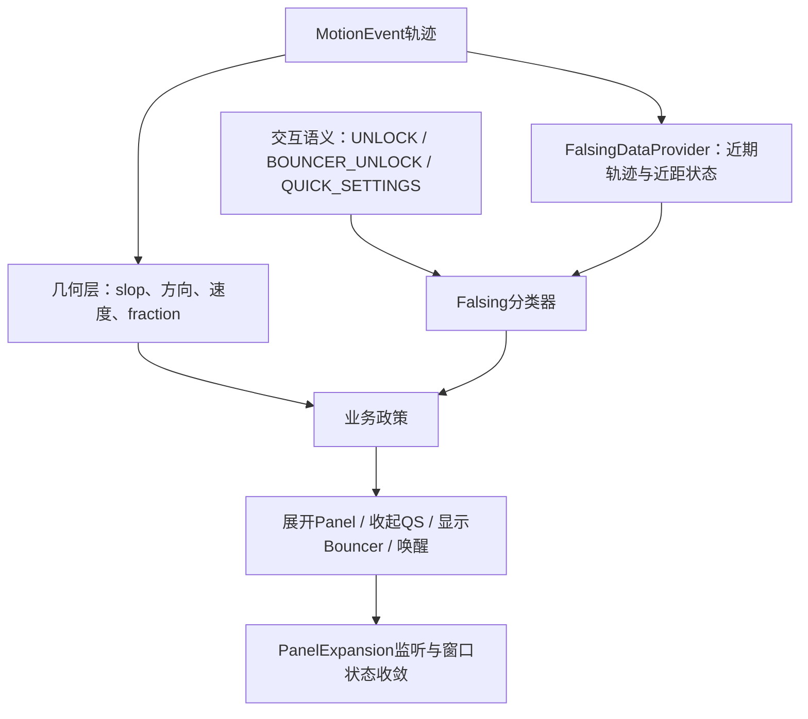
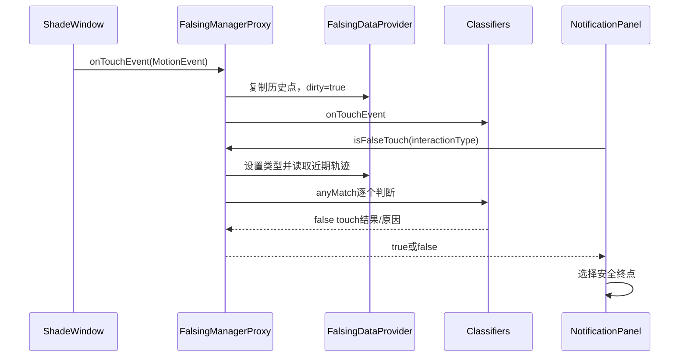
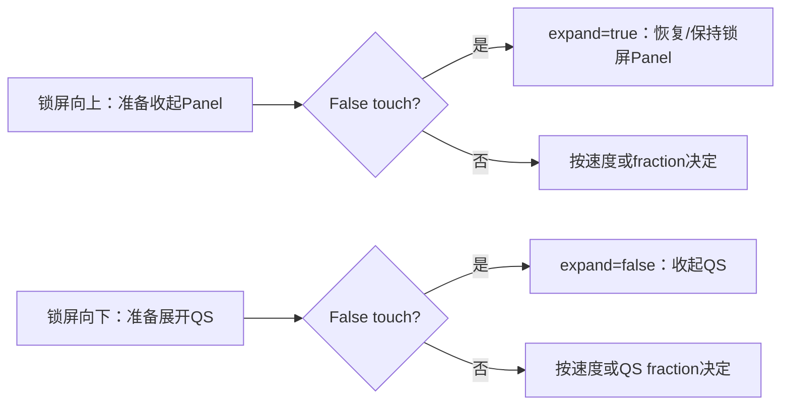

# 第 418 章 Android SystemUI PanelExpansion、Falsing、锁屏拖动、双击与误触边界

> 源码基线：Android 11 / API 30 / `android-11.0.0_r48`。本章只在 macOS 阅读、检索和推演源码，不编译。第417章讲“面板怎样移动”；本章继续回答“谁观察移动、谁判定误触，以及被判为误触后为何不是简单地什么都不做”。

## 1. 本章先解决什么问题

锁屏上滑、下拉QS、AOD单击/双击和暗色通知双击看起来都是触摸，但它们的目标、风险和失败后的安全方向不同。要读懂这段代码，必须把几何事件、交互语义、误触分类和最终UI动作拆成四层。

## 2. 一句话心智模型

`PanelExpansionListener`只报告“现在展开多少、手指是否还按着”；`FalsingManager`结合“这是什么交互”和触摸/近距数据判断可信度；真正选择展开、收起、弹Bouncer或唤醒的仍是各业务控制器。

## 3. 本章与第417章的边界

第417章已经解释高度、速度、fling和PanelBar收敛。本章不重复完整动画，而专看扩展事件的消费者、锁屏反误触决策、两种双击入口以及判断结果如何改变终点。

## 4. 本章源码地图

主线是`PanelExpansionListener.java`、`PanelViewController.java`、`NotificationPanelViewController.java`、`NotificationShadeWindowViewController.java`、`FalsingManager.java`、`FalsingManagerProxy.java`、`BrightLineFalsingManager.java`、`FalsingDataProvider.java`、`DoubleTapHelper.java`和`ActivatableNotificationViewController.java`。

## 5. 它运行在哪个进程

这些类都在SystemUI进程内。只有真正唤醒时`PowerManager.wakeUp()`跨到电源服务，窗口或锁屏状态后续同步也可能跨Binder；触摸采样、分类器和View决策本身不是一次触摸一次跨进程。

## 6. 它主要运行在哪个线程

Shade触摸分发、面板监听、GestureDetector、DoubleTapHelper和UI动作主要在主线程。近距传感器的具体回调线程由传感器封装决定，但BrightLine内部没有用锁把所有字段变成任意线程安全对象，调用方仍依赖SystemUI规定的时序。

## 7. 先分清事实与政策

MotionEvent轨迹、展开比例和速度是事实；`UNLOCK`、`QUICK_SETTINGS`等interaction type是语义；“任一分类器认为可疑”是分类结果；“可疑时保持锁屏面板展开还是收起QS”才是业务政策。

## 8. PanelExpansion不是解锁事件

接口名字容易让人误以为它表示“解锁进度”。实际上它只带`expansion`和`tracking`，既没有速度、目标终点、取消原因，也没有“已解锁”布尔。消费者必须结合自己的状态理解它。

## 9. Falsing不是手势识别器的替代品

Panel仍先用slop、方向、速度和fraction判断动作；Falsing只在需要反误触时否决危险方向。它不负责直接改View高度，也不会自己展示Bouncer。

## 10. 图一：四层决策模型



## 11. PanelExpansionListener的两个回调

`onPanelExpansionChanged(float expansion, boolean tracking)`报告通知面板主展开；默认方法`onQsExpansionChanged(float expansion)`报告QS展开。默认实现为空，使只关心主面板的监听者无需实现QS回调。

## 12. expansion的约定

接口注释约定0表示collapsed、1表示expanded。实际值来自PanelViewController的`mExpandedFraction`，正常路径限制上界为1；它描述几何比例，不保证Shade Window此刻已经可安全隐藏。

## 13. tracking只表示手指直接拖动

tracking为true表示用户正直接控制Panel。抬手进入ValueAnimator后它变false，但expansion仍会逐帧变化，所以`tracking=false`不能解释为“动画结束”。

## 14. 为什么接口没有expanded布尔

PanelBar另有更宽的expanded判断，会把peek、Heads-up、instant expand、tracking和height animator算进去。PanelExpansionListener刻意只暴露比例与tracking，不能替代PanelBar的窗口可见性协议。

## 15. 主面板事件在哪里发出

`PanelViewController.notifyBarPanelExpansionChanged()`先通知PanelBar，再按注册顺序遍历`mExpansionListeners`。高度写入、tracking开始/停止、动画帧、布局补偿等路径都会调用它。

## 16. QS事件在哪里发出

`NotificationPanelViewController.setQsExpansion()`更新高度和布局后，遍历同一组listener并传入`getQsExpansionFraction()`。因此一个监听者可同时观察Panel与QS，但两个回调没有共同事务编号。

## 17. 监听者不会自动收到初始快照

`addExpansionListener()`只是把对象加入ArrayList，没有同步回放当前fraction。监听者若在面板已半开后才注册，要等下一次变化才得到状态。

## 18. r48没有removeExpansionListener

该类公开了add却没有对应remove。现有监听者通常与Panel同生命周期；若产品代码动态注册短命对象，会形成引用残留和重复回调风险。

## 19. 监听列表没有快照和异常隔离

源码直接按索引遍历ArrayList。监听者回调里新增元素可能同轮收到事件；异常会中断后续监听者；结构性删除虽没有公开API，若通过其他路径修改仍会影响遍历。

## 20. 相同值也可能重复回调

接口没有distinct-until-changed保证。DepthController自己比较`shadeExpansion`和`prevTracking`后早退，这正说明消费者不能假定每个回调都代表一个新数值。

## 21. StatusBarKeyguardViewManager怎样消费比例

它把Panel expansion映射给Bouncer expansion。锁屏显示、没有wake-and-unlock或launch transition时，面板上滑会同步改变Bouncer位置；这是一种视觉联动，不是凭据验证结果。

## 22. tracking怎样触发Bouncer

在Keyguard显示、fraction不是隐藏端、tracking为true、用户不能直接dismiss且Bouncer尚未显示/离场时，代码调用`mBouncer.show()`。所以Bouncer出现依赖比例、手指状态和安全状态的组合。

## 23. canDismissLockScreen为什么关键

Trust、生物识别或无安全锁可能让用户无需输入凭据即可dismiss。此时交互类型可用`UNLOCK`，也不必因上滑立刻展示凭据Bouncer。

## 24. NotificationWakeUpCoordinator如何消费比例

它只关心是否`expansion <= 0.9f`，用这个阈值改变pulsing Heads-up能否继续显示。越过0.9不是“解锁90%”，只是该组件自己的显示政策阈值。

## 25. DepthController如何从离散事件估速度

PanelExpansion没有直接提供velocity，DepthController以相邻fraction和elapsedRealtimeNanos差值估算速度，再限制范围并驱动Blur。回调间隔异常或漏帧会影响估算，因此它还保存前一时间戳和方向。

## 26. 同一fraction在不同状态含义不同

Keyguard、SHADE_LOCKED、普通SHADE、Pulsing和Bypass下，0.5都可能对应不同布局与安全含义。监听接口只提供共同几何量，不能抹平上层状态机。

## 27. FalsingManager接口为何很大

它不仅接收MotionEvent，还接收屏幕亮灭、AOD、Bouncer、QS、通知dismiss、affordance、pulse和unlock等语义事件。分类需要知道“用户想做什么”和“设备处于什么会话”。

## 28. interaction type有哪些

r48的`Classifier`定义QUICK_SETTINGS、NOTIFICATION_DISMISS、NOTIFICATION_DRAG_DOWN、NOTIFICATION_DOUBLE_TAP、UNLOCK、左右affordance、GENERIC、BOUNCER_UNLOCK和PULSE_EXPAND共十种类型。

## 29. 类型不是从轨迹自动猜出

调用方在决定业务入口后把类型传给`isFalseTouch(type)`，或通过`onTrackingStarted(secure)`等事件先更新类型。相同轨迹用于UNLOCK和QUICK_SETTINGS时可以得到不同分类结论。

## 30. Shade窗口怎样喂入触摸

`NotificationShadeWindowViewController.handleDispatchTouchEvent()`在窗口级较早调用`mFalsingManager.onTouchEvent()`，随后再给GestureDetector和各子View分发。这让分类器看到跨通知、空白区和Panel的统一轨迹。

## 31. 哪些事件不会进入Falsing

`shouldIgnoreTouch()`、触摸已取消、应用展开动画运行/等待等早退发生在喂入之前。因而分类器看到的是通过窗口前置门的轨迹，并非InputDispatcher送到窗口的绝对全集。

## 32. width和height在BrightLine中没有被使用

接口传入当前View宽高，但r48 `BrightLineFalsingManager.onTouchEvent()`只把MotionEvent交给DataProvider和分类器，忽略这两个参数。屏幕尺寸来自注入时的DisplayMetrics快照。

## 33. FalsingDataProvider为何展开历史点

一个MotionEvent可携带historical samples。DataProvider把历史点和当前点逐个复制到缓冲区，避免分类器只看到稀疏的Java分发频率。

## 34. 缓冲区只保留近期数据

`TimeLimitedMotionEventBuffer`按1秒年龄保存近期点；新ACTION_DOWN先清旧轨迹。这里的“近期”不是整次长手势的无限历史，慢而长的动作可能只剩后半段。

## 35. firstActual与firstRecent不同

`mFirstActualMotionEvent`保存本次真实DOWN；`mFirstRecentMotionEvent`是1秒缓冲中当前最早点。长手势中二者可能不同，分类器选择哪个会影响距离和方向语义。

## 36. dirty标志的意义

新MotionEvent或interaction type变化时DataProvider标dirty；首次查询会重算首尾点和角度并把dirty清掉。没有新数据的再次查询应复用上次分类结果。

## 37. 角度如何计算

它用近期首尾点的`atan2(deltaY, deltaX)`计算0到2π角度；不足两个点时用`Float.MAX_VALUE`。这只是首尾总体方向，ZigZag等分类器还会检查更细轨迹。

## 38. 屏幕密度为何参与分类

DataProvider保存xdpi/ydpi，DistanceClassifier可把像素运动换成物理尺度。单纯写死像素阈值会让高低密度屏表现不一致。

## 39. BrightLine会话何时活跃

必须同时满足屏幕on、StatusBar状态为KEYGUARD、且没有Showing AOD。状态监听、亮灭屏和AOD变化都会调用`updateSessionActive()`。

## 40. 会话开始做什么

设置session started、清除“刚用Face解锁”标志、注册近距传感器，并通知每个classifier开始会话。无线充电时不注册近距传感器。

## 41. 会话结束做什么

注销近距传感器，回收并清空MotionEvent缓冲，通知分类器结束会话，并把本轮`isFalseTouch`统计写入Metrics。结束不是简单改一个布尔。

## 42. QS展开为何暂停近距传感器

`setQsExpanded(true)`直接unregisterSensors；收起且session仍活跃时再register。Bouncer显示/隐藏也采用相似政策，减少不需要阶段的传感器工作。

## 43. BrightLine包含哪些分类器

r48按顺序加入PointerCount、Type、Diagonal、Distance、Proximity和ZigZag。它们分别关注多指、交互方向类型、对角线、距离/速度、近距覆盖与曲折轨迹。

## 44. 任一分类器拒绝就整体拒绝

代码使用stream `anyMatch`。短路意味着前面的分类器一旦返回true，后面的分类器本次不再执行`isFalseTouch()`，日志中也只保证出现首个拒绝原因。

## 45. classifier的interaction type会影响方向

例如UNLOCK通常期待向上，QUICK_SETTINGS通常期待向下；TypeClassifier不能只问“竖直吗”，还要问方向是否与当前业务相符。这也是类型必须由调用方准确传递的原因。

## 46. Proximity不等于单独一票否决

ProximityClassifier同时持有DistanceClassifier与时间覆盖信息，目的是把“近距传感器被遮住”和运动是否足够可信结合起来。不能把一次near事件直接翻译成所有触摸都拒绝。

## 47. 决定性源码：BrightLine的总门

```java
mPreviousResult = !ActivityManager.isRunningInUserTestHarness()
        && !mJustUnlockedWithFace
        && !mDockManager.isDocked()
        && mClassifiers.stream().anyMatch(
                classifier -> classifier.isFalseTouch());
```

## 48. 三个全局豁免

运行在user test harness、刚通过Face解锁、设备已dock时，BrightLine整体不会判false touch。它们不是某个分类器的阈值变化，而是在分类器集合外的总门。

## 49. previousResult缓存有何后果

若DataProvider不dirty，`isFalseTouch()`直接返回上次结果。Panel抬手路径可能先在`flingExpands()`查询一次，又在`fling()`参数里查询一次；第二次不会重复执行全部BrightLine分类器。

## 50. 图二：BrightLine数据与生命周期



## 51. 日志为何强调“可解释”

BrightLine类注释写明目标是让拒绝原因清晰。命中分类器时记录类名、interaction type和可选reason；userdebug/eng还保存近期swipe点，便于复盘而不是只看到一个false布尔。

## 52. recent swipe队列的细节

常量`RECENT_SWIPE_LOG_SIZE`是20，但裁剪循环却比较`RECENT_INFO_LOG_SIZE`的40。于是r48实际最多趋近40条swipe记录，名称和实现不一致，读dump时不要按常量名臆测容量。

## 53. mIsFalseTouchCalls在BrightLine中的落差

字段会在session结束和successful unlock时上报直方图并清零，但当前`isFalseTouch()`实现没有递增它。裸r48 BrightLine下这组统计通常不会如字段名暗示那样累计。

## 54. isUnlockingDisabled不是BrightLine拒绝

BrightLine实现固定返回false；`shouldEnforceBouncer()`也固定false。接口保留这些能力是为了旧实现或插件，不能把它们和分类器true混成一个来源。

## 55. FalsingManagerProxy负责什么

业务方永远注入Proxy；Proxy根据DeviceConfig选择旧`FalsingManagerImpl`或BrightLine，也允许FalsingPlugin替换内部实现，并把所有接口调用转发给当前对象。

## 56. 默认选择是什么

`BRIGHTLINE_FALSING_MANAGER_ENABLED`默认true。DeviceConfig变化时Proxy清理旧实现再构造新实现；因此运行中分类策略可以切换，不要求重启SystemUI。

## 57. 插件连接与断开不对称

插件连接时cleanup旧实现并采用插件返回的manager；插件断开时源码直接new旧`FalsingManagerImpl`，没有重新调用`setupFalsingManager()`恢复当前DeviceConfig选择。这会让原本启用BrightLine的进程落到旧实现。

## 58. Proxy里一个真实转发错误

`onNotificatonStopDraggingDown()`错误地转发为内部manager的`onNotificatonStartDraggingDown()`。BrightLine的stop当前为空，所以影响有限；插件或旧实现若区分start/stop，就会收到错误语义。

## 59. cleanup并没有移除插件监听

Proxy cleanup移除DeviceConfig listener并清理当前manager，但构造函数里的PluginListener只保存在局部变量，源码没有对应remove。SystemUI单例正常长生命周期下不常触发；动态销毁测试需注意。

## 60. 旧实现为何还必须理解

若DeviceConfig关闭BrightLine、插件断开或产品定制，Panel会走legacy分支：用移动阈值与方向做本地判断，同时旧FalsingManager还可能返回unlocking disabled。不能只按默认BrightLine推断所有设备。

## 61. 何时根本不需要Falsing

Panel的`isFalseTouch()`先问`StatusBar.isFalsingThresholdNeeded()`。普通已解锁Shade等不需要保护的状态直接false，后面的classifier或本地阈值都不执行。

## 62. Panel本地阈值是多少

资源`unlock_falsing_threshold`在默认dimens中为80dp，运行时转为像素。它与touch slop用途不同：slop决定是否开始拖动，falsing threshold决定上滑是否足够可信。

## 63. 触摸唤醒为何把阈值乘1.5

若`StatusBar.isWakeUpComingFromTouch()`为true，Panel和QS各自的falsing threshold都乘1.5。刚从暗屏触摸唤醒时要求更明确的后续移动，降低同一次触碰误解锁。

## 64. Panel阈值只看向上距离

MOVE中条件是`-h >= threshold`，也就是相对手势原点向上移动足够远。到达阈值时还记录`mUpwardsWhenThresholdReached`，判断纵向上移是否至少与横移一样大。

## 65. legacy方向为何检查两次时刻

若过阈值瞬间已明确向上，直接可信；否则抬手时再用最终坐标检查一次方向。这样允许手势前段偏斜、后段修正，但未过阈值仍一律可疑。

## 66. flingExpands的安全优先级

先检查unlocking disabled，再检查false touch；任一成立都返回expand=true。只有可信后才按最低fling速度选择fraction大于0.5，或按Y速度正负选择展开/收起。

## 67. 为什么false touch反而展开Panel

锁屏向上收起Panel可能进入解锁/Bouncer路径，是更敏感动作。把手势判可疑时保持或恢复面板展开，等于“拒绝解锁方向”，而不是奖励用户展开。

## 68. CANCEL为何在Keyguard也展开

`endMotionEvent()`遇到ACTION_CANCEL或forceCancel，在Keyguard固定选择expand=true；非Keyguard恢复到DOWN前的开闭状态。这同样遵循锁屏失败时回到安全侧。

## 69. interaction type怎样选

垂直速度大于0（向下）使用QUICK_SETTINGS；否则，若能dismiss锁屏使用UNLOCK，不能dismiss则使用BOUNCER_UNLOCK。这里的类型既描述方向，也携带安全上下文。

## 70. 同一次抬手为何看似查询两次

一次在`flingExpands()`决定终点，随后又把`isFalseTouch(...)`结果传给`fling()`作为`expandBecauseOfFalsing`。BrightLine靠dirty缓存保持一致；热切换内部manager或有副作用的插件实现仍可能放大两次调用差异。

## 71. expandBecauseOfFalsing有什么用

它不是最终方向，而是告诉动画“这次展开是因为拒绝了可疑收起”。FlingAnimationUtils可以据此采用不同速度处理，避免安全回弹显得像普通用户主动展开。

## 72. onTrackingStarted传入的secure含义

NPVC调用`onTrackingStarted(!canDismissLockScreen())`。BrightLine据此预设BOUNCER_UNLOCK或UNLOCK类型；抬手仍会以实际速度和状态再次传明确interaction type。

## 73. onTrackingStopped在BrightLine为空

接口事件仍被调用，但BrightLine没有在这里结束整个falsing session。会话由屏幕、KEYGUARD、AOD和successful unlock控制，不能把一次手指抬起等同于会话结束。

## 74. QS为何采用相反的失败终点

`flingExpandsQs()`遇到unlocking disabled或false touch直接返回false，也就是收起QS。锁屏上意外展开快捷设置可能暴露开关或引发操作，因此安全侧是不要展开更多控制面板。

## 75. 图三：Panel与QS的相反安全方向



## 76. QS本地阈值如何累计

ACTION_DOWN时若QS本来fully expanded，`mQsTouchAboveFalsingThreshold`直接为true；否则向下位移`h >= threshold`才置true。与Panel向上检查`-h`正好相反。

## 77. QS是否总做反误触

不是。它先问KeyguardAffordanceHelper callback的`needsAntiFalsing()`；不需要时直接false。需要时BrightLine走统一分类，legacy才检查QS本地阈值。

## 78. QS低速与高速终点

可信且绝对速度低于最小fling速度时，用QS expansion fraction是否大于0.5；高速时向下速度为正才展开。和Panel类似，但状态变量与失败安全侧不同。

## 79. 锁屏拖动不是一次“连续解锁百分比”

Panel fraction可以驱动Bouncer视觉位置，但最终能否dismiss还依赖Keyguard安全状态、Falsing、凭据或生物认证。把fraction直接当认证进度会造成严重误解。

## 80. 多指为什么会强制取消

Panel在KEYGUARD收到POINTER_DOWN会abort当前motion并forceCancel；安全终点因此是展开Panel。BrightLine还有PointerCountClassifier，两层并存：前者可在业务层立即中止，后者用于其他仍到达分类阶段的多指交互。

## 81. 屏幕刚亮与普通亮屏手势不同

`wakeUpIfDozing()`成功触发时设置`mWakeUpComingFromTouch=true`并通知Falsing screen on from touch。后续阈值放大就是跨手势阶段保存的上下文，而不是MotionEvent自身携带的标志。

## 82. 这个touch-wakeup标志何时清理

r48在`WakefulnessLifecycle.Observer.onFinishedGoingToSleep()`把它清为false，同时清空touch location；抬手或完成亮屏并不会在本章链路里立刻清零。它会在本次清醒周期继续影响阈值，诊断必须把Wakefulness回调一起读。

## 83. “双击”至少有两套完全不同语义

NotificationShadeWindowViewController的GestureDetector处理Doze单/双击唤醒；DoubleTapHelper处理dimmed锁屏通知第一次激活、第二次点击。它们的时间、slop、回调和Falsing关系都不同。

## 84. AOD手势开关从哪里来

setupExpandedStatusBar向TunerService注册`DOZE_DOUBLE_TAP_GESTURE`和`DOZE_TAP_SCREEN_GESTURE`。回调新建AmbientDisplayConfiguration，并按USER_CURRENT刷新两个布尔。

## 85. 当前用户切换如何影响开关

TunerService会在用户切换时重载已注册Secure键，因此这里的USER_CURRENT会重新解析到新前台用户。Tunable本身是局部变量，但被TunerService强引用，且没有在该控制器里remove。

## 86. 单击唤醒的门

`onSingleTapConfirmed()`要求single-tap enabled且设备没有docked，才调用`wakeUpIfDozing(..., "SINGLE_TAP")`并返回true。

## 87. 双击唤醒的门很反直觉

`onDoubleTap()`使用`mDoubleTapEnabled || mSingleTapEnabled`。只要单击唤醒打开，双击也会进入唤醒调用；不能把它解释为严格只受double-tap设置控制。

## 88. Dock限制在单双击间不对称

单击显式要求`!mDockManager.isDocked()`，双击没有dock检查。即使同一个GestureDetector，这两条政策也不同，不能用单击规则推导双击。

## 89. GestureDetector收到事件不等于一定唤醒

窗口控制器无条件把通过前置门的触摸交给GestureDetector；监听回调还要检查设置。最后`StatusBar.wakeUpIfDozing()`只有mDozing为true才真正调用PowerManager。

## 90. 已经亮屏时会怎样

GestureDetector仍可能识别并返回true，但wakeUpIfDozing内部mDozing为false时什么也不做，也不会设置wake-up-coming-from-touch或通知Falsing开始亮屏会话。

## 91. 唤醒坐标不是手指坐标

`wakeUpIfDozing()`用传入View在Window中的位置加宽高一半，保存View中心为`mWakeUpTouchLocation`。传入整个Shade View时，它不是MotionEvent真实点击点。

## 92. PowerManager调用携带什么

使用当前uptime、`WAKE_REASON_GESTURE`和`com.android.systemui:`加why字符串。这个Binder请求表示“请求唤醒”，像素何时亮、Keyguard何时可交互仍由后续电源/显示状态机决定。

## 93. singleTapConfirmed为什么有延迟感

GestureDetector需要等待确认没有形成double tap后才触发single-tap confirmed。用户感到的延迟是双击消歧协议的一部分，不等于主线程一定卡顿。

## 94. Shade触摸同时送给Falsing与GestureDetector

窗口代码先`mFalsingManager.onTouchEvent()`，再`mGestureDetector.onTouchEvent()`。但BrightLine的Doze状态下session通常不活跃；唤醒手势识别也没有调用`isFalseTouch()`来决定是否唤醒。

## 95. DoubleTapHelper服务于什么

它用于锁屏上被dim的通知：第一次轻触激活并高亮，第二次在允许范围内才执行notification view的`performClick()`。这是防止口袋触碰直接打开通知的两步确认UI。

## 96. 它的双击超时是多少

源码自定义`DOUBLETAP_TIMEOUT_MS = 1200`，并非直接使用ViewConfiguration的标准double-tap timeout。第一次UP后postDelayed，超时则makeInactive。

## 97. 两种slop分别约束什么

每次tap内部移动使用系统scaled touch slop；两次tap之间位置差使用资源`double_tap_slop`，默认32dp。前者防止把拖动当点击，后者要求第二次靠近第一次。

## 98. 第一次tap发生什么

UP仍在touch slop内且当前未activated时，调用activation listener、记录activation X/Y并安排1200ms超时。它不会立刻执行通知点击。

## 99. 第二次tap发生什么

若activated且在double-tap slop内，先记录accepted/dx/dy，再makeInactive，最后调用DoubleTapListener。通知控制器传入的是`mView::performClick`。

## 100. 点击回调返回false的细节

Helper已经先makeInactive，再执行listener；若listener返回false，当前onTouchEvent返回false。激活视觉状态已撤销，但事件消费结果可能继续影响父级分发。

## 101. SlideBack拥有更高优先级

每次有效UP先尝试`SlideBackListener.onSlideBack()`；若返回true，直接消费，不进入激活或第二击逻辑。通知行横向交互可借此接管。

## 102. 超出实际通知高度的DOWN

控制器以`mView.getActualHeight()`作为maxTouchableHeight；DOWN在其下方会把trackTouch设false。布局View边界可能大于实际可见通知内容，因此需要这道门。

## 103. 何时才启用通知双击

必须`mNeedsDimming`、触摸探索未开启且通知View可交互。若内容实际不能dim但标志需要dim，代码返回false以保留普通ripple路径。

## 104. 无障碍为何绕过双击确认

Touch exploration开启时不使用DoubleTapHelper，避免和TalkBack自己的探索/激活手势冲突。安全交互不能只考虑触摸误判，也要保证可访问性协议可用。

## 105. intercept怎样阻止错误第二击

dimmed通知若`disallowSingleClick()`且尚未active，DOWN先被拦截；若已active但第二次DOWN超出double-tap slop，则设置block-next-touch、让View失活并消费，避免远处点击沿用旧激活。

## 106. DoubleTapHelper与BrightLine的连接很弱

Controller把双击结果传给`FalsingManager.onNotificationDoubleTap(accepted, dx, dy)`。r48 BrightLine实现该方法为空；真正是否执行点击由Helper几何判断，而不是BrightLine `isFalseTouch()`。

## 107. 为什么不能统称为“Falsing双击”

AOD GestureDetector根本不查询false touch；通知DoubleTapHelper只向Falsing报告结果且BrightLine不消费。Falsing与双击存在数据/接口连接，不等于它统一裁决所有双击。

## 108. 动态切换manager的在途边界

Proxy可在一次触摸序列中因DeviceConfig或插件切换内部实现。旧manager被cleanup，新manager没有收到此前DOWN/历史事件，抬手查询可能基于不完整轨迹；源码没有generation把整次gesture固定到同一实现。

## 109. 可观测性从哪里找

`dumpsys activity service SystemUI ...`进入DumpHandler后可看到注册名`FalsingManager`的dump；BrightLine打印enabled、face-unlock、dock、屏幕尺寸、recent swipes和recent info。Panel终点还要结合DozeLog、Keyguard状态与Window dump。

## 110. 一条完整锁屏上滑阅读链

ShadeWindow先喂MotionEvent；Panel越slop后tracking并告知Falsing交互安全性；MOVE更新fraction并驱动Bouncer/Blur等监听；UP以速度选择type，查询false touch；可疑则Panel回弹展开，可信才可能收起并进入Bouncer或dismiss链。

## 111. 最常见的六个误解

一是把fraction当认证进度；二是把tracking=false当动画完成；三是认为false touch总等于收起；四是把AOD双击和通知双击混为一谈；五是认为近距near必然拒绝；六是认为默认BrightLine意味着运行中不可能切回legacy或插件。

## 112. macOS只读练习一：追踪Panel事件消费者

用`rg -n 'onPanelExpansionChanged\(' frameworks/base/packages/SystemUI/src/com/android/systemui`定位实现，分别记录Bouncer、通知唤醒和Blur怎样解释同一fraction。不要修改源码，不运行编译。

## 113. macOS只读练习二：推演三条上滑轨迹

在纸上设计“未过80dp”“过阈值但横移更大”“过阈值且明确向上”三条轨迹，按legacy分支逐条件判断；再写出BrightLine启用时为什么不能仅凭80dp得出结论。

## 114. macOS只读练习三：比较Panel与QS失败方向

分别从`flingExpands()`和`flingExpandsQs()`抄出前两个early return，画出false touch与unlocking disabled时的终点，解释为什么一个返回true、另一个返回false。

## 115. macOS只读练习四：区分两套双击

只读比较`NotificationShadeWindowViewController`和`DoubleTapHelper`：列出开关来源、时间窗口、空间阈值、最终动作、是否查询`isFalseTouch()`以及无障碍分支。

## 116. 练习预期结论

PanelExpansion是共享几何信号；legacy阈值只在classifier关闭时生效；锁屏Panel和QS选择相反安全侧；Doze双击请求唤醒，通知双击确认点击，两者都不能简单写成“由BrightLine批准”。

## 117. 复读源码后修正了哪些容易误讲之处

复读后明确：双击唤醒使用double OR single设置；单击有dock门而双击没有；BrightLine忽略onTouchEvent宽高参数；isFalseTouch无dirty时回用previousResult；Proxy的notification stop转发错误；插件断开固定恢复legacy；recent swipe裁剪错用了40。

## 118. 本章没有覆盖什么

各BrightLine classifier的每个DeviceConfig公式、Keyguard完整认证状态机、DozeSensors硬件手势注册和通知点击PendingIntent链将在后续章节展开。本章只建立它们与Shade触摸的边界。

## 119. 阅读完成检查表

应能解释PanelExpansion两个参数的不足、Falsing四层模型、BrightLine会话和六分类器、Panel/QS相反失败方向、80dp与1.5倍规则、两套双击及Proxy的运行中切换边界。

## 120. 本章结论

Android 11的反误触不是一个万能“拒绝触摸”开关，而是事实采样、交互类型、分类器与业务安全方向共同完成的协议。读源码时先问“这个动作失败后最安全的终点是什么”，许多看似相反的返回值就会变得合理。
