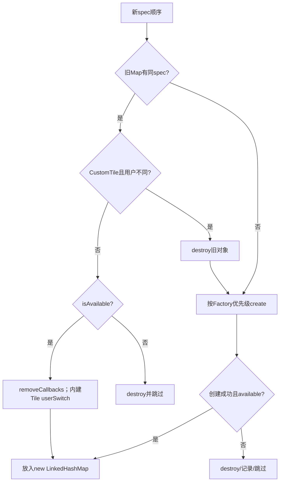
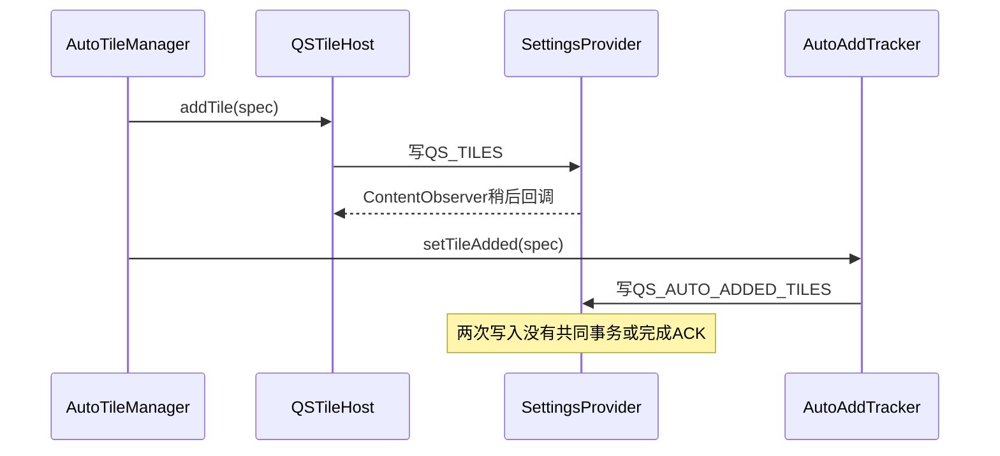

# 第 419 章 Android SystemUI QSTileHost：规格解析、Tile创建、重建、用户切换与持久化

> 源码基线：Android 11 / API 30 / `android-11.0.0_r48`。本章只在 macOS 阅读、检索和推演源码，不编译。重点不是某个Tile怎样开关功能，而是QSTileHost怎样把一串spec变成当前用户可见的有序Tile对象。

## 1. 本章先解决什么问题

Quick Settings看起来是一排按钮，底层却要回答：默认顺序从哪来、用户编辑存到哪、`wifi`怎样变成对象、第三方Tile怎样绑定到用户、切换用户时哪些对象复用、插件接入为何触发重建，以及创建失败后怎样恢复。

## 2. 一句话心智模型

`Settings.Secure.QS_TILES`保存“期望的有序spec列表”，QSTileHost把它解析成`mTileSpecs`，再通过按优先级排列的QSFactory创建/复用`mTiles`；QSTile对象是运行态投影，不是持久化真相。

## 3. 先分清四种对象

spec是字符串身份，如`wifi`；spec list是用户期望的顺序；QSTile是业务对象；QSTileView是Panel里的视觉对象。Host本章主要管前三者，View布局在第421章展开。

## 4. 本章源码地图

主线是`QSTileHost.java`、`QSFactoryImpl.java`、`QSTileHost`依赖的TunerServiceImpl、`CustomTile.java`、`TileLifecycleManager.java`、`AutoTileManager.java`、`AutoAddTracker.java`，以及SystemUI `res/values/config.xml`。

## 5. 它运行在哪个进程

Host、内建Tile和Tile列表都在SystemUI进程。第三方CustomTile后续通过TileServices绑定应用的TileService才跨进程；Secure设置读写会通过ContentResolver进入SettingsProvider。

## 6. 它主要运行在哪个线程

Host构造、Tuner回调、Tile集合替换和Panel callback按设计在主线程。AutoTileManager持有后台Handler，用户切换可能post到它；代码本身没有锁保护`mTiles`和`mTileSpecs`，不要把公开方法当任意线程安全API。

## 7. QSTileHost到底是什么

它同时实现QSHost、Tunable、QSFactory插件监听和Dumpable：既给Tile提供宿主能力，又监听列表设置，管理Factory优先级，最后向QSPanel广播Tile集合变化。

## 8. 持久化键是什么

`TILES_SETTING`直接等于`Settings.Secure.QS_TILES`。Secure设置按用户保存，因此不同用户天然可以拥有不同顺序，不需要Host自己维护一份跨用户XML。

## 9. 为什么使用LinkedHashMap

`mTiles`是`LinkedHashMap<String,QSTile>`，遍历值时保持插入顺序；key用于按spec复用对象。`mTileSpecs`则保留完整期望列表，包括暂时无法创建的spec。

## 10. 图一：从设置到Panel的对象投影


## 11. 构造函数先装哪些基础设施

它保存Controller、Tuner、Plugin、Dump、日志等依赖，新建TileServices和InstanceIdSequence，把默认Factory先放入列表，再订阅QSFactory插件并注册dump。

## 12. 为什么不在构造函数同步创建Tile

源码用mainHandler.post延迟`addTunable()`，注释称这是规避`QSTileHost -> XXXTile -> QSTileHost`构造循环的hack。Dagger先完成Host对象，再由下一条主线程消息创建Tile。

## 13. addTunable会立即回放

TunerService注册ContentObserver后同步读取当前用户的Secure值，并立刻调用`onTuningChanged()`。所以post中的addTunable返回前，首批Tile通常已经建立。

## 14. AutoTileManager为何在其后创建

同一个Runnable先addTunable，再`autoTiles.get()`。注释明确AutoTileManager可能修改Tile列表，必须等Host的`mTiles`完成首次初始化。

## 15. 延迟初始化带来的destroy边界

`destroy()`直接调用`mAutoTiles.destroy()`且没有null检查，也没有取消构造时post的Runnable。若极端情况下Host在Runnable执行前销毁，会NPE；Runnable也可能随后重新注册Tunable。

## 16. loadTileSpecs的输入规则

输入null或空字符串时，不表示“零个Tile”，而是改用资源`quick_settings_tiles`。默认资源内容是单词`default`，再展开为真正默认列表。

## 17. default占位符怎样展开

解析逗号字符串时遇到精确的`default`，调用`getDefaultSpecs()`插入资源`quick_settings_tiles_default`。布尔`addedDefault`确保多个default只展开一次。

## 18. 普通spec怎样清洗

每段先trim，空段跳过；`ArraySet addedSpecs`保证同一spec只保留第一次出现的位置。输入`wifi,bt,wifi`最终是`wifi,bt`。

## 19. 未知spec会在解析时删除吗

不会。parser只处理文本与去重，不验证Factory是否认识它。未知、拼错或当前不可用的spec仍进入`mTileSpecs`，创建阶段才可能没有对应QSTile。

## 20. getDefaultSpecs做什么

它把`quick_settings_tiles_default`按逗号split，并在debuggable且GarbageMonitor开关允许时追加MemoryTile。这里与通用parser不同，没有再逐项trim和统一去重。

## 21. r48默认Tile顺序

裸AOSP资源依次是wifi、bt、dnd、flashlight、rotation、battery、cell、airplane、cast、screenrecord。产品overlay可以替换资源，因此设备实际默认值不应从Java switch硬猜。

## 22. stock资源不是当前列表

`quick_settings_tiles_stock`用于编辑器区分内建/默认候选等用途，不是Host的持久列表，也不是Factory支持项的权威注册表；它包含的字符串与Java Factory可能存在产品或版本差异。

## 23. Demo模式的特殊默认

只有`newValue == null`且设备处于retail demo mode时，Host改用`quick_settings_tiles_retail_mode`。显式空字符串不是null，会走普通默认资源，而不是retail列表。

## 24. 三层默认值不要混淆

Secure值决定用户定制；`quick_settings_tiles`决定“没有值/空值时的模板表达式”；`quick_settings_tiles_default`才是default占位符展开内容。产品可把第一层模板写成`default,custom(...)`等组合。

## 25. onTuningChanged的第一道门

key不是QS_TILES直接return。正确key则记录recreating日志、处理demo、解析spec，并通过`ActivityManager.getCurrentUser()`获得运行时前台用户。

## 26. 为什么不用Tuner回调直接传userId

Tunable接口只有key/value，没有user参数。TunerService用户切换时先更新自己的current user再reload；Host只能再次问ActivityManager，并维护独立`mCurrentUser`。

## 27. userContext是什么

检测用户变化时，用base SystemUI Context创建`createContextAsUser(currentUser)`。CustomTile创建、包查询和资源访问必须面向目标用户，不能一直使用user0 Context。

## 28. AutoTileManager怎样跟随用户

若它已经初始化，Host调用`changeUser(newUser)`。AutoTileManager发现当前线程不是自己的后台Handler线程时会post，随后停旧用户监听、切AutoAddTracker和setting observer语义、再启新用户监听。

## 29. 相等早退比较什么

只有新解析列表等于`mTileSpecs`且currentUser也等于`mCurrentUser`才return。用户变化即使spec文本相同，也必须更新Context、CustomTile和内建Tile用户态。

## 30. 重建并非总是全部new

Host先销毁新列表已经不含的旧spec，再逐spec尝试复用；只有无旧对象、CustomTile用户不匹配或旧对象不可用等情况才创建/销毁。

## 31. 被移除spec怎样销毁

旧Map中key不在新spec list的项立即`tile.destroy()`并写QSLogger。这个阶段只看字符串是否还存在，不关心Tile当前是否展示在某一页。

## 32. 内建Tile何时复用

旧对象存在且不是CustomTile时先检查`isAvailable()`；可用则removeCallbacks，用户变化时调用`tile.userSwitch(currentUser)`，再按新顺序放入newTiles。

## 33. removeCallbacks不是destroy

复用前清的是Tile注册的业务callback集合，避免旧Panel/View监听残留；对象自身Handler、Controller依赖与生命周期仍保留，随后会被新Panel重新监听。

## 34. userSwitch是不是重新构造

不是。内建Tile保留同一个Java对象并收到userSwitch消息；具体Tile必须在自己的实现中刷新按用户设置。是否真的完全清理旧用户缓存要继续读每个Tile。

## 35. CustomTile为什么不能跨用户复用

它封装目标用户的TileService、PackageManager信息和Binder生命周期。只有`CustomTile.getUser() == currentUser`才可复用，否则先destroy，再用新userContext重建。

## 36. 同用户CustomTile也可能复用

只要spec仍存在、user相同且isAvailable，Host会沿复用分支，不会因一次普通设置重放就重新bind所有第三方服务。

## 37. 创建新Tile的步骤

Host依次问每个QSFactory；拿到非null对象后setTileSpec，再问isAvailable。可用才放进Map，不可用立即destroy；Throwable被外层catch并记录，不阻断后续spec。

## 38. Factory顺序为何重要

默认Factory构造时在列表末端；插件连接后插入索引0。`createTile()`返回第一个非null结果，因此插件理论上可以用同一spec覆盖默认创建逻辑。

## 39. QSFactoryImpl怎样创建内建Tile

它用switch把wifi、bt、cell、dnd等spec映射到Dagger Provider的`get()`。Provider创建依赖完整的Tile对象，不是反射类名，也不是从spec动态加载任意Java类。

## 40. CustomTile spec的格式

以`custom(`开头、`)`结尾，中间是ComponentName的flatten字符串，例如`custom(com.example/.MyTileService)`。Factory用Host当前userContext创建CustomTile。

## 41. debug Tile怎样出现

MemoryTile只在`Build.IS_DEBUGGABLE`且spec等于专用值时可创建；user构建即使设置里残留该spec，Factory也会返回null。

## 42. 未知spec的结局

默认Factory记录“No stock tile spec”并返回null；其他Factory也不接管则Host跳过它。只要还有至少一个有效Tile，未知spec仍保留在`mTileSpecs`和Secure字符串中。

## 43. handleStale为什么在Factory中调用

QSFactoryImpl创建成功后立即`tile.handleStale()`，让新Tile安排一次状态刷新。具体Handler、stale timeout和State复制属于第420章；本章只需知道new对象不会长期保持未初始化状态。

## 44. setTileSpec为何早于isAvailable

Tile的availability或stale timeout可能需要知道自身位置/spec；Host先设身份再验证。不可用对象虽然不进Map，也已短暂经历构造和spec赋值，最后必须destroy释放注册。

## 45. availability不是字符串合法性

内建Tile可因硬件/用户政策不可用；CustomTile在r48主要以默认icon是否解析成功判断可用。合法Component并不保证服务包、图标和当前用户安装状态满足展示条件。

## 46. 部分不可用时为何不改设置

只要newTiles非空，Host接受运行态子集并保留完整spec list。这样硬件或包以后恢复时理论上仍记得用户顺序，但相同spec和同user的后续回调会早退，重试需要其他重建触发。

## 47. 决定性源码：运行态允许是持久态的子集

```java
mTileSpecs.clear();
mTileSpecs.addAll(tileSpecs);
mTiles.clear();
mTiles.putAll(newTiles);
if (newTiles.isEmpty() && !tileSpecs.isEmpty()) {
    changeTiles(currentSpecs, loadTileSpecs(mContext, ""));
}
```

## 48. Map顺序怎样重排

newTiles按新tileSpecs循环顺序put，即使复用同一对象，LinkedHashMap顺序也会改变。之后一次性clear旧Map再putAll，避免Panel看到半套Map。

## 49. 用户字段何时提交

所有创建循环完成后才设置`mCurrentUser=currentUser`、替换spec和Map。创建过程中Factory取Host userContext已是新用户，但`mCurrentUser`仍是旧值，这种双账过渡只靠主线程不被外部重入打断。

## 50. 回调何时发出

正常分支在Map完全替换后按顺序调用每个Host callback的`onTilesChanged()`。回调收到通知时可以读取新集合，但创建Tile内部更早的异步状态刷新可能尚未完成。

## 51. 图二：一次onTuningChanged的复用与创建决策



## 52. Host callback有初始回放吗

`addCallback()`只add到ArrayList，没有立即调用。QSPanel通常先完成接线再由Host变化触发，动态晚注册者需主动读取`getTiles()`或等待下一次通知。

## 53. callback列表有什么边界

不去重、不做快照、没有异常隔离。重复注册会重复回调；回调中删除自身可能让后一项被跳过；一个callback抛异常会阻断后续并从onTuningChanged向外传播。

## 54. “没有有效Tile”如何恢复

当期望spec非空但newTiles一个也没创建成功，Host调用`changeTiles(currentSpecs, loadTileSpecs(context,""))`，把Secure设置写回普通默认列表，防止QS永久空白。

## 55. 恢复不是当前栈内立刻重建

`changeTiles()`主要写Settings.Secure。当前onTuningChanged已经把Map设为空；要等ContentObserver再次回调，才用默认spec建立新对象，所以存在短暂空集合窗口。

## 56. 真正空列表会触发恢复吗

不会。条件还要求`!tileSpecs.isEmpty()`。若资源模板或输入解析后确实为空，Host接受空Map并通知callback；“用户主动清空”是否允许通常由Customizer最小Tile政策约束，不在这里强制。

## 57. 只剩一个有效Tile会怎样

不会恢复默认。恢复门只看newTiles是否完全空，不检查`quick_settings_min_num_tiles`。最小数量主要是编辑UI政策，不是Host运行态硬门。

## 58. add/remove字符串为何重读Secure

`changeTileSpecs()`不直接复制mTileSpecs，而是重新读当前用户QS_TILES并解析，再应用Predicate。这样可减少运行态列表落后于刚写设置时覆盖外部更改的风险。

## 59. 但重读空值会带来什么

null/empty会先扩成默认列表，所以`addTile("hotspot")`是在默认列表后追加，不是从空持久串只写一个Tile；remove则从解析后的有效默认顺序删除。

## 60. addTile(String)放在哪里

Predicate执行`!contains && add`，因此普通spec追加到末尾且不重复。没有校验Factory是否能创建，写入未知spec仍然可能成功。

## 61. removeTile(String)的幂等性

只有remove实际返回true才写设置。目标不存在时不写、不触发Observer；这避免无意义重建，也意味着不能靠重复remove修复先前失败的Secure写。

## 62. saveTilesToSettings写什么

把list用逗号join，按`mCurrentUser`调用Secure.putStringForUser；tag为null、default=false，并声明`overrideableByRestore=true`。

## 63. overrideableByRestore的含义

它告诉SettingsProvider/备份恢复语义该值可被restore覆盖，不表示写入会自动备份成功，也不表示Host对恢复中的Tile包存在性做事务校验。

## 64. 写入返回值被检查吗

没有。`putStringForUser`的boolean结果被忽略；写失败时内存Map可能仍是旧状态，调用方也没有失败回调。后续是否变化取决于Settings observer是否收到真实提交。

## 65. 写设置为何不是同步改Map

Host坚持以Tuner回调为统一重建入口。add/remove/changeTiles先写持久态，ContentObserver再回读并替换运行态，形成单向数据流但也引入异步窗口。

## 66. ComponentName版本的add为何不同

它直接基于当前`mTileSpecs`复制列表，再调用changeTiles；默认插到索引0，`end=true`才追加末尾。第三方Tile由系统或TileService入口加入时常希望更显眼。

## 67. ComponentName怎样编码

`CustomTile.toSpec()`使用`flattenToShortString()`包进`custom(...)`。contains检查基于完整spec字符串，同一component不会被正常API重复加入。

## 68. removeTile(ComponentName)做什么

复制当前mTileSpecs，移除编码后的spec并调用changeTiles。即便spec不存在，changeTiles仍会保存相同列表，因为该方法没有相等early return。

## 69. changeTiles为何需要previousTiles

新旧列表不只用于保存：Host必须找出被移除的CustomTile，向远端TileService发送stop listening和tile removed生命周期，再清“已添加”标志。

## 70. previousTiles由调用方提供的风险

Host没有验证previousTiles等于当前Secure或mTileSpecs。Customizer传入过期列表时，可能漏发某个CustomTile removal，或给并未真正移除的component发送移除生命周期。

## 71. CustomTile移除的具体顺序

对旧列表中以`custom(`开头且新列表不含的spec，新建TileLifecycleManager，依次`onStopListening()`、`onTileRemoved()`、setTileAdded false，最后flush messages and unbind。

## 72. 这里使用哪个Handler

源码直接`new Handler()`，绑定调用线程Looper。正常由主线程Customizer/Host调用；若无Looper线程调用会构造失败，再次说明changeTiles不是任意后台线程API。

## 73. 生命周期完成有ACK吗

调用把消息交给TileLifecycleManager并flush/unbind，但第三方进程可能未连接、死亡或Binder调用失败。保存新列表不等待应用确认，也不会因确认失败回滚。

## 74. setTileAdded false保存在哪

TileLifecycleManager用per-user SharedPreferences标记component不再被系统视为added。它与Secure.QS_TILES是两张账，写入顺序和失败可以分叉。

## 75. 内建Tile移除为何没有这套通知

它们属于SystemUI自身，没有外部TileService需要收到onTileRemoved。列表设置变化后旧QSTile.destroy即可释放Controller监听。

## 76. changeTiles最后只做什么

完成CustomTile移除通知后调用saveTilesToSettings(newTiles)。它不直接构造新增CustomTile，新增部分仍等待Tuner回调统一处理。

## 77. malformed custom spec的危险点

onTuningChanged创建路径有Throwable catch；但changeTiles扫描旧custom spec时直接`getComponentFromSpec()`，没有外围catch。格式以custom开头却缺坏Component时，移除流程可能抛异常并阻止保存新列表。

## 78. CustomTile.getComponentFromSpec也可能返回null

它只检查中间字符串非空，随后返回`ComponentName.unflattenFromString()`结果；格式不合法可能是null。下游Intent/生命周期代码没有在Host这一层显式拒绝null。

## 79. 插件连接时发生什么

Plugin factory插到索引0，读取当前TILES_SETTING，然后依次调用`onTuningChanged(key,"")`和原value；注释声称这是强制移除并重建全部Tile。

## 80. 空字符串其实不是空列表

`loadTileSpecs(" ")`会加载`quick_settings_tiles`并展开default。所以第一次调用只是切换到默认spec，不是把Map清空；与默认列表共有的Tile会被复用。

## 81. 当前本来是默认列表时更明显

第一次空字符串解析后与mTileSpecs完全相等且用户没变，会直接return；第二次原value若也是null/default也继续return。插件虽获得Factory优先级，现有Tile完全没有重建。

## 82. 插件覆盖同名Tile不保证立即生效

即使当前列表非默认，两轮切换也会复用共有spec的旧对象。只有先前不在默认、被第一轮移除，再由第二轮新增的spec较可能经插件重新create；源码注释强于实际行为。

## 83. 插件断开采用同一策略

先remove factory，再空字符串/原值两轮。由插件创建但spec也在默认列表的对象可能被复用，理论上继续存活，直到其他原因真正destroy；插件卸载生命周期是否另有保护需结合PluginManager。

## 84. Factory抛异常怎样处理

Host创建每个spec的外层try/catch会捕获包括插件Factory在内的Throwable，记录后继续下一个spec。但某插件在前面返回一个不可用Tile，会destroy并停止，不会继续尝试后面的默认Factory补位。

## 85. createTileView的失败策略更严格

Host同样按Factory顺序找第一个非null View；全部返回null时直接抛RuntimeException“Default factory didn't create view”。这里没有像Tile创建那样按spec吞Throwable。

## 86. 用户切换的触发顺序

TunerService的CurrentUserTracker先把自己的mCurrentUser改为newUser，再`reloadAll()`，最后注销并按新用户重新注册所有ContentObserver。Host在reload回调里完成用户对象切换。

## 87. reload与reregister之间的窗口

新用户值先被同步回放，Observer随后才换到新user。窗口很短但不是原子事务；极端设置变化可能落在重新注册间隙，需靠后续写/刷新收敛。

## 88. ActivityManager current user的竞态

Host不使用Tuner内部user字段，而重新查询ActivityManager。正常USER_SWITCHED时二者一致；测试或切换中间态若不一致，Host可能用value属于一个用户、Context却属于另一个用户，接口没有携带来源user供校验。

## 89. 内建Tile用户切换的顺序

Host先更新mUserContext，再遍历旧内建对象调用userSwitch，最后提交mCurrentUser。Tile回调若同步反查Host，会看到新userContext和旧mCurrentUser并存的短暂阶段。

## 90. CustomTile用户切换为何更干净

旧用户CustomTile直接destroy，新对象从新userContext构造，避免把旧用户Binder service、icon和label带过去。代价是切换用户时会重新建立外部服务生命周期。

## 91. AutoTileManager切换不是同步完成

Host通常在主线程调用，而AutoTileManager的Handler是background，因此只post切换任务，Host继续重建Tile。短时间内AutoTile监听和AutoAddTracker仍可能指向旧用户。

## 92. 自动添加为什么另有一张Secure账

`QS_AUTO_ADDED_TILES`记录某用户哪些Tile已经被系统自动加过，避免Hotspot、Data Saver等条件每次出现都重复追加。它不记录显示顺序，顺序仍在QS_TILES。

## 93. AutoAddTracker如何切用户

更换mUserId，清内存ArraySet，再读取新用户QS_AUTO_ADDED_TILES。它注册的ContentObserver是USER_ALL，但onChange只按当前mUserId回读。

## 94. 用户手动删除自动Tile会怎样

Host的`unmarkTileAsAutoAdded()`让Tracker从auto-added集合移除并保存，允许未来满足条件时再次自动添加。普通removeTile本身不必然调用这一步，调用链要看Customizer政策。

## 95. AutoTile写入也经过Host

条件首次成立时AutoTileManager调用Host.addTile，再把spec标为auto added。两个Secure写不是同一事务：列表写成功、tracker写失败会导致下次重复尝试，但Host去重通常避免重复spec。



## 96. Customizer怎样保存拖拽结果

TileAdapter从当前可见编辑列表构造newSpecs，调用`host.changeTiles(mCurrentSpecs,newSpecs)`，随后把本地currentSpecs指向新列表。UI动作完成早于Tuner重建回调。

## 97. reset默认也走changeTiles

TileAdapter reset先通知Host处理CustomTile removed，再set本地spec。默认来源通常由调用者提供，不是Host看到“reset”特殊命令。

## 98. 为什么编辑器候选不等于Host Factory

TileQueryHelper会创建内建Tile读取通用label/state，并通过PackageManager查询带BIND_QUICK_SETTINGS_TILE权限的服务。候选发现、当前持久顺序和运行Factory是三条不同链。

## 99. `quick_settings_tiles_stock`的字符串contains风险

TileQueryHelper用`stockTiles.contains(component.flattenToString())`排除默认内置包服务，不是解析成精确Set；子串碰撞理论上可能误判。它影响编辑候选，不直接改变Host运行Map。

## 100. getTiles返回的是快照吗

不是，它直接返回`mTiles.values()`这个collection view。调用者若跨消息长期持有，会看到后续Map变化；若尝试结构修改还可能影响Host或抛不支持/并发问题。

## 101. mTileSpecs也不是公开不可变值

字段是protected可变ArrayList，子类可直接改；indexOf被CustomTile用于stale timeout排序。对象位置变化会影响第三方Tile错峰刷新时间。

## 102. InstanceId与持久身份不同

Host生成最多20位空间的InstanceId用于UI事件日志关联；它不是Tile spec、用户ID或跨重启稳定标识，不能用于恢复Tile顺序。

## 103. collapse/open Panels是便利能力

Host通过Optional StatusBar把Tile请求转成postAnimateCollapse/ForceCollapse/Open。Optional为空时静默不执行，Tile功能不应假定调用后Shade一定已经完成动画。

## 104. dump能看到什么

Host打印`QSTileHost:`后，只遍历当前Map中实现Dumpable的Tile并调用其dump。它没有直接打印mCurrentUser、mTileSpecs、Factory顺序或缺失spec，诊断持久态必须另查Secure设置。

## 105. 创建失败有没有事务回滚

没有。每个Tile独立构造，前面成功对象可能已注册Controller，后面失败只被catch；Map最后提交可用子集。若callback随后抛异常，Map已更新且不会自动恢复旧对象。

## 106. destroy顺序的另一处风险

Host先destroy所有当前Tile，再destroy AutoTiles、移除Tunable、TileServices、plugin listener和dump。若某Tile.destroy回调重入Host修改集合，直接values迭代可能遇到结构变化。

## 107. 设置、spec和Map为何可能三者不一致

Secure写尚未回调时设置领先；parser保留未知/不可用项时spec多于Map；写失败时Map可能仍是旧投影；用户切换与AutoTile后台post又引入短窗口。诊断必须同时采三份证据。

## 108. 正确的失败层级

“Secure里有spec”只证明期望；“mTileSpecs有spec”证明Host已解析；“mTiles有对象”证明创建且available；“QSPanel有TileRecord/View”证明已投影；“屏幕可见且可点击”还要布局和Tile state正常。

## 109. 这章与下一章怎样衔接

Host解决对象是谁、顺序是什么、属于哪个用户；第420章继续进入每个QSTileImpl如何用后台Handler处理click、refresh、State复制、listening和stale。

## 110. 一条完整启动链

SystemUI Dagger构造Host；main post注册QS_TILES Tunable；Tuner同步回放当前用户值；Host展开default、按Factory创建Tile并提交Map；callback让QSPanel创建记录；随后AutoTileManager才初始化条件监听。

## 111. 最常见的六个误解

一是把空字符串当零Tile；二是认为Secure列表与运行Map总相等；三是认为用户切换所有Tile都new；四是认为插件连接一定重建全部；五是认为changeTiles同步改UI；六是把stock资源当Factory支持项权威表。

## 112. macOS只读练习一：手算spec解析

对`wifi, default, wifi, ,custom(pkg/.Tile),default,bad`逐段执行trim、default展开和addedSpecs去重，写出最终顺序；再指出哪些项可能进入mTileSpecs却不进入mTiles。

## 113. macOS只读练习二：推演用户切换

假设user0和user10拥有相同`wifi,custom(pkg/.Tile)`，逐步写出userContext、AutoTileManager、WifiTile与CustomTile的处理，标出同步主线程动作和后台post动作。

## 114. macOS只读练习三：验证插件重建落差

从当前列表恰好等于默认列表开始，逐行推演onPluginConnected的两次onTuningChanged，检查相等早退和复用条件，解释为何注释中的“all tiles”不成立。

## 115. macOS只读练习四：拼接持久化证据

只读记录资源默认、目标用户`QS_TILES`、Host dump可见Tile和Factory switch四类证据，设计“设置有wifi但界面没有”时的排查顺序，不运行adb写入或编译。

## 116. 练习预期结论

parser会展开default并去重但保留未知项；内建Tile跨用户复用并userSwitch，CustomTile按用户重建；插件空串不等于清空；持久设置、解析spec、运行Map和Panel View是四个成功层级。

## 117. 复读源码后修正了哪些容易误讲之处

复读后明确：null与empty在demo分支不同；不可用spec可长期留在mTileSpecs；无有效Tile恢复要等下一次Observer；putString返回值被忽略；CustomTile removal信任调用方previousTiles；AutoTile用户切换异步；插件两轮调用并不强制重建；destroy存在延迟初始化窗口。

## 118. 本章没有覆盖什么

QSTileImpl消息状态机、各内建Tile Controller、CustomTile Binder配额/超时、QSPanel分页布局与编辑器完整交互将在420—428章分别展开。本章只建立Host的身份、工厂、用户和持久化骨架。

## 119. 阅读完成检查表

应能解释三层默认资源、Secure per-user存储、default去重规则、Map复用算法、stock/custom用户切换差异、Factory优先级、异步设置回调、CustomTile移除协议、AutoAdd双账和插件重建落差。

## 120. 本章结论

QSTileHost不是简单的按钮数组，而是把用户期望列表投影为当前进程对象图的协调器。理解它的关键是始终区分“想要哪些Tile”“成功创建哪些Tile”和“界面已经画出哪些Tile”，并把用户与异步设置回调放进同一时间线。
