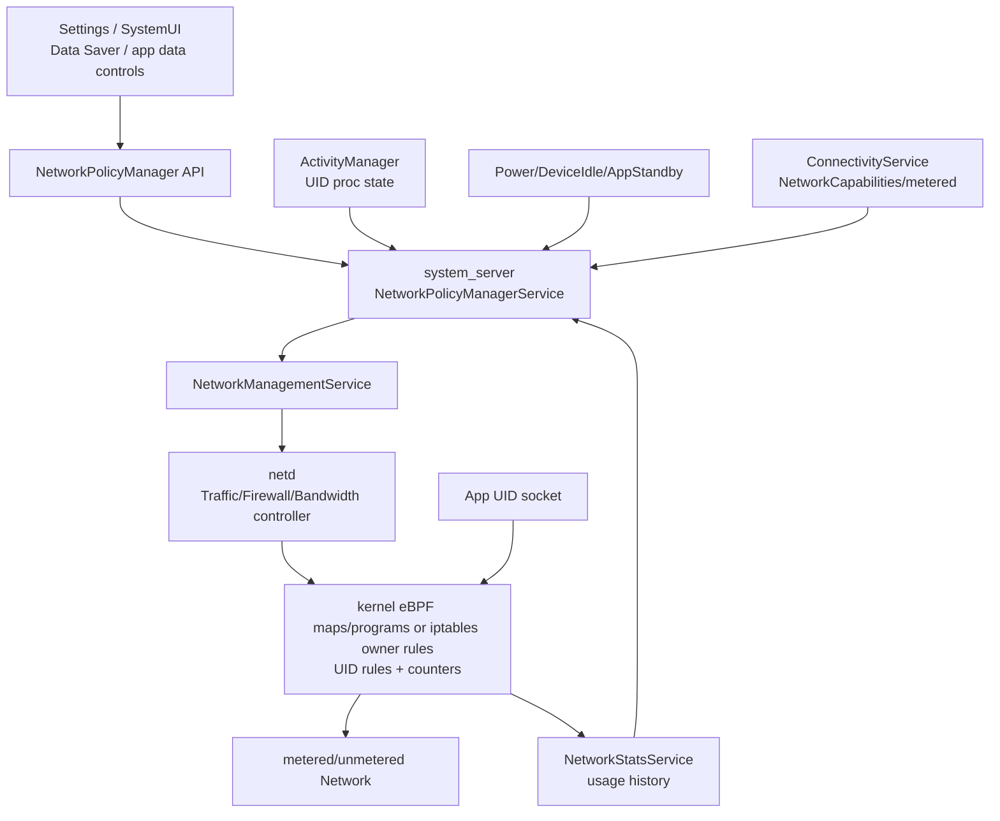
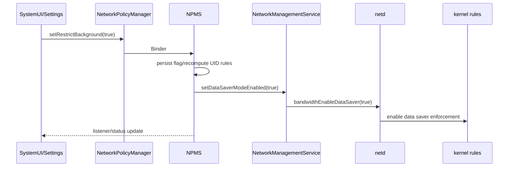

# 42 Android 网络策略、NetworkPolicyManager、Data Saver 与 UID 防火墙

> 源码版本：Android 11 / API 30 / `android-11.0.0_r48`  
> 学习方式：macOS 只读源码，不要求编译  
> 前置章节：[23 权限、AppOps 与 SELinux](./23-Android权限AppOps与SELinux.md)、[24 网络栈](./24-Android网络栈ConnectivityService与NetworkAgent.md)、[25 电源管理](./25-Android电源管理WakeLock与Doze.md)

Android 网络“可用”不代表每个 UID 都被允许使用。ConnectivityService 选择网络之后，NetworkPolicyManagerService 仍会结合计量属性、Data Saver、应用前后台、用户黑白名单、Doze、App Standby、省电模式和流量配额，生成 UID 规则并交给 netd/内核执行。

---

## 1. 三件事先分开

| 层 | 回答的问题 | 主要组件 |
|---|---|---|
| 网络选择 | socket 应走哪张 Network | ConnectivityService/netd routing |
| 网络策略 | 这个 UID 在此条件下是否允许联网 | NetworkPolicyManagerService |
| 流量统计 | 某 UID/接口用了多少字节 | NetworkStatsService/BPF/内核统计 |

统计不是限制；策略对象也不直接逐包丢弃。最终执行要落到 netd、BPF/iptables 和 kernel。

---

## 2. 总体架构



NPMS 是策略汇聚点：它消费很多系统状态，再生成可执行规则。

---

## 3. Android 11 核心源码

```text
frameworks/base/core/java/android/net/NetworkPolicyManager.java
frameworks/base/core/java/android/net/INetworkPolicyManager.aidl
frameworks/base/core/java/android/net/NetworkPolicy.java
frameworks/base/core/java/android/net/NetworkTemplate.java
frameworks/base/services/core/java/com/android/server/net/NetworkPolicyManagerService.java
frameworks/base/services/core/java/com/android/server/net/NetworkPolicyManagerInternal.java
frameworks/base/services/core/java/com/android/server/net/NetworkPolicyLogger.java
frameworks/base/services/core/java/com/android/server/net/NetworkStatsService.java
frameworks/base/services/core/java/com/android/server/net/NetworkStatsFactory.java
frameworks/base/services/core/java/com/android/server/NetworkManagementService.java
frameworks/base/core/java/android/os/INetworkManagementService.aidl
system/netd/server/BandwidthController.cpp
system/netd/server/FirewallController.cpp
system/netd/server/TrafficController.cpp
```

---

## 4. 核心进程

- NPMS、NetworkStatsService、NMS、ConnectivityService：`system_server`。
- SystemUI/Settings：各自进程。
- netd：native daemon。
- BPF maps、iptables chains、socket/packet enforcement：kernel。

规则变化跨 Binder/native 边界；App 查询 API 得到的状态可能与内核规则更新存在短暂时序差。

---

## 5. NetworkPolicyManager

这是客户端 facade，系统/特权调用者可：

- 设置/查询 UID policy。
- 查询 restrict background/Data Saver。
- 注册 policy listener。
- 管理 NetworkPolicy、subscription plans 等。
- 判断当前网络是否 metered。

普通应用主要通过 `ConnectivityManager.getRestrictBackgroundStatus()` 等受限视图了解自身状态，不能任意修改其他 UID。

---

## 6. NetworkPolicyManagerService

NPMS 负责：

- 持久化用户/网络策略。
- 根据 NetworkTemplate 匹配网络。
- 计算 warning/limit/snooze 周期。
- 接收 UID 前后台、idle、power、网络属性变化。
- 生成 `mUidRules`。
- 下发 metered blacklist/whitelist 与 firewall chains。
- 广播/回调策略变化。

它不是 NetworkStatsService，也不是 ConnectivityService。

---

## 7. policy 与 rule 不同

- policy：持久或用户意图，例如“此 UID 禁止计量网络后台流量”。
- rule：结合当前 Data Saver、前台状态、白名单等计算出的运行时结果。

```text
POLICY_REJECT_METERED_BACKGROUND
       + restrictBackground=true
       + UID foreground=false
       ↓
RULE_REJECT_METERED
```

一个 policy 在条件改变后可映射成不同 rule。

---

## 8. NetworkTemplate

NetworkPolicy 不直接只写 `wlan0` 或 `rmnet0`，而用 template 描述匹配范围，例如移动订阅、Wi-Fi network key 等。

接口名会变，Network identity/template 才能把计费周期和策略关联到逻辑网络。多 SIM 时 subscription identity 尤其重要。

---

## 9. NetworkPolicy

典型字段概念：

- template。
- cycle rule/timezone。
- warning bytes。
- limit bytes。
- last warning/limit snooze。
- metered/inferred。

warning 通知用户；limit 可能触发实际限制。两者不能混为一谈。

---

## 10. 什么是 metered

metered 表示流量具有成本/配额语义，不等于慢，也不等于移动网络专属。蜂窝通常 metered，Wi-Fi/Ethernet 可以被用户或配置标记 metered。

Data Saver 的核心限制主要针对 metered network；unmetered 网络上的行为不同。

---

## 11. NetworkCapabilities 与 metered

ConnectivityService 通常以 `NET_CAPABILITY_NOT_METERED` 表达非计量。NPMS 还维护 interface/identity 与 policy 的匹配结果。

transport type 不能直接替代计量判断：Wi-Fi 可能 metered，cellular 也可能因计划/策略呈现不同属性。

---

## 12. Data Saver

Data Saver 对计量网络限制后台数据，允许前台 UID、系统关键 UID和白名单例外。公开状态常见：

```text
RESTRICT_BACKGROUND_STATUS_DISABLED
RESTRICT_BACKGROUND_STATUS_WHITELISTED
RESTRICT_BACKGROUND_STATUS_ENABLED
```

enabled 对某 App 不一定等于它被阻断，还要看前台与白名单。

---

## 13. 打开 Data Saver 主链



NPMS 还会更新 UID 计量黑白名单；全局 mode 和 per-UID rules 共同工作。

---

## 14. UID 前台状态

ActivityManager 将 UID proc state/foreground transition 通知 NPMS。NPMS 用阈值判断某 UID 是否具有前台网络豁免。

“进程存在”不等于 foreground；前台 Service、可见 Activity、top、重要组件的判定也不是一个布尔 Activity 状态。

---

## 15. 状态变化存在延迟

UI 退到后台后，AMS 更新 proc state，NPMS handler 重算 rule，再下发 netd。各阶段异步，抓取瞬间可能看到新 proc state 配旧内核 rule。

测试应等待明确 callback/规则稳定，不应仅 sleep 一个武断的毫秒数。

---

## 16. UID policy 黑名单

`POLICY_REJECT_METERED_BACKGROUND` 表达用户明确禁止该 UID 在计量网络后台使用数据。即便全局 Data Saver 关闭，该 policy 仍可能影响后台计量流量。

用户单 App 设置与全局 Data Saver 是两个输入源。

---

## 17. Data Saver 白名单

允许名单让指定 App 在全局 Data Saver 开启时仍可在后台使用计量网络。它不保证：

- Doze/standby/powersave 链也放行。
- 网络本身 validated。
- 配额未耗尽。
- App 未被 VPN/企业防火墙限制。

白名单只解决对应策略维度。

---

## 18. rule 计算核心

`updateRulesForDataUsageRestrictionsULInner(uid)` 综合：

- UID policy 是否 blacklisted。
- 全局 `mRestrictBackground`。
- UID 是否前台。
- UID 是否白名单/默认白名单。
- 旧 rule 与新 rule。

输出可能包含 `RULE_REJECT_METERED`、`RULE_ALLOW_METERED`、temporary allow 等位。注意普通“Data Saver 开启且后台 UID 未入白名单”可能保持 `RULE_NONE`，实际限制由全局 Data Saver mode 的默认行为承担。

---

## 19. 当前源码的关键分支

裁剪后的逻辑可读成：

```java
final boolean isBlacklisted =
        (uidPolicy & POLICY_REJECT_METERED_BACKGROUND) != 0;
final boolean isWhitelisted =
        (uidPolicy & POLICY_ALLOW_METERED_BACKGROUND) != 0;

if (isRestrictedByAdmin) {
    newRule = RULE_REJECT_METERED;
} else if (isForeground) {
    if (isBlacklisted || (mRestrictBackground && !isWhitelisted)) {
        newRule = RULE_TEMPORARY_ALLOW_METERED;
    } else if (isWhitelisted) {
        newRule = RULE_ALLOW_METERED;
    }
} else if (isBlacklisted) {
    newRule = RULE_REJECT_METERED;
} else if (mRestrictBackground && isWhitelisted) {
    newRule = RULE_ALLOW_METERED;
}
```

这是帮助理解的裁剪。最后没有显式分支意味着 `RULE_NONE`，但在全局 Data Saver 已启用时并不等于后台计量流量获准；它只是没有额外 UID 例外。完整方法还处理 UID 有效性、旧 rule 合并、管理员限制以及黑白名单的 netd transition。

---

## 20. temporary allow

被后台计量限制的 UID进入前台时，可以得到临时允许规则；回到后台再恢复 reject。这样前台交互不被 Data Saver 破坏，同时保持后台节流意图。

temporary 是运行时状态，不应持久化成永久白名单。

---

## 21. 下发计量黑名单

NPMS 根据 rule transition 调用：

```text
NetworkManagementService.setUidMeteredNetworkBlacklist(uid, enable)
 → INetd.bandwidthAddNaughtyApp / bandwidthRemoveNaughtyApp
 → Android 11 BandwidthController 的 bw_data_saver/naughty-nice iptables 规则
```

允许名单相应调用 `bandwidthAddNiceApp()` / `bandwidthRemoveNiceApp()`。不要把 Android 11 里所有网络约束都概括成“BPF rule”：Data Saver 这条 metered naughty/nice 链在本分支的 `BandwidthController` 中仍明确生成 iptables 规则；Doze/Standby/Powersave 这类 owner firewall chain 才由 `FirewallController.mUseBpfOwnerMatch` 选择 eBPF `TrafficController` 或 iptables owner-match 后端。

---

## 22. isUidNetworkingBlocked

系统内部可用 UID rules、网络是否 metered、foreground 和 restrict-background 判断逻辑阻断状态。

它是策略判定视图，不等同于主动发包验证；底层规则下发失败、竞态或其他限制仍需独立检查。

---

## 23. Doze 防火墙链

Doze/device idle 常使用 `FIREWALL_CHAIN_DOZABLE`，语义接近 allowlist chain：链启用时，只允许规则明确放行的 UID，其他被阻断。

这与 Data Saver 的“仅计量网络后台限制”不同；Doze 可能不以 metered 为条件。

---

## 24. App Standby 链

`FIREWALL_CHAIN_STANDBY` 常采用 denylist 思路：idle/standby UID 被加入拒绝规则，其他默认允许。

同样叫 firewall chain，但 allowlist chain 与 denylist chain 的 default rule 含义相反。

---

## 25. Power Save 链

Battery Saver 相关限制可使用 `FIREWALL_CHAIN_POWERSAVE`，结合 UID 前台、白名单和省电状态更新。

一个 UID 可能同时受 Data Saver、Doze、Standby、Powersave 多套规则；任一有效拒绝都可能导致联网失败。

---

## 26. firewall chain 语义表

| 链 | 常见触发 | 模型 |
|---|---|---|
| dozable | device idle | allowlist |
| standby | app idle | denylist |
| powersave | battery saver | allowlist |

具体例外与版本以源码为准。不能看到 `FIREWALL_RULE_DEFAULT` 就自动翻译成 allow/deny，必须结合链类型与是否 enabled。

---

## 27. 链启用与 UID rule

链的工作有两层：

1. 给 UID 填 allow/deny/default rule。
2. enable/disable 整条 chain。

链未启用时，里面已有 UID entries 也可能不执行；启用空 allowlist chain 则可能大面积阻断。

---

## 28. NMS 下发防火墙

主链：

```text
NPMS.setUidFirewallRule(s)
 → NetworkManagementService.setFirewallUidRule(s)
 → netd FirewallController
 → eBPF 开启时 TrafficController UID-owner map
    否则 iptables owner-match chain
```

这里的“二选一”可直接从 `FirewallController::setUidRule()` 和 `replaceUidChain()` 中看到。批量更新可减少逐 UID IPC 和中间不一致，但仍要处理 chain type、旧规则清理与失败恢复。

---

## 29. NetworkStatsService

它负责读取、汇总和持久化流量历史，按 UID、set、tag、interface/network identity 等维度提供统计。

NPMS 用统计判断 warning/limit；NetworkStatsService 本身通常不决定某 UID 应否联网。

---

## 30. 统计维度

```text
uid
set: foreground/default
tag: TrafficStats tag
iface / identity
rxBytes/rxPackets/txBytes/txPackets
time bucket
```

Android 的 foreground stats set 与 Activity UI 前台概念有关但并不完全等价于每个瞬时 proc state。

---

## 31. TrafficStats tag

应用/library 可给 socket traffic 打 tag，以区分业务。tag 不改变 UID 权限，也不会绕过 Data Saver；它主要帮助统计归因和 StrictMode 等诊断。

未清理 thread tag 可能让后续 socket 归因到错误业务 tag。

---

## 32. warning 与 limit

- warning：达到阈值时通知用户，通常不直接断网。
- limit：达到阈值后可施加 interface quota/网络策略限制。
- snooze：用户暂时忽略本周期 warning/limit。

配额由统计采样驱动，可能不是精确到最后一个字节瞬间生效。

---

## 33. 计费周期

NetworkPolicy 使用 cycle day/timezone 或 recurrence rule。跨月、时区、无该日期月份和运营商计划变化都要谨慎计算周期边界。

“本月流量”不是简单从当前时间减 30 天。

---

## 34. SubscriptionPlan

运营商/系统可提供计划总量、周期、已用量等。NPMS 用其改善警告、限制和 metered 推断。

设备统计和运营商计费口径可能不同，用户 UI 应理解为估算而非账单权威值。

---

## 35. interface quota

NMS/netd 可对接口设置 quota/alert。达到 quota 时 bandwidth controller 执行限制并上报 alert。

UID Data Saver 和 interface quota 是两个正交维度：前者按 UID/前后台，后者针对匹配网络总量。

---

## 36. 网络 identity 变化

Wi-Fi SSID、subscriptionId、roaming、metered 等变化会让 interface 对应的 NetworkIdentitySet 改变。NetworkStatsService 需要在切换边界正确归因。

同一个 `wlan0` 今天连接家庭 Wi-Fi、明天连接收费热点，policy 不能只按接口名复用。

---

## 37. 前台服务不等于无限制

前台 Service 提升进程重要性并显示通知，但是否满足 NPMS 的 foreground threshold 要看实现和 proc state；即使通过 Data Saver，Doze、quota、VPN 或企业策略仍可能限制。

“我用了前台服务所以永不受网络限制”是错误结论。

---

## 38. 系统 UID 与共享 UID

规则最终按 Linux UID 执行。共享 UID 的多个 package 会一起受影响；多用户 UID 中包含 userId，同一包在不同用户有不同 UID。

排障必须记录完整 UID，不只记录包名。

---

## 39. isolated UID

WebView、服务或沙箱可使用 isolated UID。NPMS/AMS 需把 owner 状态和规则正确传播或处理，否则主 App 被允许但子进程仍可能被阻断。

看到不同 UID 的 socket 时不要误以为陌生 App 偷流量。

---

## 40. VPN 交互

VPN 改变 Network/netId 与实际 interface；策略可能针对原始 UID、VPN owner 和 underlying network 分别统计/执行。VPN 不自动绕过 Data Saver 或 Doze。

诊断要同时看 App UID rule、VPN UID、VPN Network 是否 metered 以及 underlying 属性。

---

## 41. Tethering 交互

热点客户端流量由手机转发，不是某个普通 App UID socket。它的计量/配额/运营商策略与本机 App UID Data Saver 不是完全同一路径。

不要用“某 App 已白名单”推导 tethered client 一定放行。

---

## 42. DNS 也可能被规则阻断

被限制 UID 的 DNS query 和业务 socket 都可能失败，表现为 `UnknownHostException`。此时 DNS server 本身没坏，是 UID 网络访问在更低层被拒绝。

可用系统/其他 UID 查询成功作为对照，但仍需核对 netId 与缓存。

---

## 43. 已建立连接会怎样

规则更新后，后续 packet 可能被丢弃；已建立 TCP socket 不保证继续工作。有些实现还会 destroy sockets 以加速策略生效。

App 看到 timeout、reset 或新连接失败，取决于具体后端和时序。

---

## 44. socket destruction

当 UID 从允许变为拒绝时，仅装新 firewall rule 可能让已有 conntrack/socket 状态继续一段时间。系统可调用 socket destroy 能力按 UID/range 清理连接。

“规则已显示 reject 但旧下载短暂继续”可能是执行时序，不应立即判定规则无效。

---

## 45. Fail-open 与 fail-closed

策略下发失败时如何处理是安全与可用性取舍。企业/Doze allowlist 通常更关注 fail-closed，而普通组件也需避免空规则误伤全系统。

源码中要关注批量替换顺序、异常日志、旧状态缓存和 rollback，而不仅是正常调用。

---

## 46. 锁与线程

NPMS 维护 policy、uid rules、network rules 等多组共享状态，使用明确锁顺序（方法名常带 UL/NL 等提示）。外部 Binder/netd 调用若持锁不当会造成阻塞或死锁。

阅读时记录“规则计算锁”和“network policy 锁”，不要把 suffix 当业务缩写忽略。

---

## 47. 状态持久化

UID policies、restrict background 和 NetworkPolicy 会写 XML/系统存储，开机读取后再结合当前 package/UID/network 重建运行规则。

运行时 firewall chain entries 不等于持久化源；重启后由策略重新计算。

---

## 48. 包安装与卸载

包安装、UID removed、user removed 会触发规则更新和持久 policy 清理。若 UID 被系统复用而旧 policy 未清，会错误限制新包，因此清理很重要。

共享 UID/更新签名等情况还需依 PackageManager 身份模型处理。

---

## 49. 典型时间线

| 时间 | 事件 | 此时含义 |
|---|---|---|
| 12:00:00.000 | 用户打开 Data Saver | 全局意图改变 |
| 12:00:00.020 | NPMS 保存并重算 UID rules | Framework 状态更新 |
| 12:00:00.040 | NMS/netd 接收 mode/rules | native 控制面更新 |
| 12:00:00.060 | kernel map/chain 生效 | packet 开始按新规则执行 |
| 12:00:01.000 | App callback 收到状态 | App 可调整后台同步 |

时间仅为教学示例；不可据此假定固定 60 ms 生效。

---

## 50. “同网下前台能用、后台不能用”

优先检查 Data Saver、单 App metered background policy、UID proc state、临时前台 allow rule。若只在 metered 网络复现，更支持计量规则方向。

同时排除 App 自己在后台主动暂停任务。

---

## 51. “Wi-Fi 能用、移动数据不能用”

检查 Wi-Fi 是否 NOT_METERED、移动网络是否 metered、单 App mobile data/background setting、Data Saver、subscription limit。不要直接归因于 APN。

如果前台移动数据也失败，再向 Telephony/data network 和 route 层排查。

---

## 52. “所有 App 都突然没移动数据”

检查总配额 limit、Data Saver 是否只影响后台、移动 Network validation、subscription/DUN、netd bandwidth mode 和系统 UID 是否也受影响。

所有前台 App 都失败通常不只是普通 Data Saver 默认行为。

---

## 53. “只有休眠后失败”

检查 Doze chain、App Standby bucket、Battery Saver、idle whitelist、Job/Alarm 调度。Data Saver 若在非计量 Wi-Fi 上也复现，可能不是主因。

唤醒屏幕后恢复是重要时序证据，但仍需看 chain/rule。

---

## 54. 规则矩阵排障

| 条件 | 记录值 |
|---|---|
| UID/package/user | 完整 UID |
| Network | netId、metered、validated、iface |
| App state | procState/foreground/idle |
| Global | restrictBackground、deviceIdle、batterySaver |
| UID policy/rules | policy bits、computed rule bits |
| Native | blacklist/whitelist、chain enabled、UID entry |

没有这张矩阵，单看一个设置开关很容易误判。

---

## 55. dumpsys 与 shell

```bash
adb shell dumpsys netpolicy
adb shell dumpsys netstats
adb shell dumpsys connectivity
adb shell dumpsys deviceidle
adb shell cmd netpolicy help
adb shell cmd netpolicy list restrict-background-whitelist
adb shell cmd netpolicy list restrict-background-blacklist
```

修改 shell 状态属于实验操作；本课程在 macOS 只读阶段先阅读命令实现和 dump 字段，不要求执行。

---

## 56. 日志阅读

NetworkPolicyLogger/NPMS dump 可显示 UID state、rule transition、metered interfaces、firewall chain。按同一时间轴对齐 AMS proc state 与 netd 更新。

只看到最终 `RULE_REJECT_METERED` 不足以知道来自用户 blacklist 还是全局 Data Saver。

---

## 57. 源码路线一：API 与持久策略

```text
frameworks/base/core/java/android/net/NetworkPolicyManager.java
frameworks/base/core/java/android/net/INetworkPolicyManager.aidl
frameworks/base/core/java/android/net/NetworkPolicy.java
frameworks/base/core/java/android/net/NetworkTemplate.java
frameworks/base/services/core/java/com/android/server/net/NetworkPolicyManagerService.java
```

练习：从 setUidPolicy/setRestrictBackground 追权限、持久化和重算入口。

---

## 58. 源码路线二：Data Saver rule

```text
frameworks/base/services/core/java/com/android/server/net/NetworkPolicyManagerService.java
frameworks/base/services/core/java/com/android/server/NetworkManagementService.java
system/netd/server/BandwidthController.cpp
system/netd/server/TrafficController.cpp
```

练习：追 `updateRulesForDataUsageRestrictionsUL` 到 metered black/whitelist 后端。

---

## 59. 源码路线三：防火墙链

```text
frameworks/base/services/core/java/com/android/server/net/NetworkPolicyManagerService.java
frameworks/base/services/core/java/com/android/server/NetworkManagementService.java
system/netd/server/FirewallController.cpp
system/netd/server/TrafficController.cpp
```

练习：比较 dozable、standby、powersave 的 chain type、default rule 和 enable 时机。

---

## 60. 源码路线四：统计与配额

```text
frameworks/base/services/core/java/com/android/server/net/NetworkStatsService.java
frameworks/base/services/core/java/com/android/server/net/NetworkStatsFactory.java
frameworks/base/services/core/java/com/android/server/net/NetworkPolicyManagerService.java
system/netd/server/BandwidthController.cpp
```

练习：从历史 bucket 追 warning/limit 周期、quota 安装和 alert 回调。

---

## 61. 八组只读练习

1. **三层图**：选择、策略、统计。
2. **policy→rule 表**：blacklist、Data Saver、foreground、whitelist 四变量。
3. **Data Saver 链**：UI 到 kernel rule。
4. **防火墙表**：三条 chain 的 allowlist/denylist。
5. **时序图**：UID 前台→后台时规则变化。
6. **配额图**：stats→cycle→warning/limit→quota。
7. **多限制纸算**：Data Saver + Doze 同时生效。
8. **故障矩阵**：对三个典型现象取证。

---

## 62. 初学者易混淆的十二点

1. Network connected 不等于 UID 被允许。
2. 统计流量不等于限制流量。
3. policy 是意图，rule 是运行结果。
4. Data Saver 主要针对计量网络后台流量。
5. Data Saver 白名单不等于 Doze 白名单。
6. 前台 Service 不保证绕过所有限制。
7. RULE_DEFAULT 要结合 chain 类型解释。
8. chain rule 与 chain enable 是两层状态。
9. warning 通常不是 limit。
10. interface name 不是长期计费 identity。
11. VPN 不自动绕过 UID policy。
12. UnknownHostException 可能是 UID 被防火墙阻断。

---

## 63. 自测题

1. ConnectivityService 与 NPMS 如何分工？
2. policy 和 rule 有何区别？
3. metered 能否由 transport type 唯一决定？
4. Data Saver 开启后为何前台 App 仍可联网？
5. 单 App blacklist 与全局 Data Saver 有何关系？
6. temporary allow 为何不能持久化？
7. dozable 与 standby chain 默认语义为何不同？
8. chain 内有 rule 是否说明规则已执行？
9. NetworkStatsService 是否直接丢包？
10. warning 与 limit 有何区别？
11. 为什么共享 UID 的多个包一起受影响？
12. Wi-Fi 能用、移动数据不能用应优先检查什么？

---

## 64. 参考答案

1. 前者选/管理 Network；后者决定 UID 在条件下是否允许使用。
2. policy 是持久输入，rule 是结合实时状态计算的输出。
3. 不能，要看 capabilities、用户/运营商 policy。
4. foreground 可获得临时计量允许规则。
5. 前者是 UID 明确 policy；后者是全局背景限制，两者共同计算。
6. 它随 UID 前后台实时变化，不是用户永久授权。
7. dozable/powersave 常是 allowlist；standby 常是 denylist。
8. 不一定，整条 chain 还需 enabled。
9. 通常不，它提供统计，NPMS/netd/kernel执行限制。
10. warning 提示；limit 可安装实际 quota/限制。
11. kernel enforcement 看到的是 UID，不识别包名。
12. metered 状态、Data Saver、UID policy/rule、subscription limit，再查 APN。

---

## 65. 最终主线

```text
用户/运营商设置 NetworkPolicy 与 UID policy
 + ConnectivityService 提供 Network metered/identity
 + AMS 提供 UID proc state
 + DeviceIdle/AppStandby/Power 提供省电状态
 + NetworkStatsService 提供周期用量
 → NPMS 计算 mUidRules、quota 与 firewall chains
 → NMS 调 netd bandwidth/firewall/traffic controller
 → kernel BPF/iptables/owner rules 与 counters 生效
 → App socket packet 被允许、拒绝或计数
```

面对“某 App 没网”，先确认它选中了哪张 Network，再记录该 Network 是否计量、UID 当前状态、全局 Data Saver/Doze/省电开关、持久 policy、计算 rule 和 native chain。只有把这些输入放进同一矩阵，才能判断是路由问题、策略问题还是应用自己暂停了后台任务。
