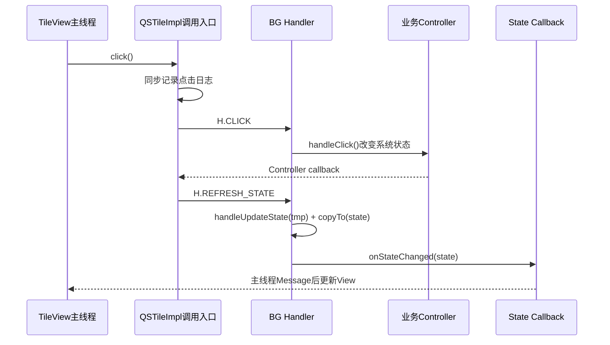
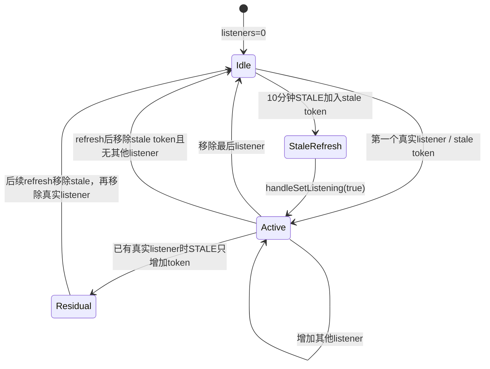

# 第 420 章 Android SystemUI QSTileImpl：生命周期、后台Handler、State复制、点击与刷新

> 源码基线：Android 11 / API 30 / `android-11.0.0_r48`。本章只在 macOS 阅读、检索和推演源码，不编译。第419章解决Tile对象怎样被Host创建；本章进入一个Tile内部，说明公开调用为何不等于动作已完成。

## 1. 本章先解决什么问题

用户点击Tile后，日志、业务Controller、State更新、View重绘分别在哪个线程发生？为什么`refreshState()`不是直接刷新？多个Panel同时监听时何时真正注册Controller？10分钟stale机制怎样自刷新，又有什么边界？

## 2. 一句话心智模型

QSTileImpl是“后台Looper上的小型Actor”：公开方法大多只发送消息；Handler串行调用子类`handle*`；`handleUpdateState()`写临时State，再复制到稳定State，最后把变化扇给Callback，由View转投主线程绘制。

## 3. 本章与具体Tile的边界

基类规定消息、状态和监听协议；WifiTile、BluetoothTile等只实现点击和状态取值。第422章后再进入具体Controller，本章先掌握所有内建Tile共享的骨架。

## 4. 本章源码地图

主线是`QSTileImpl.java`和插件接口`QSTile.java`；为闭合线程链，还会读`QSPanel.addTile()`、`QSTileBaseView.onStateChanged()`、TileLayout/PagedTileLayout的setListening调用。

## 5. 它运行在哪个进程

内建QSTileImpl对象在SystemUI进程。具体业务可能通过Controller跨Binder到系统服务，但基类Handler、State与Callback扇出都在本进程。

## 6. 它有哪两个关键线程

`mHandler`绑定`Dependency.BG_LOOPER`，执行Tile业务状态机；`mUiHandler`绑定主Looper，供需要弹Dialog的子类使用。View自己的Handler也在主Looper，把State落到真实控件。

## 7. BG_LOOPER是不是每个Tile独享线程

不是。所有通过Dependency取得的Tile通常共享SystemUI后台Looper。一个Tile的长耗时`handleUpdateState()`会阻塞其他Tile消息，不应把“后台”理解成无限并行。

## 8. 哪些公开方法是异步入口

add/remove callback、click、secondaryClick、longClick、showDetail、refreshState、userSwitch、toggle/scan、setListening和destroy都向H发Message。调用返回只表示成功入队。

## 9. 哪些读取是同步的

`getState()`、`getTileSpec()`、`getInstanceId()`、`getMetricsSpec()`直接读字段；它们不向BG Looper同步，也没有锁，因此读到的是某一时刻共享对象，不是带版本的原子快照。

## 10. 图一：一个Tile的线程流水线

```mermaid
flowchart LR
    UI["主线程：Tile View点击"] --> API["click / refreshState / setListening"]
    API --> Q["BG_LOOPER MessageQueue"]
    Q --> H["QSTileImpl.H.handleMessage"]
    H --> B["子类handleClick / handleUpdateState"]
    B --> S["mTmpState copyTo mState"]
    S --> C["QSTile.Callback（BG线程）"]
    C --> VQ["QSTileBaseView主线程Handler"]
    VQ --> V["图标、颜色、无障碍与点击性更新"]
```



## 11. 构造函数建立什么

保存Host和base Context，生成一次InstanceId，调用`newTileState()`两次建立mState与mTmpState，再取得QSLogger和UiEventLogger。此时Tile spec还没有由Host设置。

## 12. newTileState为何必须返回新对象

稳定态和临时态必须是两个独立实例。若子类错误地返回同一对象，handleUpdateState直接改到mState，copyTo可能判断无变化，View就收不到回调。

## 13. 两个State类型必须完全一致

`State.copyTo()`要求目标非null且`other.getClass().equals(getClass())`，不是`instanceof`。一次返回BooleanState、一次返回State会在首次refresh抛IllegalArgumentException。

## 14. resetStates用于什么

它重新调用newTileState两次。CustomTile发现服务声明为toggleable时可切换到BooleanState模型；调用时机必须避开正在使用旧State引用的复杂阶段。

## 15. Tile spec设置得较晚

QSFactoryImpl先构造Tile并同步调用handleStale，后者向BG Looper排SET_LISTENING；Host拿到对象后才`setTileSpec()`。通常主线程会先完成赋值，但BG线程没有等待屏障，极端时可能先处理消息，使首次日志、Host位置或CustomTile stale timeout看到null spec。

## 16. InstanceId是什么生命周期

每个Java Tile对象构造时从Host取新InstanceId，复用对象和userSwitch不会变；destroy后重建才换。它用于UiEvent关联，不是用户设置里的持久身份。

## 17. addCallback会同步回放吗

公开方法不同步；消息执行到`handleAddCallback()`时把callback追加，并立刻用当前mState调用一次`onStateChanged()`。所以有初值回放，但发生在BG Looper。

## 18. callback会去重吗

不会，mCallbacks是ArrayList。相同对象重复add会重复收到状态和详情事件；remove一次只删除第一个匹配项。

## 19. removeCallbacks用于Host复用

它异步clear全部Callback。第419章Host复用Tile时先调用它；若新Panel紧接着addCallback，FIFO通常让clear先执行，但跨线程错误调用可能打乱期望顺序。

## 20. Callback在哪个线程执行

`handleStateChanged()`直接在Tile BG Handler中遍历callback。接口本身没有自动切主线程，消费者必须自己转投UI线程。

## 21. QSPanel怎样接状态

Panel callback的`onStateChanged()`调用`tileView.onStateChanged(state)`；QSTileBaseView再把携带State引用的消息发到自己主线程Handler，真正改图标/颜色发生在主线程。

## 22. State对象没有为View深拷贝

传给callback和View Message的是同一个mState引用。下一次BG refresh可能在主线程消费旧消息前再次copy到该对象，多个排队消息因此可能都观察到较新的最终字段，而非各自产生时的历史快照。

## 23. getState也返回同一个可变对象

它没有copy。调用者应只读并尽快使用；TileQueryHelper需要跨线程保留时会显式`getState().copy()`，这正是安全快照的示范。

## 24. click的第一阶段发生在哪里

调用线程先写MetricsLogger、UiEventLogger和QSLogger，读取StatusBar state、mState.state、Boolean value及Host位置，然后才发送H.CLICK。日志发生不代表业务handleClick已执行。

## 25. click的第二阶段发生在哪里

BG Handler收到CLICK后才检查政策并调用子类handleClick。队列等待期间设备状态和mState都可能变化，所以日志记录的状态与真正动作检查时状态可能不同。

## 26. disabledByPolicy只拦primary click

CLICK分支若当前mState.disabledByPolicy为true，启动管理员支持详情页而不调用handleClick。这个检查读取的是消息执行时稳定State。

## 27. secondaryClick没有基类政策门

SECONDARY_CLICK直接调用handleSecondaryClick，不检查disabledByPolicy。默认实现又转调handleClick；具体Tile若有管理限制，需要自己的实现或UI入口确保不会绕过。

## 28. secondaryClick默认不等于详情

基类默认就是普通点击。只有子类override后才可能展示detail或执行不同动作，不能根据API名字假定一定展开二级面板。

## 29. longClick也不检查disabledByPolicy

LONG_CLICK直接调用handleLongClick，再通过ActivityStarter启动`getLongClickIntent()`。View通常依据State的handlesLongClick控制入口，但直接调用longClick仍会入队。

## 30. longClick还有同步副作用

发送消息后，调用线程立即把`QS_LONG_PRESS_TOOLTIP_SHOWN_COUNT`写到最大值。即使后台Intent启动失败，tooltip计数也已更新，不与启动结果构成事务。

## 31. 为什么子类有mUiHandler

BG handleClick不能直接创建/显示Dialog。Cast、DND、ScreenRecord等子类用mUiHandler.post回主线程；基类不自动替所有handleClick切回UI。

## 32. refreshState只是排队

无参版本调用带arg版本，后者发送REFRESH_STATE。Controller callback即使已在后台，也应调用refreshState，让所有State写入统一串行到Tile Looper。

## 33. REFRESH消息不会自动合并

源码没有removeMessages(REFRESH_STATE)或coalesce。短时间十次Controller callback会排十次handleUpdateState，可能重复查询昂贵状态并阻塞共享BG Looper。

## 34. handleUpdateState写哪个对象

子类收到mTmpState而非mState，按当前Controller事实填icon、label、state、value、description等。它不应直接触摸View。

## 35. 临时State会保留上次字段

mTmpState不会每轮new或清零。子类若这次忘记覆盖secondaryLabel、slash、isTransient等字段，旧值会继续被copy，形成“幽灵UI状态”。

## 36. copyTo怎样判变化

State逐字段Objects.equals比较，BooleanState再比value，SignalState再比流量箭头字段。先计算changed，再把所有字段复制到mState。

## 37. unchanged时发生什么

仍会更新mState字段、重排STALE计时并尝试移除stale listener，但不会写tile-updated日志，也不会调用State callbacks。refresh完成不等于View一定收到事件。

## 38. 为什么仍要复制所有字段

equals可能认为两个等价对象没变化，但目标仍应对齐临时态；copyTo还把slash复制成新对象，防止两个State共享同一SlashState实例。

## 39. 哪些字段不是深拷贝

icon、iconSupplier、各CharSequence和String引用直接赋给mState；只有slash显式copy。若子类传入后继续修改可变CharSequence或自定义Icon内部状态，changed检测无法可靠描述变化。

## 40. iconSupplier与icon同时存在怎么办

State协议允许两者，具体Icon View决定何时取supplier。基类只比较和复制，不强制二选一，也不在BG线程求Drawable。

## 41. 稳定State对象身份为何保持不变

View和外部读者会持有mState引用；每次只copy字段而不是替换对象，可减少分配。但这也造成第22节所述的排队消息观察到后续更新。

## 42. 决定性源码：临时态到稳定态

```java
protected void handleRefreshState(Object arg) {
    handleUpdateState(mTmpState, arg);
    final boolean changed = mTmpState.copyTo(mState);
    if (changed) {
        mQSLogger.logTileUpdated(mTileSpec, mState);
        handleStateChanged();
    }
    mHandler.removeMessages(H.STALE);
    mHandler.sendEmptyMessageDelayed(H.STALE, getStaleTimeout());
    setListening(mStaleListener, false);
}
```

## 43. State回调的异常会怎样

遍历发生在H.handleMessage的try内。某callback抛Throwable会停止后续callback与announcement，外层记录错误后吞掉，BG线程继续处理下一条Message。

## 44. announcement协议怎样工作

有callback且`mAnnounceNextStateChange`为true时，基类可让第一个callback请求无障碍播报；若子类要求延迟则保留标志。可是在r48基类字段是private，整棵SystemUI源码没有看到把它设true的入口，逻辑基本处于休眠状态。

## 45. 为什么只给第一个Callback播报

完整QS和QQS可能同时注册callback，状态都要更新，但无障碍announcement只应请求一次，避免重复朗读。因此源码固定用mCallbacks.get(0)。

## 46. showDetail怎样传播

公开showDetail发BG消息，handleShowDetail先更新mShowingDetail，再给所有callback `onShowDetail(show)`。完整Panel和QQS都收到，QSPanel callback再根据`shouldShowDetail()`决定谁处理。

## 47. 详情UI怎样回主线程

QSPanel的showDetail本身向Panel主线程Handler发送SHOW_DETAIL，随后才取DetailAdapter、计算Tile View坐标和更新DetailRecord。Tile BG callback不直接操作View。

## 48. toggle与scan事件是什么

它们是详情面板的辅助信号，不修改mState。基类分别扇出onToggleStateChanged/onScanStateChanged；QSPanel只在该Tile正是当前DetailRecord时向详情容器转发。

## 49. userSwitch默认做什么

H.USER_SWITCH调用`handleUserSwitch(newUserId)`；基类忽略参数，只`handleRefreshState(null)`。依赖per-user observer的子类必须override先切用户，再调用或触发刷新。

## 50. 图二：点击与状态刷新是两条消息链



## 51. listening为何使用Object token

一个Tile可能同时出现在QQS、完整QS、Customizer或stale自刷新中。mListeners是ArraySet<Object>，以调用方对象作为持有令牌，而不是一个简单boolean。

## 52. 第一个listener加入时发生什么

add成功且size变为1，Lifecycle切RESUMED，调用子类`handleSetListening(true)`注册Controller，再调用refreshState确保至少有一次状态刷新。

## 53. refresh为什么不是当前栈同步执行

handleSetListeningInternal正在处理SET_LISTENING消息，调用refreshState又把REFRESH_STATE排到队尾。子类注册回调若同步触发refresh，也会继续排队，避免在监听状态变更栈里重入handleUpdateState。

## 54. Lifecycle与业务监听的顺序

开启时先set Lifecycle RESUMED，再调用handleSetListening(true)；关闭时先set STARTED，再调用handleSetListening(false)。LifecycleObserver看到状态变化时，子类Controller注册/注销可能尚未完成。

## 55. 第二个listener加入时发生什么

只进入ArraySet并更新mIsFullQs，不重复调用handleSetListening(true)，也不自动refresh。共享监听资源只按0到1和1到0转换。

## 56. 最后一个listener移除时发生什么

remove成功且size变为0，Lifecycle切STARTED并调用handleSetListening(false)。移除一个不存在的token完全无动作。

## 57. 同一token重复set true是幂等的

ArraySet.add返回false，不改变数量，也不刷新；调用者若想强制刷新应显式refreshState，而不是重复setListening(true)。

## 58. mIsFullQs怎样计算

遍历token，只有`listener.getClass()`精确等于`PagedTileLayout.TilePage.class`才设1。子类或代理对象即使语义上是完整页也不会计入。

## 59. mIsFullQs只用于什么

它被populate写入Metrics的FIELD_IS_FULL_QS，不决定真实监听或布局。它是日志上下文，不是Panel状态真相。

## 60. stale timeout默认多久

默认10分钟。每次handleRefreshState结束都移除旧STALE并重新延迟发送；CustomTile会按Host中的spec位置额外错峰。

## 61. STALE消息做什么

`handleStale()`并不直接refresh，而是`setListening(mStaleListener,true)`。下一条SET_LISTENING若让listener数量从0到1，就进入正常注册、刷新、再退出的统一协议。

## 62. 无真实listener时的自刷新闭环

stale token成为第一个listener，开启业务监听并排REFRESH；refresh完成后`setListening(stale,false)`再排消息，最终数量回0并注销。

## 63. 已有真实listener时的stale边界

若STALE触发时已有Panel listener，加入stale token后size大于1，不会自动refresh；也就没有本轮handleRefreshState去移除stale token。之后Panel移除时仍剩stale token，Tile可能长期保持listening。这是r48代码按条件推演出的残留风险。

## 64. 普通refresh会修复上述残留

任何后续Controller refresh都会在结尾排`setListening(stale,false)`，把残留token移除；因此风险表现为“无状态变化的长时间打开后关闭”，而非每次必现。

## 65. isAvailable为何不在这里反复检查

它是Host创建或编辑候选阶段的startup check，基类注释明确不应用来动态隐藏Tile。运行中能力变化应更新State为UNAVAILABLE，而不是等待Host自动移除对象。

## 66. 管理员限制怎样写入State

子类在handleUpdateState中调用`checkIfRestrictionEnforcedByAdminOnly()`；它查询当前用户restriction，设置state.disabledByPolicy，并把EnforcedAdmin另存到mEnforcedAdmin。

## 67. 查询使用哪个用户

源码用`ActivityManager.getCurrentUser()`，不是Host的mCurrentUser参数。用户切换过渡期可能与Tile内部observer用户暂时不一致。

## 68. disabledByPolicy与mEnforcedAdmin是双账

前者被copy进可见State，后者保存在Tile字段供点击Intent使用。子类若手工改disabledByPolicy而不调用helper，可能出现true但admin为null或沿用旧admin。

## 69. populate记录哪些字段

metrics subtype为Tile category，附带完整QS标志和Host index；BooleanState再记录value。StatusBar state由click入口另外加入。

## 70. Host index可能是负数

Tile已从mTileSpecs移除但View旧点击尚在队列时，`indexOf()`可返回-1。日志仍发送，说明metrics不是对象生命周期强校验。

## 71. 点击日志可能比真实动作旧

调用线程读取mState.state/value；BG队列里此前REFRESH尚未执行时，日志记录旧显示状态。稍后CLICK又按执行时disabledByPolicy选择动作。

## 72. Handler FIFO能保证什么

同一个发送线程依次发的消息按入队顺序处理；来自多个线程的相对顺序只由实际入队时刻决定。Controller callback与用户点击可能交错，但最终都在一个BG Looper串行执行。

## 73. click消息会被coalesce或取消吗

不会。快速连点可排多个CLICK；是否防抖、忽略transient或等待Controller结果由具体Tile负责。

## 74. H为何catch Throwable

任何handle方法、callback或日志辅助抛错都被记为“Error in handleX”，再调用Host.warn。这样共享BG Looper不因一个Tile崩溃退出，但当前动作不会重试或回滚。

## 75. QSTileHost.warn做什么

r48实现只是注释“already logged”，没有额外上报。真正证据主要是Logcat和QSLogger；吞异常后的UI可能停在旧State。

## 76. destroy也是异步的

公开destroy发送DESTROY。它不会等待Controller注销完成；Host从Map移除对象后，旧Tile队列可能还在处理更早消息。

## 77. handleDestroy清理什么

记录日志；若listener非空，直接调用子类handleSetListening(false)；清callbacks；最后`removeCallbacksAndMessages(null)`清当前Handler尚未执行的全部消息。

## 78. handleDestroy遗漏了什么状态

它没有clear mListeners、没有把Lifecycle设DESTROYED、没有清mShowingDetail，也没有destroyed布尔。对象仍可被外部引用读取。

## 79. destroy后还能重新发消息吗

可以。DESTROY执行时只清当时队列；外部随后click、addCallback或setListening仍可向同一Handler入队并运行。正确性依靠Host/Panel不再持有对象，而非基类硬门。

## 80. 图三：listening引用计数与stale token



## 81. 子类handleDestroy为何通常要CallSuper

基类方法本身未标`@CallSuper`，但子类若override且不调用super，会漏清Handler消息和Callbacks。阅读具体Tile时必须核对销毁链。

## 82. ARG_SHOW_TRANSIENT_ENABLING是什么

它是共享对象身份标记。Wifi/Bluetooth/Hotspot点击开启时可`refreshState(ARG...)`，handleUpdateState用`arg ==`判断，先显示transient enabling，等待Controller真实回调。

## 83. 为什么用对象身份而不是boolean

null表示普通刷新，专用singleton表示这次刷新意图；不会与Controller传来的任意Boolean混淆。但Message中的arg只活在进程内，不是可序列化协议。

## 84. State.state三个值

使用`Tile.STATE_UNAVAILABLE`、INACTIVE、ACTIVE。View按它设置颜色、clickable和accessibility；BooleanState.value表达功能开关，两者应一致但基类不强制。

## 85. UNAVAILABLE怎样影响View

QSTileBaseView主线程把View设不可点击、accessibility class置null并用disabled颜色。handlesLongClick仍会被设置，但不可点击View的具体长按路由还受View状态约束。

## 86. BooleanState增加什么

在基础字段上增加value，并在copyTo比较/复制。View据此生成开/关状态描述并更新内部mTileState。

## 87. SignalState再增加什么

增加activityIn、activityOut、overlay icon宽度和ID，适合网络Tile。它先复制自身字段，再调用父类copyTo合并changed。

## 88. SlashState为何单独存在

它描述图标斜杠是否显示及旋转角度，有equals和copy。State比较slash值并深拷贝，避免下轮临时态修改同一slash对象时绕过changed。

## 89. State.toString并不打印所有字段

它打印icon、label、描述、policy、dual/isTransient、state和slash，但没有打印handlesLongClick与showRippleEffect，尽管copyTo会比较这两项。dump相同不保证这两个View行为相同。

## 90. Tile dump能看到什么

QSTileImpl只打印类名和`getState().toString()`。不显示Message队列、listeners数量、callbacks、Lifecycle、mShowingDetail、stale deadline、admin对象或最后错误。

## 91. dump读State也没有线程同步

Dump线程可能不是Tile BG Looper，直接读取可变mState。通常字段值足够诊断，但它不是严格一致快照，尤其多个引用字段正在copy时。

## 92. 一个Tile为什么有多个Callback

QQS和完整QS各自创建TileRecord与View，可能都注册同一Tile。State回调扇给两者，详情事件则由Panel自身判断谁处于可展示位置。

## 93. callback初值可能早于首次真实refresh

addCallback消息先回放构造默认mState；QSPanel随后又调用refreshState。主线程View可能先短暂看到默认ACTIVE/空label，再收到Controller事实，具体顺序取决于BG队列。

## 94. QSPanel添加记录的顺序

创建View和Callback，异步addCallback，init View点击监听，再异步refreshState，最后加入records/layout。BG初值/刷新回调会再post主线程，不是同步构建完即状态稳定。

## 95. Layout怎样持有listening token

TileLayout用自身`this`作为token；PagedTileLayout的每个TilePage会在可见/监听时调用Tile.setListening。QQS与完整页可同时让同一Tile保持Active。

## 96. 一个Panel关闭不一定注销Controller

只要另一Layout token仍在mListeners，size不归0，子类handleSetListening(false)不执行。这是引用计数协议的目的。

## 97. setDetailListening不走统一Handler

基类实现为空且公开方法可被QSPanel主线程直接调用。子类override若操作后台资源，必须自己处理线程；它与showDetail的BG消息不是同一个保证。

## 98. Controller callback的正确写法

更新自身缓存后调用refreshState，别在回调线程直接改mState或View。这样所有状态计算在BG Looper串行，并统一执行copy、日志、stale和Callback协议。

## 99. handleClick是否必须自己refresh

不一定。理想情况是Controller改变系统事实后回调再refresh；为立即显示transient UI的Tile会主动带arg refresh。只调用handleClick却没有Controller回调，View会停在旧状态。

## 100. userSwitch与旧消息怎样交错

Host调用userSwitch只是排USER_SWITCH；此前CLICK/REFRESH会先执行，之后来自旧用户Controller的callback还可能再排消息。子类必须在切observer时处理代际与旧回调。

## 101. 为什么基类不能保证功能操作完成

handleClick通常只是向Controller发请求，State刷新又只是读Controller当前缓存。点击日志、transient State、系统服务ACK和最终硬件事实是不同完成层级。

## 102. 一条典型Wi-Fi式时间线

主线程click记录旧OFF并排CLICK；BG handleClick请求enable并排transient refresh；View显示“正在开启”；稍后NetworkController确认，回调refresh；最终State ACTIVE。任一阶段都可能失败或被新点击覆盖。

## 103. 快速连点最可能出现什么

多个CLICK和REFRESH按队列交错，Controller响应又异步返回。没有requestId时，子类只能以Controller最新事实收敛；不能假定每次点击严格对应一次View状态翻转。

## 104. 诊断为何要同时看两类日志

QSLogger能看到click、listening、state update和destroy；业务Controller日志证明系统事实请求/回调。只有click没有state update，问题可能在Handler、政策门、Controller或异常吞掉点。

## 105. 如何获得真正的State快照

在合适线程调用`getState().copy()`，并注意icon/CharSequence仍多为浅引用。只把getState引用放进异步任务并不能冻结当时值。

## 106. Metrics位置与界面位置为何可能错位

populate调用Host.indexOf(spec)，这是持久spec顺序；分页布局可能因不可用Tile、列数和动画有不同视觉位置。FIELD_QS_POSITION不是屏幕坐标。

## 107. 管理员页启动也不是完成ACK

disabled primary click调用ActivityStarter的post方法，返回后只表示已安排启动；Keyguard dismiss、Activity解析或用户切换仍可能失败。

## 108. stale残留为何值得代码审查

它不是常见崩溃，而可能让Tile在Panel关闭后继续注册Controller、耗电或收回调。检查dump又看不到listener token，因此需结合QSLogger listening时间线或局部插桩推演。

## 109. 一条完整刷新链的证据层

Controller事实变化、REFRESH入队、handleUpdateState执行、copyTo判changed、QSLogger tile updated、Callback执行、View主线程Message和真实像素更新是七层；任何前层成功都不证明最后一层完成。

## 110. 与第419章的组合关系

Host可以复用Tile并removeCallbacks/userSwitch；这些本身都是异步消息。Host Map已经提交新用户时，Tile内部旧callback清理和user refresh可能仍在BG队列中。

## 111. 最常见的六个误解

一是把refreshState当同步刷新；二是认为Callback在主线程；三是认为State消息携带深快照；四是把isAvailable当动态隐藏；五是认为destroy后对象不能再运行；六是认为多个Panel会重复注册Controller。

## 112. macOS只读练习一：手排消息队列

按顺序调用addCallback、refreshState、click、destroy，写出BG队列与每条消息可能追加的新消息；再推演Controller在CLICK中同步回调refresh时，REFRESH排在什么位置。

## 113. macOS只读练习二：检查State字段覆盖

选一个具体Tile的`handleUpdateState()`，列出State/BooleanState全部字段，标出每条分支是否都重写secondaryLabel、slash、isTransient、disabledByPolicy和handlesLongClick，寻找旧值残留可能。

## 114. macOS只读练习三：推演stale token

分别从listeners=0和已有TilePage listener开始，让10分钟STALE到期，逐步执行SET_LISTENING与REFRESH，验证哪条路径能自动移除stale token。

## 115. macOS只读练习四：拼接线程证据

从QSPanel callback追到QSTileBaseView主Handler，画出BG State对象被多次copy、主线程消息仍引用同一对象的时间线，解释为什么两次动画状态可能收敛成最后一次。

## 116. 练习预期结论

公开API只入BG队列；初次callback回放也在BG；State双缓冲减少分配但给View的是共享稳定对象；listening按token做0/1转换；stale在已有listener时存在残留边界；destroy没有永久门。

## 117. 复读源码后修正了哪些容易误讲之处

复读后明确：secondary/long click不经过基类policy gate；refresh不合并；mTmpState不会清零；callback在BG而View二次post主线程；消息携带同一mState引用；announcement标志在r48无设置入口；destroy不清listener/Lifecycle且可被后续消息复活；stale已有listener时不会触发refresh。

## 118. 本章没有覆盖什么

具体Tile的Controller、QSPanel分页和动画、CustomTile远端Binder/配额及各系统功能完成ACK将在后续章节展开。本章只描述QSTileImpl共享消息与状态协议。

## 119. 阅读完成检查表

应能解释双Looper、H的14类消息、临时/稳定State、浅复制边界、primary政策门、Callback线程、token listening、Lifecycle顺序、10分钟stale、自刷新残留、异步destroy和七层刷新证据。

## 120. 本章结论

QSTileImpl把杂乱Controller回调收敛到一个后台消息队列，再把稳定State投影到主线程View。它提供的是顺序化框架而非事务保证：理解排队、共享State引用和token生命周期，才能解释“点击了但没变”“偶尔状态跳过”与“面板关了仍在监听”等问题。
