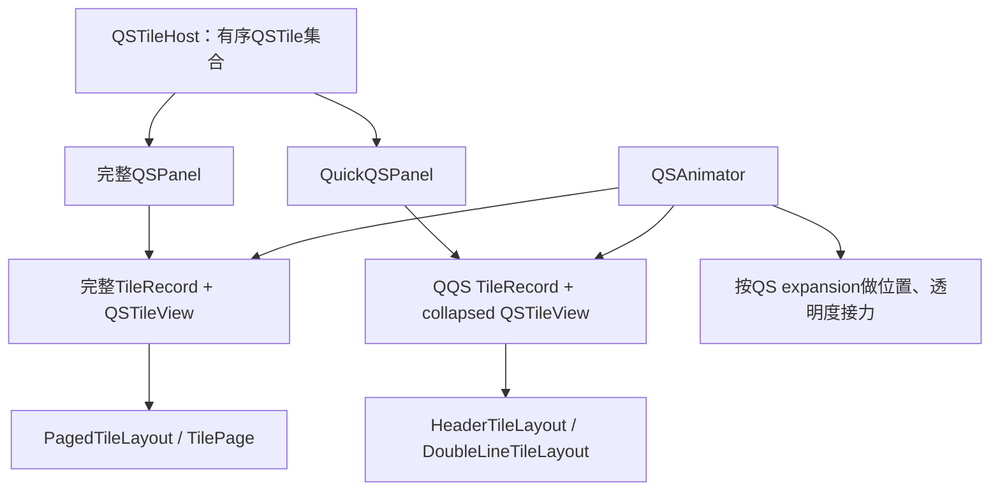
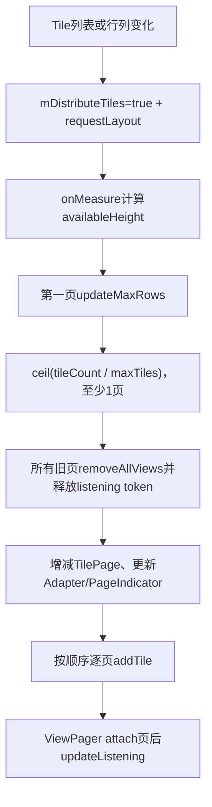
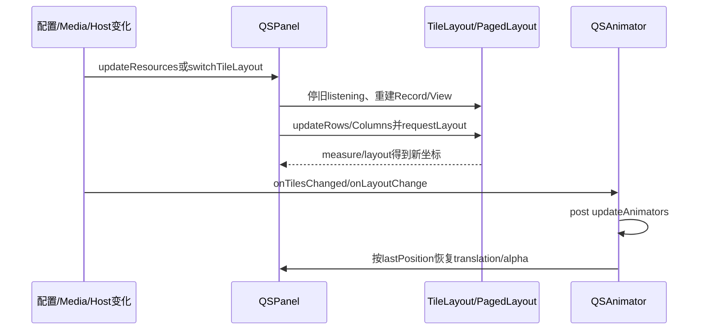

# 第 421 章 Android SystemUI QSPanel、QuickQSPanel、TileLayout：分页、布局与动画

> 源码基线：Android 11 / API 30 / `android-11.0.0_r48`。本章只在 macOS 阅读、检索和推演源码，不编译。第419—420章已经建立Host与Tile对象；本章继续追这些对象怎样成为QQS和完整QS中的View、页面与展开动画。

## 1. 本章先解决什么问题

同一个QSTile为什么能同时出现在顶部QQS和完整QS？Tile数量、行列与分页怎样计算？旋转、媒体卡片和横屏为何重新分配？从折叠图标到完整Tile的动画由谁计算坐标？

## 2. 一句话心智模型

QSPanel把Tile对象包装成TileRecord和View；TileLayout计算网格；PagedTileLayout把记录分配到多个TilePage；QuickQSPanel只截取前N项；QSAnimator再把两套独立View按展开比例做视觉接力。

## 3. 先分清对象所有权

QSTile由Host持有并可被两种Panel共享；每个Panel分别创建自己的QSTileView和Callback；TileRecord属于Panel；TilePage只持Record引用和View父子关系。

## 4. 本章源码地图

主线文件是`QSPanel.java`、`QuickQSPanel.java`、`TileLayout.java`、`PagedTileLayout.java`、`QSAnimator.java`、`QSTileBaseView.java`和`QSFragment.java`。

## 5. 它运行在哪个进程

布局、分页、ViewPager、TouchAnimator和Panel callback都在SystemUI进程。Tile点击后才可能经Controller跨服务；本章的每帧布局动画不跨Binder。

## 6. 它主要运行在哪个线程

View attach、measure/layout、Panel记录替换、分页与动画在主线程。Tile State callback先在Tile后台Looper发出，但Panel/View会通过Handler把真正绘制切回主线程。

## 7. QSPanel和QuickQSPanel不是同一个View

QuickQSPanel继承QSPanel，但两者是不同实例，各有mRecords、TileLayout、TileView和Callback。它们共享QSTile业务对象，不共享视觉对象。

## 8. 完整QS使用什么布局

默认`createRegularTileLayout()`从`qs_paged_tile_layout`inflate出PagedTileLayout。其每一页又是继承TileLayout的TilePage。

## 9. QQS使用什么布局

普通方向使用QuickQSPanel内部HeaderTileLayout；启用媒体横向布局时使用DoubleLineTileLayout。QQS不使用ViewPager分页，只展示可放下的前若干项。

## 10. 图一：共享Tile与两套视觉投影



## 11. setHost怎样接线

QSPanel保存Host、向Host addCallback并立即`setTiles(host.getTiles())`，再把Host交给SecurityFooter与Customizer。Host后续列表变化调用onTilesChanged重建记录。

## 12. 重复setHost有保护吗

没有。它不会先从旧Host removeCallback，也不检查相同Host；重复调用可造成Host callback重复注册和多次列表重建。

## 13. attach时为什么又setTiles

onAttachedToWindow注册brightness Tunable、若Host非null再次读取Tile集合，并注册Mirror与Dump。setHost和attach先后不同，因此两处都做补偿，但正常路径也可能重复构建。

## 14. QuickQSPanel为何还多重建一次

其setHost先调用super；父方法中的虚调用已经进入QuickQSPanel.setTiles。子方法返回后又显式setTiles一次，所以同一次setHost会连续重建两轮QQS记录。

## 15. setTiles先清什么

对旧Record逐个从当前TileLayout removeTile，并向Tile异步removeCallback(record.callback)，然后清mRecords和cached specs。

## 16. 新Record包含什么

保存QSTile、Panel专属QSTileView、Panel专属Callback、DetailAdapter/scan等运行字段。Record是把业务对象、视觉对象和详情状态绑在一起的桥。

## 17. createTileView的collapsed参数

完整Panel传false，QQS传true。默认Factory因此创建完整QSTileView或更紧凑的QSTileBaseView；它不是简单缩放同一View。

## 18. addTile的具体顺序

创建Record/View/Callback，向Tile addCallback，初始化View点击处理，再调用Tile.refreshState，随后加入mRecords、更新cached specs，最后交给TileLayout。

## 19. 初始State是否同步可见

不是。addCallback和refreshState都进Tile BG队列；Callback再把State送到View主Handler。Record已加入布局时，View可能尚在默认视觉状态。

## 20. 为什么完整与QQS都能收State

同一QSTile的mCallbacks中有两个Panel callback。每次changed都扇出；两个callback各自将State送到自己的View。

## 21. QQS怎样处理SignalState

drawTile先复制成新SignalState，把activityIn/activityOut强制false，再交给父类。顶部快速图标不显示网络流量箭头，也不会改动共享稳定State。

## 22. 普通State会复制吗

QQS只对SignalState复制；其他State直接把共享引用送给View。第420章的“主线程消息可能看到后续字段”边界仍然存在。

## 23. Tile callback怎样展示详情

完整和QQS都会收到onShowDetail；完整Panel只有mExpanded时处理，QuickQSPanel重写为`!mExpanded`。设计意图是同一时刻由当前可见层承接。

## 24. 两个Panel的expanded状态若不一致呢

判断是各实例自己的布尔，没有全局仲裁。过渡或接线错误时可能都返回true或都false；showDetail消息也没有唯一消费者token。

## 25. Panel setExpanded做什么

记录日志与metrics；收起时PagedLayout回第一页、关闭detail；展开时记录Panel open并遍历当前Tile写visible metrics。它不直接改变Tile listening。

## 26. listening与expanded为何分开

`setListening(listening, expanded)`只让TileLayout取两者AND；SecurityFooter按外层listening，BrightnessController也按外层listening。即使QS未展开，亮度仍可提前更新。

## 27. setListening(true)的额外刷新

Panel先让Layout向Tile注册token，然后`refreshAllTiles()`再次给每个Tile排refresh，并刷新Brightness restriction和SecurityFooter。

## 28. Layout自己也会触发refresh

第一个listener进入QSTileImpl时又自动refresh。因此从0切listening true时，Tile可能收到Layout触发的一次和Panel refreshAll的一次连续REFRESH。

## 29. TileLayout用什么listener token

普通TileLayout把自身`this`传给每个Tile。PagedTileLayout不直接作为token，而让每个已attach的TilePage作为token。

## 30. detach时先做什么

Panel从Tuner移除，Host removeCallback，让Layout停止listening，清记录、Mirror callback与Dump注册，再调用父类detach。

## 31. detach里的removeCallbacks为何危险

它对每个共享Tile调用无参数`removeCallbacks()`，会清Tile的全部Callback，不只当前Panel的callback。一个Panel先detach时，另一个仍存活Panel的callback也可能被异步清除。

## 32. setTiles清理为何更精确

列表重建时使用`removeCallback(record.callback)`，只移除自己那一份。detach与setTiles采用不同粒度，是r48值得审查的生命周期落差。

## 33. TileLayout保存什么

它是ViewGroup，持mRecords、行列数、cell尺寸/间距、min/max rows与columns，以及mListening。它不拥有QSTile生命周期，只通过token订阅。

## 34. addTile时会立刻listening吗

Record加入后，调用`tile.setListening(this,mListening)`。若Layout已经监听，新加入Tile立即排true；随后View才add到ViewGroup。

## 35. removeTile的顺序

先从mRecords移除，再给Tile排listening false，最后removeView。因为Tile消息异步，View消失早于Controller真正注销。

## 36. removeAllViews为何override

它先给所有Record排false、清记录，再调用ViewGroup清子View。PagedLayout重新分配页面时依赖它正确释放旧TilePage token。

## 37. 资源决定哪些网格参数

列数、Tile高度、横纵间距、顶部margin和最大行数来自资源；列至少1、最大行至少1。产品overlay与方向资源会改变实际布局。

## 38. qs_less_rows是什么

TileLayout构造时读取Settings.System硬编码键，或检测启用QS media player；任一成立就把最大允许行数减1，但不低于minRows。

## 39. 该设置会动态观察吗

不会。mLessRows在构造时计算为final，之后updateResources只重新应用结果。运行中改`qs_less_rows`不会让现有Layout自动重读。

## 40. columns怎样计算

`mColumns=min(resourceColumns,mMaxColumns)`。横向媒体布局可把maxColumns设3；普通完整布局用NO_MAX_COLUMNS=100，实际受资源列数限制。

## 41. 普通TileLayout怎样量cell宽

可用宽度减去`horizontalMargin * columns`，再除以columns。getColumnStart用半个margin作外侧起点，使cell间形成完整margin。

## 42. UNSPECIFIED高度的特殊行为

onMeasure若height mode为UNSPECIFIED，用`ceil(numTiles/columns)`展示全部行；其他模式保留由updateMaxRows计算的mRows。

## 43. 行高度公式

总高是`(cellHeight+verticalMargin)*rows + (topMargin-verticalMargin)`；rows为0时不加顶部修正，最后把负值clamp到0。

## 44. updateMaxRows怎样裁剪

把允许高度换算为行数，再限制到minRows/maxAllowedRows，最后不超过容纳tilesCount所需行数。没有Tile时最后可得到0行，即使minRows先设为1。

## 45. RTL怎样布局

记录顺序不变，只把视觉column映射为`columns-column-1`。因此第一页第一个spec在RTL显示到右侧，持久顺序仍是逻辑顺序。

## 46. 不可见Record怎样测量

普通onMeasure跳过visibility GONE的View，但layoutTileRecords按前`rows*columns`个Record索引布局，没有再次跳GONE；QQS Header重写逻辑专门控制可见前缀。

## 47. HeaderTileLayout为何重算列数

QQS的mMaxTiles只是候选上限，实际屏宽可能放不下。onLayout按当前measured width、cellWidth与Record数计算可容纳columns。

## 48. 全部能放下时怎样分间距

剩余宽度除以`maxTiles-1`，得到图标间margin并令columns=maxTiles；一个Tile时分母用max(1,0)避免除零。

## 49. 放不下时怎样裁剪

columns取`min(maxTiles, availableWidth/cellWidth)`；一个column时用margin居中，否则把剩余宽度均分到间隙。索引大于等于columns的View设GONE。

## 50. 决定性源码：QQS候选数与可见数是两层

```java
for (QSTile tile : tiles) {
    quickTiles.add(tile);
    if (quickTiles.size() == mMaxTiles) break;
}
// HeaderTileLayout稍后还会按实际宽度计算mColumns，
// 并将i >= mColumns的Tile View设为GONE。
```

## 51. mMaxTiles为0或负数的边界

循环先add再比较；size永远不会等于0或负数，所以会收下全部Host Tile。Tuner解析没有clamp，非法字符串回默认，但合法的0/负数反而产生“无限候选”效果。

## 52. mMaxTiles初值窗口

字段初始0，直到NUM_QUICK_TILES Tunable同步回放才设置。setHost若先发生，QQS可能先构建全部Tile，随后Tuner回调再按默认6重建。

## 53. QQS最终可见数是什么

`min(Host可用Tile数, 正常正数mMaxTiles, 屏宽可容纳columns)`。`getNumVisibleTiles()`返回columns，不等于mRecords.size。

## 54. Header测量高度

只测非GONE View为正方形cellWidth×cellHeight，但容器高度固定一个cellHeight。它永远是一行，而不是普通TileLayout的mRows网格。

## 55. QQS无障碍顺序

按可见Record设置traversal after，最后又让mRecords最后一个TileView traversal before expand indicator；若最后Record是GONE，这条关系仍落在隐藏View上。

## 56. policy禁用QQS怎样生效

`setDisabledByPolicy(true)`保存字段并强制GONE；之后外部setVisibility即使请求VISIBLE也会被改回GONE。

## 57. GONE会自动停止Tile listening吗

不会。visibility政策与Panel/Layout的mListening是独立字段；调用方还需正确推进QS listening，否则隐藏QQS仍可能持有Layout token。

## 58. PagedTileLayout持哪些集合

mTiles是完整有序Record列表；mPages是TilePage对象；每页mRecords才是本次容量分配结果。改变mTiles只标mDistributeTiles并requestLayout。

## 59. add/remove为何不立即移动View

真正empty page、增减页与addTile发生在下一次measure触发的distributeTiles。主线程调用返回时，旧页父子关系可能仍短暂存在。

## 60. 图二：分页重分配流程



## 61. 页容量怎样得到

TilePage.maxTiles返回`max(columns*rows,1)`。即使初始化中行列为0也至少1，避免除零和零页。

## 62. 页数公式

至少1页；先用整数除法得到完整页数，再在有余数时加一。空列表也保留一个空TilePage。

## 63. distributeTiles的顺序

先清页并调整页数，再取第一页容量；按mTiles顺序加入当前页，页满才index++。所有页被强制使用第一页算出的相同行数。

## 64. PageIndicator的隐含前置条件

页数变化时直接`mPageIndicator.setNumPages()`，没有null检查。正常QS接线必须在需要增页前setPageIndicator；测试或定制漏接可能NPE。

## 65. 为什么QSPanel测量先更新Indicator

LinearLayout通常先测PageIndicator；Panel在测PagedLayout前预先设置numPages，让Indicator用正确高度/可见性参与同一轮测量。

## 66. 10000像素测量hack

QS位于ScrollView中，Panel临时以EXACTLY 10000测量，并把超出原availableHeight部分作为excessHeight交给PagedLayout，借LinearLayout分配空间后再量化成整行高度。

## 67. 10000是最终高度吗

不是。Panel在super.onMeasure后重新累加所有非GONE child实测高度与margin，覆盖自己的measured height；PagedLayout也取子页最大高度wrap回来。

## 68. excessHeight为何参与缓存键

PagedLayout只有Tile变化、最大height变化或excessHeight变化才重算行数/分页。父Panel布局结构变化即使总measure size相同，也可通过excess变化触发。

## 69. PagedLayout listening只开当前页吗

不是严格当前页。updateListening给所有已经attach到ViewPager的TilePage传mListening，未attach页传false；ViewPager通常还attach相邻offscreen页，所以不可见邻页也可能监听。

## 70. 页面attach/destroy怎样更新监听

PagerAdapter instantiateItem和destroyItem在add/remove View后都调用updateListening。TilePage作为精确class token，也会让QSTileImpl metrics识别full QS。

## 71. 页面重分配时监听窗口

所有旧页removeAllViews先给Tile排false；随后新页addTile按TilePage当前mListening排true。异步Tile Handler可能看到false/true序列并短暂注销再注册Controller。

## 72. setCurrentItem怎样处理RTL

调用者使用逻辑页号，override在RTL映射为`pages-1-item`再交ViewPager；getCurrentPageNumber反向映射回来。

## 73. 旋转为何回第一页

orientation变化时setCurrentItem(0,false)并把待恢复页设0，防止新行列容量下旧页号越界或语义错位。

## 74. RTL变化为何重设Adapter

页面物理顺序要反转，因此setAdapter并回逻辑第一页。已有scroll/selection动画不会保留原页。

## 75. save/restore页号的时机

restore时通常还只有一页，先存mPageToRestore；等页面数真正inflate后再setCurrentItem。方向变化会把待恢复值覆盖为0。

## 76. setExpansion在分页里做什么

保存mLastExpansion并更新selected。它不移动页；只在fraction恰好0或1时改变当前页selected，用于marquee与可见Tile日志。

## 77. 中间fraction为何不改selected

marquee没有pause API，0到1之间直接return，保持前一selected状态；到完全展开才选当前页，到完全收起才全不选。

## 78. 更新selected为何暂时关无障碍

代码先设NO_HIDE_DESCENDANTS，避免纯为marquee而setSelected触发TYPE_VIEW_SELECTED播报，完成后恢复AUTO。

## 79. PageListener怎样定义“第一页”

onPageSelected按RTL判断逻辑第一页；onPageScrolled只有offsetPixels为0且位置在逻辑首页才true。拖动途中会反复通知false。

## 80. Tile reveal动画何时允许

spec非空、至少两页、scrollX为0且beginFakeDrag成功；它只在最后一页找新增spec，找不到就endFakeDrag且不调用postAnimation。

## 81. reveal怎样移动页面

把offscreenPageLimit临时设到最后页，用自定义Scroller在750ms fake drag到末页，随后对目标Tile做alpha/scale从0到1的450ms错峰bounce。

## 82. fakeDrag异常怎样兜底

源码捕获ViewPager内部NullPointerException，post直接切到最后页并启动bounce；endFakeDrag也吞NPE只记录日志。它选择视觉恢复而非让SystemUI崩溃。

## 83. postAnimation一定执行吗

不一定。前置条件失败或最后页没有目标Tile时直接return，只有真正构建的AnimatorSet onAnimationEnd才调用Runnable。

## 84. QSAnimator解决什么

它不是分页器，而是把QQS小图标与完整QS第一页Tile建立坐标对应，随QS展开比例设置translation、alpha、brightness/footer延迟等属性。

## 85. 动画对象何时重建

Host Tile变化、QS根View layout、RTL、Tuner动画配置或QQS数量变化都会updateAnimators；layout/tile callback先post，等新View坐标稳定后再算。

## 86. 为什么不能提前算坐标

每个Tile在QQS和完整Panel有不同父层级，必须沿View parent累加left/top并扣除scroll；measure/layout前宽高与位置还未确定。

## 87. 第一页Fancy动画

前N个可见QQS Tile与完整Tile互相translation到对应位置；完整图标背景在过程中隐藏/显现，其他Tile从上方淡入，brightness在后半程淡入。

## 88. 超出完整页可见容量的QQS Tile

若QQS能显示但完整当前页容量更少，该QQS View向侧方/下方移动并alpha消失，不会硬匹配一个当前页不存在的完整Tile。

## 89. full rows配置

`sysui_qs_move_whole_rows`允许把与QQS同一行范围内的额外完整Tile也从近似QQS位置移动；行范围以QQS数量向上取整到完整QS column count。

## 90. 非第一页动画

不再做一一图标平移，而让QuickQSPanel淡出、完整TileLayout延迟淡入。用户不在第一页时两套顺序无法自然匹配。

## 91. 动画关闭意味着什么

`sysui_qs_fancy_anim=false`关闭复杂一一平移；仍有非首页/基础alpha路径和Panel自身展开，不表示QS完全无动画。

## 92. QSAnimator怎样知道当前页

QSPanel把PagedTileLayout PageListener交给它；离开第一页时clearAnimationState并更新mOnFirstPage，后续setPosition选择非首页animator。

## 93. Keyguard如何改position

onKeyguard时，若允许collapsed header则强制position=0，否则强制1；同时QuickQSPanel可能设INVISIBLE，避免锁屏上出现错误过渡态。

## 94. clearAnimationState清什么

把所有已跟踪View alpha恢复1、translation归0、Quick图标背景VISIBLE，但先把QuickQSPanel alpha设0。随后setCurrentPosition/animator需要把最终可见性重新收敛。

## 95. 为什么Tile变化后用post

Host callback到来时两个Panel可能还在各自setTiles创建View。QSAnimator在mQsPanel.post中重建，可等当前主线程消息的布局对象接线完成，仍不保证已经经过下一次layout。

## 96. layout变化会重复post吗

每次QS根View onLayoutChange都post同一个Runnable，源码没有removeCallbacks去重。快速连续layout可能排多次updateAnimators，增加主线程计算。

## 97. 坐标查找失败怎样表现

完整TileView为null时记录错误并跳过；QQS对应View为null时continue。部分Tile缺动画不会阻止其他Tile构建。

## 98. QSPanel横向媒体布局是什么

Media可见且配置允许时，Panel把Tile内容和MediaHost放进横向容器，可能切换到另一QSTileLayout，调整row/column、margin、padding和DisappearParameters。

## 99. switchTileLayout为何重建所有Record

旧Layout先停止listening、移除Tile/View和Callback，再指定newLayout，重新从Host setTiles并恢复listening。View不能同时属于两个父容器。

## 100. 图三：配置与动画的收敛关系



## 101. 横向切换的异步监听边界

旧TilePage false、新Layout true和Callback remove/add都经Tile BG Handler。主线程已显示新布局时，Tile内部可能仍在处理旧监听/回调消息。

## 102. regular与horizontal可能是同一Layout

基类`createHorizontalTileLayout()`直接返回regular；代码因此有“若两者相同只重挂parent、不隐藏”的条件。QuickQSPanel才真正创建DoubleLineTileLayout。

## 103. updateResources为何会刷新所有Tile

若Panel正在listening，先refreshAllTiles，再让Layout更新资源。配置变化不仅重新measure，也可能让label、icon或policy按新资源重算。

## 104. 配置回调可能造成重复刷新

Panel updateResources refresh一次，Layout变化触发布局，Tile自身ConfigurationController也可能refresh。QSTileImpl不合并REFRESH，短时队列会增长。

## 105. PageIndicator visibility的细节

setFooterPageIndicator后QSPanel先把它GONE，再交给PagedLayout；PageIndicator自身根据页数/父布局后续处理显示。仅看到GONE不能断言永远不显示。

## 106. getNumVisibleTiles的两种含义

Header返回当前columns；Paged返回当前逻辑页Record数；普通TileLayout返回全部mRecords，即便行列容量可能只layout前缀。调用方必须知道具体实现。

## 107. dump能看到什么

QSPanel dump主要列Panel状态与各Tile Record/State，Paged布局的页数、attached页、rows/columns、scroll与动画队列并没有完整统一快照。

## 108. 正确的成功层级

Host有Tile、Panel有Record、Layout有View、Page已attach、Tile listening、State到View、measure/layout完成、QSAnimator属性收敛与像素可见是不同层级。

## 109. 一条完整列表变化链

Host提交新Map并callback；两个Panel各自移除旧Record/Callback、创建新View并refresh；PagedLayout下一次measure重分页；QSAnimator再post重建坐标；Tile BG State随后陆续到主View。

## 110. 为什么偶发“有空位但Tile下一帧才出现”

列表回调、BG refresh、View主Handler、requestLayout、分页分配和Animator rebuild跨多个队列/帧。主线程Map更新完成不等于同一帧已有最终像素。

## 111. 最常见的六个误解

一是认为QQS和完整QS共享View；二是把max quick tiles当最终可见数；三是认为Paged只监听当前页；四是把setTiles当同步状态稳定；五是认为Fancy关闭等于无动画；六是忽略detach清全部Tile callbacks。

## 112. macOS只读练习一：手算网格和页数

给定12个Tile、3列、允许2行，手算cell容量、页数和每页spec；再把允许高度改到只能1行，重新推演removeAllViews、增页与listening false/true消息。

## 113. macOS只读练习二：推演QQS边界

分别令mMaxTiles为6、0、-1，屏宽只能放4个，逐行推演QuickQSPanel.setTiles与Header.calculateColumns，区分mRecords数量和getNumVisibleTiles。

## 114. macOS只读练习三：检查双Panel callback

从同一个WifiTile出发，画出完整QS与QQS各自Callback/View；随后只detach其中一个Panel，追`removeCallbacks()`对另一个Panel的影响，不修改代码。

## 115. macOS只读练习四：重建动画坐标链

用`rg`定位QSFragment向PagedLayout.setExpansion和QSAnimator.setPosition的调用，记录一次旋转后Host/Panel/Layout/Animator各自收到什么事件，以及哪一步必须等layout坐标。

## 116. 练习预期结论

分页容量是rows×columns且至少1；QQS候选上限还受屏宽二次裁剪；两Panel共享业务Tile但各有View/Callback；分页监听attached页而非严格当前页；动画必须在View重建和layout后重算。

## 117. 复读源码后修正了哪些容易误讲之处

复读后明确：Quick setHost实际重建两次；mMaxTiles为0/负数会收下全部候选；Header无障碍before可能指向GONE尾项；Paged add/remove延迟到measure分配；PageIndicator有非空前提；邻近attach页也listening；reveal前置失败不调用postAnimation；Panel detach会清共享Tile全部Callback。

## 118. 本章没有覆盖什么

具体Tile业务、DoubleLineTileLayout的全部媒体算法、QSTileView内部图标动画、Customizer拖拽和CustomTile Binder将在后续章节展开。本章只建立Panel—Record—Layout—Animator主线。

## 119. 阅读完成检查表

应能解释两套View投影、Record创建顺序、listening token、普通网格测量、QQS两层裁剪、分页重分配、attached页监听、RTL/旋转、reveal动画、QSAnimator第一页/非首页策略及生命周期竞态。

## 120. 本章结论

Quick Settings的“按钮排版”其实是多队列、多投影的收敛过程：Host提供业务对象，Panel建立视觉副本，Layout决定容量和页面，Animator只做两套View之间的视觉连续性。诊断时逐层确认，才能避免把持久顺序、页面容量、监听状态和像素动画混成一件事。
