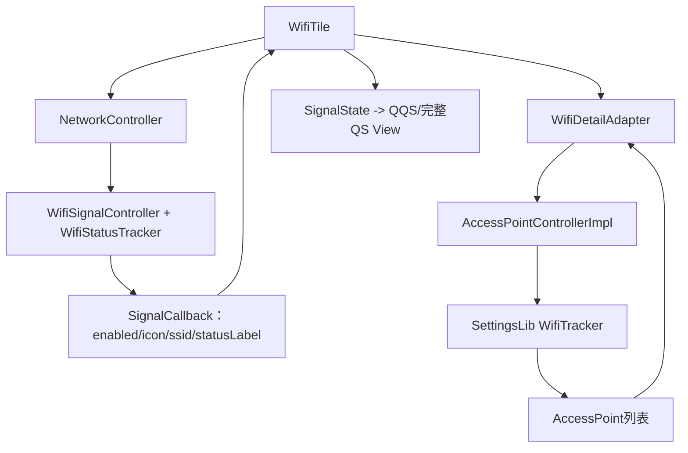
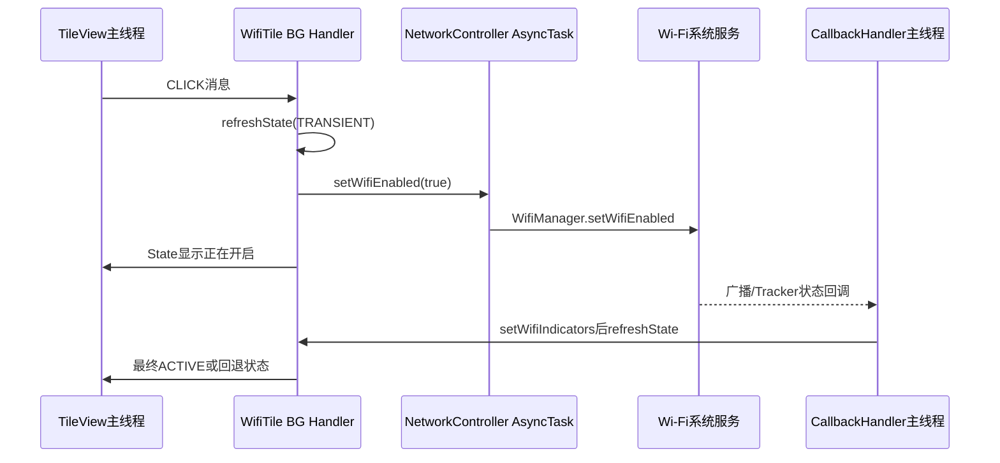
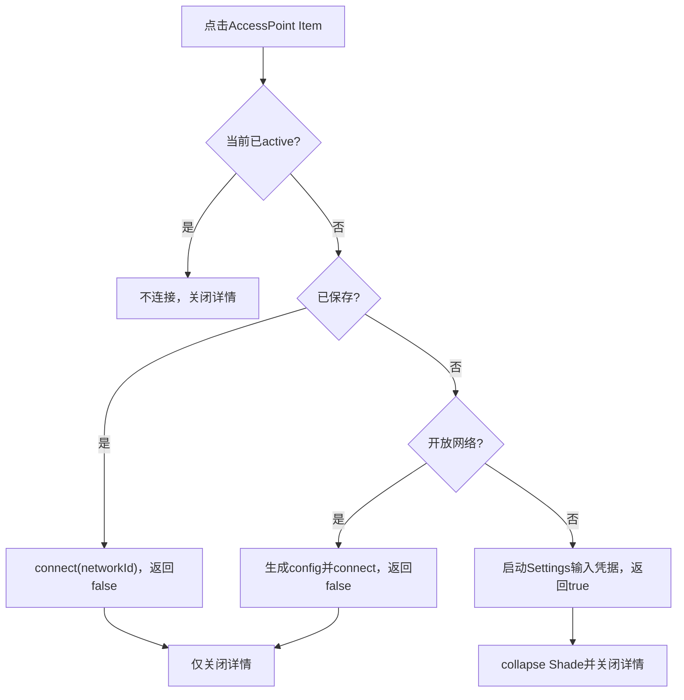

# 第 422 章 Android SystemUI Wi‑Fi Tile：NetworkController回调、详情面板与设置跳转

> 源码基线：Android 11 / API 30 / `android-11.0.0_r48`。本章只在 macOS 阅读、检索和推演源码，不编译。重点是从Tile点击到Wi‑Fi事实回流的闭环，以及详情页使用的另一套AccessPoint跟踪链。

## 1. 本章先解决什么问题

点击Wi‑Fi Tile为何先出现“正在开启”？主按钮、二级点击和长按有什么差别？详情里的热点从哪里来？点击加密新网络为何跳Settings，而点击已保存网络却留在SystemUI？

## 2. 一句话心智模型

WifiTile不直接维护Wi‑Fi真相：NetworkController提供开关/连接摘要，AccessPointController提供详情列表；Tile把请求发给Controller，再等待异步回调重算SignalState并投影到两套QS View。

## 3. 两条数据链必须分开

顶部Tile状态来自WifiSignalController/WifiStatusTracker；详情热点列表来自AccessPointControllerImpl自己的WifiTracker。它们都读WifiManager，但生命周期、缓存与回调协议不同。

## 4. 本章源码地图

主线是`WifiTile.java`、`NetworkControllerImpl.java`、`WifiSignalController.java`、`CallbackHandler.java`、`AccessPointControllerImpl.java`以及SettingsLib的`WifiTracker.java`。

## 5. 它运行在哪个进程

Tile、NetworkController和详情Adapter在SystemUI进程；WifiManager请求跨到Wi‑Fi系统服务；加密新网络与受限用户路径会启动Settings应用Activity。

## 6. 它涉及哪些线程

Tile handleClick/handleUpdateState在共享BG Looper；Network CallbackHandler默认在主线程；WifiTracker有独立HandlerThread但把UI listener再post主线程；WifiManager enable由AsyncTask后台执行。

## 7. WifiTile继承了什么

它继承`QSTileImpl<SignalState>`，获得消息队列、双State、listening与Callback协议；自己实现点击、状态计算、详情Adapter、可用性和网络SignalCallback。

## 8. 它持有哪些核心依赖

NetworkController处理总Wi‑Fi开关和状态；其AccessPointController处理热点列表与连接；ActivityStarter负责越过Keyguard启动Settings；WifiDetailAdapter连接QSDetail UI。

## 9. State为何使用SignalState

除开关value外，还要携带activityIn/activityOut和网络图标信息。QQS在第421章会复制State并隐藏流量箭头，完整QS可显示。

## 10. 图一：主Tile与详情的双链



## 11. 构造时做了什么

父类先建立State；Tile取得AccessPointController，创建单一DetailAdapter，保存ActivityStarter，最后用`mController.observe(getLifecycle(),mSignalCallback)`绑定生命周期。

## 12. isAvailable的门

只检查PackageManager FEATURE_WIFI。没有Wi‑Fi硬件时Host创建阶段会destroy并不加入运行Map；运行中Wi‑Fi关闭不是不可用，而是State INACTIVE。

## 13. 两个额外状态字段

`mStateBeforeClick`保存点击前SignalState，原本用于无障碍播报延迟判断；`mExpectDisabled`在关闭请求后冻结仍为enabled的旧回调。

## 14. observe怎样工作

QSTile Lifecycle到RESUMED时调用NetworkController.addCallback，PAUSE时removeCallback。Tile是否在任一QS Layout listening决定这条订阅是否存在。

## 15. addCallback会先给初始快照

NetworkControllerImpl同步向新callback发送subs、airplane、no-SIM和各SignalController当前状态，最后才通过CallbackHandler异步把callback加入持续监听列表。

## 16. 快照与注册之间有窗口

若新Wi‑Fi状态已经排在主CallbackHandler、但add-listener消息尚未执行，该增量可能在listener加入前扇出；调用方已有较早同步快照，却可能短暂漏掉中间变化，等待下一次状态才能收敛。

## 17. 初始与后续回调线程可能不同

Lifecycle通常在Tile BG Handler切RESUMED，因此同步初始`setWifiIndicators`可发生在BG；注册后CallbackHandler的增量在主线程。WifiSignalCallback不是固定单线程入口。

## 18. CallbackInfo是可变共享缓存

setWifiIndicators逐字段改mInfo，再调用refreshState；handleUpdateState在Tile BG读取。字段没有锁或整体不可变快照，依靠回调后排消息的时序，但主线程后续写与BG读取仍不是严格原子对象交换。

## 19. 主点击的第一步

handleClick先把当前稳定mState复制到mStateBeforeClick，再读取`wifiEnabled=mState.value`。这里读的是Tile最近一次投影，不是同步向WifiManager查询。

## 20. 开启时为何先做transient refresh

若当前value false，立即`refreshState(ARG_SHOW_TRANSIENT_ENABLING)`；BG后续把value临时设true、使用动画icon和“正在开启”副标题，为慢速系统请求提供即时反馈。

## 21. 关闭时为什么也先refresh

传入arg为null，随后发送disable请求并置mExpectDisabled=true。这个refresh执行时若缓存仍enabled会被expect逻辑提前return，从而保持点击前视觉，等待真实disabled回调。

## 22. setWifiEnabled不是直接Binder主线程调用

NetworkControllerImpl新建AsyncTask，在doInBackground调用WifiManager.setWifiEnabled。Tile BG Handler很快返回，系统服务是否接受还未知。

## 23. 请求结果被处理了吗

WifiManager返回boolean被忽略，doInBackground总返回null，也没有onPostExecute/error回调。最终只能依赖广播/WifiStatusTracker改变Signal状态。

## 24. mExpectDisabled的冻结规则

handleUpdateState发现expect=true且cb.enabled仍true就直接return；只有看到enabled=false才清标志并正常更新，避免关闭动画期间旧enabled回调把视觉拉回。

## 25. 350ms兜底做什么

关闭请求后postDelayed QS_ANIM_LENGTH=350ms；若仍expect，清标志并refresh。它不是Wi‑Fi关闭超时，只是不再冻结旧状态。

## 26. 开启为何没有对应350ms兜底

开启只靠transient arg和后续Controller回调；若系统不产生新回调，State可保持临时开启，直到其他refresh或10分钟stale触发。基类没有短时失败回滚。

## 27. 快速连点的输入真相

每个CLICK按当时mState.value决定方向；第一个开启的transient refresh可能尚未copy时第二个click仍读false，再次请求开启。没有requestId或点击防抖。

## 28. 状态请求与视觉状态不是事务

日志已记录、AsyncTask已提交、transient已显示、Wi‑Fi服务已接受、广播已到、网络已连接是六个阶段；任一前阶段都不证明后阶段成功。

## 29. secondaryClick默认语义被重写

WifiTile不沿用基类“等同primary”的默认。它把secondary理解为打开详情；但用户无权配置Wi‑Fi时改为启动完整Settings页面。

## 30. canConfigWifi检查什么

AccessPointController用当前userId查询UserManager `DISALLOW_CONFIG_WIFI`。它只影响secondary详情入口，不自动给Tile State设置disabledByPolicy。

## 31. 打开详情会自动开启Wi‑Fi

有配置权时先`showDetail(true)`；若当前mState.value为false，紧接着请求setWifiEnabled(true)。查看热点列表本身具有开启无线电的副作用。

## 32. 这里会显示transient吗

secondary路径没有主动带ARG的refresh，依赖WifiStatusTracker的isTransient/enable回调；反馈时机可能不同于primary开启。

## 33. primary click为何没有canConfigWifi门

handleClick直接调用setWifiEnabled，handleUpdateState也未调用restriction helper。最终权限/用户限制要由WifiManager服务端执行，Tile UI本身可能仍短暂显示请求态。

## 34. 详情Toggle的限制门

setToggleState也直接记metrics并setWifiEnabled，没有再次canConfigWifi；正常只有通过已检查的secondary路径才能打开，但其他代码若直接展示Adapter需自行保证。

## 35. 长按做什么

返回静态`Settings.ACTION_WIFI_SETTINGS` Intent，由QSTileImpl的ActivityStarter路径启动。长按不使用AccessPoint列表，也不等待Shade收起完成。

## 36. handleUpdateState先读什么

读mSignalCallback.mInfo；若关闭冻结未解除先处理expect，然后根据arg、enabled、qsIcon id、ssid、activity和statusLabel构建整个SignalState。

## 37. transient的两个来源

`arg == ARG_SHOW_TRANSIENT_ENABLING`表示Tile乐观反馈；`cb.isTransient`来自WifiStatusTracker真实状态。局部`isTransient`是两者OR。

## 38. r48没有写state.isTransient

源码用局部isTransient决定动画icon和secondaryLabel，却没有`state.isTransient=isTransient`。SignalState继承字段保持旧值/默认false，其他View逻辑不能从该字段识别这次Wi‑Fi transient。

## 39. wifiConnected的条件

要求cb.enabled、qs icon id大于0且ssid非null；没有直接使用CallbackInfo.connected。qsIcon.visible被保存进connected字段，但当前handleUpdateState不读它。

## 40. wifiNotConnected的条件

只要求icon id大于0且ssid null；最终分支还先判断state.value false。因此开启或transient状态下会显示“无网络”图标。

## 41. State value怎样计算

`transientEnabling || cb.enabled`。只有Tile自己的乐观arg能在真实enabled=false时先把value变true；仅cb.isTransient但enabled false不会单独令value true。

## 42. 图标四种分支

transient用framework动画资源；关闭用disabled图标加slash；已连接用回调信号图标；开启未连接和其余情况都用QS_WIFI_NO_NETWORK。

## 43. SlashState怎样复用

首次为空时创建并固定rotation=6；每轮先isSlashed=false，关闭分支再true。因为临时State复用，显式重置避免上次关闭斜杠残留。

## 44. label怎样选择

已连接显示去外层双引号的SSID；其他状态显示通用Wi‑Fi标签。transient副标题来自“正在开启”，普通副标题直接用statusLabel。

## 45. removeDoubleQuotes的边界

只在长度大于1且首尾都是双引号时去掉一层；不解码转义、不trim，也不处理只有单侧引号。

## 46. 流量箭头何时为true

必须cb.enabled且对应activityIn/out为true。WifiSignalController又只在SSID present时向Callback传activity，所以未连接不会显示流量。

## 47. Toggle变化如何通知详情

比较临时State旧value与cb.enabled；不同时让Detail items visible跟随真实enabled，并fireToggleStateChanged。比较对象是mTmpState的旧值，不一定等于屏幕刚显示的mState。

## 48. 内容描述如何组成

最小contentDescription始终以Wi‑Fi标签和逗号开头；value true且connected时追加SSID与非空secondaryLabel。开启但未连接不会追加“无网络”文字。

## 49. stateDescription来源

连接时使用qsIcon contentDescription，它在WifiSignalController中可附加“无互联网”；未连接时保持空。expanded accessibility class设为Switch。

## 50. 决定性源码：局部transient与State字段落差

```java
boolean isTransient = transientEnabling || cb.isTransient;
state.secondaryLabel = getSecondaryLabel(isTransient, cb.statusLabel);
state.value = transientEnabling || cb.enabled;
if (isTransient) {
    state.icon = ResourceIcon.get(
            com.android.internal.R.drawable.ic_signal_wifi_transient_animation);
}
// r48这里没有：state.isTransient = isTransient;
```

## 51. WifiSignalCallback接收哪些值

enabled、状态栏Icon、QS Icon、上下行、description/SSID、isTransient和statusLabel。WifiTile只保存QS Icon字段，statusIcon对Tile状态没有直接作用。

## 52. 详情显示时的额外动作

Signal回调若`isShowingDetail()`，先调用DetailAdapter.updateItems，再refreshState。列表更新使用旧/当前AccessPoint缓存，随后Toggle和Tile状态再异步收敛。

## 53. 后续Signal回调为何在主线程

WifiSignalController把变化交给CallbackHandler；其setWifiIndicators使用post并遍历signalCallbacks，默认Handler绑定main Looper。

## 54. refresh又回到哪个线程

主线程WifiSignalCallback修改mInfo后调用QSTileImpl.refreshState，把REFRESH排到Tile BG Looper。View更新最终再post回主线程，形成main→BG→main。

## 55. mInfo更新不是整体快照

九个字段逐一赋值后才refresh；同一个CallbackHandler串行可避免两个主回调彼此穿插，但BG可能正读上一轮。没有generation用于确认字段属于同一通知代次。

## 56. WifiSignalController的事实来源

内部WifiStatusTracker持续监听广播、网络能力、score和WifiManager；把enabled、connected、SSID、RSSI/level、default network与statusLabel复制到WifiState。

## 57. 状态栏可见与QS可见规则不同

statusIcon的visible还考虑是否有移动数据、是否default与产品资源；qsIcon.visible直接用connected。Tile却不用qsIcon.visible决定connected公式，只保存到未使用字段。

## 58. Captive Portal怎样改QS图标

若WifiStatusTracker.isCaptivePortal，qsIcon强制`ic_qs_wifi_disconnected`；否则按信号/连接状态选图标。SSID仍可能存在，Tile会进入connected label分支但显示该特殊图标。

## 59. 无互联网怎样进入描述

WifiState inetCondition为0时，WifiSignalController给contentDescription追加“无互联网”；该字符串再成为Tile stateDescription，辅助功能可读出连接质量。

## 60. 图二：一次primary开启的跨线程时间线



## 61. 生命周期RESUMED如何产生

任一TileLayout token从0变1时QSTileImpl先把Lifecycle设RESUMED，observe收到ON_RESUME并addCallback；随后Tile又排至少一次refresh。

## 62. PAUSE如何移除SignalCallback

最后listener移除时Lifecycle降到STARTED，产生ON_PAUSE，NetworkController.removeCallback把remove消息发给主CallbackHandler。

## 63. remove并非同步生效

Lifecycle回调返回时，CallbackHandler列表可能尚未执行remove；已排队setWifiIndicators仍可到达Tile并排refresh。

## 64. destroy的观察者边界

第420章所述handleDestroy不会把Lifecycle设DESTROYED/STARTED；若Tile仍处于RESUMED且没有后续Layout false token，NetworkController observer可能继续注册。正常Host/Panel清理时序通常补发false，但基类不硬保证。

## 65. CallbackHandler会去重listener吗

不会，ADD直接ArrayList.add。Lifecycle重复RESUME或接线异常可造成重复Signal回调；remove一次只移除一个实例。

## 66. AsyncTask请求顺序

每次setWifiEnabled新建AsyncTask并execute；r48默认执行器的具体串并行政策不应被Tile当业务保证。快速on/off请求最终仍以服务端和广播事实收敛。

## 67. 用户切换怎样影响详情权限

NetworkController onUserSwitched更新AccessPointController的mCurrentUser，随后updateConnectivity。canConfigWifi下一次查询新用户restriction；已打开详情没有在这里主动关闭。

## 68. WifiDetailAdapter何时注册

QSPanel真正展示详情时调用Tile.setDetailListening(true)，WifiTile向AccessPointController add callback；关闭则remove。它不跟普通Tile listening完全同步。

## 69. 第一个详情callback启动什么

AccessPointController列表从0到1时调用WifiTracker.onStart：同步forceUpdate、注册score cache、恢复扫描、注册广播和NetworkCallback。

## 70. scanForAccessPoints名称容易误导

其实现只立即`fire...Callback(mWifiTracker.getAccessPoints())`，不直接调用WifiManager.startScan。持续扫描由已启动的WifiTracker管理。

## 71. createDetailView的步骤

清mAccessPoints，convert或inflate QSDetailItems，设置tag/callback，立即回放当前AP列表，并按mState.value设置items可见性。

## 72. Detail view复用什么

convertView可复用QSDetailItems，但Adapter每次把mAccessPoints清null并重设callback；旧列表不会直接沿用，等待scanForAccessPoints回放。

## 73. WifiTracker为何有独立工作线程

扫描结果、网络评分与广播处理放在专用HandlerThread；内部AccessPoint集合用锁保护。ListenerExecutor再把UI callbackpost到main。

## 74. onStart必须在主线程

SettingsLib标注@MainThread，AccessPointController由详情UI主线程add callback满足该约束；若后台直接setDetailListening会违反预期。

## 75. 最后详情callback移除时做什么

WifiTracker.onStop注销广播、NetworkCallback、score cache，暂停扫描并清work Handler消息。工作线程本身直到onDestroy才quit。

## 76. AccessPointController何时onDestroy

r48主要在finalize中调用mWifiTracker.onDestroy，没有显式组件destroy方法。它是长生命周期Controller，依赖进程/GC兜底，不适合频繁创建。

## 77. AP列表为何先复制

WifiTracker.getAccessPoints在锁内返回new ArrayList；DetailAdapter再转成AccessPoint数组，避免直接持有Tracker内部List结构。

## 78. reachable过滤怎样做

先统计isReachable数量；若少于总数，新建精确长度数组并复制reachable项。AccessPoint对象本身没有深拷贝，属性仍可能后续变化。

## 79. 扫描Spinner何时显示

Wi‑Fi enabled且mAccessPoints为null或长度0时fireScanStateChanged(true)；有至少一个AP或Wi‑Fi关闭时false。它表示“列表仍空”，不是底层扫描API精确运行态。

## 80. Wi‑Fi关闭时详情内容

设置“Wi‑Fi已关闭”empty state并把items设null后return；同时handleUpdateState会让itemsVisible false。

## 81. 开启但没有AP时

empty state使用“没有可用网络”；items为null或空数组。Spinner可能继续true，直到列表非空或Wi‑Fi关闭。

## 82. 每个Item展示什么

icon来自AP level，line1是SSID；仅active AP显示summary；非开放网络显示锁图标，开放网络icon2=-1。

## 83. 点击null Item怎样处理

item或tag为null直接return，不关闭详情。tag被强转AccessPoint，没有instanceof检查，外部错误Item会ClassCastException。

## 84. 点击当前active AP

不发connect请求，随后仍`showDetail(false)`关闭详情。它不是“断开当前网络”的入口。

## 85. 点击已保存AP

WifiManager.connect(networkId,listener)，AccessPointController返回false；WifiTile不会collapse整个Shade，但会关闭detail。

## 86. 点击未保存开放AP

先generateOpenNetworkConfig，再connect(config,listener)，同样返回false并只关闭detail。

## 87. 点击未保存加密AP

构造ACTION_WIFI_SETTINGS，附加`wifi_start_connect_ssid`与NEW_TASK，通过callback让ActivityStarter启动，以便用户输入凭据；方法返回true。

## 88. connect返回值真正表示什么

不是“请求成功”，而是“触发了Settings Activity”。saved/open直连即使已提交也返回false；secured新网络仅安排Activity却返回true。

## 89. Shade何时collapse

只有`connect(ap)`返回true时调用Host.collapsePanels，也就是Settings跳转路径。直接连接留在Shade，仅关闭detail供用户观察Tile状态。

## 90. detail为何总关闭

除null/tag early return外，无论active、direct connect还是Settings跳转，末尾都`showDetail(false)`。connect失败回调不会自动重开。

## 91. WifiManager ActionListener做什么

成功或失败只写DEBUG日志；不向DetailItems显示toast/error，不刷新列表，也不改变返回值。

## 92. 连接失败如何最终呈现

依赖WifiTracker后续仍显示未连接/旧列表；用户可能只看到详情关闭而Tile未变化。没有专用失败UI或重试协议。

## 93. DEBUG日志的潜在空config边界

connect开头在DEBUG下先访问`ap.getConfig().networkId`，早于isSaved分支；若某未保存AP的config为null，debuggable/loggable设备可能在日志表达式NPE，user非DEBUG路径反而不触发。

## 94. Settings Activity回调在哪执行

AccessPointController遍历当前详情callbacks调用onSettingsActivityTriggered；WifiDetailAdapter用ActivityStarter postStartActivityDismissingKeyguard，不在Controller里直接startActivity。

## 95. onDetailItemDisconnect为何为空

r48 WifiDetailAdapter明确noop，详情列表没有通过QSDetailItems secondary action断开网络的实现。

## 96. canConfigWifi只看哪个限制

只检查DISALLOW_CONFIG_WIFI与mCurrentUser；不在此处判断位置开关、扫描权限、飞行模式或具体网络管理员策略，其他层仍可拒绝。

## 97. AP icon索引的假设

负level被clamp到0，但没有对超过ICONS长度的值做上界clamp；依赖AccessPoint.getLevel始终返回合法范围。

## 98. 安全锁图标的粒度

只区分SECURITY_NONE与其他，WEP/WPA/企业网络都显示同一个锁，不表达认证类型或是否需要用户交互。

## 99. reachable是瞬时属性

过滤发生在每次onAccessPointsChanged；列表生成后AP可变，且没有generation把Item点击绑定到某次扫描。过期Item仍可能被点击并提交连接。

## 100. 图三：详情Item点击决策



## 101. 两个Tracker为何不能混为一个

WifiSignalController的WifiStatusTracker在NetworkController生命周期内持续跟踪摘要；详情WifiTracker只在有AccessPoint callback时启动扫描。一个更新Tile不等于另一个已有新AP列表。

## 102. 详情扫描的功耗边界

Detail setListening控制WifiTracker onStart/onStop；若QS详情关闭消息遗漏或Adapter callback残留，扫描/网络评分监听可能继续消耗资源。

## 103. mItems与callback生命周期

Adapter持有最近一次QSDetailItems View；关闭详情后setDetailListening false，但mItems没有置null。晚到主线程AP callback仍可能update已脱离界面的View对象。

## 104. late callback会被generation过滤吗

不会。AccessPointController和Adapter都没有详情session id；remove前已post到main的WifiListener callback仍可更新数组/items。

## 105. 状态与列表的一致性

Tile mState.value可能已false而AP列表仍是旧缓存；updateItems先看SignalCallback enabled决定显示“关闭”，不会因为数组里还有AP就继续展示。

## 106. metrics记录哪些动作

primary/secondary/long由QSTileImpl记录；详情Toggle额外记录QS_WIFI_TOGGLE；Item连接没有在WifiTile里按AP单独写Metrics action，主要依赖WifiManager/Tracker日志。

## 107. dump的证据边界

QSTileHost dump可打印WifiTile State；NetworkController/AccessPointController各有状态与WifiTracker dump。但mExpectDisabled、mStateBeforeClick、mInfo全部字段、详情session和AsyncTask结果并非一个统一快照。

## 108. “Wi‑Fi已开”至少有几层

Tile transient value、SignalCallback enabled、WifiManager radio enabled、已连接AP、validated internet、default network是不同层。图标ACTIVE不等于已经联网，更不等于互联网可用。

## 109. 一条完整直连链

详情获取AP→用户点saved网络→WifiManager connect→详情立即关闭→ActionListener仅日志→广播/NetworkCallback更新两个Tracker→Signal callback重算Tile→AP callback更新列表。

## 110. 排查“点击无反应”的顺序

先看CLICK与policy/State，再看AsyncTask请求、WifiManager返回与服务日志，接着看WifiSignalController状态、CallbackHandler注册、Tile REFRESH/State，最后确认View callback与QS像素。

## 111. 最常见的六个误解

一是把transient当真实enabled；二是认为scanForAccessPoints主动发起扫描；三是把connect返回值当连接成功；四是认为secondary只打开详情不会开Wi‑Fi；五是认为primary受canConfigWifi UI门；六是把两套Tracker当同一缓存。

## 112. macOS只读练习一：推演开启失败

从mState.value=false开始，假设WifiManager拒绝且没有新Signal回调，逐消息写出transient State、stale定时和View结果；再说明为什么没有350ms开启回滚。

## 113. macOS只读练习二：比较三种AP

分别选择saved、未保存开放、未保存加密AP，记录调用的WifiManager/Settings入口、connect返回值、是否collapse Shade及ActionListener能否证明成功。

## 114. macOS只读练习三：追踪回调线程

从Tile Lifecycle ON_RESUME追同步初始快照与CallbackHandler持续注册，再从WifiTracker工作线程追到main和Tile BG REFRESH，标出共享CallbackInfo的读写线程。

## 115. macOS只读练习四：核对State字段

逐项对照SignalState字段与handleUpdateState赋值，确认activity、slash、value、description和`isTransient`；解释局部isTransient已算出但State字段未写的影响。

## 116. 练习预期结论

开启失败可能长期停在乐观态；AP connect布尔只标记Settings跳转；Signal初值与增量存在注册窗口且线程不同；详情Tracker只在callback存在时运行；r48 Wi‑Fi State没有同步写isTransient。

## 117. 复读源码后修正了哪些容易误讲之处

复读后明确：关闭才有350ms视觉冻结兜底；secondary打开详情会顺便开启Wi‑Fi；primary/详情Toggle没有本地restriction硬门；scanForAccessPoints只回放缓存；直连返回false而Settings路径返回true；ActionListener只日志；详情mItems不清空且无generation；DEBUG日志可能先解引用未保存AP config。

## 118. 本章没有覆盖什么

WifiService/WifiController底层状态机、wpa_supplicant、DHCP/IpClient、网络验证与Settings连接UI已在网络章节或后续专题中展开。本章只闭合SystemUI Tile和详情层。

## 119. 阅读完成检查表

应能解释双Tracker、Lifecycle订阅、Callback线程、乐观开启与关闭冻结、SignalState分支、详情启动/扫描、restriction边界、三类AP连接、返回值语义、late callback与六层“已开”证据。

## 120. 本章结论

WifiTile是异步事实的视觉协调器，而不是Wi‑Fi开关本身。读懂它的关键是区分请求、乐观反馈、radio事实、连接事实、网络质量和详情列表，并把主线程、Tile BG、Tracker工作线程与Settings跳转放进同一时间线。
