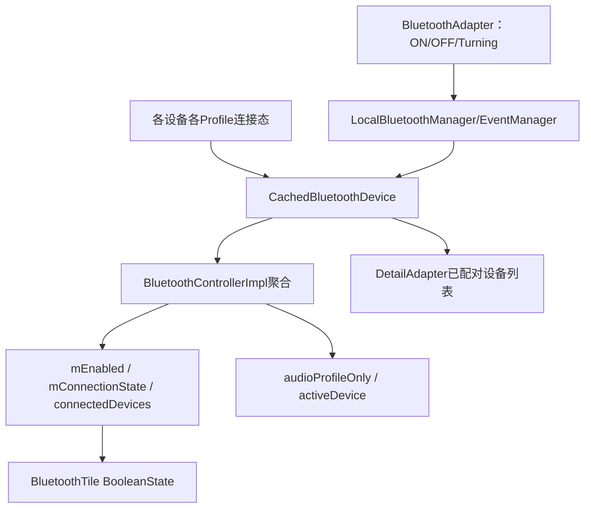
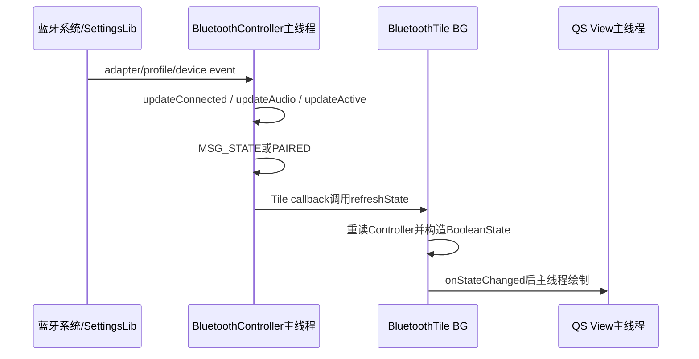
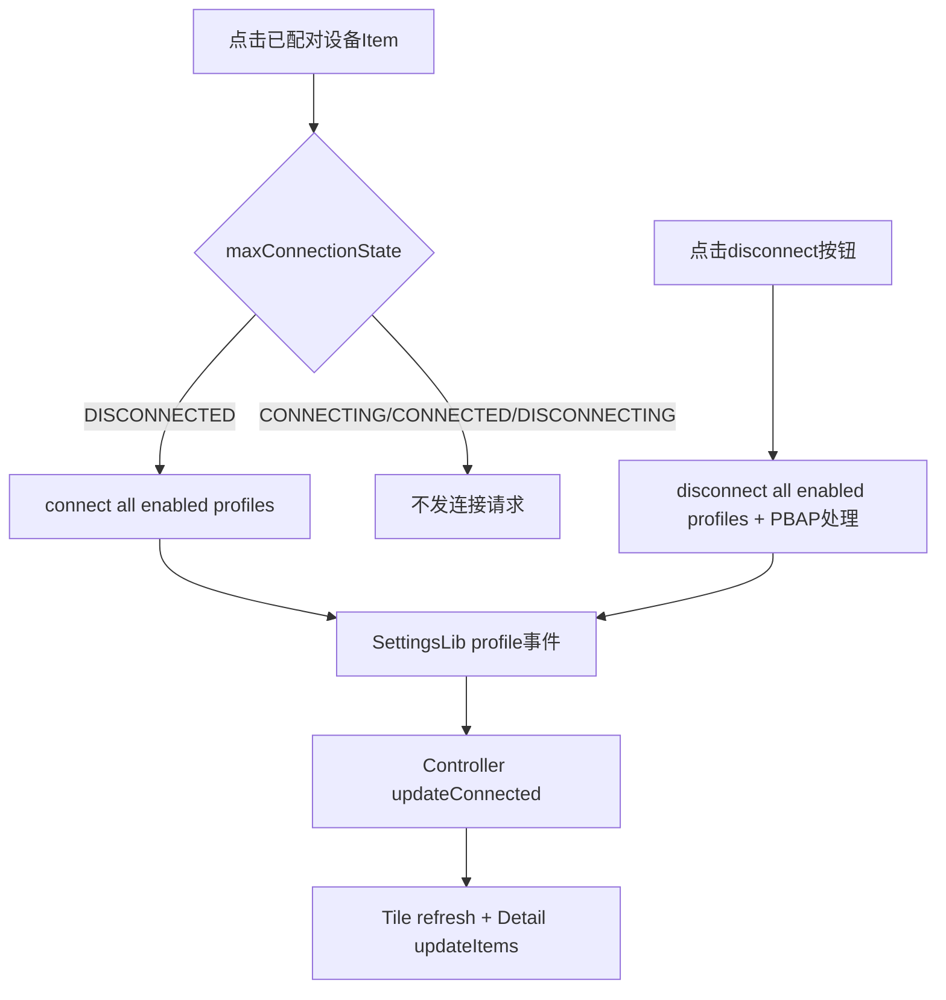

# 第 423 章 Android SystemUI Bluetooth Tile：Controller、设备状态与详情列表

> 源码基线：Android 11 / API 30 / `android-11.0.0_r48`。本章只在 macOS 阅读、检索和推演源码，不编译。重点是蓝牙适配器、Profile连接、CachedBluetoothDevice与详情列表四层状态怎样汇总成一个Tile。

## 1. 本章先解决什么问题

Tile显示“已连接”依据哪个Profile？多个设备时名称和副标题怎样选？详情页为何只有已配对设备、没有扫描新设备？点击连接/断开是否有完成回执？用户限制与用户切换又在哪里判断？

## 2. 一句话心智模型

BluetoothControllerImpl把SettingsLib蓝牙事件和CachedBluetoothDevice聚合成适配器开关、全局连接态与设备集合；BluetoothTile只发请求并把这些缓存重算成BooleanState，详情页则直接投影已缓存、已配对设备。

## 3. 先分清三种“蓝牙状态”

Adapter state是OFF/TURNING_ON/ON/TURNING_OFF；Profile connection state是DISCONNECTED/CONNECTING/CONNECTED/DISCONNECTING；active device表示当前音频路由设备。三者不能互换。

## 4. 本章源码地图

主线是`BluetoothTile.java`、`BluetoothControllerImpl.java`、`BluetoothController.java`，以及SettingsLib的`LocalBluetoothManager`、`LocalBluetoothAdapter`、`CachedBluetoothDevice`和`BluetoothEventManager`。

## 5. 它运行在哪个进程

Tile、Controller和CachedBluetoothDevice包装对象在SystemUI进程；LocalBluetoothAdapter最终调用framework BluetoothAdapter跨系统蓝牙服务；长按设置跳到Settings应用。

## 6. 它涉及哪些线程

Tile handle/State在共享BG Looper；BluetoothController的H在主Looper；ActuallyCachedState在注入的background Looper读取设备；SettingsLib事件通常回到主线程；真实蓝牙服务另有Binder线程。

## 7. Tile是否一定存在

`isAvailable()`调用Controller.isBluetoothSupported；LocalBluetoothManager为null时返回false，Host不会把Tile加入运行Map。

## 8. BluetoothTile持有什么

持Controller、ActivityStarter和一个长生命周期BluetoothDetailAdapter；构造时用Controller.observe绑定QSTile Lifecycle，未单独实现destroy。

## 9. Controller持有什么

持LocalBluetoothManager、UserManager、主/后台Handler、弱键缓存、连接设备可变List，以及enabled、connection、audio-only、active和adapter state等聚合字段。

## 10. 图一：蓝牙状态的四层聚合



## 11. Controller构造时怎样接事件

Local manager非null时向EventManager注册BluetoothCallback，向ProfileManager注册ServiceListener，并用当前adapter BluetoothState主动初始化enabled/state/connected缓存。

## 12. Local manager为null时的默认值

mEnabled false、mConnectionState DISCONNECTED，mState保持Java默认0而不是BluetoothAdapter.STATE_OFF；但Tile因unsupported通常不会创建，调用dump仍能看到manager null。

## 13. Tile Lifecycle怎样订阅

任一QS Layout开始listening使Lifecycle RESUMED，observe调用Controller.addCallback；最后token移除触发PAUSE和removeCallback。

## 14. Controller addCallback是否同步

不是。它依次向主H排MSG_ADD_CALLBACK和MSG_STATE_CHANGED；同一Handler FIFO保证先加入再广播当前mEnabled，形成异步初始回放。

## 15. callback会去重吗

不会，H内部是ArrayList，ADD直接add，REMOVE一次remove一个。重复observe/接线会重复收到state/devices事件。

## 16. 初始回放包含设备列表吗

addCallback只追加一条STATE_CHANGED，不主动发PAIRED_DEVICES_CHANGED。Tile会refresh主状态，但详情列表要依赖既有Controller集合和后续设备事件。

## 17. mCurrentUser为何值得注意

Controller构造时`mCurrentUser=ActivityManager.getCurrentUser()`且字段final；类内没有user-switch回调更新。长生命周期user0 SystemUI可能始终按启动时用户做restriction判断。

## 18. canConfigBluetooth检查什么

同时要求没有DISALLOW_CONFIG_BLUETOOTH和DISALLOW_BLUETOOTH，用户句柄来自上述固定mCurrentUser。它不检查每个设备/Profile策略。

## 19. primary click怎样决定方向

从稳定mState.value读取isEnabled；关闭时传null refresh，开启时传ARG_SHOW_TRANSIENT_ENABLING，然后调用Controller.setBluetoothEnabled取反。

## 20. 开启为什么有乐观动画

transient arg让State.value先true、isTransient true并使用framework蓝牙动画icon，不必等adapter真的进入TURNING_ON。

## 21. 关闭为什么没有乐观OFF

关闭先refresh(null)，Controller缓存通常仍enabled，所以视觉保持on，直到LocalBluetoothAdapter/事件回调更新TURNING_OFF/OFF；没有WifiTile式expect-disabled冻结或350ms兜底。

## 22. Controller setBluetoothEnabled做什么

若manager非null，直接调用LocalBluetoothAdapter.setBluetoothEnabled；Controller接口返回void，不把成功boolean传回Tile。

## 23. LocalBluetoothAdapter怎样处理返回值

调用BluetoothAdapter.enable/disable；成功则立即把本地state置TURNING_ON/OFF，失败则sync真实adapter state。BluetoothController仍不把请求成功作为独立事件告诉Tile。

## 24. 快速连点有什么边界

第一次开启的transient State尚未copy时，第二个CLICK仍可能读false并再次enable；若已copy成true，则第二次会disable正在TURNING_ON的adapter。基类没有防抖。

## 25. composeChangeAnnouncement实际会播吗

Tile提供on/off文案，但第420章确认r48基类mAnnounceNextStateChange没有有效置true入口；实现存在不等于当前链会请求播报。

## 26. secondary click做什么

不能配置时启动ACTION_BLUETOOTH_SETTINGS；能配置时showDetail(true)，若mState.value false还顺便请求开启蓝牙。

## 27. 打开详情的副作用

和Wi‑Fi类似，查看设备列表会开启无线电。该路径没有主动transient refresh，依赖Controller adapter state回调。

## 28. primary为何没有restriction门

handleClick不调用canConfigBluetooth，handleUpdateState也没写disabledByPolicy。服务端/Adapter仍可拒绝，但Tile可能先显示transient。

## 29. 详情Toggle是否再检查限制

不检查，直接记metrics并setBluetoothEnabled。正常详情入口已经检查，但直接展示Adapter或限制运行中变化会依赖下层拒绝。

## 30. 长按入口

每次new ACTION_BLUETOOTH_SETTINGS Intent，由基类ActivityStarter启动；静态BLUETOOTH_SETTINGS主要供DetailAdapter getSettingsIntent。

## 31. State enabled怎样计算

`transientEnabling || controller.isBluetoothEnabled()`。Controller把adapter ON和TURNING_ON都视为enabled，因此不带arg时TURNING_ON也保持value true。

## 32. connected怎样计算

只在Controller聚合mConnectionState精确等于BluetoothProfile.STATE_CONNECTED时true；connectedDevices非空本身不直接决定Tile local connected变量。

## 33. connecting怎样计算

聚合state精确等于STATE_CONNECTING。某设备连接中而另一个处于数值更高状态时，聚合可能不是CONNECTING。

## 34. updateConnected怎样聚合

从adapter getConnectionState开始，遍历所有CachedDevice，把`maxDeviceState > state`的最大数值作为全局state，同时把`device.isConnected()`为true的设备加入mConnectedDevices。

## 35. 数值最大不等于语义最好

Profile常量DISCONNECTING=3高于CONNECTED=2；一个Profile正在断开可压过另一个已连接Profile，使isBluetoothConnected返回false，即使connectedDevices仍非空。

## 36. 空连接列表的纠偏

若聚合state是CONNECTED但mConnectedDevices为空，强制改DISCONNECTED；反向情况“列表非空但state被DISCONNECTING压过”没有纠偏。

## 37. State transient有哪些来源

乐观arg、Controller connecting，或adapter state TURNING_ON。TURNING_OFF不算isTransient，关闭过程中State仍enabled取决于mEnabled更新。

## 38. secondaryLabel优先级

connecting优先显示“正在连接”；其次任何isTransient显示“正在开启”；之后才考虑connectedDevices数量、电量和设备类别。

## 39. SlashState怎样设置

首次创建但不设置rotation；每轮`isSlashed=!enabled`。关闭显示斜杠，开启/过渡清除。

## 40. connected icon为何每次new

连接分支创建新的BluetoothConnectedTileIcon，不使用ResourceIcon缓存。该Icon未override equals，所以每次refresh对象身份不同，State.copyTo会判changed并回调View，即使其他字段相同。

## 41. 未连接开启图标

非transient且enabled但未连接使用framework `ic_qs_bluetooth`，contentDescription设通用蓝牙，stateDescription为“未连接”。

## 42. 连接时label怎样选

初始通用蓝牙标签；Controller若恰好一个connectedDevice且名称非空，改成设备名。多个连接设备时Controller返回null，保持通用标签。

## 43. 连接时contentDescription的细节

进入分支前contentDescription已等于通用label；随后state.label可能改设备名，但contentDescription没有同步改名。设备名通过stateDescription的accessibility_bluetooth_name补入。

## 44. stateDescription怎样组成

连接时是“蓝牙设备名/label”加逗号和secondaryLabel；secondaryLabel被emptyIfNull变为非null空串，所以无副标题时仍可能留下末尾分隔结构。

## 45. 多设备副标题

大于1个connectedDevices时复用Hotspot“连接设备数量”plural资源，源码TODO承认缺专用蓝牙字符串。语义能用，资源命名却跨功能。

## 46. 单设备先看什么

先取batteryLevel；只要大于BATTERY_LEVEL_UNKNOWN，就显示电量百分比，不再显示hearing aid/audio/headset/input类别。

## 47. 没有电量时如何猜类别

有BluetoothClass时先判断hearing aid，再按A2DP、HEADSET、HID顺序匹配，返回音频、耳机或输入设备文案；都不匹配则null。

## 48. connectedDevices返回快照吗

不是，Controller直接返回内部可变ArrayList。Tile BG读取而Controller主线程updateConnected clear/add，缺少copy或锁，存在并发观察中间态的理论窗口。

## 49. getConnectedDeviceName也读同一List

size恰好1才取第0项名称；两个连续调用之间主线程可能更新集合，Tile handleUpdate没有把List整体快照化。

## 50. 决定性源码：连接态与设备集合可能分叉

```java
int state = adapter.getConnectionState();
mConnectedDevices.clear();
for (CachedBluetoothDevice device : getDevices()) {
    int maxDeviceState = device.getMaxConnectionState();
    if (maxDeviceState > state) state = maxDeviceState;
    if (device.isConnected()) mConnectedDevices.add(device);
}
if (mConnectedDevices.isEmpty() && state == STATE_CONNECTED) {
    state = STATE_DISCONNECTED;
}
```

## 51. BluetoothBatteryTileIcon在哪里使用

类注释称用于Quick Settings连接电量图标，但主Tile连接分支实际总用BluetoothConnectedTileIcon；Battery icon只在详情Item已连接且有电量时赋给item.icon。

## 52. active device影响Tile吗

Controller维护mIsActive并暴露isBluetoothAudioActive，但BluetoothTile handleUpdateState不读取。连接不等于当前音频正路由到该设备。

## 53. audioProfileOnly影响Tile吗

Controller遍历所有Profile计算只连接音频类与否，Tile同样不读取；其他SystemUI消费者可据此决定图标/策略。

## 54. Controller Callback有哪两种

onBluetoothStateChange只传enabled布尔；onBluetoothDevicesChanged不带列表。Tile回调到来后主动向Controller重读所有聚合字段。

## 55. State回调处理什么

总是refresh；详情显示时还updateItems，并让详情Toggle跟随Adapter getToggleState。state事件可能导致列表重建。

## 56. Devices回调处理什么

同样refresh；详情显示时updateItems，但不单独fireToggle，因为设备变化不一定改变adapter开关。

## 57. Controller主H怎样广播

MSG_STATE_CHANGED遍历callback传当前mEnabled；MSG_PAIRED_DEVICES_CHANGED遍历devices回调。没有callback快照和异常隔离，一个callback抛错会中断主线程消息。

## 58. 重复消息会合并吗

大多数事件直接send，不remove旧MSG_STATE_CHANGED；同一底层变化可能从updateConnected和事件方法各排一次，Tile继而排多个不合并REFRESH。

## 59. 回调线程怎样回到Tile

Controller主H调用Tile callback，callback调用refreshState排到Tile BG；状态copy后Panel callback再把View更新post主线程。

## 60. 图二：适配器事件到Tile State



## 61. 哪些事件更新connected

adapter state、device add/delete/bond/attribute、connection/profile connection、ACL connection与profile service connected都会调用updateConnected。

## 62. updateConnected会主动通知几次

聚合state变化时内部发一条STATE；多数外层事件方法随后又无条件发STATE或PAIRED，可能出现重复通知。

## 63. mEnabled何时为true

onBluetoothStateChanged中adapter state为ON或TURNING_ON即true；TURNING_OFF立即false。Tile关闭动画不使用transient，可能在TURNING_OFF事件到来时直接INACTIVE。

## 64. stateToString的名称范围

helper只识别Profile connection常量；DEBUG在onBluetoothStateChanged拿adapter 10—13调用它，会打印UNKNOWN(10等)，不是adapter真的未知。

## 65. updateAudioProfile怎样分类

HEADSET、A2DP、HEARING_AID算audio；其他已连接Profile算other。只有audio true且other false才mAudioProfileOnly=true。

## 66. updateActive怎样判断

任一设备是HEADSET/A2DP/HEARING_AID active就true；只在值变化时发STATE，但onActiveDeviceChanged外层还会再发一条STATE。

## 67. activeDevice为null的DEBUG边界

BluetoothCallback允许清空active device时传null；onActiveDeviceChanged的DEBUG日志直接`activeDevice.getAddress()`，loggable设备可能NPE，非DEBUG路径仍可正常updateActive。

## 68. ActuallyCachedState解决什么

详情频繁问bond/max connection可能较慢；Controller用WeakHashMap缓存每设备两个值，首次miss先返回默认对象，同时在background Looper读取真实值。

## 69. 首次读取会得到什么

mBondState默认BOND_NONE、mMaxConnectionState默认DISCONNECTED，所以详情首轮可能暂时过滤掉已配对设备或把设备当断开。

## 70. 后台读取完成怎样通知

写入两个字段后，在主H移除所有PAIRED消息并重新发一条；这一个路径会coalesce paired通知，其他事件路径不会普遍合并。

## 71. 写入可见性依靠什么

background先写字段再向main Handler发Message，MessageQueue建立先后关系；之后详情主线程重读通常能看到值。WeakHashMap本身仍没有线程同步。

## 72. WeakHashMap为何可能丢项

key弱引用，设备对象无其他强引用时条目可被GC；下一次用新/仍存设备对象查询会再建默认cache并后台刷新。

## 73. 哪些事件清设备cache

delete、bond、connection、profile connection和ACL变化remove对应设备；attributes changed没有按设备参数，只updateConnected并发paired，旧cached bond/max可能暂留。

## 74. Controller有显式destroy吗

没有。它是Singleton，构造时注册EventManager/Profile service listener，却没有对应unregister；生命周期等同SystemUI进程。

## 75. 详情是否另开Bluetooth监听

BluetoothTile没有override setDetailListening。普通Tile只要任一Layout listening，Controller observer就工作；打开详情不新增扫描/发现资源。

## 76. 详情会发现未配对设备吗

不会。它读取CachedDeviceManager当前copy，又过滤bond state为BOND_NONE的设备；QS详情定位为已配对设备快捷连接，不是完整配对界面。

## 77. Settings入口为何仍重要

需要扫描、配对、改名、忘记设备或更细Profile控制时，用户通过Detail settings或长按进入完整Bluetooth Settings。

## 78. MAX_DEVICES限制谁

最多创建20个通过BOND_NONE过滤后的设备Item；未配对项在count++之前continue，不消耗上限。

## 79. Item排序怎样形成

遍历CachedDevice集合：connected插到前方并保持相对顺序；connecting总插在`connectedDevices`索引且不递增该计数，多个connecting会逆序堆在connected之后；其余append。

## 80. 空状态如何选择

Controller enabled时显示“没有已连接/可用的设备”empty文案，disabled时显示“蓝牙已关闭”；随后仍setItems空数组。

## 81. 首轮详情可能为何空一下

getBondState首次cache miss返回BOND_NONE并后台填充；所有设备可能先被过滤，PAIRED消息到来后才重建列表。

## 82. items visible依据什么

createDetailView后按mState.value设置；adapter state callback详情显示时更新items并fire toggle。TURNING_ON的value true可能让空列表先可见。

## 83. Toggle何时可操作

只有Controller adapter state精确OFF或ON；TURNING_ON/TURNING_OFF时getToggleEnabled false，避免过渡中再次切换详情开关。

## 84. Tile主按钮同样被禁用吗

没有。Tile State仍ACTIVE/INACTIVE且可click，过渡中primary可再次发相反请求；只有详情Toggle有精确state gate。

## 85. 点击设备的连接门

item/tag非null且设备max state精确DISCONNECTED才Controller.connect；CONNECTING、CONNECTED、DISCONNECTING点击都不做事。

## 86. connect真正做什么

Controller调用`device.connect(true)`，deprecated重载再调用connect()；ensurePaired后连接所有已启用Profiles。详情已过滤未配对设备，通常不会进入配对。

## 87. 点击后详情会关闭吗

不会。不同于WifiTile，Bluetooth detail item click没有showDetail(false)或collapsePanels，用户可留在列表观察CONNECTING/CONNECTED变化。

## 88. disconnect入口

只有connected Item设置canDisconnect=true，QSDetailItems触发onDetailItemDisconnect后Controller调用CachedDevice.disconnect，断开所有enabled Profiles并额外处理PBAP server。

## 89. connect/disconnect有返回值吗

Controller接口都是void；Tile没有完成callback或错误UI，只依赖SettingsLib后续设备事件更新Item。

## 90. 失败时会怎样

CachedBluetoothDevice内部可能记录日志，详情保持打开且最终状态不变；BluetoothTile不显示Toast、不重试，也不把失败关联到某次点击。

## 91. Item tag类型安全吗

只判null后直接强转CachedBluetoothDevice，没有instanceof；错误构造Item会ClassCastException。正常列表完全由Adapter自身生成。

## 92. 设备名称与隐私

详情line1和连接Tile label直接显示CachedDevice.getName；锁屏是否展示QS由上层Keyguard/QS政策控制，本类不单独脱敏设备名。

## 93. 电量详情图标

连接且battery known时Item使用BluetoothBatteryTileIcon分层Drawable，并在线2显示百分比；否则用connected icon和“已连接”。

## 94. Icon对象equals边界

BluetoothConnectedTileIcon和BatteryTileIcon都未override equals/hashCode。主Tile每轮new connected icon使State总易判changed；详情Item每轮本就整体重建，不依赖State copy。

## 95. 电量值范围检查

只判断大于BATTERY_LEVEL_UNKNOWN，没有在Tile层clamp 0—100；Utils.formatPercentage按传入值格式化，依赖BluetoothDevice提供合法电量。

## 96. Settings Intent的完成语义

ActivityStarter post只表示安排在解锁后启动；Settings是否打开、用户是否改配置、Shade何时收起不由BluetoothTile确认。

## 97. 限制判断为何可能过期

mCurrentUser固定，且restriction变化没有Controller callback专门刷新canConfig结果。secondary每次会重新查UserManager，但可能查错用户。

## 98. 多用户下设备列表属于谁

Controller/LocalBluetoothManager是SystemUI单例，getDevices未按调用user参数过滤；蓝牙adapter和配对数据的系统多用户政策由下层负责，本类没有显式user隔离。

## 99. 切换用户会重建Tile吗

Host对内建Tile调用userSwitch，QSTileImpl默认只refresh；BluetoothTile未override。Controller固定user和SettingsLib对象都不重建。

## 100. 图三：详情设备点击状态机



## 101. 一个设备可有多个Profile

“连接设备”只需任一Profile connected；max state则取所有Profile数值最大。音频、输入、电话簿等Profile可同时处于不同阶段。

## 102. Tile显示一个设备名意味着什么

仅表示mConnectedDevices按`device.isConnected()`汇总后恰好一个，不证明它是active音频设备，也不证明所有Profiles已连接。

## 103. hearing aid判断为何独立

使用HiSyncId而非BluetoothClass profile match；只有没有电量副标题时才走到该判断。

## 104. audioProfileOnly与active的诊断价值

虽Tile不展示，Controller dump会打印两者；排查“显示已连接但声音不走设备”时必须结合mIsActive而非只看Tile icon。

## 105. Controller dump包含什么

manager、enabled、connection、audio-only、active、connectedDevices、callback数量和每个CachedDevice名称/bond/isConnected；不打印固定currentUser、Weak cache内容或消息队列。

## 106. Tile dump又缺什么

只打印BooleanState；不含详情20项、每Profile状态、请求时间、restriction结果、最后connect/disconnect失败和active设备。

## 107. 正确的连接证据层级

Tile transient、adapter ON、设备bonded、某Profile CONNECTING、任一Profile CONNECTED、Controller aggregate CONNECTED、device active、音频真正路由是不同证据。

## 108. 一条完整连接链

用户点详情Item→CachedDevice connect profiles→蓝牙服务异步处理→BluetoothEventManager回调→Controller清cache/updateConnected→主H广播→Tile BG重算→两个Panel View和详情列表更新。

## 109. 排查“设备连接了但Tile没显示”的顺序

先看具体Profile与CachedDevice.isConnected，再看Controller connectedDevices/aggregate是否被DISCONNECTING压过，接着看callback注册、Tile REFRESH、State label/icon和Panel View。

## 110. 排查“详情没有已配对设备”的顺序

确认CachedDeviceManager copy、bond真实值、ActuallyCachedState是否仍默认、PAIRED消息是否回调、20项上限和mItems是否属于当前详情View。

## 111. 最常见的六个误解

一是把adapter ON当设备已连接；二是把connected当active音频；三是认为详情会扫描未配对设备；四是认为connect返回成功；五是认为详情会自动关闭；六是认为canConfig始终跟随前台用户。

## 112. macOS只读练习一：手算聚合连接态

设计两个设备：一个A2DP CONNECTED，一个HID DISCONNECTING，按updateConnected数值比较推导mConnectionState、connectedDevices和Tile connected三者结果。

## 113. macOS只读练习二：推演首次打开详情

假设三个已配对设备尚未进入ActuallyCachedState，逐步执行getBondState默认值、background填充、PAIRED消息和第二次updateItems，解释空列表闪现。

## 114. macOS只读练习三：比较三种点击

分别推演primary、secondary和detail item：列出restriction门、是否自动开启、是否有transient、是否关闭详情、是否有返回值或完成ACK。

## 115. macOS只读练习四：核对多用户路径

从SystemUI user0启动后切到user10，追Host.userSwitch、BluetoothTile默认handleUserSwitch与Controller final mCurrentUser，指出哪些状态刷新了、哪些身份没有更新。

## 116. 练习预期结论

数值最大聚合可被DISCONNECTING压过；异步设备cache首轮可返回未配对默认；三种点击的安全门与UI收尾不同；内建Tile refresh不等于Controller用户身份切换。

## 117. 复读源码后修正了哪些容易误讲之处

复读后明确：详情只有cached bonded设备且不启动发现；Controller addCallback异步初始回放；mCurrentUser固定；关闭无乐观OFF/兜底；connected icon每次new导致重复changed；BatteryTileIcon只用于详情；activeDevice null在DEBUG日志可NPE；ActuallyCachedState先返回默认再后台更新；详情连接不自动关闭。

## 118. 本章没有覆盖什么

BluetoothAdapterService、GATT、A2DP/Headset Profile Service、配对UI、权限和底层协议栈已在蓝牙专题或后续系统服务中讨论。本章只闭合SystemUI Tile/详情聚合层。

## 119. 阅读完成检查表

应能解释adapter/profile/active三态、Controller聚合算法、transient开关、secondary限制、设备名/电量/类别副标题、异步cache、20项已配对列表、连接/断开无ACK、多用户固定身份与dump证据边界。

## 120. 本章结论

Bluetooth Tile展示的是多设备、多Profile异步系统的一张压缩快照。读源码时必须把适配器电源、Profile状态、connected集合、active路由和详情缓存拆开；一个蓝牙图标无法单独证明用户真正关心的连接或音频结果。
