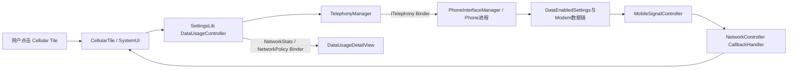
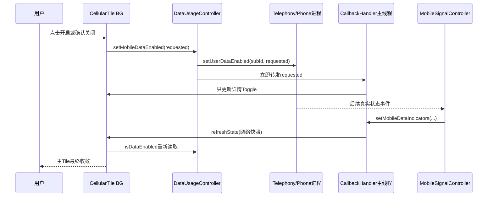
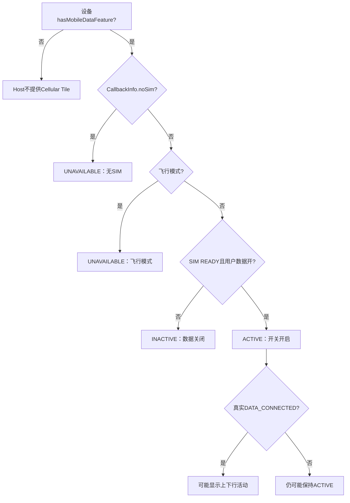

# 第 424 章 Android SystemUI Cellular Tile：SIM、数据开关与策略边界

> 源码基线：Android 11 / API 30 / `android-11.0.0_r48`。本章只做macOS本地只读分析，不编译、不刷机。核心文件是`CellularTile.java`、`NetworkControllerImpl.java`、`MobileSignalController.java`、SettingsLib的`DataUsageController.java`以及Telephony的`PhoneInterfaceManager.java`。

## 1. 本章要解决什么问题

下拉快捷设置里的“移动数据”看似只是一个开关，实际上同时受到设备能力、SIM、默认数据订阅、飞行模式、Telephony用户开关、无线注册、数据承载、运营商名称和网络统计影响。本章把这些概念逐层拆开，再追一次点击如何跨进程到Phone进程。

## 2. r48中它到底叫什么

Android 11 r48的内建spec是`cell`，实现类叫`CellularTile`。本版本没有另一个独立的`MobileDataTile`；看到新版本文章中的Internet Tile或MobileDataTile时，不能直接套到这里。

## 3. 先建立六个互不等价的状态

至少要区分：设备支持蜂窝网络、存在订阅、SIM处于READY、默认数据subId有效、用户数据开关为开、移动数据链路已连接。前五项都成立也不保证最后一项成立，例如无信号、欠费或运营商网络故障。

## 4. 本章源码地图

Tile显示与交互在`CellularTile`；信号事实聚合在`NetworkControllerImpl`和每订阅一个的`MobileSignalController`；读写开关与流量统计在SettingsLib `DataUsageController`；真正的跨进程入口是`TelephonyManager`到`ITelephony`。

## 5. 四个固定阅读问题

SystemUI进程负责什么？每段代码在哪个线程？输入从哪来、输出到哪去？跨越了哪些Binder边界？后文每个“成功”都按这四问核对，避免把UI变化当作Telephony完成。

## 6. 进程边界

`CellularTile`、`NetworkControllerImpl`和SettingsLib对象都在SystemUI进程。`TelephonyManager.setDataEnabled`通过`ITelephony`进入承载Phone服务的进程，再由`PhoneInterfaceManager`找到Phone并更新`DataEnabledSettings`；NetworkStats和NetworkPolicy查询也各自可能跨Binder。

## 7. 线程边界

QSTile的`handleClick/handleUpdateState`运行在第420章介绍的共享Tile后台Looper；NetworkController的接收与MobileSignalController更新大量运行在其后台Handler；`CallbackHandler`把SignalCallback投递到主Looper；详情View创建和绑定处于UI链。不能假定所有字段在同一线程同时更新。

## 8. 构造函数只做三件核心事

构造时保存`NetworkController`和`ActivityStarter`，从Controller取得共享`DataUsageController`，创建详情适配器，然后用Tile Lifecycle观察`CellSignalCallback`。生命周期订阅让Tile监听时接收网络快照，销毁时移除。

## 9. Tile与详情共享什么

主Tile和详情共用同一个`DataUsageController`与同一个`CellSignalCallback.mInfo`。详情不是第二套Telephony观察者；它复用Tile已缓存的漫游状态和Controller注入的数据开关回调。

## 10. 总体结构图



## 11. isAvailable只回答设备能力

`CellularTile.isAvailable()`只返回`NetworkController.hasMobileDataFeature()`。这个值来自`ConnectivityManager.isNetworkSupported(TYPE_MOBILE)`，表示设备具备移动网络能力，不代表插卡、SIM可用、套餐有效或此刻有信号。

## 12. 可用性为何不随拔卡消失

无SIM时Tile仍属于设备支持的内建能力，所以Host不会因拔卡销毁Tile。`handleUpdateState`改用`STATE_UNAVAILABLE`和无SIM图标，让用户看见原因；“Tile存在”与“当前可点击”是两层状态。

## 13. SignalState比BooleanState多什么

CellularTile使用`SignalState`，除value外还携带`activityIn/activityOut`，供`SignalTileView`画上下行活动。图标主体在r48中却固定为无SIM或上下箭头资源，并不直接使用回调传来的信号格图标。

## 14. 回调缓存CallbackInfo

`CallbackInfo`保存飞行模式、默认数据订阅名称、数据制式说明、上下行活动、无SIM、漫游和是否多订阅。它是SystemUI当前认知的快照，不是一次原子Telephony事务。

## 15. 注册时为什么很快有初值

`NetworkControllerImpl.addCallback`先直接回放subs、飞行模式、无SIM、Wi-Fi、Ethernet和每个MobileSignalController当前状态，最后才异步把callback加入`CallbackHandler`列表。初值调用发生在addCallback调用线程，后续增量统一经主Handler。

## 16. 初始回放与登记之间的窗口

“先回放、后异步登记”存在短窗口：回放后、真正加入列表前发生的增量可能不送给该观察者。后续其他信号变化通常会再次收敛，但源码没有用序列号保证无缝快照。

## 17. 多SIM为何只接受一个移动回调

`CellSignalCallback.setMobileDataIndicators`遇到`qsIcon == null`立即return。`MobileSignalController`只为`mCurrentState.dataSim`生成qsIcon，因此Tile主要消费默认/活动数据订阅，而不是把所有SIM逐项展示。

## 18. 默认数据订阅尚未选定时的退让

`updateDataSim`发现active data subId无效时，会暂时把当前Controller的`dataSim`设为true，注释称否则QS可能完全空白。多Controller都可能短暂自称dataSim，最后到达的回调可能覆盖Tile缓存，因此这是临时展示策略，不是稳定选卡算法。

## 19. dataSubscriptionName从哪里来

Tile收到默认数据订阅回调后，不直接采用回调的`description`作运营商名，而调用`NetworkController.getMobileDataNetworkName()`，后者按active data subId查对应Controller的`networkNameData`。

## 20. 多SIM时才显示运营商名

激活状态的副标题只有在`getNumberSubscriptions() > 1`时才把运营商名拼进去。单SIM省略运营商名，主要显示LTE/4G等数据制式；这是一种UI去冗余策略，并不表示单SIM没有名称。

## 21. getNumberSubscriptions统计的不是卡槽数

它返回`mMobileSignalControllers.size()`，本质是过滤、分组处理后的活动Subscription Controller数。机会型订阅同组过滤可能让它小于物理卡槽或原始active subscription列表数量。

## 22. 主点击第一道门

`handleClick`先检查当前Tile `state == STATE_UNAVAILABLE`，无SIM或飞行模式时直接返回。它依赖上一轮UI状态快照，点击瞬间不会重新查询这两项。

## 23. 开启移动数据的路径

若Tile可用且`isMobileDataEnabled()`为false，主点击直接调用`setMobileDataEnabled(true)`，没有确认框，也没有本地transient动画或超时兜底。

## 24. 第一次关闭为何弹确认框

如果数据已开且`QS_HAS_TURNED_OFF_MOBILE_DATA`为false，Tile显示“关闭后只能通过Wi-Fi上网”的SystemUI对话框。只有按正按钮才请求关闭，并把该偏好写为true。

## 25. 第二次关闭为何直接执行

偏好为true后，后续主点击会直接调用`setMobileDataEnabled(false)`。这个偏好只记录用户见过关闭确认，不记录当前数据状态，也不是Telephony设置本身。

## 26. 取消确认框有什么效果

取消不会写“已看过”偏好，也不改变数据开关；下一次关闭仍会出现。正按钮中的写偏好位于发出关闭请求之后，但请求是void，代码没有验证系统确实关闭才记住。

## 27. 对话框中的运营商名

代码取默认数据网络名称，并同时检查`isMobileDataNetworkInService()`；名称为空或不在服务时使用“你的运营商”兜底。这样避免拿陈旧名称暗示当前仍在网。

## 28. 对话框窗口为何特殊

它使用`TYPE_KEYGUARD_DIALOG`，设置show-for-all-users、dismiss listener和on-top，目的是在锁屏/系统窗口层级中可见。可见不等于绕过安全策略；正按钮最终仍要走Telephony权限检查。

## 29. 这不是STATE_UNAVAILABLE确认

无SIM或飞行模式时主点击在对话框之前就返回。确认框只保护“当前UI认为可用且用户数据已开启”的关闭动作。

## 30. secondary click做什么

如果`DataUsageController.isMobileDataSupported()`为true，secondary click打开数据用量详情；否则启动移动网络设置Activity。它没有沿用主Tile的`STATE_UNAVAILABLE`判断。

## 31. 飞行模式下secondary的细微差别

`isMobileDataSupported`检查网络能力和SIM READY，并不检查飞行模式。因此SIM仍报告READY时，飞行模式下secondary仍可能打开详情，而主点击已经因`STATE_UNAVAILABLE`被拒绝。

## 32. 长按跳到哪里

若Tile当前不可用，长按返回`ACTION_WIRELESS_SETTINGS`；否则返回携带默认数据subId的`ACTION_NETWORK_OPERATOR_SETTINGS`。长按结果由当前State决定，跟secondary的`isMobileDataSupported`判定不是同一套门。

## 33. subId Intent额外参数

`getCellularSettingIntent`仅在默认数据subId有效时放入`Settings.EXTRA_SUB_ID`。无有效默认订阅时仍返回网络运营商设置Intent，只是由Settings自行决定展示范围。

## 34. 三种点击为何必须分开读

primary修改数据开关；secondary优先展示用量详情；long进入设置。它们使用不同的可用性判定，也有不同的锁屏收尾，不能只读`handleClick`就宣称“Tile不可用时什么都不能做”。

## 35. 移动数据支持条件

SettingsLib的`isMobileDataSupported`要求`TYPE_MOBILE`受支持且选中的TelephonyManager `getSimState()==SIM_STATE_READY`。它不检查信号、漫游、数据套餐、APN、运营商限制或当前链路是否连接。

## 36. getTelephonyManager如何选SIM

优先使用显式`mSubscriptionId`；无效时使用默认数据subId；仍无效则取active subscription id列表第一项，最后用该subId创建TelephonyManager。CellularTile没有为共享Controller设置显式subId，通常走默认数据订阅。

## 37. 无订阅时的对象并非null

即使找不到有效subId，代码仍`createForSubscriptionId(subscriptionId)`。后续方法是否得到可用状态由Telephony实现决定；调用端没有以null表示“无控制器”。

## 38. handleUpdateState先读两份世界

回调参数提供网络信号侧快照，`DataUsageController`则同步读取Telephony用户数据开关。两份信息可能来自不同时间点，所以短暂出现“开关已开但制式名称仍旧”属于异步收敛窗口。

## 39. value的精确定义

`state.value = isMobileDataSupported() && isMobileDataEnabled()`。它不是数据已连接，更不是当前Internet走蜂窝；只表示Tile认为支持且用户数据设置开启。

## 40. active的精确定义

无SIM和飞行模式优先变`STATE_UNAVAILABLE`；否则value为true就是`STATE_ACTIVE`，即使此刻无信号或没有建立数据连接。ACTIVE在这里是开关视觉态，不是联网成功证明。

## 41. inactive的精确定义

SIM存在、非飞行模式，但用户数据开关关闭时为`STATE_INACTIVE`，副标题“移动数据已关闭”。它与`STATE_UNAVAILABLE`在可点击性和辅助功能语义上不同。

## 42. 无SIM图标与普通图标

`cb.noSim`时使用`ic_qs_no_sim`，其余情况统一使用`ic_swap_vert`。飞行模式虽然不可用，仍走普通上下箭头图标，再靠状态和副标题说明原因。

## 43. 上下行活动箭头何时亮

只有`mobileDataEnabled && cb.activityIn/out`才传给SignalTileView。MobileSignalController本身又要求`dataConnected`且不处于carrier-network-change，故箭头更接近真实流量活动，但仍只是近期Telephony activity状态。

## 44. 数据制式说明从哪里来

MobileSignalController根据DisplayInfo、配置和连接状态选IconGroup，再把该组的HTML数据说明传给回调。Tile仅当回调`description != null`时保留type说明；紧急状态等情况下可能清空。

## 45. 漫游文案如何组合

漫游且有制式时组合“漫游 + 制式”；只有漫游时只显示漫游；非漫游直接显示制式。`appendMobileDataType`再把多SIM运营商名与它按本地化格式连接。

## 46. 为什么调用Html.fromHtml

运营商/制式资源可能含HTML样式。组合函数在当前为空或最终拼接后调用`Html.fromHtml(..., 0)`，让TextView收到Spanned，而不是直接展示标签字符。

## 47. 辅助功能描述

`contentDescription`只设主label；可用或启用时`stateDescription`取副标题。INACTIVE时故意置空，因为基类会根据Tile状态再追加“关闭”等标准描述，避免重复。

## 48. UI状态优先级

优先级是无SIM > 飞行模式 > 用户数据开启 > 用户数据关闭。于是无SIM且飞行模式同时存在时，用户先看到“无SIM”；这只是条件顺序，不代表飞行模式事实不存在。

## 49. 一段最关键的状态源码

```java
boolean mobileDataEnabled = mDataController.isMobileDataSupported()
        && mDataController.isMobileDataEnabled();
state.value = mobileDataEnabled;
if (cb.noSim) {
    state.state = Tile.STATE_UNAVAILABLE;
} else if (cb.airplaneModeEnabled) {
    state.state = Tile.STATE_UNAVAILABLE;
} else if (mobileDataEnabled) {
    state.state = Tile.STATE_ACTIVE;
} else {
    state.state = Tile.STATE_INACTIVE;
}
```

## 50. 这段源码最容易读错什么

`mobileDataEnabled`是“supported AND user setting”，但State随后还会因noSim/airplane覆盖成不可用。因此不能只看`state.value`推断Tile会呈ACTIVE，也不能把`STATE_ACTIVE`推断为`dataConnected`。

## 51. setMobileDataEnabled的调用链

SettingsLib记录日志，取得选定subId的TelephonyManager，调用`setDataEnabled(enabled)`，然后无条件调用自己的Callback。TelephonyManager再调用`ITelephony.setUserDataEnabled(subId, enabled)`。

## 52. 需要什么权限

TelephonyManager API声明需要`MODIFY_PHONE_STATE`或运营商特权。SystemUI作为平台特权组件能走该链；普通第三方应用复制这段Java代码并不会自然获得权限。

## 53. PhoneInterfaceManager做什么

Phone进程侧先执行修改电话状态或运营商特权检查，再按subId找phoneId与Phone，最后调用`phone.getDataEnabledSettings().setUserDataEnabled(enable)`。它通常同步写按subId区分的`Settings.Global.MOBILE_DATA`并通知Phone；找不到Phone时却只记录无效subId错误。

## 54. void为何是重要边界

整个UI链没有成功boolean、future或完成回调。`ITelephony`调用本身是同步Binder，返回能说明服务方法已经返回，却不证明设置实际改变、更不证明数据承载建成；TelephonyManager捕获`RemoteException`后只写日志，SettingsLib仍继续通知“enabled=请求值”。

## 55. 详情Toggle会先乐观变化

DataUsageController Callback在NetworkController构造时被设置；请求后它让`CallbackHandler.setMobileDataEnabled(enabled)`通知CellSignalCallback，后者只调用DetailAdapter的`fireToggleStateChanged`。因此详情开关能立刻显示请求值，即使底层尚未完成甚至Binder失败。

## 56. 主Tile为何不直接吃这个boolean

`CellSignalCallback.setMobileDataEnabled`没有`refreshState`，只刷新详情Toggle。主Tile要等MobileSignalController状态变化、其他网络回调，或其他refresh触发，再重新调用`isMobileDataEnabled()`读取事实。

## 57. notifyControllersMobileDataChanged的作用

同一SettingsLib Callback还遍历所有MobileSignalController调用`onMobileDataChanged()`，让非默认SIM更新`defaultDataOff`等派生图标状态。但只有状态比较认为变化时才进一步通知，不能把它当完成ACK。

## 58. 请求值、设置值、连接值

请求值是用户刚点的true/false；设置值是Telephony `isDataEnabled()`读到的用户开关；连接值是`mDataState == DATA_CONNECTED`且有服务。独立机会型订阅的disable会在`DataEnabledSettings`直接return，因此连“服务方法正常返回”也未必改变设置；排查时必须分别记录三者。

## 59. 点击到回调的时序

用户点击发生在Tile BG处理；Binder请求进入Phone侧；SettingsLib同步发出乐观详情通知；真实Telephony状态随后通过监听/广播进入MobileSignalController，再经CallbackHandler和Tile BG refresh回到View。

## 60. 开关时序图



## 61. 为何没有transient态

与WifiTile/BluetoothTile不同，CellularTile没有`ARG_SHOW_TRANSIENT_ENABLING`、`state.isTransient`或本地延时恢复。开启后主Tile可能保持旧态直到外部事件刷新，这是真实r48行为。

## 62. 快速连点的风险

主点击每次同步读取`isMobileDataEnabled()`。如果第一笔开启尚未被读到，第二次仍可能再次请求开启；如果详情已乐观改变而主Tile仍旧，两个表面还可能短暂不一致。源码没有请求序列号或点击锁。

## 63. 飞行模式与数据开关是两个维度

进入飞行模式会把Tile置不可用，但不等于用户数据设置被写成false。退出飞行模式后，如果用户设置仍开，Tile可以重新ACTIVE；不要把飞行模式UI隐藏理解为修改持久开关。

## 64. 默认数据SIM切换会发生什么

`ACTION_DEFAULT_DATA_SUBSCRIPTION_CHANGED`让每个MobileSignalController重算`dataSim`，重新读取Config并异步更新Controllers。后续只有新的dataSim向QS提供非null qsIcon，Tile名称、制式和开关查询也应转向新默认subId。

## 65. 切换中的短暂混合快照

Tile的CallbackInfo字段由多种回调分别改写，没有携带统一generation。默认SIM切换期间，运营商名、制式、漫游、multipleSubs和DataUsageController选出的subId可能分步变化，短暂混搭不能单凭一帧认定逻辑错误。

## 66. 无SIM状态从哪里来

NetworkController比较活动订阅列表和Telephony能力，维护`mHasNoSubs`与`mSimDetected`，通过`setNoSims(show, simDetected)`回调。CellularTile只保存`show`到`noSim`，没有使用第二个`simDetected`字段细分“未检测到卡”与“无活动订阅”。

## 67. SIM READY与noSim为何可能不同步

`noSim`来自NetworkController订阅聚合，`isMobileDataSupported`现场读选中TelephonyManager的SIM_STATE_READY。两条更新链和时序不同，所以secondary、value与主State在切卡瞬间可能做出不同判断。

## 68. 网络是否in service只用于哪里

CellularTile只在第一次关闭确认框选运营商文案时调用`isMobileDataNetworkInService`。普通ACTIVE判定不要求in service，这再次证明ACTIVE不是“已接入运营商网络”。

## 69. qsIcon.visible没有被Tile使用

CellSignalCallback只用`qsIcon != null`筛默认数据SIM，并不读取其visible、icon或contentDescription。飞行/紧急等可见性主要由另行回调和description间接影响，Tile展示不是状态栏信号图标的简单复制。

## 70. description的一个反直觉条件

回调代码用`description != null ? typeContentDescriptionHtml : null`决定数据制式说明，而`description`是MobileSignalController给QS的网络名，紧急状态时为null。因此即使IconGroup有制式资源，也可能不显示。

## 71. 详情Toggle的可用性

`getToggleState`在mobile data supported时返回当前enabled，否则返回null。Detail UI把null理解为没有可用开关；这不等于详情View一定不能创建，也不等于Settings Intent不存在。

## 72. 详情Toggle没有关闭确认

`CellularDetailAdapter.setToggleState`直接调用`setMobileDataEnabled(state)`，不经过主点击的首次关闭确认逻辑。用户从详情关闭移动数据时，不会设置`QS_HAS_TURNED_OFF_MOBILE_DATA`偏好。

## 73. 一个安全语义不一致

于是主Tile第一次关闭有解释性确认，详情Toggle第一次关闭没有。阅读时应把它记录为两个入口的真实政策差异，而不是擅自补写“所有关闭都会确认”。

## 74. 详情显示的不是SIM列表

`CellularDetailAdapter.createDetailView`膨胀`data_usage`布局，读取一份`DataUsageInfo`并绑定流量、周期、警告/限制与运营商。它没有列出SIM、APN、基站或可选择网络。

## 75. 统计Template如何选订阅

`DataUsageController.getDataUsageInfo()`用`DataUsageUtils.getMobileTemplate(context, mSubscriptionId)`。因CellularTile没有设置显式subscriptionId，工具会围绕默认数据订阅生成移动网络模板；默认SIM切换会影响下一次详情查询对象。

## 76. 统计周期如何决定

若找到与Template相等的NetworkPolicy并有cycle，就取当前策略周期上下界；否则用“现在往前四周”。所以详情中的周期未必是自然月，也未必与运营商账单完全一致。

## 77. 使用量如何获得

代码调用`NetworkStatsManager.querySummaryForDevice(template, start, end)`，把Bucket的RX和TX字节相加。它是指定时间窗的累计统计，不是实时速率，也不说明某个应用用了多少。

## 78. 统计失败如何表现

RemoteException、无Bucket或负值会让`getDataUsageInfo`返回null。详情代码此时直接返回View，不清空或绑定错误文案；若复用了`convertView`，旧内容理论上可能保留，这是需要特别警惕的r48边界。

## 79. NetworkPolicy提供什么

匹配Policy时读取warningBytes、limitBytes与cycle；小于等于零被当作无对应阈值。找不到Policy则使用资源定义的默认警告值，不自动生成实际运营商套餐额度。

## 80. DataUsageDetailView的三种展示

低于警告或无limit时展示已用量；超过警告但未超limit时突出剩余量；超过limit时突出超出量并用错误色。判断先写“usage < warning OR no limit”，所以仅有warning而无limit仍走已用量分支。

## 81. formatBytes的单位边界

大于100MB才用GB，大于100KB才用MB，否则用KB，格式最多两位小数。它使用1024进制阈值，却用GB/MB/KB文案；正好等于边界时落入较小单位分支。

## 82. 漫游文字只是可见性

详情绑定完成后，根据CallbackInfo.roaming把`roaming_text`设为VISIBLE或INVISIBLE。它不在DataUsageInfo中，也不会改变统计Template或费用计算。

## 83. 详情View何时刷新

`createDetailView`在详情展示/重建时同步查询并绑定；SignalCallback里的移动数据状态只`fireToggleStateChanged`，漫游或用量变化不会主动重新bind整张详情。保持详情打开不代表数值实时滚动。

## 84. 同步查询为什么值得关注

`getDataUsageInfo`可能发起NetworkStats与NetworkPolicy Binder查询。它从详情View创建路径被直接调用，没有AsyncTask包装；统计服务慢时可能影响详情打开体验。

## 85. convertView复用边界

有convertView就直接复用；只有info非null才完整bind。若新查询失败，旧运营商、周期和流量可能仍显示。严谨实现通常应在null路径清空/显示失败态，但r48这里没有。

## 86. 详情设置按钮

`getSettingsIntent`始终返回网络运营商设置Intent，并尽量附默认数据subId。详情Toggle可用性与设置按钮目标是两件事。

## 87. ENABLE_SETTINGS_DATA_PLAN是什么

类中声明`ENABLE_SETTINGS_DATA_PLAN = "enable.settings.data.plan"`，但本文件没有引用。它是残留常量，不能据此推断详情存在“购买套餐”按钮或某项开关。

## 88. 本地策略限制检查在哪里

CellularTile和SettingsLib DataUsageController没有查询`DISALLOW_CONFIG_MOBILE_NETWORKS`或`DISALLOW_DATA_ROAMING`，也没有像QSTileImpl primary policy那样设置admin禁用态。只读这条链时必须如实记录：Tile层没有显式用户限制门。

## 89. 没有本地门不等于一定能改

最终Phone接口仍有`MODIFY_PHONE_STATE`/carrier privilege校验，厂商Telephony、设备策略或订阅状态也可能阻止有效改变。准确说法是“本地UI未预判并解释限制”，不是“策略一定被绕过”。

## 90. Tile也没有操作失败提示

Binder RemoteException被TelephonyManager内部捕获；无效subId由PhoneInterfaceManager日志记录；CellularTile没有Toast、错误副标题或重试。用户只能等待下一次事实状态是否收敛。

## 91. 多用户边界

默认数据订阅和无线电状态通常是设备级/订阅级，而SystemUI可能以user0控制面存在。Tile的确认偏好来自SystemUI Context共享偏好，且对话框show-for-all-users；源码没有为每个当前前台用户或每张SIM建立独立“已确认关闭”记录。

## 92. Pref不是可靠审计日志

清除SystemUI数据、版本迁移或环境变化可能让确认重新出现；偏好为true也只说明某次正按钮路径写过，不证明谁、何时、针对哪张SIM成功关闭过。

## 93. 切默认SIM与确认偏好

更换默认数据SIM不会重置`QS_HAS_TURNED_OFF_MOBILE_DATA`。在SIM A确认过后，切到SIM B再从主Tile关闭通常直接执行；这是全Tile偏好而非per-subId偏好。Telephony侧还可能把用户数据设置同步到同一订阅组，故一次请求的影响范围也未必严格等于一个subId。

## 94. isDataEnabled不等于数据允许

TelephonyManager文档明确它回答“用户设置是否开启”，还有策略、运营商、内部reason等因素能禁止数据。MobileSignalController的`isDataDisabled()`则查询`isDataConnectionAllowed()`，语义更接近综合允许状态。

## 95. DATA_DISABLED图标组

MobileSignalController若判断数据不允许，会为默认数据订阅选择`DATA_DISABLED`，非默认订阅选择`NOT_DEFAULT_DATA`；这会影响状态栏/类型图标和内容说明，但CellularTile的ACTIVE仍主要由SettingsLib用户开关决定。

## 96. defaultDataOff为何要跨Controller看

非默认SIM的NOT_DEFAULT_DATA状态会询问NetworkController当前数据Controller是否disabled，以决定图标细节。移动数据开关变化后遍历所有Controller，是为了让多SIM图标一起重算，不只是刷新当前Tile。

## 97. 飞行模式回调

NetworkController读`Settings.Global.AIRPLANE_MODE_ON`，更新所有MobileSignalController，再通过CallbackHandler发送可见IconState。CellularTile只取`icon.visible`保存为boolean，没采用飞行图标资源本身。

## 98. noSim回调的重复可能

`notifyListeners()`会同时发飞行和noSim；订阅变化也会专门发noSim。CallbackHandler消息不做全局去重，Tile可能多次refresh；QSTile State copy最终决定View是否真的更新。

## 99. 完整状态收敛链

Telephony监听、Subscription广播、Connectivity能力与设置查询共同影响CellularTile。任何一层只提供局部证据；最稳妥的调试是把subId、SIM state、user setting、allowed、service/data state和最后一次回调放在同一时间线上。

## 100. 状态决策图



## 101. 常见误解一：ACTIVE就是有网

错误。ACTIVE仅表示非noSim、非飞行模式，且supported与用户数据开关为true。真实数据承载和Internet验证都不是State进入ACTIVE的必要条件。

## 102. 常见误解二：无SIM Tile会消失

错误。Tile可用性取设备移动网络能力；无SIM只是运行态UNAVAILABLE。只有设备根本不支持移动网络时，`isAvailable`才让Host不采用它。

## 103. 常见误解三：所有关闭入口都有确认

错误。主Tile首次关闭有确认；详情Toggle直接写。并且确认偏好不是per-SIM，也不验证底层成功后再写。

## 104. 常见误解四：详情是实时套餐页面

错误。它查询本机NetworkStats和NetworkPolicy，以策略周期或近四周汇总；警告/限制不必等于运营商后台套餐，打开后也不会持续实时刷新。

## 105. 常见误解五：回调boolean就是完成ACK

错误。SettingsLib在同步void Binder返回之后转发请求值；“服务方法返回”“用户设置已改变”“数据链已连接”仍是三件事，RemoteException还会被下层吞掉。真正结果要靠后续`isDataEnabled`与Telephony状态重新验证。

## 106. 排查“点了没有变化”

先看Tile是否UNAVAILABLE，再记录选中的subId和`isDataEnabled`前后值；查PhoneInterfaceManager是否找到Phone及权限异常；最后看MobileSignalController是否收到变化、CallbackHandler是否登记Tile、QSTile BG是否刷新。不要只看一次点击日志。

## 107. 排查“显示开启但不能上网”

依次核对SIM READY、ServiceState、SignalStrength、`isDataConnectionAllowed`、DATA_CONNECTED、APN/运营商与Connectivity validation。ACTIVE只能排除“UI用户开关明确关闭”和两项UI不可用条件。

## 108. 排查“详情流量不对”

确认默认数据subId、NetworkTemplate订阅集合、Policy cycle、查询起止时间、RX+TX Bucket以及是否刚切SIM；再区分本机统计与运营商计费口径。不要拿实时速度或单应用统计与本页总量直接比较。

## 109. 排查“多SIM名称跳动”

打印active/default data subId、每个MobileSignalController的dataSim、过滤后Controller数量、networkNameData和回调到达顺序。默认订阅无效时的“都暂当dataSim”退让尤其可能制造短暂覆盖。

## 110. dumpsys应看什么

SystemUI `NetworkController` dump可看订阅Controller及历史状态；Telephony registry/phone相关dump可看ServiceState、DataState与subId；NetworkPolicy/NetworkStats看周期与统计。Tile自身dump只是一份压缩SignalState，不能替代下游证据。

## 111. 本章证据强弱排序

代码分支能证明“会发请求”；SettingsLib callback只能证明“已转发请求值”；Telephony用户设置回读能证明“设置值”；DATA_CONNECTED证明“承载已连”；Connectivity validation才更接近可访问Internet。证据层级越往后，离用户结果越近。

## 112. macOS只读练习一：手算Tile状态

用`rg -n 'handleUpdateState|noSim|airplaneModeEnabled|mobileDataEnabled' CellularTile.java`定位分支。分别推演：无SIM+飞行、SIM存在+飞行、SIM READY+开关开但DATA_DISCONNECTED、SIM READY+开关关，写出value/state/secondaryLabel/activityIn结果。

## 113. macOS只读练习二：追一次开启请求

只读串联`CellularTile.handleClick`、`DataUsageController.setMobileDataEnabled`、`TelephonyManager.setDataEnabled`和`PhoneInterfaceManager.setUserDataEnabled`。标出进程边界，并指出哪一行只是请求、哪一行是乐观回调、源码何处缺少完成ACK。

## 114. macOS只读练习三：比较三种入口

制作primary、secondary、long三列表格，记录各自可用性门、无SIM/飞行模式行为、是否改开关、是否确认、打开详情还是Settings。再加入详情Toggle，找出它与主点击首次关闭政策的差异。

## 115. macOS只读练习四：推演默认SIM切换

假设双SIM从sub1切到sub2，沿`ACTION_DEFAULT_DATA_SUBSCRIPTION_CHANGED`、`updateDataSim`、qsIcon筛选、`getTelephonyManager`和DataUsage Template逐步推演。专门写出每层没有共享generation时可能出现的短暂混合快照。

## 116. 练习参考结论

无SIM优先于飞行且State不可用；开关开但未连接仍可ACTIVE且无activity；请求链跨ITelephony却无结果值；secondary与long使用不同门；详情关闭没有首次确认；默认SIM切换时名称、制式、开关读取和统计Template分步收敛。

## 117. 复读源码后的修正

复读后特别修正十点：r48没有独立MobileDataTile；qsIcon只用于筛dataSim而不采用其图标；ACTIVE不是DATA_CONNECTED；secondary不检查飞行模式；详情Toggle绕开关闭确认；同步Binder返回仍不是连接ACK；独立机会型订阅disable可被忽略且同组设置可传播；无有效默认sub时Controller会临时都自认dataSim；统计失败复用View可能保留旧内容；Tile层没有显式`DISALLOW_CONFIG_MOBILE_NETWORKS`门。

## 118. 本章没有覆盖什么

本章没有展开RIL、modem协议、APN选择、DataNetwork/DataConnection内部状态机、5G图标配置全表、运营商计费校准和Settings移动网络页面。后续Telephony专题会从Phone进程继续向下追。

## 119. 阅读完成检查表

应能说清设备能力/SIM/default sub/用户开关/allowed/data connected六态；画出Tile到ITelephony再回Callback的链；解释主点击确认与详情Toggle差异；说明多SIM qsIcon筛选、无默认sub退让、流量周期和统计失败边界；明确策略本地门与最终权限不是同一件事。

## 120. 本章结论

CellularTile不是“蜂窝Internet事实灯”，而是以默认数据订阅为中心的控制与摘要界面。可靠读法是把请求、用户设置、综合允许、无线注册、数据承载和Internet验证逐层分开，再把NetworkStats详情视为另一条统计链；只有这样，UI短暂不一致或“已开但没网”才不会被误诊为同一个问题。
