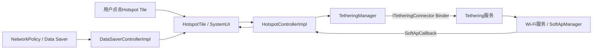
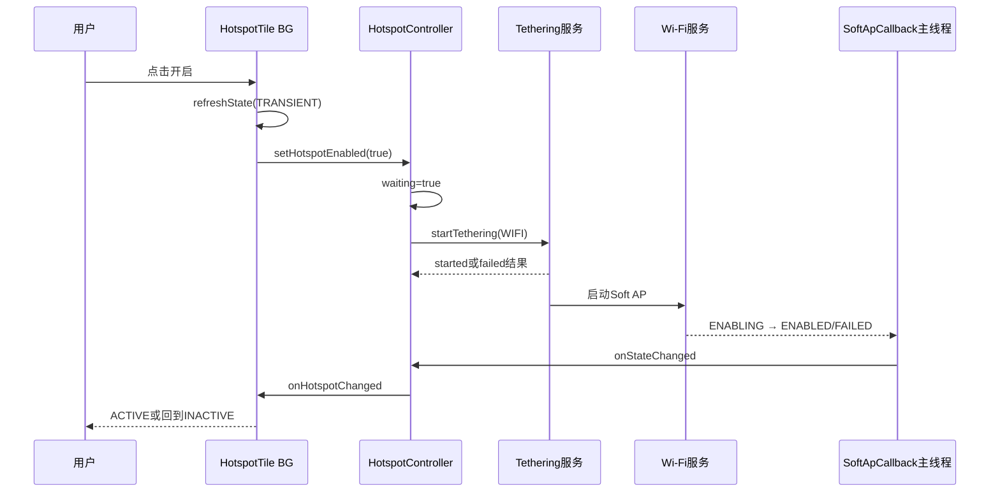
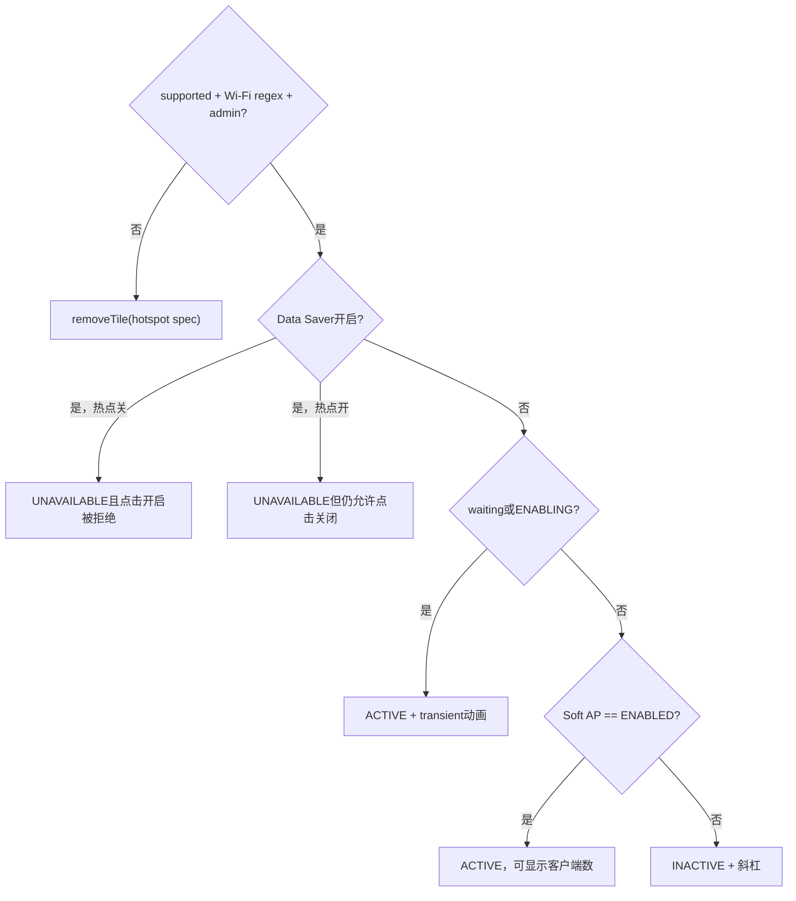

# 第 425 章 Android SystemUI Hotspot Tile：Soft AP、客户端与Data Saver限制

> 源码基线：Android 11 / API 30 / `android-11.0.0_r48`。本章在macOS上只读源码，不编译。核心文件：`HotspotTile.java`、`HotspotControllerImpl.java`、`DataSaverControllerImpl.java`、`TetheringManager.java`和`QSTileImpl.java`。

## 1. 本章要解决什么问题

热点Tile为什么会先转圈、何时算开启、Data Saver为何让它不可用、客户端数字从哪里来、失败后怎样恢复、设备不支持时为何Tile会被删除？本章把UI请求、Tethering服务、Wi-Fi Soft AP状态和QS持久配置分开解释。

## 2. 热点不是普通Wi-Fi开关

Wi-Fi客户端模式让设备接入AP；热点让设备自己运行Soft AP，并经Tethering选择上游、配置地址/NAT/权限与运营商授权。`HotspotTile`控制的是`TETHERING_WIFI`，不是简单调用`WifiManager.setWifiEnabled`。

## 3. 先拆五类状态

设备是否支持tethering、是否存在可共享Wi-Fi接口正则、当前用户是否管理员、Soft AP状态、Tethering启动请求状态互不等价。再加Data Saver与已连接客户端数，Tile才得到最终视觉快照。

## 4. 源码地图

`HotspotTile`做交互和State压缩；`HotspotControllerImpl`桥接TetheringManager与WifiManager SoftApCallback；Tethering模块负责共享请求；Wi-Fi服务负责AP状态和客户端；`DataSaverControllerImpl`镜像NetworkPolicy restrict-background。

## 5. 进程边界

Tile与两个Controller在SystemUI进程。TetheringManager通过ITetheringConnector进入网络栈的Tethering服务；WifiManager通过Wi-Fi Binder进入Wi-Fi服务；Data Saver通过NetworkPolicyManager进入系统网络策略服务。

## 6. 线程边界

Tile处理在共享BG Looper；SoftApCallback用`HandlerExecutor(mMainHandler)`回到主线程；Tethering availability callback用注入的backgroundHandler；start结果使用`DIRECT_EXECUTOR`，因此可能在Binder回调线程直接执行；Data Saver Listener最终投主Looper。

## 7. 两个Controller为何共用一个callback对象

`HotspotAndDataSaverCallbacks`同时实现Hotspot callback和Data Saver listener，分别改写同一`CallbackInfo`的不同字段并`refreshState`。它不是原子联合快照，两个事件到达时序会导致短暂组合态。

## 8. Lifecycle观察做了什么

构造函数让Hotspot与DataSaver Controller都`observe(this, mCallbacks)`。Tile Lifecycle进入监听状态时添加callback，离开时移除，避免Panel不可见时长期注册SoftApCallback。

## 9. handleDestroy为什么是空壳

HotspotTile override `handleDestroy`却只调用super，没有额外清理。真正的观察者解绑依靠Lifecycle/CallbackController机制；这个override本身没有功能增量，不能据它推断有专属销毁协议。

## 10. 总体结构图



## 11. isAvailable的三个条件

Controller要求：Tethering全局受支持、tetherable Wi-Fi正则列表非空、`ActivityManager.getCurrentUser()`是admin。三者任一为false，Hotspot Tile当前不支持。

## 12. 为什么初始默认支持

`mIsTetheringSupported`和`mHasTetherableWifiRegexs`初始都为true，注释明确“在被告知之前假定可用”。因此Controller刚创建时`isHotspotSupported`可能暂时乐观为true。

## 13. 异步能力回调

构造时向TetheringManager注册EventCallback，执行器是background Handler。`onTetheringSupported`与`onTetherableInterfaceRegexpsChanged`分别更新两个volatile字段，变化时通知availability。

## 14. 为什么字段是volatile

能力回调在后台线程，而Tile可能在BG Looper读取；volatile提供跨线程可见性。相较之下，`mHotspotState`和`mWaitingForTerminalState`不是volatile，后文会单独讨论它们的线程边界风险。

## 15. Wi-Fi正则意味着什么

Tethering服务用正则识别哪些接口可用于Wi-Fi共享。列表非空只说明存在候选接口规则，不代表AP此刻能成功启动、频段有可用信道或运营商授权通过。

## 16. admin判断是动态的

每次`isHotspotSupported`都以`ActivityManager.getCurrentUser()`查询UserManager admin身份，没有把userId固定在构造时。用户切换后再次查询能得到新用户，但是否触发Tile重建/刷新仍依赖外部事件。

## 17. availability变false会怎样

Tile callback收到false时记录日志并调用`mHost.removeTile(getTileSpec())`。这不是仅把Tile画成UNAVAILABLE，而是沿QSTileHost修改用户持久化的Tile spec列表。

## 18. 能力恢复会自动加回吗

不会。callback在available=true时没有动作；已经从`QS_TILES`移除的spec也没有在本类自动恢复。用户可能需要编辑快捷设置重新添加，或依赖其他外部默认恢复机制。

## 19. 乐观初值带来的删除窗口

启动初期Tile可能因默认true被创建，随后真实callback为false而被删除。这个设计允许异步发现能力，却把发现失败转化为持久配置变化，是排查“热点Tile自己消失”的关键。

## 20. Controller的SoftApCallback何时注册

第一个Hotspot callback加入时，Controller向WifiManager注册自身；最后一个移除时注销。多个Tile/观察者共用一次底层注册，减少重复Binder订阅。

## 21. callback去重规则

HotspotController在锁内拒绝null和已存在callback。DataSaverController则直接add，没有去重；本Tile通常由Lifecycle正确配对，但两个Controller的集合语义并不一致。

## 22. 第一个观察者如何得到初值

WifiManager注册SoftApCallback会在主Handler触发当前状态/客户端回调，Controller依赖该行为回放。第二个及以后观察者不会重新注册，而是单独post当前enabled与客户端数给新callback。

## 23. 回放不是一份原子快照

enabled读`mHotspotState`，客户端读volatile计数；两者可能来自相邻回调。Controller没有generation把state与client list绑定，短暂“未启用但客户端数非零”最终由状态回调清零。

## 24. handleSetListening为何再refresh

HotspotTile额外维护`mListening`，从false到true时主动`refreshState()`。即使Controller初值回调延迟，它也能立即用Controller getter和DataSaver getter重算一次。

## 25. 重复listening被抑制

自有`mListening`与目标值相等就return；但super仍在此前执行日志。这里抑制的只是额外refresh，不是QSTileImpl token化监听本身。

## 26. 主点击先读什么

`handleClick`读取稳定`mState.value`作为isEnabled，不现场调用Controller。它依赖上一轮State，事件刚变而Tile未refresh时可能按旧方向发请求。

## 27. Data Saver如何阻止开启

只有`!isEnabled && isDataSaverEnabled()`时直接return。也就是说Data Saver开启时拒绝从关到开，但若热点已经开，仍允许用户点击关闭。

## 28. Data Saver开启且热点已开

State会被标成UNAVAILABLE，因为UI优先显示Data Saver限制；handleClick内部却因isEnabled=true继续请求关闭。基类click并不按STATE_UNAVAILABLE统一拦截，所以代码仍保留安全关闭路径。

## 29. 点击开启为何立即进入transient

若当前未启用，先`refreshState(ARG_SHOW_TRANSIENT_ENABLING)`，再请求Controller开启。用户立即看到动画，不必等Soft AP服务回调。

## 30. 点击关闭为何不乐观关闭

关闭时传null刷新，state仍从Controller读到enabled，直到SoftApCallback报告DISABLING/DISABLED才改变。它没有显示专门的“正在关闭”动画，因为Controller transient只覆盖waiting或ENABLING。

## 31. setHotspotEnabled的重入门

Controller若`mWaitingForTerminalState`为true，任何新的enable/disable请求都被忽略。这个等待门主要由本Controller发起开启时设置，防止启动过程中快速反向操作。

## 32. 为什么等待门只在开启时设

开启前设true；关闭只是调用stopTethering，不设waiting。故连续关闭请求可能重复发送，关闭过程中也没有Controller级终态门。

## 33. 开启请求的内容

构造`new TetheringRequest.Builder(TETHERING_WIFI).build()`，未指定静态地址、local-only或跳过entitlement等额外选项，使用平台默认的Wi-Fi tethering请求语义。

## 34. TetheringManager连接器可能尚未就绪

`getConnector`在连接器为空时把请求排入队列，由轮询线程得到Binder后按序执行。因此`startTethering`Java方法返回也可能只表示任务已排队，还没有到达Tethering服务。

## 35. start callback执行在哪

Controller传`ConcurrentUtils.DIRECT_EXECUTOR`。TetheringManager的IIntResultListener收到Binder结果后，直接在当前回调线程执行`onTetheringFailed`；这不保证是主线程。

## 36. 成功callback为什么是空的

Controller只override失败，成功不清waiting。它等待更权威的WifiManager SoftApCallback报告ENABLED或DISABLED，才把启动终态收敛。

## 37. 启动失败做什么

`onTetheringFailed`调用`maybeResetSoftApState()`再`fireHotspotChangedCallback()`。但如果此刻`mHotspotState`仍是ENABLING/默认值，reset可能不清waiting；之后仍依赖SoftAp FAILED/DISABLED回调。

## 38. 失败result为什么看不到

方法参数`result`没有保存、没有写入Tile副标题，DEBUG日志也只写固定“onTetheringFailed”。用户只会看到transient结束/回到关闭，无法从Tile知道授权、配置或其他失败原因。

## 39. stopTethering的结果边界

TetheringManager stop API本身是void；内部result listener注释承认没有向调用者暴露结果，调用者只能等待状态广播/回调。HotspotController也不实现停止失败反馈或超时。

## 40. Soft AP五态

WifiManager提供DISABLED、DISABLING、ENABLED、ENABLING、FAILED。Controller只有精确ENABLED时`isHotspotEnabled=true`，只有waiting或ENABLING时`isHotspotTransient=true`。

## 41. DISABLING如何显示

DISABLING既不enabled也不transient，因此Tile可能提前显示INACTIVE和斜杠，虽然底层还未完全关闭。UI“已关”比真实终态早一步。

## 42. FAILED如何处理

`onStateChanged`先保存FAILED，随后`maybeResetSoftApState`会调用stopTethering来重置Soft AP，再清waiting；客户端数清零，最后通知Tile。failureReason完全被忽略。

## 43. 为何FAILED还要stop

源码TODO说明失败后必须调用stop来重置Soft AP状态。这里的stop是清理失败状态，不代表热点曾成功开启。

## 44. terminal state有哪些

对由本Controller开启的等待，FAILED、ENABLED、DISABLED都会清waiting；ENABLING、DISABLING和未知值保持。终态判定围绕请求生命周期，不只围绕布尔enabled。

## 45. 外部发起的开启

如果Settings或其他组件启动热点，Controller的`mWaitingForTerminalState`没被置true，但SoftAp ENABLING仍使`isHotspotTransient=true`。到ENABLED后enabled为true，正常刷新。

## 46. 外部发起失败

waiting为false时`maybeResetSoftApState`立即return，Controller不会主动stop重置。只有由本Controller发起的启动失败才执行该清理政策。

## 47. onStateChanged的顺序

先写mHotspotState，再尝试重置等待；如果不再enabled就把客户端数清零，最后复制callbacks逐个通知。State更新先于观察者回调，观察者再调用getter能读到新值。

## 48. failureReason丢失的诊断影响

SoftApCallback给出general/no-channel/unsupported-configuration等reason，但SystemUI Controller不保存。排查只能去Wifi服务/SoftApManager日志或dump，而不能只看HotspotController dump。

## 49. 关键Controller源码

```java
public void setHotspotEnabled(boolean enabled) {
    if (mWaitingForTerminalState) return;
    if (enabled) {
        mWaitingForTerminalState = true;
        mTetheringManager.startTethering(
                new TetheringRequest.Builder(TETHERING_WIFI).build(),
                ConcurrentUtils.DIRECT_EXECUTOR,
                new StartTetheringCallback() { /* failure refresh */ });
    } else {
        mTetheringManager.stopTethering(ConnectivityManager.TETHERING_WIFI);
    }
}
```

## 50. 这段源码没有保证什么

没有超时、没有request id、没有取消启动、没有停止结果、没有失败reason展示，也没有证明上游网络可用。它只是把请求交给Tethering服务，再由Soft AP事实回调收敛。

## 51. 客户端数来自哪里

WifiManager `onConnectedClientsChanged(List<WifiClient>)`把`clients.size()`存入volatile字段并通知。Tile只展示数量，不读取MAC、地址、名称或流量。

## 52. 数量为何是best effort

Wi-Fi层能看到的是Soft AP已知客户端，静态地址、桥接、断开检测延迟等都可能影响准确性。Tile数字适合状态摘要，不适合作为安全审计或计费依据。

## 53. 关闭时为何强制清零

只要新state不是ENABLED，Controller就把客户端数置0，避免旧数字残留。这也意味着ENABLING阶段即使底层已有关联事件，随后state callback可能暂时归零。

## 54. 客户端字段为何volatile

SoftApCallback通常在主Handler，但getter可由Tile BG读取，volatile确保计数可见。Controller仍通过callback把变化推给Tile，volatile不是事件通知机制的替代品。

## 55. callback如何避免并发修改

fire方法在锁内复制`mCallbacks`，锁外遍历。这样listener回调中增删观察者不会修改本轮列表，也避免持锁执行外部代码。

## 56. callback异常会怎样

遍历没有try/catch；任一callback抛RuntimeException会中断本轮后续listener。锁已释放，不会因此永久锁住集合，但部分观察者会漏掉该事件。

## 57. mHotspotState的可见性疑问

它不是volatile；写主要来自主Handler SoftApCallback，读可能来自Tile BG `isHotspotEnabled`。代码依赖消息投递/实际执行链带来的可见性，但getter本身没有显式同步，是严格Java内存模型下值得标注的边界。

## 58. mWaitingForTerminalState的竞态

Tile BG设置waiting，主Handler state callback与可能的Binder失败线程读写它，也没有volatile/锁。快速失败或多线程交错时理论上存在陈旧读；dump也可能看到过时瞬间值。

## 59. 状态事件为何仍通常能收敛

SoftAp状态还会持续回调，QSTile refresh自身又是Handler消息，现实线程调度通常让最终ENABLED/DISABLED可见。但“通常收敛”不是源码层严格同步保证，诊断偶发卡transient时应记住这一点。

## 60. 开启时序图



## 61. State中的value如何计算

若arg是CallbackInfo，value=`transientEnabling || info.isHotspotEnabled`；否则现场读Controller。transient只在本次refresh的arg匹配静态sentinel时强行把value设true。

## 62. transient有两个来源

局部`transientEnabling`来自用户点击那一次参数；Controller transient来自waiting或Soft AP ENABLING。局部参数只影响该轮，Controller状态负责后续动画延续。

## 63. isTransient为何单独保存

State明确写`state.isTransient`，QS UI可画动画/处理辅助状态。它比第422章WifiTile漏写局部isTransient更完整。

## 64. slash何时出现

只有`!state.value && !state.isTransient`才斜杠。开启动画期间value通常true且transient=true，避免动画图标再叠关闭斜杠。

## 65. 图标策略

普通开关无论开关都使用静态`ic_hotspot`配合斜杠；transient时改为framework内部热点动画资源。图标变化是请求反馈，不是服务完成证明。

## 66. Admin restriction如何进入State

每轮更新调用`checkIfRestrictionEnforcedByAdminOnly(state, DISALLOW_CONFIG_TETHERING)`。仅管理员强制且不是base restriction时设置`disabledByPolicy`与EnforcedAdmin。

## 67. base restriction为何不同

若限制属于用户类型基础限制，helper不会标成`disabledByPolicy`，因为没有某个具体设备管理员详情可展示。Tile availability另有admin用户条件，但这两条政策链仍不完全相同。

## 68. primary点击的admin拦截

QSTileImpl在处理CLICK消息前检查`mState.disabledByPolicy`，若为true就打开管理员支持详情，而不调用HotspotTile.handleClick。限制判断使用上一轮State缓存。

## 69. secondary点击的政策边界

HotspotTile没有override secondary，因此基类secondary最终调用handleClick；但SECONDARY_CLICK分支没有`disabledByPolicy`拦截。普通Hotspot BooleanState未声明dualTarget，UI通常不暴露该入口，但程序化secondary存在绕过差异。

## 70. long click的政策边界

长按始终启动`ACTION_TETHER_SETTINGS`，基类也不按disabledByPolicy拦截。进入Settings不等于能修改，Settings可再次执行自己的限制检查。

## 71. Data Saver状态从哪里来

DataSaverController读取`NetworkPolicyManager.getRestrictBackground()`，注册INetworkPolicyListener，在变化时post主线程逐个通知。它控制后台流量政策，不等于移动数据总开关。

## 72. 为什么Data Saver限制热点

r48产品策略选择在Data Saver开启时把热点Tile置不可用，并拒绝开启。源码这里没有解释网络层必然冲突；应把它理解为SystemUI显式业务门。

## 73. Data Saver回调初值

addCallback注册listener后立即调用`listener.onDataSaverChanged(isDataSaverEnabled())`。初值在addCallback调用线程直接回放，后续NetworkPolicy增量经主Handler。

## 74. DataSaverController的重复通知

`setDataSaverEnabled`先调用NetworkPolicyManager，再手动调用本地policyListener；服务也可能稍后回调同一值，因此Listener可能收到重复事件。Hotspot State copy通常会过滤无字段变化。

## 75. CallbackInfo的部分更新

热点事件只改enabled和numDevices；Data Saver事件只改isDataSaverEnabled。初始两个回调谁先到，另一些字段就是Java默认值，随后第二个事件再收敛。

## 76. arg快照并没有复制

`refreshState(mCallbackInfo)`传的是同一可变对象引用，消息排队后对象可能再次被改。QSTile BG真正处理时看到的是较新的组合，而非调用瞬间不可变快照；这会合并中间帧。

## 77. Tile不可用态优先级

只要Data Saver为true，state固定UNAVAILABLE，无论value/transient是否true。secondaryLabel先看transient，再看Data Saver，因此开启动画与Data Saver同时到达时文案可能仍显示“正在开启”。

## 78. state与secondary优先级不完全一致

State判定Data Saver第一优先；文案判定transient第一优先。于是视觉状态为UNAVAILABLE时，副标题可能是transient，而非“Data Saver已开启”，这是源码条件顺序的真实结果。

## 79. active如何计算

`isTileActive = state.value || state.isTransient`。无Data Saver时它决定ACTIVE/INACTIVE；Soft AP尚未ENABLED但waiting/transient为true时，Tile可先ACTIVE并显示动画。

## 80. 客户端文案条件

只有非transient、非Data Saver、客户端数大于0且isActive时，才用复数资源显示N台设备。客户端为0时副标题null，不显示“0台设备”。

## 81. Data Saver文案

非transient且Data Saver开启时，显示专门的Data Saver限制文案。它解释为什么Tile不可用，但没有按钮直接关闭Data Saver。

## 82. stateDescription

直接等于secondaryLabel，供辅助功能补充“正在开启”“Data Saver开启”或设备数量。null时没有额外状态说明，基础Switch语义仍来自state/state.value。

## 83. Announcement的实际边界

Tile实现开/关播报文案，但第420章已确认r48基类的`mAnnounceNextStateChange`没有有效置true入口。方法存在不能证明普通点击一定触发该announcement。

## 84. 没有详情面板

HotspotTile不提供DetailAdapter，不显示SSID、密码、频段、自动关闭或客户端列表。secondary默认等同主点击；配置必须长按进入Tether设置。

## 85. Tile也不显示SSID

图标、label和副标题只包含热点名称固定文案与客户端数。排查用户连错网络或密码问题必须转到SoftApConfiguration/Settings，不在本Tile状态范围。

## 86. Tile不主动管理Wi-Fi互斥

源码没有先关闭Wi-Fi客户端模式，也没有判断STA+AP并发能力。是否允许并发或由底层切换，交给Tethering/Wi-Fi服务和设备能力处理。

## 87. Tile不检查上游

开启前不判断移动数据、Wi-Fi上游、以太网或Internet validation。热点可以AP已启用但没有可用上游；Tile仍可ACTIVE。

## 88. 开启成功不等于客户端能上网

ENABLED只证明Soft AP处于启用态。DHCP、NAT、DNS、entitlement、上游选择和validation仍可能失败；客户端计数大于0也只证明系统看到关联客户端。

## 89. Controller dump有什么

输出available、mHotspotState字符串、客户端数和waiting。它不打印两项能力布尔的各自值、当前用户/admin结果、Data Saver、failureReason、上次请求时间或上游网络。

## 90. stateToString的未知值

只覆盖五个Wi-Fi AP常量，其他值返回null。dump出现`mHotspotState=null`可能是未初始化默认0或未来未知常量，不等于Java对象为null。

## 91. 初始mHotspotState的含义

int默认0，不是WIFI_AP_STATE_DISABLED的正式值。第一个SoftAp状态回放前，Controller的enabled=false，但dump stateToString为null；UI把“尚未知道”压成关闭。

## 92. WifiManager为null的边界

构造取得系统服务，addCallback中显式判null；若null则不注册SoftApCallback，也不主动给callback热点初值。availability仍可能因Tethering条件返回true，导致Tile长期停留默认关闭。

## 93. TetheringManager没有null防护

构造后立即调用registerTetheringEventCallback，没有判null。正常SystemUI设备应有该服务；异常环境/测试未注入会在构造阶段失败，而不是优雅地报告不支持。

## 94. Controller没有销毁接口

Tethering EventCallback在构造时永久注册，本类没有unregister/destroy；Singleton通常与SystemUI进程同寿命。SoftApCallback则按观察者0↔1动态注册。

## 95. availability callback的线程

它运行background Handler，并直接`fireHotspotAvailabilityChanged`遍历callbacks；Tile callback会在该后台线程调用`mHost.removeTile`。r48的Host没有再post，而是当场读取、修改并写入`Settings.Secure.QS_TILES`；其他callback也必须自行保证线程安全。

## 96. Start失败回调的线程

DIRECT_EXECUTOR可使失败路径在Binder线程调用`fireHotspotChangedCallback`。Controller注释明确提醒多线程，尤其主线程阻塞问题；它只复制listener集合，没有统一回主线程。

## 97. Tile为何能承受异线程callback

`refreshState`只是向QSTile自身Handler排REFRESH消息，所以来自主、后台或Binder线程都不会直接改View。真正State重算在Tile BG串行执行。

## 98. removeTile的恢复风险

availability暂时为false也会在回调线程同步删除spec，没有去抖、确认或区分永久/暂时。后续true只回调available，不调用addTile；这可能把瞬时服务配置变化转成长期用户布局变化。

## 99. 完整诊断证据

至少同时看：Controller available三条件、current user admin、Data Saver、waiting、Soft AP五态与failureReason、Tethering start result、客户端列表、上游网络和QS_TILES是否仍含hotspot。

## 100. Tile决策图



## 101. 常见误解一：ACTIVE就是能共享Internet

错误。ACTIVE可只是开启transient，终态ENABLED也只证明Soft AP已开；上游、NAT、DNS和Internet validation不是Tile ACTIVE条件。

## 102. 常见误解二：Data Saver会强制关热点

本类没有在Data Saver callback中调用stop。它把Tile置不可用并拒绝新开启；热点若已开，仍保留到用户/其他系统关闭，且点击被允许走关闭路径。

## 103. 常见误解三：失败原因会显示

错误。start result和SoftAp failureReason均未进入State/dump；Tile只回落。必须查Tethering/Wi-Fi日志和服务dump。

## 104. 常见误解四：不支持只会灰掉

错误。availability false调用Host.removeTile，修改持久spec；恢复true没有自动重加。

## 105. 常见误解五：客户端数是安全真相

错误。它是WifiClient列表当前best-effort size，关闭时人为清零，不含身份验证、流量或确定在线证明。

## 106. 排查“热点Tile消失”

先查`QS_TILES`是否还有hotspot，再查Tethering supported、Wi-Fi tether正则与current user admin；找`Tile removed. Hotspot no longer available`日志。若能力已恢复，源码不会自动恢复spec。

## 107. 排查“永远正在开启”

看waiting、mHotspotState是否到ENABLED/FAILED/DISABLED、start callback是否返回、SoftApCallback是否注册；再注意waiting与state跨线程非volatile，以及start失败时旧state若非终态不会立刻清waiting。

## 108. 排查“已开启但设备连不上”

从SoftApConfiguration、频段/信道、SoftApManager failure、认证和客户端关联入手；若客户端已关联再查地址分配、Tethering接口、上游与NAT。Tile只有enabled和计数，证据不足。

## 109. 排查“Data Saver下仍能关”

这是设计：handleClick只在“当前关闭且Data Saver开”时return；当前开启则继续stop。State虽UNAVAILABLE，QSTileImpl没有按UNAVAILABLE统一拦截CLICK。

## 110. 排查“客户端数闪动”

核对onConnectedClientsChanged与onStateChanged顺序；任何非ENABLED状态都会清零。CallbackInfo又是共享可变对象，中间帧可被合并；只有最终稳定态值得下结论。

## 111. 最可靠的证据层级

点击日志只证明输入；transient只证明UI已发请求；start success只证明Tethering接受启动；Soft AP ENABLED证明AP启用；客户端回调证明已知关联；上游validation/真实传输才证明共享网络可用。

## 112. macOS只读练习一：推演五态

用`rg -n 'WIFI_AP_STATE_|isHotspotTransient|maybeResetSoftApState' HotspotControllerImpl.java`。分别输入ENABLING、ENABLED、DISABLING、DISABLED、FAILED，写出enabled、transient、waiting、客户端数和Tile state/slash。

## 113. macOS只读练习二：比较两种失败

推演startTethering直接返回failure但mHotspotState仍ENABLING，以及SoftApCallback进入FAILED两种路径。说明哪条会stop、哪条清waiting、失败reason在哪里丢失，并标出可能的回调线程。

## 114. macOS只读练习三：验证Data Saver门

做四格表：Data Saver开/关 × 热点value开/关，逐格执行handleClick与handleUpdateState。解释为什么“UNAVAILABLE但允许关闭”不矛盾，以及共享CallbackInfo可能怎样合并事件。

## 115. macOS只读练习四：追Tile消失与恢复

沿Controller构造默认true、Tethering EventCallback false、`onHotspotAvailabilityChanged`、`QSTileHost.removeTile`和Secure `QS_TILES`追踪。再令availability恢复true，寻找是否存在自动add路径并给出结论。

## 116. 练习参考结论

ENABLING/本地waiting是transient，DISABLING已画关闭；SoftAp FAILED终态负责可靠清waiting并重置；Data Saver只禁新开不强关；能力false会删除持久spec，true回调没有自动加回。

## 117. 复读源码后的修正

复读后明确：支持能力初值是乐观true；第一个SoftAp callback依赖WifiManager即时回放；secondary默认等同点击且不走admin拦截；Data Saver下已开热点仍可关闭；start成功回调为空、以SoftAp终态为准；start失败reason与SoftAp failureReason都丢失；DISABLING不算transient；客户端数为best effort；state/waiting存在跨线程非volatile边界；availability false会在后台回调线程直接写Secure、持久remove且不自动恢复。

## 118. 本章没有覆盖什么

未展开Tethering状态机内部、地址分配、BPF/offload、NAT、entitlement UI、SoftApConfiguration、安全协议、频段/信道选择和厂商STA+AP并发。这些将在网络共享与Wi-Fi服务专题继续阅读。

## 119. 阅读完成检查表

应能画出Tile→Tethering→Wi-Fi→Callback链；区分supported、waiting、Soft AP state、Data Saver与客户端数；解释开启/关闭不对称、失败无reason、admin限制入口差异、可用性删除spec和跨线程可见性边界。

## 120. 本章结论

HotspotTile是一台异步状态机的压缩遥控器：它用transient掩盖启动延迟，用Soft AP终态收敛，用Data Saver和admin政策限制入口，却不证明共享Internet最终可用。最反直觉的风险是能力异步变false会永久移除Tile配置，而失败与停止又缺少结果表达；读源码时必须把UI、请求、AP、客户端和上游五层分别取证。
