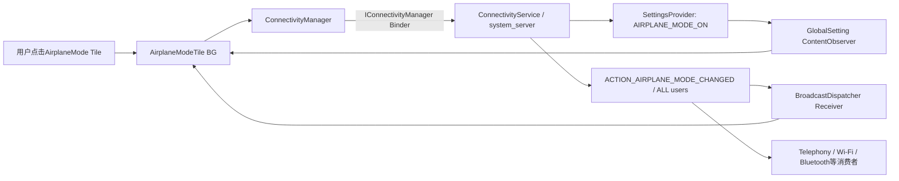
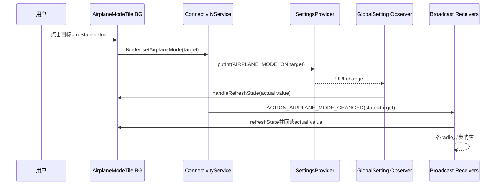
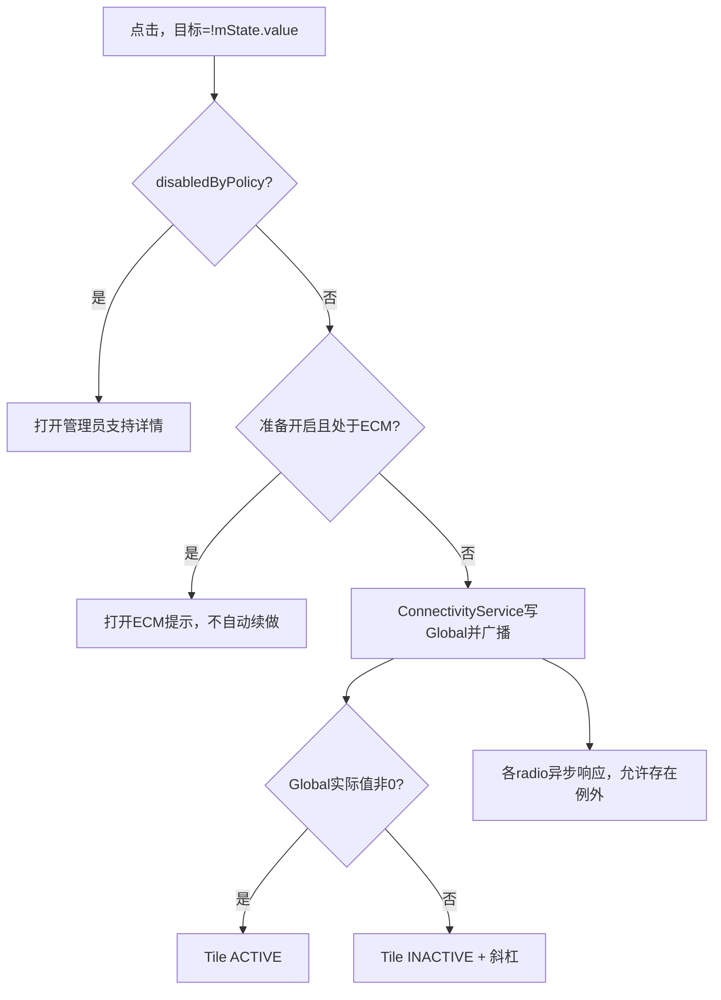

# 第 426 章 Android SystemUI AirplaneMode Tile：Global设置、ECM与广播收敛

> 源码基线：Android 11 / API 30 / `android-11.0.0_r48`。本章仅在macOS上阅读源码，不编译。核心文件是`AirplaneModeTile.java`、`GlobalSetting.java`、`ConnectivityManager.java`、`ConnectivityService.java`、`BroadcastDispatcher.kt`与Telephony ECM相关实现。

## 1. 本章要解决什么问题

飞行模式Tile的一次点击如何变成设备级Global设置？为什么它同时监听ContentObserver和广播？ECM为何只阻止开启？策略限制、广播extra、Global真实值和各无线电最终状态之间是什么关系？

## 2. 先拆四层事实

第一层是用户请求开启/关闭；第二层是`Settings.Global.AIRPLANE_MODE_ON`；第三层是`ACTION_AIRPLANE_MODE_CHANGED`通知；第四层是蜂窝、Wi-Fi、蓝牙等组件各自响应后的无线电状态。四层按序推进，但不是一个原子事务。

## 3. 飞行模式不是“所有无线电物理断电”

Global值和广播表达系统模式，具体radio是否关闭还受`AIRPLANE_MODE_RADIOS`、`AIRPLANE_MODE_TOGGLEABLE_RADIOS`、设备能力与用户后续操作影响。Tile ACTIVE只能证明Global值非零。

## 4. 源码地图

Tile处理交互与State；`GlobalSetting`监听Global URI；ConnectivityManager跨Binder请求ConnectivityService；ConnectivityService写Global并向ALL用户广播；NetworkController、Bluetooth/Wi-Fi等消费者各自响应。

## 5. 进程边界

AirplaneModeTile位于SystemUI进程。`ConnectivityManager.setAirplaneMode`经`IConnectivityManager`进入system_server的ConnectivityService；SettingsProvider保存Global；Phone/网络/Wi-Fi/蓝牙等进程再消费设置或广播。

## 6. 线程边界

Tile handleClick和State在QSTile共享BG Looper；GlobalSetting的ContentObserver使用Tile mHandler，也回到该BG；BroadcastDispatcher默认把Tile receiver投主线程，receiver再调用`refreshState`向Tile BG排消息。

## 7. Tile有两个观察通道

一条是Global URI变更，直接带最新int刷新；另一条是`ACTION_AIRPLANE_MODE_CHANGED`广播，只触发重新读取。任一通道到达都能让Tile收敛，代价是正常切换常出现重复refresh。

## 8. 为什么保留两个通道

ContentObserver更直接反映持久值，广播则是平台飞行模式协议，能覆盖外部按规范切换的通知。源码没有注释明确冗余原因，但从行为上它们构成设置事实与事件协议的双保险。

## 9. 不要把广播当作存储

广播的`state` extra只是发送者当时声明；Tile receiver完全不读extra，而是`refreshState()`重新查询Global。这让Tile以存储事实为准，而非盲信事件载荷。

## 10. 总体链路图



## 11. 构造函数做什么

构造时保存ActivityStarter与BroadcastDispatcher，并创建匿名GlobalSetting。设置变更时调用`handleRefreshState(value)`，不是公开`refreshState(value)`再排一次消息，因为ContentObserver已经在Tile Handler线程。

## 12. GlobalSetting.getValue

调用`Settings.Global.getInt(..., name, 0)`，缺失或不可读时默认0。因此初始化未知被压成飞行模式关闭，而不是单独的UNKNOWN状态。

## 13. GlobalSetting.setValue为何没被用

helper提供直接`Global.putInt`，但Tile开启不用它，而走ConnectivityManager。因为规范切换还需要权限、广播和系统服务统一入口；只改数据库可能漏掉协议事件。

## 14. 首次监听如何获得State

GlobalSetting注册ContentObserver本身不回放当前值；QSTileImpl在第一个listener进入后会调用`refreshState()`，由handleUpdateState现场`mSetting.getValue()`保证至少一次初始读取。

## 15. Broadcast注册是异步的

`BroadcastDispatcher.registerReceiver`向自身Handler发送ADD消息，调用返回时底层UserBroadcastDispatcher未必已登记。AirplaneModeTile随后同步注册Global ContentObserver，所以早期变更至少还有设置通道。

## 16. 取消监听也有窗口

Dispatcher的unregister同样排消息，而Global Observer立即注销；在底层广播receiver真正移除前仍可能收到一次事件并refresh。QSTile Handler能处理它，但Panel已不监听时通常没有可见更新需求。

## 17. mListening做什么

Tile用boolean抑制重复注册/注销；super日志仍先执行。QSTileImpl本身按listener token做0↔1转换，这个字段是第二层防护。

## 18. Broadcast用户范围

ConnectivityService以`UserHandle.ALL`发送；Tile通过Dispatcher默认注册到SystemUI Context所属用户，通常是system user，也能收到ALL广播。Global设置本身是设备级共享值。

## 19. 主点击读旧State

`airplaneModeEnabled = mState.value`，不在点击瞬间重读Global。若外部刚切换而State增量尚未到，点击可能计算出错误的反向请求；后续双观察通道仍会显示最终Global事实。

## 20. Metrics记录顺序

点击先记录目标值`!airplaneModeEnabled`，随后才检查ECM。因此ECM阻止开启时，metrics也可能记录一次“尝试开启”的action，不能把指标直接当成功次数。

## 21. ECM是什么

Emergency Callback Mode是紧急呼叫后的特殊电话状态，为保持回拨能力，会限制可能中断蜂窝服务的操作。Tile通过生成的`TelephonyProperties.in_ecm_mode()`读取系统属性。

## 22. ECM只阻止哪一个方向

条件是`!airplaneModeEnabled && in_ecm_mode`，即当前关闭、准备开启飞行模式时阻止。当前已开时请求关闭不受该分支限制，符合“恢复无线通信”不应被拦的方向性。

## 23. ECM分支做什么

通过ActivityStarter启动`ACTION_SHOW_NOTICE_ECM_BLOCK_OTHERS`，同时dismiss keyguard，然后return。它不改Global、不发广播，也不先画transient。

## 24. Tile会等ECM退出后自动开启吗

不会。AirplaneModeTile没有waiting字段，也没监听`ACTION_EMERGENCY_CALLBACK_MODE_CHANGED`来续做。用户退出ECM后需要再次点击，除非Telephony提示Activity自身另有用户动作。

## 25. 不要套用Global Actions实现

同版本电源菜单`GlobalActionsDialog.AirplaneModeAction`有`mIsWaitingForEcmExit`，收到ECM退出广播后会继续开启。QS Tile没有这段逻辑，两入口行为不能互相证明。

## 26. ECM属性读取失败的默认

`orElse(false)`把sysprop缺失当不在ECM。Tile不会因属性不可用显示UNAVAILABLE或错误，而是继续正常请求。

## 27. 正常点击调用什么

`setEnabled(!airplaneModeEnabled)`取得ConnectivityManager并调用隐藏SystemApi `setAirplaneMode(enabled)`。没有AsyncTask、没有本地状态预写，也没有返回boolean。

## 28. 为什么普通应用不能复制

API要求`NETWORK_AIRPLANE_MODE`、`NETWORK_SETTINGS`、setup wizard或network stack相关签名权限之一；ConnectivityService再次执行权限校验。SystemUI是平台受信组件，普通应用没有同等权限。

## 29. Binder异常如何表现

ConnectivityManager把RemoteException重新抛为来自system_server的运行时异常；QSTileImpl Handler总catch会warn host。Tile没有专用Toast/错误State，用户看到的仍是旧Global值。

## 30. ConnectivityService做了什么

权限通过后清除Binder calling identity，以system_server身份写`AIRPLANE_MODE_ON`，构造带`state` extra的广播并向ALL用户发送，最后恢复identity。

## 31. 写Global与广播的顺序

先`Settings.Global.putInt`，后sendBroadcast。正常情况下receiver读取时已看到新值；ContentObserver通知与广播投递的先后却不保证，Tile为两条路径都能独立重算。

## 32. putInt返回值被忽略

`Settings.Global.putInt`返回boolean，但ConnectivityService不检查，即使写入被SettingsProvider限制或失败，仍会发送请求值广播。AirplaneModeTile忽略extra并回读Global，能避免自身显示假值。

## 33. 广播也不是完成ACK

它在写设置后立即发送，不等待蜂窝radio power-off、Wi-Fi/Bluetooth策略响应或网络断开。因此收到广播只能证明切换协议已发布，不能证明所有硬件已到终态。

## 34. Tile为何没有transient

AirplaneModeTile无`ARG_SHOW_TRANSIENT_ENABLING`和`state.isTransient`。点击后保持旧态，等ContentObserver或广播刷新；设置写入通常很快，所以实现选择了简单的事实回读。

## 35. 快速连点会发生什么

若第一次写入通知尚未更新mState，第二次仍按旧值发送同方向请求，而不是反向；如果mState已更新则会反向。没有request id、点击锁或防抖。

## 36. handleUpdateState的arg

arg是Integer时直接使用，例如GlobalSetting回调传来的value；否则现场getValue。广播路径传null，确保重新读数据库。

## 37. 非零都算开启

`airplaneMode = value != 0`，不只接受1。异常值2或-1也显示ACTIVE；ConnectivityService标准写入是0/1。

## 38. State只有两态

开启为`STATE_ACTIVE`，关闭为`STATE_INACTIVE`，没有基于ECM、策略基础限制或radio过渡设置`STATE_UNAVAILABLE`。管理员限制另存在`disabledByPolicy`字段。

## 39. Slash语义

关闭时`slash.isSlashed=true`，开启时取消斜杠；始终使用同一个飞机ResourceIcon。图标不表达各radio的例外状态。

## 40. value的精确定义

`state.value`只等于Global值是否非零。即使用户在飞行模式中重新开启可切换的Wi-Fi或Bluetooth，Tile仍ACTIVE。

## 41. label和辅助功能

label/contentDescription均为“飞行模式”，expandedAccessibilityClassName是Switch；没有secondaryLabel/stateDescription解释ECM或radio例外。

## 42. isAvailable为何几乎总为true

本类未override可用性，沿QSTileImpl默认实现。没有Telephony硬件的Wi-Fi设备仍可以具有飞行模式政策，所以Tile不以phone feature决定存在性。

## 43. 长按目标

返回`Settings.ACTION_AIRPLANE_MODE_SETTINGS`。设置页可展示更完整说明或执行自身策略检查；长按不改变Global。

## 44. secondary click

本类没override，基类默认调用handleClick。BooleanState未声明dualTarget，普通UI不一定提供独立secondary入口，但程序化调用语义等同主操作。

## 45. 管理员限制如何写入State

每轮调用`checkIfRestrictionEnforcedByAdminOnly(state, DISALLOW_AIRPLANE_MODE)`，按当前用户查EnforcedAdmin；若是admin强制且不是base user restriction，就设`disabledByPolicy=true`。

## 46. primary政策拦截

QSTileImpl处理CLICK消息时先查缓存的disabledByPolicy；为true就打开管理员支持详情，不进入AirplaneModeTile.handleClick。限制判断和点击之间仍可能有状态陈旧窗口。

## 47. secondary政策差异

SECONDARY_CLICK分支不执行disabledByPolicy检查，直接调用子类/默认secondary。UI通常没有该独立目标，但从API层看这是与primary不同的政策门。

## 48. long政策差异

LONG_CLICK也不被基类disabledByPolicy拦截，而是打开设置。允许查看管理员限制说明与允许实际修改不是一回事。

## 49. 关键切换源码

```java
public void handleClick() {
    boolean airplaneModeEnabled = mState.value;
    MetricsLogger.action(mContext, getMetricsCategory(), !airplaneModeEnabled);
    if (!airplaneModeEnabled && TelephonyProperties.in_ecm_mode().orElse(false)) {
        mActivityStarter.postStartActivityDismissingKeyguard(
                new Intent(TelephonyManager.ACTION_SHOW_NOTICE_ECM_BLOCK_OTHERS), 0);
        return;
    }
    setEnabled(!airplaneModeEnabled);
}
```

## 50. 这段源码最容易读错什么

它没有直接写Setting、没有把State先取反、没有等待ECM退出、没有检查每种radio，也没有成功结果。`mState.value`是旧快照，ConnectivityService广播也只是协议事件。

## 51. base restriction是什么

某些用户类型天然带`DISALLOW_AIRPLANE_MODE`，不是某个设备管理员单独施加。helper对此不设disabledByPolicy，因为没有admin详情对象可展示。

## 52. restriction生效时系统会做什么

`UserRestrictionsUtils`在新限制为true且当前Global为1时，主动写0并广播state=false，确保已开启的飞行模式被关掉。

## 53. SettingsProvider还会保护写入

`AIRPLANE_MODE_ON`准备写非0时，SettingsProvider可通过`isSettingRestrictedForUser`映射到DISALLOW_AIRPLANE_MODE并拒绝；写0被允许。具体核对要考虑调用身份与请求用户，不能只看Tile灰态。

## 54. 为什么Tile层和Provider层都需要

Tile层负责提前解释“由管理员限制”并避免无效操作；Provider层是更靠近共享设置的最终防线，覆盖其他写入者。两层使用的用户身份和base/admin呈现语义不同。

## 55. ConnectivityService不直接看UserManager

它自身方法只做网络权限校验，然后写Global；用户限制主要由SettingsProvider写入检查以及上层UI承担。putInt失败又被忽略，所以最终必须回读Global。

## 56. 策略拒绝时广播可能矛盾

若写入被拒绝，ConnectivityService仍可能广播`state=true`；Tile不信extra所以继续显示实际false。其他直接信extra的消费者则可能短暂处理不一致事件，可靠实现应回读设置。

## 57. Global是设备级而非per-user

`Settings.Global`实际归system user存储，切前台用户不会得到独立飞行模式。Tile策略却按当前用户决定是否允许发起改变，这是“设备级状态 + 用户级控制权”的组合。

## 58. 用户切换时怎样刷新

QSTileImpl默认`handleUserSwitch`调用`handleRefreshState(null)`；AirplaneModeTile回读同一个Global，同时重新按ActivityManager current user计算admin限制。

## 59. 事件可能重复的原因

一次标准切换至少有Setting observer和广播两次刷新；NetworkController等还会独立发自己的飞行回调。重复不是多次真实切换，判断应看Global值与时间线。

## 60. 切换时序图



## 61. ContentObserver的selfChange没被使用

GlobalSetting `onChange(boolean selfChange)`忽略参数，始终读取并回调。Tile不区分自己触发还是外部触发，避免维持额外请求归属状态。

## 62. GlobalSetting没有去重

每次onChange都回调最新int，即使值未变；QSTile State copy会在字段完全相同时阻止View回调，但仍产生一次BG处理与stale定时重排。

## 63. 广播receiver也不去重

只检查action，然后refresh。恶意普通应用通常无法发送受保护系统广播，但从代码结构看receiver不比较extra或上次值。

## 64. BroadcastDispatcher默认执行器

未显式传executor时使用`context.mainExecutor`；Dispatcher底层聚合系统receiver后再把匹配事件分发给Tile receiver。所以onReceive不在Tile BG，它只负责投刷新消息。

## 65. 设置更新为什么更直接

ContentObserver构造时传Tile mHandler，SettingsProvider通知最终排到该Handler；`handleValueChanged`直接执行handleRefreshState，减少一次QSTile REFRESH message，但仍在串行BG环境。

## 66. 两条路径谁先到

源码只保证ConnectivityService调用putInt在sendBroadcast之前，不保证ContentObserver回调一定先于receiver，因为它们经过不同Binder/Handler队列。文档不应给固定毫秒顺序。

## 67. 重复刷新有何可见影响

icon是同一ResourceIcon、label/value不变时第二轮copy通常changed=false，用户看不到重复动画。日志与stale timeout仍可能被刷新。

## 68. 没有本地expect字段

WifiTile有`mExpectDisabled`，Hotspot有waiting，AirplaneModeTile两者都没有。它完全接受Global作为唯一UI真相，因此不会为慢radio过程保持“正在切换”。

## 69. Global值先于radio终态

ConnectivityService写Global后立即广播，Telephony等才处理。Tile可能瞬间ACTIVE，而状态栏蜂窝图标、SIM服务或Bluetooth仍在变化，这是正常协议顺序。

## 70. NetworkController如何响应

它接收AIRPLANE_MODE_CHANGED后重新读Global，设置每个MobileSignalController的airplaneMode并通知回调。CellularTile第424章由此变UNAVAILABLE；AirplaneModeTile不直接调用它。

## 71. Bluetooth如何响应

BluetoothManagerService/BluetoothAirplaneModeListener观察飞行模式及可切换radio设置，可能关闭或保留蓝牙。AirplaneModeTile只显示模式，不镜像蓝牙最终开关。

## 72. Wi-Fi如何响应

Wi-Fi服务根据飞行模式radio列表与toggleable政策改变客户端/热点能力；用户可能在飞行模式中手动重开Wi-Fi。飞机图标仍保持ACTIVE，因为Global未变。

## 73. 热点与飞行模式的关系

第425章Hotspot Tile本身不直接观察AirplaneMode；底层Wi-Fi/Tethering能力和状态回调会决定实际结果。不能从AirplaneModeTile ACTIVE直接推断Hotspot一定关闭。

## 74. 飞行模式广播extra键

ConnectivityService写入字符串键`"state"`；Intent API文档约定receiver可读取。AirplaneModeTile选择不用它，NetworkController也选择回读Global，是一种防止事件/存储漂移的做法。

## 75. 直接改Global有什么问题

测试或root只`settings put global airplane_mode_on 1`会触发ContentObserver，让Tile显示开启，却未必发送广播让所有radio处理。正确系统入口还应发布ACTION_AIRPLANE_MODE_CHANGED。

## 76. 只发广播有什么问题

只广播state=true但不改Global时，AirplaneModeTile receiver回读仍显示关闭；一些消费者若信extra可能动作，形成系统不一致。标准路径必须先存储后广播。

## 77. safe mode中的特殊路径

SystemServer启动注释提到safe mode可能直接协调设置与Connectivity，因为普通调用时机不合适。这属于启动补偿，不改变运行期Tile走ConnectivityManager的事实。

## 78. 开机可能没有广播

KeyguardUpdateMonitor注释指出设备开机已经处于飞行模式时不一定广播，因此它会读取Setting补发内部消息。AirplaneModeTile也靠初次refresh/ContentObserver而非只依赖广播。

## 79. 监听窗口外的变化

Panel不监听时receiver和Observer都注销；重新进入时QSTileImpl强制refresh，直接读Global恢复最新状态。事件历史不需要逐条重放。

## 80. destroy清理

若仍有listener，QSTileImpl super destroy调用handleSetListening(false)，Tile注销receiver并停止Global observer。BroadcastDispatcher注销异步，QSTile Handler随后remove callbacks；迟到广播可能尝试refresh但Tile View回调已清。

## 81. 管理员限制变化如何刷新

Tile没有专门UserRestriction listener；限制变化若同时强制Global从1到0，会经设置/广播刷新。若Global本来0而仅admin归属变化，可能要等stale、重新监听或用户切换才重算disabledByPolicy。

## 82. disabledByPolicy不改state.state

handleUpdateState仍按Global设ACTIVE/INACTIVE，另设policy字段。TileView可用锁/禁用呈现表达政策；不要只打印`state.state`判断是否受管理员控制。

## 83. ECM也不改state.state

进入ECM时Tile没有回调刷新成UNAVAILABLE，仍显示当前Global开关。只有用户点开启时动态查询属性并弹提示。

## 84. ECM退出也不刷新Tile

Tile未监听ECM广播，但State本来就表示Global，无需变化；只是“可以开启”的交互条件变了。UI没有副标题提示这一变化。

## 85. ActivityStarter的异步性

`postStartActivityDismissingKeyguard`排启动请求；handleClick随即return。启动提示Activity失败时Tile没有fallback Toast，也不会误开飞行模式。

## 86. 设置Activity与ECM提示不是同一入口

长按始终给Airplane Mode Settings；ECM分支给Telephony专用notice action。前者是配置页，后者解释紧急回拨限制。

## 87. Metrics目标可能基于陈旧State

因为先用mState取反并记录，外部变化尚未刷新时，metrics target和真实Global最终值可能相反。分析日志需与Setting时间线关联。

## 88. composeChangeAnnouncement边界

提供开启/关闭辅助播报字符串，但第420章已确认r48基类没有有效置`mAnnounceNextStateChange=true`入口。方法存在不保证普通点击会播。

## 89. Tile dump能证明什么

QSTile dump可看BooleanState value/state/slash/disabledByPolicy；它不显示Global原始int、ECM属性、最后点击目标、Binder异常、广播时间或各radio终态。

## 90. GlobalSetting也没有dump

匿名helper只封装URI与读值，无独立Dumpable。调试时需要额外`settings get global airplane_mode_on`或SystemUI日志，但本章只设计只读定位，不实际修改设备。

## 91. ConnectivityService无完成追踪

方法写设置和广播后返回，没有等待receiver数量、radio响应或统一成功集合。Binder同步返回只证明该方法执行完成。

## 92. SettingsProvider拒绝的可观察性

putInt boolean被忽略，ConnectivityService也不向Tile返回失败；Tile随后回读旧值，相当于静默回弹。管理员primary拦截能提供解释，base restriction/竞态路径则可能只表现为“点了没变化”。

## 93. 当前用户身份的组合

Tile admin检查用ActivityManager current user；GlobalSetting读设备Global；ConnectivityService清身份以system_server写；SettingsProvider又按请求用户/调用UID做限制。读策略问题必须逐层标明身份。

## 94. Receiver不验证发送者

Tile自身代码不查permission或sender，安全主要依赖该平台广播的保护属性和BroadcastDispatcher注册环境。读源码时不要把“receiver无显式校验”直接等同任意应用可伪造。

## 95. Global值变化的其他写入者

电源菜单、Settings、safe mode、用户限制应用等都可能修改并广播。Tile不记录来源，观察者模型刻意让所有合法入口最终呈现同一Global状态。

## 96. 同值写入会怎样

ConnectivityService仍构造并发送广播；SettingsProvider是否发URI变化取决于写入实现/值比较。至少广播通道会让Tile再次回读，State copy可能过滤View更新。

## 97. 为什么广播给ALL用户

飞行模式是设备级，所有正在运行的用户空间组件都需获知。每个用户的SystemUI或应用接收不代表各自持有独立值。

## 98. Radio回调与Tile回调是分离的

AirplaneModeTile不等待NetworkController、BluetoothController或WifiController确认；各自UI随后独立刷新。因此多个Tile图标短时不一致是分布式状态收敛，而非必然bug。

## 99. 完整诊断需要哪些证据

至少记录点击时mState、admin/base restriction、ECM、Binder调用、putInt结果/Global回读、广播state与时间、NetworkController flight回调，以及各radio最终state。

## 100. 决策与收敛图



## 101. 常见误解一：广播到了就全部关完

错误。广播在设置写入后立即发送，各radio随后处理；广播不是硬件终态ACK。

## 102. 常见误解二：ACTIVE表示Wi-Fi和蓝牙都关

错误。ACTIVE只来自Global非零，toggleable radios和用户操作可让Wi-Fi/Bluetooth保留或重开。

## 103. 常见误解三：ECM退出会自动继续

对QS Tile错误。自动续做存在于同版本Global Actions，AirplaneModeTile只启动提示后返回。

## 104. 常见误解四：Tile直接写数据库

错误。它走ConnectivityManager/ConnectivityService，由服务写Global并广播；GlobalSetting的setValue在本类没用。

## 105. 常见误解五：管理员灰态是唯一限制

错误。disabledByPolicy只表达admin-only限制；base restriction和SettingsProvider最终写保护仍可能让开启失败或保持关闭。

## 106. 排查“点击没反应”

先看是否disabledByPolicy打开了admin页、是否ECM启动notice；再查ConnectivityService权限异常、Global是否改变、SettingsProvider是否拒绝、Observer/receiver是否监听以及QSTile BG是否处理。

## 107. 排查“Tile开但无线还在”

读取`AIRPLANE_MODE_RADIOS`和toggleable设置，区分Wi-Fi/Bluetooth例外；检查相应服务事件与最终state。飞机Tile只证明Global模式，不证明每个radio。

## 108. 排查“状态闪回”

将请求目标、putInt实际结果、两条刷新通道顺序和外部写入者放到时间线。策略拒绝或另一入口反向写会让Tile先无变化/后回读，不能只凭一帧判断。

## 109. 排查“重复日志”

一次切换正常会产生ContentObserver和broadcast refresh，NetworkController还有自己的回调。按Global值去重分析，不要把每个refresh都计作用户点击。

## 110. 排查“切用户后政策不对”

确认ActivityManager current user、EnforcedAdmin与base restriction，再看QSTile是否收到userSwitch刷新。Global值共享，变化的应是控制权/禁用呈现，而非每用户独立开关。

## 111. 证据强弱排序

点击/metrics证明意图；Connectivity Binder返回证明服务方法返回；Global回读证明模式值；广播证明事件发布；各Controller终态证明radio响应；实际网络/通话结果才证明用户体验。

## 112. macOS只读练习一：追双观察通道

用`rg -n 'GlobalSetting|ACTION_AIRPLANE_MODE_CHANGED|refreshState' AirplaneModeTile.java`，画出ContentObserver BG直刷与Broadcast主线程再post两条链。说明首次监听为何即使广播注册未完成也能读到正确初值。

## 113. macOS只读练习二：比较ECM入口

并排阅读AirplaneModeTile与GlobalActionsDialog的AirplaneModeAction。标出QS只启动notice并return、电源菜单保存waiting并在ECM退出后续做的源码，解释为何两者不能混写。

## 114. macOS只读练习三：推演写入被拒绝

假设目标true但SettingsProvider因restriction返回false，逐步推演ConnectivityService仍广播state=true、Tile receiver忽略extra、GlobalSetting是否变化、最终State为何保持false。区分“广播请求值”和“存储事实”。

## 115. macOS只读练习四：推演radio例外

假设Global从0变1，但Wi-Fi被列为toggleable且用户重新开启。写出AirplaneModeTile、WifiTile、CellularTile各自可能的State，并说明为什么这不是三个Tile共享一个布尔值。

## 116. 练习参考结论

Observer与广播都最终以Global为准；首次QSTile refresh提供初值；QS没有ECM自动续做；putInt失败仍可能有广播但Tile不信extra；飞机ACTIVE可以与Wi-Fi ACTIVE并存。

## 117. 复读源码后的修正

复读后明确：Tile走ConnectivityService而非GlobalSetting.setValue；标准服务先写Global再广播ALL；putInt结果被忽略；receiver不读state extra；Observer在Tile BG而receiver默认主线程；注册/注销广播是异步的；ECM只拦开启且不自动续做；admin primary、secondary和long的门不同；Global设备共享但控制权按当前用户；ACTIVE不证明radio终态。

## 118. 本章没有覆盖什么

未逐行展开Telephony radio power、WifiController、BluetoothAirplaneModeListener、NFC、UWB和Settings飞行模式页面，也未覆盖厂商自定义radio政策。后续网络/无线服务章节会继续向下。

## 119. 阅读完成检查表

应能画出Tile→ConnectivityService→Global+广播双输出；解释Observer/receiver线程和重复刷新；区分Global、广播与radio终态；说明ECM两入口差异、admin/base限制、putInt失败回读以及多用户控制权。

## 120. 本章结论

AirplaneModeTile是设备级Global模式的观察者和请求入口，而不是所有无线电的集中状态机。它用ContentObserver与广播双通道收敛，以Global回读抵抗错误extra，却没有transient、完成ACK或ECM续做；准确调试必须把请求、存储、事件、政策身份和各radio终态分层。
