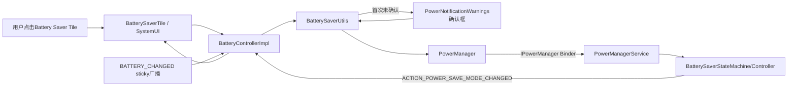
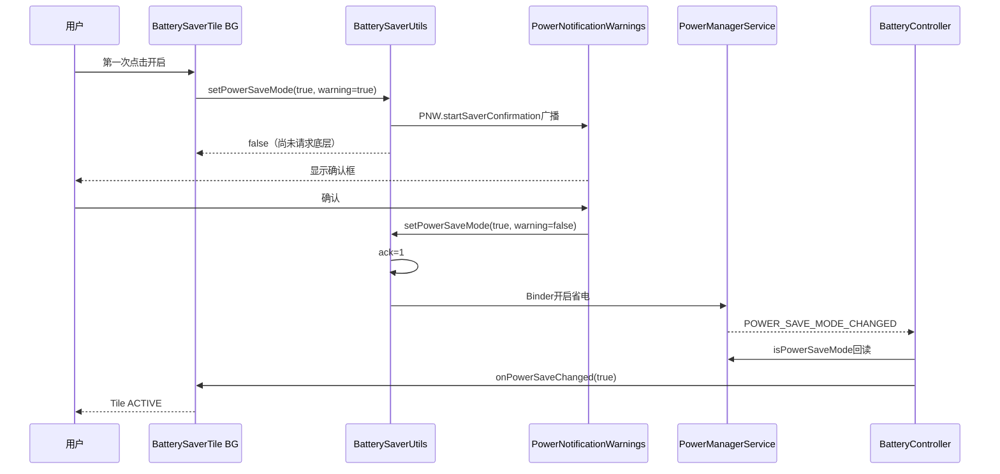
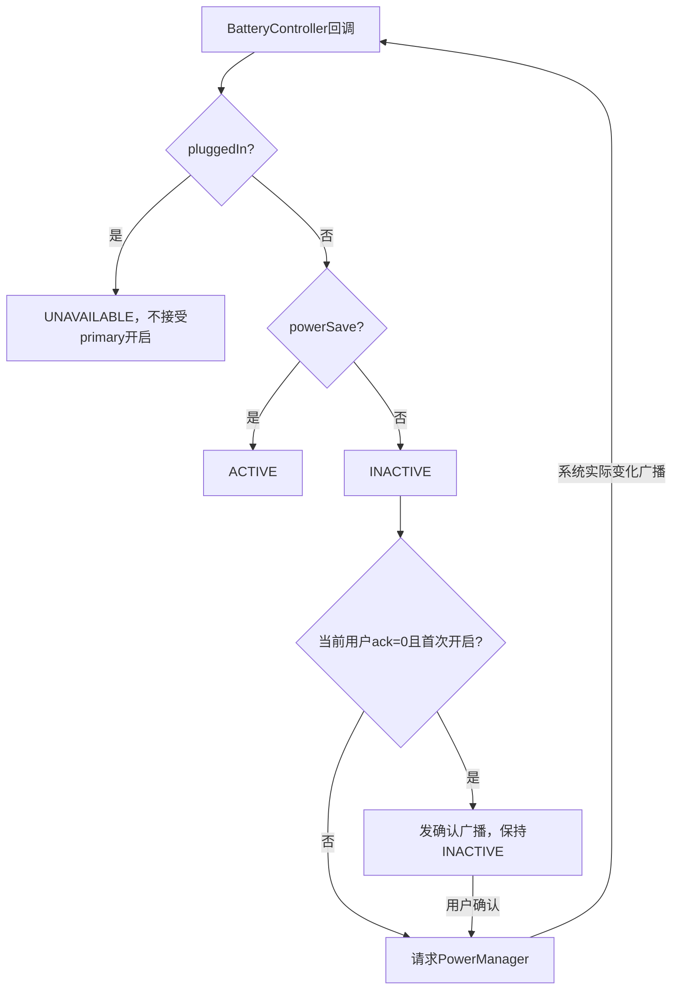

# 第 427 章 Android SystemUI Battery Saver Tile：电池状态、省电确认与估算回调

> 源码基线：Android 11 / API 30 / `android-11.0.0_r48`。本章仅在macOS上只读，不编译。核心文件：`BatterySaverTile.java`、`BatteryControllerImpl.java`、SettingsLib `BatterySaverUtils.java`、`PowerManagerService.java`、`BatterySaverStateMachine.java`与`Estimate.kt`。

## 1. 本章要解决什么问题

省电Tile为何插电就不可用？第一次点击为什么先弹确认而不是立即开启？PowerManager返回true究竟证明什么？BatteryController为何还维护电量、无线充电、AOD策略和剩余时间估算？本章逐层回答。

## 2. 先拆四个核心状态

电量level、是否插入电源plugged、是否处于充电状态charging、省电模式powerSave互不等价。Tile真正只以plugged决定可点击、以powerSave决定开关值；level和charging虽然缓存，却不参与State显示。

## 3. 省电模式不是“低电量事实”

Battery Saver是系统策略模式，可由用户、自动阈值或动态策略开启；电池20%不必已经开启，80%也可能手动开启。Tile ACTIVE只表示PowerManager报告省电模式已开。

## 4. 源码地图

Tile做交互和UI；BatteryController聚合sticky BATTERY_CHANGED与PowerManager广播；BatterySaverUtils负责首次确认和建议计数；PowerManagerService/BatterySaverStateMachine持有系统状态并向各服务分发策略。

## 5. 进程边界

Tile、BatteryController和PowerNotificationWarnings在SystemUI进程。PowerManager调用`IPowerManager`进入system_server；Battery状态由系统sticky广播进入SystemUI；SettingsProvider保存Global/Secure辅助状态。

## 6. 线程边界

QSTile State和click在共享BG Looper；BroadcastDispatcher默认将BatteryController receiver投主线程；剩余时间估算取数使用注入BG Handler，结果回主Handler；SecureSetting Observer使用Tile mHandler。

## 7. Tile与Controller的生命周期

构造时`mBatteryController.observe(getLifecycle(), this)`，当Tile至少有一个Panel listener时注册callback，离开时移除。BatteryController本身是Singleton并在Dagger provider中立即`init()`，与SystemUI进程同寿命。

## 8. SecureSetting为什么单独监听

Tile监听当前用户`LOW_POWER_WARNING_ACKNOWLEDGED`，该值不表示省电是否开启，而是用户是否看过首次说明。它只决定`showRippleEffect`，因此需要独立于设备级BatteryController更新。

## 9. 多用户组合

省电模式是设备全局；确认标志是per-user Secure。Tile从`host.getUserContext().getUserId()`初始化Setting，用户切换时只更换SecureSetting userId，BatteryController事实仍共享。

## 10. 总体结构图



## 11. BatteryController如何初始化

Dagger provider new出实现后主动调用`init()`。init注册BATTERY_CHANGED、POWER_SAVE_MODE_CHANGED和内部level test三种action，然后补取sticky电池Intent、读取PowerManager省电态并预取estimate。

## 12. 为什么还要主动取sticky Intent

BroadcastDispatcher注册是异步的，且不能保证本类立刻收到历史BATTERY_CHANGED。Controller用`context.registerReceiver(null, filter)`同步取得sticky快照；若此前异步回调已经到达，则`mHasReceivedBattery`防止重复处理补取结果。

## 13. 双初始化仍可能通知两次吗

存在竞态检查，但不是一个锁保护的原子协议：注册回调与sticky读取可能相邻到达。源码通过前后两次`!mHasReceivedBattery`尽量抑制补处理，后续真实广播仍可正常通知。

## 14. BATTERY_CHANGED为何适合作初值

它是受保护sticky广播，系统保存最近电池状态，新receiver可查询当前快照。普通应用不能任意伪造平台保护action；测试模式由受信SystemUI自己发dummy。

## 15. 电量百分比算法

`mLevel=(int)(100f*EXTRA_LEVEL/EXTRA_SCALE)`。正常scale为电池报告量程；缺失默认100。scale异常为0时浮点除法会产生Infinity并转换成极大int，代码没有clamp。

## 16. plugged的定义

`EXTRA_PLUGGED != 0`即true，覆盖AC、USB、wireless等来源。它表示连接电源，不保证系统正在向电池充电。

## 17. charging的定义

status是FULL或CHARGING即true。设备可能plugged但NOT_CHARGING，此时Tile仍不可用；也可能测试/异常广播产生charging与plugged不一致。

## 18. charged与charging

FULL单独保存为mCharged，同时被算入mCharging。BatteryController dump打印charged，但BatterySaverTile不消费它。

## 19. wirelessCharging

只有charging为true且plugged类型精确WIRELESS才true。它被Falsing等其他SystemUI组件使用，Tile本章仍不显示无线充电信息。

## 20. battery present与unknown

`EXTRA_PRESENT=false`映射为stateUnknown，变化时通知专用callback。BatteryMeterView和BatteryStateNotifier会消费；BatterySaverTile没有override该回调，所以缺电池设备不会因此自动UNAVAILABLE。

## 21. 回调初值何时回放

addCallback先无条件加入ArrayList；若尚未收到任何Battery快照就return。已有快照时，按顺序同步回放level/plugged/charging、powerSave和unknown。

## 22. addCallback没有去重

同一对象可被重复添加，remove只移除一个匹配项。Lifecycle通常配对正确，但Controller接口本身不保证set语义，重复注册会收到重复事件。

## 23. callback在锁内执行

fire方法持有`mChangeCallbacks`锁逐个调用外部callback，没有复制列表也没有异常隔离。listener若增删集合或抛异常，可能跳过后续、改变索引甚至让本轮中断。

## 24. Tile缓存了哪些字段

`mLevel`、`mPowerSave`、`mCharging`、`mPluggedIn`。level callback全部赋值后`refreshState(level)`；power callback赋值后`refreshState(null)`。

## 25. arg中的level被使用了吗

没有。handleUpdateState完全忽略arg，所以传level只用于触发刷新/日志历史，并不显示百分比。电量变化即使State字段不变，也会经历BG重算，copy后通常changed=false。

## 26. mCharging被使用了吗

Tile内只赋值、不读取。最终不可用判断看mPluggedIn而非mCharging；这避免“插电但暂未充电”时允许开启一个系统层通常拒绝的模式。

## 27. State优先级

plugged为true就STATE_UNAVAILABLE；否则powerSave为true则ACTIVE，否则INACTIVE。value始终等于mPowerSave，即便plugged与powerSave在过渡窗口同时为true。

## 28. UNAVAILABLE且value=true是否可能

可以。刚插电而省电广播尚未报告关闭时，State不可用但Boolean value仍true。辅助功能class在QSTileBaseView中会因UNAVAILABLE被清，不应把value单独当可操作开关。

## 29. 为什么插电禁用

PowerManagerService `setLowPowerModeInternal`在`mIsPowered`时直接返回false；StateMachine也有“enable && powered”拒绝。Tile提前用plugged做UI门，减少无效Binder请求。

## 30. Tile的门可能陈旧

handleClick检查稳定`getState().state`，不是现场问Controller。刚拔电但State未刷新时仍return；刚插电但State未更新时可能发开启请求，最终PowerManager返回false。

## 31. 点击如何计算目标

若State不是UNAVAILABLE，调用`setPowerSaveMode(!mPowerSave)`。目标来自callback缓存，不是`getState().value`也不是现场PowerManager读取；通常一致，但回调延迟时可能陈旧。

## 32. Controller为什么不直接调用PowerManager

它通过`BatterySaverUtils.setPowerSaveMode(context, target, true)`，加入首次确认、手动激活计数和自动省电建议等产品流程，而非只做底层开关。

## 33. BatterySaverUtils返回值被谁使用

工具返回boolean表示请求是否被允许/执行成功，但`BatteryControllerImpl.setPowerSaveMode`返回void并忽略它，Tile也没有结果。UI最终只能靠Power save changed广播收敛。

## 34. 第一次开启的判断

目标enable=true、needFirstTimeWarning=true且`LOW_POWER_WARNING_ACKNOWLEDGED==0`时，工具发送包定向SystemUI的确认广播并return false，不调用PowerManager。

## 35. 第一次点击发生了什么

只证明确认请求已发。Tile没有乐观ACTIVE或transient，保持INACTIVE；PowerNotificationWarnings收到action后显示SystemUIDialog。

## 36. 取消确认框

不写ack、不启用省电；下一次点击仍走确认。Tile ripple仍由SecureSetting读到0而保留。

## 37. 确认按钮的第二次请求

正按钮调用`setSaverMode(true, false)`，BatterySaverUtils在“无需首次警告”路径先把当前用户ack写1，再调用PowerManager。此时才真正请求开启。

## 38. ack写入早于成功

即使PowerManager因插电竞态等返回false，ack已经写1，下一次不会再显示首次确认。这是“已确认说明”而非“曾成功开启”的准确语义。

## 39. show-for-all-users与USER_CURRENT

确认Dialog设置showForAllUsers，但正按钮写`UserHandle.USER_CURRENT`。展示窗口范围和偏好归属是两件事；Tile的SecureSetting会在前台用户切换时跟随。

## 40. 关闭为何没有确认

目标false不会进入maybeShow确认，直接调用PowerManager。关闭也不增加手动activation count，不触发自动省电建议。

## 41. 手动激活计数

PowerManager成功返回true且enable时，Secure `LOW_POWER_MANUAL_ACTIVATION_COUNT`加1。默认第4至第8次之间可能提示用户配置自动省电。

## 42. 自动建议还有哪些门

当前自动trigger level必须为0，且`SUPPRESS_AUTO_BATTERY_SAVER_SUGGESTION`为0。start/end次数可由Global key-value参数覆盖，解析错误会wtf并用默认值。

## 43. 建议不是开启ACK

建议广播在PowerManager成功之后发送，但它只是引导配置schedule；实际省电状态仍由PowerManager广播与Controller回读决定。

## 44. BatterySaverUtils注释里的笔误

参数注释写“enable true to disable battery saver”，与代码明显相反，是文档笔误。阅读源码必须用分支和PowerManager调用核对，不能机械相信注释。

## 45. 权限边界

`PowerManager.setPowerSaveModeEnabled`要求DEVICE_POWER或POWER_SAVER；system_server再次检查。SystemUI/SettingsLib链拥有平台权限，普通应用复制调用不会获得控制权。

## 46. PowerManager返回true的含义

API文档说“set was allowed”。PowerManagerService在设备插电时返回false；未插电则调用StateMachine并返回true。true仍不等于每个受省电影响服务已完成调整。

## 47. StateMachine的二次门

`enableBatterySaverLocked`发现状态已相同就return；enable且mIsPowered也return。外层PowerManagerService已检查供电，但状态可随并发变化，因此内部仍防守。

## 48. 系统状态怎样保存

真实变化时写Global `LOW_POWER_MODE`，手动路径还按配置更新sticky active，然后调用system_server BatterySaverController应用策略并发送广播。

## 49. 关键首次确认源码

```java
if (enable && needFirstTimeWarning
        && maybeShowBatterySaverConfirmation(context, confirmationExtras)) {
    return false;
}
if (enable && !needFirstTimeWarning) {
    setBatterySaverConfirmationAcknowledged(context);
}
return context.getSystemService(PowerManager.class)
        .setPowerSaveModeEnabled(enable);
```

## 50. 这段源码最容易读错什么

首次开启返回false不是底层故障，而是“确认UI已请求”；ack与省电Global不是同一设置；PowerManager boolean没有上传给Tile；广播到来前Tile不主动取反。

## 51. Power save changed广播

system_server BatterySaverController在模式实际变化时向ALL用户发送registered-only `ACTION_POWER_SAVE_MODE_CHANGED`，不带最终boolean；receiver必须调用`PowerManager.isPowerSaveMode()`读取事实。

## 52. Controller为何回读PowerManager

`updatePowerSave()`调用`isPowerSaveMode`后`setPowerSave`，不信触发来源。自动阈值、手动设置、充电关闭等所有来源最终都汇合成同一事实读取。

## 53. 相同值被抑制

`setPowerSave`发现新值等于mPowerSave立即return，不更新AOD状态也不通知callbacks。这意味着AOD policy若独立改变但总powerSave boolean未变，本方法不会刷新mAodPowerSave。

## 54. AOD省电为何独立

总省电变化时额外查询`getPowerSaveState(ServiceType.AOD).batterySaverEnabled`。DozeMachine据此决定是否拒绝DOZE_AOD；BatterySaverTile不显示该细分策略。

## 55. 广播没有boolean是好事吗

receiver强制回读避免extra陈旧，但需要一次Binder/cache查询。PowerManager的isPowerSaveMode使用PropertyInvalidatedCache风格缓存，服务变化负责使缓存失效。

## 56. 启用后的策略传播

system_server更新BatterySaverPolicy、power hint、文件节点、plugins、广播以及LowPowerModeListeners。Tile收到广播只是众多消费者之一，不负责直接限制应用或硬件。

## 57. 没有transient与失败提示

Tile既不乐观改变，也不显示“正在开启”。PowerManager返回false或Binder异常时没有Toast；State保持旧值。第一次确认路径倒有Dialog解释，但不是通用错误UI。

## 58. 快速点击的窗口

第一次非首次请求成功后、广播回调前，mPowerSave仍旧；第二次点击可能重复请求同一目标。没有request id或click lock，StateMachine相同值门会吸收部分重复。

## 59. 点击到状态的过程

普通开启可能经历Tile→BatterySaverUtils→PowerManager Binder→StateMachine→BatterySaverController广播→BatteryController回读→Tile refresh；第一次还在前面插入确认广播和Dialog。

## 60. 首次开启时序图



## 61. State图标与文案

始终使用framework `ic_qs_battery_saver`，label为battery detail switch title，secondaryLabel固定空字符串。它不显示电量、预计时间、充电类型或失败原因。

## 62. 空字符串与null的区别

secondaryLabel设`""`而不是null，State equality按CharSequence内容判断时通常等效于“无可见文字”，但dump会呈现空值字段；代码没有解释为何不使用null。

## 63. showRippleEffect的反直觉规则

只有ack值为0时true；确认后设为false。QSTileBaseView在可点击且showRippleEffect时使用RippleDrawable作为背景，所以这里控制的是触摸波纹，不是“首次确认弹窗是否出现”的唯一门。

## 64. ack变化怎样刷新

SecureSetting ContentObserver运行在Tile Handler，任何值变化调用`handleRefreshState(null)`。观察到1后State copy发现showRippleEffect改变，View移除ripple背景。

## 65. SecureSetting监听初值

setListening(true)先读当前值保存mObservedValue，再注册URI，不主动调用handleValueChanged；紧随其后的QSTile首次refresh会在handleUpdateState直接getValue。

## 66. observedChange没有使用

匿名handleValueChanged忽略value与observedChange，总是刷新。即使收到同值通知也会重算；State copy再决定是否更新View。

## 67. 用户切换行为

handleUserSwitch只`mSetting.setUserId(newUserId)`，没有调用super的refresh。若Setting正在listening，它内部注销/重注册并读取新mObservedValue，但也不主动handleValueChanged。

## 68. 用户切换可能延迟ripple更新

因为setUserId重注册不回调且本override不`handleRefreshState`，新用户ack不同值时Tile可能要等下一次refresh/stale/Setting变化才更新showRippleEffect。这是r48测试只验证userId、不验证即时State的边界。

## 69. handleDestroy为何显式停Setting

super若有listener会调用handleSetListening(false)，但Tile之后仍显式`mSetting.setListening(false)`，依靠SecureSetting幂等防止重复注销，覆盖异常生命周期下可能残留的观察。

## 70. long click做什么

打开`Intent.ACTION_POWER_USAGE_SUMMARY`，是电池使用情况总览，而非专门的Battery Saver设置页。长按不受Tile STATE_UNAVAILABLE的handleClick return影响。

## 71. secondary click

未override，基类默认等同primary handleClick。BooleanState无dualTarget，普通UI通常没有独立secondary区域；程序化调用仍走相同插电门。

## 72. 没有admin restriction字段

BatterySaverTile不调用`checkIfRestrictionEnforcedByAdminOnly`，也不查询UserManager限制。底层权限与PowerManager供电门仍存在，但Tile没有管理员说明页。

## 73. isAvailable

未override，默认true。无物理电池/unknown状态也不隐藏Tile；具体产品可能通过默认spec或资源决定是否展示，但本类能力检查为空。

## 74. level test action

Controller支持`com.android.systemui.BATTERY_LEVEL_TEST`，进入后每200ms从0升到100再降到-1，通过dummy BATTERY_CHANGED广播驱动UI，用于演示/测试，不是现实电池事件。

## 75. testmode如何过滤真实广播

测试期间收到不含`testmode=true`的BATTERY_CHANGED直接return，防止真实电池更新打断动画。结束dummy带testmode=false，被接受并退出。

## 76. testmode恢复不完整

只保存level和plugged；dummy没有恢复status、charged、charging、wireless或unknown的原值，结束后这些字段可被默认extra覆盖，直到下一次真实BATTERY_CHANGED再收敛。

## 77. Demo Mode与level test不同

Demo enter会注销真实receiver，battery command直接改内部字段并fire；exit重注册并updatePowerSave。它没有像init那样显式`registerReceiver(null, ...)`补取，但BroadcastDispatcher底层重新注册BATTERY_CHANGED receiver时通常会获得sticky回放；恢复依赖该注册语义，而非这里的主动读取。

## 78. Demo battery命令更新什么

可改level、plugged、powersave、present；不改charging/charged/wireless。Tile只用plugged/powersave，因此演示足够，但其他Controller消费者可能看到组合不真实。

## 79. Demo powerSave不更新AOD

命令直接赋mPowerSave并fire，不调用setPowerSave，所以mAodPowerSave不重算。Demo只伪造主要UI事实，不保证所有派生策略一致。

## 80. 估算链属于谁

BatteryController还提供`getEstimatedTimeRemainingString`，主要被BatteryMeterView在estimate显示模式且不充电时调用。BatterySaverTile没有调用它，所以本章讲估算是理解共享Controller，不是Tile副标题功能。

## 81. 请求估算如何排队

completion在`mFetchCallbacks`锁内加入，然后`updateEstimateInBackground()`。已有fetch时直接return，当前批次完成后会通知列表内全部请求者。

## 82. 为什么要后台取数

EnhancedEstimates或cache读写可能包含Binder/Settings调用；接口注释保证completion在主线程。BG fetch后post `notifyEstimateFetchCallbacks`到main Handler。

## 83. 默认r48估算实现

`EnhancedEstimatesImpl.isHybridNotificationEnabled()`固定false，getEstimate返回unknown对象。后台请求会先把mEstimate=null，因hybrid关闭不update，因此默认completion得到null，BatteryMeterView回退百分比。

## 84. init时预取为何仍无帮助

init直接`updateEstimate()`可能缓存/取得unknown Estimate；第一次公开请求在BG又先清mEstimate，并因hybrid false不取，最终仍返回null。OEM可绑定不同EnhancedEstimates实现改变行为。

## 85. cache包含什么

Global保存estimateMillis、是否基于使用、average discharge和最后更新时间。它是设备级共享估算缓存，不是per-user Secure。

## 86. cache有效期注释与代码冲突

Estimate注释写“older than 2 minutes”，实际比较`Duration.ofMinutes(1)`，超过1分钟就返回null。文档应以执行代码的一分钟为准，并记录注释过时。

## 87. 未来时间戳边界

若last update在未来，Duration为负，不大于1分钟，于是被视为fresh。时钟回拨可能延长缓存有效期，代码没有绝对值或未来校验。

## 88. estimate格式化

非null Estimate用`PowerUtil.getBatteryRemainingShortStringFormatted`格式化estimateMillis。Controller不检查-1 unknown；默认hybrid false避免该路径，OEM实现需保证有效语义。

## 89. mFetchingEstimate的线程安全

boolean没有volatile/锁，虽然典型调用来自主线程，接口并未在实现入口强制。多线程调用理论上可能重复post fetch；mFetchCallbacks本身则有同步保护。

## 90. fetch完成前的窗口

BG线程先`mFetchingEstimate=false`再post主线程通知；该间隙新请求可启动第二次fetch并加入同一列表，第一次main通知可能提前通知并清掉它，随后第二fetch空跑。

## 91. completion在锁内执行

notify持`mFetchCallbacks`锁逐个调用completion，之后clear。某个completion抛RuntimeException会中断后续且跳过clear；回调若重入请求也要等待同一可重入锁/改变共享列表，缺少隔离。

## 92. updateEstimate持锁做慢工作

BG lambda在mFetchCallbacks锁内清estimate并可能调用`mEstimates.getEstimate()`和写Global cache。若BatteryMeterView主线程此时发起新请求，它会在“把completion加入列表”的synchronized处阻塞到取数结束，部分抵消了后台卸载的意义；锁粒度明显偏粗。

## 93. Controller dump包含什么

打印level、plugged、charging、charged、powerSave和stateUnknown。不打印wireless、AOD power save、hasReceived、demo/test、estimate/fetch状态、callbacks或最后广播时间。

## 94. Tile dump缺少什么

BooleanState能看active/unavailable/value/ripple，但没有mLevel、mCharging、ack userId、最后点击目标、BatterySaverUtils返回值与确认框状态。

## 95. 插电时系统自动关闭

BatterySaverStateMachine监听powered变化并按状态机政策退出full saver；Controller收到POWER_SAVE_MODE_CHANGED后mPowerSave=false。Tile的plugged UNAVAILABLE可能先到，省电false随后到。

## 96. 拔电后是否自动恢复

取决于sticky saver配置与StateMachine，而不是Tile。Tile只在plugged=false后恢复可点击并展示Controller事实，不自行记忆“插电前用户开启过”。

## 97. automatic saver与手动Tile

阈值/动态模式可从system_server自动开启，BatteryController同样回调Tile ACTIVE；Tile无法从BooleanState区分开启原因，需查BatterySaverStateMachine last reason/dump。

## 98. FULL与adaptive saver

PowerManager `isPowerSaveMode`可反映Controller综合enabled，而StateMachine手动入口主要控制full saver；BatterySaverTile不展示adaptive/full细分或每ServiceType政策。

## 99. 完整诊断证据

应同时取Battery sticky extras、Tile缓存、ack用户、确认广播/Dialog、PowerManager返回、StateMachine powered/last reason、LOW_POWER_MODE与changed广播，而不是只看一个绿色Tile。

## 100. Tile决策图



## 101. 常见误解一：Tile显示电量

错误。mLevel虽缓存，但State不读；电量百分比/估算属于BatteryMeterView等其他UI。

## 102. 常见误解二：charging决定不可用

错误。Tile看pluggedIn。插电但NOT_CHARGING仍UNAVAILABLE，charging字段在Tile中未使用。

## 103. 常见误解三：第一次点击已经开启

错误。未ack时只发确认广播并return false，确认正按钮才发真正PowerManager请求。

## 104. 常见误解四：ack证明成功开启过

错误。ack在第二次请求前写入，即使底层失败也保持1；它只证明用户确认过说明。

## 105. 常见误解五：估算是Tile副标题

错误。Tile secondary固定空；估算服务给BatteryMeterView，默认EnhancedEstimates又关闭hybrid而返回null回退。

## 106. 排查“点了只弹框”

这是首次正常流程。检查当前用户ack、PNW广播是否被DEVICE_POWER receiver收到、Dialog是否已存在、正按钮是否调用warning=false路径；不要把BatterySaverUtils首次false当故障。

## 107. 排查“插电后灰色”

确认BATTERY_CHANGED plugged extra而非charging；这是Tile政策与PowerManagerService供电拒绝一致。长按仍可进入电池使用总览。

## 108. 排查“确认后仍没开启”

看确认时是否已插电、PowerManager boolean、权限/Binder异常、StateMachine powered与状态相同门、POWER_SAVE_MODE_CHANGED、Controller回读。ack=1不能作为成功证据。

## 109. 排查“估算总是百分比”

确认BatteryMeterView是否MODE_ESTIMATE且未charging，再看EnhancedEstimates hybrid开关；AOSP默认false会给null。OEM启用时再查一分钟cache、estimate值与main callback。

## 110. 排查“切用户后波纹不对”

查看SecureSetting current user与两用户ack值；handleUserSwitch只重注册Setting、不主动refresh，等待下一刷新后才一定反映新用户showRippleEffect。

## 111. 证据强弱排序

点击证明意图；确认广播证明需要说明；ack证明已确认；PowerManager true证明请求允许；LOW_POWER_MODE/Controller回读证明模式；各LowPower listener状态证明具体策略应用；耗电变化并非即时可验证结果。

## 112. macOS只读练习一：推演四种电池组合

定位`onBatteryLevelChanged`与`handleUpdateState`，分别推演plugged/charging为00、10、11、01且powerSave true/false时的state/value。指出level与charging为何不会改变Tile文案。

## 113. macOS只读练习二：追首次确认

串联Tile click、BatteryController、BatterySaverUtils、PNW receiver、Dialog正按钮和PowerManager。标出第一次false、ack写入、真正Binder请求与最终广播，说明取消和失败各留下什么状态。

## 114. macOS只读练习三：审计用户切换

从host userContext初始化user10，执行Tile.userSwitch(11)，追SecureSetting setUserId的注销/注册和mObservedValue。证明userId更新，但寻找即时handleRefreshState路径并解释其缺失影响。

## 115. macOS只读练习四：推演估算并发

假设请求A正在BG fetch，完成时先把mFetchingEstimate=false；此刻请求B到达。画出A main notify、B第二fetch与共享callback列表顺序，说明为何B可能被A提前通知而B fetch空跑。

## 116. 练习参考结论

plugged而非charging控制UNAVAILABLE；首次点击仅请求确认；ack先于底层成功；切用户不会由override主动refresh；估算批次在fetch=false与main notify之间存在合并/空跑窗口。

## 117. 复读源码后的修正

复读后明确：mLevel/mCharging在Tile中是未消费缓存；value可在UNAVAILABLE时仍true；BatterySaverUtils首次false不是失败；ack在PowerManager请求前写；showRipple确认后反而关闭；userSwitch不调用super刷新；Controller callbacks在锁内且不去重；test不恢复全部派生态，demo退出依赖重新注册的sticky回放；AOD只在总powerSave变化时重算；Estimate注释两分钟而代码一分钟，BG慢取数持callback锁可反向卡主线程，默认hybrid关闭使公开结果null。

## 118. 本章没有覆盖什么

未展开BatteryStats统计、Health HAL、充电控制、完整BatterySaverPolicy各ServiceType、Doze/App Standby/Job限制以及PowerUI低电量通知全状态机。后续电源管理专题再深入system_server。

## 119. 阅读完成检查表

应能区分level/plugged/charging/powerSave；画出首次确认与正常切换；解释插电门、ack/ripple多用户语义、PowerManager返回边界；说明Controller callback锁、demo/test边界和estimate默认/缓存/并发问题。

## 120. 本章结论

Battery Saver Tile只是设备级省电策略的简洁开关：它以plugged预判系统拒绝，以PowerManager广播收敛真实模式，并借per-user ack插入首次教育流程。电量、充电、AOD、无线充电和估算都属于共享BatteryController的其他职责；只有把这些分开，才能正确解释“灰色”“弹框”“已确认但没开”和“估算为空”。
