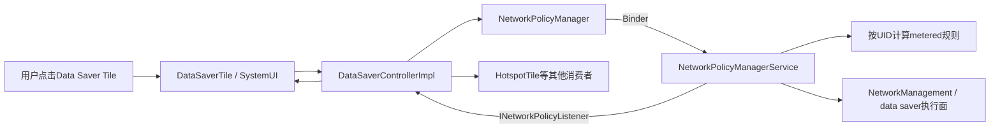
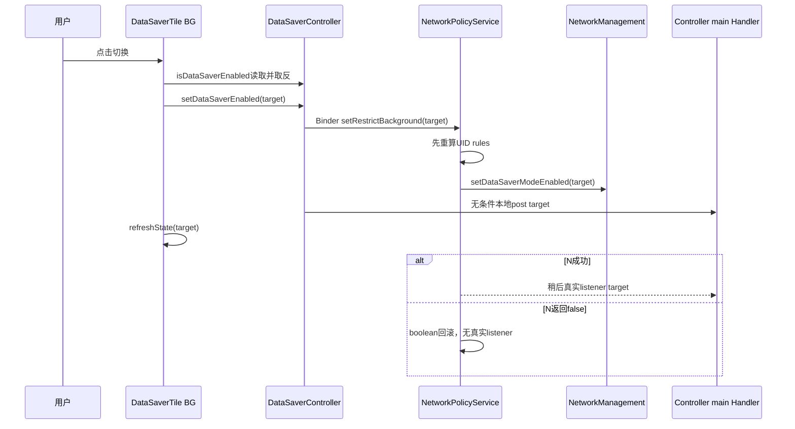
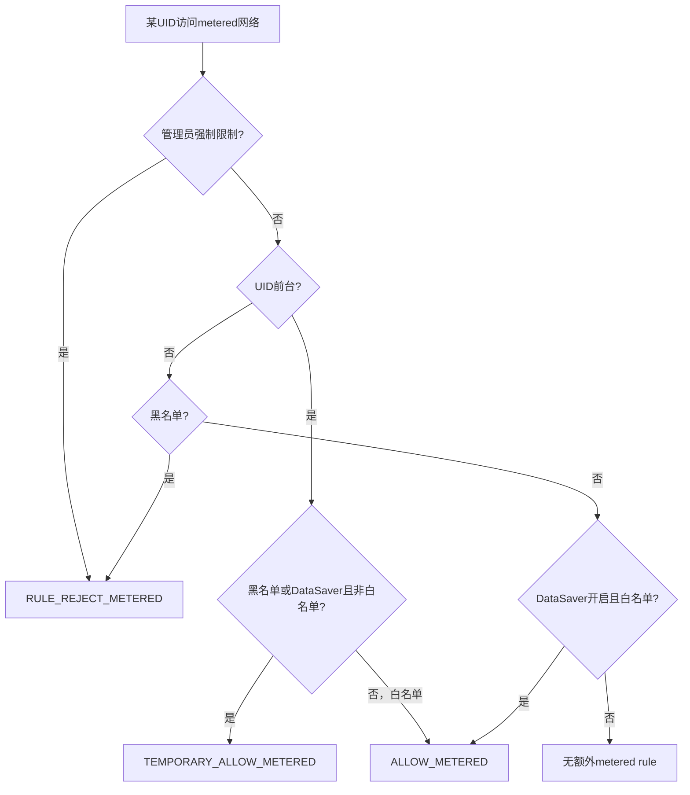

# 第 428 章 Android SystemUI Data Saver Tile：后台流量、NetworkPolicy与规则收敛

> 源码基线：Android 11 / API 30 / `android-11.0.0_r48`。本章在macOS上只读，不编译。核心文件：`DataSaverTile.java`、`DataSaverControllerImpl.java`、`NetworkPolicyManager.java`与`NetworkPolicyManagerService.java`。

## 1. 本章要解决什么问题

Data Saver到底限制什么？它和移动数据开关、省电模式有什么区别？首次提示、乐观State、Controller手动回调和NetworkPolicy真实结果如何收敛？服务失败时为什么可能出现短暂假成功？

## 2. Data Saver的准确含义

它是“限制后台应用使用计量网络”的全局政策，即`restrict background`。前台UID通常获得临时允许，白名单可后台使用，黑名单/管理员限制可更严格；它不等于关闭蜂窝radio或所有网络。

## 3. 与CellularTile的区别

第424章CellularTile控制默认数据订阅的用户数据开关；DataSaverTile控制NetworkPolicy的后台计量规则。移动数据可开且Data Saver也开，前台应用仍可能联网。

## 4. 与Battery Saver的关系

省电策略可要求NetworkPolicy临时开启restrict-background，但两者不是同一布尔。用户在省电期间手动改变Data Saver时，服务还记录是否应在退出省电后恢复原值。

## 5. 源码地图

Tile负责Dialog与BooleanState；DataSaverControllerImpl桥接NetworkPolicy listener；NetworkPolicyManager是Binder包装；system_server NetworkPolicyManagerService计算UID规则、调用网络管理并持久化政策。

## 6. 进程边界

Tile和Controller在SystemUI；`NetworkPolicyManager`经`INetworkPolicyManager`进入system_server；底层`mNetworkManager.setDataSaverModeEnabled`再协调网络管理/netd相关执行面。

## 7. 线程边界

Tile click/update在QSTile BG Looper；NetworkPolicy Binder listener到达后，Controller统一post主Handler；主线程listener调用Tile的`refreshState`，再投回Tile BG。

## 8. Controller从哪里来

NetworkControllerImpl构造时new一个DataSaverControllerImpl，并由`getDataSaverController()`共享给DataSaverTile、HotspotTile等；Dagger provider也返回同一NetworkController内部实例。

## 9. 为什么共享很重要

同一restrict-background变化会同时更新DataSaverTile和第425章HotspotTile。一个Controller避免重复服务listener，但任一listener异常也可能影响同一轮后续消费者。

## 10. 总体结构图



## 11. Tile为何依赖NetworkController

构造参数不是直接DataSaverController，而是NetworkController，然后取其共享Controller。这是r48依赖布局，不应按新版本独立注入写法臆测。

## 12. Lifecycle观察

`mDataSaverController.observe(getLifecycle(), this)`在Tile RESUMED时add callback，离开时remove。Tile本身没有额外listening字段或destroy清理。

## 13. addCallback的初值顺序

先在锁内把listener加入；第一个listener还向NetworkPolicyManager注册Binder listener；离锁后同步调用`listener.onDataSaverChanged(isDataSaverEnabled())`回放当前事实。

## 14. 初值在哪个线程

发生在addCallback调用线程，不统一到main Handler；后续服务变化则经mHandler post主线程。listener必须能承受初值与增量来自不同入口。

## 15. addCallback没有去重

同一listener可重复加入。remove只删除一个匹配项；重复项未完全移除时集合不空，底层listener继续注册且对象仍会重复接收。

## 16. callback在锁内执行

`handleRestrictBackgroundChanged`持mListeners锁逐项调用，没有快照和try/catch。listener增删或异常可导致跳过、索引变化或中断后续，并延长集合锁持有时间。

## 17. 第一/最后观察者协议

size从0到1时注册NetworkPolicy listener，1到0时注销。若注册调用抛异常，listener已经留在ArrayList；源码没有rollback。

## 18. isDataSaverEnabled做什么

同步调用`NetworkPolicyManager.getRestrictBackground()`，经Binder读取system_server的mRestrictBackground。它是当前事实查询，可能阻塞调用线程。

## 19. Tile首次State如何得到

Lifecycle addCallback的同步初值会`refreshState(boolean)`；QSTileImpl第一次listening也保证一次refresh。两个入口可能重复，但State copy过滤相同结果。

## 20. 主点击的两条路径

若当前mState.value为true，或SharedPreferences已记“提示框显示过”，立即toggle；否则只创建首次开启说明Dialog。

## 21. 为什么只在开启前提示

条件进入Dialog必须mState.value=false且Pref=false。Data Saver已开时点击是关闭，直接执行；关闭不需说明。

## 22. Dialog显示什么

SystemUIDialog使用framework标题、描述、开启按钮与取消按钮，showForAllUsers=true。正按钮调用toggleDataSaver，负按钮无额外逻辑。

## 23. Pref何时写true

`dialog.show()`之后立即`Prefs.putBoolean(..., true)`，不是在正按钮里。只要提示成功显示，无论用户确认、取消还是外部dismiss，下次都视为看过。

## 24. 与Battery Saver确认的区别

第427章Battery Saver的ack在用户按正按钮后写；Data Saver的Pref在Dialog显示后写。前者表达“已确认”，后者更接近“提示已展示”。

## 25. 取消后的下次点击

第一次取消时Data Saver保持关闭，但Pref已true；第二次点击会直接开启，不再弹框。这是r48明确行为，不是偏好写入bug推测。

## 26. Pref属于哪里

Prefs使用SystemUI Context `getSharedPreferences(packageName, MODE_PRIVATE)`，不是per-subId Secure设置。主SystemUI通常在user0，源码没有随前台用户切换该key。

## 27. showForAllUsers不改变Pref归属

Dialog可跨用户可见，但写Pref仍发生在创建它的SystemUI Context。窗口展示范围和存储身份不能混为一谈。

## 28. toggle先查询事实

目标不是简单`!mState.value`，而是`!mDataSaverController.isDataSaverEnabled()`。这能纠正Tile快照陈旧，但付出一次同步Binder查询。

## 29. 为什么仍直接改mState.value

代码把查询反值直接写入稳定State，再交给Controller，并`refreshState(mState.value)`。这是乐观更新，与第420章推荐的只写mTmpState模式不同。

## 30. 直接改稳定State的风险

若后续Controller调用抛RuntimeException，QSTile Handler虽捕获错误，mState.value已经改变却可能没有完整State copy/回调；历史View还持有同一State引用，形成难诊断的部分突变。

## 31. setDataSaverEnabled的Controller步骤

先调用NetworkPolicyManager.setRestrictBackground(enabled)；Binder正常返回后，再手动调用本地policyListener的`onRestrictBackgroundChanged(enabled)`，后者post main消息。

## 32. 手动回调为何存在

它让SystemUI不必等待服务异步listener分发即可反馈请求值。但它没有重新查询真实mRestrictBackground，本质是乐观请求回放。

## 33. RemoteException catch容易误读

try/catch只包本地调用`mPolicyListener.onRestrictBackgroundChanged`，因为AIDL签名声明throws。override实际上只post，不会主动抛；NetworkPolicyManager的Binder RemoteException已被包装成运行时异常，外层这里捕不到。

## 34. 服务回调为何会重复

真实切换成功时NetworkPolicyManagerService稍后分发同一boolean；Controller又已手动post一次，因此listener通常收到至少两次同值。Tile两次refresh，第二次多半changed=false。

## 35. 同值请求也有本地回调

服务发现目标等于mRestrictBackground会警告并return，不发服务变化消息；Controller仍手动post请求值，所以观察者依旧收到一次。

## 36. Tile自身还再refresh一次

toggle最后`refreshState(mState.value)`直接排Tile BG；Controller的main回调又会refresh。一次点击可能形成Tile乐观刷新、Controller本地刷新、服务真实刷新三层重复。

## 37. State如何重算

arg是Boolean时直接采用；否则同步查询Controller事实。乐观路径几乎都带boolean，所以不会立即验证服务结果。

## 38. State只有开和关

true→STATE_ACTIVE、false→STATE_INACTIVE。没有STATE_UNAVAILABLE、transient、admin restriction、网络类型或服务错误状态。

## 39. 图标策略

开启用`ic_data_saver`，关闭用`ic_data_saver_off`，不是同图标加Slash。label/contentDescription固定，Switch辅助class固定。

## 40. 没有secondaryLabel

Tile不说明“仅限制后台计量流量”、白名单数量或失败原因。理解语义依赖首次Dialog、长按设置页或外部文档。

## 41. long click

打开`Settings.ACTION_DATA_SAVER_SETTINGS`。设置页可管理不受限制的应用；长按不改变开关。

## 42. secondary click

未override，基类默认等同primary。普通Boolean Tile无独立dual target，但程序化secondary仍能触发Dialog/切换。

## 43. isAvailable

未override，默认true。即使设备无蜂窝radio，Data Saver仍可能作用于标记为metered的Wi-Fi等网络，所以不应按mobile feature隐藏。

## 44. 没有管理员UI门

Tile不调用`checkIfRestrictionEnforcedByAdminOnly`。NetworkPolicy服务依赖MANAGE_NETWORK_POLICY权限，UID规则还可包含admin restriction，但Tile不展示“由管理员限制”状态。

## 45. composeAnnouncement边界

实现开关播报字符串；第420章已说明r48基类缺少有效置下一次播报标志的入口，方法存在不保证普通点击触发。

## 46. NetworkPolicy权限

service的set/get都要求MANAGE_NETWORK_POLICY。SystemUI平台链拥有权限；普通应用不能直接全局切换，只能查询自身restrict-background status等公开语义。

## 47. 服务的相同值门

锁内发现目标等于当前mRestrictBackground直接return，不重算UID规则、不写policy、不发listener。这是实际事实层的去重。

## 48. 真正切换的第一步

先保存old值、修改mRestrictBackground，然后调用`updateRulesForRestrictBackgroundUL()`遍历/更新相关UID在计量网络上的规则。

## 49. 关键服务源码

```java
final boolean oldRestrictBackground = mRestrictBackground;
mRestrictBackground = restrictBackground;
updateRulesForRestrictBackgroundUL();
if (!mNetworkManager.setDataSaverModeEnabled(mRestrictBackground)) {
    mRestrictBackground = oldRestrictBackground;
    // TODO: restore the UID rules as well.
    return;
}
sendRestrictBackgroundChangedMsg();
```

## 50. 这段源码最重要的失败边界

底层返回false时全局boolean回滚，却没有重新计算已经按新值更新过的UID rules，源码TODO明确承认。服务也不发送restrict changed消息，可能短暂存在事实/执行规则不完全一致。

## 51. SystemUI为何会显示假成功

即使service内部底层返回false，它的Binder方法仍void正常返回；Controller不知道失败并手动回放requested；Tile又用Boolean arg。因此UI可ACTIVE，直到用户切换、显式refresh、其他真实回调或进程重建产生一次不带arg的事实查询。

## 52. 服务RemoteException分支

调用mNetworkManager抛RemoteException时catch注释称服务同在system_server并忽略；代码不会回滚boolean，随后仍发变化消息、记录/持久化。此路径语义与返回false不同。

## 53. 成功后做什么

合并发送restrict changed Handler消息、写统计日志；若由Battery Saver联动则记录用户是否手动改过；随后更新通知并持久化policy XML。

## 54. listener分发线程

NetworkPolicy service Handler处理MSG，遍历RemoteCallbackList调用`onRestrictBackgroundChanged`，然后向ALL用户发送registered-only公开变化广播。

## 55. Controller为何不用公开广播

它注册INetworkPolicyListener，直接收服务回调，时延更短且带boolean。普通应用广播不带全局值时需查询自身状态；SystemUI有管理权限可直接get。

## 56. Controller统一回主线程

无论服务Binder callback还是本地手动调用，policyListener都`mHandler.post`，因此共享listener增量统一在main执行。初值回放仍是例外。

## 57. UID规则如何考虑前台

若UID前台且本应被blacklist或Data Saver限制，会使用`RULE_TEMPORARY_ALLOW_METERED`，保证前台交互通常继续访问计量网络。

## 58. 白名单如何工作

后台UID在Data Saver开启且有`POLICY_ALLOW_METERED_BACKGROUND`时得到`RULE_ALLOW_METERED`；用户可在Data Saver设置页管理这类例外。

## 59. 黑名单与admin

明确blacklist的后台UID得到REJECT；admin restriction优先直接REJECT，即使其他条件。Data Saver全局开关不是唯一决定UID规则的输入。

## 60. 点击到规则时序图



## 61. Data Saver只管metered吗

核心规则MASK_METERED_NETWORKS只针对计量网络。非计量Wi-Fi通常不受restrict-background拒绝；网络是否metered由NetworkCapabilities/Policy等决定。

## 62. 前台定义并非“屏幕亮”

NetworkPolicy依据UID进程状态与capability判断是否在restrict-background意义上前台，不等同Activity肉眼可见的简单boolean。具体阈值在服务规则函数中维护。

## 63. 应用自身看到的三态

`getRestrictBackgroundByCaller`可返回DISABLED、ENABLED或WHITELISTED。全局Data Saver开启时，白名单应用看到WHITELISTED；Tile只显示全局boolean。

## 64. 黑名单可独立于全局开启

UID有`POLICY_REJECT_METERED_BACKGROUND`时，即使全局restrict-background关闭，自身仍可能被限制。DataSaverTile INACTIVE不证明所有应用都没有后台流量政策。

## 65. foreground temporary allow

受限制UID转前台时规则可从REJECT变TEMPORARY_ALLOW；返回后台再撤销。Tile不随每个UID前后台变化刷新，因为全局boolean未变。

## 66. 政策持久化

成功切换后服务`writePolicyAL()`把restrictBackground和UID政策写入policy文件。Tile Pref只保存提示是否展示，与真实政策存储完全分离。

## 67. 开机初值

服务从policy XML/默认Global读入restrict-background并建立规则；SystemUI Controller首个listener通过get同步读取，不依赖历史广播。

## 68. Power Saver如何影响Data Saver

NetworkPolicy作为LowPowerModeListener收到PowerSaveState；若battery saver要求限制后台且当前关闭，会保存之前值并内部开启restrict-background。

## 69. 退出省电如何恢复

若省电期间用户没有手动改变Data Saver，退出时恢复`mRestrictBackgroundBeforeBsm`；若用户改变过，则保留用户选择。这由`mRestrictBackgroundChangedInBsm`追踪。

## 70. Tile无法显示开启来源

无论用户点击、Power Saver联动、默认政策或管理接口开启，Controller回调都是同一个boolean；State没有reason字段。

## 71. Hotspot为何被影响

第425章HotspotTile观察同一Controller，Data Saver true就STATE_UNAVAILABLE并阻止新开热点。DataSaverTile的乐观假成功也可能让Hotspot短暂变灰。

## 72. Cellular数据不会因此关闭

NetworkPolicy设置规则而非Telephony `setDataEnabled(false)`。状态栏蜂窝和CellularTile仍可ACTIVE，前台流量仍可工作。

## 73. Background service一定断网吗

还要看网络是否metered、UID白名单/黑名单/admin、foreground state和具体socket/规则执行；Tile开启只证明全局政策意图。

## 74. Dialog线程

handleClick运行在QSTile BG Looper并直接new/show SystemUIDialog；该Looper有消息队列，可承载Window回调，但它不是通常的主线程Dialog路径。源码没有显式切main。

## 75. Dialog正按钮在哪执行

Button listener随Dialog所属ViewRoot/Looper执行，然后调用toggleDataSaver；该方法同步Binder查询与写操作可能阻塞对应UI线程。

## 76. 首次Pref写入失败

Prefs.putBoolean最终SharedPreferences apply/写入若异常或进程很快终止，提示可能再次出现；Tile不检查持久化结果。正常路径立即内存可见。

## 77. 快速重复Dialog

首次click在show后立刻写Pref，下一click将直接toggle而不是再弹。没有保存dialog引用防重复；在Pref写入前的极短重入或多个Tile实例理论上仍可能创建多个窗口。

## 78. mState直接突变与copy协议冲突

QSTileImpl设计是子类写mTmpState再copy到mState；DataSaverTile在toggle中直接写mState.value。这样State其他字段仍旧，直到refresh完成才统一。

## 79. callback arg为何掩盖事实

本地Controller回调和Tile refresh都携带目标Boolean，handleUpdateState不会调用get。因此即使服务事实已回滚，同值arg到达越多，假状态保持越久；必须再出现一次null refresh才会查询事实。

## 80. 为什么不能依赖stale自动纠正

QSTile的STALE只调用`setListening(mStaleListener,true)`。若Panel真实listener已存在，集合不是0→1，既不触发refresh，stale token还要等未来某次refresh才移除；服务失败又没有真实回调时，假State可能长期保留，而非在默认超时后自动回读。

## 81. 服务返回false后的规则残留

全局bool回旧但先前UID rules可能仍按目标更新；TODO称应restore却未做。后续UID状态变化或全量规则更新可能修复，当前方法没有立即处理。

## 82. 这是不是安全绕过

不能仅凭TODO下结论。具体网络执行面还因`setDataSaverModeEnabled`失败未切换，全局规则map与netd状态可能不同；应称“一致性缺口”，并用service/netd证据验证影响。

## 83. RemoteCallbackList的异常处理

service dispatch单listener RemoteException被忽略，不阻断其他远程listener；SystemUI Controller内部再对本地listeners无异常隔离，两层健壮性不同。

## 84. DataSaverController没有dump

实现不实现Dumpable，无法直接打印listener数量、最后请求、最后服务回调或pending main posts。要看NetworkPolicy dump与Tile State。

## 85. Tile dump能看到什么

BooleanState value/state/icon；看不到Pref、Dialog、实际Binder get、UID规则、白名单、服务失败和重复回调次数。

## 86. NetworkPolicy dump更强

可查看restrict background、UID policy/rules、metered interfaces、日志等；底层data saver执行状态还需NetworkManagement/netd证据。

## 87. 多用户政策

restrict-background是设备全局，但UID政策自然包含userId组成的UID；不同用户应用可有各自allow/reject。Tile的提示Pref却通常属于SystemUI user0。

## 88. 切用户时Tile怎么做

DataSaverTile未override userSwitch，基类只refresh全局事实；不更换Pref Context。状态相同，提示是否已展示也继续沿SystemUI Context共享记录。

## 89. 权限失败路径

MANAGE_NETWORK_POLICY不足会由service抛SecurityException，NetworkPolicyManager不吞；QSTile Handler catch并warn host。因为mState已先改，可能留下部分突变，且没有用户错误提示。

## 90. Binder死亡路径

RemoteException被NetworkPolicyManager rethrowFromSystemServer，Controller不会执行后面的本地post；toggle也到不了refreshState，但mState.value已经突变。下次事实刷新才恢复。

## 91. 服务成功不等于应用立即停止

服务需更新rules、network management与UID运行状态；已有连接/内核规则生效时点不是Tile callback定义的ACK。Tile ACTIVE表示政策boolean，不是抓包证明。

## 92. registered-only广播

全局变化广播只发给运行时注册receiver，不唤醒manifest静态receiver；应用通常通过ConnectivityManager状态或动态receiver响应。

## 93. listener与广播顺序

service Handler先逐个分发INetworkPolicyListener，再发送公开broadcast。SystemUI走listener，理论上早于普通动态广播，但各自executor仍可改变最终处理顺序。

## 94. 请求值与事实值

请求值来自用户取反；事实值是service mRestrictBackground；执行值还包括NetworkManagement data saver和per-UID rules。可靠诊断至少记录三层。

## 95. 关闭也可能失败

底层setDataSaverModeEnabled(false)返回false时service同样回滚为old true，但Controller手动回放false，Tile短暂INACTIVE；失败问题不是只影响开启。

## 96. 为什么没有确认关闭

关闭解除后台限制，产品认为无需教育Dialog。Prefs仅控制第一次开启说明，不是通用危险操作确认。

## 97. 设置页的例外管理

long click进入Data Saver Settings，可选择unrestricted data access。Tile只是总开关，不应扩展成应用列表详情。

## 98. 与App Standby/Doze的区别

Data Saver针对metered后台数据；App Standby、Doze还有定时器、jobs、wakelock和全网络限制规则。NetworkPolicy内部会把多个mask组合，Tile不代表全部省电网络政策。

## 99. 完整调试时间线

记录click前mState、Binder get、目标、service old/new、UID rules更新、NetworkManagement结果、Controller本地post、服务listener、Tile arg与最终null事实查询。

## 100. UID规则决策图



## 101. 常见误解一：开启就关闭移动数据

错误。Telephony数据开关不变；限制的是后台UID在metered网络上的规则。

## 102. 常见误解二：所有应用都断网

错误。前台临时允许、白名单允许、非计量网络通常不受此全局规则，admin/blacklist又可更严格。

## 103. 常见误解三：取消后还会再提示

错误。Dialog显示后Pref已true，取消只是不执行本次开启；下次直接toggle。

## 104. 常见误解四：Controller回调就是服务ACK

错误。Controller主动回放requested，底层失败也可能发；真实service listener和后续get才更强。

## 105. 常见误解五：Tile INACTIVE代表无UID限制

错误。单UID blacklist/admin规则、Doze/App Standby规则仍可存在。

## 106. 排查“开启后又跳回”

查NetworkManagement setDataSaver返回、service boolean是否回滚、是否无真实listener，以及哪条外部路径最终制造null refresh。Controller本地target先让UI亮不证明成功；有Panel listener时STALE也未必纠正。

## 107. 排查“取消后第二次直接开”

这是Pref写入时机设计。定位dialog.show后的Prefs.putBoolean即可证明；不是正按钮遗漏判断。

## 108. 排查“前台仍能联网”

检查UID foreground与TEMPORARY_ALLOW规则，这是Data Saver预期。返回后台后再观察metered rule变化。

## 109. 排查“热点突然灰了”

HotspotTile共享Controller，任何true回调包括乐观本地回调都会使其UNAVAILABLE。核对最终service事实，避免把短暂灰态当永久政策。

## 110. 排查“切用户提示状态不独立”

看SystemUI Context SharedPreferences而非应用用户UID policy；Tile没有随userSwitch换Pref实例，showForAllUsers也不提供per-user确认账。

## 111. 证据强弱排序

点击/Pref证明交互；Tile arg证明请求展示；Controller本地callback证明乐观通知；service get证明全局事实；UID rules证明政策计算；NetworkManagement/netd和实际流量证明执行结果。

## 112. macOS只读练习一：追首次取消

从handleClick创建Dialog开始，按`show → Pref=true → negative`顺序推演。再执行第二次click，证明为何直接toggle，并比较Battery Saver ack写入时机。

## 113. macOS只读练习二：推演底层失败

假设old=false、target=true、NetworkManagement返回false。写出service boolean、UID rules、是否发真实listener、Controller本地回调、Tile arg和下一次null查询的每一步结果。

## 114. macOS只读练习三：手算四类UID

在Data Saver true时分别推演前台非白名单、后台白名单、后台黑名单、admin restricted UID的metered rule；再将全局false，指出哪些单UID限制仍存在。

## 115. macOS只读练习四：追Battery Saver联动

阅读`updateRestrictBackgroundByLowPowerModeUL`，假设进入省电前Data Saver false，期间用户手动改开关，再退出省电。比较“用户未改”和“用户已改”两条恢复路径。

## 116. 练习参考结论

首次取消仍永久记录提示已展示；底层false造成boolean回滚、无真实listener但UI先乐观；前台/白名单/admin规则不同；省电退出只有在用户未改时恢复旧值。

## 117. 复读源码后的修正

复读后明确：Data Saver不是移动数据开关；Pref在show后而非确认后写；toggle现场get事实却直接突变mState；Controller手动回放请求值且成功时与服务回调重复；Binder异常catch位置不能兜底；服务先算UID rules再切执行面，返回false只回滚boolean且留TODO；Boolean arg掩盖事实且有Panel listener时STALE不自动纠正；Battery Saver可临时联动并有用户改动保护。

## 118. 本章没有覆盖什么

未完整展开netd/firewall/BPF、NetworkStats计费、metered判定、应用设置UI、VPN与多网络并发，也未逐项解释Doze/App Standby的MASK_ALL_NETWORKS规则。后续NetworkPolicy专题继续深入。

## 119. 阅读完成检查表

应能区分Data Saver、Cellular数据和Battery Saver；画出Tile三重乐观刷新与service真实回调；解释首次Pref、UID前台/白名单/黑名单/admin规则、底层失败一致性缺口、全局/每UID/执行面证据层级。

## 120. 本章结论

DataSaverTile是全局后台计量网络政策的简洁入口，而不是“断网按钮”。r48为了响应速度在Tile和Controller两层都乐观显示请求值，服务内部却可能回滚且留下规则一致性TODO；因此准确阅读必须把交互Pref、全局boolean、per-UID rules和底层执行面分开，并用事实查询完成最终收敛。
