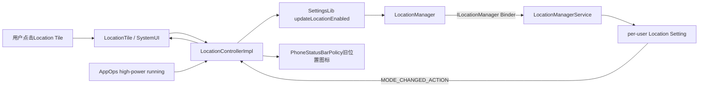
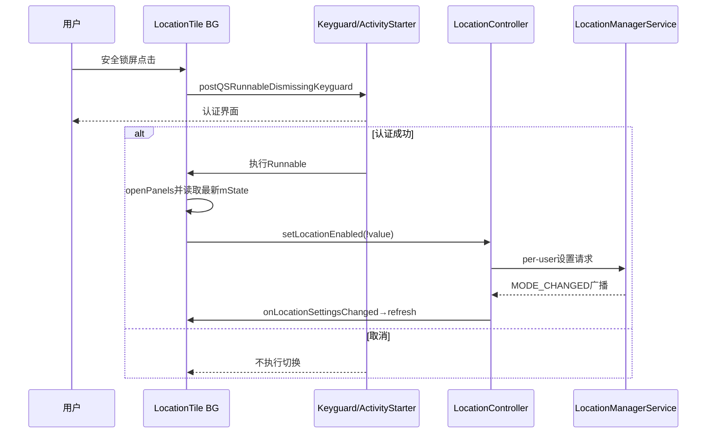
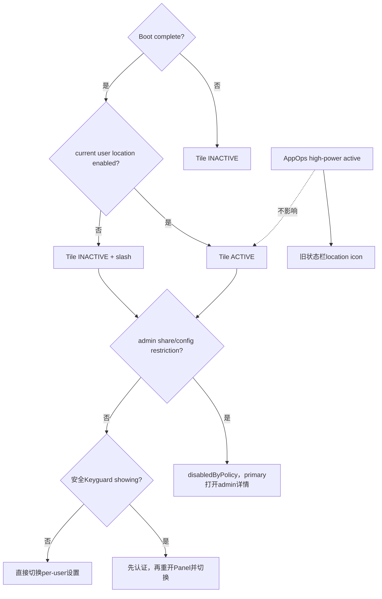

# 第 429 章 Android SystemUI Location Tile：位置开关、AppOps活跃请求与用户限制

> 源码基线：Android 11 / API 30 / `android-11.0.0_r48`。本章仅在macOS上只读，不编译。核心文件：`LocationTile.java`、`LocationControllerImpl.java`、SettingsLib `Utils.java`、`LocationManagerService.java`、`PhoneStatusBarPolicy.java`及用户限制代码。

## 1. 本章要解决什么问题

位置Tile的开关与“某应用正在定位”是什么关系？安全锁屏点击为何先解锁再重开面板？两个用户限制分别在哪里执行？Boot未完成、AppOps高功耗请求和新版隐私指示器又如何影响UI？

## 2. 先拆四类状态

位置总开关locationEnabled、是否有高功耗请求locationActive、状态栏是否显示位置图标、用户是否有权修改位置是四件事。LocationTile只显示第一项，并用policy字段表达第四项。

## 3. 开启位置不等于正在定位

总开关开启只允许符合权限的应用请求位置；没有应用请求时active仍false。反之关掉总开关后，历史AppOps事件也不应被当作当前有效定位结果。

## 4. 高功耗请求不等于所有位置访问

Controller只查询`OP_MONITOR_HIGH_POWER_LOCATION`的running状态，偏向GPS等高功耗请求。低功耗、缓存位置或新版PrivacyItemController追踪的其他位置AppOp不必进入该boolean。

## 5. 源码地图

LocationTile负责开关/锁屏；LocationController聚合LocationManager与AppOps；SettingsLib写changer来源并调用LocationManager；LocationManagerService更新per-user设置；PhoneStatusBarPolicy消费active用于旧图标。

## 6. 进程边界

Tile与Controller在SystemUI。LocationManager经`ILocationManager`进入system_server；AppOpsManager查询也跨系统服务；SettingsProvider保存per-user Secure位置模式和changer来源。

## 7. 线程边界

QSTile click/update在共享BG Looper；Location广播由BroadcastDispatcher指定background Looper；Controller H固定main Looper；设置与active事件先在BG查询，再用H通知main callbacks，Tile callback再post回BG。

## 8. Controller是Singleton

它在构造时永久注册ALL用户的两个广播，没有按callback数量动态注销。Tile、PhoneStatusBarPolicy等共享一份enabled/active聚合。

## 9. Tile观察两个Controller

同时观察LocationController和KeyguardStateController，复用同一个Callback对象。位置设置和锁屏showing变化都会refreshState，但State最终并不使用keyguard字段。

## 10. 总体结构图



## 11. Controller构造时注册什么

监听`HIGH_POWER_REQUEST_CHANGE_ACTION`和`MODE_CHANGED_ACTION`，receiver覆盖UserHandle.ALL，执行Handler是注入background Looper。

## 12. 为什么监听ALL用户

SystemUI主控制面需要获知当前用户模式和设备上活跃高功耗请求。但广播没有在onReceive里按user extra过滤，active聚合也未按当前用户过滤，需关注跨用户语义。

## 13. 服务对象何时取得

注册广播后才取AppOpsManager和StatusBarManager，再立即`updateActiveLocationRequests()`。Broadcast注册本身异步，通常不会在服务字段赋值前回调，但代码顺序仍依赖Dispatcher排队。

## 14. mStatusBarManager是否被使用

构造赋值后本类没有再引用。实际图标由PhoneStatusBarPolicy的IconController管理，这是r48遗留字段，不能据它推断Controller直接调StatusBarManager。

## 15. active初值如何得到

构造线程立即查询AppOps packages，更新mAreActiveLocationRequests；只有与默认false不同时才向main H发送ACTIVE_CHANGED。

## 16. 构造查询可能做Binder

`getPackagesForOps`是系统服务查询，构造中未转后台任务。具体注入构造线程若是main，可能承担一次同步Binder/遍历；后续广播查询在background receiver线程。

## 17. active字段的可见性

mAreActiveLocationRequests不是volatile；BG/构造线程写，main callback与其他调用线程读。Handler消息通常提供实践中的顺序传递，但getter本身没有显式同步。

## 18. addCallback消息顺序

向同一个main H先发ADD_CALLBACK，再发LOCATION_SETTINGS_CHANGED，因此队列顺序保证新callback先加入，再收到一次enabled初值。

## 19. addCallback不回放active

它只安排settings changed，不发送LOCATION_ACTIVE_CHANGED。新观察者加入时如果active早已true且之后不变，单靠接口不会立即收到onLocationActiveChanged。

## 20. PhoneStatusBarPolicy如何补偿

r48 PhoneStatusBarPolicy add callback后没有显式调用`updateLocationFromController`；若新PrivacyItemController的all indicators可用，位置图标走隐私列表。旧fallback路径在active早已true时存在漏初值风险。

## 21. callback列表会去重吗

不会。ADD直接ArrayList.add，重复观察者会重复收到；REMOVE只删一个匹配项。

## 22. 为什么用safeForeach

SystemUI Utils从列表末尾向前遍历，允许回调期间增删而不易跳过后面的原索引，并跳过null。测试专门验证callback自移除不崩溃。

## 23. remove其实是异步的

callback里调用remove只是向同一H排REMOVE消息，本轮safeForeach列表并未立刻改变；等当前消息完成后才删除。safeForeach仍为其他直接变化提供防护。

## 24. 异常隔离有没有

safeForeach不catch Consumer异常；一个callback抛RuntimeException仍会中断反向遍历。本轮后续callback可能漏通知。

## 25. enabled如何读取

取LocationManager并要求BootCompleteCache已完成，再调用`isLocationEnabledForUser(currentUser)`。Boot未完成时无条件false，避免服务尚未初始化的错误读取。

## 26. current user每次动态查询

enabled getter和setter都调用`ActivityManager.getCurrentUser()`，不固定在构造。用户切换后能读写前台用户，但一次Binder读取期间仍有切换竞态。

## 27. Boot门的UI影响

开机早期即使Secure位置值为on，Controller也返回false，Tile显示关闭。Controller没有注册BootComplete listener主动刷新；要靠后续MODE_CHANGED、重新观察、用户切换或其他refresh收敛。

## 28. stale也未必能补Boot门

第420/428章已确认真实Panel listener存在时STALE只加内部token而不触发refresh。若Tile在boot前显示false且没有位置模式事件，不能假设默认stale超时必然修复。

## 29. LocationManager读取有缓存

`isLocationEnabledForUser`优先用location-enabled cache，失效后才Binder；LocationManagerService setter会invalidate本地cache再写SettingsHelper。

## 30. setLocationEnabled第一道门

Controller只检查当前用户`DISALLOW_SHARE_LOCATION`，命中就return false，不写changer也不调用LocationManager。

## 31. Controller是否检查DISALLOW_CONFIG_LOCATION

不检查。该限制由Tile disabledByPolicy与SettingsProvider/Settings UI等其他层处理。直接调用Controller时，本地只主动挡share restriction。

## 32. SettingsLib先写什么

先把Secure `LOCATION_CHANGER`写成`LOCATION_CHANGER_QUICK_SETTINGS`，记录变更来源，再调用LocationManager开启/关闭指定用户。

## 33. changer写成功不等于模式成功

两步没有事务，也不检查第一步putInt返回；后续LocationManager抛异常时，changer可能已改变但location模式未变。

## 34. LocationManager权限

set for user要求WRITE_SECURE_SETTINGS，LocationManagerService还用handleIncomingUser校验跨用户身份，然后invalidate cache并交SettingsHelper写模式。

## 35. Controller返回true的边界

只要share restriction未命中且`updateLocationEnabled`正常返回，就return true。它没有等待MODE_CHANGED广播、provider实际启动或应用获得位置。

## 36. Tile使用返回值吗

不使用。点击调用setter后没有乐观刷新、transient或错误提示；最终依赖MODE_CHANGED回调重新查询。

## 37. 注释中的consent dialog

Controller注释称开启可能弹用户同意框，但当前SettingsLib实现只写changer并调用LocationManager，没有在这段链显式启动Dialog。是否出现额外UI取决于更下层/产品配置，不能从该注释直接保证。

## 38. MODE_CHANGED广播

位置模式变化时receiver只向main H发SETTINGS_CHANGED；H再现场调用isLocationEnabled，随后反向遍历callbacks。广播extra不作为事实。

## 39. HIGH_POWER变化广播

receiver在BG重新扫描AppOps；active boolean真的变化才发main消息。重复广播但running集合不变不会通知。

## 40. active查询范围

`getPackagesForOps({OP_MONITOR_HIGH_POWER_LOCATION})`返回匹配PackageOps，代码遍历所有package和entries，只要任一entry op正确且isRunning就true。

## 41. AppOps返回null

无请求数据时可返回null，Controller按false处理；package ops或entries为null也安全跳过。

## 42. 不记录哪个应用

一旦找到running立即return true，不保存package、uid、user或开始时间。状态栏旧图标只能表示“至少一个”，无法解释来源。

## 43. LocationTile消费active吗

不消费。内部Callback没有override onLocationActiveChanged；应用开始/停止高功耗定位不会改变Tile图标、label或State。

## 44. 谁消费active

PhoneStatusBarPolicy在新版all privacy indicators不可用时，用Controller active控制旧location slot；新版可用时则由PrivacyItemController统一相机/麦克风/位置图标。

## 45. 两套图标链为何不能混写

旧链只看high-power AppOp；新隐私链可能追更广的定位访问并带隐私语义。看到位置状态栏图标不应反推LocationController active一定true。

## 46. Tile State从哪里读

handleUpdateState忽略arg，每次同步`mController.isLocationEnabled()`。位置/Keyguard callback只是触发器，不携带boolean快照。

## 47. State只有active/inactive

enabled→ACTIVE，disabled→INACTIVE；没有boot中、正在切换、受基础限制或服务失败的UNAVAILABLE。管理员禁用用disabledByPolicy独立字段。

## 48. Slash和图标

始终使用同一`ic_location`，关闭时slash，开启时取消。它不显示高功耗请求、精确/大概位置或provider类型。

## 49. 关键点击源码

```java
if (mKeyguard.isMethodSecure() && mKeyguard.isShowing()) {
    mActivityStarter.postQSRunnableDismissingKeyguard(() -> {
        final boolean wasEnabled = mState.value;
        mHost.openPanels();
        mController.setLocationEnabled(!wasEnabled);
    });
    return;
}
final boolean wasEnabled = mState.value;
mController.setLocationEnabled(!wasEnabled);
```

## 50. 安全锁屏为何特殊

位置是敏感开关。secure method且Keyguard showing时，不直接改设置，而让ActivityStarter先处理解锁；Runnable获准执行后才切换。

## 51. 为什么重新openPanels

解锁流程可能让Shade/QS收起；Runnable先`mHost.openPanels()`恢复面板，再发切换。用户能回到刚才操作的上下文。

## 52. wasEnabled何时读取

安全锁屏路径在延迟Runnable执行时才读mState，而非点击当下捕获；等待认证期间若位置事实刷新，目标会基于较新的稳定State计算。

## 53. 延迟State仍可能陈旧

即使晚读，mState也只是最后一次Tile refresh，未现场调用Controller。外部刚改而MODE_CHANGED尚未处理时仍可能反向错误。

## 54. 解锁取消会怎样

postQSRunnable不会执行或不会获准继续，Controller不被调用，位置保持原值；Tile没有pending状态需要回滚。

## 55. Keyguard callback为何refresh

onKeyguardShowingChanged调用refreshState，但当前State计算没有读取Keyguard，通常字段不变。它可能是过去“锁屏隐藏Tile”实现留下的触发器。

## 56. 注释与实际隐藏行为

代码注释称workaround“不在锁屏顶部显示Location Tile”，还展示曾计划的`state.visible`表达式；实际没有赋visible，r48 QSTile State也不靠本段隐藏。Tile仍显示，只在点击时解锁。

## 57. 管理员限制检查顺序

先查`DISALLOW_SHARE_LOCATION`；只有未disabledByPolicy才查`DISALLOW_CONFIG_LOCATION`。因此两者同时存在时，admin详情优先归因于share限制。

## 58. admin-only与base restriction

QSTile helper仅当存在EnforcedAdmin且不是base user restriction时设置disabledByPolicy。base restriction不会显示某个管理员详情，但底层SettingsProvider/Controller限制仍可能拒绝。

## 59. primary点击的policy拦截

QSTileImpl CLICK消息先检查缓存disabledByPolicy；命中就打开admin支持详情，不进入Keyguard或setter流程。

## 60. 锁屏点击时序图



## 61. secondary click的policy差异

LocationTile未override secondary，基类默认调用handleClick；SECONDARY_CLICK分支不检查disabledByPolicy。普通Boolean Tile无独立dual target，但程序化secondary仍会走锁屏/Controller链。

## 62. long click的policy差异

长按打开`ACTION_LOCATION_SOURCE_SETTINGS`，也不受基类disabledByPolicy拦截。Settings页应再次执行限制检查，能查看不等于能修改。

## 63. Controller只挡share的后果

程序化secondary或其他直接调用者可能绕过Tile对config restriction的提前UI门；是否最终写入还取决于SettingsProvider调用身份与限制规则。应描述为“本地门不完整”，不能未经验证宣称一定绕过政策。

## 64. DISALLOW_SHARE_LOCATION生效

UserRestrictionsUtils在新值true时把该用户LOCATION_MODE强制写OFF；解除限制不会自动恢复原on，因为系统不知道限制前用户意图。

## 65. DISALLOW_CONFIG_LOCATION语义

禁止用户配置位置，而非必然强制位置off；UserRestrictionsUtils相关代码会撤销global kill-switch干扰，SettingsProvider对非system UID写LOCATION_MODE进行限制。

## 66. 关闭操作是否允许

SettingsProvider限制逻辑对LOCATION_MODE_OFF在share restriction分支允许，以便安全地关闭；config restriction又对非system UID更严格。不同restriction和callingUid必须分开读。

## 67. Tile为何查两种限制

一个表达不允许共享/使用位置，另一个表达不允许配置位置；无论哪种admin-only限制，用户都不应从QS改变总开关。

## 68. 用户切换

QSTileImpl默认userSwitch触发refresh；Controller getter动态读current user。Location Controller的广播覆盖ALL用户，但settings changed callback没有userId，收到其他用户变化也会重新读当前用户并可能产生无字段更新。

## 69. ALL用户MODE_CHANGED的噪声

后台用户改变模式也会发SETTINGS_CHANGED，H读取前台用户值并通知所有callbacks，即便没变。LocationTile再refresh，State copy通常过滤。

## 70. active是否按用户隔离

AppOps查询没有user过滤，只要返回列表任一running就true。旧状态栏location图标可能代表设备上其他用户/进程的高功耗请求；新版PrivacyItemController另有用户过滤策略。

## 71. BootCompleteCache的语义

这是一次性门，Controller只查询`isBootComplete()`；它不在本类add listener。因此“服务未完全初始化返回false”的保护也带来缺少主动回放问题。

## 72. LocationManager为null吗

getter直接取得系统服务并调用，没有null防护。正常SystemUI设备应有Location服务；异常测试/产品裁剪会NPE并由QSTile Handler捕获。

## 73. AppOpsManager为null吗

构造后立即调用查询，没有null防护。服务缺失会在Controller创建时失败，而不是把active视为false。

## 74. StatusBarManager遗留字段

它同样没有null使用风险，因为仅赋值不解引用；但增加了无效依赖和阅读噪声，复读时应标记为未消费。

## 75. setter异常路径

LocationManager RemoteException会rethrowFromSystemServer，Tile Handler最外层catch并warn host；Tile没有Toast/回滚，因为它本来也未乐观改State。

## 76. setter false路径

share restriction命中时Controller返回false，Tile忽略；如果admin/base呈现未提前挡住，用户只看到开关保持原样，没有错误说明。

## 77. changer来源的用途

LOCATION_CHANGER_QUICK_SETTINGS告诉设置/系统这是QS发起，而不是应用或Settings页面；它不是授权、审计成功或最终mode字段。

## 78. changer可能先行残留

因为先写changer后调LocationManager，第二步失败时来源字段仍可变。调试不能以changer值证明位置开关已经成功。

## 79. 没有transient的体验

点击到MODE_CHANGED期间保持旧ACTIVE/INACTIVE，服务变更通常很快；锁屏认证阶段也没有Tile pending动画。

## 80. 快速连点

两次点击若mState尚未刷新，会重复发同方向目标；若第一回调已到则第二次反向。没有request id、防抖或排队取消。

## 81. callback enabled参数被Tile忽略

`onLocationSettingsChanged(boolean enabled)`只调用`refreshState()`，handleUpdate再查Controller；这抵抗参数陈旧，但多一次Binder/cache读取。

## 82. active callback与Tile完全独立

active高频变化不刷新Tile，因为Callback没override；这减少无意义State重算。Keyguard变化反而会触发通常无字段变化的refresh。

## 83. PrivacyItemController切换条件

PhoneStatusBarPolicy只有`getAllIndicatorsAvailable()==false`才消费legacy active callback；为true时location slot由隐私items统一设置。运行时配置决定哪条证据有效。

## 84. 旧图标只显示boolean

`updateLocationFromController`只set location slot visibility true/false，不更新图标内容、应用名或精度。

## 85. active从true到false

HIGH_POWER广播触发全量AppOps扫描；最后一个running消失才boolean变化并通知。Controller不维护引用计数，依赖AppOps事实查询。

## 86. AppOps扫描复杂度

遍历所有匹配packages和entries，找到一个running提前返回。无活跃请求时需扫描完整列表；每次高功耗变化都重新查询而非增量维护。

## 87. 广播丢失怎么办

active没有周期性刷新或add callback初值；如果HIGH_POWER change丢失，mAreActive可能陈旧，直到下一次变化或进程重建。enabled则每次callback通知现场重读。

## 88. Controller没有destroy

Singleton永久注册BroadcastDispatcher receiver；没有注销方法。与SystemUI进程同寿命是设计前提。

## 89. Controller没有dump

接口/实现未实现Dumpable，不能直接看active、callbacks、Boot门、current user或最后AppOps扫描。需结合Tile dump、PhoneStatusBarPolicy、AppOps/Location服务。

## 90. Tile dump能证明什么

BooleanState显示value/state/slash/disabledByPolicy；不包含active、Keyguard secure/showing、setter结果、current user、BootComplete或restriction具体key。

## 91. Location服务dump

可看per-user location enabled、providers、requests等；AppOps dump可看monitor high power running。两者分别证明设置允许与实际请求，不可互相替代。

## 92. 精确/大概位置不在本Tile

Android 11的LocationTile是总开关，不展示应用级fine/coarse授权、一次性权限或后台权限。那些属于PermissionController/AppOps/Settings。

## 93. 开关on也可能无provider结果

provider硬件、权限、信号、用户profile和请求参数仍可能导致无定位结果。ACTIVE只是LocationManager总模式。

## 94. 开关off也不抹除历史数据

关闭阻止常规位置提供，但不等于清除缓存位置、应用数据库或服务日志。Tile不承担隐私数据删除。

## 95. 状态栏图标不是权限清单

旧图标只反映running high-power；新隐私图标也反映当前/近期隐私访问政策。没有图标不证明应用从未有位置权限。

## 96. current user竞态

setter先取currentUserId并检查restriction，再以该id写；用户在两步间切换时操作仍作用于旧捕获用户，这是必要的一致性快照，但可能不是Runnable执行结束时前台用户。

## 97. 安全锁屏加剧用户竞态

认证等待后Runnable才调用Controller，Controller此时重新取current user；如果认证流程切换用户，目标用户按执行时身份决定，而mState可能来自前一用户最后刷新。

## 98. 管理员归因的优先级

State只能保存一个mEnforcedAdmin；share命中后不再查config。管理员支持页展示第一条限制来源，不是全部限制集合。

## 99. 完整诊断时间线

至少记录点击/解锁、mState、current user、两个restriction、changer写、LocationManager setter、MODE_CHANGED、Boot门、Location enabled回读、AppOps active和隐私图标选择分支。

## 100. 状态决策图



## 101. 常见误解一：Tile亮就是正在定位

错误。它只表示总开关on；active请求是独立AppOps查询，Tile不消费。

## 102. 常见误解二：位置图标一定来自Controller

错误。all privacy indicators可用时PhoneStatusBarPolicy使用PrivacyItemController；legacy Controller仅为fallback。

## 103. 常见误解三：锁屏时Tile被隐藏

错误。注释描述旧workaround，但实际没有visible赋值；Tile仍可见，点击走解锁Runnable。

## 104. 常见误解四：Controller检查两个restriction

错误。Controller setter只主动查DISALLOW_SHARE_LOCATION；Tile State查share与config两项。

## 105. 常见误解五：set返回true就是定位成功

错误。只表示请求链未被share门拒绝/抛异常，不等待模式广播、provider或位置结果。

## 106. 排查“点击要求解锁”

确认`isMethodSecure && isShowing`，这是敏感开关设计；认证成功后看Runnable、openPanels和setter，取消则不会改。

## 107. 排查“开机后显示关闭”

查BootCompleteCache与Location实际值；Controller没有Boot listener，有真实Panel listener时STALE也不保证刷新。寻找MODE_CHANGED、userSwitch或显式refresh证据。

## 108. 排查“状态栏位置图标不显示”

先判断PrivacyItemController allIndicators分支；legacy时查active初值是否在callback加入前已true、HIGH_POWER广播、AppOps running与PhoneStatusBarPolicy callback。

## 109. 排查“管理员限制但还能进入设置”

primary disabledByPolicy只拦直接点击；long打开Settings，secondary API也无基类policy门。最终修改仍应由设置/Provider限制，入口可见不等于允许更改。

## 110. 排查“其他用户变化导致刷新”

receiver注册ALL，任何用户MODE_CHANGED都发main通知；H最后读当前前台用户。重复refresh且State不变属于预期噪声。

## 111. 证据强弱排序

点击证明意图；changer证明来源标记；setter返回证明请求未在本地失败；Location enabled回读证明总开关；AppOps running证明高功耗请求；provider回调/实际坐标才证明定位结果。

## 112. macOS只读练习一：比较enabled与active

分别沿LocationTile.handleUpdateState和Controller.areActiveHighPowerLocationRequests追踪，画出总开关on/off × AppOps active true/false四格，写出Tile State和legacy状态栏图标。

## 113. macOS只读练习二：推演安全锁屏

从CLICK policy门开始，依次推演secure showing、认证成功/取消、Runnable读取mState、openPanels、current user、setter和MODE_CHANGED。指出哪些值在点击时捕获、哪些在延迟执行时读取。

## 114. macOS只读练习三：审计双restriction

列出share/config各自在Tile、Controller、UserRestrictionsUtils和SettingsProvider的检查。构造admin-only、base restriction和programmatic secondary三种路径，避免直接宣称底层一定绕过。

## 115. macOS只读练习四：推演Boot初值遗漏

假设Tile在boot complete前加入listener且真实Secure为on，随后BootCache变true但没有MODE_CHANGED。追add callback、initial false、缺少Boot listener和STALE token，找出哪些外部事件才能纠正。

## 116. 练习参考结论

enabled与active可任意组合；锁屏目标在认证后按当时mState/current user决定；Controller本地只挡share；Boot门由false转true本身不回调，需其他刷新收敛。

## 117. 复读源码后的修正

复读后明确：active只看running high-power AppOp且不进Tile；add callback只回放enabled不回放active；旧状态栏链可能漏active初值；StatusBarManager字段未使用；Boot门无listener且STALE不保证修复；锁屏隐藏仅剩注释；安全Runnable晚读mState并openPanels；setter先写changer且只查share；Tile再查config；enabled回调参数被忽略并重新查询事实。

## 118. 本章没有覆盖什么

未展开GNSS provider、FusedLocationProvider、权限授予、approximate/precise、后台位置、位置隐私历史和Emergency location。后续LocationManagerService与Privacy专题再深入。

## 119. 阅读完成检查表

应能区分enabled/active/icon/policy；画出锁屏认证切换链；解释current user、Boot门、双restriction、changer非事务、AppOps扫描、legacy/privacy双图标路径和callback初值缺口。

## 120. 本章结论

LocationTile只是per-user位置总开关的安全入口，不是定位活动指示器。r48用Keyguard认证和两层限制保护改变，用LocationManager事实回读收敛；高功耗AppOps则服务旧状态栏图标。把总设置、实际请求、隐私图标与控制权限分开，才能准确理解“Tile亮但无图标”“有图标但谁在用”以及锁屏/多用户边界。
