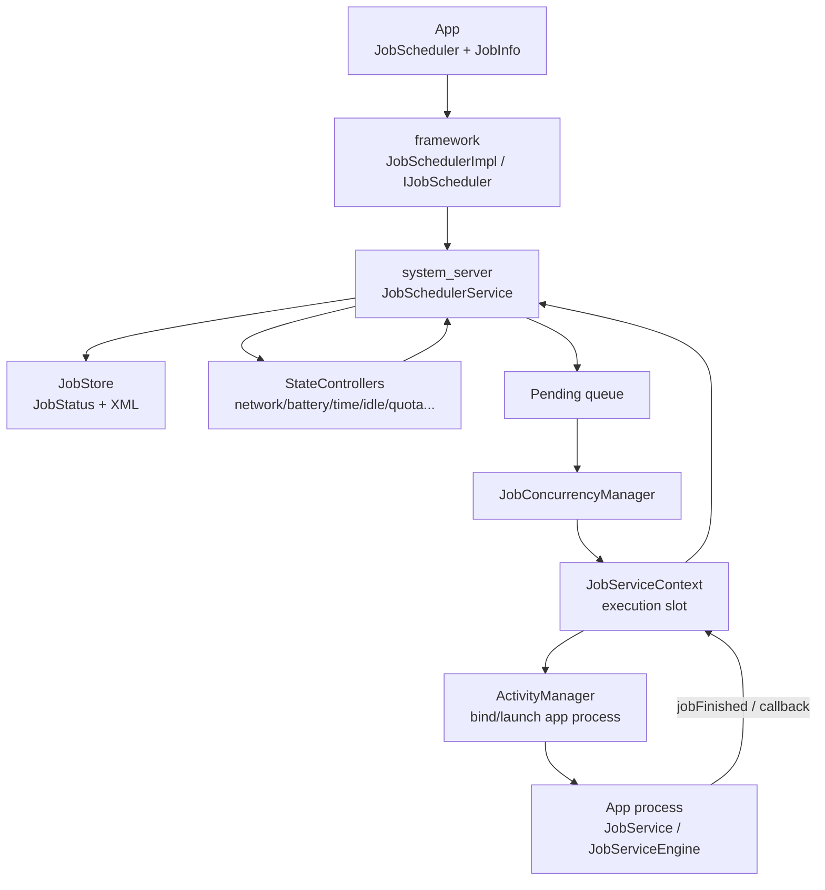
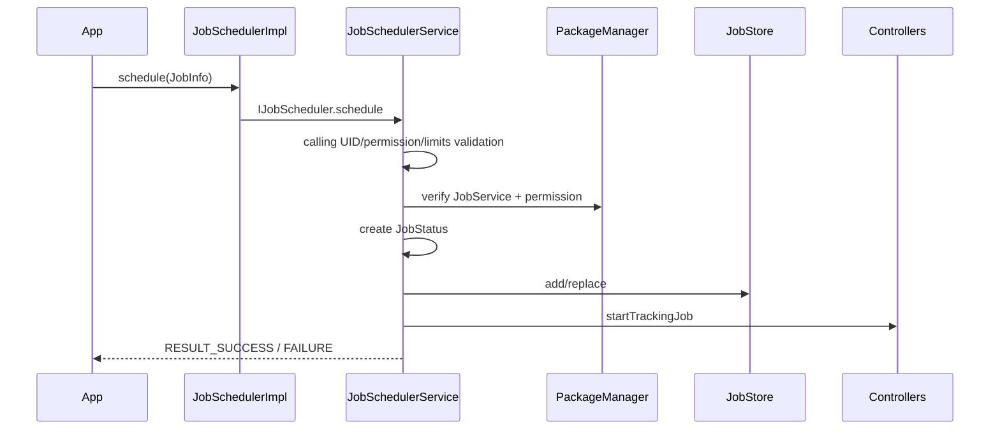
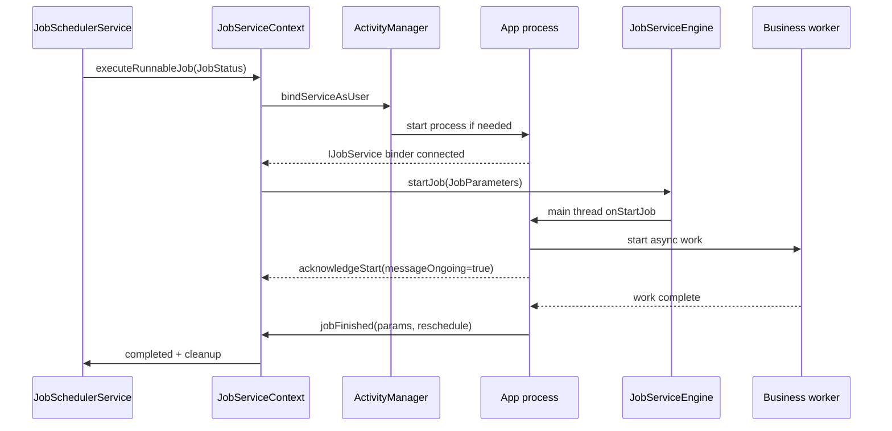

# 43 Android JobScheduler、JobStore 与约束控制器

> 源码版本：Android 11 / API 30 / `android-11.0.0_r48`  
> 学习方式：macOS 只读源码，不要求编译  
> 前置章节：[17 Service](./17-Service与ContentProvider跨进程组件.md)、[25 电源管理](./25-Android电源管理WakeLock与Doze.md)、[42 网络策略](./42-Android网络策略NetworkPolicyManagerDataSaver与UID防火墙.md)

JobScheduler 不是“到点立刻执行”的定时器。App 提交的是带约束和时间窗口的工作描述；系统保存 JobStatus，持续跟踪网络、充电、空闲、存储、后台限制与配额，在资源和并发允许时才绑定应用 JobService 执行。

---

## 1. 四个状态不要混淆

```text
scheduled/stored
 → constraints satisfied and ready
 → pending/selected for execution
 → running in JobService
```

`schedule()` 返回成功只证明系统接受并保存任务，不表示约束已满足，更不表示 `onStartJob()` 已调用。

---

## 2. 总体架构



控制器只报告约束变化；最终 ready 判断、排序、并发选择和执行由服务协调。

---

## 3. Android 11 核心源码

```text
frameworks/base/apex/jobscheduler/framework/java/android/app/job/JobScheduler.java
frameworks/base/apex/jobscheduler/framework/java/android/app/JobSchedulerImpl.java
frameworks/base/apex/jobscheduler/framework/java/android/app/job/JobInfo.java
frameworks/base/apex/jobscheduler/framework/java/android/app/job/JobParameters.java
frameworks/base/apex/jobscheduler/framework/java/android/app/job/JobService.java
frameworks/base/apex/jobscheduler/framework/java/android/app/job/JobServiceEngine.java
frameworks/base/apex/jobscheduler/framework/java/android/app/job/IJobScheduler.aidl
frameworks/base/apex/jobscheduler/framework/java/android/app/job/IJobService.aidl
frameworks/base/apex/jobscheduler/service/java/com/android/server/job/JobSchedulerService.java
frameworks/base/apex/jobscheduler/service/java/com/android/server/job/JobStore.java
frameworks/base/apex/jobscheduler/service/java/com/android/server/job/JobServiceContext.java
frameworks/base/apex/jobscheduler/service/java/com/android/server/job/JobConcurrencyManager.java
frameworks/base/apex/jobscheduler/service/java/com/android/server/job/controllers/JobStatus.java
frameworks/base/apex/jobscheduler/service/java/com/android/server/job/controllers/StateController.java
frameworks/base/apex/jobscheduler/service/java/com/android/server/job/controllers/ConnectivityController.java
frameworks/base/apex/jobscheduler/service/java/com/android/server/job/controllers/BatteryController.java
frameworks/base/apex/jobscheduler/service/java/com/android/server/job/controllers/TimeController.java
frameworks/base/apex/jobscheduler/service/java/com/android/server/job/controllers/IdleController.java
frameworks/base/apex/jobscheduler/service/java/com/android/server/job/controllers/StorageController.java
frameworks/base/apex/jobscheduler/service/java/com/android/server/job/controllers/ContentObserverController.java
frameworks/base/apex/jobscheduler/service/java/com/android/server/job/controllers/QuotaController.java
frameworks/base/apex/jobscheduler/service/java/com/android/server/job/controllers/BackgroundJobsController.java
frameworks/base/apex/jobscheduler/service/java/com/android/server/job/controllers/DeviceIdleJobsController.java
```

本分支代码位于 jobscheduler APEX 目录；旧文章路径可能不同。

---

## 4. 进程与线程

- App schedule 与 JobService：应用进程。
- JobSchedulerService/Store/controllers/contexts：`system_server`。
- JobStore 持久化：异步 I/O 线程/任务。
- 状态协调：服务 handler + 全局 lock。
- JobService callbacks：Binder 到应用，再由 JobServiceEngine 投递主线程。

Job 业务默认不是自动放在后台线程；`onStartJob()` 在应用主线程回调，耗时工作仍需自行异步化。

---

## 5. JobInfo 是声明

```java
JobInfo info = new JobInfo.Builder(JOB_ID,
        new ComponentName(context, SyncJobService.class))
        .setRequiredNetworkType(JobInfo.NETWORK_TYPE_UNMETERED)
        .setRequiresCharging(true)
        .setPersisted(true)
        .build();
jobScheduler.schedule(info);
```

JobInfo 描述目标 Service、约束、时限、周期、backoff、extras 等，不携带任意可执行 lambda。

---

## 6. Manifest 服务声明

```xml
<service
    android:name=".SyncJobService"
    android:permission="android.permission.BIND_JOB_SERVICE"
    android:exported="false" />
```

`JobSchedulerService.enforceValidJobRequest()` 真正校验的是：Service 存在、它的 application UID 等于调度 UID，并且 Service 宣言的 permission 正是 signature 级 `BIND_JOB_SERVICE`。`android:exported` 不是这个校验方法的条件；因此不应把 `exported="true"` 记成 JobService 的固定必需配置。Framework 以 system UID 持有该 signature 权限发起绑定，普通 App 无法借此随意调用 Service。

---

## 7. jobId 的作用域

JobScheduler 查找和替换任务的核心键是 calling UID + jobId。普通情况下不同 App 的 UID 不同，因此可使用相同 jobId；同一 UID 再 schedule 同 jobId 通常更新/替换旧 JobInfo。

jobId 不是全设备全局唯一，也不是一次 execution attempt 的唯一 ID。若多个 package 共享同一 UID，它们也共享这个 jobId 编号空间；这正是只写“每个包唯一”容易遗漏的边界。

---

## 8. schedule 主链



Binder 返回前系统通常完成逻辑入队，但持久 XML 写盘可能异步。

---

## 9. 安全校验

服务检查：

- calling UID 与 package/component。
- JobService 是否存在且要求 BIND_JOB_SERVICE。
- persisted job 权限（`RECEIVE_BOOT_COMPLETED`）。
- clip data/URI grant、extras 大小和参数合法性。
- 每 UID job 数量限制。
- system-only API 权限。

客户端 Builder 校验不能替代 system_server 校验。

---

## 10. JobStatus

JobStatus 是运行态包装，组合：

- 原始 JobInfo。
- calling/source UID、user、package。
- earliest/latest runtime。
- required/satisfied constraint bitsets。
- failure count、last run、standby bucket。
- enqueue time、work items、network。
- tracking controller 信息。

JobInfo 相对静态；JobStatus 会随系统状态变化。

---

## 11. JobStore

JobStore 保存当前 jobs，支持按 UID/jobId 查询、添加替换、删除和开机恢复。persisted jobs 写到系统 XML；非持久 job 只在内存。

持久化 JobInfo 不等于持久化应用运行中的线程、socket 或中间对象。重启后是重新调度一次工作。

---

## 12. 写盘与崩溃窗口

为了避免每次 schedule 阻塞 Binder，JobStore 可批量/异步写 XML。系统崩溃发生在逻辑接受与落盘之间时存在窗口。

JobScheduler 提供“最终可执行”调度，不应被当成严格事务消息队列；业务需要幂等和自身数据持久化。

---

## 13. persisted job

`setPersisted(true)` 使任务在设备重启后恢复，要求 App 声明 `RECEIVE_BOOT_COMPLETED`。它不会保证：

- 重启后立即执行。
- 原时间点精确保留。
- transient extras/URI grant 全都可持久化。
- App 数据已准备好。

恢复后仍要等约束与配额。

---

## 14. 约束位图

JobStatus 用 required/satisfied bitsets 高效判断。概念上：

```text
ready = requiredConstraints ⊆ satisfiedConstraints
        && component/user/package allowed
        && not already running
        && quota/background/device-idle policy allows
```

约束满足是必要条件，不总是充分条件。

---

## 15. StateController 模式

每类 controller：

1. 跟踪对该约束感兴趣的 JobStatus。
2. 订阅相应系统状态。
3. 状态变化时更新 satisfied bit。
4. 通知 JobSchedulerService 重新评估。

Controller 通常不直接绑定 JobService。

---

## 16. ConnectivityController

跟踪 JobInfo 网络要求与可用 Network：

- required network type/capabilities。
- validated/metered/not-roaming 等。
- UID 网络访问是否被 policy 阻断。
- estimated transfer bytes 与拥塞/时限策略。

“Wi-Fi 图标亮”不足以证明 Job 的 connectivity constraint 满足。

---

## 17. 网络类型

Android 11 常见：ANY、UNMETERED、NOT_ROAMING、CELLULAR、METERED，或更通用 `setRequiredNetwork(NetworkRequest)`。

网络 requirement 描述最低条件；系统可选一张满足它的 Network，并通过 JobParameters 提供。App 不应假定永远是当前默认网络。

---

## 18. BatteryController

跟踪 charging、battery not low。充电约束通常使用系统稳定充电状态，而不是 USB 瞬时插入事件；not-low 也有阈值和广播状态。

电量 90% 但未充电，不满足 requiresCharging；接电一瞬间也可能尚未进入稳定状态。

---

## 19. StorageController

跟踪 storage-not-low。当系统存储压力解除时更新约束。它不是检查 App 自己某目录是否还有足够空间，也不替业务预留文件容量。

运行期间磁盘仍可能写满，Job 必须处理 I/O failure。

---

## 20. IdleController

`setRequiresDeviceIdle(true)` 适合维护型任务，要求设备进入 JobScheduler 所定义 idle 条件。它与 Doze device idle 有关联但不能简单等同于“屏幕关闭”。

亮屏、动作、充电和系统配置都会影响 idle transition。

---

## 21. DeviceIdleJobsController

处理设备 idle 模式对普通 job 的全局限制、白名单和前台例外。一个 Job 没声明 requiresDeviceIdle，也可能因 Doze 被推迟。

“要求 idle”是正向约束；“设备 idle 时普通 job 被限制”是全局策略，方向不同。

---

## 22. TimeController

跟踪 earliest runtime（delay）和 latest runtime（deadline）。delay 满足只表示最早时间已到，仍需其他约束；deadline 到达在部分语义下可覆盖普通约束促使执行，但不是所有隐式策略都被无条件绕过。

JobScheduler 使用 elapsed realtime 避免用户改墙上时钟打乱相对时限。

---

## 23. minimum latency

`setMinimumLatency(10min)` 表示十分钟之前不要运行，不表示十分钟整运行。系统可能在十分钟后结合约束、批处理、配额和槽位选择更晚时刻。

精确定时应评估 AlarmManager，但其也受省电和权限策略。

---

## 24. override deadline

deadline 是最晚期望时间，帮助避免约束永远不满足。Android 版本对 deadline 与周期 job 组合有限制。

deadline 到达仍不能突破组件禁用、用户停止、包冻结、权限、安全和某些系统级限制。

---

## 25. ContentObserverController

`addTriggerContentUri()` 让内容变化触发 Job，controller 注册 ContentObserver，聚合 changed authorities/URIs，并用 update/max delay 防止每次变更立即启动。

触发只标记约束满足；任务仍需其他约束和调度选择。

---

## 26. BackgroundJobsController

根据 UID active、app start mode、后台限制、用户状态等判断 Job 是否允许。App 被 force-stop、restricted 或 user 未启动时，即便声明约束全满足也可能不能执行。

这是隐式约束，JobInfo Builder 中看不到对应开关。

---

## 27. QuotaController

按 App Standby bucket、执行历史、计时 session 等限制后台 Job 资源。bucket 越不活跃，通常可用执行次数/时长越少、窗口越严格。

quota 不是一次 Job 的网络流量 quota，而是调度执行资源政策。

---

## 28. Standby bucket

常见 bucket：ACTIVE、WORKING_SET、FREQUENT、RARE、RESTRICTED（版本相关）。用户互动、通知、系统使用等可改变 bucket。

同一个 JobInfo 在不同 bucket 的实际运行频率不同。

---

## 29. expedited job 版本提醒

现代 Android 有 expedited jobs，但 Android 11/API 30 的 JobScheduler 语义与后续版本不同。阅读此源码不要把 Android 12+ 的 `setExpedited()`、quota 和用户发起 job 规则倒灌进来。

版本边界是源码学习的重要部分。

---

## 30. 周期任务

`setPeriodic(interval, flex)` 表示在每周期 flex 窗口内择机运行，不是每隔固定毫秒唤醒一次。系统有最小 interval/flex 限制并可批处理。

一次执行过长、设备关机和约束不满足会让实际时间漂移。

---

## 31. 一次性与周期重调度

一次性 Job 成功完成通常从 Store 移除；周期 Job 完成后计算下个周期 JobStatus。失败 reschedule 与周期下一轮是两种不同时间计算。

不要在周期 Job 内再无条件 schedule 相同 jobId，可能造成难懂的替换语义。

---

## 32. ready 判断

服务收到 controller change 后不会盲目运行所有 Job。它检查：

- required constraints。
- deadline/override。
- user/package/component 可用。
- source UID 状态。
- quota/background restriction。
- 是否 pending/running。
- backup/force-stop 等系统状态。

ready 是动态计算，不是 JobStatus 的永久标签。

---

## 33. pending queue

ready jobs 被加入 pending queue，按 enqueue/priority/standby 等策略排序。pending 仍不等于 running，因为执行 context 数量有限，而且并发策略会为前台/后台工作分配槽位。

队列顺序不是纯 FIFO。

---

## 34. JobConcurrencyManager

它查看 active contexts 和 pending jobs，决定：

- 哪些 Job 占用空槽。
- 前台/后台最大并发。
- 是否抢占低优先级 Job。
- 内存压力/设备状态下的并发限制。
- work type 分配。

约束全满足但长期 pending，可能是并发/优先级问题。

---

## 35. JobServiceContext

每个 context 管一次 execution lifecycle：

- bind JobService。
- 等待 service connected。
- 发送 startJob。
- 等待 acknowledgement。
- 运行超时监督。
- stop/finish callback。
- unbind、wakelock 和 cleanup。

JobStatus 描述任务；JobServiceContext 描述一次运行尝试。

---

## 36. 执行时序



如果 `onStartJob()` 同步完成，应返回 false；返回 true 表示仍在异步执行，之后必须 `jobFinished()`。

---

## 37. onStartJob 返回值

```java
@Override
public boolean onStartJob(JobParameters params) {
    executor.execute(() -> {
        doWork();
        jobFinished(params, false);
    });
    return true;
}
```

- false：回调返回时工作已完成。
- true：仍在执行，系统保持此次 Job active。

true 不是“执行成功”，false 也不是“执行失败”。

---

## 38. JobService 主线程

JobServiceEngine 将 start/stop 消息投递到应用 main looper。`onStartJob()` 内直接做网络/数据库大任务会阻塞主线程并可能 ANR/超时。

业务线程结束后调用 jobFinished；要正确处理并发可见性和取消。

---

## 39. JobParameters

包含 jobId、extras/transient extras、clip data、triggered URIs/authorities、network、stop reason（版本相关）、work queue API 等。

JobParameters 绑定本次 execution attempt；不要跨下一次运行长期缓存它。

---

## 40. JobWorkItem

`enqueue(job, work)` 可把多个 work item 放入同一 Job。JobService 用 dequeueWork/completeWork 消费，适合批量串行工作。

只有正确 `completeWork()` 才表示该 item 已完成；进程死亡时未完成项可重新交付，因此业务必须幂等。

---

## 41. onStopJob

系统在约束丢失、超时、抢占、取消等场景请求停止。App 应尽快取消异步工作、释放资源。

返回值：

- true：希望系统按 backoff 重试。
- false：不需要因本次停止重试。

它不是“是否已停止”的回答；无论返回什么都应停止当前工作。

---

## 42. stop 与 finish 竞态

worker 完成准备调用 jobFinished 时，系统可能已调用 onStopJob。应用需用 attempt token/原子状态避免：

- stop 后继续写业务结果。
- 对过期 JobParameters 调 jobFinished。
- 同一 attempt 完成两次。

取消 Future 不保证线程立即停止，业务循环要响应 interruption/cancellation。

---

## 43. 执行超时

JobServiceContext 对 bind、start acknowledgement、running、stop acknowledgement 等阶段设监督时限。超时可停止 Job、记录错误并影响重试。

具体时长是版本/配置实现细节，不应硬编码进 App 逻辑。

---

## 44. WakeLock

更精确地说，`JobServiceContext` 在 `onServiceConnected()` 中创建并获取 non-reference-counted `PARTIAL_WAKE_LOCK`，在最终 `unbindService()`/清理时释放。因此 bind 请求已发出但 Service 还未 connected 的窗口，不能简化为“从刚开始 bind 就已经由这把 Job wakelock 覆盖”。Service 连接后的 start/run/stop 回调期间 CPU 有这把锁保障；App 仍不应假定任意后台线程在 `jobFinished()` 或清理后继续被保持。

一旦 finish/stop，业务必须已结束或自行采用合规机制。

---

## 45. Backoff

失败重试可设 linear 或 exponential backoff：

```text
linear:      base, 2×base, 3×base...
exponential: base, 2×base, 4×base...
```

系统有最小/最大限制，并可能结合其他约束。backoff 到点只是 earliest runtime，不保证立即执行。

---

## 46. jobFinished(reschedule)

`jobFinished(params, true)` 表示这次未完成，希望重新调度；false 表示这次完成，不因失败重试。周期 Job 无论如何还有后续周期语义。

不要用 `true` 实现无限快速轮询；系统 backoff/quota 会约束，业务也应区分可重试和永久错误。

---

## 47. 失败重调度

服务根据 failure count、backoff policy 和当前 elapsed realtime 创建/更新下次 JobStatus。重调度保留必要约束，但执行 attempt 状态、network 和临时满足位需重新计算。

App 业务进度应存数据库，不要依赖 JobStatus 保存业务中间对象。

---

## 48. 约束运行中丢失

例如 Job 要求 unmetered network，运行中 Wi-Fi 断开：ConnectivityController 更新，服务可能调用 stop。App 必须停止或切换到安全中断点，不能认为开始后约束永久保证。

是否立即停止和 grace 行为依约束/版本策略，以当前源码为准。

---

## 49. App 更新/force-stop/卸载

- force-stop：取消/阻止包的 Job，直到用户再次显式启动等条件。
- 卸载：清除 UID/package jobs。
- component disabled：不能绑定执行。
- package update：可能重新校验/保留 persisted jobs，依广播和实现。

JobStore 中有记录不代表 component 永远有效。

---

## 50. 用户与多用户

JobStatus 记录 source/calling UID 和 user。只有相应 user 启动且 package 可用时才执行；用户停止/删除会清理或暂停任务。

同一 package 在个人和工作资料中是不同 UID、不同 Job 空间。

---

## 51. 任务幂等

系统可能因进程死亡、超时、网络中断重新执行；App也可能在完成后、回执前崩溃。业务应设计：

- 唯一业务 operation ID。
- 事务提交。
- 已完成标记。
- 可重复上传/下载或服务端幂等 key。
- work item ACK 在数据提交之后。

JobScheduler 提供至少一次风格风险，而非 exactly-once 保证。

---

## 52. 与 AlarmManager 区别

| JobScheduler | AlarmManager |
|---|---|
| 约束、批处理、后台工作 | 时间事件/唤醒 |
| 系统择机执行 | 到达时间窗口触发 |
| JobService 生命周期 | PendingIntent/listener |
| quota/standby 强关联 | exact alarm 权限/Doze 策略 |

两者都不是无限制精确定时后台执行器。

---

## 53. 与 WorkManager

WorkManager 是 Jetpack 持久工作抽象，在适用 API 上可使用 JobScheduler，并增加链式任务、数据库、观察等能力。读 WorkManager 日志时最终仍可能落到 JobScheduler jobId。

但 WorkManager 的 retry/result/unique work 语义由其自身数据库补充，不能等同 JobScheduler 原生语义。

---

## 54. 与前台服务

Job 适合可推迟、受约束、有限时后台工作；用户可感知且需立即持续运行的任务可能使用前台服务。Android 版本对后台启动 FGS 也有限制。

不要用 Job 无限续命，也不要用 FGS 绕过配额。

---

## 55. 典型时间线

| 时间 | 事件 | 尚不能证明 |
|---|---|---|
| 08:00 | schedule 返回 success | 即将运行 |
| 08:05 | 网络约束满足 | 充电/配额满足 |
| 08:20 | 所有约束 ready | 已获得 context 槽位 |
| 08:21 | 加入 pending | JobService 已绑定 |
| 08:22 | onStartJob 返回 true | 工作已成功 |
| 08:24 | jobFinished(false) | 业务是否真正幂等提交，需 App 保证 |

---

## 56. “任务一直不执行”分层

| 层 | 检查 |
|---|---|
| 入队 | schedule result、jobId、owner UID、数量限制 |
| component | manifest、BIND_JOB_SERVICE、enabled、user/package |
| 显式约束 | network/charging/idle/storage/time/content |
| 隐式策略 | standby bucket、quota、Doze、background restriction |
| 队列 | ready/pending、priority、并发槽位 |
| 绑定 | process start、service connect、start ack、超时 |

---

## 57. “执行后重复”

检查 jobFinished 是否调用、进程是否在业务提交后回执前死亡、是否返回 reschedule=true、onStopJob 是否 true、周期/WorkItem 是否重复、业务是否缺幂等 key。

重复不是自动等于 Framework 调度 bug。

---

## 58. “只在充电时也不执行”

requiresCharging 只是一个约束。继续检查网络、idle、storage、minimum latency、quota、component 与并发。USB 插入也要确认 BatteryController 已判定 charging。

---

## 59. “onStartJob 后任务卡住”

检查是否在主线程阻塞、async worker 是否启动、异常是否吞掉、是否忘记 jobFinished、约束丢失后是否响应 stop、JobServiceContext 是否超时。

返回 true 后系统在等明确完成协议。

---

## 60. dumpsys 与 shell

```bash
adb shell dumpsys jobscheduler
adb shell cmd jobscheduler help
adb shell cmd jobscheduler get-job-state <package> <jobId>
adb shell dumpsys deviceidle
adb shell am get-standby-bucket <package>
```

force-run 会改变正常约束/调度语义，只适合受控实验。本课程在 macOS 只读阶段先学习 dump 字段。

---

## 61. dumpsys 关键字段

- registered jobs / JobStatus。
- required/satisfied constraints。
- earliest/latest runtime。
- standby bucket/quota。
- pending jobs。
- active JobServiceContext。
- controller tracked jobs。
- concurrency statistics。

不要只搜索 package 名，要串起同一个 UID/jobId 的各区块。

---

## 62. 源码路线一：API 与入队

```text
frameworks/base/apex/jobscheduler/framework/java/android/app/job/JobScheduler.java
frameworks/base/apex/jobscheduler/framework/java/android/app/JobSchedulerImpl.java
frameworks/base/apex/jobscheduler/framework/java/android/app/job/JobInfo.java
frameworks/base/apex/jobscheduler/service/java/com/android/server/job/JobSchedulerService.java
```

练习：从 schedule 追到校验、JobStatus、JobStore 和 controllers tracking。

---

## 63. 源码路线二：持久化

```text
frameworks/base/apex/jobscheduler/service/java/com/android/server/job/JobStore.java
frameworks/base/apex/jobscheduler/service/java/com/android/server/job/controllers/JobStatus.java
```

练习：列 persisted XML 能保存和不能保存的字段，并找开机恢复时限转换。

---

## 64. 源码路线三：约束

```text
frameworks/base/apex/jobscheduler/service/java/com/android/server/job/controllers/StateController.java
frameworks/base/apex/jobscheduler/service/java/com/android/server/job/controllers/ConnectivityController.java
frameworks/base/apex/jobscheduler/service/java/com/android/server/job/controllers/BatteryController.java
frameworks/base/apex/jobscheduler/service/java/com/android/server/job/controllers/TimeController.java
frameworks/base/apex/jobscheduler/service/java/com/android/server/job/controllers/QuotaController.java
```

练习：每个 controller 找 tracked set、系统输入、satisfied bit 和 service callback。

---

## 65. 源码路线四：ready 到执行

```text
frameworks/base/apex/jobscheduler/service/java/com/android/server/job/JobSchedulerService.java
frameworks/base/apex/jobscheduler/service/java/com/android/server/job/JobConcurrencyManager.java
frameworks/base/apex/jobscheduler/service/java/com/android/server/job/JobServiceContext.java
```

练习：追 ready → pending → assign context → bind → start ack。

---

## 66. 源码路线五：应用回调

```text
frameworks/base/apex/jobscheduler/framework/java/android/app/job/JobService.java
frameworks/base/apex/jobscheduler/framework/java/android/app/job/JobServiceEngine.java
frameworks/base/apex/jobscheduler/framework/java/android/app/job/JobParameters.java
frameworks/base/apex/jobscheduler/framework/java/android/app/job/IJobService.aidl
```

练习：追 Binder thread 到 main looper、返回值 acknowledgement、jobFinished 与 stop。

---

## 67. 八组只读练习

1. **四态图**：stored、ready、pending、running。
2. **入队链**：schedule 到 JobStore/controllers。
3. **约束表**：显式与隐式约束分开。
4. **位图纸算**：required/satisfied/deadline。
5. **并发图**：pending 到 context 分配。
6. **回调图**：onStartJob 返回 true/false 与 finish。
7. **停止竞态图**：worker finish 与 onStopJob。
8. **故障表**：一直不执行、重复、执行卡住。

---

## 68. 初学者易混淆的十二点

1. schedule success 不等于立即运行。
2. 约束满足不等于获得并发槽位。
3. pending 不等于 JobService 已绑定。
4. onStartJob 在应用主线程。
5. 返回 true 表示异步未完成，不是成功。
6. onStopJob 返回 true 表示希望重试，不是仍在运行。
7. persisted 不持久化业务线程状态。
8. minimum latency 不是精确定时。
9. periodic 不是固定间隔闹钟。
10. deadline 不绕过所有系统限制。
11. quota 不是网络流量 quota。
12. JobScheduler 不保证 exactly-once。

---

## 69. 自测题

1. JobInfo 与 JobStatus 有何区别？
2. jobId 的唯一范围是什么？
3. persisted job 为什么需要 boot permission？
4. Controller 是否直接执行 Job？
5. ready 为何仍不能 running？
6. onStartJob 返回 true 后必须做什么？
7. onStopJob true/false 各表示什么？
8. JobService 为何不能直接做重活？
9. 约束运行中丢失会怎样？
10. JobWorkItem 为什么需要 completeWork？
11. periodic 与 backoff 有何区别？
12. 为什么业务必须幂等？

---

## 70. 参考答案

1. 前者是 App 声明；后者是带 UID、时间、约束满足位和历史的运行态。
2. calling UID + jobId；共享 UID 的 package 共享编号空间。
3. 系统需在重启后恢复该包任务，App须声明接收启动语义。
4. 不，它更新约束并通知服务评估。
5. pending 排序、quota、并发槽位和抢占策略仍要决定。
6. 异步完成后调用 jobFinished，或响应 onStopJob 取消。
7. 是否希望本次停止后重试；都必须停止当前工作。
8. 回调在主线程，重活会阻塞/超时。
9. 系统可能 stop，本次是否重试由返回和原因决定。
10. 明确 item 已事务完成，否则可能重新交付。
11. periodic 计算正常下一周期；backoff 计算失败重试 earliest time。
12. 崩溃和回执竞态可能导致至少一次重复执行。

---

## 71. 最终主线

```text
App 构造 JobInfo 并 schedule
 → IJobScheduler Binder 到 JobSchedulerService
 → 校验 UID/component/permission/limits
 → 创建 JobStatus，加入 JobStore，交 controllers tracking
 → 网络/电量/时间/idle/storage/content/quota/后台策略更新 satisfied bits
 → ready jobs 进入 pending queue
 → JobConcurrencyManager 分配 JobServiceContext
 → AMS 启动进程并绑定 JobService
 → JobServiceEngine 在应用主线程调用 onStartJob
 → App 异步工作并 jobFinished，或系统 onStopJob
 → 完成删除、周期推进或按 backoff 重试
```

面对 Job 不执行，依次确认它是否真的在 Store、component 是否可绑定、哪些显式/隐式约束未满足、是否 ready/pending、是否缺并发槽位、是否卡在 bind/start acknowledgement。这样才能避免把所有延迟都误判成“系统没有调用 onStartJob”。
