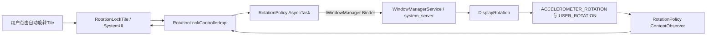
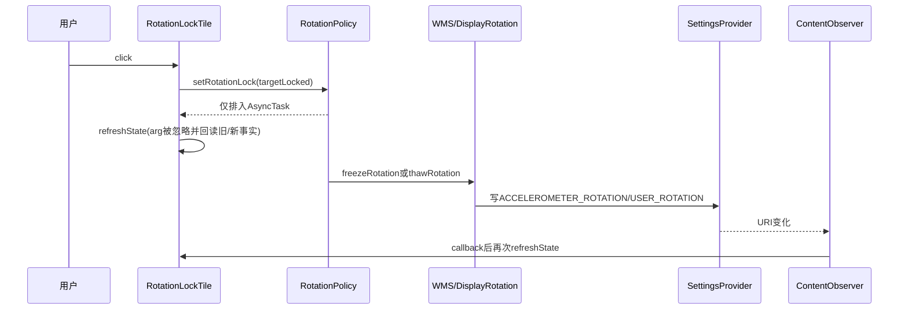
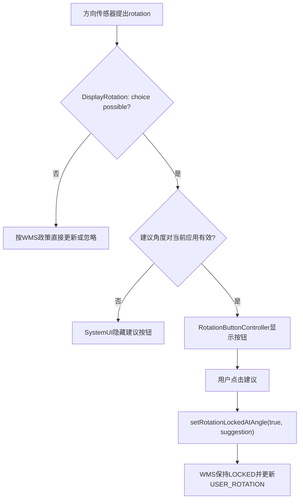

# 第 430 章 Android SystemUI Rotation Lock Tile：自动旋转、锁定角度与WMS冻结

> 源码基线：Android 11 / API 30 / `android-11.0.0_r48`。本章只在macOS上阅读源码，不编译、不刷机。核心文件：`RotationLockTile.java`、`RotationLockControllerImpl.java`、`RotationPolicy.java`、`IWindowManager.aidl`、`WindowManagerService.java`、`DisplayRotation.java`与`RotationButtonController.java`。

## 1. 本章要解决什么问题

快捷设置里的“自动旋转”为什么由一个名为Rotation Lock的Tile实现？点击后究竟改了哪个设置？“锁定”是锁方向、锁屏幕物理角度，还是让传感器停工？锁定时导航栏为什么仍可能弹出旋转建议？本章沿真实r48代码把这些概念拆开。

## 2. 先记住最反直觉的取反

`RotationLockTile`的`BooleanState.value`表示“自动旋转是否开启”，而`RotationLockController.setRotationLocked(locked)`的参数表示“是否锁定旋转”。一个是free，一个是locked，因此二者语义相反：`state.value = !rotationLocked`。

## 3. 用一句话描述完整链路

用户点击Tile后，SystemUI经`RotationPolicy`异步调用WMS的`freezeRotation()`或`thawRotation()`；WMS把默认显示器的用户旋转模式写入System Settings，`ContentObserver`再通知SystemUI回读事实并刷新Tile。

## 4. 这不是应用自己的requestedOrientation

应用通过Manifest或`Activity.setRequestedOrientation()`表达当前Activity的方向偏好；QS自动旋转是系统级“用户旋转政策”。二者最后都在WMS的`DisplayRotation.rotationForOrientation()`中参与决策，但来源、优先级和作用范围不同。

## 5. 四个容易混淆的量

第一是配置方向portrait/landscape；第二是Surface物理旋转0/90/180/270；第三是用户旋转模式FREE/LOCKED；第四是应用请求的screenOrientation。只说“方向”而不指出是哪一层，几乎一定会造成误解。

## 6. 本章源码地图

Tile负责点击与视觉；Controller提供SystemUI内部抽象；`com.android.internal.view.RotationPolicy`读Settings并跨Binder调用WMS；`WindowManagerService`检查权限和参数；`DisplayRotation`保存模式、选择最终rotation；`RotationButtonController`处理锁定模式下的旋转建议。

## 7. 进程边界

Tile、Controller和RotationButtonController运行在SystemUI进程。`IWindowManager`代理通过Binder进入system_server中的WMS；Settings读写通常还会进入SettingsProvider进程内的provider实现。最终窗口配置和显示旋转由system_server协调。

## 8. 线程边界

QSTile点击与State更新在共享Tile后台Looper。`RotationPolicy`又用`AsyncTask.execute`执行WMS Binder调用。Settings的ContentObserver用创建时绑定到当前线程Looper的`new Handler()`接收变化；SystemUI Controller随后通知观察者，Tile的`refreshState`再排回Tile后台Looper。

## 9. 状态不是一次同步调用就完成

点击、Binder请求、Settings持久化、ContentObserver回调和Tile重绘是多个阶段。`refreshState(newState)`只是乐观显示，不能被当作WMS已完成冻结的ACK；最终仍应以`isRotationLocked()`回读Settings为准。

## 10. 总体调用图



## 11. Tile构造时做了什么

构造函数保存注入的`RotationLockController`，然后调用`mController.observe(this, mCallback)`。`observe`把Tile生命周期和CallbackController绑定，使Tile销毁时能自动移除callback，而不是由Tile手写注册/注销配对。

## 12. Tile的State是什么类型

`newTileState()`返回`BooleanState`。这里的boolean不是“rotation lock已开启”，而是“auto rotate已开启”。类名和字段名没有携带这一层业务语义，阅读时必须结合`handleUpdateState()`确认。

## 13. 长按去了哪里

`getLongClickIntent()`返回`Settings.ACTION_DISPLAY_SETTINGS`。它进入显示设置总页，并不是一个专门的auto-rotate action；具体Settings页面是否呈现旋转选项还取决于设备能力和产品配置。

## 14. 点击代码很短却有两次取反

```java
final boolean newState = !mState.value;
mController.setRotationLocked(!newState);
refreshState(newState);
```

第一次取反得到用户想要的新“自动旋转”值；第二次把free语义转换为locked语义。假设当前`value=true`，点击后`newState=false`，传给Controller的是`locked=true`。

## 15. 为什么不直接传mState.value

因为点击想切换状态，而非重复当前状态。正确真值表是：当前自动旋转开→点击→锁定；当前自动旋转关→点击→解锁。写成`setRotationLocked(mState.value)`恰好也能表达目标锁定值，但源码用两步命名让UI目标更显式。

## 16. 乐观刷新传了什么

`refreshState(newState)`把Boolean作为arg排入QSTile刷新消息。然而本类`handleUpdateState(state, arg)`完全忽略arg，每次都调用Controller回读事实。因此这段所谓乐观刷新并不保证马上画出`newState`。

## 17. 这与前几章的transient不同

Wi-Fi等Tile会消费ARG_SHOW_TRANSIENT_ENABLING，明确显示过渡态；RotationLockTile没有`isTransient`、没有等待标志，也没有超时恢复。点击之后若Settings尚未改变，本轮刷新仍可能显示旧状态。

## 18. handleUpdateState的事实来源

唯一核心查询是`mController.isRotationLocked()`。Controller再调用`RotationPolicy.isRotationLocked(context)`，读取当前用户的`Settings.System.ACCELEROMETER_ROTATION`。

## 19. Settings值如何解释

`ACCELEROMETER_ROTATION == 0`被解释为locked；非0被解释为free。注意读取默认值就是0，因此设置不存在或读取失败退默认时，UI倾向显示“自动旋转关闭”。

## 20. Tile的value如何计算

```java
final boolean rotationLocked = mController.isRotationLocked();
state.value = !rotationLocked;
state.state = state.value ? Tile.STATE_ACTIVE : Tile.STATE_INACTIVE;
```

所以ACTIVE表示自动旋转开启，INACTIVE表示旋转锁定。不能把QS的ACTIVE机械理解成“名字里的RotationLock已启用”。

## 21. Tile标签是否随状态变化

不会。无论locked与否，label都取`quick_settings_rotation_unlocked_label`，在常见资源中面向用户表达“自动旋转”。视觉状态主要靠active/inactive色彩，而非动态替换“纵向/横向”。

## 22. Tile图标是否随角度变化

r48这份实现固定使用内部资源`ic_qs_auto_rotate`。`isCurrentOrientationLockPortrait()`虽然保留在类中，但`handleUpdateState()`没有用它选portrait/landscape锁图标，属于当前路径未消费的辅助方法。

## 23. 无障碍字符串是否区分开关

`getAccessibilityString(boolean locked)`忽略参数，总是返回同一个`accessibility_quick_settings_rotation`。`contentDescription`因此不随状态变化；Switch类名和QSTile框架的状态表达承担其余可访问性语义。

## 24. composeChangeAnnouncement的参数还取反吗

它把`mState.value`传给名为locked的参数，但方法本身不消费参数，所以当前没有可见影响。这是命名与业务语义漂移的又一信号，不能据调用参数推导播报状态。

## 25. callback收到的boolean是什么

`onRotationLockStateChanged(rotationLocked, affordanceVisible)`第一个参数真的是locked语义。但Tile回调只调用`refreshState(rotationLocked)`，刷新函数最终又忽略arg并重新查询，因此没有把locked错误写成value。

## 26. affordanceVisible被Tile使用了吗

没有。回调第二个参数被丢弃，Tile类也没有覆盖`isAvailable()`去调用Controller。是否把Tile spec放进面板，主要由默认配置、Host和用户编辑决定；仅凭RotationPolicy的可见性结果不能保证Tile自动消失。

## 27. RotationLockController接口的职责

它暴露读锁定状态、读锁定方向、读入口可见性、普通锁定、指定角度锁定和callback。接口屏蔽内部Settings与WMS Binder细节，让Tile与导航栏旋转建议复用同一个政策入口。

## 28. Controller为何是Singleton

`RotationLockControllerImpl`标注`@Singleton`，SystemUI不同消费者共享同一实例与callback列表。Tile和RotationButtonController读取的锁定事实一致，但后者并未通过callback观察，而是在相关事件发生时主动查询/设置。

## 29. Controller构造立即永久监听

构造函数直接`setListening(true)`，向RotationPolicy注册ContentObserver。它没有按callback从0到1启用、从1到0停用；只要Singleton存活，监听就持续存在。

## 30. 重复setListening(true)安全吗

实现没有布尔去重。若外部再次调用true，同一个Observer可能被ContentResolver重复注册；一次false调用是否清除所有重复注册依赖ContentResolver实现，不应把本类当作严格幂等状态机。

## 31. callback列表为何用CopyOnWriteArrayList

添加/删除较少、通知遍历较多时，写时复制允许遍历期间安全增删，避免普通ArrayList的并发修改异常。代价是每次写都会复制底层数组；这里callback数量通常很小。

## 32. addCallback是否回放初值

会。先把callback加入列表，再同步调用`notifyChanged(callback)`，当场回放locked与visible两个事实。它不是向Handler排队，因此回调运行在线程取决于调用者。

## 33. callback有去重吗

没有显式检查。CopyOnWriteArrayList允许同一对象重复加入，于是一次状态变化可回调多次；remove只移除第一个相等元素。正常`observe`生命周期应避免重复注册，但实现自身不保证。

## 34. callback异常会怎样

`notifyChanged()`没有try/catch。某个callback抛出RuntimeException会中断当前遍历，后面的观察者收不到这次通知，并可能把异常带回ContentObserver分发线程。

## 35. ContentObserver监听哪两个URI

监听`ACCELEROMETER_ROTATION`与`HIDE_ROTATION_LOCK_TOGGLE_FOR_ACCESSIBILITY`。`USER_ROTATION`没有被Controller直接观察；如果锁定角度改变但locked/visible不变，Controller callback不一定因此触发。

## 36. 为什么监听隐藏开关

无障碍设置可以把旋转锁定到自然角度，同时隐藏SystemUI旋转锁入口，避免两个控制入口语义冲突。所以入口可见性既取决于硬件能力，也取决于这个per-user隐藏位。

## 37. USER_ALL监听是什么意思

Controller以`UserHandle.USER_ALL`注册两个System Settings URI，任一用户对应值变化都可能触发onChange。回调时它却用`USER_CURRENT`重新读取当前用户事实，因此其他用户变化可能造成一次无害的重复刷新。

## 38. 用户切换如何收敛

本类没有UserTracker。若用户切换伴随Settings observer通知或其他调用刷新，`USER_CURRENT`会读新用户；但仅从这三个文件看不到专门的“切换完成立即回放”保证，不能过度承诺无瞬时旧态。

## 39. RotationPolicyListener的Handler属于哪条线程

字段初始化时构造`new ContentObserver(new Handler())`，Handler绑定创建Listener时当前线程Looper。RotationLockController通常在SystemUI主线程依赖图构建，因此实践上多在主线程回调，但代码没有显式写`Looper.getMainLooper()`。

## 40. isRotationSupported的四道门

设备必须同时声明加速度计、屏幕纵向、屏幕横向三个feature，并且资源`config_supportAutoRotation=true`。缺任一项，RotationPolicy认为系统不支持旋转入口。

## 41. 支持旋转不等于入口可见

`isRotationLockToggleVisible()`还要求当前用户`HIDE_ROTATION_LOCK_TOGGLE_FOR_ACCESSIBILITY == 0`。这是“可否展示控制入口”的policy，不等于当前rotation是free，也不等于Tile实例已被Host移除。

## 42. setRotationLock普通入口选择哪个角度

若`config_allowAllRotations=true`，锁定参数用`CURRENT_ROTATION=-1`，WMS锁到当前物理rotation；若false，则用`NATURAL_ROTATION=ROTATION_0`，锁到设备自然角度。

## 43. -1不是一个真实角度

`-1`是IWindowManager协议中的哨兵，表示“冻结到当前rotation”。到`DisplayRotation.freezeRotation()`时会转换成当前`mRotation`，再写成0到3之一。

## 44. 自然角度不一定是纵向

手机通常ROTATION_0对应portrait；一些平板或特殊设备的初始显示宽大于高，ROTATION_0可对应landscape。自然rotation是显示硬件基准，不是Configuration.PORTRAIT的同义词。

## 45. getRotationLockOrientation返回的又是什么

它返回`Configuration.ORIENTATION_PORTRAIT`、`LANDSCAPE`或`UNDEFINED`，不是Surface rotation常量。当产品只允许自然角度锁定时，它调用WMS取得initial display size，用宽高判断自然配置方向。

## 46. 为什么不能把两套常量混传

Configuration方向常量表达宽高类别，Surface rotation表达相对自然显示的四个角度；它们恰好都是int，编译器无法阻止误传。`setRotationLockedAtAngle`要求后者，Tile辅助方法返回/判断前者。

## 47. initial display size与当前size不同

`getInitialDisplaySize(displayId)`读初始显示尺寸，用来判断设备自然方向；旋转后的当前逻辑宽高会互换，若用当前size反推自然方向就会随旋转摇摆。

## 48. initial size查询失败怎么办

捕获RemoteException并记录警告，最后返回`ORIENTATION_UNDEFINED`。调用者应把它理解为“无法限定为单一自然方向”，而不是确认设备当前为portrait。

## 49. Tile辅助判断如何处理UNDEFINED

如果lockOrientation未定义，它使用当前Resources Configuration：不是landscape就按portrait处理；否则直接根据固定lockOrientation判断。r48实际Tile渲染没有调用它，理解即可，不要虚构现有效果。

## 50. 指定角度锁定是谁使用

`setRotationLockedAtAngle(true, rotationSuggestion)`主要由`RotationButtonController`在用户接受导航栏旋转建议时调用。它允许锁定模式下把用户锁定角度从原值更新到建议值，而不切回全自动。

## 51. setRotationLockAtAngle先清哪个设置

它先把当前用户`HIDE_ROTATION_LOCK_TOGGLE_FOR_ACCESSIBILITY`写0，再发起freeze/thaw。这意味着普通SystemUI入口接管时恢复旋转开关入口可见，不延续Accessibility专用隐藏政策。

## 52. 两步写入是否有事务

没有。隐藏位先同步写，WMS操作随后异步执行。WMS Binder失败时可能已经恢复入口可见，但实际锁定模式未改变；源码只记录警告，没有回滚隐藏位。

## 53. Accessibility专用入口的差异

`setRotationLockForAccessibility(enabled)`把隐藏位写成enabled?1:0，并始终以`NATURAL_ROTATION`调用底层。启用后既锁自然角度又隐藏SystemUI入口，避免用户看到一个可能令人困惑的通用切换。

## 54. AsyncTask为什么重要

RotationPolicy的私有`setRotationLock`不在调用线程直接做Binder，而是`AsyncTask.execute`。所以Tile点击返回只代表任务已排队；调用方没有Future、callback或错误值可等待。

## 55. 点击到回调的时序图



## 56. 异步任务是否合并

没有。用户快速连点可排入多个freeze/thaw任务，执行器与Binder到达顺序决定中间状态。最终通常由最后执行的请求收敛，但源码没有sequence id防止较旧请求晚到覆盖较新意图。

## 57. RotationPolicy捕获什么异常

只捕获`RemoteException`。WMS端的`SecurityException`或非法rotation导致的`IllegalArgumentException`属于运行时异常，不在这里转为UI结果；SystemUI是特权调用者，正常路径应满足权限和参数约束。

## 58. WMS入口先检查什么

`freezeDisplayRotation`和`thawDisplayRotation`都要求`android.permission.SET_ORIENTATION`。普通第三方应用不能借这个隐藏Binder接口修改系统旋转锁。

## 59. rotation参数范围

freeze接受-1以及`Surface.ROTATION_0..ROTATION_270`，即-1到3。超出范围立即抛`IllegalArgumentException`，不会自动取模，也不会容忍Configuration方向常量混入。

## 60. 为什么清CallingIdentity

权限先按Binder调用者身份检查，通过后WMS清除calling identity，以system_server自身身份访问显示对象和写Settings；finally恢复身份，避免污染后续同线程Binder工作。

## 61. freezeRotation操作哪个显示器

旧接口`freezeRotation(rotation)`等价于`freezeDisplayRotation(Display.DEFAULT_DISPLAY, rotation)`。RotationPolicy调用的是旧接口，因此QS开关针对默认显示器，而不是Context所在任意外接显示器。

## 62. 找不到DisplayContent怎么办

WMS记录warning后return，不抛给调用方。RotationPolicy没有成功ACK，Tile也只能靠Settings是否变化判断；缺失显示时可能一直维持旧值。

## 63. 真正的freeze逻辑在哪里

```java
void freezeRotation(int rotation) {
    rotation = (rotation == -1) ? mRotation : rotation;
    setUserRotation(WindowManagerPolicy.USER_ROTATION_LOCKED, rotation);
}
```

它不是暂停一个Java线程，也不是冻结画面Buffer；它把用户旋转模式设为LOCKED并保存目标rotation。

## 64. thaw做了什么

`setUserRotation(USER_ROTATION_FREE, mUserRotation)`。模式恢复FREE，已有用户角度值仍保留，供以后再次锁定或政策计算使用；“解锁”不等于把USER_ROTATION清零。

## 65. 默认显示器如何持久化

`DisplayRotation.setUserRotation()`对default display写`ACCELEROMETER_ROTATION`与`USER_ROTATION`后立即return，等待SettingsObserver回调再更新内存字段。因此写设置与`mUserRotationMode`内存更新是两阶段。

## 66. 写入顺序有什么窗口

先写accelerometer mode，再写user rotation。ContentObserver可能在两次写之间观察到“新模式+旧角度”；随后第二次变化再收敛。Controller只观察前者，不观察USER_ROTATION，因此其callback不保证覆盖角度写完成时刻。

## 67. 非默认显示器为何不同

非默认显示器直接更新内存字段，并将user rotation写入DisplayWindowSettings；发生变化时主动`updateRotation`。多显示器的持久化模型和默认显示器的System Settings模型不同。

## 68. WMS何时触发重新计算

freeze/thaw离开global lock、恢复calling identity后调用`updateRotationUnchecked(false, false)`。默认显示器SettingsObserver随后也可能触发更新；实现容许多个收敛信号，而非把一次调用看成单一原子帧。

## 69. SettingsObserver如何恢复字段

它读取`USER_ROTATION`到`mUserRotation`，读取`ACCELEROMETER_ROTATION != 0`映射为FREE，否则LOCKED。字段变化会标记shouldUpdateRotation；模式变化还会更新方向传感器监听状态。

## 70. 持久化跨重启的含义

WMS注释明确freeze/thaw状态可跨重启，因为用户旋转模式与角度写入Settings。它不是只活在SystemUI Tile对象内；SystemUI进程重启后会重新读取同一事实。

## 71. isRotationFrozen与Tile读取一致吗

默认显示器的`DisplayRotation.isRotationFrozen()`同样读取当前用户`ACCELEROMETER_ROTATION==0`，与RotationPolicy一致。非默认显示器则读自身`mUserRotationMode`。

## 72. “冻结旋转”不等于任何应用都不能转

`rotationForOrientation()`把用户锁定视为一种弱偏好。若应用明确请求LANDSCAPE、PORTRAIT、REVERSE_*或NOSENSOR，用户锁定分支会避让；dock、HDMI、VR、lid、demo等更高优先级政策也可能覆盖。

## 73. 为什么称弱偏好

源码注释说明用户rotation表达“相对重力方向的偏好”，不应影响NOSENSOR，也不应把明确请求某个方向的应用硬推到反向兼容角度。最终rotation由多条政策共同选择。

## 74. FREE模式何时使用传感器

对USER、UNSPECIFIED、FULL_USER等允许用户政策的方向请求，FREE模式可选sensorRotation；应用显式SENSOR、FULL_SENSOR、SENSOR_LANDSCAPE/PORTRAIT也可使用传感器。并非FREE就无条件服从传感器。

## 75. LOCKED模式何时使用mUserRotation

当没有更高优先级强制条件，且应用方向不是NOSENSOR和四种明确正/反横竖屏时，锁定分支把`preferredRotation=mUserRotation`，之后再按requested orientation检查兼容性。

## 76. 180度为何常被限制

在自动模式下，如果`config_allowAllRotations=false`，普通USER/UNSPECIFIED通常不会选择sensor给出的ROTATION_180；FULL_SENSOR或FULL_USER可例外。这与前面“普通锁定锁自然角度”共享同一产品配置思想。

## 77. 固定到用户旋转又是什么

`isFixedToUserRotation()`是显示级额外政策，可强制直接返回mUserRotation。它不同于用户在QS选择LOCKED；WMS还支持DISABLED/ENABLED/DEFAULT三态，常用于特定显示策略。

## 78. 当前应用请求优先级在哪里看

`rotationForOrientation(@ScreenOrientation orientation, lastRotation)`的大型条件链就是核心。阅读时先看“强制环境条件”，再看应用orientation类别，最后看user mode与sensor，不能只截取LOCKED分支就下结论。

## 79. mRotation、mUserRotation和sensorRotation的区别

`mRotation`是当前应用到显示的实际rotation；`mUserRotation`是用户锁定/偏好的保存角度；`sensorRotation`是方向监听器新提议的角度。三者在稳定锁定时可能相等，也可能因应用或外设政策而不同。

## 80. Configuration方向何时改变

WMS决定新的display rotation并应用后，会推动display configuration更新；应用/窗口随后经历配置变化与重新布局。Tile把Settings写完不等于所有窗口已经完成configuration与首帧绘制。

## 81. 更新完成有几个层次

至少要区分：请求已排队、WMS已写用户政策、rotation计算已更新、display configuration已分发、应用已重布局、SurfaceFlinger已显示新帧。RotationLockTile只直接观察到第二层对应的Settings事实。

## 82. 锁定后传感器一定关闭吗

不一定。`needSensorRunning()`在LOCKED模式下仍可能返回true，只要设备支持自动旋转且`SHOW_ROTATION_SUGGESTIONS`开启。传感器此时不是自动转屏，而是为“给用户一个可接受的建议”服务。

## 83. 自动旋转与旋转建议的差别

自动旋转：sensor proposal可直接进入rotation决策。旋转建议：系统保持LOCKED，只在检测到合适的新角度时显示按钮，用户点击后才把锁定角度改成建议角度。

## 84. 低内存设备有什么差异

DisplayRotation读取Secure `SHOW_ROTATION_SUGGESTIONS`时，low-RAM设备强制按disabled处理；普通设备读取当前用户设置及默认值。是否展示建议不仅由Tile锁定状态决定。

## 85. 建议何时可能产生

OrientationListener得到新proposed rotation后，如果`isRotationChoicePossible(currentAppOrientation)`为true，就把rotation与valid发送给StatusBarManagerInternal；否则直接请求WMS更新rotation。

## 86. choice possible的首要条件

用户模式必须是LOCKED。FREE模式无需提示“是否转”，系统可按传感器政策直接处理，所以该旋转建议机制专门服务于锁定模式。

## 87. 哪些环境会禁止建议

fixed-to-user、特定lid、car/desk dock、HDMI强制、demo lock、持久VR、不支持auto rotation等都会返回false。这些条件已经把rotation强制住，再让SystemUI提供选择会误导用户。

## 88. 应用方向也限制建议

只对FULL_USER、USER、UNSPECIFIED、USER_LANDSCAPE、USER_PORTRAIT等存在用户选择空间的请求开放。明确固定方向的应用不应弹建议按钮。

## 89. StatusBar收到的valid是什么

DisplayRotation还会检查建议rotation是否与当前应用允许的方向兼容。例如USER通常排除倒置方向；USER_PORTRAIT只接受正常portrait建议。SystemUI收到invalid会隐藏现有按钮，而不是展示不可执行选项。

## 90. 锁定模式下的建议闭环



## 91. 建议如何进入SystemUI

WMS通过本地服务`StatusBarManagerInternal.onProposedRotationChanged(rotation,isValid)`进入状态栏服务，再经CommandQueue到导航栏相关代码，最终调用`RotationButtonController.onRotationProposal()`。这条链与QS Tile callback是两条不同通道。

## 92. SystemUI先过滤什么

RotationButton必须接受proposal；invalid直接隐藏；建议角度若等于窗口当前rotation也隐藏。只有角度不同且有效，才记录mLastRotationSuggestion、选择顺/逆时针动画并显示或暂存按钮。

## 93. 导航栏暂时不可见怎么办

Controller把建议标为pending，最多保留20秒；若导航栏在窗口期内出现再显示，否则取消pending。用户并不一定看到每个传感器proposal。

## 94. 建议按钮多久消失

默认约5秒，hover时基准16秒，再交给AccessibilityManager计算推荐超时。任务切换、Activity方向请求变化、invalid proposal、真实rotation变化或disable2 flag也会使其隐藏。

## 95. 用户点击建议做什么

```java
private void onRotateSuggestionClick(View v) {
    mUiEventLogger.log(ROTATION_SUGGESTION_ACCEPTED);
    incrementNumAcceptedRotationSuggestionsIfNeeded();
    setRotationLockedAtAngle(mLastRotationSuggestion);
}
```

它没有开启自动旋转，而是继续`locked=true`，只把锁定角度改成用户接受的suggestion。

## 96. 为什么更新接受次数

Secure `NUM_ROTATION_SUGGESTIONS_ACCEPTED`用于前三次的引导/ripple体验。代码只在小于3时递增，达到阈值后不再无限累加；这是UI介绍状态，不是旋转政策本身。

## 97. rotation watcher的作用

RotationButtonController向WMS注册`watchRotation`。真实屏幕rotation变化时，它在主线程队首处理：若仍locked，某些情况下同步更新锁定角度，并强制隐藏建议按钮。

## 98. 为什么真实旋转后可能改用户锁

应用或系统强制旋转可使实际rotation偏离mUserRotation。回到自然rotation时，Controller可能调用`setRotationLockedAtAngle(rotation)`让用户锁跟随，避免以后恢复到过时角度。

## 99. 它会对所有rotation都覆盖吗

不会。`shouldOverrideUserLockPrefs()`通常只在rotation等于NATURAL_ROTATION时true；还支持一次性skip标志。这样避免横屏应用或180度强制场景无意永久改变用户偏好。

## 100. 建议与Tile视觉是否同步

接受建议时locked仍为true，所以Tile继续显示INACTIVE。只有`USER_ROTATION`改变，而Controller又不观察该URI，Tile可能完全无需刷新；因为其视觉只表达free/locked，不表达具体角度。

## 101. Tile无法告诉你的信息

它不显示当前锁定是0/90/180/270，不显示应用是否强制方向，不显示传感器是否正在监听，也不显示建议功能是否开启。因此读Tile State无法反推出DisplayRotation全部内部状态。

## 102. 可见性policy与实际Tile的缺口

Controller把affordanceVisible回调给Tile，但Tile不消费。若产品要严格隐藏不支持/Accessibility接管的Tile，应在spec资源、Host可用性或Tile的`isAvailable()`补上政策；r48此文件本身没有完成这一步。

## 103. 乐观arg被忽略的实际影响

快速点击后首次refresh可能回读旧Settings，于是UI短暂不动；ContentObserver到来后再变化。若WMS失败，则UI保持旧事实，这比错误展示新状态更保守，但没有Toast解释失败。

## 104. callback传参也被忽略的影响

Controller已经读过一次locked再回调，Tile却不信参数，重新读一次Settings。优点是统一事实路径；代价是额外provider读取，并可能在极窄窗口读到比callback更新的另一个状态。

## 105. 快速连点的竞态推演

第二次点击依据的可能还是旧`mState.value`，于是两次都计算相同目标，而不是互相抵消；即使State已更新，两份AsyncTask也无generation。真实结果应看WMS收到请求和Settings最终值，不能仅数点击次数推理。

## 106. 多用户边界

Settings读写都用`USER_CURRENT`，意味着前台用户拥有各自auto-rotate偏好。AsyncTask排队到执行期间若用户切换，WMS内部写`USER_CURRENT`的解析时刻可能与点击时用户不同，这是短窗口竞态，代码没有把具体userId随请求冻结下来。

## 107. 多显示器边界

RotationPolicy用Context displayId判断自然方向，却调用default-display的`freezeRotation()`旧接口。若SystemUI Context位于非默认display，这两处display语义可能不一致；常规手机主SystemUI在默认显示器，产品扩展时仍要审计。

## 108. 错误处理边界

RemoteException只有日志，Tile无错误态；Settings put返回值未检查；WMS找不到display只warning；Controller callback异常未隔离。这是一条“最终靠共享事实收敛”的系统UI控制链，而非端到端有结构化结果的事务API。

## 109. 源码阅读时最常见的五个误判

误判一：value=true表示lock开；误判二：freezeRotation冻结画面；误判三：锁定后传感器必停；误判四：用户锁能覆盖所有应用方向；误判五：接受建议会打开auto rotate。五项在r48都不成立。

## 110. 调试时应观察哪些证据

至少同时看`ACCELEROMETER_ROTATION`、`USER_ROTATION`、`DisplayRotation` dump中的mode/rotation/current app orientation、SystemUI Tile State，以及是否出现rotation proposal。仅截图一个灰色Tile无法判断WMS为何没有按传感器转动。

## 111. 本章只读检查清单

能否画出两次取反；能否区分Configuration orientation与Surface rotation；能否解释-1哨兵；能否说明freeze落到两个Settings；能否解释LOCKED仍跑sensor；能否说出建议点击后仍保持locked；能否列出应用/外设对用户锁的覆盖边界。

## 112. macOS只读练习一：验证Tile取反真值表

在源码根目录执行下列只读命令，定位点击与State更新。手写两行真值表：`value=true -> target locked=true`、`value=false -> target locked=false`，再确认`handleUpdateState`没有消费arg。

```bash
sed -n '35,125p' frameworks/base/packages/SystemUI/src/com/android/systemui/qs/tiles/RotationLockTile.java
```

## 113. macOS只读练习二：验证Settings与Binder边界

只读搜索RotationPolicy中两个Settings、AsyncTask和freeze/thaw调用，回答“哪个值表示锁定”“哪一步跨进程”“异常如何反馈”。不要修改Settings，也不要运行adb命令。

```bash
rg -n "ACCELEROMETER_ROTATION|USER_ROTATION|AsyncTask|freezeRotation|thawRotation" frameworks/base/core/java/com/android/internal/view/RotationPolicy.java frameworks/base/core/java/android/view/IWindowManager.aidl
```

## 114. macOS只读练习三：追到WMS持久化

阅读WMS权限入口与DisplayRotation写设置的实现，画出`freezeRotation(-1) -> current mRotation -> USER_ROTATION_LOCKED -> Settings`。特别标注default与non-default display分支。

```bash
sed -n '3710,3790p' frameworks/base/services/core/java/com/android/server/wm/WindowManagerService.java
sed -n '785,845p' frameworks/base/services/core/java/com/android/server/wm/DisplayRotation.java
```

## 115. macOS只读练习四：证明锁定后仍可能使用传感器

只读定位`needSensorRunning`、`isRotationChoicePossible`和SystemUI点击建议代码。回答为什么LOCKED是建议出现的前提、哪些强制场景会禁止建议、接受建议为何不等于开启自动旋转。

```bash
rg -n "needSensorRunning|isRotationChoicePossible|onProposedRotationChanged" frameworks/base/services/core/java/com/android/server/wm/DisplayRotation.java
rg -n "onRotationProposal|onRotateSuggestionClick|setRotationLockedAtAngle" frameworks/base/packages/SystemUI/src/com/android/systemui/statusbar/phone/RotationButtonController.java
```

## 116. 练习参考答案的最短版本

Tile value是auto-rotate，Controller参数是locked；RotationPolicy异步Binder调用WMS；默认显示器用System Settings持久化mode与angle；LOCKED时传感器可用于proposal；点击proposal调用`setRotationLockedAtAngle(true, angle)`，所以仍锁定。

## 117. 从一次点击重新复述主链

用户点击→Tile计算新free值→取反成target locked→RotationPolicy先清Accessibility隐藏位→AsyncTask跨Binder→WMS验SET_ORIENTATION→DisplayRotation选择当前/自然/指定角度→写mode与angle→Observer通知Controller→Tile回读mode并刷新。

## 118. 从一次旋转建议重新复述支链

LOCKED且建议开启→传感器提出rotation→DisplayRotation判断当前应用是否允许选择→StatusBar收到proposal→导航栏展示限时按钮→用户接受→SystemUI指定角度freeze→USER_ROTATION更新，但mode仍为LOCKED。

## 119. 本章最终结论

Rotation Lock Tile表面是一个boolean开关，底层却是用户旋转模式、物理角度、应用方向请求、设备政策和传感器建议的联合状态机。理解它的钥匙不是背类名，而是始终标注每个boolean属于free还是locked、每个int属于orientation还是rotation。

## 120. 下一章衔接

下一章进入SystemUI的勿扰控制：从`DndTile`追到`ZenModeController`、NotificationManager与Zen政策。将继续沿“Tile视觉值、系统事实、权限/用户政策、异步收敛”四层模型阅读。
