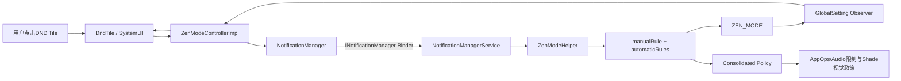
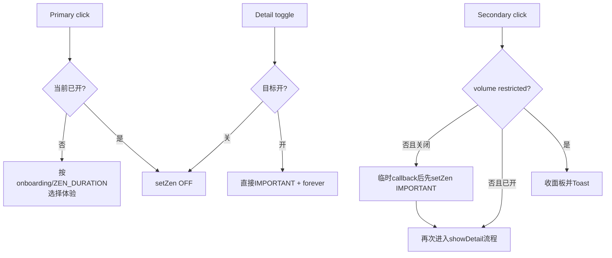
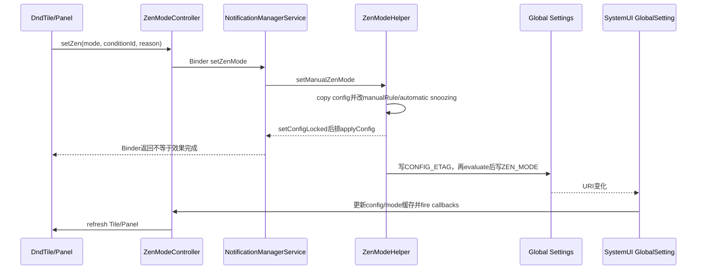

# 第 431 章 Android SystemUI DndTile：勿扰模式、Zen规则、持续时间与通知策略

> 源码基线：Android 11 / API 30 / `android-11.0.0_r48`。本章只在macOS阅读本地源码，不编译。核心文件：`DndTile.java`、`ZenModeControllerImpl.java`、`ZenModePanel.java`、`NotificationManager.java`、`NotificationManagerService.java`、`ZenModeHelper.java`和`ZenModeConfig.java`。

## 1. 本章要解决什么问题

“勿扰模式开着”究竟是一个开关，还是一组规则算出来的结果？Tile为什么点击开启时有时弹框、有时直接开启、有时跳引导页？自动规则正在生效时点击关闭为何不会立刻反弹？Priority only、Alarms only和Total silence最终又如何限制声音与通知视觉？

## 2. 先纠正boolean错觉

`DndTile.BooleanState.value`只表达`zen != ZEN_MODE_OFF`。它把Priority only、Alarms only、Total silence以及手动/自动来源全部压成一个boolean；真实事实至少还包括zen mode、manual rule、automatic rules、condition、consolidated policy和suppressed effects。

## 3. Zen与DND是什么关系

源码内部用Zen Mode表示勿扰政策。这里的“Zen”不是一个UI品牌层面的额外功能，而是NMS中负责判断哪些打扰可以通过、哪些声音/振动/视觉效果应被抑制的核心状态。

## 4. 四个顶层mode

`ZEN_MODE_OFF`关闭；`IMPORTANT_INTERRUPTIONS`只允许策略定义的重要打扰；`ALARMS`允许闹钟与媒体；`NO_INTERRUPTIONS`表示Total silence。Tile只区分OFF与非OFF，但无障碍说明会区分后三种。

## 5. mode不等于policy

mode决定大类，Policy决定优先模式中允许哪些类别、联系人范围和视觉效果；活跃手动/自动规则还可携带ZenPolicy，最终合并成Consolidated Policy。因此“Priority only”在不同用户配置下实际行为可能不同。

## 6. manual与automatic两条来源

用户通过Tile或面板建立`manualRule`；日程、日历事件或第三方Condition Provider驱动`automaticRules`。最终mode优先取manualRule，否则从所有活跃automatic rule中选择严重程度最高者。

## 7. 源码地图

DndTile负责入口和详情容器；ZenModePanel负责模式/结束条件编辑；Controller镜像Settings与服务config；NotificationManager跨Binder进入NMS；ZenModeHelper维护规则、计算mode与合并policy；AppOps和AudioService执行声音/振动限制。

## 8. 进程边界

Tile、Controller、Panel在SystemUI进程。`NotificationManager.setZenMode()`通过`INotificationManager`进入system_server的NotificationManagerService；ZenModeHelper也在system_server。Settings读写经provider，声音限制还会进入AppOps/Audio相关系统服务内部链。

## 9. 线程边界

QSTile主逻辑在共享Tile后台Looper；Dialog和Activity启动通过UI Handler/ActivityStarter回主线程。Controller的GlobalSetting在注入的Main Handler接收ContentObserver。NMS将config应用排入ZenModeHelper自己的Handler，再计算mode、policy、ringer与restrictions。

## 10. 总体结构图



## 11. Tile构造时接了哪些线

保存Controller、ActivityStarter、SharedPreferences和BroadcastDispatcher；创建DetailAdapter；永久注册自定义可见性广播；通过Lifecycle观察Zen Controller。Tile销毁时只显式注销自定义广播，Controller callback由Lifecycle自动解绑。

## 12. Tile为什么默认可能不可用

`isAvailable()`读取Prefs中的`DND_TILE_VISIBLE`，默认false。但启用VolumeUI时，`VolumeUI.setDefaultVolumeController()`会先写true，因此典型手机上会变为可用；这不是由`isZenAvailable()`决定。

## 13. 可用与位于面板不是一回事

资源默认Tile列表包含`dnd`，Host创建时还会检查`tile.isAvailable()`。偏好后来变化只触发Tile刷新，不等于Host一定立刻重建spec；“preference=true”“对象可创建”“当前面板已有Tile”仍是三层状态。

## 14. 自定义可见性广播

Tile监听`com.android.systemui.dndtile.SET_VISIBLE`，读取`visible` extra并写Prefs。当前注册没有附带权限；它只改变SystemUI偏好而非直接改变Zen，但阅读定制ROM时仍应审计广播发送面与Host重建行为。

## 15. combined icon偏好去哪了

类提供`setCombinedIcon/isCombinedIcon`并监听偏好变化，但本类的`handleUpdateState`始终使用同一个DND图标，没有消费combined值。它是r48中保留的跨组件/历史配置入口，不能从名字推断当前Tile会组合图标。

## 16. 主点击在已开启时最简单

若`mState.value=true`，直接调用`setZen(ZEN_MODE_OFF, null, TAG)`。没有确认对话框、没有乐观refresh，也不等待服务ACK；随后依赖Global `ZEN_MODE`观察回调更新Tile。

## 17. 主点击在关闭时为何不直接setZen

源码调用`showDetail(true)`，但这个重写方法不是单纯“展示详情”，而是读取持续时间和onboarding设置后决定怎样开启Zen。方法名会误导阅读者，必须看完整分支。

## 18. show参数被使用了吗

没有。`DndTile.showDetail(boolean show)`完全忽略`show`，也不调用父类实现。已知调用点都传true，但若其他调用者以为`showDetail(false)`只会关闭面板，在r48反而仍会走开启/引导逻辑，这是重要实现边界。

## 19. 开启路径先读哪三个Secure值

读取当前用户的`ZEN_DURATION`、`SHOW_ZEN_UPGRADE_NOTIFICATION`和`ZEN_SETTINGS_UPDATED`。前者决定Prompt/Forever/分钟数，后两者共同决定是否走升级引导。

## 20. onboarding条件

只有show-upgrade非0且settings-updated不等于1才进入。进入后先把show-upgrade写0，注释意图是以后不再展示引导或通知，然后先开启Priority only，再启动`Settings.ZEN_MODE_ONBOARDING` Activity。

## 21. onboarding不是等用户确认才开启

代码顺序明确是先`setZen(IMPORTANT_INTERRUPTIONS)`，再发起Activity。因此用户看到引导页时DND请求已经发出；退出引导不等于自动撤销Zen。

## 22. 为什么Activity要NEW_TASK和CLEAR_TASK

SystemUI不是普通前台Activity上下文，需要NEW_TASK启动；CLEAR_TASK让引导以干净任务呈现。实际启动经ActivityStarter并请求dismiss keyguard，而不是直接`Context.startActivity()`。

## 23. Prompt持续时间分支

当`ZEN_DURATION=-1`，UI Handler创建SettingsLib `EnableZenModeDialog`，窗口类型设为`TYPE_KEYGUARD_DIALOG`，允许all users显示、登记dismiss listener、置顶，随后show并collapse QS面板。

## 24. 为什么Dialog要两次post

外层post把构造/窗口操作移到UI线程，内层又post `mDialog.show()`。源码没有说明严格必要性，可理解为确保窗口配置和面板收起调度分阶段执行；不能把第一次post当作Dialog已经可见。

## 25. Prompt分支何时真正setZen

DndTile本身在该分支不调用Controller开启，实际由`EnableZenModeDialog`中的用户选择提交模式与condition。取消Dialog应保持原状态；所以“点击Tile”只打开选择流程，不等于一定开启。

## 26. Forever持续时间分支

当值为0，直接`setZen(IMPORTANT_INTERRUPTIONS, null, TAG)`。null conditionId表示手动规则没有自动结束条件，即持续到用户关闭或其他系统逻辑改变。

## 27. 正分钟数分支

其他值按分钟数传给`ZenModeConfig.toTimeCondition()`，结合当前用户和当前时间生成countdown Condition URI，再以该URI建立Priority only手动规则。到期由Condition Providers链解除/更新规则。

## 28. 非法负数怎么办

switch只特判-1与0，其他任意int都进入时间Condition生成。Secure validator是ANY_INTEGER而非范围校验；异常负数的具体时间结果取决于helper计算，Tile没有本地兜底。

## 29. 开启路径总是Priority only吗

主点击的非Prompt直接路径和onboarding都请求IMPORTANT_INTERRUPTIONS。要选Alarms only或Total silence，需要Prompt Dialog、详情ZenModePanel、音量UI或Settings等其他入口。

## 30. Tile为何不乐观刷新

所有setZen调用后都没有`refreshState(target)`。这避免把Binder请求当事实，但用户会看到延迟；真正变化要由NMS写Global `ZEN_MODE`后Controller observer回调。

## 31. secondary click先检查什么

先调用`mController.isVolumeRestricted()`检查当前Controller用户的`DISALLOW_ADJUST_VOLUME`。命中后collapse panels并显示“change not allowed”长Toast，不打开详情、不改Zen。

## 32. 为什么叫volume restriction却拦DND

DND会改变声音/振动行为，Android把其控制权与“禁止调节音量”用户限制绑定。Tile State也用同一restriction设置admin policy，但两条检查实现并不完全相同。

## 33. secondary在Zen已开时

直接`showDetail(true)`。注意由于DndTile的重写语义，这会再次读取ZEN_DURATION并可能重新设置Priority手动规则，而不是只让Host展示既有Detail View；当前代码名称与预期双目标语义存在耦合。

## 34. secondary在Zen关闭时

先临时add一个Controller callback，然后请求开启IMPORTANT。收到任意`onZenChanged`后移除自身并调用`showDetail(true)`，注释称复杂Panel需要先开启再展示。

## 35. 一次性callback真的一定一次吗

正常收到mode变化时会自移除。但若NMS拒绝、mode本来被其他竞态改回相同值、或没有Global变化通知，callback会留在Controller列表；未来某次Zen变化会突然重新触发这个名为showDetail的开启流程，可能弹框、写Zen或开引导，并不保证打开DndDetailAdapter。

## 36. 二次showDetail会不会再次setZen

会按当前ZEN_DURATION再次走方法分支。例如Forever时，它又请求IMPORTANT；Prompt时可能弹EnableZenModeDialog，而不是直接打开DndDetailAdapter。这揭示`showDetail`在本类更像“执行默认开启体验”，不是纯View命令。

## 37. Tile State如何取得zen

`arg instanceof Integer`时信任callback传来的mode，否则读Controller缓存。onZenChanged传入Integer能少一次读取，但arg只是mode，config和policy仍从Controller当前缓存取得。

## 38. State何时ACTIVE

只要`zen != OFF`就ACTIVE；slash取消。OFF时INACTIVE且图标加slash。UNAVAILABLE不会由Zen setup状态触发，因为Tile不消费`isZenAvailable()`。

## 39. dualTarget代表什么

State设置`dualTarget=true`，主区域执行开关默认体验，secondary区域用于详情入口。两者的restriction检查、开启顺序和UI结果不同，不能视为同一个click仅坐标不同。

## 40. secondaryLabel从哪里来

调用`ZenModeConfig.getDescription(context, zenOn, config, false)`。它会描述倒计时结束时间、启用DND的App或活跃自动规则；手动Forever因`describeForeverCondition=false`返回null。

## 41. 多个来源时描述如何选择

手动倒计时先提供end time；schedule/event自动规则按更晚结束时间覆盖；第三方自动规则可直接返回其名称。它是面向用户的摘要算法，不是决定最终zen严重度的算法。

## 42. manual enabler是什么

若App以允许的API触发manual rule，ZenRule记录包名enabler；描述函数尝试加载应用label。DndTile自己调用Controller时caller参数最终为null，reason才是TAG，所以普通Tile手动规则没有enabler App名。

## 43. contentDescription如何区分mode

Priority拼DND通用描述与secondaryLabel；NO_INTERRUPTIONS额外加“total silence”；ALARMS额外加“alarms only”；OFF只用通用描述。空secondaryLabel仍会参与字符串拼接，可能留下语音停顿。

## 44. valueChanged触发什么

只有OFF与非OFF boolean翻转才`fireToggleStateChanged`。Priority切换到Alarms仍是true，不触发toggle变化；但contentDescription和secondaryLabel可以改变。

## 45. admin policy只覆盖哪类restriction

`checkIfRestrictionEnforcedByAdminOnly`仅当存在EnforcedAdmin且不是base user restriction时把`disabledByPolicy=true`。base restriction不会让QSTileImpl主点击自动走管理员支持页。

## 46. primary与secondary restriction不对称

secondary用UserManager检查，能拦base/admin restriction；primary依赖`disabledByPolicy`，只对admin-only情形被QSTile框架拦截。若是base restriction，主入口仍可能调用setZen，而secondary显示Toast，这是r48需实机/服务层继续验证的政策缺口。

## 47. 长按去了哪里

返回`Settings.ACTION_ZEN_MODE_SETTINGS`，进入勿扰设置总页。DetailAdapter的settings intent也相同；Panel内“Priority settings”则打开`ACTION_ZEN_MODE_PRIORITY_SETTINGS`，三种入口目标不完全相同。

## 48. listening为何还监听Prefs

Tile在至少一个UI listener存在时注册SharedPreferences listener，监听visible与combined icon变化并刷新；不显示时注销。Zen callback则与Tile Lifecycle绑定，不按QSTile listening token开关。

## 49. Pref变化刷新能改变isAvailable吗

`refreshState()`只重算State字段，`handleUpdateState`不写availability。Host通常在建Tile时调用`isAvailable()`；因此单纯刷新不一定使一个已缺席Tile出现或已存在Tile消失，需要Host重建/配置变化配合。

## 50. DndTile销毁清理是否完整

显式注销自定义receiver；父类销毁会在存在listeners时调用`handleSetListening(false)`从而注销Prefs listener，并清callbacks/messages；Lifecycle销毁移除Zen callback。Detail View若仍attach则依赖View拆除触发自己的清理。

## 51. DetailAdapter保存了什么

保存当前`ZenModePanel mZenPanel`和`mAuto`。`getToggleState()`直接读Tile稳定State，可能比Controller事实稍旧；`setToggleState()`直接发setZen，不做本地refresh。

## 52. Detail toggle关闭时

请求ZEN_MODE_OFF并把`mAuto=false`。这个字段只是Detail当前展示模式标记，不参与ZenModeHelper规则计算，也不是服务ACK。

## 53. Detail toggle开启时

直接请求IMPORTANT且condition=null，绕过主点击的onboarding、持续时间偏好和Prompt Dialog。相同“开启”在主入口与详情toggle中语义不同。

## 54. Detail toggle重新检查restriction吗

没有。secondary打开前检查一次，但DetailAdapter的`setToggleState`不再调用`isVolumeRestricted()`；如果restriction在面板已打开后变化，当前代码仍会发请求，服务/更下层是否拒绝要另行验证。

## 55. 三种点击入口时序图



## 56. Detail View是否复用

若`convertView`非null直接强转ZenModePanel；新建时inflate布局、init Controller、注册attach listener、设置Panel callback和empty state。复用时不会重复init与listener，随后都调用updatePanel。

## 57. 本类其实有两份mShowingDetail

DndTile自己声明private `mShowingDetail`，View attach/detach只写这份字段；父类QSTileImpl也有另一份private同名字段，protected `isShowingDetail()`读取的是父类字段。两份字段互不相通，而子类这份在赋值之外没有任何读取。

## 58. 为什么Tile callback的Panel更新门可能永远为false

onZenChanged/onConfigChanged调用的是父类`isShowingDetail()`；该字段只有父类H.SHOW_DETAIL消息会改。但DndTile重写showDetail且不调用super，`QSPanel.openDetails()`又直接展示adapter而不改Tile字段，所以已知链上这个门大概率保持false，Tile层`updatePanel()`不会因Zen callback运行。

## 59. Detail updatePanel的三个状态与刷新缺口

createDetailView仍会主动调用一次updatePanel：Zen OFF→`STATE_OFF`；无外部来源→`STATE_MODIFY`；App/automatic驱动→`STATE_AUTO_RULE`。但后续自动规则/config变化可能因第58节断线而不重算这层状态，形成陈旧摘要风险。

## 60. manual app来源如何显示

`manualRule.enabler != null`时用PackageManager取ApplicationInfo与label，成功后显示“由某App打开”。任何Throwable都捕获并记录warning，加载失败则summary为空，可能落到可修改状态。

## 61. automatic rule摘要如何折叠

第一个活跃规则且无现有summary时显示具体rule.name；已有manual app或第二个活跃规则时改成泛化“由自动规则或App开启”。后续规则继续维持泛化，避免列出长列表。

## 62. config为null的边界

updatePanel在zen非OFF时立即访问`config.manualRule`，没有null检查。正常Controller构造会向NMS取config，但Binder/mock/初始化异常若留下null，打开详情可NPE；Tile secondaryLabel的getDescription反而能安全处理null。

## 63. mAuto被谁消费

r48 DndDetailAdapter只在updatePanel和关闭toggle中赋值，没有其他读取。它是当前类中的残留状态，不能把它当作Panel是否自动规则驱动的权威输出。

## 64. ZenModePanel初始化做什么

保存Controller，动态加入Forever、多个倒计时等Condition行，读取manual rule，准备按钮与条件但先隐藏全部。真正可见时`onVisibilityAggregated(true)`执行onAttach。

## 65. Panel自己的Controller callback

onAttach记录attachedZen/manual condition，向Controller addCallback，设置session condition并更新widgets；onDetach移除。这个callback只处理`onManualRuleChanged`，可修正手动mode/condition，却不处理config/automatic summary，所以不能完全补上第58节的Tile层断线。

## 66. Panel能选哪些模式

ZenButtons可选择Priority、Alarms、None/Total silence；用户选mode后最终调用Controller.setZen，携带当前选择的真实Condition ID。Panel因此能改变mode和结束条件，而Tile boolean无法表达这些细节。

## 67. Forever Condition为何UI对象不等于null

Panel创建一个带专用`mForeverId`的Condition用于单选行展示；真正提交时`getRealConditionId()`把Forever映射为null。UI需要可选择对象，服务协议用null表达无限期。

## 68. 倒计时Condition是什么

Condition URI编码结束时间等信息，`ZenModeConfig`提供创建/解析。Manual rule保存conditionId，Condition Provider管理状态；Tile本身不安排AlarmManager去关闭DND。

## 69. 下一闹钟Condition如何出现

Panel从Controller取当前用户下一AlarmClock，只在未来约一周范围内生成“直到下一闹钟”选项。它不是普通倒计时文案，而是可在闹钟触发时退出的系统Condition。

## 70. Total silence为何显示闹钟警告

Panel在选NO_INTERRUPTIONS时计算下一闹钟是否落在DND结束前；若可能被静音，显示具体时间警告。Priority/Alarms分支不走同一warning逻辑。

## 71. Controller构造的第一条观察链

`mModeSetting`是Global `ZEN_MODE` ContentObserver。开启监听后立即手动`updateZenMode(getValue())`建立缓存；后续变化先更新mZenMode/time，再`fireZenChanged(value)`。

## 72. 第二条观察链是什么

Global `ZEN_MODE_CONFIG_ETAG`只作为config变化信号。其数值/hash本身不被Controller解释；onChange时重新跨Binder调用`getZenModeConfig()`，比较后更新缓存与callbacks。

## 73. 为什么使用ETag而不直接解析Global值

ZenModeConfig是复杂对象，真实权威由ZenModeHelper维护并可通过Binder返回copy；Global只保存config hash字符串以触发观察。SystemUI不从Settings反序列化完整规则。

## 74. Controller还缓存什么

缓存`mConfig`、`mZenMode`、最后更新时间和`mConsolidatedNotificationPolicy`。它还持AlarmManager、UserManager和当前用户ID，用于下一闹钟、setup gate与volume restriction。

## 75. 构造更新顺序

先监听/read mode，再监听/read config，再单独read consolidated policy，之后注册SetupObserver并启动CurrentUserTracker。消费者通常尚未加入，但内部更新方法仍可能触发空列表callbacks。

## 76. addCallback是否初值回放

不会。它只把callback加入ArrayList；与上一章RotationLockController不同。DndTile依靠QSTile创建/监听时自身refresh拿初值，不能假设任意新Zen callback会立刻得到onZenChanged或onConfigChanged。

## 77. callback列表的并发模型

所有add/remove/fire都持`mCallbacksLock`。fire在锁内调用`Utils.safeForeach`反向遍历，支持当前线程callback自移除且跳过null；测试覆盖了self-remove和null callback。

## 78. 锁内回调的代价

Java synchronized可重入，所以callback里同线程remove不会死锁；但慢callback会长期占锁，其他线程add/remove/fire被阻塞。异常也没有统一隔离，可能中断本轮后续通知。

## 79. CurrentUserTracker初值细节

`startTracking()`让共享UserReceiver记录`ActivityManager.getCurrentUser()`，但不会立即调用`onUserSwitched()`。Controller的`mUserId`默认0，因此若对象在前台非0用户时首次构造，要等下一次USER_SWITCHED才更新其闹钟/setup/restriction用户ID。

## 80. 用户切换时Controller做什么

更新mUserId；注销旧用户的next-alarm/effects-suppressor receiver；为新用户重新`registerReceiverAsUser`；重注册SetupObserver并立即fire available。它没有在此显式重新读取zen config/mode，后两者依赖NMS与Global变化收敛。

## 81. SetupObserver观察什么

Global DEVICE_PROVISIONED与指定用户Secure USER_SETUP_COMPLETE。任一URI变化都回调`onZenAvailableChanged(deviceProvisioned && userSetup)`；register会先注销旧观察再注册并立即fire一次。

## 82. DndTile使用isZenAvailable吗

不使用。Tile availability来自Prefs，State也不根据setup变UNAVAILABLE。接口可能服务其他消费者；不能看到Controller有这个API就推断QS入口一定在未设置完成时隐藏。

## 83. isVolumeRestricted读哪个用户

用Controller缓存的mUserId构造UserHandle。结合第79节初值边界，SystemUI在特殊重启/切用户时可能短暂检查user0而不是当前前台用户。

## 84. 下一闹钟广播

Controller按mUserId监听`ACTION_NEXT_ALARM_CLOCK_CHANGED`，收到后只fire callback，不主动缓存Alarm；`getNextAlarm()`每次从AlarmManager读取指定用户的AlarmClockInfo。

## 85. Effects suppressor是什么

电话/系统组件可成为外部effects suppressor。Controller监听其变化并允许查询ComponentName；这与Zen mode相关但不是DndTile当前State字段的直接来源。

## 86. areNotificationsHiddenInShade如何判断

只有Zen非OFF且Consolidated Policy的`suppressedVisualEffects`包含`SUPPRESSED_EFFECT_NOTIFICATION_LIST`才true。仅仅Priority mode开启并不必然从Shade隐藏通知。

## 87. 为什么必须看consolidated policy

旧`mConfig.suppressedVisualEffects`不等于多个活跃规则合并后的最终结果。测试明确验证Zen OFF时即使policy标志存在也false，Zen ON但只压status bar也false，只有notification list位才true。

## 88. Controller setZen是否异步封装

它直接调用`NotificationManager.setZenMode`，该API同步发Binder，RemoteException会被rethrowFromSystemServer转运行时异常。Controller没有try/catch、没有返回boolean、没有乐观缓存。

## 89. NMS的权限门

Binder入口调用`enforceSystemOrSystemUI`，普通App不能使用这个隐藏系统入口；随后clearCallingIdentity并交ZenModeHelper设置manual mode，finally恢复身份。

## 90. 请求到执行面的时序图



## 91. 开启时manualRule如何建立

ZenModeHelper复制当前config，新建enabled ZenRule，写zenMode、conditionId与enabler(caller)，再赋给manualRule。SystemUI NMS入口把caller参数传null、reason传Tile TAG，所以enabler通常为空。

## 92. 关闭时不只是manualRule=null

```java
newConfig.manualRule = null;
for (ZenRule automaticRule : newConfig.automaticRules.values()) {
    if (automaticRule.isAutomaticActive()) {
        automaticRule.snoozing = true;
    }
}
```

这一步防止当前仍为true的自动条件马上把DND重新打开。

## 93. snoozing何时清除

当automatic rule不再处于true/unknown时，ZenModeHelper的`updateSnoozing`把snoozing重置false。下次条件重新变true时规则才可再次自动生效；点击关闭不是永久禁用自动规则。

## 94. manual为何压过automatic

`computeZenMode()`若manualRule非null立即返回其zenMode，不再比较automatic严重度。这允许用户当前手动选择定义最终大类；automatic rules仍可参与consolidated policy合并，需要分开理解mode和policy。

## 95. 没有manual时如何选mode

遍历所有`isAutomaticActive()`规则，按severity选最大：Priority=1、Alarms=2、Total silence=3、Off=0。多个规则同时活动时最严格mode获胜。

## 96. config怎样应用

`setConfigLocked`校验config与用户，交ConditionProviders评估，更新configs；把真正`applyConfig`排入Handler。apply先写`ZEN_MODE_CONFIG_ETAG`，再evaluate mode，再处理condition订阅。

## 97. 为什么Binder返回仍不是完成ACK

setConfigLocked只是接受并排队apply；Global值、ringer、AppOps限制与Controller callback发生在后续Handler工作中。Tile没有完成回调，因此只能等待共享状态变化。

## 98. evaluateZenMode做哪些事

计算mode、写Global ZEN_MODE、更新Consolidated Policy、更新ringer受影响streams；必要时调整内部ringer mode；随后应用所有AudioAttributes的AppOps限制；mode变化再异步dispatch callback。

## 99. Consolidated Policy如何合并

从空ZenPolicy开始，先应用manualRule，再应用每条active automatic rule；Total silence规则disallow all sounds，Alarms规则先全禁再allow alarms/media，Priority规则应用自身zenPolicy；最后转NotificationManager.Policy。

## 100. policy合并不等于只选最严重规则

mode选择只取最高severity；consolidated policy却应用所有活跃规则。多个规则可以共同收紧允许类别，因此只看`ZEN_MODE_IMPORTANT_INTERRUPTIONS`无法还原最终允许项。

## 101. applyRestrictions如何落地

对每个AudioAttributes SDK usage按其SUPPRESSIBLE类别计算mute，再分别对`OP_VIBRATE`和`OP_PLAY_AUDIO`设置AppOps restriction。Priority only可给配置的DND exempt packages例外；其他模式通常没有该例外列表。

## 102. Total silence与Alarms对ringer mode

两者会把内部ringer mode设SILENT，并保存之前level；Zen OFF且当前仍silent时尝试恢复保存值。Priority only不直接改ringer，依靠AudioService/AppOps按Zen policy限制streams。

## 103. DND关闭后一定恢复声音吗

代码只在当前内部ringer仍为SILENT时恢复previous setting；若用户/其他组件中途改变ringer，行为会不同。且AppOps restrictions、ringer恢复与UI mode回调不是一个原子事务。

## 104. 通知拦截发生在哪里

NMS入队/重新排序链会调用`mZenModeHelper.shouldIntercept(record)`并把结果写入NotificationRecord，同时记录suppressed visual effects。声音、振动、Shade列表和状态栏图标是不同执行面。

## 105. DND不是“删通知”

通常通知仍由NMS接收并保存，只是可能被intercept、静音或抑制特定视觉展示。`SUPPRESSED_EFFECT_NOTIFICATION_LIST`可让SystemUI以“notifications paused”空状态表达，而不是应用通知从数据库/队列永久消失。

## 106. mode与config观察的时序窗口

ZenModeHelper applyConfig先写CONFIG_ETAG，再evaluate写ZEN_MODE。SystemUI可能先收到config变化再收到mode变化；Tile callback路径分别处理，不能要求一次刷新同时看到完全成对的新mode/config。

## 107. updateZenModeConfig的相等短路

若NMS返回config与缓存Objects.equals，方法直接return，不再读取consolidated policy。正常config ETag应对应变化，但仅policy因其他来源改变而config相等时，Controller这条路径可能漏更新，需结合NMS实际信号审计。

## 108. callback顺序不等于像素完成

Global observer更新Controller→Tile排refresh→QSTile后台复制State→主线程TileView更新；同时NMS可能仍在应用AppOps/Audio限制。看到Tile ACTIVE不证明每个声音执行面都已收敛，更不证明用户已经看到新帧。

## 109. 快速点击竞态

Tile没有pending/generation。若State尚未刷新，连续主点击可能重复走同一“开启”流程并弹多个UI或发重复setZen；不同入口还可能交错创建Forever与countdown manual rule，最后应用顺序决定结果。

## 110. 本章最常见的六个误判

误判一：DND只有boolean；二：点击开启必然立即打开；三：关闭只删manual rule；四：自动规则和手动规则互斥；五：Priority mode足以描述最终policy；六：Tile ACTIVE表示所有通知都从Shade消失。r48源码均否定这些简化。

## 111. 本章只读检查清单

能否区分mode/config/policy；能否画出四条开启分支；能否解释null condition；能否说明secondary一次性callback泄漏窗口；能否解释automatic snoozing；能否区分severity选mode与all-rules合policy；能否指出Audio/AppOps/通知视觉三个执行面。

## 112. macOS只读练习一：列出Tile三类入口

阅读DndTile的primary、secondary、Detail toggle与showDetail，制作表格记录restriction、onboarding、duration、condition和是否等待callback。特别验证`show`参数没有被使用。

```bash
sed -n '130,230p' frameworks/base/packages/SystemUI/src/com/android/systemui/qs/tiles/DndTile.java
sed -n '330,390p' frameworks/base/packages/SystemUI/src/com/android/systemui/qs/tiles/DndTile.java
```

## 113. macOS只读练习二：验证Controller观察与多用户

只读追踪两个GlobalSetting、SetupObserver、CurrentUserTracker和callback列表，回答哪些状态有初值回放、mUserId何时赋值、为何Zen mode与下一闹钟的用户跟踪方式不同。

```bash
sed -n '45,360p' frameworks/base/packages/SystemUI/src/com/android/systemui/statusbar/policy/ZenModeControllerImpl.java
sed -n '35,145p' frameworks/base/packages/SystemUI/src/com/android/systemui/settings/CurrentUserTracker.java
```

## 114. macOS只读练习三：追manual与automatic规则

定位NMS权限入口及ZenModeHelper的setManual/compute逻辑，画出“关闭→manual null→active automatic snoozing”和“无manual→按severity选mode”两条链。

```bash
sed -n '4355,4380p' frameworks/base/services/core/java/com/android/server/notification/NotificationManagerService.java
sed -n '600,645p' frameworks/base/services/core/java/com/android/server/notification/ZenModeHelper.java
sed -n '919,970p' frameworks/base/services/core/java/com/android/server/notification/ZenModeHelper.java
```

## 115. macOS只读练习四：验证执行面不是单一静音

只读阅读consolidated policy、AppOps restrictions和ringer联动，按Priority/Alarms/Total silence分别写出“mode、允许项、ringer、OP_PLAY_AUDIO/OP_VIBRATE”的可能变化。

```bash
sed -n '970,1140p' frameworks/base/services/core/java/com/android/server/notification/ZenModeHelper.java
rg -n "shouldIntercept|setIntercepted" frameworks/base/services/core/java/com/android/server/notification/NotificationManagerService.java
```

## 116. 练习参考答案的最短版本

主入口按duration建立Priority手动规则，secondary先确保Zen开启，Detail toggle直接Forever；Controller无callback初值回放且mUserId初始为0；关闭会snooze当前自动规则；mode取manual或最高severity automatic，policy合并全部active rules；声音/振动由AppOps和ringer共同执行。

## 117. 从开启一次重新复述主链

点击关闭态Tile→按onboarding/duration选择UI或Condition→Controller同步Binder→NMS权限校验→ZenModeHelper复制config建立manualRule→Handler apply config→写ETag和mode→合并policy、调整Audio/AppOps→SystemUI observer更新Controller→Tile/Panel刷新。

## 118. 从关闭一次重新复述主链

点击开启态Tile→请求OFF→ZenModeHelper删除manualRule并snooze当前active automatic rules→重新计算OFF→解除/调整restrictions与ringer→Global observer把Tile画成INACTIVE；等自动条件先变false再重新true，规则才可能再次生效。

## 119. 本章最终结论

DndTile不是“静音按钮”，而是复杂Zen规则引擎的压缩遥控器。可靠阅读方式是把入口体验、规则配置、最终mode、合并policy和各执行面分层，再分别追它们的异步通知；否则很容易把一个ACTIVE图标误当成完整系统事实。

## 120. 下一章衔接

下一章继续研究SystemUI音量与勿扰交界：`VolumeUI`、`VolumeDialogControllerImpl`、AudioService回调、stream状态与VolumeDialog展示，把本章的Zen事实如何进入音量面板接起来。
