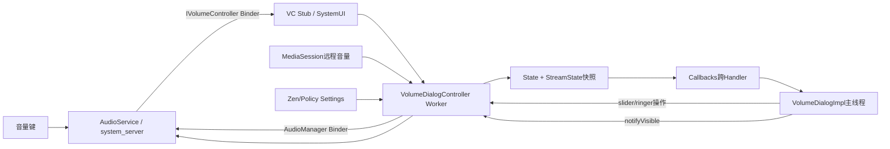
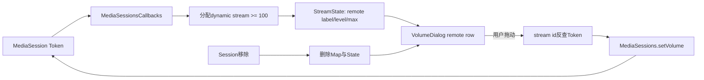
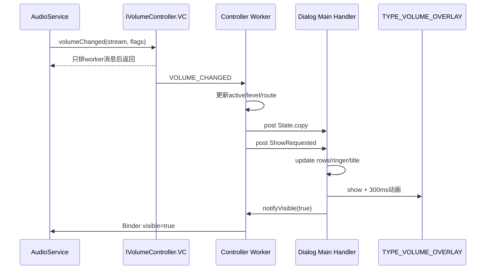

# 第 432 章 Android SystemUI VolumeUI：音量控制器、Stream状态与VolumeDialog

> 源码基线：Android 11 / API 30 / `android-11.0.0_r48`。本章只在macOS阅读源码，不编译。核心文件：`VolumeUI.java`、`VolumeDialogComponent.java`、`VolumeDialogControllerImpl.java`、`VolumeDialogImpl.java`、插件接口`VolumeDialogController.java`和system_server中的`AudioService.java`。

## 1. 本章要解决什么问题

按下音量键后，AudioService怎样通知SystemUI？为什么Controller既监听Binder回调又监听广播？active stream、level、mute、ringer mode与Zen分别是什么？拖动slider为何不立刻信任回调值？Dialog显示/消失又如何反过来影响AudioService的音量键政策？

## 2. 先记住三层架构

`VolumeUI/VolumeDialogComponent`负责启动与可替换UI装配；`VolumeDialogControllerImpl`是后台状态聚合和命令中介；`VolumeDialogImpl`只负责主线程View/Window。AudioService是音量事实与硬件/AudioPolicy执行端。

## 3. Controller注释就是阅读契约

类注释称它是volume dialog全部state/events的source of truth，不负责presentation；所有工作在专用background worker线程，名字以W结尾的方法必须在worker调用。实际源码有少数构造/字段更新例外，复读时要逐一辨认。

## 4. State不是单一volume值

它包含每个stream的level/min/max/muted/muteSupported/route，两个ringer mode、zen mode、effects suppressor、active stream以及四个DND disallow位。UI是这份结构化快照的投影。

## 5. Stream是什么

Android 11仍以MUSIC、RING、ALARM、VOICE_CALL、SYSTEM、NOTIFICATION、ACCESSIBILITY、BLUETOOTH_SCO等逻辑stream组织传统音量。AudioService可通过alias让多个stream共享底层音量，但SystemUI仍保留各行语义。

## 6. level与muted为何分开

Controller对本地stream读取`getLastAudibleStreamVolume()`作为level，另用`isStreamMute()`保存muted。被mute时最后可听音量可以仍为5；UI通过muted决定画0/静音图标，解除mute后恢复原level。

## 7. active stream是什么

它表示当前Dialog重点控制/展示的stream，不一定是正在播放声音的唯一stream。AudioService根据播放、建议stream、用户强制选择等确定；SystemUI拖动某行也会调用`forceVolumeControlStream()`暂时改变后续按键目标。

## 8. 进程边界

VolumeUI、Component、Controller、Dialog运行在SystemUI进程。`AudioManager`和`IAudioService`跨Binder进入system_server的AudioService；`IVolumeController`则反向从system_server回调SystemUI Binder Stub。远程媒体音量还经MediaSession服务到具体session/provider。

## 9. 线程边界

AudioService Binder线程调用VC Stub，VC只向VolumeDialogController worker排消息；worker查询AudioManager并构造State copy；Callbacks按每个订阅者指定Handler转发，默认VolumeDialog用main Handler更新Window和View。

## 10. 总体结构图



## 11. VolumeUI何时启用

读取`enable_volume_ui`与`enable_safety_warning`两个资源，只要任一为true就启动。即使普通音量Dialog关闭，只保留安全音量warning，也仍会注册Volume Controller，只是showUI gate不展示常规面板。

## 12. 两个enable怎样传下去

`setEnableDialogs(volumeUi,safetyWarning)`只是给Controller的两个boolean赋值。`mShowVolumeDialog`控制普通show request，`mShowSafetyWarning`控制安全警告callback；二者可以独立。

## 13. VolumeUI还做了什么副作用

注册前调用`DndTile.setVisible(true)`；VolumeDialogComponent构造配置时又`showDndTile(true)`；register再写combined icon true。第431章已确认combined值在DndTile当前渲染中未消费。

## 14. VolumeUI的mHandler是否使用

类中创建`new Handler()`但后续没有引用，是r48遗留字段。不能因它存在就说VolumeUI自己在Handler上调度；主要线程切换发生在Controller worker和Dialog main Handler。

## 15. Component为何允许插件替换Dialog

ExtensionController先接VolumeDialog plugin，再以`createDefault()`兜底。插件切换时destroy旧Dialog、保存新对象并init；Controller作为允许的plugin dependency继续提供同一State/命令协议。

## 16. 插件替换了什么没替换什么

替换presentation，不替换AudioService回调和Controller worker。插件可以决定布局与交互，但仍必须正确add/remove callbacks、通知visible并消费State；否则会影响系统音量键体验。

## 17. 默认Dialog的三个初始定制

把SYSTEM stream标为不important；开启automute；关闭旧silentMode hint行为。复读确认r48只保存`row.important`却没有任何读取，所以第一项当前无视觉作用；后两项分别影响level 0图标和silent/vibrate hint处理。

## 18. Component的VolumePolicy

包含volume-down进入silent、volume-up退出silent、silent时是否开启DND、vibrate-to-silent debounce。r48默认前三项false、debounce 400ms；Tuner三个Secure键可动态改变前三项。

## 19. Tuner初值回调的影响

`addTunable`会针对多个key回放，各次都以当前mVolumePolicy为基线构造新对象并调用AudioManager set policy。构造的`applyConfiguration()`和register也会设置policy，因此启动期可能重复写相等配置。

## 20. Component配置变化做什么

InterestingConfigChanges只关注font scale、locale、assets paths和UI mode；命中时让Controller callbacks发onConfigurationChanged。Controller自己的广播Receiver也监听系统CONFIGURATION_CHANGED，可能形成重复通知。

## 21. Controller构造就启动worker

创建并start HandlerThread，构造W；MediaSessions也绑定这个Looper。它不等`register()`才启动线程，Settings observer、广播receiver、ringer LiveData观察也在构造期就开始。

## 22. register真正增加什么

向AudioService注册`IVolumeController`、设置VolumePolicy、写DndTile visible，并初始化MediaSessions。setVolumeController若SecurityException只log并return，后续policy/media init仍继续。

## 23. AudioService的权限门

`setVolumeController`要求`STATUS_BAR_SERVICE`权限，普通App无法取代系统音量UI。服务比较Binder，相同对象直接return；新对象注册前先dismiss旧Controller并linkToDeath。

## 24. Binder死亡怎样处理

DeathRecipient确认死亡Binder仍是current controller后调用`setVolumeController(null)`。这再次走权限方法但此时在system_server内部；controller清空、visible重置，避免继续向死Binder回调。

## 25. VC Stub为什么不做重活

`volumeChanged()`、safe warning、layout、dismiss都只向worker发Message，快速返回AudioService Binder线程。这样跨进程回调不会因SystemUI查询全部stream或绘制View而长期阻塞system_server。

## 26. 构造时的setA11yMode是个例外

Controller直接调用自身VC的`setA11yMode()`，该方法先在调用线程写`mShowA11yStream`再向worker排callback。真实AudioService回调也可能在Binder线程写同字段，字段不是volatile；主要消费经消息传递，但严格内存模型仍值得审计。

## 27. 音量键先进入哪里

AudioService `handleVolumeKey()`只处理手机ACTION_DOWN，TV还区分adjust start/end；构造`FLAG_SHOW_UI | FLAG_PLAY_SOUND | FLAG_FROM_KEY`，再调用`adjustSuggestedStreamVolume()`选择目标stream并执行raise/lower/mute。

## 28. suggested stream不一定是最终stream

AudioService会考虑external volume controller、mUserSelectedVolumeControlStream、正在活动的音频、recent ring/notification和alias，最后得到streamType与resolvedStream。SystemUI收到的已是服务选定/alias后的stream。

## 29. 首次按键可能只唤出UI不调level

`VolumeController.suppressAdjustment()`在默认无播放stream、UI尚不可见时，可在long-press timeout内把direction置0，只保留show UI，方便用户先看到面板再选择；mute/unmute与single-volume设备例外。

## 30. visible反馈为何参与按键政策

AudioService内部VolumeController保存`mVisible`。Dialog show后通知true、dismiss开始通知false；suppressAdjustment据此决定首次按键是否应只展示UI。因此notifyVisible不是纯统计，而会改变后续输入行为。

## 31. AudioService怎样回调SystemUI

音量更新后`sendVolumeUpdate()`处理stream alias与TV/全音量设备flags，然后`mVolumeController.postVolumeChanged(streamType,flags)`调用IVolumeController。系统还可能发VOLUME_CHANGED广播，形成另一条事实通道。

## 32. TV为何可能清SHOW_UI

HDMI-CEC system audio或set-top box CEC volume控制启用时，真正音量UI可能由电视/外部设备负责；AudioService清`FLAG_SHOW_UI`，SystemUI仍可更新状态但不应弹本地Dialog。

## 33. SystemUI的shouldShowUI四道门

要求配置允许Dialog、flags含SHOW_UI；手机StatusBar可用时还要求wakefulness不是asleep/going-to-sleep且deviceInteractive。TV workaround没有StatusBar Lazy，只检查配置与flag。

## 34. AOD下为何不显示

即使音量回调带SHOW_UI，只要StatusBar判断设备不interactive或正在睡眠转换，showUI=false。Controller仍更新stream level，下一次Dialog展示可看到新事实，但不打断AOD。

## 35. onVolumeChangedW的处理顺序

算showUI/fromKey/hints；若showUI先更新active stream；读取last audible level；更新Bluetooth route；State有变化先回调onStateChanged；showUI再回调onShowRequested；最后处理vibrate/silent hint和事件日志。

## 36. State通常先于Show到主线程

C对同一个callback Handler依次post StateChanged与ShowRequested，所以单订阅者正常维持入队顺序，Dialog先拿到State再show。但不同Callback使用不同Handler时彼此没有全局顺序。

## 37. show request不要求State改变

即使level、active stream和route都没变化，只要showUI=true仍发onShowRequested。重复按到max/min可以延长/重新显示面板，而不需要伪造一个State变化。

## 38. fromKey只影响什么

当State发生变化且flags含FROM_KEY才记录EVENT_KEY。它不决定showUI；SHOW_UI flag和wakefulness才决定展示。程序调用带SHOW_UI但不带FROM_KEY也可显示面板。

## 39. 振动/静音hint是什么

AudioService可附`FLAG_SHOW_VIBRATE_HINT`或`SHOW_SILENT_HINT`。Controller转成callback；默认Dialog只有`mSilentMode=true`时才据此切ringer，默认createDefault把silentMode设false，所以r48常规路径忽略这两个hint。

## 40. active stream更新还会调用什么

本地stream小于100时传自身给`AudioManager.forceVolumeControlStream`；dynamic remote stream或-1映射为-1。它告诉AudioService后续硬件键暂时锁定哪个本地stream，Dialog消失时重置。

## 41. StreamState按需创建

`streamStateW(stream)`在SparseArray不存在时new。构造State各int默认0，只有`getState()`全量初始化min/max/mute/name；提前收到某个volume callback时可能先有一份字段不完整的局部StreamState。

## 42. getState做了什么全量扫描

遍历静态STREAMS，对每项读last audible level、min、max、mute、muteSupported、name与Bluetooth route；再更新external ringer、Zen mode/config、effects suppressor，最后无条件发完整State copy。

## 43. max为何至少为1

`levelMax = Math.max(1,getMax)`避免slider max为0导致映射除法/交互异常。它是UI防御值，不证明AudioService真实max一定至少1。

## 44. Dialog何时请求初值

`VolumeDialogImpl.init()`先构造Window/View并add callback，然后调用Controller.getState()向worker排GET_STATE。addCallback只立即回放Accessibility模式，不回放State，所以Dialog最初mState为null。

## 45. 初值到达前UI安全吗

许多update方法先检查mState或StreamState null；但若极早show request到来，Window标题等路径仍可能依赖active row state。正常Controller已运行且State/Show消息顺序降低风险，不能把它当严格原子初始化。

## 46. Binder与广播为何都监听level

IVolumeController携带show flags与目标stream，适合UI请求；VOLUME_CHANGED_ACTION携新旧level，适合事实补偿。两条链可能重复，update方法以“值是否真的改变”抑制多余State callback。

## 47. STREAM_DEVICES_CHANGED的特殊处理

先重查该stream Bluetooth route，再用flags=0调用`onVolumeChangedW`。后者不会show UI但会读level；外层又把返回changed与route changed合并，可能出现内部已经callback一次、Receiver末尾又callback一次的重复State通知。

## 48. 重复callback如何产生

`onVolumeChangedW`自身在changed时已经`mCallbacks.onStateChanged`并返回changed；STREAM_DEVICES_CHANGED receiver随后看到changed=true又调用一次。两次都会copy State并post主线程，是r48可确认的重复通知路径。

## 49. mute广播如何收敛

STREAM_MUTE_CHANGED_ACTION更新独立muted字段；若muted且属于RING/NOTIFICATION，还现场用RingerModeLiveData值更新internal ringer。level与mute广播到达顺序不同，UI通过两字段最终收敛。

## 50. masterMuteChanged为何没有效果

VC方法只打印debug，不排worker，也不在State中建master mute字段。AudioService仍可能回调它，但r48手机Volume Dialog状态模型不展示master mute。

## 51. ringer external与internal的区别

external是公共AudioManager视角，internal是AudioService内部真实模式，可能受Zen delegate/政策转换影响。Dialog的ringer图标与交互主要使用internal；Controller State同时保留二者用于诊断。

## 52. RingerModeLiveData怎样接入worker

Controller构造时`observeForever`两份LiveData；observer可能在其Handler线程触发，再`mWorker.post`更新State和callback。destroy时显式removeObserver，避免Singleton测试/替换泄漏。

## 53. 初始sticky为何特殊赋值

init若LiveData当前值非-1先直接写State；onChanged内部若`getInitialSticky()`又提前赋字段，再调用update会返回false，不发重复callback。设计目标是区分已有监听初值与新变化。

## 54. Zen mode从哪里读

SettingObserver在worker Handler上监听Global `ZEN_MODE`与`ZEN_MODE_CONFIG_ETAG`。前者更新int mode，后者通过NotificationManager Binder读取Consolidated Policy并计算四个disallow位。

## 55. Volume State为何不保存完整Policy

Dialog只需判断alarm/media/system/ringer行能否调整，所以Controller压缩成disallowAlarms/Media/System/Ringer。联系人、repeat caller、visual effects等不参与音量行UI，留在Zen系统中。

## 56. disallowRinger为何不是单一category

ringer控制notification、ring和system相关声音，因此调用`areAllPriorityOnlyRingerSoundsMuted(policy)`，只有相关优先声音全不能绕过DND才禁止ringer修改，不是只检查CALLS或REMINDERS某一位。

## 57. Effects suppressor如何进入State

监听`ACTION_EFFECTS_SUPPRESSOR_CHANGED`，读取NotificationManager ComponentName，加载应用label；包不存在时退回package name。它可解释“为何声音效果被某组件压制”，但不等同于Zen mode。

## 58. Controller的State回调为何copy

```java
final State copy = state.copy();
for (Map.Entry<Callbacks, Handler> entry : mCallbackMap.entrySet()) {
    entry.getValue().post(() -> entry.getKey().onStateChanged(copy));
}
```

worker继续修改稳定mState不会改变已投递帧，每个StreamState也深复制一级。

## 59. 所有callback得到独立copy吗

不是。一次onStateChanged只创建一个copy，再把同一对象交给所有订阅者；若某个callback修改State/StreamState，后执行的callback可能看到污染。插件API约定应把State当只读，但类型字段并未不可变。

## 60. Callback map有线程保护吗

没有同步或CopyOnWrite。add/remove通常在main，C方法多在worker遍历HashMap；插件切换、destroy与worker事件并发时理论上可见性/ConcurrentModification有风险。正常生命周期靠低并发和Handler顺序实践运行。

## 61. addCallback回放什么

把callback→Handler放入Map，然后同步调用该callback的`onAccessibilityModeChanged(mShowA11yStream)`，而且不经传入Handler。State不回放，调用线程也不统一，是插件实现必须注意的边界。

## 62. 同一callback重复add怎样

HashMap覆盖旧Handler，不产生两个条目。已经向旧Handler post但未执行的Runnable不会撤回；remove也只阻止未来遍历，不能取消已投递callback。

## 63. 本地slider命令如何回到AudioService

Dialog主线程调用Controller公开方法→排worker SET_STREAM_VOLUME→本地stream调用AudioManager.setStreamVolume(flags=0)→AudioService执行→后续Binder/广播事实回流。公开方法返回不代表音量已改变。

## 64. 为什么setStreamVolume不用SHOW_UI flag

Dialog已经可见，用户正在交互，不需要AudioService再请求show；flags=0也避免重复声音/系统提示。UI自己重排timeout并用requestedLevel维持交互平滑。

## 65. remote stream为何从100开始

MediaSessionsCallbacks为每个Token分配递增虚拟stream id，从100起与本地AudioSystem stream分离；StreamState标dynamic、min=0、max/current来自PlaybackInfo、label来自session。



## 66. 远程slider命令走哪条链

stream>=100时不调用AudioManager，而是按虚拟id反查MediaSession Token，再`mMediaSessions.setVolume(token,level)`。Token不存在只log warning，UI靠后续remote update确认。

## 67. remote id会复用吗

`mNextStream++`单调递增，remove Token时删State和Map但不回收id。SystemUI长时间存活、session频繁创建时id可持续增长，通常数量远小于int范围。

## 68. remote active stream怎样影响本地按键

`updateActiveStreamW(dynamicId)`调用forceVolumeControlStream(-1)，不把虚拟id传给AudioService；MediaSession自己的remote volume callback/策略负责硬件键目标。SystemUI只用dynamic id选择Dialog行。

## 69. remote移除时如何清理

从Map取id、删State；若它是active则设-1；发State callback。Dialog只有随后执行`updateRowsH/recheckH`才trim不在mDynamic中的row；非active remote被删且active不变时，这轮onStateChanged不调用updateRowsH，陈旧View可能留到后续recheck，显示期间也刻意不在updateRowsH里trim。

## 70. Bluetooth route只看什么

只对MUSIC检查传统A2DP、A2DP_HEADPHONES、A2DP_SPEAKER设备bit。r48这段不覆盖所有LE Audio、hearing aid或cast remote语义，路由图标是有限提示而非完整设备路由模型。

## 71. Dialog Window是什么类型

`TYPE_VOLUME_OVERLAY`，透明背景、NOT_FOCUSABLE、NOT_TOUCH_MODAL、SHOW_WHEN_LOCKED、WATCH_OUTSIDE_TOUCH、硬件加速。它可在锁屏上显示且不抢常规输入焦点，窗口外触摸可触发dismiss。

## 72. init传入windowType被使用了吗

`VolumeDialogImpl.init(int windowType,...)`没有把参数传给initDialog；initDialog固定`TYPE_VOLUME_OVERLAY`。Component恰好也传该类型，因此当前结果一致，但插件接口参数并非被默认实现真正泛化使用。

## 73. 默认有哪些本地行

非single-volume设备含accessibility、music、ring、alarm、voice call、Bluetooth SCO、system；single-volume只固定加music。defaultStream参与可见性；important虽由默认实现设置并可动态修改，但r48没有读取点，是无实际效果的残留字段。

## 74. active row找不到怎么办

先找与mActiveStream相等的row；找不到退MUSIC；再退列表第一项。dynamic State到达时会先创建对应row，因此正常remote active可被找到。

## 75. 哪些行通常可见

active row总显示；手机上Accessibility按a11y mode显示，若它active还保留previous row；default MUSIC在ring/alarm/call/a11y/dynamic active时作为陪衬显示。TV/leanback只显示active row。

## 76. Show请求到Window展示

Dialog callback运行在main Handler，`showH`清旧show/dismiss消息、重排timeout；配置过期则重建Dialog；刷新settings可见性；设置mShowing并`Dialog.show()`；记录事件；通知Controller visible=true并查询captions状态。

## 77. Show动画结束才算完成吗

Dialog.show只触发Window显示与300ms alpha/translation动画。Controller在动画开始后立即notifyVisible(true)，AudioService据此改变按键抑制政策；它不是“像素已完全可见”的ACK。

## 78. 重复show会怎样

每次都重排timeout并调用Dialog.show；已显示Dialog通常不会重复onShow动画，但mShowing保持true。它可以延长存活时间，不必产生State变化。

## 79. 默认timeout是多少

普通约3秒；安全警告或captions tooltip约5秒；hover约16秒，再交AccessibilityManager按内容类型给推荐时长。任何touch/accessibility event都会重排并报告userActivity。

## 80. userActivity最终去了哪里

Dialog→Controller worker合并USER_ACTIVITY消息→Component实现的Listener→KeyguardViewMediator.userActivity()。所以操作音量面板会延长屏幕/锁屏交互活动，而非只延长Dialog timeout。

## 81. Dismiss的时序陷阱

`dismissH`先把mShowing=false并启动250ms fade/translation，动画结束后再延迟50ms真正`Dialog.dismiss()`；但它在动画开始立刻`notifyVisible(false)`。AudioService认为UI隐藏时，屏幕上仍可见淡出像素约300ms。

## 82. notifyVisible(false)还清什么

Controller worker调用AudioManager notify；然后`updateActiveStreamW(-1)`并在变化时发State callback。forceVolumeControlStream也随之解除，后续按键重新由AudioService选择目标。

## 83. dismiss动画为何有mIsAnimatingDismiss

防止重复dismiss启动多个动画。若动画中又收到showH，它会设false、Dialog.show，但旧animator/end action是否完全取消取决于show路径；showH没有显式cancel旧mDialogView animator，存在交错审计点。

## 84. VC.dismiss有一个可确认的重复消息

```java
mWorker.obtainMessage(W.DISMISS_REQUESTED,
        Events.DISMISS_REASON_VOLUME_CONTROLLER, 0).sendToTarget();
mWorker.sendEmptyMessage(W.DISMISS_REQUESTED);
```

第二条arg1默认0，因此一次AudioService dismiss会发两次Dialog callback、原因还可能不同；Dialog的动画门抑制第二次视觉动作，但日志/回调仍重复。

## 85. CLOSE_SYSTEM_DIALOGS又怎样dismiss

Receiver在worker调用Controller公开`dismiss()`，该方法直接通过C发onDismissRequested，不再排W；callback被post到main。它与VC duplicate、screen off和timeout都可能竞争，最终靠Dialog主线程门收敛。

## 86. 配置变化为何先dismiss而不立即重建

Dialog callback执行`mDialog.dismiss(); mConfigChanged=true`，下次showH才initDialog重建。这降低隐藏期成本，但直接dismiss绕过自定义淡出和notifyVisible(false)；若配置变化发生在显示时，AudioService visible状态可能暂时不一致。

## 87. 这是复读出的真实可见性缺口

onConfigurationChanged没有设置mShowing=false，也没调用Controller.notifyVisible(false)。Window已dismiss而字段/AudioService可能仍认为visible，直到下次show或其他dismiss链修正；下一次show会因mConfigChanged重建并重置mShowing。

## 88. State到达Dialog后先做什么

若internal ringer从非vibrate变vibrate先请求heavy-click振动；保存新State；重建dynamic集合/新row；active变化更新行可见性并重排timeout；再逐row刷新、更新ringer区和Window title。

## 89. Dialog保存的是copy还是Controller原对象

C已创建copy，Dialog直接保存该copy。下次callback换成新对象，旧StreamState不会被worker突变；但同轮多个订阅者共享这份copy，仍有第59节的可变风险。

## 90. State与View更新时序图



## 91. Zen怎样禁用具体row

Alarms mode禁ring/system；Total silence禁ring/system/alarm/music；Priority按四个disallow位逐项判断。命中zenMuted时图标显示mute资源、icon disabled、slider disabled并显示DND小图标。

## 92. 为什么Total silence代码没有列Voice Call

UI这段zenMuted只明确判断ring/system/alarm/music，其他声音的真实拦截仍由Zen/AppOps执行。Volume row是否可拖和声音是否能播放是两层政策，不能用UI列表覆盖面推断底层允许。

## 93. ringer顶部区如何判断Zen

Alarms或Total silence必禁；Priority只有disallowRinger时禁。禁用时ringer icon disabled、DND icon显示；ringer mode仍保存在State，用于Zen结束后恢复显示。

## 94. row图标状态由哪些量合成

ring vibrate、ring silent、zenMuted、Bluetooth route、muted和automute level0共同决定资源。Bluetooth只对非ring路径有专用media bt图标；图标状态还用于Events和无障碍操作描述。

## 95. slider进度为何乘100

max/min设为level×100，`getImpliedLevel`把连续进度映射回离散level，给触摸留更细的轨迹空间。最终发给AudioService的仍是整数音量级，不是百分比。

## 96. 用户拖动时为何不接受外部回写

`row.tracking=true`时update slider直接return，避免Binder/广播旧值把手指下的thumb拉回。停止拖动后记录userAttempt，若事实未到再延迟RECHECK。

## 97. 一秒grace period做什么

可见row在用户操作后1秒内不把slider强行同步到State，给AudioService与广播时间收敛。到期排RECHECK；这是视觉防抖，不是命令重试，也不保证请求成功。

## 98. requestedLevel如何去重

每次用户映射到新level且与上次请求不同才setActive+setVolume，并记录requestedLevel；State level等于请求时清回-1。失败或被政策夹紧时，grace结束后UI回到实际State。

## 99. icon点击与slider不同

非ring行在min与lastAudible间切换；ring行依据internal ringer在normal/vibrate之间切，没vibrator时用level0模拟；顶部独立ringer按钮按normal→vibrate→silent→normal循环，并可能把ring level从0提到1。

## 100. ringer点击为什么先更新UI再发命令

顶部按钮调用`updateRingerH()`时mState尚未改，因此不一定立即显示目标；它还震动/Toast后向worker setRinger。最终LiveData callback返回新internal mode再刷新，仍以AudioService事实为准。

## 101. touch feedback的时间门

Dialog进入normal时可`scheduleTouchFeedback()`记录当前时间；Controller只有internal ringer更新到NORMAL且距离小于1秒才经IAudioService播放标准keypress effect。RemoteException静默忽略。

## 102. 安全音量warning是独立事件

AudioService调用`displaySafeVolumeWarning(flags)`，VC排worker；只有mShowSafetyWarning为true才转Dialog callback。VolumeUI可以关闭普通面板却保留这条安全UI链。

## 103. captions为什么也在Controller

Dialog含ODI captions入口。Secure `ODI_CAPTIONS_ENABLED`按USER_CURRENT读写；默认captions service组件是否enabled在worker查询后回调UI。它与音量level不是同一事实，但共享overlay入口。

## 104. Settings按钮为何不直接开完整Sound Settings

构造`Settings.Panel.ACTION_VOLUME`，dismiss面板、关MediaOutputDialog，再ActivityStarter启动系统Panel。只有当前用户setup完成且不在lock task模式才显示settings容器。

## 105. destroy边界

Controller destroy停止MediaSessions、Settings observer、receiver、Ringer observers并quitSafely worker；却没有显式`AudioManager.setVolumeController(null)`。AudioService保留Binder直到进程死/新controller注册，mDestroyed让VC回调早退。

## 106. Plugin切换不会destroy Controller

Extension切换只destroy旧VolumeDialog，Controller singleton继续监听Audio/Settings/MediaSessions。新Dialog init新增callback；若旧插件destroy未正确remove callback，会继续收到State，属于插件生命周期责任。

## 107. 多用户边界

captions用USER_CURRENT；Zen Global代表NMS当前active用户模式；ringer tracker由系统广播/Settings更新；Controller本身没有显式USER_SWITCHED receiver。依赖各事实源在切换时发变化，短时混合快照不能排除。

## 108. 错误处理边界

注册Controller捕获SecurityException；MediaSessions init也捕获；play sound忽略RemoteException；stream set方法多不返回结果；callback map异常未隔离。UI总体通过后续事实回流，而非端到端成功ACK。

## 109. 最常见的七个误判

误判：level就是当前发声值；active stream就是唯一播放流；volumeChanged必然弹UI；Dialog visible等于像素完全显示；mute等于level0；Zen只影响ringer；slider进度是百分比。七项都被r48分层实现否定。

## 110. 复读确认的四个r48缺口

VC dismiss重复发消息；STREAM_DEVICES_CHANGED可重复State callback；配置变化直接dismiss但不清visible/notify AudioService；C的HashMap跨main/worker无同步且同一State copy共享给多个callbacks。它们应被描述为源码边界，不等于每台设备必现故障。

## 111. 本章只读检查清单

能否画出双向Binder；能否区分level/muted/ringer/Zen；能否解释showUI gates和visible反馈；能否说明State copy跨Handler；能否追slider requested/grace；能否区分本地与remote stream；能否指出dismiss像素与AudioService visible的时间差。

## 112. macOS只读练习一：追音量键到VC Stub

只读定位AudioService的key flags、stream选择、sendVolumeUpdate和IVolumeController回调，标出两次Binder方向以及首按只显示不调整的suppress条件。

```bash
sed -n '1935,2080p' frameworks/base/services/core/java/com/android/server/audio/AudioService.java
sed -n '2970,3035p' frameworks/base/services/core/java/com/android/server/audio/AudioService.java
sed -n '730,835p' frameworks/base/packages/SystemUI/src/com/android/systemui/volume/VolumeDialogControllerImpl.java
```

## 113. macOS只读练习二：验证worker State聚合

阅读onVolumeChangedW、onGetStateW、SettingObserver和Receiver，制作输入→字段→callback表，并找出STREAM_DEVICES_CHANGED重复通知路径。

```bash
sed -n '430,680p' frameworks/base/packages/SystemUI/src/com/android/systemui/volume/VolumeDialogControllerImpl.java
sed -n '1040,1215p' frameworks/base/packages/SystemUI/src/com/android/systemui/volume/VolumeDialogControllerImpl.java
```

## 114. macOS只读练习三：追Dialog显示与消失

对照showH/dismissH与AudioService notifyVisible，画出Window开始动画、mShowing、visible Binder和真正Dialog.dismiss四个时间点，验证配置变化分支绕过了哪些步骤。

```bash
sed -n '675,785p' frameworks/base/packages/SystemUI/src/com/android/systemui/volume/VolumeDialogImpl.java
sed -n '7660,7710p' frameworks/base/services/core/java/com/android/server/audio/AudioService.java
```

## 115. macOS只读练习四：追slider与Zen行禁用

阅读updateVolumeRowH和SeekBar listener，回答zenMuted怎样计算、progress怎样映射整数level、tracking/grace/requestedLevel各解决什么问题，并区分本地与dynamic命令出口。

```bash
sed -n '978,1145p' frameworks/base/packages/SystemUI/src/com/android/systemui/volume/VolumeDialogImpl.java
sed -n '1385,1445p' frameworks/base/packages/SystemUI/src/com/android/systemui/volume/VolumeDialogImpl.java
sed -n '680,725p' frameworks/base/packages/SystemUI/src/com/android/systemui/volume/VolumeDialogControllerImpl.java
```

## 116. 练习参考答案的最短版本

AudioService正向回调VC，SystemUI反向用AudioManager发命令；worker聚合并copy State给main；show受flags/交互/资源门控制，visible反馈参与首按抑制；mute与last audible level分离；dynamic stream走MediaSession；slider用tracking和1秒grace等待事实回流。

## 117. 从一次音量键重新复述主链

按键→AudioService选择/alias stream并调level或只show→IVolumeController回调→VC排worker→更新State→copy投main→Dialog刷新row→show Window并notify visible→后续按键不再被首按政策抑制。

## 118. 从一次slider拖动重新复述主链

触摸进度→映射整数level→记录tracking/requested/userAttempt→Controller worker→AudioManager/MediaSession命令→服务事实通过Binder/广播返回→State copy→tracking期间不拉回、1秒grace后最终按事实收敛。

## 119. 本章最终结论

SystemUI音量面板不是AudioService的同步View，而是一个双向、异步、有多事实源的状态投影。理解它的关键是始终区分服务事实、worker快照、主线程视觉与visible反馈四层，并把本地stream、remote session、ringer和Zen分别建模。

## 120. 下一章衔接

下一章研究SystemUI媒体控制：MediaDataManager、MediaDeviceManager、MediaHost与QS媒体卡片，承接本章dynamic remote stream，但转向通知媒体会话、播放状态和输出设备投影。
