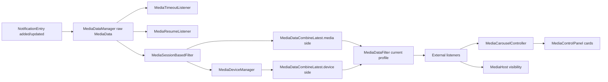
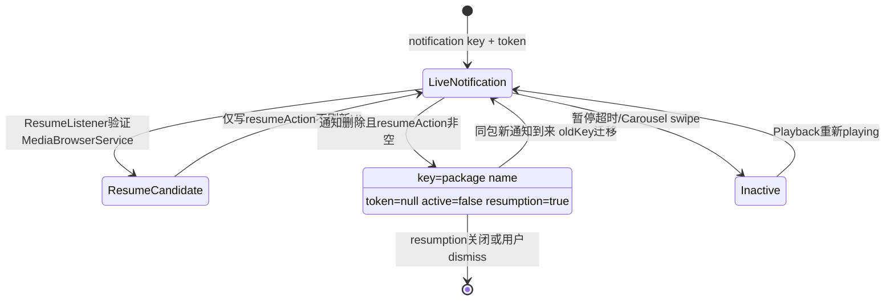
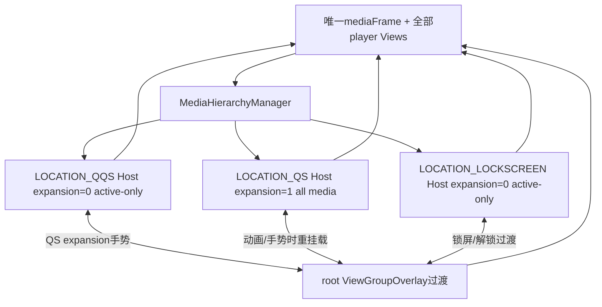

# 第 433 章 Android SystemUI MediaData：媒体通知、设备合流、恢复卡与多Host迁移

> 源码基线：Android 11 / API 30 / `android-11.0.0_r48`。本章只在macOS阅读源码，不编译。核心文件：`MediaDataManager.kt`、`MediaSessionBasedFilter.kt`、`MediaDeviceManager.kt`、`MediaDataCombineLatest.kt`、`MediaDataFilter.kt`、`MediaTimeoutListener.kt`、`MediaResumeListener.kt`、`MediaCarouselController.kt`、`MediaControlPanel.java`、`MediaHost.kt`和`MediaHierarchyManager.kt`。

## 1. 本章要解决什么问题

一条MediaStyle通知怎样变成QS媒体卡？为什么媒体信息和输出设备必须“等两边都到”才下发？通知删掉后为什么还能留下Resume卡？QQS、完整QS和锁屏究竟各有一份卡，还是同一份View迁移？暂停、超时、滑走和关闭session又分别删除什么？

## 2. 先拆三类身份

notification key标识通知实例；package name在resumption阶段充当稳定key；MediaSession.Token标识播放会话。三者可能一对多或发生迁移，不能都叫“媒体id”。

## 3. 再拆三类状态

`MediaData.active`决定QQS/锁屏是否展示；`isPlaying`是加载时对PlaybackState的快照；`resumption`表示没有活跃通知、只提供重新播放动作。active不等于playing，resume卡通常active=false。

## 4. 媒体卡不是通知RemoteViews

MediaDataManager从通知和MediaSession重新提取标题、艺术家、封面、操作、PendingIntent与包信息；MediaCarousel用SystemUI自己的`PlayerViewHolder`布局绑定。它不是把原通知行View移动进QS。

## 5. Android 11 r48功能开关

`Utils.useQsMediaPlayer()`在本基线直接return true；媒体QS卡总线固定开启。resumption读取Secure `MEDIA_CONTROLS_RESUME`，默认值代码为1，所以注释“off by default”与当前实现不一致。

## 6. 源码分层

DataManager负责原始数据与key；Session filter去重投屏本地session；DeviceManager追输出设备；CombineLatest合并；DataFilter按当前profile过滤；Carousel管理卡片；MediaHost/Hierarchy管理同一Carousel在多宿主的位置。

## 7. 进程边界

这些类运行在SystemUI。MediaController/MediaSessionManager经Binder访问system_server中的MediaSessionService和App session；LocalMediaManager/MediaRouter2Manager访问路由服务；图片Content URI可能跨ContentProvider；PendingIntent执行进入发布者目标。

## 8. 线程边界

通知入口和最终UI事件以main为主；封面/Package/MediaController数据加载用backgroundExecutor；session filter与device扫描也跨background/foreground executors；Carousel、Host、View绑定在main。多段executor使“一个事件”不再是单队列原子过程。

## 9. 为什么需要流水线而非单Manager

通知数据、session去重、设备route和用户profile的变化频率与线程不同。每层维护自己key缓存并发loaded/removed，最后对外只发布已经通过过滤且带device的MediaData。

## 10. 总体流水线图



## 11. 通知入口在哪里接入

NotificationMediaManager给NotificationEntryManager注册listener：pending entry added和pre-entry updated都调用MediaDataManager.onNotificationAdded。pending通知可能从未inflate，因此collection cleanup另行调用remove，避免LOADING残留。

## 12. 为什么在pending阶段就加载

QS媒体卡不依赖通知row inflation，可以更早开始封面与metadata加载。但这也要求通知添加后迅速取消的路径必须可靠移除，否则后台结果会晚到。

## 13. 什么才算media notification

必须`notification.hasMediaSession()`，且style恰为`Notification.MediaStyle`或`DecoratedMediaCustomViewStyle`。只有session token但非这两种style，DataManager会按removed处理，不进入QS player。

## 14. feature关闭时做什么

`useQsMediaPlayer=false`或通知不符合时直接`onNotificationRemoved(key)`。本r48开关恒true，但保留该分支方便产品回移旧通知媒体/锁屏封面逻辑。

## 15. 新通知先放LOADING占位

找不到旧entry时复制全局LOADING并写packageName，放进LinkedHashMap；它不立即通知外部。占位的意义是后台加载回来时用`containsKey`判断通知是否仍存在。

## 16. 何时按package找到旧entry

若同key不存在但Map中有packageName key，说明之前有resume player；把旧MediaData从package key移动到notification key，再后台加载实时通知。这使同一App的resume卡升级为live卡而不必先remove再new。

## 17. oldKey怎样表达迁移

load完成下发`key=new notification key, oldKey=packageName`。流水线各缓存可把旧key迁到新key，Carousel复用既有MediaControlPanel，减少闪烁并保留部分监听状态。

## 18. 同package多个通知的限制

`findExistingEntry`先查精确key，再只查单一package resume key。live通知仍各用notification key，但一个package只能有一个package-name resume槽；删除多个通知时后到迁移可能覆盖/更新已有resume卡。

## 19. background load提取token

从`Notification.EXTRA_MEDIA_SESSION`强转可空Token，MediaControllerFactory创建Controller，再取metadata/playbackInfo/state。`isMediaNotification`已要求hasMediaSession，正常应非空，但实现仍容许null路径。

## 20. 封面查找优先级

先metadata ART bitmap，再ALBUM_ART bitmap，再依次尝试ALBUM_ART_URI、ART_URI、DISPLAY_ICON_URI；仍无则退Notification largeIcon。背景色从最终可转Bitmap的封面palette计算。

## 21. URI安全边界

只接受content、android.resource和file scheme；无scheme或其他scheme直接null。ImageDecoder的IOException/RuntimeException被捕获。file URI读取权限与路径仍由进程权限决定，代码未下载http封面。

## 22. 非Bitmap Icon如何取色

loadDrawable后用intrinsicWidth/height创建Bitmap并Canvas绘制。若Drawable intrinsic size为0或负数，`Bitmap.createBitmap`可能抛RuntimeException；这一转换段没有局部catch，后台任务可能失败而留下LOADING占位。

## 23. 背景色为何统一压暗

palette选背景swatch后转HSL；极亮/极暗色先去饱和，饱和度乘0.8，亮度固定0.25，确保白字可读和卡片风格稳定。无有效封面使用DARK_GRAY。

## 24. App名和图标来源

用`Notification.Builder.recoverBuilder()`读取header app name；smallIcon直接loadDrawable作为卡片角标。异常未在这两步局部隔离，发布者资源异常也可能终止本轮后台load。

## 25. 标题与艺术家兜底

歌曲优先metadata DISPLAY_TITLE、再TITLE、再HybridGroupManager解析通知title；艺术家优先METADATA_ARTIST、再通知text。绑定View时再`safeCharSequence`，降低恶意Spanned对象风险。

## 26. action从哪里来

遍历Notification.actions，按发布包Context加载每个icon，PendingIntent包装成Runnable；actionIntent为null则Runnable null，UI会禁用按钮。最多View端显示5个，但MediaData可暂存更多。

## 27. compact action索引有何陷阱

EXTRA_COMPACT_ACTIONS保存原actions索引。遇到无icon action时代码从compact列表删原index，却把其余action压缩进新列表；后续原索引没有整体重映射，缺icon位之前/之后的compact指向可能与新actionIcons位置错位。

## 28. isLocalSession如何算

PlaybackInfo type等于LOCAL时true；Elvis默认true，因此playbackInfo null也按local。它影响Carousel排序与dismiss时是否向session发送stop。

## 29. isPlaying只是加载时快照

从Controller当前PlaybackState经`NotificationMediaManager.isPlayingState`计算，可为null。之后播放变化主要由TimeoutListener更新active，MediaData.isPlaying字段本身不会被MediaController callback持续改写，直到通知重新load。

## 30. clearable是什么

来自StatusBarNotification.isClearable，决定卡片guts的Dismiss按钮与Carousel在resumption关闭时是否可释放非playing资源。它不同于session是否能stop。

## 31. foreground提交前为何再查Map

后台完成后`onMediaDataLoaded`在main断言线程，只有`mediaEntries.containsKey(key)`才put并notify；通知已删除时丢弃结果，解决最常见的“删后旧任务复活”。

## 32. 但有没有load generation

没有。同notification key连续更新A、B，各自后台加载；只要key仍存在，较慢的A最后回主线程也会覆盖较新的B。containsKey只防删除，不防同key旧版本晚到。

## 33. LOADING会永久留下吗

若后台任务抛出未捕获异常，没有finally移除占位，也没有超时；Map可保留initialized=false的LOADING，且没有notify，所以外部看不到卡但dump能看到脏entry。

## 34. MediaData为何不是完全不可变

它是data class，但`active`、`resumeAction`、`isLocalSession`、`resumption`、`hasCheckedForResume`是var。Manager会原地改resume/active；同一对象跨listener共享，消费者应视作只读快照却没有类型强制。

## 35. setResumeAction是否通知UI

只在Map中找到entry后原地写resumeAction与hasCheckedForResume，不发loaded callback。这个字段主要为之后通知删除迁移resume卡准备，当前live卡无需因它刷新视觉。

## 36. internal与external listener区别

DataManager的internal listeners是自身依赖的Timeout、Resume和Session filter；外部`addListener`实际注册到末端MediaDataFilter。外部不会看到未做session/device/user处理的raw事件。

## 37. internal listener顺序是否严格串行

MutableSet按插入顺序通常是LinkedHashSet，DataManager依次调用Timeout、Resume、SessionFilter；但SessionFilter马上丢到background，后续device/combine是异步，所以完整流水线不是一个同步调用栈。

## 38. removal也经过pipeline吗

raw remove先同步通知三个internal listeners；Timeout销毁listener、Resume默认无remove实现、SessionFilter把remove排background；随后device/combine/filter才收到。不同key的load/remove顺序依赖同一backgroundExecutor是否串行。

## 39. Session filter解决什么重复

一个App投屏时可能同时有一个remote session和若干local session通知。若恰有一个remote controller且它也有通知，filter通常只保留remote卡，抑制该App冗余local卡。

## 40. 哪些情况不过滤

key迁移、没有唯一remote、当前info token就是remote、或remote token没有notification时都下发。只凭playbackType remote不足以删除local，必须确认remote也由通知代表。

## 41. local key何时发removed

被过滤时，如果该key累计tokens不包含remote token，说明local与remote用不同通知key，filter主动dispatch removed；若同key曾关联remote，静默丢本次local update以保留remote卡。

## 42. tokensWithNotifications何时清理

active session列表变化时retainAll当前controller tokens。通知remove本身不直接从该Set删token；若session仍active，token仍被认为“with notification”，名称略有误导，可能影响短窗口过滤。

## 43. TimeoutListener为每个key做什么

创建MediaController callback并读初始PlaybackState；非playing时安排10分钟timeout（可由`debug.sysui.media_timeout`覆盖），playing时取消timeout并把active恢复true。

## 44. null PlaybackState如何处理

被视为not playing，初始化时就安排timeout；虽然`dispatchEvents=false`不立刻发inactive，但延时任务仍会调用timeoutCallback。无state的session十分钟后从active host隐藏。

## 45. same key更新是否换Controller

不会。`onMediaDataLoaded`发现mediaListeners已含key就return，哪怕MediaData token已换。测试把“same key ignored”当现有契约；若App在同notification key换session token，timeout仍观察旧Controller，直到key迁移/remove重建。

## 46. key迁移如何复用Timeout listener

从oldKey Map移出，替换listener的MediaData和key；setter注销旧Controller并按新token注册。若迁移让playing从false变true，延迟到当前回调栈结束后再发timedOut=false，避免重入。

## 47. cancellation Runnable是什么

DelayableExecutor返回用于取消延时任务的Runnable；`expireMediaTimeout`调用它并清null。destroy同样注销MediaController callback和取消计时。

## 48. setTimedOut删除卡吗

不删除。它把MediaData.active设为`!timedOut`并以same key重新走loaded pipeline。QQS/锁屏host只看active会隐藏，完整QS允许all media仍可保留暂停/恢复卡。

## 49. swipe carousel做什么

MediaDataFilter遍历当前profile的userEntries，对每个调用setTimedOut(true)。它不是立刻remove所有Map entry，也不必stop所有session；完整QS是否仍显示取决于host showsOnlyActiveMedia和后续Carousel政策。

## 50. dismissMediaData与swipe不同

Dismiss针对单key：background若local session且token存在先transportControls.stop；foreground在delay后无条件`removeEntry(key)`。removeEntry即使key已不存在也仍发removed，可能删除同key后来新建的player。

## 51. delayed dismiss有generation吗

没有。用户点dismiss后等待guts动画，期间同key新通知重新load，延迟Runnable仍remove这个新entry。key被重用时存在“旧dismiss删新媒体”的竞态。

## 52. dismiss读取Map在哪条线程

backgroundExecutor直接读`mediaEntries[key]`，但该LinkedHashMap主要在main修改，没有同步。resumption加载失败也会在background直接remove placeholder；这两处打破“Map只在main”直觉，存在并发可见性风险。

## 53. ResumeListener如何判断App可恢复

live MediaData没有resumeAction且尚未检查时，用PackageManager查询MediaBrowserService，选该包第一个service；background创建ResumeMediaBrowser测试连接/最近曲目，成功才把restart Runnable写回Manager并保存Component。

## 54. 一个共享mediaBrowser的影响

Listener只有单个`mediaBrowser`字段，多entry并发检查、用户点击resume或新media loaded都会disconnect/覆盖它。旧browser callback又通过共享字段操作“当前browser”，可能断开更新的任务；r48没有per-key browser隔离。

## 55. 保存的组件如何分用户

SharedPreferences key后拼currentUserId，每个用户保存最多`MAX_RESUMPTION_CONTROLS`个flatten Component。队列add到尾、超限remove头，实际保留较新的尾部，注释“insert at front”与实现不符。

## 56. user broadcast边界

receiver监听ALL用户的USER_UNLOCKED/USER_SWITCHED。switch更新currentUserId并load prefs；unlock没有校验解锁的是currentUserId，后台其他用户解锁也可能触发当前列表重新加载。

## 57. 动态打开resumption是否补注册receiver

init只有初始useMediaResumption=true才注册user receiver/load prefs。Tuner后来从false切true只更新boolean和Manager，不补注册receiver或loadSavedComponents；从true切false也不注销receiver，是r48动态切换缺口。

## 58. 通知删除到Resume卡的迁移图



## 59. addResumptionControls从哪里来

用户解锁后ResumeListener遍历保存Component，用ResumeMediaBrowser找recent media；回调提供MediaDescription、Token、app PendingIntent和restart action，Manager用package name作为key异步构造一张inactive resumption卡。

## 60. resume描述不完整怎么办

title为空就在background记录错误并直接`mediaEntries.remove(packageName)`，不发removed callback。若外部此前已有对应卡或Map并发被新entry复用，UI与内部Map可能短暂不一致。

## 61. Resume卡有哪些字段

active=false、resumption=true、initialized=true、只有一个play action、compact index 0；token来自browser recent result，device起初null，resumeAction与appIntent保留，notificationKey设packageName。

## 62. 通知删除迁移具体改什么

旧MediaData复制为token=null、actions只剩resume、active=false、resumption=true、isClearable=true；package key put。保留原app/song/artwork/device/isPlaying等未显式覆盖字段，因此展示信息可能是通知删除时快照。

## 63. 已有同包Resume卡时

`put(pkg,updated)`覆盖旧值但migrate=false；先notify removed notification key，再notify loaded(pkg,pkg,updated)。不会发送oldKey=notification key迁移，Carousel会移除live卡并更新已有package卡。

## 64. 关闭resumption删哪些entry

过滤`!active`全部删除，而不只`resumption=true`。暂停超时形成的inactive live entry也会被删；每个都notify removed。

## 65. DeviceManager何时创建Entry

第一次key或token变化时stop旧Entry，创建MediaController可空和该包LocalMediaManager，存Map并start。same key同token的数据更新不会重启scan，也不重新发布device，Combine仍保留上一份device。

## 66. Entry.start的顺序

background注册LocalMedia callback、startScan、缓存playbackType、注册MediaController callback、updateCurrent，最后才`started=true`。current setter在started=false时条件`!started || value!=field`恒可发布一次初值。

## 67. stop后的迟到update有什么风险

stop先`started=false`再注销/停scan；但current setter的条件是`!started || changed`，所以已经停止的Entry若仍收到/执行迟到update，反而会发布device。通常callback注销降低概率，但并未用generation阻断。

## 68. controller route为何参与可信度

有Controller时先从MediaRouter2Manager取routing session；route为null就把current设null，转成enabled=false device data，禁用输出切换chip。没有Controller的resume/null-token Entry则直接信LocalMediaManager current device。

## 69. device null会卡住Combine吗

不会。`processDevice`总构造非null `MediaDeviceData(enabled=device!=null, icon?,name?)`；即使device null，Combine的device side已有对象，因此media+device齐全后仍下发，只是UI显示fallback。

## 70. CombineLatest怎样处理两边先后

Map值是`Pair<MediaData?,MediaDeviceData?>`；任一边到只更新自己，只有两者都非null才copy MediaData写device并notify。这样Carousel不会先显示无device版再抖一次，但设备链卡住会延迟整张卡。

## 71. key迁移时device如何带过去

MediaData side或device side收到oldKey!=key且旧entry存在，就remove旧Pair，把另一半搬到new key，再update(new,old)。两个异步分支都可能尝试迁移，contains判断让第二次退普通update。

## 72. remove为何只通知一次

MediaDataRemoved与Device onKeyRemoved都调用Combine.remove；第一次entries.remove成功才notify，第二次Map已无key静默。它把两条删除信号合并为单个外部removed。

## 73. DataFilter为何放最后

后台用户媒体仍需跑timeout、resume与device cleanup；只在最终外发时用`lockscreenUserManager.isCurrentProfile(userId)`过滤。这样切用户时可从allEntries重新投影，无需重新向App请求所有通知。

## 74. current profile不只单user

检查的是current profile集合，通常包含前台用户及其managed profile，而非严格`data.userId == currentUserId`。工作资料媒体是否显示还受锁屏/通知profile政策影响。

## 75. 用户切换如何重放

CurrentUserTracker回调post到main executor，确保NotificationLockscreenUserManager先处理广播；清userEntries并逐key发removed，再遍历allEntries，把新current profiles逐个loaded(oldKey=null)回放。

## 76. 为什么先clear再callback

listener在removed回调中若查询hasAnyMedia/hasActiveMedia，应看到已经清空的当前用户集合，避免半清状态。之后新用户loaded逐项重建。

## 77. Filter listener快照是否安全

`listeners`属性每次返回`_listeners.toSet()`，user switch还先保存copy；callback中增删不会影响本轮集合。DataManager internal listener遍历则没有显式copy。

## 78. Carousel怎样收到最终数据

构造时`mediaManager.addListener`，实际挂到DataFilter末端。loaded调用addOrUpdatePlayer；removed调用removePlayer。Host自身也作为external listener，仅用hasActive/hasAny重新算visibility。

## 79. 新卡创建步骤

Factory取MediaControlPanel→inflate PlayerViewHolder→attach SeekBar/MediaViewController→bind MediaData→设置listening→放入MediaPlayerData排序树→把所有player Views按排序重建到LinearLayout。

## 80. 更新卡是否复用View

`getMediaPlayer(key,oldKey)`支持key迁移复用同一Panel；bind新数据后重写MediaPlayerData sort key。若允许reorder立即removeAllViews/re-add；不允许则只标needsReordering，等VisualStability callback。

## 81. 排序规则

依次优先`isPlaying`、local session、非resumption、最近updateTime。每次MediaData update都赋当前时间，暂停卡频繁更新也可能改变同级顺序；nullable isPlaying的自然比较还需结合Kotlin comparator语义阅读。

## 82. TreeMap与View顺序可短暂不同

visual stability禁止重排时，MediaPlayerData的TreeMap排序已改变，mediaContent子View顺序仍旧；代码只检查数量相等，不检查顺序。等允许重排再统一。

## 83. 自动释放player的条件

loaded后`canRemove = isPlaying明确false，或isPlaying为null且clearable且inactive`；若resumption全局关闭，则移除View并dismiss underlying MediaData。若视觉稳定不允许，延迟key removal。

## 84. removePlayer为何可能stop session

默认`dismissMediaData=true`，Manager background对local token调用transportControls.stop再remove。Carousel收到pipeline removed也会再次dismiss同key；Map往往已无entry所以不stop，但仍会再发removed。尤其DataFilter因用户切换而发“投影removed”时，Carousel也无法区分，可能把仍在raw/allEntries的旧用户session真正stop/remove。

## 85. removed回流是否无限循环

removePlayer先从MediaPlayerData取到Panel才调用dismiss；重复removed时player已不在Map，removed为null，不再dismiss。因此通常一轮额外removed后停止。

## 86. MediaControlPanel bind哪些视觉

背景色、封面、App icon/name、song/artist、最多5个action、compact最多3个索引、输出chip、SeekBar、guts文案与dismiss。每次bind最后无条件refresh MediaViewController measurement。

## 87. 点击卡片怎样过锁屏

若click PendingIntent非null且guts未打开，ActivityStarter `postStartActivityDismissingKeyguard`。bind若新data clickIntent为null，源码没有清旧OnClickListener；复用Panel可能仍执行上一份PendingIntent，是r48复读边界。

## 88. action按钮复用边界

有action但Runnable null时只setEnabled(false)，没有清旧OnClickListener；disabled阻止常规点击。未使用按钮只在ConstraintSet设GONE，没有清drawable/listener；重新显示时bind会覆盖当前范围。

## 89. 输出chip怎样处理device

enabled=false显示fallback且隐藏chip；device非null显示icon/name；device null显示默认文案并隐藏icon。resumption会降低alpha并setEnabled(false)，即使device可用也不允许切输出。

## 90. Dismiss guts的null token日志风险

mKey正常时走Manager dismiss；只有mKey null才日志`data.getToken().getUid()`。resume data token可能可空，但正常bind总传非null key，所以该危险分支极少；测试/异常调用若key null且token null会NPE。

## 91. SeekBar如何追播放进度

background ViewModel注册MediaController callback，metadata duration>0才enabled；只有session支持ACTION_SEEK_TO才可seek。listening且非scrubbing且playing/快进/快退时每100ms估算position。复读发现callback用`STATE_NONE.equals(playbackState)`把int与对象比较，非null STATE_NONE不会clearController；初始update分支则正确比较`playbackState.state`。

## 92. 三个Host为何只有一份Carousel



## 93. QQS Host状态

expansion=0，只显示active media；因此暂停超时或resume卡不会让QQS host visible。它初始化LOCATION_QQS，Player约束最多显示compact actions。

## 94. 完整QS Host状态

expansion=1，showsOnlyActiveMedia=false，所以只要当前profile有任何entry就visible，包含inactive/resumption；设置按钮也只在非active-only host展示。

## 95. 锁屏Host状态

expansion=0、active-only、需要falsing protection；外层KeyguardMediaController还要求非bypass、状态为KEYGUARD/全屏用户切换且允许锁屏通知，双层决定最终MediaHeaderView visibility。

## 96. Host View如何计算visible

attach后监听DataManager末端事件，每次用`hasActiveMedia`或`hasAnyMedia`查询Filter userEntries；变化时设置UniqueObjectHostView VISIBLE/GONE并通知Hierarchy。未attach时init也先计算一次。

## 97. Host状态为什么要copy

MediaHostStateHolder任何measurement/expansion/visible等变化通知StatesManager；Manager比较后保存deep-ish copy，再先通知所有MediaViewController测量，后通知依赖尺寸的其他callback，避免持有可变Host原对象。

## 98. 三个Host是复制View吗

不是。Hierarchy每次从旧parent remove唯一`mediaFrame`，非动画时add到目标Host；动画/手势过渡时add到root overlay并手动设置bounds，结束后再挂到目标Host。

## 99. 目标位置怎样选择

非锁屏时QS expansion>0去QS，否则QQS；锁屏时expansion>0.4才去QS，否则在允许锁屏通知时去LOCKSCREEN。inactive导致锁屏Host invisible时改放QS，避免无意义锁屏动画。

## 100. 睡眠/Doze为何阻塞位置切换

goingToSleep或dozeAmount处于0到1动画时`blockLocationChanges`返回当前desired；结束后重新计算。唤醒未fullyAwake还可能暂留LOCKSCREEN，完成后无动画重挂，减少黑屏/Doze跳动。

## 101. Guided transformation是什么

QQS→QS且前后Host组合满足条件时，直接用`qsExpansion`作为0..1进度，插值两个Host bounds并让各MediaViewController插值约束；不另启动ValueAnimator，手指就是时间轴。

## 102. 非手势动画怎样进行

一般200ms，锁屏到QQS/反向用Shade动画时长和keyguard fading delay；mediaFrame放root overlay，ValueAnimator插值Rect，结束后apply desired state并重挂Host。

## 103. register同location有去重吗

mediaHosts数组直接覆盖槽；旧Host listener/view没有注销。正常DI保证每个location一个Host，重复register会留下旧Host与可见性listener，属于调用契约而非自防御API。

## 104. rootOverlay如何取得

第一个UniqueObjectHostView attach时从其ViewRootImpl root view取得overlay，并移除attach listener。若后续窗口/root发生根本替换，字段不会自动重取，跨display/窗口重建需额外审计。

## 105. MediaHost visibility listener能移除吗

只提供add，没有remove。Host/Panel通常进程长寿命；动态反复attach控制器时lambda会累积，重复触发Hierarchy或外层布局回调。

## 106. PageIndicator有一处重复赋值

`updatePageIndicatorAlpha()`连续两次`pageIndicator.alpha = alpha`，结果相同，是无害冗余。它提醒复读者不要把重复行误解为两阶段动画。

## 107. destroy边界

MediaDataManager.destroy只注销`context.registerReceiver`的package removed/restarted receiver，没有注销BroadcastDispatcher的packages suspended receiver，也不销毁Timeout/Resume/Session/Device pipeline。Singleton正常不调用destroy，但测试/替换时并非完整清理。

## 108. 包移除与暂停包怎样处理

ALL用户PACKAGES_SUSPENDED和package removed/restarted按packageName过滤Map并removeEntry。前者向BroadcastDispatcher传null executor，源码明确退`context.mainExecutor`；后者Context receiver未给Handler也在注册线程主Looper分发，因此满足removeAllForPackage的main断言。

## 109. 最常见的七个误判

误判：卡片就是通知View；active等于playing；通知删就必删卡；设备null会阻断Combine；三个Host各复制一套player；swipe等于stop所有session；containsKey足以防所有旧加载。r48源码均需更细分。

## 110. 复读确认的关键竞态

同key异步load无generation、delayed dismiss可删新entry、Map被background读写、Timeout same key不换token、Resume共享单browser、Device stopped Entry仍可迟到发布、profile投影remove可触发真实dismiss、Panel null clickIntent不清旧listener，以及SeekBar STATE_NONE对象比较错误。它们是代码级边界，不宣称每次必现。

## 111. 本章只读检查清单

能否画出raw→session→device combine→user filter；能否区分三种key；能否解释active/playing/resumption；能否追live↔resume迁移；能否说明Combine等待双方；能否证明只有一个mediaFrame；能否指出load/dismiss generation缺口。

## 112. macOS只读练习一：追通知加载与旧任务

阅读notification added、background load、foreground提交和removed迁移，画出同keyA/B两次更新顺序，并解释containsKey能防什么、不能防什么。

```bash
sed -n '185,360p' frameworks/base/packages/SystemUI/src/com/android/systemui/media/MediaDataManager.kt
sed -n '430,660p' frameworks/base/packages/SystemUI/src/com/android/systemui/media/MediaDataManager.kt
```

## 113. macOS只读练习二：追session、device与Combine

只读列出Session filter放行/过滤条件、Device Entry start/stop线程、Combine两侧缓存和一次性remove，说明route null为什么仍会产生非nullMediaDeviceData。

```bash
sed -n '55,220p' frameworks/base/packages/SystemUI/src/com/android/systemui/media/MediaSessionBasedFilter.kt
sed -n '35,235p' frameworks/base/packages/SystemUI/src/com/android/systemui/media/MediaDeviceManager.kt
sed -n '25,145p' frameworks/base/packages/SystemUI/src/com/android/systemui/media/MediaDataCombineLatest.kt
```

## 114. macOS只读练习三：追超时与恢复卡

阅读Timeout和Resume listener，制作playing→paused→timedOut→playing以及live notification→package resume→live迁移两张状态表，标出10分钟任务取消点和共享mediaBrowser。

```bash
sed -n '35,250p' frameworks/base/packages/SystemUI/src/com/android/systemui/media/MediaTimeoutListener.kt
sed -n '45,300p' frameworks/base/packages/SystemUI/src/com/android/systemui/media/MediaResumeListener.kt
```

## 115. macOS只读练习四：证明多Host是重挂载

阅读三个Host初始化和Hierarchy的updateHostAttachment/calculateLocation，画出QQS→overlay→QS；再写明各Host expansion、active-only和锁屏额外条件。

```bash
sed -n '90,120p' frameworks/base/packages/SystemUI/src/com/android/systemui/qs/QuickQSPanel.java
sed -n '240,260p' frameworks/base/packages/SystemUI/src/com/android/systemui/qs/QSPanel.java
sed -n '500,650p' frameworks/base/packages/SystemUI/src/com/android/systemui/media/MediaHierarchyManager.kt
sed -n '20,115p' frameworks/base/packages/SystemUI/src/com/android/systemui/media/KeyguardMediaController.kt
```

## 116. 练习参考答案的最短版本

通知key用于live、package用于resume、Token用于session；raw数据经casting filter和device combine再按profile外发；pause十分钟只把active=false；通知删除有resumeAction时迁package key；QQS/锁屏active-only、QS all-media；唯一mediaFrame在Host/overlay间迁移。

## 117. 从一条通知重新复述主链

pending通知→LOADING→后台提取metadata/art/actions→main提交→Timeout/Resume并行处理→Session filter→Device扫描与MediaData合流→current profile filter→Carousel创建Panel→Host visible→Hierarchy把唯一frame挂到当前QQS/QS/锁屏位置。

## 118. 从暂停到恢复重新复述支链

MediaController变非playing→安排10分钟→到期active=false并重放pipeline→QQS/锁屏隐藏、QS可保留→通知删除且已验证resume→改package key/token null/play action→用户点play→MediaBrowser prepare/play→新通知到来再迁live key。

## 119. 本章最终结论

Android 11媒体卡是一条多缓存、多线程、可迁key的派生数据管线；Carousel与三Host则是一套“唯一View、多个位置状态”的空间状态机。读懂它必须同时跟踪key、线程、active政策和View所有权，不能只盯一个MediaController。

## 120. 下一章衔接

下一章深入媒体输出切换：MediaOutputDialog、MediaOutputController、LocalMediaManager、MediaRouter2和蓝牙设备列表，解释本章MediaDeviceData背后的发现、连接、分组与UI状态。
