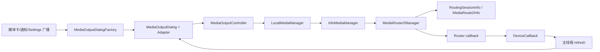
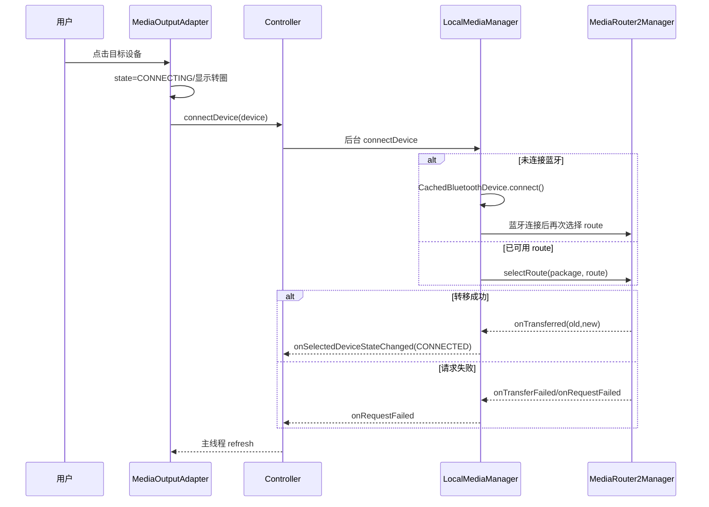
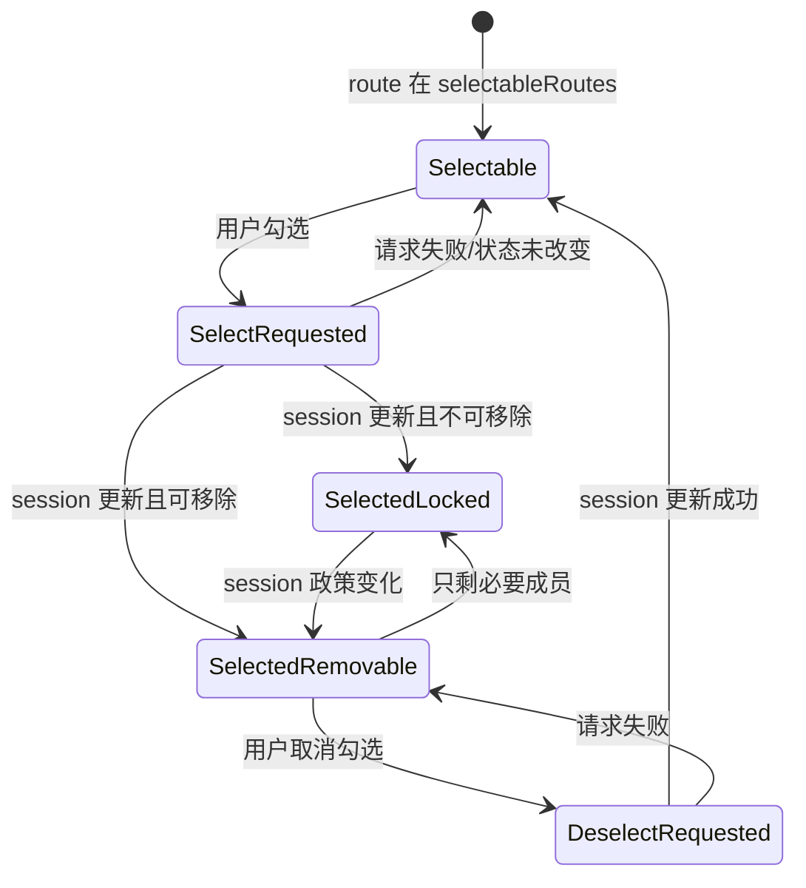

# 第 434 章 Android SystemUI Media Output Dialog：设备发现、路由切换、分组与音量

> 源码基线：Android 11 / API 30 / `android-11.0.0_r48`。本章只在 macOS 阅读源码，不编译。核心文件：`MediaOutputDialogFactory.kt`、`MediaOutputDialogReceiver.kt`、`MediaOutputBaseDialog.java`、`MediaOutputDialog.java`、`MediaOutputController.java`、`MediaOutputBaseAdapter.java`、`MediaOutputAdapter.java`、`MediaOutputGroupDialog.java`、`MediaOutputGroupAdapter.java`、`LocalMediaManager.java`、`InfoMediaManager.java` 与 `MediaDevice.java`。

## 1. 本章要解决什么问题

点击媒体卡或通知上的输出设备按钮后，SystemUI 怎样找到手机扬声器、蓝牙耳机和 Cast 设备？点一个设备是否就代表已经切换成功？“添加输出”为什么是另一种操作？设备音量和组音量又分别改了谁？本章把可见 UI、SystemUI 控制器、SettingsLib 聚合层和 framework 路由真相逐层拆开。

## 2. 先记住一句总原则

Media Output Dialog 是“路由控制面板”，不是播放器，也不是蓝牙设置页。它展示和请求更改媒体路由；真正的选择结果由 `MediaRouter2Manager`、`RoutingSessionInfo` 以及蓝牙连接状态异步回传。

## 3. 不要把四个动作混成“连接”

源码至少包含四类动作：连接一个尚未连接的蓝牙设备、把媒体 session 转移到另一条 route、向动态组中 select 一条 route、调节 route 或 session 的音量。它们都能改变声音去向，却使用不同 API 和不同成功证据。

## 4. 本章的四层对象

UI 层是 Dialog 和 RecyclerView Adapter；SystemUI 编排层是 `MediaOutputController`；SettingsLib 聚合层是 `LocalMediaManager`；framework 路由层是 `InfoMediaManager` 包装的 `MediaRouter2Manager`。读代码时应先判断当前变量属于哪一层。

## 5. 三种身份必须分开

`packageName` 指明为哪个 App 查询 routing session；`MediaDevice.getId()` 标识一条 route/设备；`RoutingSessionInfo.getId()` 标识一次路由会话。设备 id 不能代替 session id，package 也不必永久只对应一个 session。

## 6. 三种“当前”也不同

当前媒体 App 来自打开面板时传入的 package；当前连接设备是 `LocalMediaManager.mCurrentConnectedDevice`；当前被组 session 选中的设备则来自 `RoutingSessionInfo.selectedRoutes`。单设备展示与动态组展示不能只看同一个布尔值。

## 7. 进程边界

Dialog、Controller、Adapter 和 SettingsLib 对象都运行在 SystemUI 进程。`MediaSessionManager`、`MediaController`、`MediaRouter2Manager`、`AudioService` 以及蓝牙服务背后通过 Binder 进入 system_server 或蓝牙相关进程；界面点击不是在本进程直接搬运音频数据。

## 8. 线程边界

Dialog/View 在主线程；`InfoMediaManager` 给 Router 注册的是单线程 executor；Controller 把 `connectDevice()` 和 route 音量设置投到 SettingsLib background thread；路由回调再经 Controller 主线程 Handler 刷新 UI。源码没有把整条链做成一个同步事务。

## 9. 为什么必须区分请求与事实

用户点击后 Adapter 会立即把目标 `MediaDevice.state` 写成 `STATE_CONNECTING`，用于显示转圈并禁止继续点击；这只是 UI 的乐观状态。成功必须等 `onTransferred()` 最终让 `onSelectedDeviceStateChanged(STATE_CONNECTED)` 回到上层，失败则等 request-failed 回调。

## 10. 总体架构图

## 11. 入口一：QS 媒体卡

`MediaControlPanel` 绑定输出 chip 时设置点击监听，调用 `MediaOutputDialogFactory.create(data.packageName, true)`。这里的 `true` 表示 Dialog 可以位于 status bar 之上，并不是 route 是否远程或设备是否连接。

## 12. 入口二：通知 seamless transfer

`MediaTransferManager` 给含 `media_seamless` 的通知 View 安装点击监听，从通知行取 `StatusBarNotification.packageName`，同样调用 Factory。媒体卡与通知最终进入相同 Controller，但 package 的来源对象不同。

## 13. 入口三：Settings 广播

Manifest 导出 `MediaOutputDialogReceiver`，它接收 `ACTION_LAUNCH_MEDIA_OUTPUT_DIALOG`，从 extra 取 package 后调用 `create(package,false)`。`false` 会把窗口设成 `TYPE_APPLICATION_OVERLAY`，适合从状态栏层级之外发起。

## 14. Factory 为什么先 dismiss 旧面板

Factory companion object 只保存一个 `MediaOutputDialog?`。每次 create 先 dismiss 旧实例，再创建全新的 Controller 和 Dialog，防止两个主输出面板同时扫描并争用屏幕。

## 15. Factory 保存的并不是所有子面板

动态组 `MediaOutputGroupDialog` 是 Controller 直接 `new` 出来的，没有写回 Factory 的静态引用；组面板的返回动作又直接 new 主面板。于是 Factory 的引用可能仍指向早已 dismiss 的最初主面板，而不是屏幕当前可见的组面板或返回后主面板。

## 16. 一个容易漏看的 Receiver 缺口

Manifest 的 intent-filter 同时声明 LAUNCH 与 DISMISS 两个 action，但 Receiver 代码只有 LAUNCH 分支，没有调用 `factory.dismiss()` 的 DISMISS 分支。因此发送 `ACTION_DISMISS_MEDIA_OUTPUT_DIALOG` 在此版本不会关闭面板。

## 17. Dialog 构造函数就会 show

`MediaOutputDialog` 构造中创建 Adapter、按 `aboveStatusbar` 决定 window type，然后立即 `show()`。调用者不应再把“new 对象”和“显示对象”当成两个独立阶段。

## 18. BaseDialog 负责什么

它统一 inflate `media_output_dialog`、配置底部重力和系统栏 Insets、建立 RecyclerView、标题图标、Done/Stop 按钮，并把 Controller 生命周期与 Dialog 的 `onStart/onStop` 对齐。

## 19. 主面板与组面板的差异

主面板标题来自当前媒体 metadata，图标来自专辑或媒体通知，列表用于转移；组面板标题固定为 Add outputs，图标是返回箭头，列表第一行是 session 总音量，后续行是带 checkbox 的成员设备。

## 20. BaseDialog 生命周期闭环

`onStart()` 调 Controller.start，开始 session 观察与 route 扫描；`onStop()` 注销 MediaController 回调、停止 LocalMediaManager 与 Router 扫描并清 Controller 设备表。窗口不可见后不应继续为了这张 Dialog 长期扫描。

## 21. start 先找活动 MediaController

Controller 遍历 `MediaSessionManager.getActiveSessions(null)`，取第一个 packageName 相同的 controller，注册 metadata/playback callback。它按包匹配，不使用第 433 章 MediaData 中已经持有的 Token。

## 22. 同包多个 session 的选择不稳定

循环遇到第一个同包 session 就 break，没有按播放状态、时间或 token 精确匹配。一个 App 同时存在本地与 Cast session 时，标题和暂停关闭逻辑可能观察到“列表中的第一个”，不一定正是路由层最后一个 session。

## 23. 标题的来源与兜底

有 MediaController 和 metadata 时取 `metadata.description.title/subtitle`；标题取不到时用通用 Controls media 文案，subtitle 允许 null。标题只说明 Controller metadata，不证明 route 已建立。

## 24. 头图的优先级

先取 metadata description 的 icon bitmap，做圆角后变成 IconCompat；取不到则遍历当前用户活动通知，找同 package 且带 MediaSession 的通知 largeIcon。两边都无才隐藏头图。

## 25. 通知图标匹配会提前 break

遍历同包 media notification 时，如果碰到第一条匹配通知但 `largeIcon == null`，代码执行 `break`，不会继续找同包后续可能有 largeIcon 的媒体通知。因此它是“首个匹配通知的图标”，不是“任意可用图标”。

## 26. playback callback 为什么可能关闭面板

当 MediaController 状态变为 STOPPED 或 PAUSED，Controller 调 `onMediaStoppedOrPaused()`，BaseDialog 若正在显示就 dismiss。它没有等待 route session 是否还活跃，暂停也会直接关面板。

## 27. playbackState null 的风险

`onPlaybackStateChanged(PlaybackState playbackState)` 未判 null 就调用 `getState()`。Android callback 参数在 API 语义上可能为 null；若发生，r48 这里存在空指针风险。

## 28. metadata 回调只刷新头部吗

Controller 调 `onMediaChanged()`，BaseDialog 把整个 `refresh()` post 到主线程。refresh 不仅重画标题和头图，也可能 notify 整个 Adapter 并重算 Stop 按钮。

## 29. Dialog 为什么失焦就关闭

`onWindowFocusChanged(false)` 且仍 showing 时立即 dismiss。这让用户切换到别的窗口、系统弹层或某些认证界面后面板自动收起；失焦不是 route 失败信号。

## 30. 列表高度如何限制

GlobalLayoutListener 在设备列表高度超过资源 `media_output_dialog_list_max_height` 时直接把容器 layoutParams.height 改为上限。它只做最大高度裁剪，滚动仍由 RecyclerView 承担。

## 31. 设备扫描启动了两套 scan

Controller.start 先让 `LocalMediaManager.startScan()`，其内部又令 `InfoMediaManager` 注册 Router callback 并 refresh；Controller 随后还直接调用 `mRouterManager.startScan()`。前者是业务 callback 注册，后者请求主动发现，两者不是同一方法的重复调用。

## 32. InfoMediaManager 的 executor

Router callback 注册到 `Executors.newSingleThreadExecutor()`。同一 InfoMediaManager 的 route/session 回调可串行，但它既不是 SystemUI 主线程，也不等于 Controller 的 background executor。

## 33. 按 package 与不按 package 扫描的区别

package 非空时使用 `getAvailableRoutes(package)`，并根据该包 routing session 判断已选 route；package 为空时只遍历 `getAllRoutes()` 中的 system route。当前 Dialog 正常从媒体入口传包名，因此走包级可用路由。

## 34. route 怎样变成 MediaDevice

远程 TV、speaker、group 等包装成 `InfoMediaDevice`；内建扬声器、有线、USB、HDMI 包装成 `PhoneMediaDevice`；A2DP 与 hearing aid route 先用地址找到 `CachedBluetoothDevice`，再包装成 `BluetoothMediaDevice`。

## 35. 蓝牙 route 可能被丢弃

若 `CachedBluetoothDeviceManager.findDevice()` 返回 null，InfoMediaManager 不创建对应 MediaDevice。Router 层有 route 不等于 Dialog 一定能显示该蓝牙设备，SettingsLib 还要求本地蓝牙缓存可映射。

## 36. 最近断开的蓝牙设备从哪里来

LocalMediaManager 在列表中存在手机/有线本地输出时，额外读取 `BluetoothAdapter.getMostRecentlyConnectedDevices()`，挑已配对、当前未连接、支持 A2DP 或 hearing aid 的最多五台设备加入列表。

## 37. 为什么断开设备只在本地输出存在时加入

源码注释明确要求 phone output available 才追加 disconnected Bluetooth。这样“从手机声音切到最近耳机”有入口；纯远程场景不会无条件把历史蓝牙设备混入 route 列表。

## 38. 扫描结果如何确定当前设备

LocalMediaManager 优先使用 InfoMediaManager 识别的 current route；若为空，再遍历设备，先找 active 且 connected 的 A2DP/hearing aid，否则退 PhoneMediaDevice。远程 selected route 在 InfoMediaManager 构建时可先成为 current。

## 39. 首次列表怎样排序

LocalMediaManager 先用 `MediaDevice.compareTo()` 排序，考虑连接状态、类型、Fast Pair、车载、上次选择、使用次数和名称；Controller 第一次接收列表时又把 current connected device 强制插到索引 0。

## 40. 后续列表为什么尽量不跳动

Controller 按旧 `mMediaDevices` 的 id 顺序匹配新对象，保留已有项位置；新出现设备追加到末尾，消失设备自然不再加入。这样 route 属性刷新不会每次都按比较器重新洗牌。

## 41. buildMediaDevices 会修改入参

当新列表数量与保留列表不同，Controller 对 callback 传入的 `devices` 执行 `removeAll(target)` 再追加。LocalMediaManager 传的是新 ArrayList 副本，所以当前路径不破坏内部表；若未来调用方传不可变列表则会失败。

## 42. Controller 为什么用 CopyOnWriteArrayList

设备和组设备表可能由 Router executor 的 callback 更新、同时被主线程 Adapter 读取。CopyOnWrite 降低遍历时并发修改异常，但多步“匹配、clear、addAll”仍不是一个原子快照。

## 43. Device list callback 做什么

`onDeviceListUpdate` 先重建 Controller 顺序表，再直接调用 `mCallback.onRouteChanged()`；BaseDialog 把真正 refresh post 到 main。Controller callback 自身可能不在 main，因此不能在这里直接改 View。

## 44. 当前设备 API 允许 null

`LocalMediaManager.getCurrentConnectedDevice()` 标了 `@Nullable`。然而 BaseAdapter `isCurrentlyConnected()` 直接调用 current.getId，主 Dialog 的 Stop 可见性也把 current 直接传给 `isActiveRemoteDevice()`，后者继续调用 getFeatures；首次扫描尚未建立 current 时存在 NPE 窗口。

## 45. Zero mode 是什么

只有一个设备且它是 phone、3.5mm 或 USB-C 本地输出时，Controller 返回 zero mode；Adapter 在设备后追加 Pair new device 行。它不表示“零设备”，而是“只有本地输出，额外给配对入口”。

## 46. Pair new 为什么不是直接调用 Bluetooth API

点击后先 dismiss Dialog，再经 `ActivityStarter.dismissKeyguardThenExecute` 给 Settings 包发送 `ACTION_LAUNCH_BLUETOOTH_PAIRING`，并收起 Shade。SystemUI 把完整配对流程交给 Settings。

## 47. isActiveRemoteDevice 的判断

Controller 检查 route features 是否含 remote playback、remote audio/video 或 remote group playback。它按能力特征判断 Stop 按钮和 Add 图标，不只按 MediaDevice type。

## 48. 单设备路由切换时序图

## 49. 点击时先做了什么

Adapter 先检查任意设备是否 CONNECTING；若有则整次点击直接 return。否则播放旧焦点行到新行的动画，调用 Controller.connectDevice，然后把所点对象本地 state 标成 CONNECTING。

## 50. connectDevice 的返回值为何丢失

Controller 在后台调用 `LocalMediaManager.connectDevice(device)`，但忽略 boolean 返回值。如果设备已从扫描表消失、已经是 current 或调用不能发起，UI 仍可能保持 Adapter 先写的 CONNECTING，直到后续列表或失败回调纠正。

## 51. 未连接蓝牙要经过两段操作

如果目标是未连接且不 busy 的 BluetoothMediaDevice，LocalMediaManager 先保存 `mOnTransferBluetoothDevice`，调用 CachedBluetoothDevice.connect 并返回。等扫描发现它已连接后，再次调用 connectDevice，第二段才请求媒体 route 转移。

## 52. 蓝牙连接失败怎样发现

CachedBluetoothDevice 属性变化时，若待转移设备已不 busy 且仍未 connected，就标记 CONNECTING_FAILED、清待转移字段，并以 UNKNOWN_ERROR 分发 request failed。UI 随后显示“无法连接，请重试”。

## 53. 已经连接的 route 怎样切换

LocalMediaManager 会对旧 current 调空实现或子类实现的 disconnect，然后把目标设 CONNECTING。package 非空时执行 `device.connect()`，基类最终调用 `MediaRouter2Manager.selectRoute(packageName, routeInfo)`。

## 54. selectRoute 不等于 selectRoute(session,...)

单设备转移用 RouterManager 的 package 级 `selectRoute(package,route)`；动态组添加用 `selectRoute(RoutingSessionInfo,route)`。前者可能创建/转移该包会话，后者修改已经存在 session 的 selected routes。

## 55. 真正成功证据在哪里

`InfoMediaManager.RouterManagerCallback.onTransferred(oldSession,newSession)` 重建可用设备，找出 current id，再 dispatchConnectedDeviceChanged。LocalMediaManager 更新 current、标 CONNECTED，最终 Controller 记录 success 并刷新。

## 56. onTransferred 没有发送完整列表更新

该 callback 自己重建 `InfoMediaManager.mMediaDevices`，但只 dispatchConnectedDeviceChanged，不直接 dispatchDeviceListAdded。LocalMediaManager 的列表对象可能仍来自前一次扫描；后续 route-changed callback 通常会再 refresh，但两个通知不是一个原子事件。另一个边界是 callback 契约允许 `newSession` 在释放时为 null，而 DEBUG 日志直接调用 `newSession.getName()`，调试日志开启时存在空指针风险。

## 57. 失败会怎样标设备

LocalMediaManager 收到 request failed 后遍历全部设备，把所有当前 CONNECTING 的设备都改成 CONNECTING_FAILED，再分发失败原因。因为 UI 同时只允许一个 transferring，通常只有一台，但实现并未保存精确失败目标。

## 58. transferring 是怎么判断的

Controller 每次遍历自己的 `mMediaDevices`，任一 state 为 CONNECTING 就返回 true。它不是 Router session 的官方“正在转移”状态，而是 SettingsLib MediaDevice 对象上的临时字段。

## 59. 连接中为什么其他行都变简单

当 isTransferring 为 true，仅 CONNECTING 行显示粗体、转圈；其他设备全部改成不可聚焦的单行，而且不重新设置点击监听。RecyclerView 复用旧 listener 的风险由 onItemClick 内部再次检查 transferring 兜底。

## 60. 切换动画不是状态机

动画只在旧行 seekbar 可见、新行 title 可见时执行；否则直接 return。`mIsAnimating` 只是阻止 refresh 时 notify，并不能证明 route 请求仍在进行，route state 仍以 device.state 为准。

## 61. 动画参数 from 可能为空

`mConnectedItem` 只有绑定当前连接行或动态组行时才赋值；如果用户在该行尚未绑定、current 为空或列表状态异常时点击，`playSwitchingAnim(mConnectedItem,view)` 的 `@NonNull from` 实际可能收到 null，随后 `from.requireViewById` 会崩溃。

## 62. 连接失败行怎么重试

state 为 CONNECTING_FAILED 时显示两行布局和失败 subtitle，并重新给容器安装 `onItemClick`；下一次点击重新标 CONNECTING 并走同一请求链，没有额外重试计数或退避。

## 63. 未连接蓝牙名称的特殊显示

只有 Bluetooth type 且 `!device.isConnected()` 时，标题追加“已断开”状态，并用 secondary text color 给后缀着色。远程 route 不可用或连接失败不走这个标题逻辑。

## 64. 当前单设备为什么显示音量条

当没有用户音量限制、没有动态组且设备 id 等于 current id，行使用 focused 两行布局和 seekbar。非 current route 不显示音量条，避免用户在尚未选中的目标上误以为可直接调当前输出。这里没有清除 `mContainerLayout` 旧的点击 listener；RecyclerView 若把一个曾绑定非 current 的 holder 复用于 current，当前行可能残留切换点击入口，内部只能靠后续 current 检查或路由层兜底。

## 65. 用户限制检查了什么

Controller 同时检查 `DISALLOW_ADJUST_VOLUME` 是否有管理员强制项，以及当前用户是否有 base restriction。受限时不显示 current seekbar，连接中的行也不展示正常可调布局；但 route 点击本身没有在 Controller 统一禁止。

## 66. 设备音量怎样写到底层

SeekBar 的 `fromUser` 为 true 时，Controller 后台调用 `MediaDevice.requestSetVolume(progress)`，基类再调用 `MediaRouter2Manager.setRouteVolume(routeInfo,volume)`。这是 route 音量，不是 AudioManager 某个传统 stream 的 index。

## 67. 设备音量反馈从哪里来

Router route changed 会触发 InfoMediaManager refresh，创建含新 `MediaRoute2Info.volume` 的 MediaDevice，层层回到 Adapter；seekbar bind 时读取 `getCurrentVolume()`。本地先拖到某值并不是服务成功 ACK。

## 68. 拖动时为什么不全量刷新

BaseAdapter 在 onStartTrackingTouch 置 `mIsDragging=true`，BaseDialog.refresh 检测 dragging/animating 时跳过 `notifyDataSetChanged()`，避免 Router 音量回调重绑 View 干扰手指。停止拖动只清标记，没有主动补一次遗漏的刷新。

## 69. 停拖后可能短暂显示旧事实

若所有 route 更新恰在 dragging=true 期间到达，refresh 更新了头部和 Stop 按钮，却跳过列表 notify；onStopTrackingTouch 不刷新，需等下一次 callback 才重绑当前音量。这是 r48 的时序空窗。

## 70. SeekBar 的 min 与 max

代码把 min 固定 0，max 取 route 或 session 的 volumeMax。它没有检查 volume handling 是否 fixed，也没有处理 max 为负数；通常 framework 返回合法范围，但 View 层依赖上游契约。

## 71. 动态组何时出现在主列表

每次 `getItemCount()` 都查询 selected media devices；数量大于 1 时，在列表索引 0 插入一个 Dynamic Group 定制行，真实 device 从 position-1 开始，且 current 单设备不再被判为 `currentlyConnected`。

## 72. 动态组行展示什么

图标是 speaker group；标题优先 session name，为空时显示 Group；音量条调用 session volume API；末端 Add 图标进入 `MediaOutputGroupDialog`。它代表整个 RoutingSession，不代表某个物理设备。

## 73. 主列表 Add 图标出现条件

没有动态组时，只有当前设备且其 route features 表明 active remote，才显示 Add 图标；已有动态组时，组定制行显示 Add。手机扬声器当前输出通常没有这个入口。

## 74. Stop 按钮的主面板语义

主面板仅当 current device 是 active remote route 时显示 Stop；点击调用 `releaseSession()` 后立即 dismiss。它请求释放 routing session，不是向 MediaController 发 pause，也不等待 release 成功。

## 75. 组面板为什么总显示 Stop

`MediaOutputGroupDialog.getStopButtonVisibility()` 固定 VISIBLE。因此即使 session/route 数据处于异常状态，按钮仍会请求 release 并关闭，不根据 active remote 再判断。

## 76. releaseSession 选择哪一个 session

InfoMediaManager 用 `getRoutingSessions(packageName)` 的最后一个元素作为目标，再调用 RouterManager.releaseSession。代码假设列表非空；方法中的 `if (sessionInfo != null)` 并不能保护前面 `list.get(size-1)` 的空列表越界。

## 77. 为什么“最后一个 session”值得警惕

源码没有通过 MediaController.Token 或 UI 当前设备精确关联 routing session，只把列表最后一个当目标。多 session App 中，标题取活动 MediaController 的第一个同包项，而路由控制取 routing sessions 的最后一项，两种选择规则并不一致。

## 78. session 音量怎样处理

组行拖动调用 `adjustSessionVolume(int)`，最终是 `MediaRouter2Manager.setSessionVolume(info,volume)`；读取则用同一个 RoutingSessionInfo 的 volume/volumeMax。单设备 current 行则使用 route volume，两者不能互换。

## 79. 打开组面板为什么先 reset

组 Dialog 构造时先清 Controller 的 `mGroupMediaDevices`，再创建 Adapter。Adapter 构造立即调用 `getGroupMediaDevices()`，以 selected devices 加 selectable devices 构建初始稳定顺序。

## 80. selected、selectable、deselectable 的含义

selected 是 session 正在使用的 route；selectable 是 framework 允许加入该 session 的 route；deselectable 是当前已选且 framework 允许移除的 route。一个已选设备不一定可移除，例如最后或必要成员。

## 81. 组列表为何不直接使用扫描列表

它只展示 selected 与 selectable 的并集，排除与当前 session 无关、既不能加入也未被选择的设备。数据直接来自 RouterManager 基于 RoutingSessionInfo 计算的 API。

## 82. 组列表也保持旧顺序

Controller 用旧 group id 顺序匹配新 selected+selectable，新设备追加末尾，已消失项剔除。它返回同一个 CopyOnWriteArrayList 引用，Adapter 持有的列表会随 Controller clear/addAll 更新。

## 83. checkbox 的三种状态

selectable：未勾选且 enabled；selected 且只有一个，或不在 deselectable：勾选但 disabled；selected 且可 deselect：勾选且 enabled。disabled 不是设备不可用，而是当前 session 政策不允许移除。

## 84. 勾选设备做什么

监听到 checked 且设备仍在最新 selectable 列表中，调用 `addDeviceToPlayMedia()`；InfoMediaManager 再验证 session.selectableRoutes 包含该 route id，最后调用 `selectRoute(session,route)`。

## 85. 取消勾选做什么

只有 unchecked 且设备仍在最新 deselectable 列表才调用 remove；InfoMediaManager 先验证 `selectedRoutes`，然后调用 `deselectRoute(session,route)`。Framework 的 `MediaRouter2Manager.deselectRoute` 会再次同时检查 selected 与 deselectable，所以 UI 检查并不是最后一道防线。

## 86. add/remove 的 boolean 表示什么

返回 true 只表示代码接受请求并调用 RouterManager，不是成员已经加入或移除。Adapter 不读取这个返回值，也不在本地立即改 selected 集合；最终 checkbox 应由 session updated callback 刷新。

## 87. session updated 如何到 UI

Router callback `onSessionUpdated()` 只 dispatchDataChanged；MediaManager 映射为 device attributes changed，LocalMediaManager 再分发，Controller 调 onRouteChanged，BaseDialog 主线程 refresh 并重新查询 selected/selectable/deselectable。

## 88. 动态组状态图

## 89. checkbox listener 的绑定顺序

代码先 `setOnCheckedChangeListener`，再按事实调用 `setChecked`。RecyclerView 复用导致 checked 值变化时，绑定过程本身可能触发 listener；内部又查询最新 selectable/deselectable 做防护，通常会 no-op，但这是副作用式绑定而非纯渲染。

## 90. 组中每台设备也能单独调音量

无论 selected 还是 selectable，GroupAdapter 都给设备行显示 seekbar 并调用 route volume。也就是说一台尚未加入组但可选择的 route 仍可能呈现音量控制；是否实际可调依赖 route/provider 能力。

## 91. 组总音量与成员音量的关系

第一行 session seekbar 控整个 session；成员行 route seekbar 控具体 route。provider 可自行定义两者联动关系，SystemUI 没有在本地按比例计算或保持总量恒定。

## 92. 返回箭头不是返回旧 Dialog 实例

点击组面板头图先 dismiss 当前组面板，再 `new MediaOutputDialog`，复用同一个 Controller 并重新 start scan。它不是恢复之前隐藏的主面板，也没有更新 Factory 保存的引用。

## 93. Dialog 切换期间 Controller 的 stop/start

dismiss 会触发旧 Dialog.onStop，清设备表并停扫描；随后新 Dialog.show 触发 onStart，又清表、重新找 MediaController、重注册和扫描。两次生命周期异步交错时，旧 executor callback 仍可能晚到。

## 94. Controller 没有 generation 防迟到回调

stop 注销 callback 并清列表，但已经排入 executor 或 main Handler 的 route refresh 没有代际编号。旧 Dialog post 的 refresh 也没有检查 Controller 是否属于当前 Factory 面板，只依赖 View/Dialog 生命周期降低影响。

## 95. mCallback 会被新 Dialog 覆盖

同一个 Controller 从主面板进入组面板时，start(group) 将 `mCallback` 改成组面板；返回主面板又改回。若旧层回调晚到，Controller 会通知当前字段指向的新面板，而非发起扫描时的面板。

## 96. stop 没有把 mCallback 清 null

Controller.stop 注销扫描并清设备，却保留 Callback 和 MediaController 字段。迟到的 MediaController callback 仍可能访问旧/新 callback；正常 unregister 可阻止未来事件，但已在 Binder/Looper 队列中的事件不由此撤回。

## 97. start 没有先清 mMediaController

再次 start 时遍历活动 sessions；若没找到新的匹配，它不会把旧 `mMediaController` 设 null，随后“无 controller”判断也不会触发。复用 Controller 的组/主切换中，旧 session 对象可能继续被注册。

## 98. Router 扫描是全局能力还是本面板事实

Controller 注入的 `MediaRouter2Manager` 与 InfoMediaManager 内部通过 `getInstance(context)` 得到的通常是同一系统 manager，但职责不同：前者只 start/stop 主动扫描，后者注册 callback、查询 route/session 并执行请求。

## 99. start/stop scan 是否引用计数

代码每个 Dialog start 调一次、stop 调一次，没有在 Controller 层引用计数。主/组面板快速交替时，旧 stop 与新 start 的先后依赖 Dialog 生命周期；framework manager 必须正确承受重复扫描请求。

## 100. 用户切换边界

Controller 使用当前 SystemUI Context、`UserHandle.myUserId()` 检查音量限制，并从 NotificationEntryManager 取当前用户通知；它没有注册 UserTracker。Dialog 通常短暂存在，用户切换会通过窗口失焦/系统状态使其结束，但不是本类显式处理。

## 101. aboveStatusbar 真正控制什么

当值为 false，Dialog window type 改成 `TYPE_APPLICATION_OVERLAY`；为 true 时保留 SystemUIDialog 默认类型。名字描述 Z-order 场景，不是“是否从状态栏入口打开”的安全凭据。

## 102. Stop 与 Done 的完成语义

Done 只 dismiss，不改变 route；Stop 先发 releaseSession 请求再立即 dismiss。两者都不会等待 Router callback，因此“窗口关闭”不能用作 session 已释放的证据。

## 103. Factory.dismiss 的覆盖范围不足

它只 dismiss 静态保存的主 Dialog 并置 null。由于组面板与组返回后新主面板都未回写该字段，Volume Dialog 打开 Settings 时调用 Factory.dismiss，可能关不到用户实际正在看的媒体输出面板。

## 104. exported Receiver 的输入边界

Manifest 将 Receiver 设为 exported=true，未在该声明处配置 permission。外部可构造 launch action 与 package extra；Controller 会按该包查询活动 session 与 routes。SystemUI 仍受系统服务权限约束，但输入 package 并非天然可信。

## 105. LocalBluetoothManager 可空边界

Kotlin Factory 的 `lbm` 类型可空，却传给 Java Controller；InfoMediaManager 构建蓝牙 route 时直接解引用 `mBluetoothManager.getCachedDeviceManager()`，LocalMediaManager 的 active profile 查询也直接用它。正常 SystemUI 设备应注入实例，但无蓝牙/初始化异常路径缺少完整 null 防护。

## 106. getRoutingSessionInfo 的空列表问题

该方法无条件返回 `sessionInfos.get(sessionInfos.size()-1)`。add/remove/release/selected/selectable/deselectable/volume/name 都依赖它，所以“随后 if(info != null)”是假保护；没有 routing session 时会先抛 `IndexOutOfBoundsException`。

## 107. current null 的两处直接崩溃点

BaseAdapter 的 `isCurrentlyConnected(device)` 直接取 current.getId；主 Dialog 的 Stop visibility 调 `isActiveRemoteDevice(current)`，该方法直接取 device.getFeatures。首次 route 构建、route 消失或 transfer 短窗口都可能让 current 为 null。

## 108. MediaDevice equals 没有 hashCode

`MediaDevice` 重写 equals，以 id 相等判断，却未在同类中重写 hashCode。本章主要用 List.contains/removeAll，通常仍按 equals 工作；若未来放入 HashSet/HashMap，以相等对象替换可能违反集合契约。

## 109. current 比较有一处用引用相等

LocalMediaManager.connectDevice 用 `device == mCurrentConnectedDevice` 判断“已经连接”。扫描刷新常创建新的 MediaDevice 包装对象；虽然 id 相同，引用不同就不会命中这条快速返回，仍可能发起一次多余 route 请求。

## 110. 列表刷新不是完整事务

InfoMediaManager 重建 route 对象、LocalMediaManager 排序并追加断开蓝牙、Controller 保序、Adapter 再分别查询 current 和 session 三类列表。任何一层回调之间都可能看到来自不同瞬间的组合，UI 判断必须容忍短暂不一致。

## 111. 建议的源码阅读断点顺序

先从 Factory.create 进入 Dialog.onStart，再跟 Controller.start→LocalMediaManager.startScan→InfoMediaManager.refreshDevices；随后从 Adapter.onItemClick 进入 connectDevice，最后从 RouterManagerCallback.onTransferred/onRequestFailed 反向回到 refresh。组操作另从 checkbox listener 跟到 session select/deselect。

## 112. macOS只读练习一：定位打开入口

在终端执行只读搜索：`rg -n "MediaOutputDialogFactory|ACTION_LAUNCH_MEDIA_OUTPUT_DIALOG" frameworks/base/packages/SystemUI/src frameworks/base/packages/SystemUI/AndroidManifest.xml`。把媒体卡、通知和广播三个入口分别记下来，并确认各自传入的 `aboveStatusBar` 值。

## 113. macOS只读练习二：追踪一次路由切换

依次执行：`rg -n "onItemClick|connectDevice|onTransferred|onTransferFailed|onRequestFailed" frameworks/base/packages/SystemUI/src/com/android/systemui/media/dialog frameworks/base/packages/SettingsLib/src/com/android/settingslib/media`。用纸写出“UI 乐观 CONNECTING”和“Router 成功 CONNECTED”之间经过的类。

## 114. macOS只读练习三：核对动态组集合

执行：`rg -n "getSelectedMediaDevice|getSelectableMediaDevice|getDeselectableMediaDevice|selectRoute|deselectRoute" frameworks/base/packages/SystemUI/src/com/android/systemui/media/dialog frameworks/base/packages/SettingsLib/src/com/android/settingslib/media`。分别解释 selected、selectable、deselectable，避免把未勾选等同于不可用。

## 115. macOS只读练习四：验证本章陷阱

执行：`sed -n '75,120p' frameworks/base/packages/SettingsLib/src/com/android/settingslib/media/InfoMediaManager.java && sed -n '25,50p' frameworks/base/packages/SystemUI/src/com/android/systemui/media/dialog/MediaOutputDialogReceiver.kt`。确认 `getRoutingSessionInfo()` 的空列表假设，以及 Manifest 声明的 dismiss action 为什么没有 Receiver 处理分支。

## 116. 自测一：点设备后转圈说明成功了吗

不能。转圈来自 Adapter 本地写 `STATE_CONNECTING`；真正成功要看到 Router `onTransferred`，再由 LocalMediaManager 更新 current 并发 `STATE_CONNECTED`。若只观察 UI 点击代码，会把请求误当事实。

## 117. 自测二：添加输出和切换输出有什么区别

切换输出面向 package，把媒体转到另一 route；添加输出面向已有 RoutingSessionInfo，把 selectable route 加进 selectedRoutes，形成或扩展动态组。前者使用 package 级 selectRoute，后者使用 session 级 selectRoute。

## 118. 自测三：两个音量条分别控制什么

设备行调用 setRouteVolume，控制单条 MediaRoute2Info；Group 第一行调用 setSessionVolume，控制 RoutingSessionInfo。二者都异步请求 provider，SystemUI 不自行计算音频增益。

## 119. 本章结论

Media Output Dialog 的关键不是 RecyclerView，而是把 MediaController 的展示信息、MediaRouter2 的 route/session 事实、SettingsLib 的蓝牙补全和 SystemUI 的短生命周期 UI 合并起来。最重要的阅读纪律是始终分清 package、device、session，以及 connecting 请求、connected 回调和 selectedRoutes 事实。

## 120. 下一章预告与恢复点

下一章进入 SystemUI 的 MediaRouter/Seamless Transfer 外围：通知输出 chip 的设备名称更新、MediaDeviceData enabled 语义，以及媒体卡为什么会出现 fallback。若中途停止，从“第 435 章”继续；第 434 章已完成正文、源码引用与三幅调用关系图。
