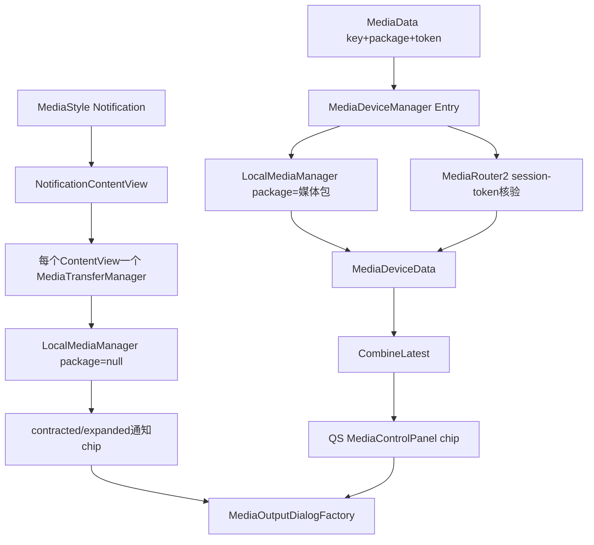
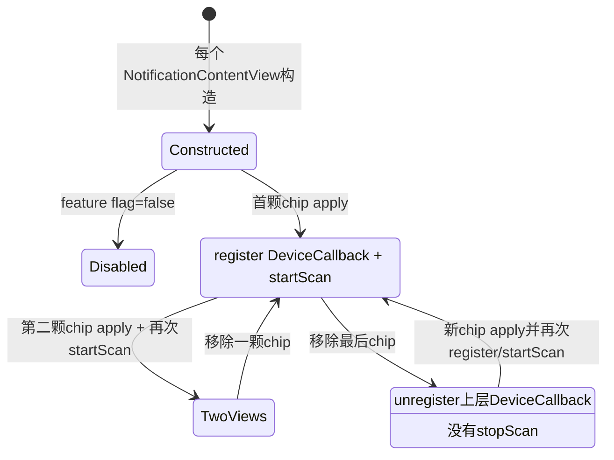
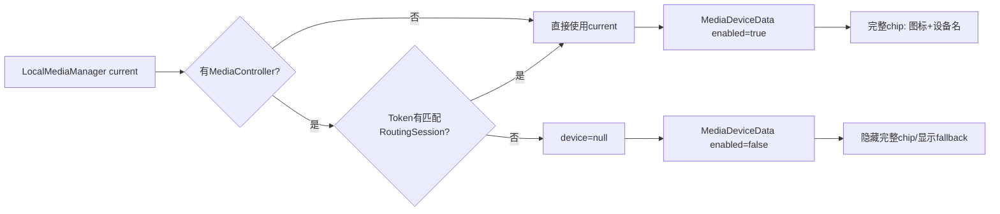

# 第 435 章 Android SystemUI Media Transfer：通知输出芯片、设备可信度与扫描生命周期

> 源码基线：Android 11 / API 30 / `android-11.0.0_r48`。本章只在 macOS 阅读源码，不编译。核心文件：`MediaTransferManager.java`、`NotificationContentView.java`、`MediaDeviceManager.kt`、`LocalMediaManagerFactory.kt`、`MediaControlPanel.java`、`MediaData.kt`、`FeatureFlagUtils.java`、`LocalMediaManager.java`、`InfoMediaManager.java` 与 `notification_material_media_transfer_action.xml`。

## 1. 本章要解决什么问题

第 434 章讲的是弹出的设备选择面板，本章追面板之前那颗“小芯片”：通知和 QS 媒体卡如何显示当前输出设备？为什么两处长得相似却不是同一套状态管理？设备名字是否可信？View 移除后扫描是否真的停止？

## 2. 先区分两套输出芯片

Android 11 r48 同时保留通知模板中的旧 seamless transfer chip，以及新 QS media player 中的 output switcher chip。旧芯片由 `MediaTransferManager` 管，QS 芯片由 `MediaDeviceManager→MediaDataCombineLatest→MediaControlPanel` 管。

## 3. 两套芯片最终打开同一个 Dialog

通知芯片从 Notification Row 取 packageName，QS 芯片从 MediaData 取 packageName；两者都调用 `MediaOutputDialogFactory.create(package,true)`。UI 入口不同，进入第 434 章后的路由选择面板相同。

## 4. 为什么仍要分开学习

它们的设备发现作用域、生命周期、线程、fallback 和 feature flag 都不同。只看到相同 Factory 调用就认为两者共享当前设备，会错过 r48 最重要的状态差异。

## 5. 旧通知芯片的作用域

每个 `NotificationContentView` 构造时都 new 一个 `MediaTransferManager`，而一个 NotificationContentView 通常管理同一通知的 contracted、expanded、heads-up 等子布局。因此 Manager 不是 SystemUI 全局单例。

## 6. QS 芯片的作用域

`MediaDeviceManager` 是媒体数据流水线中的注入对象，内部按 media key 建一个 Entry；每个 Entry 按该 MediaData 的 packageName 创建 LocalMediaManager，并把结果回写这一张媒体卡。

## 7. 三种“设备可信度”

旧通知 Manager 使用 packageName=null 的 system route 扫描结果；QS Entry 使用媒体 package 扫描结果；QS Entry 若有 MediaController，还要求 Router 能找到与 Token 匹配的 RoutingSessionInfo，否则主动把 device 置 null。三者可信范围逐级不同。

## 8. 进程边界

两套 Manager、NotificationContentView、MediaControlPanel 和 SettingsLib 都在 SystemUI 进程。Router、MediaSession、蓝牙与音频真相通过 framework API/Binder 获得；chip 更新只是在 SystemUI 画设备摘要。

## 9. 线程边界

通知 View apply/update 预期在主线程，但 LocalMediaManager callback 可能来自 InfoMediaManager 的单线程 executor；旧 Manager 直接在 callback 中遍历并修改 View。QS Manager 明确区分 bgExecutor 扫描/判断与 fgExecutor 发布，再由媒体 UI 主线程绑定。

## 10. 两套芯片总图



## 11. 旧功能默认是否开启

`FeatureFlagUtils.DEFAULT_FLAGS` 把 `settings_seamless_transfer` 设为字符串 `false`。因此没有 Global 设置或 system property override 时，通知模板的 MediaTransferManager 在 apply/setRemoved 入口直接 return。

## 12. FeatureFlag 读取优先级

先读 `Settings.Global[settings_seamless_transfer]`，再读 `sys.fflag.override.settings_seamless_transfer`，最后才用静态默认值。Global 非空就覆盖 property；这与只看 DEFAULT_FLAGS 的“永远关闭”不同。

## 13. 功能关闭仍会构造 Manager

NotificationContentView 构造器无条件 new MediaTransferManager；其构造器又立刻从 Dependency 取 Factory、LocalBluetoothManager，并创建 InfoMediaManager/LocalMediaManager。flag 只阻止后续 apply/scan，不阻止每条通知行分配这些对象。

## 14. 哪些通知会调用 apply

`NotificationContentView.applyMediaTransfer(entry)` 先要求 `entry.isMediaNotification()`；只有 media notification 才把 expandedChild 和 contractedChild 交给 Manager。普通通知虽然持有 Manager，却不会应用芯片。

## 15. Heads-up 是否应用旧芯片

当前方法只处理 bigContentView 与 smallContentView，没有把 headsUpChild 传给 apply。移除时也只对 expanded/contracted 调 Manager.setRemoved；heads-up wrapper 有自己的 removed 处理，但不在旧芯片视图表中。

## 16. 芯片来自哪里

framework 通知头布局 include `notification_material_media_transfer_action.xml`，根 LinearLayout 默认 GONE，内部有 `media_seamless_image` 与 `media_seamless_text`。SystemUI apply 时找到根 id 后才设 VISIBLE。

## 17. 为什么应用 RemoteViews 也能有它

它属于系统通知模板头，不是 App 任意自定义的一颗按钮。只有最终 inflate 的通知内容树包含内部 id，Manager 才能找到并接管；完全自定义布局或不含该模板时直接 return。

## 18. apply 参数 entry 实际有没有使用

`applyMediaTransferView(ViewGroup root, NotificationEntry entry)` 内没有读取 entry。packageName 不是 apply 时保存，而是用户点击时从 View 祖先重新找到 ExpandableNotificationRow，再取 row 当前 entry。

## 19. 为什么点击时再找 Row

通知可能更新并复用 View；晚取当前 row entry 能避免闭包一直持有旧 entry/package。但这依赖 chip 仍正确挂在 ExpandableNotificationRow 祖先下。

## 20. 点击链源码

```java
ViewParent parent = view.getParent();
StatusBarNotification sbn =
        getRowForParent(parent).getEntry().getSbn();
mMediaOutputDialogFactory.create(sbn.getPackageName(), true);
```

这段没有使用 apply 的 entry，也没有检查 `getRowForParent()` 是否返回 null。View 已脱离、转场临时挂到别处或层级不符合预期时可能空指针。

## 21. getRowForParent 怎么找

它从给定 parent 开始不断 `getParent()`，遇到 `ExpandableNotificationRow` 返回；走到 null 则返回 null。它不验证找到的 row 是否就是最初 apply 的那条通知。

## 22. 点击前检查 media_seamless 有何意义

`handleMediaTransfer(view)` 先在传入 view 自身再 find 一次同 id；理论上 listener 只装在 chip 根上，所以通常命中自身。这个检查不验证 feature flag、row、package 或 device 是否有效。

## 23. aboveStatusBar 为什么为 true

通知位于 Shade/SystemUI 窗口，打开 Dialog 时要求保持在状态栏层级上方，所以 Factory 参数为 true。它不是通知是否 heads-up 的标记。

## 24. 点击不会直接切设备

旧 chip 的 listener 只打开 Dialog，不调用 LocalMediaManager.connectDevice。当前 chip 上显示的设备只是摘要，真正选择仍发生在第 434 章 Adapter 与 Router 链。

## 25. apply 的第一层保护

flag 未开、LocalMediaManager 为 null 或 root 为 null 都 return。构造路径通常已经创建 LocalMediaManager；这个 null 判断更像遗留防御，因为字段在当前构造器中总会赋对象。

## 26. 找不到 chip 会怎样

root.findViewById 返回 null 就静默 return，不隐藏其他旧 View、不启动扫描，也不记录错误。于是功能支持依赖模板布局，而不是仅依赖 NotificationEntry 为 media。

## 27. 找到 chip 后先做什么

设 VISIBLE，覆盖 OnClickListener；若 `mViews` 尚不包含该 View 就追加。当列表从 0 变 1 时才向 LocalMediaManager 注册 DeviceCallback。

## 28. mViews 装的是哪些 View

对一条 NotificationContentView，通常最多放 contracted 和 expanded 两颗 chip；它不是全局所有通知的 chip 列表。类注释“over a set of notifications”容易让人误以为一个 Manager 跨通知共享。

## 29. contains 如何去重

ArrayList.contains 使用 View 的对象相等，View 默认是引用相等。同一子布局重复 bind 不重复添加；重新 inflate 得到新 View 则会被视为新项，旧项能否及时 setRemoved 决定是否残留。

## 30. 注册 callback 后为什么还 startScan

callback 只建立通知通道，不主动产生旧快照；startScan 会清 SettingsLib 设备表、注册 InfoMediaManager callback 并立即 refreshDevices，随后 onDeviceListUpdate 才给权威初值。

## 31. apply 每次都 startScan

无论 View 是否已存在、是否刚注册 callback，代码都调用 startScan。expanded 与 contracted 连续 apply 会对同一个 Manager 启动两次扫描；重复 bind 还会再次清表和 refresh。

## 32. InfoMediaManager callback 会重复注册吗

其基类 `MediaManager.registerCallback` 会先 contains，避免同一 callback 重复放进 CopyOnWriteArrayList；但 startScan 每次仍清 mMediaDevices 并同步重建/分发列表。

## 33. 旧 Manager 为什么传 packageName=null

构造时 `InfoMediaManager(context,null,null,lbm)` 和 `LocalMediaManager(...,null)`。InfoMediaManager 因 package 为空走 buildAllRoutes，只保留 `route.isSystemRoute()`，不是按某个媒体 App 查询可用远程 routes。

## 34. 这会显示怎样的当前设备

它更适合展示共享系统输出，如手机扬声器、有线、当前 active A2DP/hearing aid。App 专属远程 Cast session 不保证落在 system route 集合，因此旧通知 chip 的设备摘要可能不代表该通知媒体的远程 session。

## 35. 点击时 package 又恢复了

虽然摘要扫描不按包，点击打开 Dialog 时从通知 row 取真实 package。因此“chip 显示谁”和“Dialog 为谁列路由”可能使用不同作用域，不能由显示文字反推 Dialog session。

## 36. 初始 update 为什么可能显示默认文案

startScan 的 Router callback 异步，但 apply 紧接着读取 `getCurrentConnectedDevice()`。在 callback 尚未建立 current 前得到 null，updateChip 隐藏图标并显示 framework 字符串“切换输出”。

## 37. 随后怎样刷新成设备名

InfoMediaManager refresh→LocalMediaManager onDeviceListAdded→更新 mCurrentConnectedDevice→dispatchDeviceListUpdate。旧 Manager callback 再读 current，若与 mDevice 不同就 updateAllChips。

## 38. onDeviceListUpdate 为何忽略 devices 参数

列表本身只表示候选；当前摘要必须调用 LocalMediaManager.getCurrentConnectedDevice。参数保留在 callback 契约中，但 Manager 不用于排序、数量或图标选择。

## 39. equals 只比较什么

MediaDevice.equals 只比较 id。因此新的 route 包装对象如果 id 与旧 mDevice 相同，即便名称、图标、连接摘要或 route volume 已变化，条件认为没变，不会 updateAllChips。

## 40. 同设备属性变化会漏刷新

旧 Manager 没有 override `onDeviceAttributesChanged()`；onDeviceListUpdate 又以 id 相等抑制更新。蓝牙名称、电量相关图标或相同 route 的可见属性变化不保证刷新 chip。

## 41. selected callback 是否看 state

`onSelectedDeviceStateChanged(device,state)` 完全忽略 state，只在 id 不同或旧 mDevice 为 null 时替换并刷新。若 callback 代表失败或同 id 状态改变，它不会依据 state 改文案。

## 42. request failed 是否处理

没有 override onRequestFailed。旧通知 chip 不显示“连接失败”，失败反馈留给 Dialog；它只在 current device 真正变化时更新摘要。

## 43. 两颗 chip 怎样同步

`updateAllChips()` 遍历 Manager 自己的 mViews，对 contracted 和 expanded 逐个调用 updateChip。两颗 chip 各自按所在 Notification Row 的背景与 header icon 原色重新着色，但共享同一个 mDevice。mViews 是普通 ArrayList，主线程 apply/remove 与 Router executor 遍历没有锁或 CopyOnWrite 保护，存在并发修改边界。

## 44. callback 在哪条线程更新 View

MediaTransferManager 没有 Handler 或 main executor 跳转。InfoMediaManager 注册 Router callback 时使用单线程 executor，LocalMediaManager 又在该调用线程分发，所以 `updateAllChips()` 可能从后台线程直接读写 View，违反常规 UI 主线程约束。mDevice 也不是 volatile，apply 主线程与 callback executor 间没有明确可见性保障。

## 45. 为什么这个问题不一定立刻崩

Android 许多 View setter 不会每次都同步检查线程，真正触发布局/绘制时才可能表现异常；但“偶尔可用”不等于线程安全。源码缺少显式 main-thread marshal 是事实。

## 46. 旧 Manager 的扫描生命周期图



## 47. setRemoved 怎样找目标

它先重复检查 flag/manager/root，再从 root.findViewById 找 chip，调用 `mViews.remove(view)`。成功后若 size 变 0，只 unregister MediaTransferManager 的 callback。若功能在 apply 后被动态关掉，setRemoved 会因 flag=false 提前 return，连这一步账本清理也不会执行。

## 48. 最后一个 View 移除后漏了什么

代码没有调用 `mLocalMediaManager.stopScan()`。InfoMediaManager 的 Router callback、其 executor，以及 disconnected Bluetooth 的 CachedDevice 属性 callback 可能继续存活，只是不再把变化通知到已注销的上层 Manager。

## 49. unregister callback 不等于 stop scan

前者只从 LocalMediaManager.mCallbacks 移除 MediaTransferManager；后者才 unregister InfoMediaManager callback、停止 router observation 并注销断开蓝牙设备属性监听。两个 API 处在不同层级。

## 50. 每条通知都可能独立扫描

因为每个 NotificationContentView 各有 Manager/LocalMediaManager，多条媒体通知在 flag 开启时各自 register Router callback、refresh route 并维护断开蓝牙列表。它们没有中央共享扫描结果。

## 51. 行移除后资源会自动随对象回收吗

不一定。InfoMediaManager callback 被 MediaRouter2Manager 持有，CachedBluetoothDevice 也可能持属性 callback；只要 stopScan 未注销，这条引用链就可能继续保留 LocalMediaManager/InfoMediaManager，而不是单凭 NotificationContentView 不可达就回收。

## 52. 再次 apply 会怎样

若原 Manager 尚在且 mViews 从 0 变 1，会重新 register 上层 callback；随后 startScan 再注册已存在的下层 callback（基类去重）并 refresh。它没有先 stop，所以扫描生命周期不是严格 0→1/1→0 配对。

## 53. setRemoved 找不到 View 的日志

若 root 内没有 chip，`view` 为 null，mViews.remove(null) 通常 false，于是记录“Tried to remove unknown view null”。apply 对无 chip 静默，remove 对同样情况却报 error，行为不对称。

## 54. 重复 remove 的结果

第一次从 mViews 成功删除，第二次找同一对象会进入 unknown view 错误。方法没有把 View listener 清空或设 GONE，只维护账本和 callback。

## 55. View 被替换的风险

若通知重绑产生新 contracted/expanded child，而旧 child 未先走 Manager.setRemoved，新 View 会追加，旧 View 仍留在 mViews。之后 device change 会更新一个可能已经 detached 的旧 chip。

## 56. updateChip 先取哪些颜色

它从 chip 的祖先找 ExpandableNotificationRow，再取 notification header original icon color 作为前景，取 row current background tint 作为背景。不同主题、展开态或动态背景可让两颗 chip 使用不同颜色。

## 57. updateChip 的层级空值风险

`getRowForParent` 的返回值没有 null 检查，随后立刻 `enr.getNotificationHeader()`。mViews 中残留 detached View 时，后台 device callback 正好更新，就可能在这里 NPE。

## 58. 背景 Drawable 有哪些强假设

源码把根 View 强转 LinearLayout，把 background 强转 RippleDrawable，再把第 0 层强转 GradientDrawable。只要产品 overlay 替换布局或 drawable 结构，这些 cast 就可能 ClassCastException。

## 59. 为什么动态改 stroke 与 fill

通知背景会随 row tint、主题和状态变化；chip 要用 header icon 原色画 2px 边框，并用当前 row 背景填充，避免系统模板静态资源与现场颜色冲突。

## 60. Drawable 是否 mutate

代码直接取得 RippleDrawable 内的 GradientDrawable 并 setStroke/setColor，没有显式 mutate。View inflation 通常会得到可独立状态的 Drawable，但若 ConstantState 共享未正确隔离，直接修改可能影响其他实例。

## 61. 有设备时怎样画图标

调用 `mDevice.getIcon()`，显示 ImageView、设置前景 tint。若 Drawable 是 SettingsLib `AdaptiveIcon`，先把其背景层改成通知 row 背景色；否则直接 setImageDrawable。

## 62. AdaptiveIcon 的背景修改会做什么

它给 LayerDrawable 第 0 层设 color filter，并把颜色写进自定义 ConstantState。MediaTransferManager 在将它放进 View 前改色，使设备图标底板与通知背景协调。

## 63. 为什么 QS 使用 iconWithoutBackground

MediaDeviceManager 构造 MediaDeviceData 时读取 `device.iconWithoutBackground`，QS media card 有自己的 chip 背景和视觉系统；旧通知 Manager 使用 `getIcon()` 的高级/自适应背景，再针对通知 tint 做处理。

## 64. device 为 null 时怎样复位

隐藏 icon，文字设为系统“切换输出”。但它不清 `iconView` 里旧 Drawable，只把 visibility 设 GONE；稍后重新显示时正常分支会覆盖，若其他代码单独改 visibility 则可能露出旧图。

## 65. 非 AdaptiveIcon 是否保留颜色

ImageView 先统一设置 imageTintList，所以普通 Drawable 会被前景色着色。AdaptiveIcon 也在同一 ImageView 上，除了内部背景设置，还可能受 ImageView tint 整体影响，具体视觉取决于 Drawable/tint 实现。

## 66. 为什么 entry 参数没参与颜色

颜色来自现场 Row/Header，不从 NotificationEntry 保存字段读取。这样同一 entry 的 contracted/expanded View 在不同状态下可按各自实际容器着色。

## 67. 旧 chip 是否展示连接中

不展示。它只有 current device 图标+名称或默认“切换输出”，没有 progress、failed subtitle、selected group count；这些交给 Dialog。

## 68. 旧 chip 是否可禁用

Manager 没有依据 resumption、用户限制、routing session 可信度设置 enabled。只要 flag 开、模板存在，它就 VISIBLE 且 listener 可点击。

## 69. 当前设备变化判断为什么太粗

id 变化才刷新能减少扫描期间重复 bind，但也把“同 id 新对象携带新 icon/name”当作无变化。更稳妥的模型应比较实际展示字段，或在 onDeviceAttributesChanged 无条件重绑。

## 70. 旧 Manager 没有 dump

不像 MediaDeviceManager 注册 Dumpable，它没有 dump 当前 mViews、mDevice、callback 或扫描状态。诊断通知 chip 不更新时只能借助 SettingsLib/Router 日志、View 层级和源码推演。

## 71. 现在进入 QS MediaDeviceManager

它监听 MediaDataManager 的 loaded/removed，为每个媒体 key 建 Entry。Entry 同时观察 LocalMediaManager 的设备变化和对应 MediaController 的 PlaybackInfo，最后发布 `MediaDeviceData(enabled,icon,name)`。

## 72. key 与 token 的重建规则

oldKey 迁移时先 remove/stop 旧 Entry；当前 key 不存在或 token 不同才 stop 并 new Entry。same key、same token 的 MediaData 更新不会重建 LocalMediaManager，即使其他字段发生变化。

## 73. packageName 更新的隐患

Entry 是否复用只比较 token，不比较 data.packageName。理论上 same key/token 却 package 字段改变时，已有 LocalMediaManager 仍按旧 package 扫描；正常 token 归属使这种情况少见，但条件本身未校验。

## 74. 每个 Entry 也有独立扫描

LocalMediaManagerFactory 为 package 创建新的 InfoMediaManager 和 LocalMediaManager。多张媒体卡意味着多个 Router callback/scan，而不是所有卡共享一个 route observer。

## 75. Entry.start 的执行顺序

在 bgExecutor：注册 Local callback、startScan、缓存 playbackType、注册 MediaController callback、updateCurrent，最后才 `started=true`。初次 update 发生时 started 仍 false。

## 76. current setter 的特殊条件

```kotlin
private var current: MediaDevice? = null
    set(value) {
        if (!started || value != field) {
            field = value
            fgExecutor.execute { processDevice(key, oldKey, value) }
        }
    }
```

未 started 时无论 value 是否相同都发布，保证启动初值；但 stop 后迟到 callback 也满足 `!started`，反而继续发布。

## 77. Local current 为什么还不够

LocalMediaManager 可能给出系统 active 蓝牙/手机设备，但该媒体 Token 未必对应一个有效 routing session。QS Entry 有 controller 时再调用 `getRoutingSessionForMediaController(controller)` 作可信门。

## 78. route 变量实际是什么

`val route = mr2manager.getRoutingSessionForMediaController(it)` 的局部名叫 route，类型其实是 RoutingSessionInfo。这里只检查 session 非空，没有检查 LocalMediaManager current id 是否在该 session selectedRoutes。

## 79. session 存在时如何处理

只要匹配 RoutingSessionInfo 非空，就接受 LocalMediaManager 当前 device；session 为空则 current=null，意图是禁用输出 switcher。它是“一道存在性门”，不是 route-device 精确关联验证。

## 80. 没有 controller 时为何信 LocalManager

resumption card 或 token 为空的 MediaData 无法做 session-token 匹配，代码直接使用 local current。这样仍可提供设备摘要，但 MediaControlPanel 会对 resumption chip 另行 disabled。

## 81. playbackType 缓存做什么

start 读取 controller.playbackInfo.playbackType；onAudioInfoChanged 只有类型变化才 updateCurrent。updateCurrent 本身不按 LOCAL/REMOTE 分支，playbackType 只用来决定何时重新核验 session/device，并在 dump 中输出。

## 82. 同类型 route 变化靠什么

主要靠 LocalMediaManager 的 onDeviceListUpdate 与 onSelectedDeviceStateChanged。PlaybackInfo 从一个 remote route 换另一个但 playbackType 仍 REMOTE，不会单靠 onAudioInfoChanged 刷新。

## 83. processDevice 为什么总构造对象

即使 device=null，也创建 `MediaDeviceData(false,null,null)`，而不是把 data 本身设 null。这样 CombineLatest 的 device side 已经“到达”，MediaData 可以继续下发，只把 chip 标为不可用。

## 84. enabled 的准确含义

它仅等于 `device != null`，表示当前链得到可信设备对象；不是 route 可调音量、用户有权限、Dialog 一定能打开，也不是媒体正在播放。

## 85. icon 与 name 如何取

使用 `device.iconWithoutBackground` 和 `device.name`，在 fgExecutor 上构造 MediaDeviceData 并通知 listeners。Drawable 对象仍可能带可变状态，data class 并不深复制。

## 86. 多 listener 是否隔离异常

`listeners.forEach` 直接同步调用，没有 try/catch。一个 listener 抛异常会阻断后续 listener，并在 fgExecutor 任务中传播。

## 87. Entry.stop 做什么

bgExecutor 中先 started=false，再注销 MediaController callback、stop Local scan、注销 Local callback。与旧通知 Manager 不同，它明确调用 stopScan，理论上能释放 Router 与蓝牙属性监听。

## 88. stop 的顺序仍有窗口

stop 是异步排到 bgExecutor；调用 entries.remove 后，旧 callback 可能已排队。即使 stop 执行，current setter 在 started=false 时仍允许发布，所以同 key 新 Entry 建立后，旧 Entry 仍可能晚发设备数据。

## 89. oldKey 如何进入设备事件

Entry 保存创建时传入的 oldKey，processDevice 每次都发送相同 oldKey。初次 key migration 需要它帮助 Combine 搬另一半；后续同 Entry 的普通设备变化仍携带 oldKey，消费者要靠当前 Map 状态避免反复迁移。

## 90. remove 何时通知 onKeyRemoved

只有 entries.remove(key) 真找到 Entry，才 stop 并遍历 listeners.onKeyRemoved。重复 remove 静默；这避免 device side 对不存在 key 重复删 Combine。

## 91. MediaDeviceManager 的 dump 能看到什么

逐 key 打 current device、实时 PlaybackInfo type、缓存 type、匹配 RoutingSessionInfo 和 selectedRoutes。它比 UI 名称更接近可信度诊断，但仍不打印 started、oldKey、callback 排队或 LocalMediaManager 全设备表。

## 92. dump 自己也跨 Binder

dump 时现场调用 getRoutingSessionForMediaController/getSelectedRoutes，结果不一定与 current 字段生成时同一瞬间；它是诊断快照，不是 Entry 更新的原子历史记录。

## 93. MediaDeviceData 怎样合入媒体卡

MediaDataCombineLatest 维护 media side 与 device side Pair；两边都非 null 才把 device copy 进 MediaData 继续下发。这里 `MediaDeviceData(false,null,null)` 仍是非 null，故能发布 fallback 卡。



## 94. QS chip 的 fallback 条件

MediaControlPanel 使用 `device != null && !device.enabled`。满足时隐藏完整 chip，显示 `media_seamless_fallback` 的 Cast 图标；它不是“设备对象完全缺失”，而是 device side 明确报告不可信。

## 95. 如果 MediaData.device 真为 null

showFallback 为 false，完整 chip 保持显示，代码进入最后 else：隐藏 icon、文字显示“切换输出”，并记录 warning。正常 CombineLatest 会尽量避免这种最终状态，但 View 绑定仍有兜底。

## 96. resumption card 如何处理 chip

完整 chip alpha 设为 DISABLED_ALPHA，并 `setEnabled(!resumption)`。即使 token=null 时 LocalManager 找到设备并 enabled=true，恢复卡也不能点击输出切换。

## 97. fallback 与 resumption 的优先级

先根据 enabled 决定显示完整 chip 还是 fallback；随后 alpha/enable 只设置完整 chip。fallback 是 ImageView，本身没有点击 listener，因此 enabled=false 时自然不提供 Dialog 入口。

## 98. QS chip 点击是否检查 device.enabled

listener 在前面无条件设置，但 enabled=false 时完整 chip 被 GONE、fallback 显示；device 为 null 且 showFallback=false 时完整 chip 仍可点击。点击最终只按 package 打开 Dialog，不依赖当前摘要对象。

## 99. MediaControlPanel 会清旧 listener 吗

每次 bind 都给 seamless 设置新的 package 闭包，并按 resumption 改 enabled；因此 key复用后 listener随本次 data 更新。fallback 本身没有 listener。

## 100. icon 为空但 enabled=true 怎么办

device 非 null 分支把 iconView 设 VISIBLE，再 `setImageDrawable(device.icon)`；icon 可空时会显示一个可见但无图内容的 ImageView，文字仍显示 name。enabled 并不保证图标/名称非空。

## 101. QS 与通知颜色策略不同

QS card 使用 mBackgroundColor、ConstraintSet alpha/visibility 与资源 tint；通知 chip 每次从 Notification Row header/background 取色并直接改 Drawable。相同 MediaDevice 图标在两处不应期待像素完全一致。

## 102. 两套扫描会互相共享状态吗

它们可能共享 MediaRouter2Manager 系统服务事实与 LocalBluetoothManager 缓存，但 LocalMediaManager/InfoMediaManager 实例、callback、mCurrentConnectedDevice 和列表各自独立。一个实例 refresh 不直接更新另一实例字段，只能靠共同底层事件。

## 103. 两套芯片可能暂时显示不同设备

旧通知摘要只看 package=null system route，QS 摘要按 package+Token session gate；回调线程与启动时点也不同。远程投屏、session刚建立/释放或蓝牙转移中，两处短暂甚至持续不同都能由源码解释。

## 104. 哪一处更适合当路由证据

都不如 RoutingSessionInfo.selectedRoutes 与 Router callback 权威。QS 至少校验 Token 对应 session 是否存在；通知旧 chip 主要是全局输出提示。诊断时应以 chip 为线索，再查 Router/session，而非反过来把文字当事实源。

## 105. 功能演进透露了什么

旧通知 seamless flag 默认 false，而 QS media player 在 r48 已固定开启；新链增加 per-key package、Token session gate、MediaDeviceData enabled 和 fallback。这体现从全局粗摘要向媒体会话级可信度迁移。

## 106. 第一个关键缺口：旧扫描未停止

最后一个通知 chip 删除只 unregister 上层 callback，没有 stopScan，造成下层 callback/扫描引用可能长寿。读生命周期代码时必须逐层核对“谁注册谁注销”，不能看到一个 unregister 就认为全链释放。

## 107. 第二个关键缺口：旧回调直接碰 View

Router callback executor 经 LocalManager 同步分发后，MediaTransferManager 直接 updateAllChips，没有主线程切换。这是线程模型不清晰的现有实现边界。

## 108. 第三个关键缺口：QS 迟到 Entry

QS Entry.stop 后 `started=false`，而 current setter 的条件恰会在未 started 时无条件发布。旧 Entry 已移除或同 key 新 Entry 建立后，迟到 update 仍可能覆盖新 device side。

## 109. 第四个关键缺口：只按 id 抑制刷新

旧通知 Manager 把同 id 新对象视为无变化，且不处理 attributes changed；名称、图标等展示字段可能陈旧。优化重复更新时，比较键不能粗到丢失可见属性。

## 110. 第五个关键缺口：产品 overlay 假设

旧 updateChip 强转 View 与 Drawable 层级，通知模板资源一旦被产品 overlay 改形状就可能崩。源码阅读要把 Java 的 cast 与实际 framework layout/drawable 一起核对。

## 111. 推荐断点顺序

旧链：NotificationContentView.applyMediaTransfer→Manager.apply→Local startScan→DeviceCallback→updateChip→click Factory；新链：MediaDataManager loaded→MediaDeviceManager.Entry.start/updateCurrent→processDevice→CombineLatest→MediaControlPanel.bind→click Factory。

## 112. macOS只读练习一：确认两套入口

执行：`rg -n "applyMediaTransferView|MediaDeviceManager|mediaOutputDialogFactory.create" frameworks/base/packages/SystemUI/src`。分别写出通知 chip 与 QS chip 的对象作用域、package 来源和最终共同入口。

## 113. macOS只读练习二：验证默认开关与布局

执行：`rg -n "SEAMLESS_TRANSFER|settings_seamless_transfer" frameworks/base/core/java/android/util/FeatureFlagUtils.java frameworks/base/packages/SystemUI && sed -n '1,70p' frameworks/base/core/res/res/layout/notification_material_media_transfer_action.xml`。确认旧通知功能默认值和 View 初始 visibility。

## 114. macOS只读练习三：审计扫描配对

执行：`rg -n "startScan|stopScan|registerCallback|unregisterCallback" frameworks/base/packages/SystemUI/src/com/android/systemui/statusbar/MediaTransferManager.java frameworks/base/packages/SystemUI/src/com/android/systemui/media/MediaDeviceManager.kt`。比较旧通知 Manager 与 QS Entry 在最后一个 View/key 删除时的差异。

## 115. macOS只读练习四：核对可信度与fallback

执行：`rg -n "getRoutingSessionForMediaController|MediaDeviceData|showFallback|setEnabled" frameworks/base/packages/SystemUI/src/com/android/systemui/media`。解释 device=null、MediaDeviceData.enabled=false、resumption=true 三种情况下 chip 的可见与可点击状态。

## 116. 自测一：为什么通知与 QS 名称可能不同

旧通知 Manager 用 package=null 的 system route 当前设备；QS Entry 按媒体 package 扫描，并在有 Token 时要求匹配 RoutingSessionInfo。作用域和回调时点不同，所以文字不必一致。

## 117. 自测二：unregisterCallback 后扫描结束了吗

不一定。旧 Manager 只从 LocalMediaManager 的上层 listener 集合移除自己；只有 stopScan 才注销 InfoMediaManager Router callback 和断开蓝牙属性 callback。QS Entry.stop 才调用了 stopScan。

## 118. 自测三：enabled=false 表示蓝牙关闭吗

不是。它只表示 MediaDeviceManager 当前未得到可信 MediaDevice，常见原因包括 Token 无匹配 routing session。UI 隐藏完整输出 chip、显示不可点击 fallback 图标。

## 119. 本章结论

输出芯片是路由状态的投影，不是路由真相。Android 11 r48 的旧通知链按 ContentView 独立扫描、默认关闭且存在停止/线程/刷新缺口；QS 新链加入 package、Token session gate 和 enabled fallback，但仍有 Entry 迟到与非精确关联边界。

## 120. 下一章预告与恢复点

下一章继续 SystemUI 媒体交互，阅读媒体 SeekBar 的 PlaybackState、Position 更新、Scrubbing 与 TransportControls 跳转链。若中途停止，从“第 436 章”继续；第 435 章已形成通知旧芯片与 QS 新芯片的对照模型。
