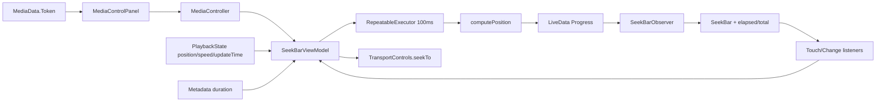
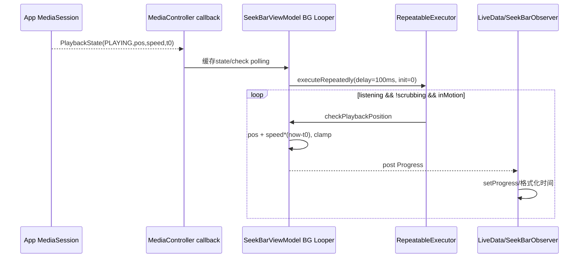
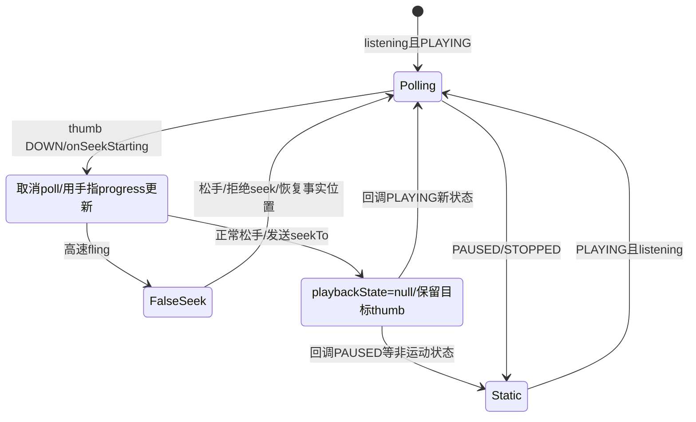

# 第 436 章 Android SystemUI Media SeekBar：播放位置轮询、拖动防误触与 seekTo

> 源码基线：Android 11 / API 30 / `android-11.0.0_r48`。本章只在 macOS 阅读源码，不编译。核心文件：`SeekBarViewModel.kt`、`SeekBarObserver.kt`、`MediaControlPanel.java`、`MediaCarouselController.kt`、`PlayerViewHolder.kt`、`RepeatableExecutor.java`、`RepeatableExecutorImpl.java`、`MediaController.java` 与 `PlaybackState.java`。

## 1. 本章要解决什么问题

媒体 session 不会每 100ms 都跨 Binder 上报一次位置，QS 进度条为什么仍能平滑前进？手指拖动时怎样避免后台位置把 thumb 拉回？横向滑媒体卡为什么不总会误 seek？松手调用 `seekTo` 后，SystemUI 又以什么作为成功证据？

## 2. 这不是音量 SeekBar

第 434 章 SeekBar 调 route/session volume；本章 `media_progress_bar` 表示曲目时间，范围是 0 到 metadata duration，用户操作最终调用 `MediaController.TransportControls.seekTo(milliseconds)`。

## 3. 四个核心对象

MediaControlPanel 创建/绑定 MediaController；SeekBarViewModel 在后台维护播放状态、轮询和手势状态；SeekBarObserver 把 LiveData 投影到 View；SeekBarTouchListener 在 SeekBar 与横向 Carousel 之间裁决触摸。

## 4. 三类时间必须分开

`PlaybackState.position` 是上次状态快照的位置；`lastPositionUpdateTime` 是基于 elapsedRealtime 的快照时点；metadata duration 是曲目总毫秒数。当前显示位置是用这三者和 playbackSpeed 推算，不是每帧向 App 查询。

## 5. 三类状态也要分开

Progress.enabled 决定是否画完整时间轨；seekAvailable 决定 thumb 是否可见、View 是否 enabled；playbackState.isInMotion 决定是否启动 100ms 轮询。能显示进度不代表允许拖动，允许拖动也不代表 seek 已成功。

## 6. 进程边界

ViewModel 和 View 在 SystemUI；MediaController 通过 ISessionController Binder 请求 App 的 MediaSession；App 如何把 seek 映射到 ExoPlayer/MediaPlayer 不在 SystemUI。本章终点是 transportControls.seekTo 请求与后续 PlaybackState 回传。

## 7. 线程边界

MediaControlPanel 把 updateController 投到 Background Executor；该 executor 基于 background Looper，因此无 Handler 参数注册的 MediaController.Callback 也回到这条 Looper。Progress 用 LiveData.postValue 切到主线程 Observer 更新 View。

## 8. 为什么使用 elapsedRealtime

它不受用户改墙上时间、时区或网络校时影响，适合计算状态快照后经过的单调时间。若用 currentTimeMillis，系统时钟回拨会让媒体位置倒退。

## 9. 为什么不是 Choreographer 每帧更新

100ms 已足以让秒级文本和进度条看起来连续，且只在需要时运行；每 16ms 更新会增加后台任务、LiveData 投递和 View invalidate 成本，却没有更精确的上游事实。

## 10. 总体数据流图



## 11. ViewModel 在哪里创建

它作为 MediaControlPanel 构造依赖注入，每张 MediaControlPanel 持一个实例；Carousel 中每张 player 卡各有自己的 Controller、Observer、轮询 token 和 scrubbing 状态。

## 12. attach 时建立什么

Panel 创建 SeekBarObserver，用 `observeForever` 观察 Progress，并给 SeekBar 安装 OnSeekBarChangeListener 与 OnTouchListener。它不依赖 Activity/Fragment Lifecycle 自动解绑。

## 13. 为什么必须手动 onDestroy

observeForever 不会随 View 树自动移除；Panel.onDestroy 先 removeObserver，再让 ViewModel 注销 MediaController callback、取消轮询，最后销毁 MediaViewController。

## 14. attach 两次的边界

attach 会覆盖 mSeekBarObserver 字段并新增 forever observer，却不先移除旧 observer。正常 player 只 attach 一次；若异常重复 attach，onDestroy 只移除最后一个引用，旧 Observer 可能残留。

## 15. bind 怎样得到 Controller

MediaData 提供 Token；Panel 每次 bind 只要 mToken 非 null就 `new MediaController(context,token)`，即使 token 没变也创建新包装对象，然后把当前 controller 捕获进 background updateController 任务。

## 16. ViewModel 如何避免重复注册

controller 属性 setter 比较 sessionToken；token 相同就不 unregister/register，也不替换 field。于是 Panel 同 token 每次 new 的临时 Controller 不会让 ViewModel 重注册，它继续持旧包装对象。

## 17. token 不同怎样切换

先对旧 Controller.unregisterCallback，再给新 Controller.registerCallback，最后 field=value。已排入 Handler 的旧 callback 仍可能在 unregister 后到达，framework 文档也明确允许已 post 的 update 迟到。

## 18. updateController 读取哪些初值

读取 controller.playbackState、controller.metadata、ACTION_SEEK_TO、state.position 和 METADATA_KEY_DURATION，形成一份 Progress，再调用 checkIfPollingNeeded。

## 19. Progress 四个字段

`enabled:Boolean`、`seekAvailable:Boolean`、`elapsedTime:Int?`、`duration:Int`。duration 实际非空 Int，但部分代码仍写 Elvis/安全调用，像是从早期可空设计遗留。

## 20. enabled 的条件

PlaybackState 非 null、state 不为 STATE_NONE、duration>0 才 true。没有 metadata、duration 为 0/负数、session 已无状态都会降级为细线并清空时间文本。

## 21. seekAvailable 的条件

只检查 `playbackState.actions & ACTION_SEEK_TO != 0`。即使 enabled=false，它仍可能在 Progress 中为 true；Observer 的 disabled 分支优先把整个 SeekBar 禁用。

## 22. 有进度但不能 seek 的表现

enabled=true、seekAvailable=false 时保留粗进度轨、elapsed/total 文本，但把 thumb alpha 设 0、SeekBar.enabled=false。用户仍能看时间，只是不能拖动。

## 23. position 初值是否推算

updateController 直接使用 `playbackState.position.toInt()`，没有立刻调用 computePosition。若状态快照已经过去一段时间，初次 Progress 可能先显示旧位置，随后首次 0-delay poll 才校正。

## 24. duration 为什么来自 metadata

PlaybackState 不携带媒体总时长；SystemUI 依赖 `METADATA_KEY_DURATION`。App 不发布或发布 0 时，即使 position/state 完整也不启用进度条。

## 25. Long 转 Int 的边界

position 与 duration 都无范围检查直接 toInt。普通音视频时长远小于约 24.8 天的 Int 毫秒上限；极长直播/错误 metadata 可能溢出为负数，使 enabled=false或进度异常。

## 26. STATE_NONE 与 null 不同

null 表示没有 PlaybackState 对象；STATE_NONE 是存在对象但状态值为 0。updateController 正确用 `playbackState.getState()==STATE_NONE` 禁用。

## 27. 哪些状态算 in motion

只有 PLAYING、FAST_FORWARDING、REWINDING。BUFFERING、CONNECTING、SKIPPING、PAUSED、STOPPED 都不轮询，即使 provider 给了非零 speed。

## 28. computePosition 公式

```text
推算位置 = 快照 position + playbackSpeed × (elapsedRealtime - lastUpdateTime)
```

只有 in motion 且 lastUpdateTime>0 才套公式；否则原样返回快照 position。

## 29. 快进与倒带怎么表现

FAST_FORWARDING 的正 speed 可让位置更快增长；REWINDING 通常是负 speed，使位置减少。实现不按 state 硬编码方向，完全使用 playbackSpeed。

## 30. 位置怎样限界

推算后若 duration>=0 且 position>duration，截到 duration；若 position<0，截到 0。注意非运动状态不会进入该块，暂停态快照为 -1 时不会在 computePosition 中修正。

## 31. lastUpdateTime 为 0 会怎样

即使 state=PLAYING，也返回原始 position；轮询每 100ms 重发同一值但 `_data.elapsedTime` 相同时不会 post 新 Progress。App 应正确提供 updateTime 才能平滑推进。

## 32. playbackSpeed 为 0 会怎样

state仍可能被视为 in motion并保留轮询，但公式位置不变；每次 check 因数值相同不发 LiveData，只有调度开销。

## 33. 100ms 轮询何时需要

表达式是 `listening && !scrubbing && playbackState?.isInMotion()==true`。三道门缺一不可；enabled 与 seekAvailable 没直接参与轮询判定。

## 34. duration 无效还会轮询吗

会。若 state=PLAYING、listening=true，即使 duration=0 导致 Progress.enabled=false，checkIfPollingNeeded 仍启动轮询；computePosition 用 duration 0 会把正位置截成 0，通常不更新 UI但仍周期执行。

## 35. listening 真正由谁控制

Carousel 的 `currentlyExpanded` 改变时给所有 player.setListening；currentlyExpanded 取目标 MediaHostState.expansion>0。它更接近“媒体卡当前采用展开布局”，不严格等于注释所说“QS panel open”。

## 36. QQS/折叠态为什么停轮询

目标 host expansion 为 0 时 listening=false，取消 100ms任务以省电。进度仍保留最后值，等再次展开才恢复推算。

## 37. 重新 listening 会先做什么

setter 把工作排到 background executor；实际执行时若值变化，写 field并 checkIfPollingNeeded。若 state 正在运动，会创建初始 delay=0 的重复任务，尽快追到当前推算位置。

## 38. RepeatableExecutor 的语义

它不是固定时刻 scheduleAtFixedRate；每次 command 运行完成后，再延迟100ms安排下一次。所以有效间隔是执行时间+100ms，不会在后台繁忙时堆积补跑多次。

## 39. cancel token 是什么

executeRepeatedly 返回 Runnable；运行它会调用当前 delayed task 的取消 Runnable并把内部 mCancel 清 null。ViewModel 同时把自己的 cancel 字段清 null，允许以后重新启动。

## 40. 会重复创建两个 poller 吗

checkIfPollingNeeded 在 needed=true 时只在 cancel==null 才创建；多次 playback callback/listening 更新不会叠加。needed=false 则取消并清槽。

## 41. 每次 poll 做什么

读取 `_data.duration`，用当前缓存 playbackState.computePosition；只有 currentPosition 非 null且与 elapsedTime 不同，才 copy Progress并 postValue。

## 42. LiveData.postValue 的效果

后台连续产生多份 Progress 时，主线程尚未处理前的中间 post 可能合并成最新值。这适合进度显示，不保证 UI 观察到每个100ms刻度。

## 43. Observer 在哪条线程

LiveData Observer 的 onChanged 标注 @UiThread，postValue 最终主线程调用；它可以安全设置 SeekBar、TextView、padding 和 thumb alpha。

## 44. 轮询完整时序图



## 45. Observer disabled 分支

把轨道最大高度和 vertical padding 切成 disabled 资源，SeekBar.enabled=false、thumb alpha=0、progress=0，并把 elapsed/total 文本清空。它没有把 View GONE，而是保留一条细线。

## 46. disabled 时 max 是否重置

没有。progress归0但旧 max 保留；重新 enabled 后有 duration 就 setMax 覆盖。由于 Progress.duration 非空 Int，正常每次 enabled 都会写 max。

## 47. enabled 分支的布局

thumb alpha取决于 seekAvailable，SeekBar.enabled 同步；最大高度/padding切到 enabled 样式；随后写 max、progress与两段时间文本。

## 48. 时间格式精度

毫秒先除1000取整，再用 DateUtils.formatElapsedTime；所以文本每秒变化，进度条却可100ms变化。小于1秒部分被截断。

## 49. 超过一小时的显示

DateUtils 会采用小时格式；它不是媒体 App 提供的本地化字符串。elapsed与total统一基于秒数格式化。

## 50. 程序 setProgress 会不会触发 seek

会触发 OnProgressChanged，但 `fromUser=false`，listener直接忽略，不调用 ViewModel.onSeekProgress，更不会发 transport seekTo。

## 51. 为什么 SeekBar 强制 LTR

PlayerViewHolder 创建后把 seekBar 和 progressTimes layoutDirection设为LTR；注释认为播放像磁带方向而非时间排版，RTL语言中仍从左到右前进。

## 52. TouchListener 解决什么冲突

媒体 Carousel 本身水平分页，SeekBar 也水平拖动。listener 只有在 DOWN 落到 thumb 周围目标框时才让 SeekBar持续处理拖动；其他滑动尽量交给父 Carousel。

## 53. thumb 目标框怎样算

用 `(progress-min)/(max-min)` 算宽度比例，在可用宽度上求 thumbX；目标框半宽偷用 SeekBar高度的一半。代码 TODO 承认没有计入 thumbOffset。

## 54. range<=0 的处理

widthFraction退0，目标框在起点附近；不会除0。SeekBar被 disabled 时一般不交互，但几何代码本身仍有防御。

## 55. RTL 分支是否常走

TouchListener支持 bar.isLayoutRtl 时反转比例，但 PlayerViewHolder又强制 SeekBar LTR，因此正常QS media卡通常走LTR分支；RTL代码为组件复用或配置变化留余地。

## 56. DOWN 落在 thumb 上

shouldGoToSeekBar=true，并请求 parent不拦截触摸；OnTouch返回 `!true=false`，事件继续给 SeekBar，随后它触发 onStartTrackingTouch。

## 57. DOWN 不在 thumb 上

shouldGoToSeekBar=false，OnTouch返回true消费于 listener，不把DOWN交给 SeekBar；父 Carousel仍可能在更上层拦截后续事件，用于横向翻页。

## 58. 单击轨道的设计意图

GestureDetector.onSingleTapUp 把 shouldGoToSeekBar设true并return true，注释意图允许点任意位置 seek。由于早期DOWN可能已被 OnTouchListener消费，最终 SeekBar如何处理只收到的后续事件依赖View/Gesture分发细节，源码没有专门计算tap位置再直接onSeek。

## 59. scroll 怎样裁决

onScroll 只返回 DOWN 时已经决定的 shouldGoToSeekBar，不根据横纵距离重新选择。起点在thumb就坚持SeekBar，起点不在就不给它。

## 60. fling 怎样判 false seek

若任一方向绝对速度大于 `scaledMinimumFlingVelocity*10`，调用 ViewModel.onSeekFalse。乘10让普通拖动不易被当成 fling，快速甩动更像 Carousel 翻页而不是精确定位。

## 61. false seek 何时真正生效

onSeekFalse 只在 scrubbing=true 时写 isFalseSeek。最终 SeekBar onStopTrackingTouch仍调用 onSeek(position)，ViewModel看到该标记后拒绝 transportControls.seekTo。

## 62. 手势事件都在同一线程处理吗

View listener在主线程，但 onSeekStarting/progress/false/seek 每个都排到同一个 background RepeatableExecutor。只要该 executor FIFO，事件顺序可从主线程队列转成后台顺序。

## 63. onSeekStarting 做什么

后台设 scrubbing=true、isFalseSeek=false。scrubbing setter立刻 checkIfPollingNeeded，取消当前100ms poll，避免用户拖 thumb时后台位置与手指竞争。

## 64. 拖动中进度怎样更新

OnProgressChanged只处理 fromUser=true，排 onSeekProgress；后台仅当 scrubbing仍true才 copy elapsedTime。Observer更新时间文本与progress，但程序回写的fromUser=false不会形成循环。

## 65. 为什么每个 MOVE 都 post LiveData

只要位置变化就更新，用户可实时看到目标时间。主线程繁忙时 postValue可能合并，显示最新目标比保留每个中间点更合理。

## 66. 正常松手怎样处理

onStopTrackingTouch把 bar.progress 传给 ViewModel.onSeek；后台调用 controller.transportControls.seekTo(position)，把缓存 playbackState置null，再设 scrubbing=false。

## 67. 为什么 seek 后主动清 playbackState

若保留旧state，scrubbing=false会恢复轮询并用旧快照把thumb拉回旧位置。置null让polling停止，界面保留用户拖到的位置，等待App回传新PlaybackState。

## 68. seekTo 有同步返回值吗

没有。TransportControls 经 Binder 发 void 请求，MediaController内部只捕获 RemoteException并Log.wtf。SystemUI没有“已接受/已完成”的直接ACK。

## 69. seek 成功的间接证据

App更新 MediaSession PlaybackState，Controller callback收到包含新position/updateTime的状态；ViewModel恢复缓存并在运动态启动poll。若App拒绝、忽略或不回传，thumb会停在用户目标位置。

## 70. 有没有 seek 超时回滚

没有。正常seek后 playbackState=null且不轮询，没有定时重新读取 controller.playbackState，也没有几秒后回旧位置的机制；完全依赖后续 callback或MediaData再次bind。

## 71. controller 为 null 时松手

安全调用不发送seek，但代码仍把 playbackState=null并结束scrubbing。UI会像“已提交”一样保留目标位置，没有显式错误提示。

## 72. false seek 怎样恢复

先scrubbing=false，setter可按仍保存的旧 playbackState恢复poll；随后立即 checkPlaybackPosition 把elapsedTime拉回推算事实，不调用transport seekTo。

## 73. false 路径可能重复检查

scrubbing=false可启动initDelay=0的重复任务，代码又同步调用一次checkPlaybackPosition，因此可能先直接校正、随后poller再很快检查一次；值相同就不会重复post。

## 74. 拖动状态图



## 75. Playback callback 收到 playing

直接 `playbackState=state`，然后 checkIfPollingNeeded；initDelay=0的poll会采用该状态 position/updateTime并刷新 elapsedTime。

## 76. callback 收到 paused

缓存state后发现不inMotion，于是取消poll；但代码没有立即 checkPlaybackPosition，也没有重建Progress。因此paused callback携带的最终position可能未投影，UI停在最后一次100ms poll的位置。

## 77. callback 收到 stopped 也类似

它只停止轮询，不自动把进度归0或禁用。只要后续没有MediaData bind/updateController，旧 enabled、seekAvailable、duration和elapsed仍留在UI。

## 78. callback 会更新 ACTION_SEEK_TO 吗

不会。seekAvailable只在updateController时计算；同session PlaybackState.actions动态变化，callback只换 playbackState，不copy Progress，thumb enabled状态可能陈旧。

## 79. metadata duration 变化会怎样

ViewModel callback没有override onMetadataChanged，所以直播转点播、曲目切换duration变化必须等MediaControlPanel因MediaData reload再次调用updateController；单靠Controller metadata callback不会更新总时长。

## 80. state none 判断的源码错误

```kotlin
if (playbackState == null || PlaybackState.STATE_NONE.equals(playbackState)) {
    clearController()
}
```

`STATE_NONE` 是 int，equals比较的是装箱 Integer与PlaybackState对象，正常永远false。应比较 `playbackState?.state == STATE_NONE`。

## 81. 这个错误造成什么

callback传非null STATE_NONE 时不会clear Controller，只走 checkIfPollingNeeded并因非运动停止poll；Progress.enabled不会被置false，旧时间轨可能继续显示。

## 82. 为什么 updateController 没同样错误

它写的是 `playbackState?.getState() == PlaybackState.STATE_NONE`，比较两个整数，能正确 disabled。因此初次bind正确，后续callback切到NONE才暴露不一致。

## 83. callback 收到 null 怎样处理

先 playbackState=null，再调用 clearController；clearController又排一个 background任务，最终 controller=null、注销callback、取消poll，并只把 Progress.enabled copy为false。

## 84. clearController 为什么再次排 executor

它标AnyThread，确保触摸/回调/外部调用都串到ViewModel后台状态机；即使当前已在同一background Looper，仍会多排一跳，避免重入setter/注销流程。代价是没有generation：null callback排出clear后，若队列中更新的PLAYING callback先被处理，随后旧clear任务仍可能把新状态和Controller清掉。

## 85. clear 只改 enabled 的后果

Progress内部仍保留旧seekAvailable、elapsedTime、duration；Observer disabled分支把可见值清掉。若调试直接读 LiveData，会看到“disabled但旧数据仍在”的快照。

## 86. onDestroy 与 clear 的区别

onDestroy注销controller、清playbackState、取消poll，却不post enabled=false；因为Panel先移除Observer，已没有必要重画。若其他异常Observer仍注册，它可能继续看到旧enabled数据。

## 87. MediaController callback Handler 在哪里创建

ViewModel updateController在有Looper的SystemUI background executor运行，registerCallback(callback,null)内部new Handler()绑定调用线程Looper，所以session事件继续串回同一后台线程。

## 88. 若在无Looper线程调用会怎样

MediaController无Handler重载会new Handler，线程无Looper会抛RuntimeException。当前注入背景是Looper型 ExecutorImpl，安全依赖来自DI配置而非ViewModel类型系统。

## 89. Poller 与 callback 是否串行

二者都在同一background Looper/DelayableExecutor设计下运行，通常避免 playbackState、cancel、scrubbing 的数据竞争。LiveData Observer单独在主线程，只消费不可变Progress data class。

## 90. 触摸任务积压会怎样

MOVE在主线程高频排background；如果后台被 artwork或其他任务阻塞，onSeekProgress可积压。最终onSeek也排在后面，FIFO可保证最后提交顺序，但UI postValue可能跳过中间目标。

## 91. 轮询任务会阻塞谁

RepeatableExecutor使用共享 `@Background DelayableExecutor`。check很短，但大量媒体卡同时expanded并playing时每卡100ms一项，共享Looper负载会上升。

## 92. inactive卡是否轮询

是否active不是ViewModel直接条件。只要player还存在、currentlyExpanded=true且其缓存state inMotion，就会轮询；Carousel/MediaData政策通常会隐藏或移除inactive卡，但状态机没有额外active门。

## 93. 多Host迁移时 listening 如何变化

Carousel根据目标 MediaHostState.expansion>0统一设置所有players；同一mediaFrame迁到QQS/锁屏/QS时可能停止或恢复poll。它不是根据单卡实际屏幕裁剪或当前Carousel页是否可见逐卡控制。

## 94. 离屏分页卡仍可能轮询

只要整个Carousel目标状态expanded，所有 MediaPlayerData.players 都 setListening(true)，包括横向列表中当前未显示的页。r48没有按ViewPager当前页单独停position poll。

## 95. position UNKNOWN 的边界

PlaybackState可用负值表示未知。updateController仍可能因duration>0与state有效而enabled=true，并把-1转Int；SeekBar通常将负progress钳到0，文本格式化负值的行为又依赖DateUtils，源码未显式归一。

## 96. 运动状态会把负位置钳0

computePosition进入inMotion块且updateTime>0后才执行position<0→0；若lastUpdateTime=0或paused，负值原样返回。这使同一unknown位置在不同state下表现不一致。

## 97. duration 截断与错误 metadata

只要duration>=0，推算位置大于duration就截尾。App若先发布过短duration，UI会提前停在终点；ViewModel不校验position与metadata是否来自同一曲目版本。

## 98. playbackSpeed 精度

Float speed乘Long时间差后转Long，小数毫秒被截断。100ms间隔下误差远小于UI秒级文本，后续新PlaybackState会重新锚定。

## 99. elapsedRealtime 跨睡眠吗

elapsedRealtime包含设备深睡时间。若媒体在设备睡眠期间实际暂停却未及时更新state，唤醒后旧PLAYING快照可能推算跨睡眠前进；正确性依赖App/session及时发布状态。

## 100. Binder失败的用户体验

seekTo捕获RemoteException只写wtf日志，ViewModel仍清state并等待callback；UI没有toast、失败图标或自动回滚。诊断“拖了没跳”要同时查SystemUI与媒体App session日志。

## 101. ACTION_SEEK_TO 只是能力声明

App声明该bit才让thumb可交互；它仍可忽略具体seek请求或晚更新。反之App实现seek但漏声明bit，SystemUI会禁用手势，用户无入口。

## 102. 为什么不直接调用播放器

SystemUI不知道App使用MediaPlayer、ExoPlayer还是远程投屏；MediaSession TransportControls是稳定跨进程协议。实际seek语义、缓冲与版权限制由session拥有者决定。

## 103. resumption卡的进度条

resumption MediaData通常token可来自浏览器结果，但对应session可能已销毁/null；Panel controller为null时 updateController输出disabled Progress，显示细线而不是可拖进度。

## 104. 卡片复用时旧进度怎样清

bind捕获新controller排background update；若新token null/无state/无duration，Progress enabled=false让Observer清View。异步任务到达前，复用卡可能短暂保留旧进度。

## 105. bind任务有没有 generation

每次bind都把某个controller捕获后排同一background Executor；正常FIFO使后bind后执行，但没有key/token generation在任务运行时复查。若Executor实现或外部调度改变顺序，旧controller可晚覆盖。

## 106. 复读发现一：STATE_NONE对象比较错误

它让后续NONE callback不能clear Controller/disable进度；本章必须区分“初次update判断正确”和“callback判断错误”，不能笼统说STATE_NONE已处理。

## 107. 复读发现二：非运动回调不刷新position

PAUSED/STOPPED回调只停poll，不采用回调快照的新position；playing回调因0-delay poll得到补偿，所以问题主要显现在暂停、停止和buffering切换。

## 108. 复读发现三：seek等待无超时

正常松手立即清缓存state，既避免回弹也造成无限等待；App不回PlaybackState时，用户目标位置会被当作长期视觉结果。

## 109. 复读发现四：enabled不门控poll

duration无效导致UI disabled，但PLAYING仍可启动100ms任务。节能判断只看listening/scrubbing/motion，没加入Progress.enabled。

## 110. 复读发现五：Carousel级而非页级监听

expanded状态一次性给所有players，横向离屏卡也可轮询；优化时应谨慎考虑当前页、预加载页和host动画，否则容易出现切页位置跳变。

## 111. 推荐断点顺序

从MediaControlPanel.bind的controller任务进入updateController；再跟checkIfPollingNeeded→RepeatableExecutor→computePosition→LiveData→Observer；手势从OnTouch/onDown与SeekBarChangeListener进入onSeekStarting/progress/false/seek，最后到TransportControls.seekTo和Controller callback。

## 112. macOS只读练习一：定位初值与轮询

执行：`rg -n "updateController|computePosition|checkIfPollingNeeded|executeRepeatedly" frameworks/base/packages/SystemUI/src/com/android/systemui/media/SeekBarViewModel.kt frameworks/base/packages/SystemUI/src/com/android/systemui/util/concurrency`。写出轮询启动的三道门和位置公式。

## 113. macOS只读练习二：追踪一次拖动

执行：`rg -n "onSeekStarting|onSeekProgress|onSeekFalse|fun onSeek|seekTo" frameworks/base/packages/SystemUI/src/com/android/systemui/media/SeekBarViewModel.kt frameworks/base/media/java/android/media/session/MediaController.java`。区分正常、false、无Controller三种松手结果。

## 114. macOS只读练习三：核对View投影

执行：`sed -n '25,90p' frameworks/base/packages/SystemUI/src/com/android/systemui/media/SeekBarObserver.kt && rg -n "layoutDirection.*LTR" frameworks/base/packages/SystemUI/src/com/android/systemui/media/PlayerViewHolder.kt`。解释disabled、只读、可seek三种视觉状态。

## 115. macOS只读练习四：验证r48边界

执行：`sed -n '88,115p' frameworks/base/packages/SystemUI/src/com/android/systemui/media/SeekBarViewModel.kt && sed -n '180,215p' frameworks/base/packages/SystemUI/src/com/android/systemui/media/SeekBarViewModel.kt`。确认callback的STATE_NONE比较为何错误，以及callback为何没有重算seekAvailable/duration/Progress。

## 116. 自测一：为什么不需要App每100ms回调

SystemUI用position、speed和lastUpdateTime按elapsedRealtime推算当前值，只在播放/快进/倒带且展开、未拖动时本地100ms轮询。App只需在状态/锚点变化时更新PlaybackState。

## 117. 自测二：松手后thumb为何不先跳回

发送seekTo后ViewModel故意把缓存PlaybackState置null、停止旧锚点轮询，保留手指目标；等App新PlaybackState回调后再恢复事实计算。代价是没有回调就不会自动回滚。

## 118. 自测三：进度可见为何不能拖

enabled来自有效state+正duration，seekAvailable来自ACTION_SEEK_TO。前者为true而后者false时仍显示时间轨，但隐藏thumb并禁用SeekBar。

## 119. 本章结论

QS媒体进度条是“PlaybackState锚点+单调时钟推算+按需轮询+乐观拖动”的状态机。它通过scrubbing暂停轮询和seek后清旧state避免回弹，却依赖App回调收敛；r48还存在STATE_NONE误比较、非运动回调不刷新、无超时与disabled仍轮询等边界。

## 120. 下一章预告与恢复点

下一章阅读 SystemUI Media Carousel 的手势分页、dismiss、settings按钮、visual stability与卡片排序交互。若中途停止，从“第 437 章”继续；第 436 章已完成播放位置、手势和TransportControls三层模型。
