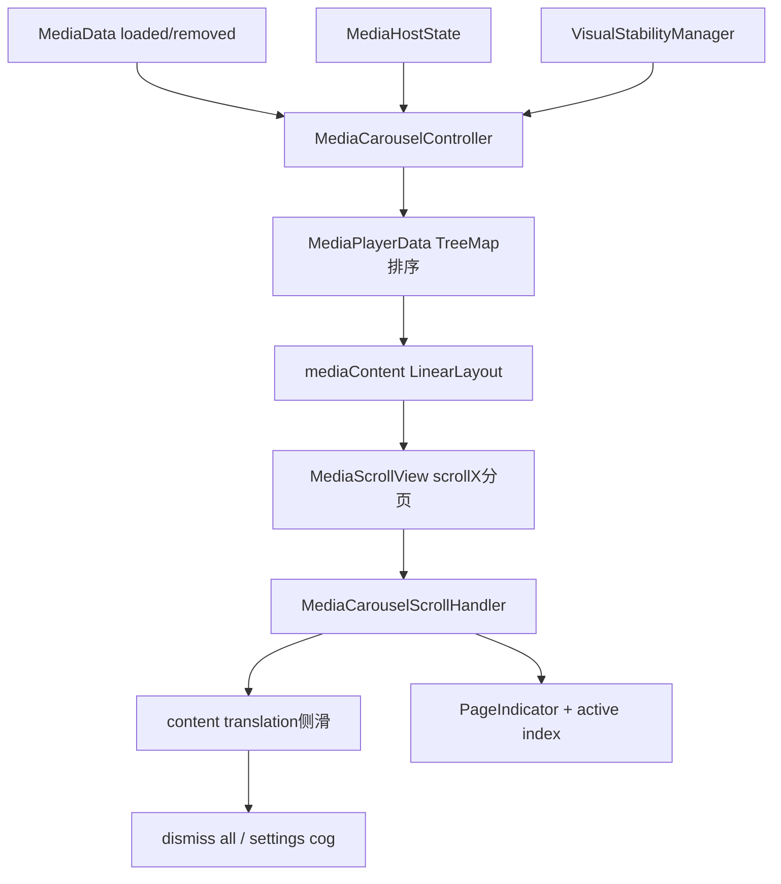
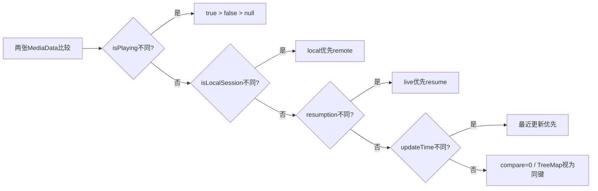
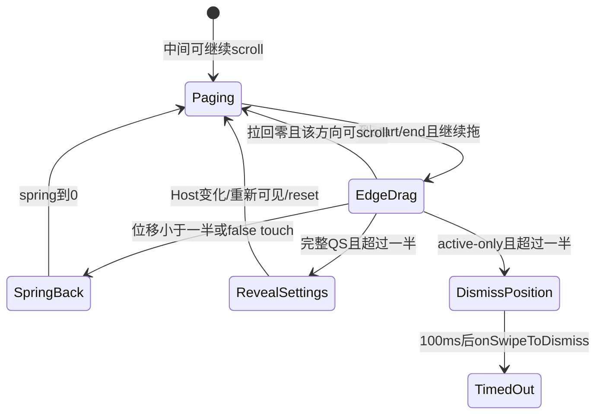

# 第 437 章 Android SystemUI Media Carousel：分页、侧滑删除、设置入口与稳定排序

> 源码基线：Android 11 / API 30 / `android-11.0.0_r48`。本章只在 macOS 阅读源码，不编译。核心文件：`MediaCarouselController.kt`、`MediaCarouselScrollHandler.kt`、`MediaScrollView.kt`、`MediaDataFilter.kt`、`MediaControlPanel.java`、`MediaViewController.kt`、`MediaHostStatesManager.kt`、`VisualStabilityManager.java`、`media_carousel.xml` 与 `media_carousel_settings_button.xml`。

## 1. 本章要解决什么问题

多张媒体卡怎样排序和分页？横向翻到下一张与把整个 Carousel 侧滑删除为什么不会混在一起？何时侧滑不是删除而是露出设置齿轮？播放状态变化需要换序时，为什么有时立即移动、有时等面板收起？

## 2. 先记住两个横向坐标

卡片分页使用 `HorizontalScrollView.scrollX`；到达列表边缘后继续拖动使用 `mediaContent.translationX`。前者选择第几张卡，后者表示整个内容被拉向删除位置或设置按钮，两者不能统一叫“滑动距离”。

## 3. 再记住两类删除

`removePlayer(key)` 立即销毁一个 MediaControlPanel View，并可反向调用 `dismissMediaData`；Carousel 整体 swipe 则调用 `MediaDataFilter.onSwipeToDismiss()`，把当前 profile 的全部 key 标 timedOut，并非同步逐个 remove Map。

## 4. 三套状态表

MediaPlayerData 用 key→MediaSortKey 与有序 TreeMap 保存逻辑玩家；mediaContent LinearLayout 保存实际 View 顺序；ScrollHandler 保存 active index、scrollIntoCurrentMedia 和 translation。三者短暂不同步时会出现位置、页码或删除异常。

## 5. Controller 的职责边界

MediaCarouselController 接 MediaData 事件、建卡/绑定/排序/重建，接 MediaHostState 做尺寸与展开态，接 Configuration 做 reinflate；ScrollHandler 专管触摸、分页、侧滑、齿轮和可见页。

## 6. MediaScrollView 为什么自定义

它允许 scrollTo 超出普通 child bounds 约束，提供 RTL相对 scrollX、手势委托、内容 translation 的动画目标，并在侧滑 translation 非零时禁止普通 overScroll。

## 7. 进程与线程

这些对象运行在 SystemUI，Controller 构造注入的是 `@Main DelayableExecutor`；MediaData listener、Host状态、View手势和 VisualStability callback都以主线程 UI 状态为主。整体 swipe 最终进入 MediaDataManager/MediaController时才跨线程或Binder。

## 8. 一个 Carousel 还是多个

SystemUI 持有一个 Singleton MediaCarouselController 和唯一 `mediaFrame`，在QQS、QS、锁屏等 Host 间迁移；不是每个 Host 各自维护卡片列表。第433章的“同一View搬家”在这里具体落到同一mediaContent。

## 9. 页面与卡片的关系

每个 MediaControlPanel 的根 player View 是 LinearLayout 一个 child；child之间用 marginEnd 留 `qs_media_padding`，最后一张 marginEnd为0。`playerWidthPlusPadding` 是分页步长。

## 10. 总体架构图



## 11. media_carousel.xml 的层级

外层 FrameLayout 含 MediaScrollView 和 PageIndicator；ScrollView唯一child是横向 LinearLayout `media_carousel`。设置齿轮不是XML固定child，而是Controller inflate后直接加到外层FrameLayout。

## 12. 为什么 clipChildren=false

卡片状态变换、translation和齿轮可超出子布局边界；Frame、ScrollView、LinearLayout都关闭clipChildren/clipToPadding。真正侧滑时再借 ScrollView outline临时裁剪圆角区域。

## 13. mediaFrame 的临时 parent

inflate时传一个 `UniqueObjectHostView(context)` 作parent但不attach，帮助生成LayoutParams；随后这一唯一 mediaFrame会被实际Host重新挂载。

## 14. 初始化顺序

先inflate frame、取ScrollView/PageIndicator、创建ScrollHandler并设RTL；再inflate设置按钮、取得mediaContent、注册Configuration、VisualStability、MediaData和HostStates回调。

## 15. ScrollHandler 初始化做什么

安装GestureDetector与Gefingerpoken，关闭overScroll，缓存contentContainer，监听scroll change，并给ScrollView设置以carousel宽高/圆角构造的OutlineProvider。

## 16. Settings按钮如何加入

inflate为ImageView；若旧按钮已初始化就先remove，再把新按钮add到mediaFrame，通知ScrollHandler更新引用/圆角，安装点击打开 `ACTION_MEDIA_CONTROLS_SETTINGS` 并dismiss Shade。

## 17. 配置变化为何重建卡片

density/font或overlay变化会 `recreatePlayers()`，逐key先remove旧Panel但不dismiss data，再add新Panel；随后重新inflate settings按钮。这样View资源更新，媒体数据账仍保留。

## 18. 一般Configuration变化做什么

这里只比较 layoutDirection，变化时更新mediaFrame方向并 `scrollToStart()`。旋转/尺寸主要通过Host测量状态另行更新，不在此完整重建。

## 19. 新MediaData怎样建卡

Provider.get新MediaControlPanel，创建PlayerViewHolder并attach，设置sizeChanged listener和LayoutParams，bind数据、按currentlyExpanded设置SeekBar监听，加入MediaPlayerData，应用当前Host动画状态，再全量reorder Views。

## 20. 更新已有卡怎样处理

先bind既有Panel，再用新MediaData重新生成SortKey；若VisualStability允许就重排LinearLayout，否则只置 `needsReordering=true`。逻辑TreeMap已更新，View顺序可暂时仍旧。

## 21. key迁移如何复用Panel

getMediaPlayer(key,oldKey) 先把mediaData中的旧key映射移动到新key，再用原SortKey从TreeMap取Panel；随后bind并addMediaPlayer会删除旧SortKey、按新数据/时间重新插入。

## 22. 为什么每次更新都刷新updateTime

addMediaPlayer先remove同key，再用 `System.currentTimeMillis()` 生成SortKey。因此同一优先级组内，最近收到MediaData更新的卡排在前面，不是最早播放或通知发布时间。

## 23. 排序第一关键字

`isPlaying` 降序：true在false前，false在null前。正在播放优先，明确暂停/停止其次，无法判断播放状态最后。

## 24. 排序第二关键字

`isLocalSession` 降序，本地session优先remote。它在resumption之前比较，所以暂停的本地恢复卡可排在暂停的远程live卡之前。

## 25. 排序第三关键字

`!resumption` 降序，也就是live notification卡优先resume卡，但只在前两项相同才生效。

## 26. 排序第四关键字

updateTime降序，较新更新排前。完整顺序不是简单的“正在播放→最近使用”，而是四层词典序。

## 27. 排序示例

本地playing → 远程playing → 本地stopped live → 本地resume → 远程stopped live → isPlaying未知resume。r48单测明确验证了这组优先级。



## 28. TreeMap key碰撞风险

Comparator只看四个排序字段，不看media key/package/token。两个条目若前三项相同且同一毫秒生成updateTime，compare返回0，TreeMap会把后一个当同一个key覆盖player；mediaData Map却仍可保留两个key。

## 29. 碰撞会留下什么证据

`MediaPlayerData.players().size != mediaContent.childCount` 的postcondition可能Log.wtf；但覆盖发生时逻辑players本身已少一个，具体何时与View数不一致取决于reorder是否被延迟。

## 30. 为什么用currentTimeMillis也有问题

毫秒分辨率不足以充当唯一序号，且墙上时钟可被调整。排序只需要新旧相对顺序，更稳妥的是单调递增sequence或elapsedRealtime加key tie-breaker。

## 31. reorderAllPlayers 做什么

`mediaContent.removeAllViews()`，按TreeMap values顺序重新add每个Panel root，然后ScrollHandler.onPlayersChanged更新可见性和padding。Panel对象没有销毁，只是重挂顺序。

## 32. 新卡为什么无视VisualStability立即重排

existingPlayer==null分支总调用reorderAllPlayers；VisualStability门只包围已有卡更新后的换序。新内容允许直接出现，避免逻辑有player却没有View。

## 33. remove事件是否总受稳定性门控

不是。真正 `onMediaDataRemoved(key)` 直接removePlayer；只有loaded事件中判断“当前不再播放且resumption关闭、但数据仍留存”的资源回收，才在不允许reorder时加入keysNeedRemoval等待。

## 34. canRemove 的准确公式

isPlaying非null时取 `!isPlaying`；isPlaying为null时才取 `isClearable && !active`。因此明确false时不再检查clearable/active，可能回收仍active但暂停的数据View（前提resumption关闭）。

## 35. 为什么还检查useMediaResumption

resumption开启时暂停/超时卡可继续展示或恢复，不在loaded路径回收View；关闭时才为非playing数据节约UI资源。

## 36. VisualStability何时不让重排

其全局条件为：屏幕开且通知面板展开、或正在pulsing时通常禁止；屏灭、面板收起或临时允许且非pulsing时允许。Carousel复用了通知视觉稳定管理器。

## 37. persistent callback 的含义

Controller以persistent=true登记一次；每次状态从不允许变为允许都会回调，不会首次调用后移除。

## 38. 稳定回调执行什么

若needsReordering则全量重排；逐个remove keysNeedRemoval并清集合；最后无条件scrollToStart。用户此前停在第二页，也会在稳定窗口恢复时跳回第一张。

## 39. 延迟删除为什么调用真正dismiss

keysNeedRemoval回调 `removePlayer(it)` 默认dismissMediaData=true，除了销毁View还调用Manager.dismissMediaData(key,0)。这不仅释放UI，也可能stop本地session/删除数据，和“仅视觉延迟”不同。

## 40. 更新后如何取消待删

新data不满足canRemove或resumption开启，就 `keysNeedRemoval.remove(key)`。在VisualStability允许前重新playing可撤销旧待删计划。

## 41. 单卡removePlayer顺序

先从MediaPlayerData删映射，通知ScrollHandler.onPrePlayerRemoved修正索引/scrollX，从LinearLayout remove View，Panel.onDestroy注销Observer/Controller，更新分页/可见性，最后可反向dismiss data。

## 42. 为什么反向dismiss是“late dismissal”

Carousel可能因资源政策先移除View，而DataManager仍保留entry；调用dismissMediaData让上游最终收敛。delay=0也仍经过Manager自己的background/foreground删除链。

## 43. 重复remove怎样表现

MediaPlayerData找不到就什么都不做，也不调用dismiss。这让真实remove与延迟待删竞合时通常幂等，但keysNeedRemoval本身不在onMediaDataRemoved里显式remove。

## 44. keysNeedRemoval的陈旧key

若真实removed先removePlayer，集合仍可能留key；稳定回调再次remove无效果后clear。不会重复dismiss，因为第二次找不到Panel。

## 45. recreatePlayers为何不dismiss数据

它先取一份key/data列表，`removePlayer(...,false)`只销毁旧View，再add新View。否则配置变化会被误当用户关闭媒体。

## 46. recreate期间排序时间会变化

每张重建都获得新的currentTimeMillis，顺序仍主要由前三关键字，但同组卡按遍历/执行时刻重排；配置变化并非严格保持原updateTime。

## 47. 分页位置怎样定义

`relativeScrollX / playerWidthPlusPadding` 是activeMediaIndex，余数是进入下一页的像素。RTL通过transformScrollX把绝对scrollX转换为start-to-end相对坐标。

## 48. RTL变换为何是自身逆函数

公式 `contentWidth-width-scrollX` 做两次会回到原值；getter/setter共用它，在LTR直接原值。逻辑索引始终按start到end，不随物理左右改变。

## 49. ScrollView为何重写scrollTo

直接更新mScrollX/mScrollY、父缓存、onScrollChanged和滚动条/invalidate，不调用基类边界限制。Host过渡测量中child与parent尺寸暂时不一致时仍能维持目标位置。

## 50. playerWidthPlusPadding更新如何保页

以active index×新步长，再按旧scrollIntoCurrentMedia折算部分页进度后写relativeScrollX。它试图尺寸变化后仍停在同一逻辑卡/过渡比例。

## 51. 该折算的反向分支

若scrollIntoCurrentMedia大于新步长，使用 `newWidth-(oldAmount-newWidth)`；这是对RTL/尺寸骤缩跨界的补偿，但可能得到负值或超过一步，随后依赖ScrollView布局收敛。

## 52. Scroll change如何控制View visibility

完全落在一页时只active child VISIBLE；页间滚动时active和active+1 VISIBLE，其余INVISIBLE。INVISIBLE仍参与LinearLayout测量，保证完整scroll range。

## 53. 为什么只显示相邻两张

降低多张媒体卡同时绘制/动画成本，同时分页手势只需当前和下一张。向前滚时active index由商变化，新的active+1仍覆盖正在过渡的两页。

## 54. 页面变化为何关闭guts

active index改变，或从整页变成页间/从页间落定，都会closeGuts，避免某张卡的长按菜单在移出当前页后悬留。

## 55. PageIndicator位置

relativeLocation=activeIndex+余数/步长；RTL时再转成 `childCount-relativeLocation-1`，因为PageIndicator自身不处理RTL。

## 56. PageIndicator页数

用mediaContent.childCount，单页时location强制0；每次add/remove更新numPages，并根据Host可见过渡更新alpha。

## 57. Indicator为什么只在最后5%淡入

当start或end Host不可见时，把过渡progress映射0.95—1到0—1并constrain；只有靠近可见端的最后阶段迅速出现，避免媒体容器还没到位就飘出圆点。

## 58. Indicator怎样跟随整组侧滑

translationX以Carousel尺寸居中后，再加ScrollHandler.contentTranslation。内容向侧面拉时，PageIndicator同步移动。

## 59. Carousel尺寸来自哪里

遍历所有Panel的MediaViewController，取 `currentWidth+translationX` 与 `currentHeight+translationY` 最大值；变化后通知ScrollHandler bounds并重定位Indicator。

## 60. gone过渡为何加translation

View变gone时current尺寸缩小，但状态动画translation仍占空间；加上translation避免outline/indicator在动画中提前塌缩。

## 61. setCarouselBounds的源码错误

```kotlin
if (currentCarouselHeight != carouselHeight ||
        currentCarouselWidth != carouselHeight) {
```

第二项错误地与旧height比较，应为旧`carouselWidth`。宽度恰等旧height时可能漏更新；宽度未变但不等height时又会重复invalidateOutline。

## 62. Host desired state更新什么

保存location/state；expansion>0控制所有SeekBar轮询；给Panel准备位置动画；设置是否展示Settings、是否需要falsing；可见性从false到true时重置translation；最后按Host measurement重新测量。

## 63. settings什么时候可露出

`showsSettingsButton = !hostState.showsOnlyActiveMedia`。只展示active媒体的QQS/锁屏类Host侧滑用于dismiss；展示全部媒体的完整QS侧滑用于露出设置齿轮。

## 64. Host切换为何重置translation

active-only政策变化或中途在两种政策间过渡时，`maybeResetSettingsCog()` spring回0；否则一个Host露出的齿轮/删除位移会被带到另一个Host。

## 65. players重新可见也重置

desired Host visible从false变true时调用resetTranslation不动画，取消PhysicsAnimator并归0。隐藏期间残留的侧滑状态不会在下次出现时继续。

## 66. Settings按钮视觉算法

根据 `abs(contentTranslation)/maxTranslation` 得settingsOffset；齿轮从偏移位置移动、最多旋转约50度，alpha在offset 0.5—1之间从0到1，alpha为0时INVISIBLE。

## 67. 为什么齿轮是Frame sibling

mediaContent整体translation时，齿轮留在Frame坐标中被“揭开”；若齿轮是LinearLayout child，它会与卡一起移动，无法形成抽屉效果。

## 68. 侧滑最大距离

允许设置时是settingsButton.width；否则是一个playerWidthPlusPadding，意味着删除动画把整个内容拉出一页宽。

## 69. onScroll何时改translation

如果translation已非0，或ScrollView不能继续向手势方向水平滚动，就从分页切到整组translation；列表中间优先正常scroll，不触发删除/设置。

## 70. totalX的用途

从当前坐标减DOWN坐标，取反后问canScrollHorizontally。它用整个手势方向决定是否已到边缘，而distanceX用于本次增量translation。

## 71. rubberband如何实现

超过maxTranslation的部分乘0.2；已经越界继续同向也只加20%距离，形成阻尼。反向拖回时不会同样削弱，便于回到边界。

## 72. 跨过translation零点

若从一侧拉回并越过0，同时新方向其实可以分页滚动，就把translation钳0，让后续手势交还scrollX，而不是直接开始拉另一边。

## 73. 动画运行时手指又拖

若PhysicsAnimator正在运行，不直接写字段，而是重新spring到手指的新translation目标；否则即时set contentTranslation。animationTargetX同步保存逻辑目标。

## 74. getContentTranslation为何可能不读View

Animator运行时返回animationTargetX而非contentContainer.translationX当前帧，手势/决策基于目标状态，避免动画中间值导致来回判断。

## 75. 普通抬手如何分页吸附

relativeScrollX对步长取余；超过一半补到下一页，否则退到本页。用mainExecutor再smoothScrollBy，避开HorizontalScrollView.springBack取消自定义动画。

## 76. 测量前抬手的除零风险

代码直接 `relativeScrollX % playerWidthPlusPadding`，没有像onFling那样先检查>0。早期布局尚未设置步长却收到UP/CANCEL时可能ArithmeticException。

## 77. translation不足一半

抬手时springBack=true，目标0；若需要falsing且被判false，也强制回0。translation超过一半且真实触摸才去最大位置。

## 78. translation超过一半且是dismiss模式

先spring到整页宽，另用mainExecutor延迟100ms调用dismissCallback，不等弹簧真正结束。回调把所有当前profile媒体设timedOut。

## 79. translation超过一半且有settings

spring到settingsButton.width，但不dismiss；齿轮完全显现，等待用户点击。再次点齿轮由ActivityStarter打开媒体控制设置。

## 80. 侧滑状态图



## 81. fling方向筛选

若水平速度平方小于0.5×垂直速度平方，认为不够水平；若vX²<1,000,000，即|vX|<1000，也不算fling。两道门通过才进入翻页/侧滑结算。

## 82. translation中fling

速度方向与translation相反，或false touch，就spring回0；同向则去最大位置，并在dismiss模式延迟100ms回调。spring初速度使用vX。

## 83. 没有translation时fling

按当前relativeScrollX算index；LTR中vX<0表示向end，RTL相反；目标只取current或current+1，不会一次跨多页，然后post smoothScrollTo目标child.left。

## 84. fling为何先cancel原触摸

GestureDetector在UP识别fling后，ScrollHandler给底层ScrollView发送ACTION_CANCEL，防止其自身同时惯性滚动；随后posted smoothScroll才执行自定义单页吸附。

## 85. 零卡fling风险

childCount=0时destIndex最终可能为-1，`getChildAt(-1)`返回null，随后读取view.left会NPE。通常无媒体时容器不可触摸，但方法本身没有空列表保护。

## 86. falsing会话何时开始

Gesture onDown且Host要求保护时调用`onNotificationStartDismissing()`；ACTION_UP时调用stop，再在结算/ fling中用 `isFalseTouch(NOTIFICATION_DISMISS)`。

## 87. ACTION_CANCEL漏stop

onTouch只在`isUp`时stop falsing；CANCEL会进入结算分支，却不调用`onNotificationStopDismissing()`。被父层取消的手势可能留下不成对的falsing通知。

## 88. intercept与touch都喂GestureDetector

MediaScrollView先让自定义intercept处理，再在onTouchEvent再次传同一手势流；是否每个MotionEvent重复进入取决于View分发阶段，代码本身没有event去重，分析日志时要注意回调可能不只来自一处。

## 89. scrollIntoCurrentMedia的可见性意义

余数非0时同时显示当前与下一张并clipToOutline；余数回0恢复只显示active。它不表示translation侧滑，两者任一非0都会开启outline clip。

## 90. contentTranslation setter的副作用

写LinearLayout.translationX、更新Settings视觉、回调Indicator位置、更新clipToOutline。PhysicsAnimator通过自定义FloatProperty最终也走同一setter。

## 91. remove前为何通知ScrollHandler

它先找removed View index；若在active之前/就是active，active index减一。RTL下逻辑before不变，但物理leftOfActive反转，再调整绝对scrollX维持当前卡可见。

## 92. removedIndex=-1 的边界

若数据表含Panel但View已不同步，indexOfChild返回-1；`-1 <= activeIndex`为true，会错误递减active并可能调整scrollX。postcondition日志不能在动作前防止该损坏。

## 93. setRemoved后页码如何收敛

onPlayersChanged更新可见性/padding，updatePageIndicator改页数；但没有统一把activeIndex clamp到新childCount-1，主要依赖onPrePlayerRemoved的减一逻辑。

## 94. scrollToStart 做什么

只写relativeScrollX=0，不显式把activeMediaIndex=0；通常scroll change callback随后更新。若scrollX本来已0而active字段陈旧，setter可能不触发onScrollChanged。

## 95. 整体swipe真正改什么数据

MediaDataFilter复制当前userEntries keys，对每个 `setTimedOut(key,true)`；Manager把MediaData.active设false并重新loaded，不立即从raw Map删除，也不直接对所有session stop。

## 96. 为什么完整QS可能仍有卡

Host若showsOnlyActiveMedia=false，可以展示inactive/resumption数据；整体swipe后的视觉消失还受MediaHost、Carousel canRemove和resumption配置共同决定，不能把timedOut等同于remove。

## 97. 设置入口为什么只在all-media Host

完整QS需要给用户管理媒体控制/恢复建议的入口；只展示active的紧凑Host侧滑更符合“收起当前媒体”。源码以showsOnlyActiveMedia反向决定settings，没有硬编码具体location。

## 98. Settings按钮点击是否重置translation

listener只startActivity；Shade被dismiss后Host可见性/状态变化通常触发reset。点击本身没有先spring回0。

## 99. closeGuts关闭多少卡

遍历MediaPlayerData所有players，对每张 `closeGuts(true)`。翻页时不是只关离开的那一张，任何打开的长按菜单都会关闭。

## 100. 页面不可见是否GONE

用INVISIBLE而非GONE，保持LinearLayout宽度、scroll位置和页数；代价是所有卡仍参与layout，SeekBar轮询也由Carousel整体expanded控制而非View visibility。

## 101. Host尺寸更新条件的优先级

`width != old && width !=0 || height != old && height !=0` 按&&高于||解析；任一非零维变化就重新measure/layout。0值不会覆盖已有测量缓存。

## 102. remeasure怎样设置步长

先用Host width/height spec measure ScrollView，再layout到目标width与measuredHeight；之后才把 `playerWidthPlusPadding=carouselMeasureWidth+qs_media_padding`，因为RTL scroll计算依赖完成后的View宽。

## 103. Layout height参数有一处不一致

缓存carouselMeasureHeight来自Host input，但实际 `mediaCarousel.layout(..., mediaCarousel.measuredHeight)` 不使用传入height作bottom；Host height主要进入measureSpec，最终bottom取测量结果。

## 104. VisualStability并非Carousel专属

它还管理通知row重排、group变化、Heads-up等；Carousel persistent callback会在全局重排重新允许时执行。媒体排序时机受通知面板/屏幕/pulsing状态耦合。

## 105. 临时允许一秒的影响

其他通知代码调用temporarilyAllowReordering会让全局reorderingAllowed最多1秒；Carousel积压的needsReordering/keysNeedRemoval也会立即被释放，并scrollToStart，不区分触发临时窗口的原因。

## 106. 复读发现一：宽高比较写错

setCarouselBounds第二项用旧height比较新width，导致outline刷新条件既可能漏报又可能多报，是明确代码错误而非架构取舍。

## 107. 复读发现二：步长零除

UP/CANCEL路径取模没有playerWidthPlusPadding>0保护；onFling却有除法保护，两个手势完成路径防御不一致。

## 108. 复读发现三：排序键不唯一

TreeMap comparator缺media key最终tie-breaker，同毫秒同状态条目可互相覆盖；使用两个Map并不能弥补有序Map把compare==0视为同key。

## 109. 复读发现四：falsing CANCEL不闭合

只有UP调用stopDismissing，CANCEL仍会spring/吸附却不结束falsing会话。复杂父子手势取消时应特别关注。

## 110. 复读发现五：稳定性只覆盖部分变化

已有卡换序与资源回收可延迟，新卡和真实remove立即改View；所以“VisualStability开启=列表完全冻结”是不准确的。

## 111. 推荐断点顺序

从onMediaDataLoaded→addOrUpdate→MediaPlayerData comparator→reorder开始；手势从MediaScrollView intercept/touch进入onScroll/onFling/onTouch结算，再追dismissCallback→onSwipeToDismiss；最后看VisualStability callback释放换序/待删。

## 112. macOS只读练习一：验证排序

执行：`sed -n '490,540p' frameworks/base/packages/SystemUI/src/com/android/systemui/media/MediaCarouselController.kt && sed -n '40,125p' frameworks/base/packages/SystemUI/tests/src/com/android/systemui/media/MediaPlayerDataTest.kt`。写出四个排序关键字并说明同毫秒碰撞。

## 113. macOS只读练习二：区分两套横向位移

执行：`rg -n "relativeScrollX|contentTranslation|onScroll|onFling|getMaxTranslation" frameworks/base/packages/SystemUI/src/com/android/systemui/media/MediaCarouselScrollHandler.kt frameworks/base/packages/SystemUI/src/com/android/systemui/media/MediaScrollView.kt`。分别标出分页与整组侧滑的字段。

## 114. macOS只读练习三：追踪整体dismiss

执行：`rg -n "dismissCallback|onSwipeToDismiss|setTimedOut|showsSettingsButton" frameworks/base/packages/SystemUI/src/com/android/systemui/media`。解释紧凑Host与完整QS超过半程后的不同结果。

## 115. macOS只读练习四：核对r48错误

执行：`rg -n "relativeScrollX %|setCarouselBounds|currentCarouselWidth != carouselHeight|onNotificationStopDismissing" frameworks/base/packages/SystemUI/src/com/android/systemui/media`。确认除零、宽高比较和CANCEL falsing三处边界。

## 116. 自测一：翻页和删除怎样区分

中间页能继续scroll时修改scrollX；到边缘后继续拖才修改content translation。前者吸附某个child，后者超过半程后按Host政策timedOut全部媒体或露出设置。

## 117. 自测二：为什么播放变化不总立即换序

MediaPlayerData逻辑SortKey立即更新，但面板展开且屏幕开时VisualStability可禁止已有View重排；Controller置needsReordering，等允许回调再removeAll/add并滚回首页。

## 118. 自测三：swipe是否删除所有MediaData

不是。它对当前profile entries调用setTimedOut(active=false)；是否移除View/数据、是否保留resume卡由后续Filter、Host、resumption与Carousel资源政策决定。

## 119. 本章结论

Media Carousel用scrollX分页、translationX做边缘动作，用TreeMap排序、LinearLayout投影、VisualStability延迟部分变化。读源码时必须同时维护逻辑顺序、View顺序、active index和Host政策，并警惕宽高误比较、零步长取模、排序键碰撞与falsing不闭合。

## 120. 下一章预告与恢复点

下一章阅读 MediaViewController/TransitionLayout：同一媒体卡怎样在collapsed/expanded状态间测量、插值、动画并跨Host保持几何连续。若中途停止，从“第 438 章”继续；第437章已完成分页、侧滑、排序和稳定性模型。
