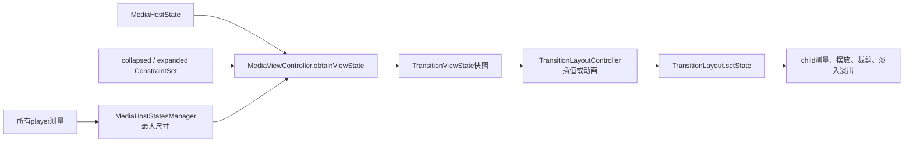
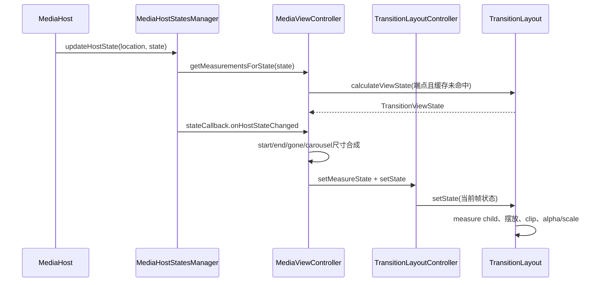
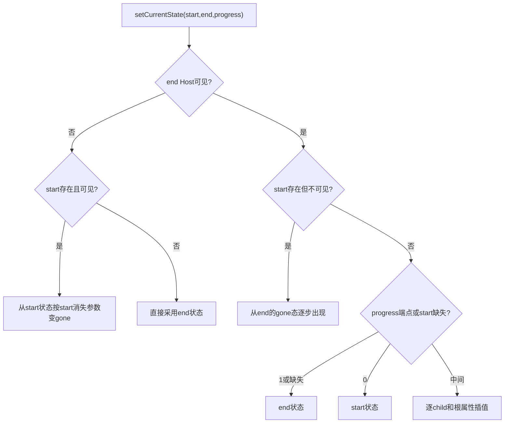

# 第 438 章 Android SystemUI MediaViewController 与 TransitionLayout：状态测量、插值和跨 Host 几何

> 源码基线：Android 11 / API 30 / `android-11.0.0_r48`。本章只在 macOS 阅读源码，不编译。核心文件：`MediaViewController.kt`、`MediaHostStatesManager.kt`、`MediaHost.kt`、`TransitionLayout.kt`、`TransitionLayoutController.kt`、`MeasurementInput.kt`、`PlayerViewHolder.kt`、`media_collapsed.xml` 与 `media_expanded.xml`。

## 1. 本章要解决什么问题

媒体卡从 QQS 到 QS 时，标题、封面、进度条和按钮怎样平滑换位？为什么不能每一帧都重新运行一次 ConstraintLayout？多张大小不同的卡为什么仍能分页对齐？目标 Host 不可见时，卡片又怎样缩掉和淡出？

## 2. 先给出最重要的结论

`MediaViewController` 先把“某个 Host 条件下的整张卡”计算成 `TransitionViewState`，再让 `TransitionLayoutController` 在两个快照间插值，最后由 `TransitionLayout` 直接摆放和裁剪每个 child。动画阶段主要改几何快照，不反复解 ConstraintSet。

## 3. 两种动画不能混为一谈

第一种是卡片内部的 collapsed→expanded：同一测量规格下，在 `media_collapsed.xml` 和 `media_expanded.xml` 两个 ConstraintSet 快照间插值。第二种是 start Host→end Host：两个 Host 可能有不同宽高、展开度和可见性，再对两个完整卡片状态插值。

## 4. 谁真正搬动唯一 mediaFrame

第433章的 `MediaHierarchyManager` 决定唯一 Carousel 根 View 挂在哪个 `UniqueObjectHostView`，并计算屏幕坐标。这里的 `MediaViewController` 不负责换 parent；它只保证每个 player 在迁移过程中拥有连续的内部几何和外框尺寸。

## 5. 一张卡对应一个 Controller

每个 `MediaControlPanel` 持有自己的 `MediaViewController` 和 `TransitionLayout`。因此每张卡可以有不同标题宽度、按钮可见性和 guts 状态；而 `MediaHostStatesManager` 又汇总全部 Controller，协调它们的最大外框尺寸。

## 6. 三层对象各管什么

`MediaViewController` 把 Host 状态翻译成 View 状态；`TransitionLayoutController` 管目标状态、当前状态和 `ValueAnimator`；`TransitionLayout` 执行测量、child定位、裁剪、alpha与scale。分层后，业务状态和底层 View 操作不必揉在一起。

## 7. 输入状态是什么

`MediaHostState` 至少包含 `measurementInput`、`expansion`、`visible`、`showsOnlyActiveMedia`、`falsingProtectionNeeded` 和 `disappearParameters`。其中真正改变卡片内部约束几何的，r48缓存只认测量规格、展开度和guts状态。

## 8. 输出状态是什么

`TransitionViewState` 保存根的 `width/height/alpha/translation/contentTranslation`，并用 `widgetStates[id]` 保存每个child的x、y、视觉宽高、测量宽高、alpha、scale和gone。它是一张“怎样画”的快照，不是View树本身。

## 9. 为什么同时有视觉尺寸和测量尺寸

一个child可按目标尺寸测量，却只显示插值中的一部分宽高。`measureWidth/measureHeight` 决定文本怎样排版和View内部怎样测量，`width/height` 决定当前可见裁剪框；把两者分开可减少动画中的反复换行和measure抖动。

## 10. 总体状态流水线



## 11. collapsed 与 expanded 从哪里来

Controller构造时分别执行：

```kotlin
collapsedLayout.load(context, R.xml.media_collapsed)
expandedLayout.load(context, R.xml.media_expanded)
```

它们是 `res/xml` 下的 ConstraintSet，不是两棵独立布局。真实child都来自同一个 `media_view`。

## 12. 为什么不准备两张卡交叉淡化

两套View会重复持有封面、按钮、点击监听和SeekBar状态，还要同步播放进度。r48只保留一棵child树，先求出两个几何答案，再移动同一批child，状态一致性更容易保证。

## 13. collapsed 约束的直观样子

collapsed状态把封面、标题和最多三枚常用按钮压在较矮面板内；进度条和进度时间明确为 `visibility="gone"`、`alpha="0.0"`，`action0` 与 `action4` 也默认gone，主要显示中间三个动作位。

## 14. expanded 约束的直观样子

expanded状态让进度条和时间进入正常布局，动作链下移到它们下面，五个action位置都具备布局约束；面板高度随内容增加。具体按钮是否有业务动作，还要由MediaControlPanel绑定阶段决定。

## 15. “expanded最多五个动作”不是强制显示五个

ConstraintSet只是提供位置。某个MediaAction不存在时，绑定逻辑仍可让对应View不可见；因此“expanded支持五个”不能误写成“每次展开必有五个按钮”。

## 16. expansion 的取值意义

接口注释规定0表示完全collapsed，1表示完全expanded，中间值表示两端快照的插值进度。这个值通常来自所在Host的展开程度，而不是播放器自己的播放进度。

## 17. 端点怎样计算

当 `expansion == 0.0f || expansion == 1.0f`，Controller调用 `TransitionLayout.calculateViewState()`，暂时把相应ConstraintSet应用到真实View树，正常ConstraintLayout测量布局，再把结果拍成快照。

## 18. 为什么只解两个端点

中间值不再求解一套新的约束，而是递归取得expansion 0和1的状态，然后：

```kotlin
layoutController.getInterpolatedState(
    startViewState, endViewState, state.expansion)
```

这把昂贵的约束求解限制在端点。

## 19. 精确浮点比较是否有意为之

代码只把精确 `0.0f`、`1.0f` 当端点，其他值全走插值。上游应提供规范的0到1状态；若传入极接近0但不等于0的值，也会先取两个端点再插值，而不会选collapsed ConstraintSet直接求解。

## 20. constraintSetForExpansion 的小陷阱

函数写成 `if (expansion > 0) expandedLayout else collapsedLayout`，看似0.3也会直接选expanded；但正常调用它的分支只处理精确0或1，所以中间值根本不会调用。脱离调用上下文读这一行很容易得出错误结论。

## 21. calculateViewState 为什么会碰真实View

ConstraintLayout求解依赖child的LayoutParams、文本测量和资源尺寸。r48没有搭一套纯数据求解器，而是临时把 `measureAsConstraint=true`，对真实TransitionLayout执行measure/layout，再读取结果。

## 22. 计算前如何恢复完整布局

`applySetToFullLayout()` 先把最初就是GONE的child恢复成GONE，并把各child alpha恢复到inflate后记录值，然后 `constraintSet.applyTo(this)`。这是为避免上一次动画留下的INVISIBLE或alpha污染约束求解。

## 23. originalGoneChildrenSet 的来源

`onFinishInflate()` 遍历child：没有id的临时用索引赋id；原本GONE的id加入集合；每个View的原始alpha记入Map。后续测量需要依靠这些初始事实恢复基线。

## 24. 给无id child用索引有什么边界

索引保证 `widgetStates` 能有键；系统资源id通常是很大的生成值，和0、1、2这类索引冲突的实际概率很低。不过它不是全局id分配器，复用TransitionLayout设计时仍应给child稳定id。

## 25. 临时ConstraintLayout测量过程

代码保存旧 measuredWidth/Height，应用ConstraintSet，正常measure，再用测量结果layout；随后 `result.initFromLayout(this)` 读取每个child位置，最后恢复旧的根测量尺寸，并安排pre-draw恢复当前视觉态。

## 26. 为什么结果计算后还要恢复

计算端点会临时把真实child摆到端点位置。如果不恢复，屏幕可能在下一帧短暂显示“测量用状态”。`applyCurrentStateOnPredraw()` 合并注册一个OnPreDrawListener，在绘制前重新应用currentState。

## 27. 复读发现的细节：恢复不是同步完成

函数只立即恢复根的measured dimension，child的视觉位置要等pre-draw时恢复。连续调用多次calculate时，`updateScheduled` 会合并回调；所以读代码时不要把“函数返回”理解成“整棵View已经完全回到旧视觉态”。

## 28. initFromLayout 怎样处理 GONE child

可见child直接读left/top/width/height；GONE child没有普通布局结果，就从 `ConstraintLayout.LayoutParams.constraintWidget` 读取求解位置和尺寸，并把alpha、scale设为0，为以后出现动画提供一个几何起点。

## 29. ViewState缓存为何重要

标题文本、设备名、按钮数量不变时，同一测量规格和展开端点会反复被QQS/QS动画查询。缓存端点可避免每一帧都临时应用ConstraintSet和测量真实View。

## 30. CacheKey 恰好包含什么

四项：`widthMeasureSpec`、`heightMeasureSpec`、`expansion`、`gutsVisible`。源码用一个可变 `tmpKey` 查Map，cache miss后先 `copy()`，因为递归取得0/1端点会重写同一个tmpKey。

```kotlin
private data class CacheKey(
    var widthMeasureSpec: Int = -1,
    var heightMeasureSpec: Int = -1,
    var expansion: Float = 0.0f,
    var gutsVisible: Boolean = false
)
```

## 31. 为什么缓存键不含 visible

`visible` 不改变卡内控件的基础约束，只决定跨Host时使用正常状态还是从正常状态推导gone状态。把它加入端点缓存会产生几何相同的重复条目。

## 32. 为什么不含 showsOnlyActiveMedia

这个字段决定Host是否只在存在active媒体时可见，属于内容筛选/Host可见策略，不改变某一张已存在player的child布局。因此基础ViewState可以复用。

## 33. 为什么不含 falsingProtectionNeeded

它影响触摸是否需要防误触，不改变卡片几何。触摸策略由MediaControlPanel/Host链路消费，不应让它制造新的Constraint测量缓存。

## 34. 为什么不含 disappearParameters

消失参数在基础状态算完之后才交给 `getGoneState()` 推导根宽高、translation和alpha；基础端点不依赖它。参数变化需要重新应用当前状态，但不必重解child约束。

## 35. 为什么不缓存任意中间 expansion

拖动过程中可能出现大量Float值，逐一缓存会快速增长；插值本身只是对已有数字做lerp，成本远低于ConstraintLayout测量。因此源码注释明确只缓存start/end，不缓存interpolated state。

## 36. Map类型为何写成可空值

声明是 `MutableMap<CacheKey, TransitionViewState?>`，但实现只在成功计算端点时放入非null结果；没绑定TransitionLayout或没measurementInput时直接返回null，没有写入“负缓存”。所以可空泛型比实际存储更宽松。

## 37. 什么时候 obtainViewState 返回 null

HostState本身为空、measurementInput为空，或TransitionLayout尚未attach时都会返回null。调用者必须把“状态尚未可测”当正常初始化时序，而不是立即当作系统错误。

## 38. attach 晚于状态到达怎样补救

`attach(transitionLayout)` 保存View并连接layoutController；若之前已有有效 `currentEndLocation`，立即用保存的start/end/progress再次 `setCurrentState(..., applyImmediately=true)`，把迟到的View同步到最新状态。

## 39. attach 前动画请求会怎样

`setCurrentState` 在算出end状态后会先清掉 `animateNextStateChange`，再判断TransitionLayout是否为空。若此刻还没绑定View，这次“只动画下一次”的请求会被消费，之后attach只立即应用，不补播动画。

## 40. 这是初始化保护还是行为缺口

从体验看，未显示的View没必要补播旧动画；从API语义看，调用者若误以为动画标志一直保留就会困惑。最准确的描述是：r48把动画请求绑定到下一次状态提交，而不是绑定到下一次可见提交。

## 41. refreshState 在什么时候用

卡片重新bind、ConstraintSet被MediaControlPanel调整或RTL改变后，要清掉旧几何缓存并重新应用当前状态。`collapsedLayout`/`expandedLayout` 的注释也明确要求修改后调用它。

## 42. 第一次 refresh 为什么预热所有 Host

首次refresh调用 `ensureAllMeasurements()`，遍历Manager中已知的所有HostState，先建立端点缓存；之后refresh只按需计算。这样首次跨位置动画更不容易在手势中途突然承担完整测量成本。

## 43. 预热不是永久全覆盖

它只遍历当时已登记的Host，且只执行一次。以后新增Host、测量规格变化或缓存清空后的其他位置仍可能首次按需计算，所以不能把它理解成“以后绝不会重新measure”。

## 44. RTL 为什么必须主动刷新

TransitionLayout可能未attach却已被拿来计算缓存，不能依赖 `LAYOUT_DIRECTION_INHERIT` 从parent传播。配置监听比较rawLayoutDirection，变化时显式设置View方向并refresh，避免LTR快照在RTL界面复用。

## 45. PlayerViewHolder 也做了一层方向防护

创建mediaView时设为 `LAYOUT_DIRECTION_LOCALE`；SeekBar和进度时间却强制LTR，因为播放进度按从左到右表达。整张卡可镜像，时间轴方向仍保持固定，这是两个不同的产品规则。

## 46. guts 是什么

长按或操作后出现的移除/设置区域称为guts。它和正常播放控制共用同一TransitionLayout，不另开浮层；Controller通过改变WidgetState的alpha与gone，在两组child之间切换。

## 47. 两组 guts id

`controlsIds` 包括应用图标、封面、标题、艺术家、输出设备、进度和action；`gutsIds` 包括说明文本、remove文本、cancel、dismiss和settings。源码的controls集合里 `R.id.icon` 重复一次，但Set会去重，功能无影响。

## 48. setGutsViewState 的准确行为

guts打开时，controls统一alpha=0、gone=true；guts控件alpha=1、gone=false。关闭时controls保留原Constraint状态中的alpha/gone，而guts统一alpha=0、gone=true，因此不会错误地强行显示本就不存在的action。

## 49. 一张卡从Host输入到屏幕的时序



## 50. openGuts 怎样触发动画

首次打开时置 `isGutsVisible=true`，调用 `animatePendingStateChange(500ms, 0)`，随后重算当前状态。因为缓存键含gutsVisible，会得到另一组端点快照，再由TransitionLayoutController从当前画面动画到新快照。

## 51. closeGuts 的两种路径

默认同样用500ms动画；`closeGuts(immediate=true)` 不arm动画，并把 `applyImmediately=true` 交下去，Controller会取消正在运行的Animator，直接落到关闭后的状态。

## 52. 动画请求为什么叫 pending

`animatePendingStateChange(duration, delay)` 本身不启动Animator，只保存一次性标志和时间参数。真正下次 `setCurrentState` 算好完整目标状态后，才把 `shouldAnimate` 传给布局控制器。

## 53. setCurrentState 先保存什么

它一进入就记录startLocation、endLocation和transitionProgress。即使后面因HostState或测量缺失提前return，信息仍保留；之后Host回调、refresh或attach可用同一组参数重试。

## 54. end 状态为什么优先

函数先要求endHostState存在并取得endViewState，因为目标决定parent最终应为卡片预留多大空间。没有终点就无法可靠设置measureState，也无法定义动画落点。

## 55. measureState 先设为 end 的意义

动画中的视觉根宽高可以在start和end之间变化，但parent布局若每帧跟着重排会抖动。先用end状态告诉TransitionLayout期望测量尺寸，外层可直接为目标空间布局，而child视觉继续插值。

## 56. TransitionLayout 的双状态模型

`currentState` 是这一帧怎样显示；`measureState` setter只把目标 `width/height` 写入 `desiredMeasureWidth/Height` 并requestLayout。正常onMeasure按currentState测child，却把根reported dimension设为desired尺寸。

```kotlin
var measureState: TransitionViewState = TransitionViewState()
    set(value) {
        val newWidth = value.width
        val newHeight = value.height
        if (newWidth != desiredMeasureWidth || newHeight != desiredMeasureHeight) {
            desiredMeasureWidth = newWidth
            desiredMeasureHeight = newHeight
            if (isInLayout()) {
                forceLayout()
            } else {
                requestLayout()
            }
        }
    }
```

## 57. 复读发现：measureState 属性没有保存 value

自定义setter里没有 `field = value`。因此属性getter仍返回初始化的空状态；r48实际只使用setter的宽高副作用，Controller也不读回它。讲解时应称它为“目标外框尺寸入口”，而不是一个可可靠读取的已保存对象。

## 58. 为什么 child 仍按 currentState 测量

根要占目标空间，不代表文字和按钮马上采用终点外观。normal `onMeasure` 遍历currentState.widgetStates，按各自 `measureWidth/measureHeight` 精确测child，保证当前动画帧的内容排版规则。

## 59. Carousel 为什么需要统一外框

不同歌曲标题、按钮和SeekBar状态可能使各player端点测量稍有差异。分页容器若每页宽高不同，会造成ScrollX步长和父Host高度跳变，因此同一location下要以所有卡的最大宽高作为共同外框。

## 60. 最大尺寸在哪里算

`MediaHostStatesManager.updateCarouselDimensions()` 遍历全部MediaViewController，调用 `getMeasurementsForState(hostState)`，分别取最大width和最大height，并放入 `carouselSizes[location]`。

## 61. 最大宽和最大高可能来自不同卡

代码独立比较宽与高，不要求同一张player同时提供二者。最终 `(maxWidth, maxHeight)` 可能是一个没有任何单卡真实测得过的组合，但作为统一外框完全可用。

## 62. 单卡怎样采用最大尺寸

`updateViewStateToCarouselSize()` 先深拷贝该卡ViewState，再把根width/height与Manager记录的最大值逐项取max。只改根外框，不拉伸各WidgetState，所以标题、封面和按钮仍保持自己的布局。

## 63. 为什么还要 Math.max 防守

注释说override理应正确，但仍用最大值避免过时的Carousel尺寸反而裁小真实卡片。这个保护只能防“记录太小”，不能让新增/删除player后Manager立刻重算。

## 64. 新增 Controller 会自动重算已有 location 吗

`addController()` 只加入Set，没有遍历现有Host重算；remove也只删除。因此现有 `carouselSizes` 的及时更新依赖后续Host测量/状态更新等调用。阅读时不能从“已注册”推导出“所有location最大值已立即刷新”。

## 65. Host 测量怎样进入 Manager

`UniqueObjectHostView.MeasurementManager.onMeasure()` 收到MeasurementInput；若宽度模式是AT_MOST，就把同一size改成EXACTLY，写给state.measurementInput，再让Manager计算Carousel最大尺寸。

## 66. 为什么 AT_MOST 被转成 EXACTLY

媒体卡需要填满Host允许的横向空间，保证每页等宽和跨Host插值有确定终点。如果保留AT_MOST，每张卡可能按内容自行收缩，统一分页会更难。

## 67. 复读发现：测量变化可能算两遍最大值

写 `state.measurementInput=input` 会触发changedListener→`updateHostState()`→`updateCarouselDimensions()`；随后onMeasure又显式调用一次 `updateCarouselDimensions(location,state)`。当输入确实变化时，r48可能连续遍历Controllers两次，这是实现成本点，不是两种不同结果。

## 68. HostState 为什么复制后保存

Manager检测不等后用 `hostState.copy()` 写入Map，防止Host随后原地修改同一Holder，让Map中的“旧状态”也悄悄变化，破坏equals比较和回调的一致快照。

## 69. updateHostState 的回调顺序

先保存新状态和更新Carousel尺寸，再逐个调用所有MediaViewController的stateCallback，最后才调用其他callbacks。注释说明其他观察者可能依赖Controller已经完成测量/更新。

## 70. 线程假设是什么

Manager使用普通MutableMap/MutableSet，没有锁或并发集合；MediaHost、View和动画也都是UI对象。r48依赖SystemUI主线程串行调用，不能把这些方法当作任意后台线程安全API。

## 71. stateCallback 何时重算单卡

只有变化location等于当前start或currentEnd时，Controller才重新setCurrentState。其他Host变化会更新Manager记录，却不会让一张当前完全无关的卡立即重绘。

## 72. start 与 end 都可有不同 expansion

先分别对startHostState和endHostState调用obtainViewState；每个Host内部可能已经是collapsed、expanded或中间展开态。跨Host插值是在这两个“已完成内部展开插值的完整状态”之间再做一次插值。

## 73. 这是两级插值

例如start Host expansion=0.3，先由collapsed/expanded得到S；end Host expansion=1得到E；再用transitionProgress从S到E。不能简单把两个progress相乘，因为每个child的gone、measure尺寸和Host可见规则都参与第二级计算。

## 74. transitionProgress 的端点优化

end可见时，progress==1直接用end；progress==0直接用start；只有0与1之间才调用getInterpolatedState。这样端点不会因浮点lerp和临时对象产生额外偏差。

## 75. startState 缺失时怎样降级

如果start Host未登记或无法测量，end可见路径会直接使用endViewState。系统宁愿没有过渡、直接落位，也不凭空造一个不可靠起点。

## 76. end Host 不可见怎样处理

若start有效且可见，就以startViewState为基准，配合startHostState.disappearParameters和transitionProgress生成goneState。因为“从哪里消失”应遵从离开位置的消失参数。

## 77. start Host 不可见、end 可见怎样处理

以endViewState为基准，用end Host的disappearParameters计算 `goneProgress = 1 - transitionProgress`。progress从0走到1时，卡片从“完全gone的end形态”逐步恢复为正常end状态。

## 78. 两端都不可见会怎样

end不可见分支发现start为空或也不可见后，直接使用endViewState，而不是套两次消失逻辑。通常层级管理器不会把这种状态当成可见迁移动画；这里选择确定的终态以避免无依据插值。

## 79. DisappearParameters 默认值

`gonePivot=(0,1)`、`disappearSize=(1,0)`、`contentTranslationFraction=(0,0.8)`、start=0、end=1、fadeStart=0.9。直观上外框宽度保留、高度收至0，并围绕底边方向移动，最后10%才明显淡出。

## 80. getGoneState 的第一步

先把全局goneProgress从 `[disappearStart, disappearEnd]` 映射到0..1并constrain。这样不同Host可规定晚一点开始或提前结束消失，而后续几何计算只处理标准化进度。

## 81. 外框缩小与 translation 的关系

新宽高在原尺寸和 `原尺寸×disappearSize` 间lerp；translation等于“被缩掉的尺寸×gonePivot”。pivot为(0,1)时x不补偿，y随高度缩小而下移，使消失边界锚向底部。

## 82. 可见、消失与跨Host的分支图



## 83. contentTranslation 为什么另算

根translation移动整个TransitionLayout，contentTranslation再参与每个child的left/top。公式 `(fraction - 1) * rootTranslation` 使内容可相对收缩边界少移、多移或反向移，避免child完全机械地贴着裁剪边界走。

## 84. 默认Y方向的直观效果

根因高度减少向下移 `T`，child额外得到 `(0.8-1)T=-0.2T`，两者叠加后的屏幕位移约为0.8T。也就是内容随底边方向下移，但比外框边界移动得慢一些。

## 85. alpha 为什么到 fadeStart 才降

`fadeStartPosition=0.9` 被映射为alpha从1到0，前90%主要通过裁剪/位移表达消失，最后10%才淡出。不同Host可设置不同参数，形成锁屏、QS等位置各自的退出感觉。

## 86. 普通child插值哪些属性

x、y、width、height、alpha、scale都按progress处理；measureWidth/Height直接采用end。根的width、height、translation、contentTranslation和alpha也插值。这里没有每帧重新计算ConstraintSet。

## 87. 为什么普通child直接用end测量尺寸

文本若从窄变宽，持续改变measureWidth会导致反复换行和内部布局变化；直接按终点测量，再用视觉width裁剪，动画轨迹更稳定，measure次数也更少。

## 88. GONE 到可见怎样出现

它从终点测量尺寸开始，scale由终点的80%升到100%，位置从gone几何中心附近移到终点；前80%仍标gone，alpha主要在最后20%淡入。这样控件不会从零宽硬拉伸出来。

## 89. 可见到 GONE 怎样消失

它保持start测量尺寸，scale从100%降到80%，alpha在前20%淡出；progress超过0.2后标gone。剩余时间仍可保持几何插值，但View已经INVISIBLE，减少突兀的长距离淡出。

## 90. gone 不是 Android View.GONE

applyCurrentState把 `widgetState.gone || alpha==0` 的child设为 `View.INVISIBLE`，不是GONE。这样child仍可保持测量信息，不触发ConstraintLayout因节点移除而重新求解。

## 91. alpha 怎样应用

代码通过 `CrossFadeHelper.fadeIn(child, widgetState.alpha)`，不只是简单赋alpha；它可同时处理淡入相关的层/可见效果。根TransitionLayout的整体alpha也用同一Helper应用。

## 92. TextView 为什么需要 clip mode

当视觉width小于measureWidth，TextView仍按目标宽度排版，但可见区域要逐步变宽。代码让View bounds保持measureWidth，通过clipBounds只露出widgetState.width，防止每一帧重新排文字。

## 93. RTL 文本裁剪为何要 shift

右到左段落应从右侧保留内容。代码调用 `child.layout.getParagraphDirection(0)`，若为RTL就令clipShift=`measureWidth-width`，同时左边界左移，让裁剪框贴住文字右侧。

## 94. RTL clip 的前置假设

源码没有对 `TextView.layout` 做空检查，也直接查询第0段；它依赖child此前已成功测量并形成Layout。当前媒体View的计算流程通常满足这个条件，但把TransitionLayout移作通用容器时要留意。

## 95. child 何时重新 measure

applyCurrentState只有在当前measuredWidth/Height与WidgetState的measure尺寸不同才执行EXACTLY measure并layout到0,0；相同则直接改bounds、scale和clip，减少动画帧工作量。

## 96. 为什么先 layout(0,0) 再改 bounds

重新measure后先给child一次与测量尺寸匹配的本地layout，让TextView等内部布局准备好；随后 `setLeftTopRightBottom()` 把它快速移动到目标位置，避免再走整个父布局流程。

## 97. 根边界怎样变化

`updateBounds()` 保留当前left/top，直接把right/bottom改为 `left+currentState.width` 和 `top+height`，同时更新用于dispatchDraw的Rect。于是视觉外框可插值，而父测量尺寸已先采用end。

## 98. 为什么 dispatchDraw 再 clipRect

child可能按较大的目标尺寸测量或在位移中超出当前根视觉边界。绘制前按boundsRect裁剪，确保collapsed/消失过程中内容不会泄露到媒体卡外。

## 99. TransitionLayoutController 的三个状态

`currentState` 是当前屏幕画面；`state` 是最新目标的深拷贝；`animationStartState` 是动画启动瞬间的当前画面快照。三者分开，目标中途变化时才能保持视觉连续。

## 100. setState 立即应用路径

`applyImmediately=true` 或TransitionLayout尚未attach时，Animator被cancel，目标立刻apply，currentState也深拷贝为目标。前者用于刷新/强制关闭，后者保存逻辑当前值以便未来连接。

## 101. 第一次状态为什么通常不动画

`animated = animate && currentState.width != 0`。初始currentState宽为0，即使上层请求animate也会直接落到目标，避免从未初始化的空几何飞入。

## 102. 正常动画怎样开始

Controller复制currentState作为animationStartState，设置duration与startDelay，启动0→1的ValueAnimator，插值器为FAST_OUT_SLOW_IN。每次update按animatedFraction生成当前状态并应用。

## 103. 动画中 animate=false 的新目标

如果Animator正在运行，代码不会立即apply，也不停止动画，只更新字段 `state`。下一帧仍从原animationStartState出发，但终点改成最新目标，因此轨迹可被实时重定向。

## 104. 动画中再次 animate=true

会先把“此刻currentState”复制为新起点，然后对同一个Animator重新设置时长/延迟并start。视觉上从当前帧续向新目标，而不是跳回上一轮最初起点。

## 105. 尺寸回调报告什么

每次apply的TransitionViewState根宽高变化时，Controller调用sizeChangedListener；MediaViewController更新 `currentWidth/currentHeight`，再调用其lateinit listener，Carousel据此更新尺寸、滚动或外层布局。

## 106. lateinit listener 的时序要求

MediaViewController构造时已经安装底层尺寸回调，但外部 `sizeChangedListener` 尚未赋值。正常Carousel建卡会及时设置它；若其他调用路径先触发尺寸变化，`invoke()` 会抛未初始化异常，这是调用契约而非空安全实现。

## 107. reusable state 的收益

`tmpState/tmpState2/tmpState3` 和插值的 `reusedState` 避免每帧创建大量Map外壳与PointF，减少SystemUI手势动画中的GC压力。WidgetState复制仍会产生对象，但整体分配比全量新建更少。

## 108. reusable state 的残留风险

`TransitionViewState.copy()` 和 `initFromLayout()` 都只覆盖源中存在的id，不先clear目标Map；`getInterpolatedState()`遇到任一端缺id也直接continue。固定媒体布局的child集合稳定，所以通常无碍；若动态删除child，旧id状态可能残留。

## 109. onLocationPreChange 为什么提前设测量态

层级位置即将改变但完整setCurrentState尚未来时，先取得newLocation的ViewState写给measureState，让父布局尽早按新位置尺寸测量，降低换parent时的一帧尺寸错位。

## 110. 复读发现：预切换没有套 Carousel 最大值

`onLocationPreChange()` 直接传 `obtainViewStateForLocation(newLocation)`，没有调用 `updateViewStateToCarouselSize()`；正式setCurrentState才套统一最大尺寸。因此极端时序下可能短暂按单卡尺寸测量，之后再修正为Carousel尺寸。

## 111. 本章排查问题的最短路径

先看Host的measurementInput/expansion/visible是否正确；再看Manager的carouselSizes；随后看Controller端点缓存与start/end/progress；再看TransitionLayoutController当前/目标/Animator；最后检查WidgetState的measure尺寸、视觉尺寸、gone和clip。不要一开始只盯XML。

## 112. macOS只读练习一：对比两个 ConstraintSet

执行 `diff -u frameworks/base/packages/SystemUI/res/xml/media_collapsed.xml frameworks/base/packages/SystemUI/res/xml/media_expanded.xml | less`。只记录进度条、action0/action4、标题/封面约束和上下margin差异；不要修改文件，也不要编译。

## 113. macOS只读练习二：手工追一次 expansion=0.4

用 `rg -n "obtainViewState|constraintSetForExpansion|getInterpolatedState" frameworks/base/packages/SystemUI/src/com/android/systemui/media/MediaViewController.kt` 定位调用。纸上写出：先求0端点、再求1端点、最后以0.4插值；确认中间值不会直接把expanded ConstraintSet求解一次。

## 114. macOS只读练习三：验证根测量和视觉尺寸分离

用 `rg -n "measureState|desiredMeasure|currentState|setMeasuredDimension|updateBounds" frameworks/base/packages/SystemUI/src/com/android/systemui/util/animation/TransitionLayout.kt`，画两列分别记录“parent看到的尺寸”和“屏幕当前裁剪尺寸”，并标出它们各自读取哪个字段。

## 115. macOS只读练习四：推演可见到不可见

只读 `getGoneState()` 与 `setCurrentState()`，假设start尺寸300×180、默认参数、progress=0.5，手算根约为300×90、translation约(0,90)、contentTranslation约(0,-18)、alpha仍为1；再说明child最终屏幕Y位移为何约72。无需运行测试。

## 116. 容易误解一：跨 Host 动画全由这里完成

不准确。这里计算每张卡内部布局和外框状态；唯一mediaFrame的屏幕边界、overlay/parent迁移、Host选择由MediaHierarchyManager负责。两边共同作用，才形成完整跨QQS/QS/锁屏动画。

## 117. 容易误解二：每帧都在跑 ConstraintLayout

不准确。ConstraintLayout主要用于缓存未命中的0/1端点测量；动画帧通常只是对TransitionViewState数字插值，再直接measure必要child、改bounds与clip。中间Host expansion也复用两个端点。

## 118. 容易误解三：统一尺寸会把所有卡内容拉一样大

不准确。Manager只把每张卡根ViewState的width/height抬到同location最大值；WidgetState不随之缩放，封面、文字和按钮仍按各自ConstraintSet几何显示。

## 119. 容易误解四：gone 就等于从布局中删除

不准确。动画快照中的gone最终映射为INVISIBLE，保留测量与位置；真正ConstraintSet端点计算时才会临时恢复原始GONE语义。这个区分正是无重复约束求解动画的关键。

## 120. 本章总结与下一章连接

本章把媒体卡变形还原为“Host状态→端点测量缓存→两级插值/消失推导→目标测量尺寸与当前视觉尺寸分离→直接摆放裁剪”。下一章继续进入媒体控件绑定与生命周期，追踪 `MediaControlPanel` 如何把MediaData、MediaController、Artwork、动作按钮和本章的Constraint状态连起来。
