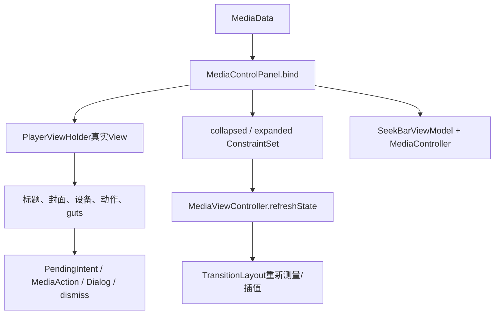
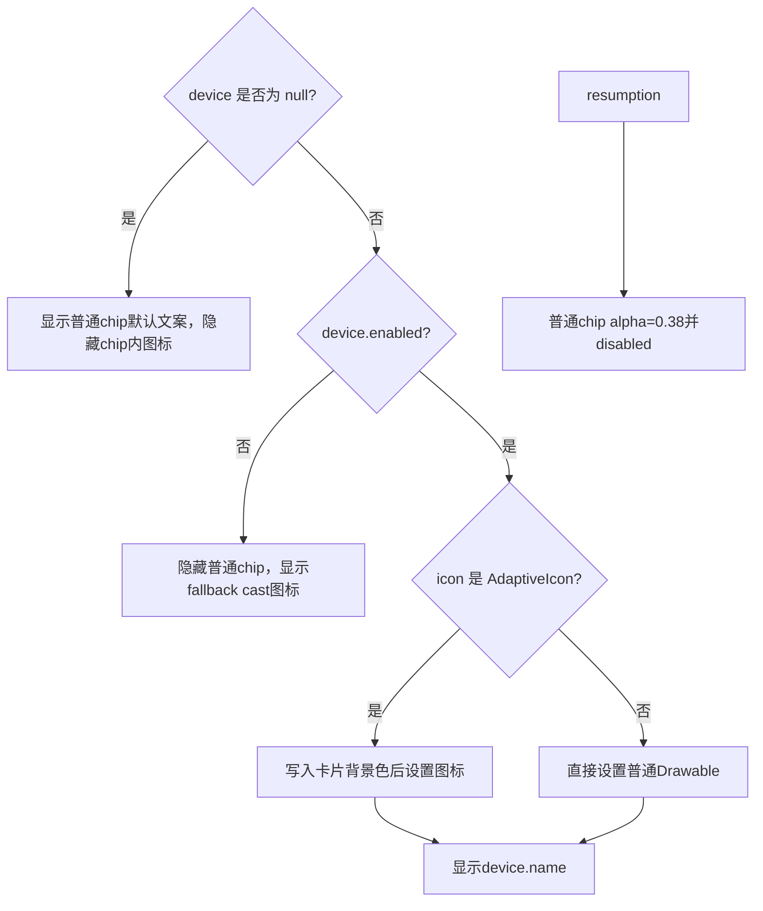
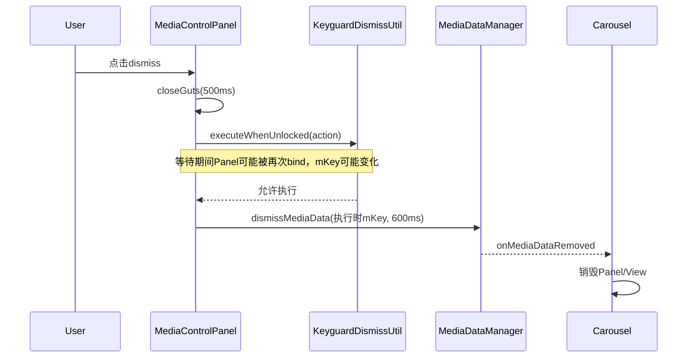

# 第 439 章 Android SystemUI MediaControlPanel：数据绑定、Artwork、动作按钮与 Guts 生命周期

> 源码基线：Android 11 / API 30 / `android-11.0.0_r48`。本章只在 macOS 阅读源码，不编译。核心文件：`MediaControlPanel.java`、`MediaControlPanelTest.kt`、`PlayerViewHolder.kt`、`MediaData.kt`、`MediaDataManager.kt`、`MediaCarouselController.kt`、`SeekBarViewModel.kt`、`MediaViewController.kt` 与 `media_view.xml`。

## 1. 本章要解决什么问题

上一章已经知道一张媒体卡怎样变形，本章继续追“卡上到底显示什么”：MediaData怎样写入标题、封面、输出设备、五个动作和guts？Token怎样接到MediaController？点击、长按、删除和设置分别走向哪里？同一个Panel反复bind时又可能留下什么旧状态？

## 2. MediaControlPanel 的准确角色

它是单张player的绑定控制器：把 `MediaData` 写进 `PlayerViewHolder`，同步修改collapsed/expanded ConstraintSet，连接SeekBar和MediaController，并安装各种点击监听。它不负责Carousel排序，也不负责从通知原始字段解析MediaData。

## 3. 输入 MediaData 已经是加工结果

MediaDataManager先从通知、MediaSession和设备链路整理出应用名、歌曲、歌手、Artwork、MediaAction列表、compact索引、Token、clickIntent、MediaDeviceData、resumption和isClearable；Panel主要负责把这些字段投影为View状态。

## 4. 输出不只是修改 View

一次bind会同时改三类状态：真实View的文本、Drawable、enabled和listener；`collapsedLayout/expandedLayout` 的visibility与alpha；SeekBarViewModel持有的MediaController。漏改任一层都可能出现“看起来隐藏了但还能残留旧数据”的问题。

## 5. attach 与 bind 必须分开理解

`attach(holder)` 建立长期连接：View引用、Outline、LiveData observer、SeekBar触摸、TransitionLayout和固定监听。`bind(data,key)` 则可对同一个Panel反复执行，更新当前媒体内容和随数据变化的监听。

## 6. 为什么 Panel 会被反复 bind

同一通知的metadata、PlaybackState、输出设备或clearable状态会更新；key迁移也可能复用原Panel。Carousel不会为每个小变化都inflate新卡，因此bind必须具备“完整覆盖旧状态”的能力。

## 7. 运行在哪个进程

MediaControlPanel属于SystemUI进程。MediaData listener和View操作以主线程为中心；Artwork/通知解析更早在MediaDataManager后台完成，SeekBar controller更新被显式投递到注入的Background Executor。

## 8. 哪些地方跨进程

MediaController最终通过MediaSession Binder控制媒体App；MediaAction通常发送App提供的PendingIntent；ActivityStarter/KeyguardDismissUtil可引出Activity与锁屏流程；输出芯片打开SystemUI自己的Dialog，但路由操作继续进入媒体路由服务。

## 9. 一张卡的对象关系

Panel持有ViewHolder、MediaViewController、SeekBarViewModel、当前key/token/controller和若干系统入口。ViewHolder只集中查找child并暴露类型安全引用，不保存MediaData，也不决定动作策略。

## 10. 绑定总览图



## 11. 构造函数注入了什么

Context用于资源和MediaController；Background Executor用于异步任务；ActivityStarter负责启动内容与设置；MediaViewController负责几何；SeekBarViewModel负责进度；Lazy MediaDataManager负责删除；KeyguardDismissUtil负责解锁门；DialogFactory负责输出切换。

## 12. 为什么 MediaDataManager 用 Lazy

Panel只在点击dismiss时才需要Manager。Lazy可减轻构造依赖环和无删除场景的初始化成本；但它不改变dismiss最终仍回到中央媒体数据账，而不是直接从ViewGroup删卡。

## 13. 尺寸资源何时读取

构造时 `loadDimens()` 读取专辑图尺寸和主题dialogCornerRadius。OutlineProvider闭包以后读取这两个字段，为封面生成固定圆角矩形。

## 14. 配置变化怎样更新这些尺寸

MediaControlPanel自身没有Configuration callback，也不会再次调用loadDimens。第437章看到Carousel在density/font/overlay变化时重建players，新Panel构造时才重读资源；仅一般方向变化则主要走View/Constraint刷新。

## 15. PlayerViewHolder 做什么

它从 `media_view.xml` 一次取得应用图标、标题、歌手、封面、设备chip、SeekBar、五个action和guts控件。`requireViewById` 找不到id会立即失败，让布局与代码不匹配尽早暴露。

## 16. 根为什么必须是 TransitionLayout

构造里直接执行 `itemView as TransitionLayout`；媒体卡不是普通ConstraintLayout。后续MediaViewController需要对同一child树计算collapsed/expanded快照并直接摆放。

## 17. IlluminationDrawable 的关联

ViewHolder把seamless、五个action、cancel、dismiss和settings登记为背景的light source。按压这些控件时，卡片背景可产生统一光照/涟漪反馈；Panel只负责数据和监听，不逐个实现背景动画。

## 18. 创建 ViewHolder 时的方向规则

mediaView按locale决定LTR/RTL；SeekBar和两端时间文本强制LTR。动作按钮在XML与ConstraintSet里也按左到右顺序组织，避免RTL把播放时间或上一首/下一首语义机械反转。

## 19. attach 的第一项工作

保存holder和根TransitionLayout，然后给albumView设置OutlineProvider并开启clipToOutline。封面Drawable可超出ImageView本地边界，但最终只显示在圆角专辑图区域内。

## 20. SeekBar 怎样附着

为当前holder新建 `SeekBarObserver`，用 `observeForever` 订阅Progress；再让SeekBarViewModel安装触摸处理。Observer管数据显示，ViewModel管拖动、poll和seek，二者不是一个对象。

## 21. attach 的决定性源码

```java
mSeekBarObserver = new SeekBarObserver(vh);
mSeekBarViewModel.getProgress().observeForever(mSeekBarObserver);
mSeekBarViewModel.attachTouchHandlers(vh.getSeekBar());
mMediaViewController.attach(player);
```

这四行把数据观察、手势和几何控制都接到同一棵View树。

## 22. 长按怎样打开 guts

根player的OnLongClick先检查 `isGutsVisible`。关闭时调用openGuts并返回true，表示长按已消费；已打开时返回false，不重复启动动画。

## 23. guts 已打开时为何返回 false

此时长按不再有动作，允许事件继续按View规则处理；如果随后触发普通click，根click listener还会再次检查guts并直接return，所以不会误打开媒体App。

## 24. Cancel 怎样关闭 guts

Cancel固定调用无参 `closeGuts()`，内部转为 `closeGuts(false)`，因此使用500ms状态动画。外部若销毁/重建前要立即收起，可调用公开的boolean重载传true。

## 25. Settings 的入口

Settings点击调用 `ActivityStarter.startActivity(ACTION_MEDIA_CONTROLS_SETTINGS, true)`；第二个参数要求收起Shade。它打开的是媒体控制设置，不是当前媒体App设置，也不是MediaOutputDialog。

## 26. attach 应当只执行一次

实现没有“一次性”防护。若对同一Panel再次attach，旧observeForever observer不会先移除，旧SeekBar也保留触摸对象；正常Factory生命周期保证一次attach，通用调用者不应把它当可重入API。

## 27. bind 未 attach 会怎样

函数开头发现mViewHolder为空就直接return，连mKey、mToken和mController都不更新。r48测试只验证这种调用不会崩溃且isPlaying为false；它不会把数据排队到以后自动补bind。

## 28. key 的用途

`mKey=key` 主要给dismiss使用。Panel本身不据此查MediaData；标题、动作等完全采用本次data。key迁移复用Panel时，这个字段会改成新key。

## 29. token 怎样更新

只有旧token为空或与新token不等时才给 `mToken=token`；旧非空而新为null也会因equals(null)为false而清空。这个条件看似在避免重复工作，但下一步仍会无条件处理controller。

## 30. 相同 token 仍会新建 MediaController

源码是：

```java
if (mToken != null) {
    mController = new MediaController(mContext, mToken);
} else {
    mController = null;
}
```

因此每次bind只要token非null就创建新对象，即使token没有变；前面的token相等判断没有复用旧controller。

## 31. 新建 Controller 是否等于新建 Session

不是。Token仍指向媒体App中的同一个MediaSession；这里新建的是SystemUI客户端包装对象。SeekBarViewModel随后会取消旧callback并注册到新Controller，但重复对象和callback切换仍有成本。

## 32. 背景色怎样应用

MediaData背景色写入 `mBackgroundColor`，再对TransitionLayout调用 `setBackgroundTintList(ColorStateList.valueOf(...))`。这个颜色已由MediaDataManager根据Artwork取色并调低饱和度/固定亮度，不是Panel现场分析位图。

## 33. 根点击打开什么

data.clickIntent非null时，安装OnClickListener；guts关闭才调用 `postStartActivityDismissingKeyguard(clickIntent)`。PendingIntent通常来自媒体通知contentIntent，目标和权限由发布通知的App定义。

## 34. clickIntent 为 null 的复用问题

null分支什么都不做，没有 `setOnClickListener(null)`。若同一Panel上一次bind有clickIntent、下一次变null，旧listener和旧PendingIntent仍留在根View，点击可能打开旧目标。这是r48明确可从代码推出的重绑残留。

## 35. 为什么 guts 检查必须在 listener 内

同一根View在guts动画期间仍有旧媒体click listener；不能只在openGuts时临时禁用一次，因为状态可中途改变。每次点击现场检查ViewController状态，确保设置/删除界面不会穿透到App。

## 36. Artwork 的有无怎样影响约束

`hasArtwork = data.artwork != null`。有图时加载Drawable并写给albumView；无论有无，都在collapsed和expanded两个ConstraintSet中同步设置album_art的visibility和alpha。

## 37. scaleDrawable 的调用位置

```java
if (hasArtwork) {
    Drawable artwork = scaleDrawable(data.getArtwork());
    albumView.setImageDrawable(artwork);
}
```

`scaleDrawable` 标为 `@UiThread`，直接在bind中调用；Panel不是在这里把Artwork缩成新Bitmap，而是计算Drawable bounds。

## 38. “scale” 实际做了什么

先 `Icon.loadDrawable(context)`，按intrinsicWidth/Height算宽高比，再构造至少覆盖正方形album区域的bounds；长边超出时用负offset居中。配合ImageView裁剪，得到类似center-crop的视觉效果。

## 39. 竖图和横图的公式

竖图固定宽为albumSize，高=`size×ratio`；横图固定高为albumSize，宽=`size/ratio`。多出的长边一半移到负坐标，圆角Outline只露出中央正方形。

## 40. 它没有真正重新采样 Bitmap

Drawable仍是原对象，只改变bounds。高分辨率Bitmap的内存不会因此缩小；真正的Artwork查找、URI读取和Icon构造已在MediaDataManager后台链发生。

## 41. 构造注释与r48实际线程

构造注释把Background Executor描述为“used for processing artwork”，但本类的Artwork `loadDrawable + setBounds` 在bind线程执行；该Executor在本文件实际只用于 `SeekBarViewModel.updateController()`。阅读注释时应以调用点校准。

## 42. 无 Artwork 会不会清旧 Drawable

不会调用 `albumView.setImageDrawable(null)`，旧Drawable仍被View引用；但两套ConstraintSet都把album_art设为GONE/alpha0，所以正常视觉不泄漏。重绑新图时会覆盖，销毁前则可能多保留一段旧Drawable内存。

## 43. 封面圆角用的是什么半径

半径来自当前主题 `android.R.attr.dialogCornerRadius`，Outline大小却固定为 `qs_media_album_size`。若Drawable bounds大于View，clipToOutline和TransitionLayout的外层clip共同限制显示区域。

## 44. App 图标的 fallback

data.appIcon非null就直接设置；否则使用SystemUI的 `ic_music_note`。这条分支每次都覆盖ImageView，因此不像null clickIntent那样保留旧App图标。

## 45. 标题为什么用 safeCharSequence

歌曲名和歌手可能来自媒体App提供的通知/metadata CharSequence。`Notification.safeCharSequence` 限制异常长度并清理不安全的Parcelable span，降低把跨进程富文本直接交给SystemUI TextView的风险。

## 46. App 名为什么没有同样调用

代码直接 `appName.setText(data.getApp())`。这里的app通常由Notification.Builder根据包信息加载header应用名，信任来源和歌曲metadata不同；但从Panel代码本身看，确实只有song/artist显式safe。

## 47. 输出芯片先做一次基线重置

bind先把seamless真实View设VISIBLE，也把两套ConstraintSet设为可见alpha1；随后再根据MediaDeviceData覆盖chip/fallback可见性。这样多数旧设备状态能在本次bind被重新写全。

## 48. MediaDeviceData 三个字段

`enabled` 表示路由信息是否可信到允许输出切换；`icon` 和 `name` 描述当前输出位置。它不是MediaController.playbackInfo本身，而是第435章MediaDeviceManager合流后的UI数据。

## 49. disabled device 为什么显示 fallback

当device非null且enabled=false，普通seamless group被GONE，独立 `media_seamless_fallback` 图标变VISIBLE。fallback没有安装点击监听，只表达“当前无法可靠提供切换chip”。

## 50. 输出设备绑定分支图



## 51. 为什么真实View和ConstraintSet都要改

ConstraintSet控制下次快照测量；真实View visibility则避免refresh前短窗口或Constraint测量基线读到错误状态。device分支显式两边都写，正是三层绑定模型的例子。

## 52. resumption 卡怎样处理输出芯片

普通chip alpha设为0.38且 `setEnabled(false)`，因为恢复卡尚没有活跃Session，不应切输出。但visibility仍按device分支；若显示的是fallback，alpha只设置在已隐藏的seamless id上，fallback本身不因resumption再降alpha。

## 53. 输出芯片点击捕获什么

每次bind都安装新listener，捕获本次 `data.packageName`，调用 `MediaOutputDialogFactory.create(packageName, true)`。第二个参数表示从媒体控制入口打开；真正路由状态由Dialog内部Controller再获取。

## 54. device 为 null 为什么仍可点击

null分支显示默认系统文案并让普通chip保持enabled（resumption除外）。MediaDeviceData尚未到达不必等于没有MediaSession，点击后Dialog仍可能自己发现可用route。

## 55. AdaptiveIcon 为什么特殊

如果device.icon是SettingsLib AdaptiveIcon，Panel先调用 `setBackgroundColor(mBackgroundColor)`，让它的背景与媒体卡配色协调，再交给ImageView。普通Drawable不做这一步。

## 56. 修改 AdaptiveIcon 的副作用

这里原地修改传入Drawable对象，而不是mutate/复制。若同一AdaptiveIcon实例被其他View共享，它们也可能观察到背景色变化；当前设备链通常把图标作为该卡UI数据使用，但对象所有权并未在类型上强制独占。

## 57. 从 null device 恢复到有图设备

null分支把iconView设GONE；下一次device非null分支会显式设VISIBLE并设置Drawable，所以这条状态可恢复。showFallback分支虽然清空chip内部图标/文字，但普通chip整体已GONE。

## 58. 五个动作位置怎样定义

静态 `ACTION_IDS` 固定action0到action4，列表索引0映射action0，以此类推。第三个View在XML中尺寸52dp，其余48dp，但ConstraintSet里动作位宽度写48dp；最终端点以ConstraintSet应用结果为准。

## 59. MediaAction 里有什么

只有Drawable、可空Runnable和contentDescription。Panel不再判断它是play、pause、next还是自定义动作；语义和PendingIntent发送逻辑已由MediaDataManager包装进Runnable。

## 60. 动作绑定循环的上限

循环条件同时要求 `i < actionIcons.size()` 和 `i < ACTION_IDS.length`，因此最多处理五个。第六个以后的通知动作不会出现在这张QS媒体卡上。

## 61. 每个已用按钮写哪些字段

覆盖Drawable、contentDescription、enabled，并在Runnable非null时安装点击listener；随后按compact索引决定collapsed可见，expanded则总设为可见。最后refresh才把ConstraintSet变化转换成新ViewState。

## 62. Runnable 为 null 的行为

按钮被disabled，但旧OnClickListener没有清除。正常触摸不会触发disabled按钮，因此功能上被门控；不过对象仍引用旧Runnable，且测试/代码若绕过enabled直接调用listener路径，要知道它没有被置空。

## 63. 动作 Runnable 的决定性源码

```java
if (action == null) {
    button.setEnabled(false);
} else {
    button.setEnabled(true);
    button.setOnClickListener(v -> action.run());
}
```

它不等待成功ACK；Runnable一旦发出，下一次通知或Session回调才提供事实收敛。

## 64. collapsed 显示哪些动作

`actionsToShowInCompact.contains(i)` 为真才把该槽在collapsed ConstraintSet设VISIBLE。这个List保存的是动作列表索引，不是View id，也不是PlaybackState action bit。

## 65. expanded 为什么“全部可见”仍有限制

这里只把已经进入前五个actionIcons的槽设VISIBLE。MediaAction数量少于五时，后续槽会被第二个循环隐藏；所以expanded显示“本次已绑定动作的全部”，不是固定五枚。

## 66. 未使用按钮怎样清理

剩余ACTION_IDS只在两套ConstraintSet中设GONE/alpha0，没有清Drawable、contentDescription、enabled或listener。它们不可见且无布局交互，但旧对象引用会保留到以后覆盖或Panel销毁。

## 67. 超过五个动作会怎样

Panel静默截断，不记录告警。compact索引若指向5以上也永远不匹配循环中的0..4；SystemUI把有限屏幕空间当硬上限。

## 68. compact 索引的上游错位边界

MediaDataManager遇到某个通知action没有icon时，会跳过它并从compact列表移除原index，却不会把后续原index整体减一。actionIcons已压缩后，Panel再按新列表索引contains，可能让缺图动作之后的compact选择错位。

## 69. setVisibleAndAlpha 为什么写两项

helper同时写ConstraintSet visibility和alpha。GONE决定端点几何/出现消失路径，alpha保证淡化目标；只改一个可能产生仍占空间或突然显隐的结果。

## 70. bind 尾部为何必须 refreshState

Artwork、设备chip和动作都可能改变两个ConstraintSet中的gone/alpha，旧TransitionViewState缓存已失效。`MediaViewController.refreshState()` 清缓存、重新测量并立即应用当前Host状态。

## 71. r48 为什么每次都 refresh

源码TODO承认只需在影响measurement的状态变化时刷新，但没有做diff。即使只改歌曲文字或同一按钮Drawable，也会清空几何缓存；正确性简单，性能上可能重复测量。

## 72. 文本变化不也可能影响测量吗

标题/歌手是singleLine且受Constraint宽度限制，但文本测量宽度仍可能影响wrap_content端点。要安全优化refresh，不能只比较visibility；至少要考虑文本、设备名、动作数量以及任何影响intrinsic size的Drawable/字体状态。

## 73. SeekBar 怎样拿到 Controller

bind取得当前mController到局部final变量，再投递：`mBackgroundExecutor.execute(() -> mSeekBarViewModel.updateController(controller))`。ViewModel在后台线程注销旧callback、注册新callback并更新Progress。

## 74. 为什么先复制到局部变量

lambda捕获的是本次bind创建的controller，而不是执行时再读取可变mController。这样单个任务语义稳定；但多次bind排队时仍需要执行器顺序保证最终任务是最新值。

## 75. Executor 接口本身不保证顺序

字段类型只是 `Executor`，Panel没有generation或“执行前确认controller仍当前”的检查。SystemUI注入实现通常按其后台执行策略工作，但从本类契约 alone，若任务并行/乱序完成，旧controller任务可能晚于新任务覆盖ViewModel。

## 76. setListening 管什么

Carousel把是否展开/活跃传给每个Panel，Panel只转发给SeekBarViewModel，以停止不必要的位置轮询。它不会暂停MediaSession，也不会关闭按钮监听或设备扫描。

## 77. 动作按钮和 SeekBar 为何走两套控制

按钮执行MediaData中由通知action包装的Runnable；SeekBar直接使用Token构造的MediaController.TransportControls。一个遵从App通知声明的动作集合，一个依赖Session的seek能力，不能假定来源完全相同。

## 78. isPlaying 的定义很窄

只有mController非null、playbackState非null且state精确等于 `STATE_PLAYING` 才返回true。BUFFERING、FAST_FORWARDING、REWINDING都返回false；这个helper不是第433章通用“播放类状态”判断。

## 79. guts 文案由什么决定

`data.isClearable` 为true时使用“关闭会话”文案，否则显示“活动会话”文案。它表达当前卡能否被dismiss，不等同于PlaybackState是否PLAYING。

## 80. dismiss 可用性怎样表现

clearable为false时，dismissLabel alpha降到0.38，dismiss View disabled；true时alpha1并enabled。背景light source仍注册，listener也仍会在每次bind安装，只靠View enabled阻止普通点击。

## 81. 点击 dismiss 的第一步

如果mKey非null，先closeGuts启动500ms关闭动画，然后让KeyguardDismissUtil在解锁条件满足时执行OnDismissAction。Panel不立刻remove自己的View。

## 82. 为什么经过 KeyguardDismissUtil

从锁屏媒体卡删除会话可能需要先处理Keyguard；`requiresShadeOpen=true` 还让工具按Shade场景协调。实际dismissMediaData调用被放在解锁回调内，用户取消认证时不会执行数据删除。

## 83. 删除延迟为什么是 600ms

调用 `dismissMediaData(mKey, GUTS_ANIMATION_DURATION + 100)`，即500ms收guts加100ms余量。MediaDataManager按延迟移除数据，让关闭动画先有机会完成；但它会另在backgroundExecutor上尽快对“本地且有token”的Session发stop，stop不等待这600ms，也没有成功ACK。

## 84. dismiss 时序与可变 key



## 85. 复读发现：回调没有快照 key

lambda内直接读取字段 `mKey`，不是点击时 `final String key = mKey`。如果等待解锁期间同一Panel因key迁移而rebind，最终可能dismiss新key；点击前的null检查不能冻结回调使用的值。

## 86. closeGuts 和删除不是同一事务

关闭动画已先启动；认证取消、Manager拒绝或延迟任务竞争都可能让卡重新以正常controls显示而没有删除。UI过渡和数据账没有共同提交点，这是异步设计的正常边界。

## 87. null key 的日志还有一个假设

else分支记录 `data.getToken().getUid()`，没有检查token是否null。正常Carousel传入非nullkey，因此很少走到这里；若外部以null key绑定resumption数据（token也常为null）再触发listener，会在日志路径NPE。

## 88. onDestroy 清理什么

若observer存在，从LiveData移除；随后销毁SeekBarViewModel和MediaViewController。后两者分别停止轮询/Controller callback与注销Host/config回调，避免被中央对象继续持有。

## 89. 为什么 observeForever 必须手动 remove

它不依赖LifecycleOwner自动停止，LiveData会一直强引用observer。Carousel removePlayer必须调用Panel.onDestroy；只把player View从LinearLayout移除会泄漏整张holder和Panel关联对象。

## 90. onDestroy 没有做什么

没有把mViewHolder/mController/mToken置null，也不逐个清View listener。正常销毁后整张Panel与View一起不可达即可回收；若调用方销毁后仍持有View并点击，旧listener仍能调用Panel方法。

## 91. 销毁后还能再次 bind 吗

代码没有destroyed标志，会继续写View并投递SeekBar更新，但ViewModel/MediaViewController已注销或销毁，形成半失效状态。生命周期契约是destroy后不复用，而不是实现强制禁止。

## 92. 主线程与后台线程的清晰边界

文本、Drawable、ConstraintSet、listener和refreshState都在bind调用线程执行，预期主线程；只有updateController显式进Background Executor。MediaDataManager更早已在后台做通知恢复、Artwork URI读取和配色，再回前台发布MediaData。

## 93. bind 本身没有 @UiThread 注解

虽然 `scaleDrawable` 标了@UiThread、调用链也由主线程listener进入，bind签名未显式标注。调用者若从后台直接bind会同时触碰View和ConstraintSet，违反UI线程规则；不能把缺少注解当成线程自由。

## 94. 点击媒体卡的权限边界

SystemUI不是自行拼接包名启动Activity，而是交给App提供的PendingIntent，再由ActivityStarter协调Keyguard/Shade。PendingIntent携带创建者身份，和普通 `startActivity(new Intent(package))` 的权限语义不同。

## 95. 动作按钮的权限边界

MediaDataManager把Notification.Action.actionIntent包装为Runnable并捕获CanceledException；Panel只调用run。按钮点击成功只代表send没有同步抛取消异常，不代表App已完成play/pause。

## 96. 输出芯片的权限边界

Panel把packageName交给SystemUI DialogFactory；Dialog/MediaRouter链再依据当前RoutingSession和系统权限操作。MediaDeviceData仅影响入口展示，不是授权令牌。

## 97. SeekBar 的权限边界

Token构造MediaController，ViewModel再根据PlaybackState ACTION_SEEK_TO决定是否可拖，并调用TransportControls.seekTo。UI enabled只是一层能力提示，远端App仍可能忽略请求。

## 98. dismiss 的语义不是强停播放

Panel自身不直接调用MediaController.stop，但 `MediaDataManager.dismissMediaData()` 会在后台对 `isLocalSession && token != null` 的Session调用TransportControls.stop，再延迟移除UI数据；remote或无token的恢复卡不会走这次stop。即便发了stop，也没有等待App确认成功。

## 99. contentDescription 为什么重要

动作图标可能只有三角形或上下首符号，TalkBack需要App提供的action.title说明。每次已用槽都覆盖contentDescription；未使用槽隐藏但旧描述仍保留在对象上。

## 100. disabled 和 invisible 不同

resumption输出chip/不可清除dismiss是disabled但仍可见，用0.38表达不可操作；不存在的action和不可用fallback分支则通过ConstraintSet GONE移出几何。用户看到的信息和可点击性是两条独立状态。

## 101. 为什么动作顺序固定 LTR

`media_view.xml` 注释说明动作链即使RTL也保持left-to-right，再整体偏向卡片末端，并用Barrier限制标题。媒体控制的时间序列不能简单镜像，Barrier则避免长标题覆盖按钮。

## 102. 第三个 action 为什么更大

原始media_view中action2是52dp，其余48dp，通常用于突出play/pause中心动作；但两个ConstraintSet又为五槽声明48dp端点。r48实际ConstraintSet应用后的几何应以运行求解为准，不应只读基础XML断言最终尺寸。

## 103. getAction 的防御方式

ViewHolder只接受五个已知id，其他id抛IllegalArgumentException。Panel的ACTION_IDS是固定内部数组，因此正常不会触发；若以后新增action6，只改数组或布局一边会立即暴露不匹配。

## 104. ConstraintSet 是长期可变对象

MediaViewController构造时从XMLload一次，之后每次bind原地setVisibility/setAlpha。它们不是每次bind从XML重新创建，所以每个分支都必须覆盖可能变化的属性，refresh只清测量缓存，不会恢复ConstraintSet默认值。

## 105. 哪些字段覆盖得比较完整

背景、App图标、三段文字、设备普通/fallback visibility、seamless alpha/enabled、已用action内容/可见性、未用action可见性、dismiss文案/alpha/enabled都在每次bind写入，能支持多数状态往返。

## 106. 哪些字段存在重绑残留

null clickIntent不清根listener；无Artwork不清旧Drawable；null action不清旧listener；未用action不清Drawable/描述/enabled/listener；onDestroy不清View listener。它们有的被GONE/disabled遮住，有的如根点击会成为真实行为问题。

## 107. key 迁移为什么放大残留风险

Carousel可把oldKey对应Panel转到newKey，不换View也不换固定监听。只要新MediaData某字段为空且bind没有显式清旧值，旧通知/旧Session的数据引用就可能跨key保留。

## 108. 现有单测覆盖了什么

r48测试验证未attach绑定、文本、背景色、正常/disabled/null设备、resumption禁chip、guts长按、cancel、settings和dismiss enabled/disabled。它没有覆盖连续两次bind后的null clickIntent、旧action listener、Artwork清理或解锁等待期间key迁移。

## 109. 写重绑测试的正确形状

先用Data A绑定非空字段并捕获/触发行为，再用同一Panel绑定Data B的null/空字段，最后断言View状态和点击目标只属于B。只测试单次bind很难发现“旧值未清”问题。

## 110. 排查按钮显示异常的顺序

先看MediaData.actions与compact索引；再看Panel把第i项映射到哪个ACTION_ID；检查两套ConstraintSet visibility/alpha；最后看MediaViewController是否refresh并重算缓存。直接检查button.visibility可能误导，因为TransitionLayout按快照最终应用INVISIBLE。

## 111. 排查删除错卡的顺序

记录点击瞬间Panel.mKey、是否等待Keyguard、等待期间是否发生oldKey→newKey bind、OnDismissAction执行时mKey，以及Manager延迟任务最终key。问题可能出在可变字段捕获，而不是Carousel remove索引。

## 112. macOS只读练习一：画出 attach 与 bind 边界

执行 `rg -n "void attach|void bind|observeForever|setOnLongClickListener|refreshState" frameworks/base/packages/SystemUI/src/com/android/systemui/media/MediaControlPanel.java`。把只执行一次的连接和每次数据更新的覆盖项分两列记录，不改源码、不编译。

## 113. macOS只读练习二：推演两次 clickIntent 绑定

只读bind的Click action分支，假设第一次Data A有PendingIntent、第二次Data B为null。写出根View最终listener捕获谁，并指出若要完整覆盖应在哪个else分支清理；只做概念diff，不落盘。

## 114. macOS只读练习三：核对五槽与 compact 索引

用 `rg -n "ACTION_IDS|actionsToShowInCompact|setVisibleAndAlpha|No icon for action" frameworks/base/packages/SystemUI/src/com/android/systemui/media/MediaControlPanel.java frameworks/base/packages/SystemUI/src/com/android/systemui/media/MediaDataManager.kt`。构造“action0无图、action1/action2有图”的纸面例子，判断原compact索引压缩后是否仍指向预期动作。

## 115. macOS只读练习四：追 dismiss 的 key

只读368—375行附近，画出点击、closeGuts、等待解锁、再次bind和OnDismissAction五个时刻。分别记录字段mKey与“点击时key”，确认lambda实际读取哪一个；不要运行或修改系统。

## 116. 容易误解一：Panel 负责从通知解析所有媒体字段

不准确。通知恢复、metadata优先级、Artwork URI读取、动作PendingIntent包装和背景配色在MediaDataManager完成；Panel接收的是面向UI的MediaData，并负责View/Constraint/控制入口投影。

## 117. 容易误解二：Background Executor 在这里缩放封面

不准确。r48的scaleDrawable由bind线程直接调用，只改Drawable bounds；本类真正投递Background Executor的是SeekBarViewModel.updateController。构造注释与实际调用已有偏差。

## 118. 容易误解三：setVisibility 已足够改变媒体卡

不准确。TransitionLayout的端点来自长期ConstraintSet缓存；Panel需要同时更新两套ConstraintSet并refresh，真实View的临时visibility只是其中一层。

## 119. 容易误解四：bind 会自动清空所有旧状态

不准确。多数非空字段会覆盖，但多个null/unused分支没有清listener或Drawable。审查可复用View时，应逐字段检查“新值为空”的反向路径，而不只读正向赋值。

## 120. 本章总结与下一章连接

本章把MediaControlPanel还原为一台三层投影器：MediaData写真实View、改两套ConstraintSet、连接Session控制，并通过ActivityStarter、DialogFactory与MediaDataManager完成交互。下一章继续研究媒体卡的视觉材质层，追 `IlluminationDrawable`、light source、背景/高亮颜色与按压动画怎样协作。
