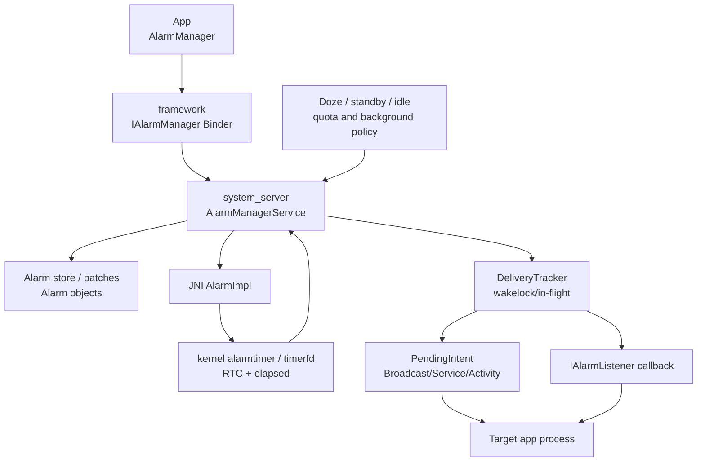
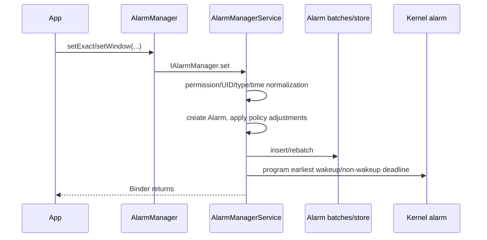
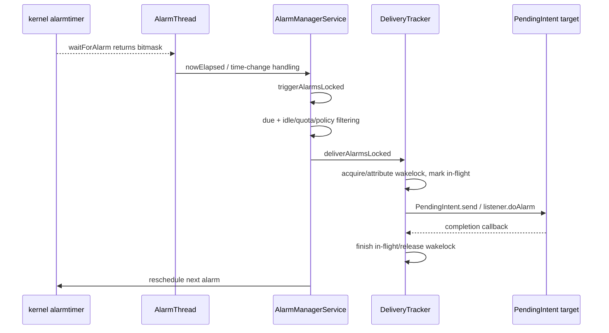

# 44 Android AlarmManager、AlarmManagerService 与精确闹钟

> 源码版本：Android 11 / API 30 / `android-11.0.0_r48`  
> 学习方式：macOS 只读源码，不要求编译  
> 前置章节：[16 Broadcast](./16-Broadcast广播注册与分发.md)、[25 电源管理](./25-Android电源管理WakeLock与Doze.md)、[43 JobScheduler](./43-AndroidJobSchedulerJobStore与约束控制器.md)

AlarmManager 是“在某个时间附近触发一次系统投递”，不是替 App 保活的后台线程。系统把时间、窗口、唤醒属性和 PendingIntent/Listener 保存为 Alarm，合并可批处理项，设置最早 kernel alarm；到期后还要经过取出、策略过滤、唤醒锁和 IPC 投递，应用代码才真正执行。

---

## 1. 三个时间点

```text
requested trigger time
 → system selects alarm as due
 → receiver/listener actually begins
```

即使 exact，后两点也可能因系统调度、进程启动和 Binder 延迟出现小差距。“精确”主要约束系统允许的触发窗口，不是实时系统 SLA。

---

## 2. 总体架构



服务只需要把“下一批最早事件”交给 kernel，不是为每个 App alarm 创建一个 Java Thread。

---

## 3. Android 11 核心源码

```text
frameworks/base/core/java/android/app/AlarmManager.java
frameworks/base/core/java/android/app/IAlarmManager.aidl
frameworks/base/core/java/android/app/IAlarmListener.aidl
frameworks/base/services/core/java/com/android/server/AlarmManagerService.java
frameworks/base/services/core/jni/com_android_server_AlarmManagerService.cpp
frameworks/base/services/core/java/com/android/server/am/PendingIntentController.java
frameworks/base/apex/jobscheduler/service/java/com/android/server/DeviceIdleController.java
```

Android 11 的 Alarm store/batching 主要仍在 `AlarmManagerService` 内部；不要套用后来单独的 LazyAlarmStore/BatchingAlarmStore 路径。

---

## 4. 进程与线程

- AlarmManager API：调用 App 进程。
- AlarmManagerService：`system_server`。
- kernel wait：专用 AlarmThread/native wait。
- PendingIntent target：目标应用或系统进程。
- OnAlarmListener：注册它的进程，通过 Binder 回调并由指定 Handler 执行。

Alarm 到期不会在最初调用 `set()` 的线程继续执行。

---

## 5. 四种 alarm type

| 类型 | 时间基准 | 可唤醒设备 |
|---|---|---|
| RTC_WAKEUP | wall clock/UTC 毫秒 | 是 |
| RTC | wall clock | 否 |
| ELAPSED_REALTIME_WAKEUP | boot 后 elapsed realtime | 是 |
| ELAPSED_REALTIME | elapsed realtime | 否 |

类型同时编码“时间基准”和“wakeup”，二者不要混为一项。

---

## 6. RTC 时间

RTC API 接收类似 `System.currentTimeMillis()` 的绝对墙上时间。用户、网络或系统修改日期时间时，尚未触发 RTC alarm 的相对距离会变化。

适合“当地时间 7:30 的闹钟”等面向日历的语义，但时区/夏令时需要业务重新计算下一次本地时间。

---

## 7. ELAPSED_REALTIME

使用 `SystemClock.elapsedRealtime()`，从启动计时并包含深度睡眠时间，不受墙上时间修改影响。

适合“从现在起 20 分钟后”。它不是 uptimeMillis；uptime 不包含 deep sleep。

---

## 8. elapsed 与 uptime

```text
elapsedRealtime = 开机以来，包括 deep sleep
uptimeMillis     = 开机以来，不包括 deep sleep
```

AlarmManager elapsed type 使用前者。把 `uptimeMillis()+delay` 传给 ELAPSED type 会在经历睡眠后产生错误时间基准。

---

## 9. wakeup 的含义

WAKEUP 允许 alarm 在到期时唤醒睡眠设备，让 system_server 投递。non-wakeup alarm 在设备睡眠时可延迟到下一次唤醒并批量处理。

wakeup 不保证屏幕亮起，也不代表应用获得无限 wakelock。

---

## 10. set() 默认不精确

面向现代 target SDK，`set()` 允许系统扩大/调整窗口以批处理多个 App alarm，减少 CPU 唤醒。

如果业务允许延迟，优先非精确 alarm；它能显著降低唤醒和功耗。

---

## 11. setWindow()

```java
alarmManager.setWindow(
        AlarmManager.ELAPSED_REALTIME,
        startElapsed,
        windowLength,
        pendingIntent);
```

表示系统可在 `[start, start+window]` 内选择时间。窗口不是“每隔 window 重复”，而是一次 alarm 的可交付区间。

---

## 12. setExact()

设置 exact window，要求系统尽量在指定时间触发。Android 11/API 30 尚未使用 Android 12 后面向普通 App 的精确闹钟特殊授权模型；不要把新版 `SCHEDULE_EXACT_ALARM` 规则倒灌进本章。

即便在 Android 11，Doze、allow-while-idle quota 和系统负载仍是相关边界。

---

## 13. setAlarmClock()

用于用户可感知的闹钟：RTC_WAKEUP、精确，并向系统提供 show intent，SystemUI 可展示下一闹钟。此类 alarm 获得较强调度待遇，因为用户明确期待。

不应把普通后台同步伪装成 alarm clock；其产品语义和系统展示不同。

---

## 14. setAndAllowWhileIdle()

允许在 idle/Doze 中执行，但仍受每 App 限频。非 exact 版本允许窗口调整；exactAndAllowWhileIdle 同时请求 exact。

“allow while idle”不是“无视所有省电策略并无限频触发”。

---

## 15. AlarmManager.setImpl

所有公开 set 变体最终汇总参数：

```text
type
triggerAtMillis
windowMillis
intervalMillis
flags
PendingIntent or IAlarmListener
listener tag / workSource / alarmClock
```

然后通过 `IAlarmManager.set()` 进入 system_server。API 名差异最终主要体现在 window、flags 和元数据。

---

## 16. 客户端源码例子

Android 11 中 `setExactAndAllowWhileIdle()` 的主干非常直接：

```java
setImpl(type, triggerAtMillis, WINDOW_EXACT, 0,
        FLAG_ALLOW_WHILE_IDLE, operation,
        null, null, null, null);
```

这说明 exact 是 `WINDOW_EXACT`，idle 例外是 flag，二者是独立维度的组合。

---

## 17. PendingIntent 与 Listener

| 交付对象 | 优势 | 生命周期边界 |
|---|---|---|
| PendingIntent | 创建进程死亡后 token 仍可由系统持有；可启动 receiver/service/activity | 由 AMS/PendingIntentController 解析执行 |
| OnAlarmListener | 直接 callback，避免 Intent | 依赖注册进程 Binder 存活，不适合跨进程死亡持久等待 |

长期 alarm 通常使用 PendingIntent。

---

## 18. PendingIntent 身份

系统以 PendingIntent creator UID/package 身份投递。它不是简单保存一个 Java Intent 对象；token、requestCode、type、filter-equivalence 和 flags 决定复用/更新。

两个看似不同 extras 的 PendingIntent 可能 filter-equivalent，从而同一个 token 更新或覆盖。

---

## 19. Alarm 的替换

同一个 PendingIntent operation 再 set 通常移除/替换旧 alarm；listener alarm 也按 listener Binder 标识处理。

要安排多个独立 alarm，应构造可区分的 PendingIntent identity，而不是只改 extras。

---

## 20. schedule 主链



返回只表示 alarm 已登记，不表示目标进程会保持存活。

---

## 21. system_server 校验

服务检查/规范化：

- alarm type。
- PendingIntent 与 listener 至少一个且不能冲突。
- calling UID/package。
- WorkSource/系统 flag 权限。
- interval、window、过早时间和最小值。
- listener 生命周期与 tag。
- idle-until/alarm-clock 特权语义。

客户端校验不能替代服务端安全检查。

---

## 22. Alarm 对象

内部 Alarm 记录：

- requested wall/elapsed time。
- policy 调整后的 whenElapsed/maxWhenElapsed。
- window/interval/type/flags。
- operation/listener/tag。
- creator/source UID/package。
- WorkSource、AlarmClockInfo。
-统计字段。

requested time 与最终 effective delivery time 需要分别观察。

---

## 23. RTC 转 elapsed

服务统一以 elapsed 时间组织大量调度：RTC trigger 依据当前 wall clock 与 elapsed 的偏移转换成 triggerElapsed。系统时间改变时，需要重新计算 RTC alarm 并 rebatch。

这就是为何 wall clock change 会影响 RTC，而 ELAPSED alarm 保持相对时间。

---

## 24. window 与 maxWhenElapsed

```text
whenElapsed     = 最早可交付时间
maxWhenElapsed  = 最晚可交付时间
```

exact 时二者相同；window alarm 后者更晚；heuristic window 由系统根据 API/target/interval 推断。

---

## 25. 批处理

如果多个 alarm 的窗口重叠，系统可以选择共同时间，一次唤醒投递多项：

```text
A: [10:00, 10:10]
B: [10:05, 10:15]
共同可选区间: [10:05, 10:10]
```

Exact window 几乎没有可移动空间，过度使用会破坏批处理节能。

---

## 26. 旧版 Batch 概念

Android 11 `AlarmManagerService` 内部以 batches/排序集合组织 alarm。Batch 持有可共同调度的 alarms 和起止边界。

后续 Android 重构了 AlarmStore；阅读本分支要跟 `mAlarmBatches` 等真实字段，不应凭新版类名寻找。

---

## 27. 只设置下一次 kernel alarm

服务在 store 中可能有数千 alarm，但 kernel 只需知道下一次 wakeup 和 non-wakeup deadline。每次插入、删除、触发或时间变化后调用 reschedule，重新编程最早事件。

这是高层队列和底层 timer 的分工。

---

## 28. JNI 与 kernel

`com_android_server_AlarmManagerService.cpp` 封装 native alarm实现，设置 RTC/elapsed wakeup/non-wakeup timer，等待事件并返回 bitmask。

kernel 只知道 timer 到期，不知道 PendingIntent、App package 或 Doze whitelist。

---

## 29. AlarmThread

专用线程在 native wait 阻塞。kernel 返回后，它读取当前 elapsed/wall time，在锁内找出到期 alarms，处理时间变更/唤醒事件，然后交付并重设下一次 kernel alarm。

阻塞 wait 不会持续消耗 CPU 忙轮询。

---

## 30. 触发主链



---

## 31. triggerAlarmsLocked

它从 batches 中取出到期 Alarm，处理 repeating 下一次、统计 wakeup、按优先级组织 trigger list，并把不能立即交付者放入 pending/background/idle 等集合。

“时间已到”只使 alarm 成为候选，策略仍可延迟交付。

---

## 32. non-wakeup 延迟

设备未交互、刚经历唤醒或系统希望合批时，non-wakeup alarms 可进入 pendingNonWakeupAlarms，等下次适合的唤醒点一起投递。

因此 ELAPSED_REALTIME 非 wakeup alarm 在睡眠期间晚到是设计行为。

---

## 33. DeliveryTracker

负责：

- PendingIntent/listener IPC。
- in-flight 记录。
- wakelock 获取、WorkSource 归因。
- PendingIntent finished callback。
- listener completion/timeout。
- broadcast stats。

投递开始不等于目标已完成；in-flight 直到完成协议或异常清理。

---

## 34. wakelock 边界

AlarmManagerService 在投递期间持唤醒锁，避免 CPU 在 IPC/receiver 初始处理前睡眠。PendingIntent broadcast 的 receiver 生命周期还由 AMS 管理。

异步工作超出 receiver/service 合法生命周期，应转交 JobScheduler/前台服务等，而不是依赖 Alarm 的短暂 wakelock。

---

## 35. Broadcast PendingIntent

`PendingIntent.getBroadcast()` 到期后进入 AMS BroadcastQueue，可能启动目标进程并调用 Receiver。随后仍受广播后台限制、权限和 ANR 监督。

Alarm 精确不代表 BroadcastReceiver `onReceive()` 无排队时间。

---

## 36. Service PendingIntent

启动 Service 还受后台 service 启动限制。面向较新 target，后台从 alarm 直接启动普通长时 Service 可能不符合规则；短工作可转 JobScheduler，用户可见工作评估 FGS。

alarm 不是后台执行限制的通行证。

---

## 37. Listener 投递

OnAlarmListener 通过 IAlarmListener Binder 调用，客户端 wrapper 投递到指定 Handler。若应用进程死亡，Binder token 失效，服务会移除/无法投递。

所以 Listener 不适合“即使 App 被杀也必须提醒”的长期场景。

---

## 38. repeating alarm

`setRepeating()` 的 repeating 在现代 Android 通常是不精确的。服务到期后计算下一次，并可能用 count 表示因睡眠错过的周期。

不要期待补发每一次；更稳妥的业务常在一次触发后根据当前时间计算下一次单次 alarm。

---

## 39. 重复任务漂移

若从“实际执行时间 + interval”计算，延迟会累积；若从理论基准计算，则可能跳过错过周期。AlarmManagerService 的 repeating 计算有自己的基准/计数语义。

日历任务尤其应每次重新按时区规则算下一墙上时间。

---

## 40. Doze 的 idle-until

DeviceIdleController 与 AlarmManagerService 协调 idle-until alarm 和维护窗口。普通 alarms 在 deep idle 中被推迟，退出/维护时重新交付。

Doze 不只是“kernel timer 不响”，而是 system_server 有意改变 effective delivery policy。

---

## 41. allow-while-idle 限频

服务记录每 UID/package 最近 allow-while-idle dispatch，强制最小间隔；idle 越深可能间隔更长。过早 alarm 会被调整到下一允许时间。

设置十个 exactAndAllowWhileIdle 不会产生十次连续唤醒。

---

## 42. temp whitelist

allow-while-idle alarm 投递可为目标提供短暂 idle 白名单，让进程完成有限工作。它不是永久 whitelist，也不保证绕过 Data Saver、网络配额或其他限制。

临时窗口结束后后台网络/执行限制恢复。

---

## 43. App Standby

不活跃 App 的 alarms 可被延迟或按 standby bucket 配额限制。bucket 越不活跃，唤醒频率通常越低。

AlarmClock、前台/活跃 App 和系统白名单存在特殊待遇，但不能泛化到普通 alarm。

---

## 44. Background restrictions

受限 package、force-stop、user stopped、component disabled 都可能阻止交付。Alarm 记录存在不代表目标当前可启动。

force-stop 通常清理该 package alarms，用户再次显式启动后才恢复正常调度能力。

---

## 45. exact alarm 权限版本边界

Android 12/API 31 引入更明确的 exact alarm special access；Android 13+ 又继续演进。当前源码是 Android 11，不能用新版 `canScheduleExactAlarms()` 解释本章行为。

但代码迁移到新系统时必须重新查目标版本规则。

---

## 46. 时间修改

用户把时间向前/后调，AlarmThread 发现 TIME_CHANGED：

- 更新 kernel RTC/系统时间相关状态。
- rebatch RTC alarms。
- 发送时间变化广播。
- 重设日期变更、time tick 等系统 alarms。

ELAPSED alarm 不应随墙上时间平移。

---

## 47. 时区修改

改变 timezone 不等于改变 UTC currentTimeMillis，但本地日历任务需重新计算。系统发送 TIMEZONE_CHANGED，App 应根据业务重新安排下一本地时间 alarm。

直接保存“每天加 24h”会在夏令时地区漂移一小时。

---

## 48. TIME_TICK

系统用 non-wakeup alarm 生成每分钟 TIME_TICK（仅注册 receiver 等限制），用于时间 UI 更新。设备睡眠时不会为了每分钟 tick 唤醒。

这说明 non-wakeup 的节能语义比“每分钟绝对准时”优先。

---

## 49. 系统日期变更

AlarmManagerService 安排下一个午夜/日期变化事件，并发送 DATE_CHANGED。午夜计算受 timezone 和日历规则影响。

App 自己的日历任务仍应处理设备关机和错过触发。

---

## 50. PendingIntent 取消

取消 PendingIntent token 或包被卸载时，对应 Alarm 会被移除或投递失败并清理。App仅丢失本地 PendingIntent Java 引用不会取消系统 token。

取消 alarm 应用同 identity 的 PendingIntent 调 `AlarmManager.cancel()`。

---

## 51. cancel 主链

```text
AlarmManager.cancel(operation/listener)
 → IAlarmManager.remove
 → 从 batches/pending 集合移除匹配 alarm
 → 更新 next alarm clock / stats
 → reschedule kernel alarm
```

若已经取出并开始 IPC，cancel 与 delivery 存在竞态；接收端仍应校验业务状态/版本 token。

---

## 52. 进程死亡

PendingIntent alarm 仍可保留并在到期时启动目标进程；Listener alarm 依赖 Binder，进程死亡会失效。

PendingIntent 能启动进程不等于绕过 force-stop 或 component/用户状态。

---

## 53. 多用户

Alarm 带 creator/source UID 和 user。用户停止/删除、包卸载会清理对应 alarms；AlarmClockInfo 的展示也按 user 维护。

同一 package 在工作资料和个人区是不同 UID/闹钟集合。

---

## 54. WorkSource

系统/特权调用可指定 WorkSource，把唤醒功耗归因到实际工作发起 UID。普通 App 不能任意把成本归给别人。

DeliveryTracker wakelock attribution 和 BatteryStats 使用这些信息。

---

## 55. 唤醒统计

服务记录 package/UID/tag 的 wakeup counts、aggregate stats、in-flight time 等，辅助发现 alarm 滥用。统计 tag 与 PendingIntent identity 不完全相同。

一次批量唤醒投递多个 alarms 时，物理 wakeup 次数和 alarm dispatch 数不同。

---

## 56. 与 JobScheduler 的选择

| 需求 | 更合适 |
|---|---|
| 大约某时间、还需网络/充电 | JobScheduler |
| 用户明确日历提醒 | AlarmManager/alarm clock |
| 短时间点事件 | AlarmManager，尽量 window/inexact |
| 持久后台工作与重试 | JobScheduler/WorkManager |

常见组合：Alarm 到点只 enqueue Job，实际受约束工作交给 JobScheduler。

---

## 57. 与 Handler timer

Handler.postDelayed 依赖进程/Looper 存活，通常基于 uptime，不能跨进程死亡，也不会唤醒设备。适合进程内短延迟 UI/逻辑。

AlarmManager 是系统级跨睡眠调度，成本更高。

---

## 58. 与 ScheduledExecutor

ScheduledExecutor 也是进程内线程调度；进程死亡或设备深睡时不能提供 AlarmManager 语义。不要用它实现跨数小时的可靠提醒。

反过来，毫秒级进程内 debounce 不应使用 AlarmManager。

---

## 59. 典型时间线

| 时间 | 事件 | 尚不能证明 |
|---|---|---|
| 09:00:00.000 | setExact Binder 返回 | 回调已执行 |
| 09:29:59.999 | kernel timer 到期附近 | target process 已启动 |
| 09:30:00.010 | AlarmThread 取出 Alarm | PendingIntent 完成 |
| 09:30:00.025 | AMS 启动/投递 receiver | onReceive 已结束 |
| 09:30:00.040 | onReceive 开始 | 异步业务完成 |

时间仅为示例，不是 40 ms SLA。

---

## 60. “精确闹钟晚了”分层

| 层 | 检查 |
|---|---|
| API | RTC/elapsed 基准是否传对、单位是否毫秒 |
| Store | requested/effective when、window、flags |
| Policy | Doze、allow-idle quota、standby、force-stop |
| Kernel | next alarm 是否正确设置、time change |
| Delivery | trigger list、pending non-wakeup、in-flight |
| Target | 进程启动、广播排队、主线程/ANR |

---

## 61. “重复闹钟漂移”

检查 repeating 是否 inexact、interval 最小限制、设备睡眠、Doze、时区/DST、错过次数，以及业务是否从实际时间再加 interval。

日历语义建议每次按 Calendar/Zone 计算下一次单次 RTC alarm。

---

## 62. “App 被杀后不触发”

若用 Listener，这是预期风险；若用 PendingIntent，检查 force-stop、token 是否取消/替换、component enabled/export/权限、user 状态和后台启动限制。

“划掉最近任务”与 force-stop 语义也不应混为一谈。

---

## 63. dumpsys 与 shell

```bash
adb shell dumpsys alarm
adb shell cmd alarm help
adb shell dumpsys deviceidle
adb shell am get-standby-bucket <package>
```

dumpsys 常包含 batches、pending alarms、next wakeup、allow-idle history、in-flight、package stats。macOS 只读阶段先对照 dump 实现理解字段。

---

## 64. 源码路线一：客户端 API

```text
frameworks/base/core/java/android/app/AlarmManager.java
frameworks/base/core/java/android/app/IAlarmManager.aidl
frameworks/base/core/java/android/app/IAlarmListener.aidl
```

练习：将 set/setWindow/setExact/allow-idle/alarm-clock 映射成 window 与 flags。

---

## 65. 源码路线二：入队与批处理

```text
frameworks/base/services/core/java/com/android/server/AlarmManagerService.java
```

练习：追 `setImpl`、Alarm 构造、`setImplLocked`、batch insert 和 `rescheduleKernelAlarmsLocked`。

---

## 66. 源码路线三：kernel

```text
frameworks/base/services/core/jni/com_android_server_AlarmManagerService.cpp
frameworks/base/services/core/java/com/android/server/AlarmManagerService.java
```

练习：找 native set/wait 返回 bitmask，区分 wakeup、non-wakeup、time changed。

---

## 67. 源码路线四：触发与投递

```text
frameworks/base/services/core/java/com/android/server/AlarmManagerService.java
frameworks/base/services/core/java/com/android/server/am/PendingIntentController.java
```

练习：追 trigger、deliver、in-flight、PendingIntent finished 和 wakelock 释放。

---

## 68. 源码路线五：Doze

```text
frameworks/base/services/core/java/com/android/server/AlarmManagerService.java
frameworks/base/apex/jobscheduler/service/java/com/android/server/DeviceIdleController.java
```

练习：追 idle-until、pending while idle、allow-while-idle interval 与 temp whitelist。

---

## 69. 八组只读练习

1. **类型表**：RTC/elapsed × wakeup/non-wakeup。
2. **API 映射**：window、exact、allow-idle、alarm-clock。
3. **三时点图**：requested、due、callback start。
4. **批处理纸算**：三个窗口求共同区间。
5. **kernel 链**：store → next timer → wait bitmask。
6. **投递图**：PendingIntent 与 Listener 对比。
7. **Doze 图**：普通、allow-idle、alarm clock。
8. **故障表**：晚到、漂移、进程死亡三类证据。

---

## 70. 初学者易混淆的十二点

1. RTC 与 wakeup 是两个维度。
2. elapsedRealtime 不等于 uptimeMillis。
3. wakeup 不等于点亮屏幕。
4. exact 不等于实时零延迟。
5. setWindow 不是 repeating。
6. set() 对现代 App 通常可批处理。
7. PendingIntent token 不依赖创建进程存活。
8. Listener 依赖 Binder 进程存活。
9. allow-while-idle 仍有限频。
10. Alarm 的 wakelock 不支持无限异步工作。
11. 时间修改只应重排 RTC 语义。
12. Android 11 没有照搬 Android 12+ exact permission 模型。

---

## 71. 自测题

1. 四种 alarm type 如何组合？
2. “20 分钟后”适合哪种时间基准？
3. 为什么 non-wakeup 会晚到？
4. setWindow 的 window 表示什么？
5. exact 为什么仍可能和回调开始有差距？
6. PendingIntent 与 Listener 对进程死亡有何不同？
7. AlarmManagerService 为何只设下一 kernel alarm？
8. batch 如何节电？
9. allow-while-idle 为什么不能无限用？
10. RTC 在修改系统时间后怎样变化？
11. repeating 为什么不适合精确日历任务？
12. 到点后长网络同步应该如何安排？

---

## 72. 参考答案

1. RTC/elapsed 时间基准分别与 wakeup/non-wakeup 组合。
2. ELAPSED_REALTIME，基于 elapsedRealtime()+delay。
3. 睡眠时不唤醒，可推迟到下一次设备唤醒合批。
4. 一次 alarm 可在 start 到 start+length 之间交付。
5. system_server、Binder、进程启动和线程调度仍有延迟。
6. 系统可保留 PendingIntent；Listener Binder 随进程死亡失效。
7. kernel 只需唤醒最近事件，其余由高层 store 保存。
8. 重叠窗口集中一次 CPU wakeup 投递多项。
9. 防止 App 在 Doze 中反复唤醒，服务按 UID/package 限频。
10. 服务重新将 wall time 换算成 elapsed 并 rebatch。
11. inexact、睡眠、DST 和 missed count 会造成漂移；应重算下一次单次日历时间。
12. Alarm 只触发 enqueue Job/Work，再由合规后台机制执行。

---

## 73. 最终主线

```text
App 选择 RTC/elapsed、wakeup、window/exact、PendingIntent/listener
 → AlarmManager.setImpl / IAlarmManager Binder
 → AlarmManagerService 校验并构造 Alarm
 → 转换 whenElapsed/maxWhenElapsed，应用 idle/standby policy
 → 插入 batch/store，重设下一 wakeup/non-wakeup kernel timer
 → AlarmThread 在 native wait 阻塞
 → kernel 到期返回，triggerAlarmsLocked 取 due alarms
 → Doze/quota/non-wakeup 过滤或延迟
 → DeliveryTracker 持 wakelock 并投递 PendingIntent/IAlarmListener
 → 完成回调清 in-flight，repeating 重排，kernel timer 重设
```

面对“闹钟不准”，先确认时间基准和单位，再对比 requested/effective window、Doze/standby/allow-idle history、kernel next alarm、trigger list 和目标进程投递时间。只有分开这几个时间点，才能判断是 API 使用错误、系统节能调整还是应用回调阻塞。
