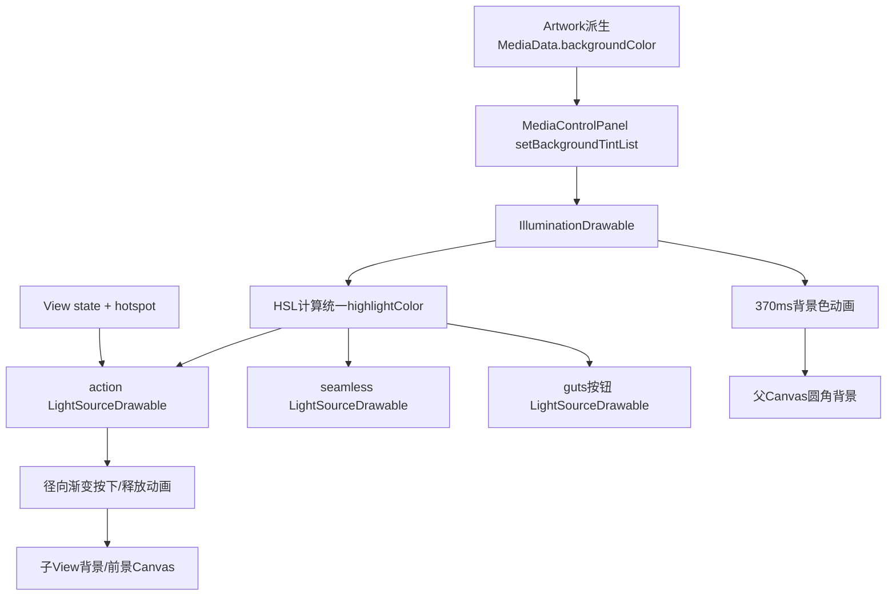
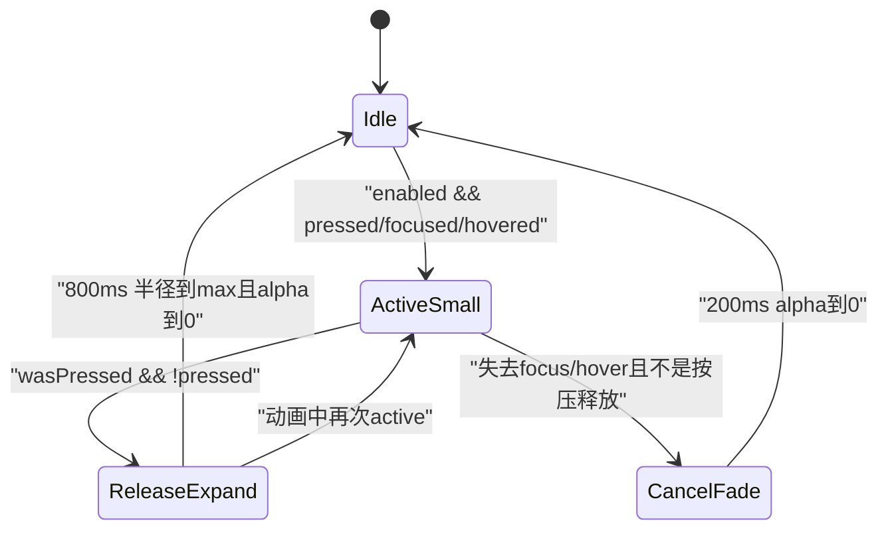
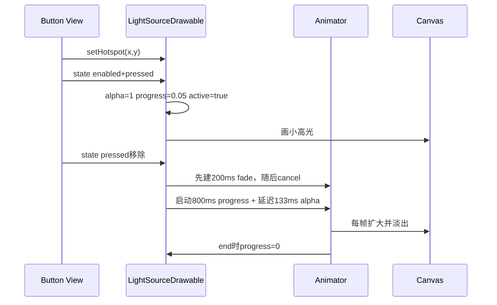

# 第 440 章 Android SystemUI IlluminationDrawable：媒体卡背景配色、触点高光与按压动画

> 源码基线：Android 11 / API 30 / `android-11.0.0_r48`。本章只在 macOS 阅读源码，不编译。核心文件：`IlluminationDrawable.kt`、`LightSourceDrawable.kt`、`PlayerViewHolder.kt`、`MediaControlPanel.java`、`media_view.xml`、`qs_media_background.xml`、`qs_media_light_source.xml`、`attrs.xml` 与 `PlayerViewHolderTest.kt`。

## 1. 本章要解决什么问题

媒体卡背景为什么会随封面配色平滑变化？按住播放按钮时，手指下面的小亮点怎样出现？抬手后为什么扩成一圈渐隐高光？父背景与九个可点击控件怎样共享同一高亮颜色，同时又各自保存触点坐标？

## 2. 两个 Drawable 必须分开

`IlluminationDrawable` 画整张卡的圆角纯色背景，并在背景色变化时计算/广播高亮色；`LightSourceDrawable` 画某个按钮触点处的径向渐变。前者是颜色协调器，后者是独立交互动画器。

## 3. 为什么不直接用普通 RippleDrawable

设计要让多个分散按钮的触点高光与动态媒体背景协调，还要允许光圈超出按钮自身小矩形、由较大的父卡片裁剪。自定义Drawable把“每个触点的位置”与“整卡统一配色”拆开。

## 4. 它们位于哪里

`media_view.xml` 根TransitionLayout的background是 `qs_media_background`；seamless、action、cancel、dismiss、settings的background或foreground使用 `qs_media_light_source`。PlayerViewHolder初始化时把这些子光源登记给根背景。

## 5. 数据流从哪里开始

MediaDataManager根据Artwork得到柔和背景色，MediaControlPanel对根View设置backgroundTintList；View把tint交给IlluminationDrawable；父Drawable动画到新背景色并计算高亮色，再把高亮色写给所有已注册LightSourceDrawable。

## 6. 交互流从哪里开始

用户按压/聚焦/悬停某个View时，View把drawable state和hotspot传给自己的LightSourceDrawable；它只动画自己的alpha、progress与触点坐标，不通知其他按钮一起发光。

## 7. 运行线程

Drawable、View state和ValueAnimator都依赖SystemUI主线程/Looper绘制节奏。代码没有锁；即使MediaData背景色由后台计算，最终setBackgroundTintList和动画启动仍应在UI线程。

## 8. 是否跨进程

本章链路本身没有Binder：输入颜色已经在SystemUI，输出是Canvas绘制。更早的Artwork/通知来自媒体App，更后的点击Runnable可能跨进程，但两个Drawable只负责本地视觉反馈。

## 9. 三组状态不要混淆

父背景有backgroundColor、paint当前色和highlightColor；子光源有Drawable state（enabled/pressed/focused/hovered）、active/pressed布尔值，以及RippleData（x/y/alpha/progress/min/max）。动画中的“当前值”与“最终配置值”不是一回事。

## 10. 父子协作总图



## 11. 根 Drawable 的 XML

```xml
<com.android.systemui.media.IlluminationDrawable
    xmlns:systemui="http://schemas.android.com/apk/res-auto"
    systemui:highlight="15"
    systemui:cornerRadius="?android:attr/dialogCornerRadius" />
```

15被除以100成为0.15，不是15个颜色单位；圆角使用当前主题属性。

## 12. 子 Drawable 的 XML

`qs_media_light_source.xml` 只设置 `rippleMinSize="25dp"` 与 `rippleMaxSize="135dp"`。因此按下初始亮点很小，释放后最大直径/半径语义要以代码为准：这些值被直接当作Canvas circle的radius使用。

## 13. 复读纠正：名字 Size 实际当半径

draw里 `canvas.drawCircle(x, y, radius, paint)`，radius由minSize和maxSize插值。尽管属性名叫Size，135dp最终是最大半径，理论直径270dp；不能按“最大直径135dp”讲。

## 14. styleable 为什么两类共用

`IlluminationDrawable` styleable同时声明highlight、cornerRadius、rippleMinSize、rippleMaxSize。父类只读前两项，子类读后两项并可读highlight；这是资源分组复用，不表示两个类继承彼此。

## 15. IlluminationDrawable 的核心字段

Paint负责当前背景；backgroundColor保存最终目标；highlightColor保存当前高亮；highlight是亮度偏移比例；lightSources保存子Drawable；backgroundAnimation保存正在运行的换色Animator。

## 16. 第一次绘制前 Paint 是什么颜色

`Paint()` 默认颜色为不透明黑，backgroundColor初始透明。正常bind很快设置非空ColorStateList并启动换色；若在tint到达前绘制，代码本身没有从XML提供一个显式背景色基线。

## 17. setTintList 的准确实现

```kotlin
override fun setTintList(tint: ColorStateList?) {
    super.setTintList(tint)
    backgroundColor = tint!!.defaultColor
}
```

真正驱动自定义Paint的是defaultColor，而不是依赖Drawable基类的tint filter。

## 18. null tint 会怎样

参数类型可空却直接 `tint!!`。MediaControlPanel总传 `ColorStateList.valueOf(backgroundColor)`，正常链安全；若通用调用者用null清除backgroundTintList，会在这里抛NullPointerException。

## 19. ColorStateList 的状态色有没有被支持

只读取 `defaultColor`，没有在onStateChange中根据stateSet调用 `getColorForState`。即使传入多状态ColorStateList，父背景也只使用默认色；交互高光由子Drawable另画。

## 20. backgroundColor setter 为什么去重

新颜色与field相等就return，不重启动370ms动画。相同媒体背景反复bind仍可能触发View setTintList，但Drawable不会重复换色。

## 21. 背景动画怎样计算高亮

先把目标backgroundColor转HSL，只改L亮度：若L小于 `1-highlight` 就加highlight，否则减highlight，再限制0..1。Hue与Saturation保持目标背景值。

## 22. 为什么很亮的背景反而变暗

当L已经接近1，再加0.15会越界并难以看出高光，所以代码改为减0.15。高亮色本质是“有对比的光色”，不保证永远比背景更亮。

## 23. 阈值处存在什么特性

highlight=0.15时，L=0.849会加到约0.999，而L=0.85因 `< 0.85` 不成立会减到0.70，目标highlight亮度在边界不连续。背景色通常经过柔化，肉眼未必频繁碰到，但算法确实不是连续函数。

## 24. 换色动画的起点

起点不是上一次目标backgroundColor，而是 `paint.color` 和当前highlightColor。若上一轮动画只走到一半就来新色，新动画从屏幕当前颜色续接，避免跳回旧目标。

## 25. 取消旧动画的顺序

代码先捕获initialBackground/initialHighlight，再cancel旧Animator，然后创建新Animator。旧listener会把backgroundAnimation置null，但随后新Animator会重新赋给字段；起点值已经安全保存。

## 26. 370ms 每帧做什么

FAST_OUT_LINEAR_IN进度下，用 `blendARGB` 分别从当前背景→新背景、当前高亮→新高亮；把新highlightColor写给所有lightSources，最后invalidateSelf请求根背景重画。

## 27. 父背景只画纯色圆角

draw没有Gradient：

```kotlin
canvas.drawRoundRect(
    0f, 0f, bounds.width().toFloat(), bounds.height().toFloat(),
    cornerRadius, cornerRadius, paint
)
```

“Illumination”主要体现在它协调子高光，而非根背景自身画光斑。

## 28. bounds 左上角为何没加进去

代码从(0,0)画到bounds宽高，假设作为View background时Canvas坐标已经对应View本地且bounds通常从0开始。若把Drawable放进带非零left/top的通用容器，draw与getOutline使用bounds的方式并不完全对称。

## 29. getOutline 的作用

父Drawable把完整bounds和cornerRadius交给Outline，可供View阴影、裁剪或硬件优化使用。TransitionLayout本身还会按动画currentState边界clip，两套裁剪职责不同。

## 30. opacity 为什么返回 TRANSPARENT

r48父、子两个Drawable都返回 `PixelFormat.TRANSPARENT`，但父paint可能不透明、子active时也会画可见像素，所以这不是严格准确的像素格式描述；`TRANSLUCENT`语义通常更接近。它至少不会把Drawable声明成整块OPAQUE，但通用优化代码不应依赖这里获得精确覆盖结论。

## 31. setAlpha 为什么直接抛异常

自定义Drawable不实现整体alpha合成，调用者应改变View alpha；上一章TransitionLayout正是通过CrossFadeHelper改根View alpha。若框架或外部代码直接对Drawable.setAlpha，会UnsupportedOperationException。

## 32. setColorFilter 也不支持

颜色入口被限定为setTintList→backgroundColor；任意ColorFilter可能绕过统一highlight计算，所以实现选择抛异常。但这也意味着它不是可随意放入所有ImageView/Drawable包装器的通用组件。

## 33. inflate 怎样读取属性

两个类都用 `obtainAttributes`、`extractThemeAttrs`、`updateStateFromTypedArray`，随后recycle。主题引用如dialogCornerRadius被保存为themeAttrs，未来applyTheme时可以重新解析。

## 34. applyTheme 会不会主动重启动画

父类update只修改cornerRadius/highlight字段，没有调用animateBackground或invalidateSelf；系统主题应用流程可能触发重绘，但若highlight改变，现有highlightColor不会在本方法立即重算，直到下次backgroundColor变化。

## 35. registerLightSource 的输入是 View

父背景不要求调用方先取Drawable。它检查View.background是否为LightSourceDrawable；否则再检查foreground；找到后把实际Drawable对象加入ArrayList。

## 36. background 与 foreground 同时有光源怎么办

代码使用 `if ... else if`，优先登记background，只登记一个。当前media_view的seamless背景是LightSource，foreground是另一个seamless背景效果，因此会选到预期background。

## 37. 被 Wrapper 包起来能识别吗

只做直接 `is LightSourceDrawable` 类型判断。若光源被InsetDrawable、LayerDrawable或RippleDrawable包裹，register不会递归找到它，也没有警告；资源结构是隐含契约。

## 38. 重复注册会怎样

ArrayList不去重，也没有unregister。同一个Drawable若登记两次，每帧会被重复赋相同highlightColor并重复invalidate；正常PlayerViewHolder init只执行一次。

## 39. 晚注册光源的初始颜色

register只add，不立即把当前highlightColor赋给新光源。PlayerViewHolder在第一次bind tint动画前登记，所以会随首轮更新收到颜色；动画结束后才动态登记的光源会保留默认白色，直到下一次背景换色。

## 40. 当前一共登记哪些控件

seamless、action0—4、cancel、dismiss、settings，共九个。根媒体卡点击和封面没有登记；guts里的说明文本也不是光源。

## 41. 为什么各按钮仍需独立 Drawable

父只共享highlightColor，不共享x/y、alpha或progress。每个按钮可同时处于不同pressed/focused状态，光斑必须各自动画；若共享同一Drawable实例，触点和动画会相互覆盖。

## 42. 子 Drawable 的 RippleData

x/y是热点；alpha是中心色透明度；progress控制半径；minSize/maxSize给半径端点；highlight字段也会从styleable读取。实际绘制读取前六项，却没有读取 `rippleData.highlight`。

## 43. 复读发现：子 highlight 字段是死数据

LightSourceDrawable的updateStateFromTypedArray可赋highlight，但draw、illuminate和颜色setter都不消费它。实际highlightColor完全由父IlluminationDrawable下发；给子XML配置highlight在r48不会改变亮度。

## 44. highlightColor setter 做什么

值变化才更新field并invalidateSelf，没有动画。平滑变化由父背景370ms每帧传入不同颜色实现；子Drawable只是跟随，不另启动一套颜色Animator。

## 45. draw 怎样生成光斑

半径=`lerp(min,max,progress)`；中心色把highlightColor套上 `alpha×255`；RadialGradient从20%半径之前维持中心色，到100%半径降为透明，最后画一个圆。

## 46. 为什么 gradient stop 是 0.2 和 1

0到20%半径区域基本保持一致亮度，外侧80%柔和衰减。若从0立刻渐变，触点中心会显得过尖；固定stop让小亮点更饱满。

## 47. 每帧都创建 RadialGradient 的成本

draw里直接new RadialGradient并写给Paint.shader，动画帧会产生对象。实现没有缓存，因为x/y、radius、alpha、highlightColor都可能变；代价换取代码简单，九个光源只有活跃者通常会频繁重画。

## 48. active 与 pressed 的区别

pressed只记录本轮stateSet是否含state_pressed，用于判断“刚刚松手”；active则是 `enabled && (pressed || focused || hovered)`，决定维持小高光还是启动200ms取消淡出。

## 49. 为什么 focus 和 hover 也算 active

键盘/遥控器焦点与鼠标/触控板悬停也需要反馈，不能只服务手指。`hasFocusStateSpecified()` 返回true，向框架表明Drawable明确处理focus状态。

## 50. Drawable 状态机



## 51. 按下时 active setter 做什么

取消已有rippleAnimation，立即令alpha=1、progress=0.05，并invalidate。0.05不是minSize的5%，而是min→max插值进度，所以初始半径略大于25dp。

## 52. 按下初始半径是多少

按XML值计算：`25 + (135-25)×0.05 = 30.5dp`。因此命名常量 `RIPPLE_DOWN_PROGRESS=0.05` 表示展开进度，不是固定30.5像素；密度换算已在资源读取时完成。

## 53. setHotspot 从哪里得到坐标

View在触摸过程中把局部热点坐标传给background/foreground Drawable。LightSource保存x/y；active时立即invalidate，使小亮点跟随手指移动，非active时只记坐标、不额外重画。

## 54. 释放时为什么先出现 cancel 又被覆盖

onStateChange先算 `active=false`，active setter会启动200ms淡出；随后检测 `wasPressed && !pressed` 又调用illuminate，后者cancel刚建的淡出并启动800ms扩散。最终按压释放走的是完整扩散动画。

## 55. illuminate 的两条并行动画

AnimatorSet同时执行：progress从当前值到1，持续800ms；alpha先等待133ms，再从1到0，持续667ms。光圈先扩张一小段才开始淡出。

## 56. 释放动画源码

```kotlin
playTogether(
    ValueAnimator.ofFloat(1f, 0f).apply {
        startDelay = 133
        duration = RIPPLE_ANIM_DURATION - startDelay
    },
    ValueAnimator.ofFloat(rippleData.progress, 1f).apply {
        duration = RIPPLE_ANIM_DURATION
    }
)
```

两者都使用LINEAR_OUT_SLOW_IN插值器。

## 57. 为什么 alpha 总从1开始

illuminate先把rippleData.alpha=1，再建 `ofFloat(1,0)`，不从可能残留的当前alpha续接。因此在取消淡出或快速交互后释放，亮度可能重新跳到满值，这是刻意强调“确认点击”的效果。

## 58. 失焦/移出怎样取消

若active从true变false且不是pressed→not pressed的释放检测，启动200ms alpha当前值→0；结束后progress归0、alpha归0并清Animator。典型场景是键盘focus消失或hover退出。

## 59. 按压取消能否与正常抬手区分

Drawable state只看到pressed从true变false，代码没有ACTION_UP/ACTION_CANCEL信息，因此都会调用illuminate。所谓RIPPLE_CANCEL_DURATION不会覆盖普通触摸cancel的全部情况；它主要处理没有pressed释放边沿的active消失。

## 60. 被禁用时的边界

enabled参与active公式。若View在按住期间同时失去enabled和pressed，`wasPressed && !pressed` 仍可能触发完整illuminate；实现没有额外要求release时enabled仍为true。

## 61. focus 保持时点击后的细节

释放后focused仍可让active保持true，但illuminate结束会把progress重置为0，alpha动画已到0；active字段没有发生新的false→true变化，因此不会自动恢复小focus高光，直到后续state变化触发active setter。

## 62. 快速二次按压怎样处理

active=true时setter会cancel正在扩散的Animator，再把alpha=1、progress=0.05。旧Animator的onEnd会先重置progress/null，随后setter再次写入按下值，因此新触点从小亮点重新开始。

## 63. AnimatorSet 取消有没有 cancelled 防护

illuminate的listener没有cancelled标志，cancel也会进入onAnimationEnd并把progress归0、rippleAnimation=null。active setter随后通常重写值/新Animator，所以正常交互仍收敛；读代码时要把cancel回调顺序算进去。

## 64. 200ms cancel 动画为何有防护

active=false创建的ValueAnimator listener记录 `cancelled`；被illuminate取消后，onEnd直接return，不把progress/alpha再次清零，避免覆盖新扩散动画刚设置的值。

## 65. 复读发现：字段引用仍由新赋值收敛

取消旧Animator时旧onEnd可能令 `rippleAnimation=null`，但创建表达式完成后新Animator再赋入字段。这个时序和父背景换色相似，不能只看listener里的null就断言新动画引用丢失。

## 66. isStateful 为什么返回 true

它要求View把drawableState变化传入onStateChange。若返回false，pressed/focused/hovered变化可能不触发该Drawable的状态处理，光源就只剩hotspot坐标而没有active动画。

## 67. onStateChange 返回值的细节

函数最后返回的是 `super.onStateChange(stateSet)` 的changed，没有把自身pressed/active变化OR进去。自身setter已经显式invalidate，因此动画仍能画；但返回值并不准确反映自定义状态是否发生变化。

## 68. hasFocusStateSpecified 的作用边界

返回true告诉系统该Drawable的状态列表明确关注focused，帮助焦点高亮策略；它不自动产生焦点，View仍需focusable且真正获得焦点。

## 69. hovered 从哪里来

鼠标、触控板或其他指针设备可让View进入state_hovered。代码把它与focus/press等价为active小高光，但hover离开只走200ms淡出，不触发800ms点击扩散。

## 70. isProjected 为什么返回 true

它要求当前Drawable所在RenderNode向后投影，在最近一个“拥有background”的祖先RenderNode之后绘制；View失效时还会damage该projection receiver。配合超出自身bounds的dirty region，光圈能越过48dp按钮。实际可见范围仍受接收祖先、ViewGroup裁剪和硬件绘制路径影响。

## 71. media_view 为什么 clipChildren=false

根TransitionLayout设置clipChildren/clipToPadding=false，允许子按钮的光圈超出按钮边界；但TransitionLayout.dispatchDraw又按当前媒体卡boundsRect裁剪，因此光能铺进卡内，不应无限泄出卡外。

## 72. “parent will clip it” 指什么

LightSourceDrawable.getOutline留空并注释由parent裁剪。它自己不定义圆角outline，最终由媒体卡根的圆角/当前bounds和View层级决定可见范围，而不是每个48dp按钮把光圈裁成小圆。

## 73. getDirtyBounds 为什么扩张

普通Drawable脏区可能只有按钮bounds，但135dp光圈远超按钮。实现以hotspot±当前radius构造Rect，再union基类dirtyBounds，要求渲染系统把扩展区域也重画。

## 74. Float 转 Int 有什么影响

dirty rect边界直接toInt，负数向0截断而不是floor，右/下也不是ceil；理论上可能少覆盖不到1像素的边缘。柔和透明渐变通常掩盖，但它不是严格外包围取整。

## 75. 光圈中心颜色怎样计算

`ColorUtils.setAlphaComponent(highlightColor, (alpha*255).toInt())` 覆盖父色原有alpha。父highlight来自不透明Media背景时合理；若未来传入半透明背景，高亮仍以rippleData.alpha作为唯一透明度。

## 76. Paint.shader 会一直保留吗

每次draw都用新RadialGradient覆盖旧shader，没有在动画结束清null。alpha归0后仍可draw透明渐变；Drawable停止invalidate后一般不会主动重画，下一次状态会再覆盖。

## 77. 父 highlight 下发会触发子重画吗

是。每个lightSource的highlightColor setter在值变化时invalidateSelf。背景换色370ms期间，即使按钮没有active，九个子Drawable也会各自请求重画；它们的alpha通常0，实际光斑不可见但仍有invalidate开销。

## 78. 父动画取消时子色怎样连续

父新动画从当前highlightColor开始，旧动画最后已把同一当前色下发给子；新每帧继续下发blend值，所以活跃光斑随背景平滑换色，不会先跳到最终高亮。

## 79. lightSources 的生命周期

父Drawable持有子Drawable强引用，子Drawable由各View持有；整张player销毁后共同不可达即可回收。没有单独unregister，是因为设计假定子View不会从同一根背景中动态替换。

## 80. 动态替换按钮背景会怎样

父列表仍指向旧LightSourceDrawable，新背景不会自动登记；旧对象还被父强引用并持续收颜色。若扩展媒体卡动态换background，应先增加注销/重新登记机制。

## 81. 根背景被换掉会怎样

PlayerViewHolder构造时强转 `player.background as IlluminationDrawable`。布局若换成普通Drawable会在holder创建时ClassCastException；即便创建后再换根背景，旧父Drawable仍持子列表，但MediaControlPanel tint将作用于新背景，协调链断开。

## 82. 单测验证到什么程度

PlayerViewHolderTest只验证holder创建成功和根background可强转IlluminationDrawable；MediaControlPanelTest验证设置了期望ColorStateList。没有覆盖HSL算法、370ms插值、九光源注册、按压状态机、dirtyBounds或动画取消。

## 83. 为什么只看截图难以定位问题

“按钮不亮”可能是父未收到tint、父没登记子、子资源被wrapper包裹、View没有enabled/focused/pressed state、hotspot没更新、或祖先clip。必须按颜色链和状态链分别排查。

## 84. 一次点击的精确时序



## 85. 背景换色与点击能并行吗

可以。父370ms Animator改变highlightColor，子800ms Animator改变alpha/progress；每帧draw组合“此刻颜色×此刻透明度×此刻半径”。两套Animator互不cancel。

## 86. 同时按两个按钮会怎样

每个View通常inflate出自己的LightSourceDrawable，各有Animator和hotspot；父只共享颜色。因此两个光圈可同时存在。若资源系统意外共享同一Drawable实例，状态会串扰，但View背景inflate通常提供独立实例。

## 87. 为什么 action 背景适合直接光源

ImageButton本身小，但光效目标是照亮卡片材质；直接LightSourceDrawable、projected dirty bounds和父裁剪配合，可让触点光从按钮向周围扩散，而不需要按钮自己画不透明底。

## 88. seamless 的 foreground 与 background

它的foreground是 `qs_media_seamless_background`，background才是LightSourceDrawable。register优先检查background，因此触点光由背景层绘制；foreground还可提供chip形状/反馈，具体层叠顺序由View绘制规则决定。

## 89. guts 三个按钮为何也登记

controls与guts在同一TransitionLayout中切换，父背景不变。cancel/dismiss/settings即使初始gone，也要预先登记；guts出现后立刻能使用与播放按钮相同的动态高亮色。

## 90. 不可清除 dismiss 的光源是否仍在

仍在父lightSources列表，但View disabled后onStateChange的active公式为false，普通按压不会形成高光。登记关系和当前可交互性是两层状态。

## 91. resumption 输出 chip 的光源是否仍在

同样仍登记；Panel把View disabled并降alpha，Drawable收到的stateSet缺enabled时active=false。以后同一Panel重绑live媒体并enabled后，无需重新注册即可恢复反馈。

## 92. 动画是否尊重系统 Animator duration scale

使用标准ValueAnimator/AnimatorSet，通常会受到系统动画时长缩放影响；代码没有自行读取设置或为0倍率单独分支。概念上不要把370/800ms当设备上永远不变的墙钟时间。

## 93. 动画是否跟随 TransitionLayout 变形

LightSource Drawable属于child，child的bounds、scale、clip会由TransitionLayout每帧改变。光圈在child本地坐标绘制后参与View变换；同时根dispatchDraw裁剪到当前卡片视觉边界。

## 94. 根背景圆角与专辑图圆角不是一套对象

根卡片由IlluminationDrawable的cornerRadius画圆角；专辑图由MediaControlPanel的独立OutlineProvider裁剪。两者都取dialogCornerRadius，但尺寸、Drawable和动画生命周期不同。

## 95. 背景色从Artwork来但不等于Artwork主色

MediaDataManager会对取色结果调整饱和度与亮度，保证文字可读；Panel把处理后的整数颜色交给父Drawable。IlluminationDrawable只再为触点计算亮度偏移，不重新做Palette分析。

## 96. 文字颜色怎样与背景配合

media_view使用 `media_primary_text/media_secondary_text` 等资源色，而非父Drawable动态计算文字色。本章的highlight协调只覆盖背景与光源；完整对比度由上游背景柔化和资源设计共同保证。

## 97. 父 setTintList 为什么先调用 super

保留Drawable基类tint相关状态/兼容行为，但自定义draw只读paint；随后backgroundColor setter才是可见背景动画入口。不能因为调用super就假定Paint自动被TintFilter染色。

## 98. 背景动画结束监听做什么

只把backgroundAnimation字段置null，没有再强制写一次最终颜色。ValueAnimator正常最后一帧应给progress=1；若平台取消语义未送终帧，新动画会从当前paint继续，而不是伪造已到旧终点。

## 99. 子动画结束监听做什么

完整扩散结束把progress=0、rippleAnimation=null并invalidate；alpha由并行动画最终到0。取消淡出正常结束还显式把progress和alpha都归0，确保idle基线一致。

## 100. 颜色相等时的隐含行为

backgroundColor setter去重后不调用animateBackground，因此也不会借机把当前highlightColor同步给晚注册光源。注册后若再次设置同一tint，晚注册光源仍可能维持白色。

## 101. highlight=0 会怎样

父最终highlightColor与backgroundColor相同，光圈仍可通过alpha渐变出现，但对比很弱；XML设置15提供亮/暗差。子XML即使设置自己的highlight也不会参与最终颜色。

## 102. minSize=maxSize 会怎样

progress动画仍跑800ms、alpha仍延迟淡出，但半径不变化，只得到固定大小的光斑淡出。说明几何动画与透明动画独立配置。

## 103. maxSize 小于 minSize 会怎样

Math lerp会随progress把半径从较大降到较小，形成收缩效果；代码不校验资源关系。当前XML 25<135满足预期，资源覆写者要自己保持约束。

## 104. hotspot 超出 View bounds 会怎样

代码不clamp x/y。dirtyBounds和RadialGradient都按原坐标计算，是否可见取决于View传值和父裁剪；正常View hotspot通常来自局部触摸位置。

## 105. highlightColor 透明时会怎样

初始值父为TRANSPARENT、子默认WHITE。注册不立即同步，所以第一次父tint动画前，若按钮可按，子可能以白色发光；正常bind时序很快启动背景动画并下发新色。

## 106. 为什么背景换色要比点击动画短

370ms让卡片数据更新时配色快速收敛；800ms让点击确认的扩散尾迹更柔和。源码只给时长没有设计说明，这一体验解释是从相对时序推断，不应当作注释中的硬规格。

## 107. 复用 View 时颜色会不会残留

会从当前paint/highlight平滑过渡到新MediaData背景，不会先回默认色。九个子光源对象也复用并持续接收父色，所以key迁移时视觉材质连续；这与上一章某些listener残留是不同性质。

## 108. 排查背景不换色的最短路径

确认MediaData.backgroundColor是否变化；Panel是否调用setBackgroundTintList；根background是否仍是IlluminationDrawable；backgroundColor setter是否因相等return；ValueAnimator是否运行/被系统动画倍率影响；最后看View是否真正重绘。

## 109. 排查光圈颜色不对的最短路径

确认PlayerViewHolder是否register对应View、LightSource在background还是foreground且未被wrapper包裹；观察父highlightColor是否更新；检查是否晚注册且同色tint被去重；最后确认子highlightColor setter和alpha。

## 110. 排查光圈范围不对的最短路径

核对dp转px后的min/max、progress、hotspot、getDirtyBounds，再沿按钮View、TransitionLayout和Carousel祖先逐级检查clipChildren/clipBounds。仅改rippleMaxSize可能仍被根当前状态裁掉。

## 111. 本章源码审计清单

读自定义Drawable时固定问：颜色从哪里进入？state/hotspot谁传？动画cancel后listener顺序是什么？dirty bounds是否覆盖视觉范围？alpha/ColorFilter是否支持？主题重应用会不会重算？父子强引用何时释放？

## 112. macOS只读练习一：核对资源到字段

执行 `rg -n "highlight|cornerRadius|rippleMinSize|rippleMaxSize" frameworks/base/packages/SystemUI/res/drawable/qs_media_background.xml frameworks/base/packages/SystemUI/res/drawable/qs_media_light_source.xml frameworks/base/packages/SystemUI/src/com/android/systemui/media/IlluminationDrawable.kt frameworks/base/packages/SystemUI/src/com/android/systemui/media/LightSourceDrawable.kt`。画出四个XML属性分别被谁读取，不修改源码。

## 113. macOS只读练习二：手算两种背景高亮

只读animateBackground，假设highlight=0.15，分别令HSL亮度L=0.4和0.9，算出目标L=0.55与0.75；再计算L=0.849和0.85，观察阈值不连续。只做纸面推演，不运行程序。

## 114. macOS只读练习三：推演一次按压释放

用 `rg -n "active|onStateChange|illuminate|RIPPLE_DOWN_PROGRESS|startDelay" frameworks/base/packages/SystemUI/src/com/android/systemui/media/LightSourceDrawable.kt`，按DOWN、保持100ms、UP、释放后133ms、800ms五个时刻记录active/pressed/alpha/progress。

## 115. macOS只读练习四：检查九个光源

对照PlayerViewHolder.init与media_view.xml，逐个确认seamless、五个action、cancel、dismiss、settings的LightSource位于background还是foreground；特别记录register的`if/else if`选择。只读，不编译。

## 116. 容易误解一：根背景自己画了径向渐变

不准确。IlluminationDrawable只画圆角纯色并计算高亮颜色；径向渐变由每个LightSourceDrawable在自己的Canvas上绘制。

## 117. 容易误解二：135dp 是光圈最大直径

不准确。r48把rippleMaxSize直接作为drawCircle的radius，最大理论直径是270dp，再由祖先裁剪决定实际可见范围。

## 118. 容易误解三：ACTION_CANCEL 一定走200ms取消动画

不准确。Drawable只看pressed状态边沿，pressed从true变false就调用800ms illuminate，无法区分UP与CANCEL；200ms主要用于focus/hover等active消失路径。

## 119. 容易误解四：注册光源会立即同步当前父颜色

不准确。register只把对象加入ArrayList，颜色要等父背景动画update时下发；晚注册加同色tint去重时可能长期保留子默认白色。

## 120. 本章总结与下一章连接

本章把媒体材质还原为“父背景统一换色与算高亮、九个子光源各自接收状态和触点、祖先统一裁剪”的协作模型，并核准了取消/释放、dirty bounds与晚注册等r48边界。下一章继续研究 `KeyguardMediaController` 与三个MediaHost，理解active/all媒体可见策略如何把同一Carousel投影到锁屏、QQS和QS。
