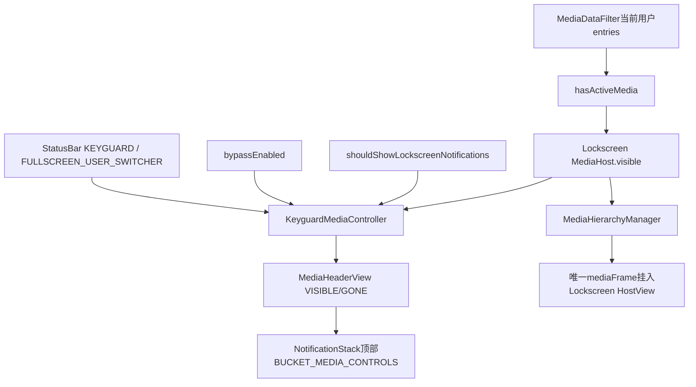
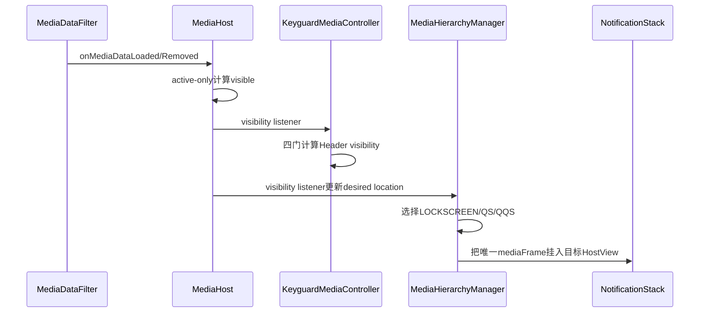
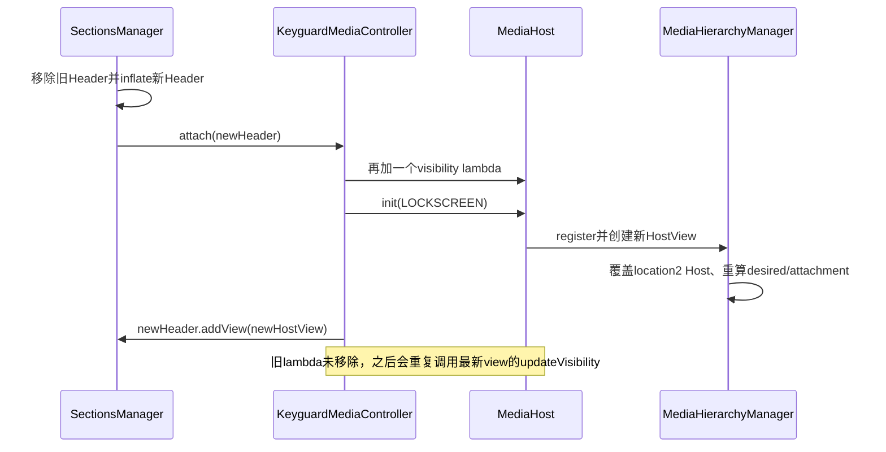

# 第 441 章 Android SystemUI KeyguardMediaController：锁屏媒体 Host、Active 策略与可见性

> 源码基线：Android 11 / API 30 / `android-11.0.0_r48`。本章只在 macOS 阅读源码，不编译。核心文件：`KeyguardMediaController.kt`、`MediaHost.kt`、`MediaHierarchyManager.kt`、`MediaDataFilter.kt`、`NotificationSectionsManager.kt`、`MediaHeaderView.java`、`NotificationStackScrollLayout.java`、`NotificationLockscreenUserManagerImpl.java`、`KeyguardBypassController.kt`、`QSPanel.java`、`QuickQSPanel.java` 与 `keyguard_media_header.xml`。

## 1. 本章要解决什么问题

为什么暂停超时的恢复卡能留在完整QS，却不出现在锁屏？锁屏媒体为什么位于通知列表最顶部，却不是普通MediaStyle通知Row？Face Unlock bypass、锁屏通知总开关、用户切换和Doze又怎样影响同一个Carousel的位置与可见性？

## 2. 先给出总答案

`KeyguardMediaController` 配置一个专属MediaHost：collapsed、只显示active、需要防误触；再把HostView塞进通知栈的MediaHeaderView。最终外壳可见还要同时通过Host有active媒体、未启用bypass、状态为KEYGUARD/全屏用户切换器、允许锁屏通知四道门。

## 3. 它不是重新创建一套播放器

锁屏MediaHeaderView只是容器。MediaHierarchyManager仍把唯一 `mediaFrame` 从QQS/QS移动到锁屏HostView；每个MediaControlPanel、SeekBar和排序账继续复用。所谓“锁屏媒体”是同一Carousel的新宿主状态。

## 4. 三层可见性要分开

第一层MediaDataFilter决定当前用户有哪些entry；第二层MediaHost.visible根据active/all策略判断Host有无内容；第三层KeyguardMediaController决定MediaHeaderView在当前系统状态和隐私策略下VISIBLE还是GONE。

## 5. 位置选择还有第四层

即使锁屏Header是GONE，MediaHierarchyManager仍要决定唯一mediaFrame暂时挂到LOCKSCREEN、QS还是QQS Host。它用状态、QS expansion、bypass、通知策略、Host visible与睡眠/唤醒阶段避免无意义迁移。

## 6. 运行进程与线程

全部对象位于SystemUI。StatusBar state、MediaData listener、用户/设置观察与View可见性以主线程串行处理；类内使用普通字段、ArraySet和View API，没有后台线程同步设计。

## 7. 哪些事实来自跨进程

媒体通知/Session来自App，锁屏通知设置来自SettingsProvider，用户和设备策略可能来自system_server；但本章的Host选择与View重挂在SystemUI本地完成。

## 8. KeyguardMediaController 很小但边界很多

本类正文只有attach和updateVisibility两条主路径。复杂性来自它读取的四个外部状态与三个下游容器；阅读时不能因代码短就把“媒体是否存在”“能否上锁屏”“Carousel放哪”合成一个boolean。

## 9. 构造注入四项

MediaHost保存锁屏位置状态；KeyguardBypassController给face bypass事实；SysuiStatusBarStateController给KEYGUARD等状态；NotificationLockscreenUserManager给当前用户是否允许锁屏通知。

## 10. 锁屏媒体总体链路



## 11. 构造时监听什么

init只向StatusBarStateController添加StateListener，并在 `onStateChanged` 调updateVisibility。没有保存listener字段，也没有对应remove；Controller是Singleton，设计为SystemUI进程生命周期常驻。

## 12. 为什么用 onStateChanged 而不是 preChange

Header可见性跟最终state一致即可；真正的Carousel迁移动画由MediaHierarchyManager在onStatePreChange提前更新位置，以保留旧Host边界作动画起点。两类监听时机承担不同职责。

## 13. view 字段是什么

可空 `MediaHeaderView`，attach后保存，外部只能get不能set。updateVisibility允许attach前被状态回调触发，此时安全地不写View，只把previous按GONE处理。

## 14. visibilityChangedListener 是什么

它意图在Header真正VISIBLE/GONE变化时通知一个外部消费者，只有可见性值变化才invoke。r48全仓搜索没有发现给它赋值的生产调用处，因此正常产品链中大概率从不生效。

## 15. attach 从谁调用

NotificationSectionsManager在inflate/reinflate `keyguard_media_header` 后用 `.also(keyguardMediaController::attach)` 连接。首次NotificationStack初始化和locale重建都会经过这里。

## 16. attach 的配置顺序

先保存Header并注册Host可见监听；再设置expansion、showsOnlyActive、falsing；然后 `mediaHost.init(LOCATION_LOCKSCREEN)` 创建HostView；最后塞进Header并更新外壳可见性。

## 17. 决定性源码

```kotlin
mediaHost.expansion = 0.0f
mediaHost.showsOnlyActiveMedia = true
mediaHost.falsingProtectionNeeded = true
mediaHost.init(MediaHierarchyManager.LOCATION_LOCKSCREEN)
mediaView.setContentView(mediaHost.hostView)
```

五行定义了锁屏Host的布局、内容和交互政策。

## 18. expansion=0 的含义

锁屏使用collapsed ConstraintSet，最多显示compact动作，不展示expanded SeekBar/完整五动作布局。它和QQS同为0，完整QS则为1。

## 19. 锁屏与QQS是不是完全相同

不是。两者都collapsed且active-only，但锁屏额外设置 `falsingProtectionNeeded=true`；QQS初始化没有显式设true，默认false。它们的屏幕边界、parent与系统可见门也不同。

## 20. 为什么锁屏需要 falsing

设备在口袋、AOD/锁屏唤醒或误触场景更敏感。Host状态最终传给MediaCarouselScrollHandler，使侧滑/点击相关交互在锁屏位置咨询FalsingManager；它不是认证权限，只是误触判断。

## 21. showsOnlyActiveMedia=true 的准确含义

MediaHost更新visible时调用 `mediaDataManager.hasActiveMedia()`；只要当前用户entries里至少一个 `MediaData.active=true`，Host就visible。它不逐张隐藏inactive卡，本章要继续看Carousel数据层如何展示集合。

```kotlin
visible = if (showsOnlyActiveMedia) {
    mediaDataManager.hasActiveMedia()
} else {
    mediaDataManager.hasAnyMedia()
}
```

## 22. active 不等于正在播放

active表示卡尚未超时、可显示在QQS/锁屏；暂停一段时间前仍可能active，正在播放通常active，但resumption卡固定inactive。PlaybackState.isPlaying与MediaData.active是两个维度。

## 23. hasActiveMedia 看哪个用户

MediaDataFilter的 `userEntries` 只保留NotificationLockscreenUserManager认为属于当前用户/profile的数据。`hasActiveMedia()` 在这个过滤Map上any active，不会因后台用户播放而点亮当前锁屏Host。

## 24. 完整QS为什么不同

QS Host设置expansion=1、showsOnlyActiveMedia=false，所以调用hasAnyMedia；暂停超时或resumption entry仍可留在完整QS。其settings齿轮也因为all-media Host而允许露出。

## 25. 三个 Host 策略表

LOCKSCREEN：location2、expansion0、active-only、falsing true；QQS：location1、expansion0、active-only、默认falsing false；QS：location0、expansion1、all-media，并配置横/竖布局消失参数。

## 26. MediaHost.init 创建什么

向MediaHierarchyManager注册自身并取得新的UniqueObjectHostView；给HostView安装MediaData attach监听和MeasurementManager；把state.changedListener连到MediaHostStatesManager；最后按当前entries更新visible。

## 27. 为什么先配置再 init

MediaHost注释要求预先设置状态，避免init后每个setter都触发HostState更新和重新测量。KeyguardMediaController严格遵守：三项政策先写，location与HostView最后创建。

## 28. HostView 怎样放入 Header

`MediaHeaderView.setContentView` 直接addView，再把child LayoutParams改成宽MATCH_PARENT、高WRAP_CONTENT。它没有先remove旧child或检查parent，依赖每个新Header只调用一次。

## 29. Header XML 有什么

只有一个空MediaHeaderView：match_parent×wrap_content、左右padding0、focusable/clickable true。真实媒体内容完全由setContentView动态加入。

## 30. Header 为什么继承 ExpandableView

通知栈算法只管理ExpandableView child。这样媒体容器能参与section边界、测量、位置和拖动手势，而内部mediaFrame仍不是ExpandableNotificationRow。

## 31. Header 的添加/移除动画

`performAddAnimation` 空实现，`performRemoveAnimation` 立即返回0。注释认为不需要本地动画；跨Host/卡片动画由MediaHierarchyManager和TransitionLayout负责，避免通知Row动画再叠一层。

## 32. 通知栈移除事件怎样看它

NSSL生成child removal事件时，MediaHeaderView被直接当作 `childWasSwipedOut=true`，使用REMOVE_SWIPED_OUT类型；但Header自己的remove动画仍为0。

## 33. updateVisibility 的四门公式

```kotlin
val shouldBeVisible = mediaHost.visible &&
        !bypassController.bypassEnabled &&
        keyguardOrUserSwitcher &&
        notifLockscreenUserManager.shouldShowLockscreenNotifications()
```

四项全真才能显示外壳，顺序没有副作用差异。

## 34. keyguardOrUserSwitcher 包含什么

只认 `StatusBarState.KEYGUARD` 或 `FULLSCREEN_USER_SWITCHER`。SHADE、SHADE_LOCKED等状态在本Controller均使Header GONE，即使系统仍处于某种锁定过渡。

## 35. 为什么全屏用户切换器也显示

r48把它视作锁屏视觉态的一部分，保持active媒体区域；MediaHierarchyManager也用同样的两状态判断onLockscreen，二者政策对齐。

## 36. bypassEnabled 为什么隐藏媒体

Face Unlock配置为直接绕过锁屏内容时，不应让锁屏媒体成为迁移目标/短暂闪现。KeyguardMediaController隐藏Header，HierarchyManager也把onLockscreen判为false，转向QS/QQS位置。

## 37. bypassEnabled 的getter还有一层

返回 `field && KeyguardStateController.isFaceAuthEnabled`。Tuner设置为开但当前用户face auth不可用时，实际getter仍false，媒体不会仅因配置位隐藏。

## 38. shouldShowLockscreenNotifications 是总开关

它是当前用户 `LOCK_SCREEN_SHOW_NOTIFICATIONS` 等政策计算出的缓存，不是“是否允许显示私密内容”。关闭总通知时整个媒体Header隐藏；私密内容redaction是通知Row另一层策略。

## 39. 为什么媒体也服从通知总开关

虽然Carousel不是普通Row，它被嵌在通知栈并可能暴露歌曲/应用信息。r48选择复用锁屏通知可见政策，而不是另设媒体专用开关。

## 40. previousVisibility 怎样取

如果view为空按GONE，否则读当前visibility；算出newVisibility后无条件赋值。只有值真的不同才调用visibilityChangedListener，重复update不会发外部通知。

## 41. Host visible 变化怎样触发更新

attach用 `mediaHost.addVisibilityChangeListener { updateVisibility() }`。MediaHost在MediaData loaded/removed后重新计算visible，只有View visibility实际变化时遍历listener。

## 42. Host 为什么只在附着时监听 MediaData

HostView attach时向MediaDataManager addListener并立即update；detach时removeListener。不可见/不在窗口的Host无需持续处理每个媒体事件，重新attach会用当前事实补齐。

## 43. Host visible 监听与 MediaData 监听不同

KeyguardController注册的是MediaHost内部visibleChangedListeners，长期保留；MediaHost自己向MediaDataManager的listener则随HostView attach/detach启停。不要把两者的生命周期合并。

## 44. visible setter 做什么

MediaHostStateHolder.visible变化触发changedListener→MediaHostStatesManager，同时MediaHost.updateViewVisibility再把hostView.visibility设VISIBLE/GONE并通知可见listener。状态账和View外观两条路径同步推进。

## 45. Header GONE 与 HostView GONE 是否重复

内容为空时HostView先GONE，KeyguardController再让外层Header GONE；双层能让HierarchyManager知道location不可用，也让通知栈不为Header留空间。其他政策如bypass只隐藏Header，Host.visible仍可能true。

## 46. 通知栈怎样插入媒体 Header

NotificationSectionsManager把mediaControlsView映射到 `BUCKET_MEDIA_CONTROLS`，当QS媒体feature启用时targetPosition固定0，再在反向调整阶段add/move到通知栈最顶部。

## 47. GONE Header 会从 child 列表删除吗

feature启用时section manager仍把它放在index0；KeyguardController只改visibility。通知栈布局会忽略GONE空间，但对象仍是section child，后续可直接恢复。

## 48. feature关闭时怎样处理

代码结构上，`isMediaControlsEnabled()` 为false时media targetPosition=null，SectionManager会从parent删除Header，此时不仅是GONE，而是不属于通知栈children。不过r48的 `Utils.useQsMediaPlayer(context)` 已硬编码返回true，正常产品运行不会走到这个关闭分支。

## 49. feature 开关是否动态监听

r48没有真实动态开关：`useQsMediaPlayer()` 直接return true。FeatureManager仍保留false分支，便于历史/测试或未来恢复开关；若只修改这个返回源而不增加通知，SectionManager仍要等下一次updateSectionBoundaries才重排。

## 50. beginsSection 为什么识别 MediaHeaderView

只要当前View等于mediaControlsView就开始新section，确保StackScrollAlgorithm把它作为媒体bucket边界。它不依赖View内部有哪些卡。

## 51. 锁屏下普通section header为何不显示

SectionManager用 `showHeaders = state != KEYGUARD` 控制Heads-up/People/Alerting/Silent文字Header；媒体targetPosition却不受showHeaders门，仍固定0，再由KeyguardMediaController自己的四门决定VISIBLE。

## 52. 从媒体更新到锁屏显示的时序



## 53. MediaHierarchyManager 为什么也读通知总开关

如果用户不允许锁屏通知，不能只把Header GONE还把mediaFrame留在隐藏Host；calculateLocation会跳过LOCKSCREEN，选择QQS或QS，让唯一View保持在有效宿主。

## 54. Hierarchy 的 onLockscreen 公式

未开启bypass，并且缓存statusbarState为KEYGUARD或FULLSCREEN_USER_SWITCHER。它与KeyguardController的状态门一致，但前者用自己的 `statusbarState` 在preChange提前更新。

## 55. QS expansion 的优先级

非锁屏时只要qsExpansion>0就选QS；锁屏时要>0.4才选QS。否则满足通知政策选LOCKSCREEN，不满足选QQS。0.4是位置切换阈值，不是MediaHost expansion。

```kotlin
val location = when {
    qsExpansion > 0.0f && !onLockscreen -> LOCATION_QS
    qsExpansion > 0.4f && onLockscreen -> LOCATION_QS
    onLockscreen && allowedOnLockscreen -> LOCATION_LOCKSCREEN
    else -> LOCATION_QQS
}
```

## 56. 锁屏 Host 不 visible 时去哪

若计算出LOCKSCREEN但Host没有active媒体且当前不dozing，强制返回QS。注释说明inactive卡应留在QS，避免动画到一个不可见锁屏位置。

## 57. 为什么不是返回 QQS

QQS也是active-only，inactive/resumption卡在那里同样不可见；完整QS是all-media Host，能保存这些卡的有效几何和宿主关系。

## 58. Dozing 时为何例外

条件带 `!isDozing`，dozing时即使Host不可见也不强制QS。睡眠/AOD转换还有blockLocationChanges和dozeAnimationRunning，优先保持位置稳定，避免屏灭过程中搬View。

## 59. collapsingShadeFromQS 的保护

锁屏上从展开QS收起时，如果desired此前是QS，就暂留QS，不立即跳LOCKSCREEN；setter变化会forceNoAnimation更新。等收起链完成再选择合适位置，避免反向迁移抖动。

## 60. fullyAwake 的保护

从LOCKSCREEN准备去非锁屏位置但尚未fullyAwake时，仍返回LOCKSCREEN；完全唤醒后forceNoAnimation更新，避免Doze唤醒中播放一段迁移动画。

## 61. goingToSleep/dozeAnimationRunning 的总门

任一为true，calculateLocation直接返回当前desiredLocation，不接受位置变化。状态仍可积累，门解除时setter调用updateDesiredLocation补算。

## 62. Header 可见与 attachment 可能短暂不同

Header四门可立即GONE，而Hierarchy位置改变可能等待布局、动画或block门。唯一mediaFrame也可能暂时在root overlay；不要从 `header.visibility` 推导这一帧mediaFrame.parent。

## 63. root overlay 的用途

跨Host非手势动画时，Hierarchy先从旧Host移除mediaFrame，挂到rootOverlay，用屏幕绝对bounds插值；动画结束再加进目标UniqueObjectHostView。Header只提供终点bounds。

## 64. 手势引导的QS变换

QQS→QS时以qsExpansion作为progress，mediaFrame可能在overlay，MediaCarouselController再把每张卡状态从location1插值到0。锁屏Header不直接实现这个手势动画。

## 65. LOCKSCREEN→QQS 的特殊动画

若从锁屏去完整Shade/QQS，duration使用通知栈“go to full shade”时长，并可能加入keyguardFadingAwayDelay；反向QQS→锁屏使用appear/disappear时长。

## 66. camera gesture 为什么可禁动画

previous=LOCKSCREEN、desired=QQS且statusbarState已经SHADE被视作无效/特殊迁移，shouldAnimate返回false。相机等路径可能让Host屏幕位置不可用，直接落位更安全。

## 67. KeyguardMediaController 管不管这些动画参数

不管。它只配置Host和Header visibility；duration、overlay、bounds和currentAttachmentLocation都属于MediaHierarchyManager。两个类都读bypass/state，但职责不同。

## 68. MediaHeaderView 参与下拉锁屏手势

NSSL判断锁屏能否drag down时，条件是有active notifications或KeyguardMediaController.view.visibility==VISIBLE。只有媒体也能允许进入locked shade，不要求必须有普通通知Row。

## 69. 这里的 getView 有空值风险吗

Java调用Kotlin可空getter后直接 `.getVisibility()`，没有null检查；它依赖NotificationSectionsManager已初始化并attach Header后用户才能触发该手势。初始化顺序是隐含前提。

## 70. startingChild 是媒体 Header 时怎样处理

canDragDown为true可进入locked shade，但后面只有startingChild是ExpandableNotificationRow才调用row.onExpandedByGesture；MediaHeaderView不会被当作通知Row展开。

## 71. user switch 怎样更新媒体集合

MediaDataFilter的CurrentUserTracker把处理post到Main Executor，等LockscreenUserManager先更新profile缓存；随后清旧userEntries并发remove，再从allEntries重投当前profile，Host可见性随这些回调收敛。

## 72. 为什么先 clear 再回调 remove

Listener在remove回调中查询hasActive/hasAny时应看到旧用户集合已整体为空，而不是逐项残留。之后re-add新用户，Host可能经历false→true一次切换。

## 73. 用户切换时 Header 会不会立即重算通知总开关

KeyguardMediaController没有注册UserChangedListener；它依赖MediaHost visible变化或StatusBar state变化间接调用updateVisibility。若新旧用户都恰好有active媒体，Host.visible可能始终true但Filter会先clear，通常仍产生false→true回调。

## 74. 极端情况下仍可能陈旧吗

如果外部锁屏通知政策或bypass事实变化，却既无Host visible变化也无StatusBar state回调，本类没有独立触发源，Header可能保持旧visibility直到下一次相关事件。这是r48监听覆盖不足。

## 75. 锁屏通知设置变化的实际链

NotificationLockscreenUserManagerImpl的ContentObserver更新 `mShowLockscreenNotifications` 并要求通知EntryManager刷新；但接口没有“该boolean变化”专用listener，KeyguardMediaController也未注册ContentObserver，所以刷新普通通知不必然调用本类。

## 76. bypass 设置变化的实际链

KeyguardBypassController由TunerService更新私有setter，却没有对外callback集合；KeyguardMediaController只在updateVisibility现场读getter。Tuner变化本身不会直接通知它。

## 77. HierarchyManager 也有同类触发缺口

它同样没有监听NotificationLockscreenUserManager设置或bypass setter，只在state、qsExpansion、Host visible、Doze/唤醒等回调中重算。两边可能一起等到下一事件才收敛。

## 78. attach 重复发生在哪里

NotificationSectionsManager监听locale变化后 `reinflateViews`，旧MediaHeaderView从parent移除，新Header inflate，再次调用同一个Singleton KeyguardMediaController.attach。

## 79. 重复 attach 会新增什么

每次都向MediaHost.addVisibilityChangeListener加入一个新lambda；ArraySet按对象身份去重，而每个lambda都是新对象，所以监听会累计。没有remove API调用。

## 80. 累计监听的实际后果

下一次Host visible变化会多次调用同一个Controller.updateVisibility；由于view字段已指向最新Header，旧lambda不会写旧View，但造成重复计算/赋值。次数随locale reinflate增长。

## 81. MediaHost.init 也会重复

每次attach重新register，创建新UniqueObjectHostView、覆盖mediaHosts[LOCKSCREEN]和hostView字段，并安装新attach listener/measurement manager。旧Header移除会detach旧HostView，但旧View对象的listener仍引用MediaHost直到它自身可回收。

## 82. Header setContentView 为什么没重复child

虽然Controller重复attach，参数是新inflate的MediaHeaderView，所以每个Header只add一次新HostView。若调用者错误地对同一个Header二次attach，setContentView会add第二个child，且旧HostView仍在其中。

## 83. register 重建当前Host怎样避免丢mediaFrame

HierarchyManager若新注册location正是desired/current attachment，会先把相应位置标成-1，再updateDesiredLocation，迫使后续attachment逻辑把唯一mediaFrame重新加到新HostView。

## 84. Locale 重建时序



## 85. visibilityChangedListener 为什么也不会帮Section重排

仓库里没有setter调用，SectionManager也没有连接它；媒体Header是否在parent由feature决定，是否占空间由View.GONE自然处理，因此产品通常不需要该callback完成基本布局。

## 86. 单测覆盖哪些门

测试验证Host hidden→GONE、Host visible+KEYGUARD+允许通知→VISIBLE，以及禁止锁屏通知→GONE。它通过捕获Host visibility listener触发update。

## 87. 单测没覆盖什么

没有bypass、FULLSCREEN_USER_SWITCHER、SHADE、连续可见性回调、visibilityChangedListener、重复attach、locale reinflate、用户切换或设置现场变化，也没有MediaHierarchyManager位置联动。

## 88. 测试为何先 attach 再调用捕获listener

attach本身已update一次；测试随后主动invoke可见listener，保证mock状态配置后路径被执行。verify使用atLeastOnce，因此不区分attach初次和listener第二次赋visibility。

## 89. MediaHost.visible 的初值

StateHolder默认true，但init最后updateViewVisibility会按MediaData事实修正。attach在mock测试里visible由Mockito默认false/显式stub；真实运行不应把默认true当最终内容存在。

## 90. visible listener 参数为何没被使用

Keyguard attach lambda写 `{ updateVisibility() }`，忽略传入Boolean，重新读取mediaHost.visible及其他三门，避免只凭Host变化推导最终Header可见。

## 91. Host listeners 回调时是否复制集合

MediaHost直接 `visibleChangedListeners.forEach`，ArraySet没有快照或异常隔离。监听若在回调中增删集合或抛异常可能影响遍历；当前内部listener都简单调用管理器。

## 92. Header clickable/focusable 有何含义

空壳本身可参与焦点与点击命中，但没有安装自己的OnClick；真正媒体卡child处理点击/长按。XML属性也可能帮助通知栈触摸路由把它当交互区域，而不是纯装饰Header。

## 93. Header 能否左右滑掉

Carousel内部ScrollHandler处理横向分页/边缘侧滑，NSSL又把MediaHeaderView识别为特殊ExpandableView。实际手势优先级由嵌套触摸决定；Header并不是普通可清除通知，整体媒体dismiss最终走MediaDataFilter timedOut。

## 94. active-only Host 如何影响设置齿轮

Carousel收到desiredHostState后设置 `showsSettingsButton = !showsOnlyActiveMedia`。LOCKSCREEN/QQS不会在边缘侧滑露出设置齿轮，完整QS会；这和Header四门是另一个消费点。

## 95. falsingProtection 如何进入Carousel

同一回调把Host的falsingProtectionNeeded交给MediaCarouselScrollHandler。锁屏location成为desired时开启，去QQS/QS时按目标Host关闭/更新；不是每个MediaControlPanel单独保存。

## 96. Host expansion 如何影响 SeekBar listening

Carousel把 `currentlyExpanded = host.expansion > 0`，再让Panel.setListening决定SeekBar轮询。锁屏expansion0意味着不为不可见的进度条持续poll，节省工作。

## 97. Header GONE 会自动让Panel停止listening吗

不直接。Panel listening主要跟desiredHost expansion；Hierarchy若因Header政策选择QQS也是expansion0，若把inactive卡留QS则可能expanded。可见性与轮询需沿desired location一起判断。

## 98. 锁屏通知关闭后媒体去哪

四门让Header GONE；Hierarchy calculateLocation不选LOCKSCREEN。若qsExpansion为0通常落QQS，QQS Host自身active-only，最终是否可见仍看active；只有QS展开、睡眠/唤醒位置冻结等其他状态才可能暂时选择或保留别的位置。

## 99. bypass开启后媒体去哪

同样不选LOCKSCREEN；状态在KEYGUARD但onLockscreen=false，qsExpansion0时location分支最终QQS。外壳也GONE，避免唯一View留在锁屏通知栈。

## 100. FULLSCREEN_USER_SWITCHER 下的用户数据

位置/外壳政策允许锁屏Host，但MediaDataFilter仍只投当前用户/profile。用户真正切换后Filter清旧重投新集合，不能把切换器界面显示理解为同时展示多个用户媒体。

## 101. 私密通知禁止是否必然隐藏媒体

不一定。公式只读“是否显示锁屏通知”总开关，不读 `userAllowsPrivateNotificationsInPublic` 或单条needsRedaction。歌曲/艺术家仍按媒体UI政策展示，r48没有在本类做内容级redaction。

## 102. DND 会不会直接隐藏 Header

updateVisibility不读Zen。DND可能影响通知筛选/媒体行为，但只要MediaData仍active且四门通过，Header可显示。

## 103. Keyguard secure 与否是否参与

不直接。StatusBarState KEYGUARD和锁屏通知缓存已经概括主要环境；本类不检查LockPatternUtils、安全方式或是否已认证。

## 104. Host visible 和 Header visible 命名陷阱

`mediaHost.visible` 意味着此Host按内容策略“有东西可展示”，不是屏幕像素一定可见；Header View.visibility才合并bypass/state/通知政策；`View.isShown`还要继续考虑attach、祖先visibility和alpha。

## 105. currentBounds 何时可靠

MediaHost.currentBounds现场从已布局HostView屏幕坐标和padding计算；Header/Host GONE或未attach时可能是0。Hierarchy在某端Host invisible时借用另一端bounds，避免用未定义几何插值。

## 106. 为什么 updateVisibility 不请求布局

设置View.visibility本身会触发View层布局/invalidations；通知栈的section child仍在parent。MediaHost尺寸变化另走MeasurementManager与Carousel size回调，不由Controller手写requestLayout。

## 107. 排查“有音乐但锁屏不显示”的顺序

先确认当前profile的MediaData.active；再查lockscreen Host.visible；再查bypass getter、StatusBar state、shouldShowLockscreenNotifications；随后看Header visibility/attach；最后看Hierarchy desired/currentAttachment与mediaFrame parent。

## 108. 排查“设置关闭后仍短暂显示”的顺序

记录Settings observer更新mShowLockscreenNotifications的时刻，确认是否有Host visible或State回调触发KeyguardController/Hierarchy重算；若没有，等待下一媒体/状态事件才消失符合r48触发缺口。

## 109. 排查locale切换后重复日志

统计KeyguardMediaController.attach次数、MediaHost visible listener集合大小、同一次visible变化触发updateVisibility次数，以及Hierarchy register location2次数。不要误判为MediaData重复发布。

## 110. 一个更稳健的设计方向

让attach可替换：保存并移除旧Host listener或使用稳定listener对象；让通知总开关/bypass提供明确callback；visibilityChangedListener用add/remove多订阅或删除死API；同一Header setContentView前清旧child。

## 111. 本章源码审计清单

固定区分：数据集合、Host内容可见、Header政策可见、View真实shown、Hierarchy attachment；再核对每个boolean的变化源是否有callback、重复attach是否清理、用户切换是否先更新profile、GONE对象是否仍留在section树。

## 112. macOS只读练习一：手算四门真值表

只读KeyguardMediaController.updateVisibility，列出Host visible、bypass、state、show-notifications各两值；至少写出“有active+KEYGUARD+允许+无bypass”为VISIBLE，以及任一门失败为GONE。不要改源码。

## 113. macOS只读练习二：对比三个 Host

执行 `rg -n "setExpansion|showsOnlyActiveMedia|falsingProtectionNeeded|LOCATION_" frameworks/base/packages/SystemUI/src/com/android/systemui/media/KeyguardMediaController.kt frameworks/base/packages/SystemUI/src/com/android/systemui/qs/QSPanel.java frameworks/base/packages/SystemUI/src/com/android/systemui/qs/QuickQSPanel.java`，画LOCKSCREEN/QQS/QS表格。

## 114. macOS只读练习三：追 active 到 Header

用 `rg -n "hasActiveMedia|updateViewVisibility|addVisibilityChangeListener|updateVisibility" frameworks/base/packages/SystemUI/src/com/android/systemui/media/MediaDataFilter.kt frameworks/base/packages/SystemUI/src/com/android/systemui/media/MediaHost.kt frameworks/base/packages/SystemUI/src/com/android/systemui/media/KeyguardMediaController.kt`，按调用顺序写箭头。

## 115. macOS只读练习四：模拟 locale 重建

只读NotificationSectionsManager.reinflateViews、KeyguardMediaController.attach和MediaHierarchyManager.register，记录旧Header、旧HostView、新Header、新HostView及listener的去向；判断哪些引用有显式remove，哪些只靠旧View回收。

## 116. 容易误解一：锁屏有独立媒体卡列表

不准确。MediaHeaderView只承载锁屏HostView，HierarchyManager搬运的是同一个mediaFrame；数据、Panel和排序都与QQS/QS共享。

## 117. 容易误解二：active 就等于 PlaybackState.PLAYING

不准确。active是超时/恢复展示资格，暂停媒体也可暂时active；isPlaying是另一个排序和状态字段。

## 118. 容易误解三：Host.visible 为 true 就一定显示在锁屏

不准确。还必须无bypass、处于KEYGUARD/全屏用户切换器、允许锁屏通知，并且Header/祖先已attach且可见。

## 119. 容易误解四：设置或bypass变化会立即主动通知本类

不准确。r48没有为这两项注册专用回调，通常依赖后续State或Host visible事件重算，存在短暂陈旧窗口。

## 120. 本章总结与下一章连接

本章把锁屏媒体拆成当前用户active数据、Host内容资格、Header四门政策和Hierarchy唯一View位置四层，并补出监听覆盖与重复attach边界。下一章继续进入 `MediaHierarchyManager` 的几何状态机，详细研究overlay、guided transition、睡眠门和中断动画如何保证唯一mediaFrame连续。
