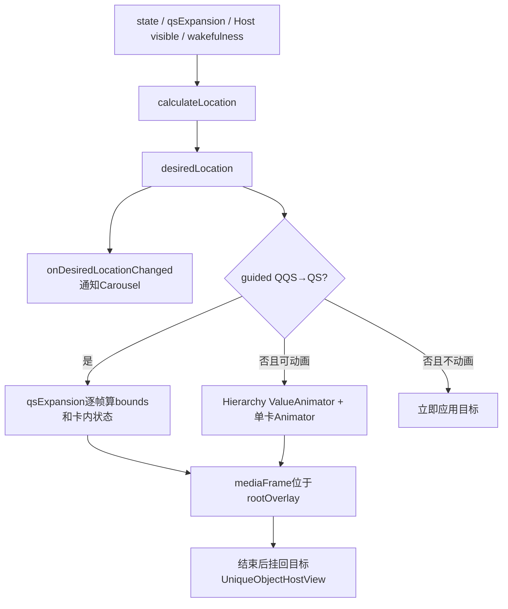
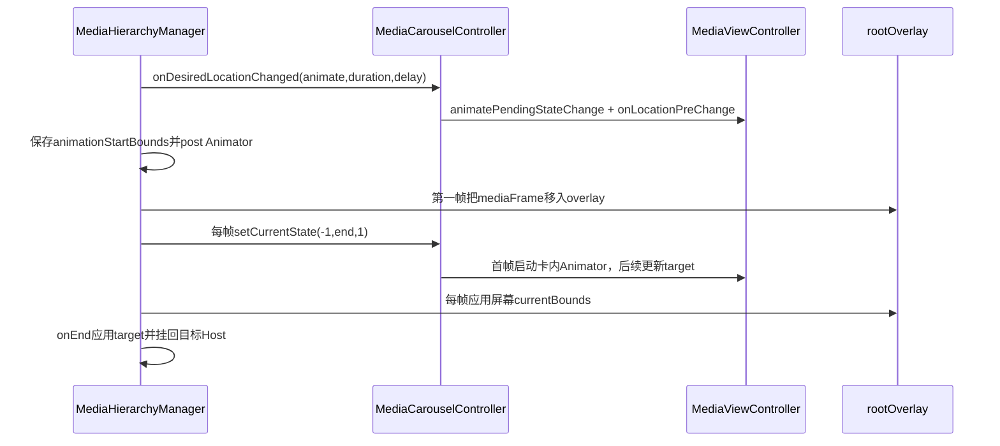
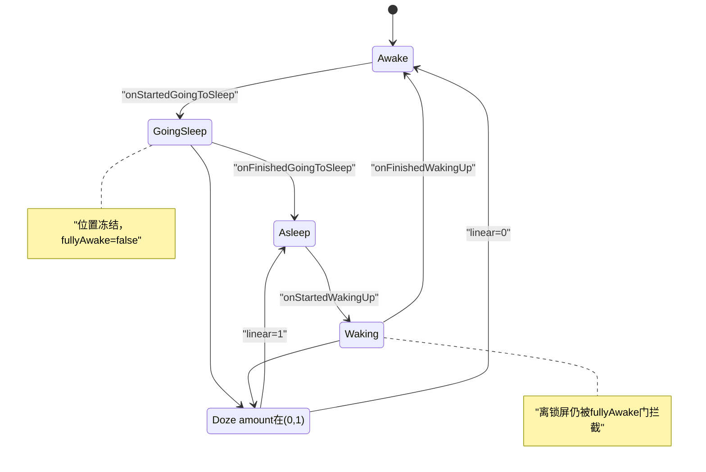

# 第 442 章 Android SystemUI MediaHierarchyManager：唯一 View、Overlay 迁移、手势变换与睡眠状态机

> 源码基线：Android 11 / API 30 / `android-11.0.0_r48`。本章只在 macOS 阅读源码，不编译。核心文件：`MediaHierarchyManager.kt`、`MediaHierarchyManagerTest.kt`、`MediaCarouselController.kt`、`MediaViewController.kt`、`MediaHost.kt`、`UniqueObjectHostView.kt`、`NotificationPanelViewController.java` 与 `QSFragment.java`。

## 1. 本章要解决什么问题

同一个mediaFrame怎样在QS、QQS、锁屏三棵独立View层级间移动而不复制？普通状态切换和手指拖动为什么用两套动画？动画中Host位置变化、目标改变或屏幕入睡时，系统怎样保持几何连续？

## 2. 核心职责

MediaHierarchyManager同时管理三件事：选择desired location；把唯一mediaFrame挂到目标Host或root overlay；把根bounds和每张卡内部状态推进到同一过渡阶段。它不解析MediaData，也不管理单卡按钮。

## 3. 四个位置常量

QS=0、QQS=1、LOCKSCREEN=2是稳定Host槽；IN_OVERLAY=-1000只表示过渡期真实parent在ViewRoot overlay，不是可注册Host。`@MediaLocation` 只做源码期IntDef提示，没有运行时校验。

## 4. 三种“位置”字段

`previousLocation` 是上一个desired；`desiredLocation` 是最终目标；`currentAttachmentLocation` 是mediaFrame当前真实挂载处，动画中可为IN_OVERLAY。三者相等只代表稳定终态。

## 5. 三个矩形

`animationStartBounds` 固定普通动画起点；`targetBounds` 每帧可重新读取Host；`currentBounds` 是这一帧应用到mediaFrame的屏幕矩形。手势变换没有固定Animator起点，而直接从两Host currentBounds插值。

## 6. 两套动画引擎

Hierarchy的ValueAnimator只管根mediaFrame屏幕bounds；MediaViewController内的TransitionLayoutController管卡内child几何。普通切换用两个同duration/delay的Animator，手势切换则共用外部qsExpansion progress直接计算。

## 7. 为什么必须用 Overlay

一个View同一时间只能有一个parent。跨不同Host动画时若直接挂在终点，坐标仍属于目标局部系；放到共同ViewRoot overlay后可用屏幕绝对left/top/right/bottom绘制，再在动画结束归还目标Host。

## 8. 运行线程

Host注册、StatusBar回调、Wakefulness、ValueAnimator和View重挂都在SystemUI主线程。普通数组/Rect/boolean无锁，调用者必须遵守UI线程串行契约。

## 9. 外部输入

StatusBar state、QS展开比例、锁屏通知政策、bypass、Host visible、Doze amount、isDozing、Wakefulness和collapsingShadeFromQS共同决定位置与动画；Host的currentBounds又随布局/translation实时变化。

## 10. 总体状态图



## 11. isShownNotFaded 做什么

从mediaFrame向祖先逐级检查visibility必须VISIBLE、alpha不能精确等于0，并要求最终遇到非View parent；中途parent=null视为未attach。它比简单isShown多排除了alpha0。

```kotlin
if (current.visibility != View.VISIBLE || current.alpha == 0.0f) return false
val parent = current.parent ?: return false
if (parent !is View) return true
current = parent
```

## 12. 它没有检查什么

不检查alpha是否接近0、transitionAlpha、clipBounds是否空、scale是否0、窗口可见性或屏幕外坐标。因此它只是“值得尝试动画”的轻量启发式，不是像素可见性的完整证明。

## 13. 为什么动画中仍判可动画

`shouldAnimateTransition` 最后返回 `isShownNotFaded || animator.isRunning || animationPending`。即使View因重挂短暂not shown，已有动画/待启动动画也允许新目标平滑接续。

## 14. mediaHosts 数组为什么长度3

`arrayOfNulls(LOCATION_LOCKSCREEN + 1)` 正好索引0..2。register不检查location范围，传负值或大于2会数组越界；内部三个Host遵守常量契约。

## 15. register 的输出

每次创建新的UniqueObjectHostView、回写MediaHost.hostView、登记Host可见listener、覆盖对应数组槽并重算desired。重复注册同location会替换宿主View。

## 16. Host visible 变化为何不动画

register的listener调用 `updateDesiredLocation(forceNoAnimation=true)`。内容出现/消失不应让唯一View跨一个可能没有有效bounds的Host飞行；卡片自己的gone状态仍可由HostState链处理。

## 17. 覆盖当前Host的修复

若重注册location等于desired，先令desired=-1；若等于currentAttachment，先令attachment=-1。随后重算会把它当新View并强制重挂，解决locale reinflate后HostView已换对象的问题。

## 18. 重复注册的监听残留

每次给同一MediaHost add一个新lambda，没有移除旧listener。上一章已看到locale重建会累计回调；Hierarchy本身也因此被同一次visible变化重复唤醒。

## 19. createUniqueObjectHost 何时得到 rootOverlay

新HostView第一次attach到窗口时，从 `viewRootImpl.view` 取得根View及其overlay，然后移除这个一次性attach listener。只在rootOverlay为空时赋值。

## 20. 隐含的同一 ViewRoot 假设

后续Host即使attach也不会更新rootOverlay，默认QS、QQS、锁屏都属于同一个NotificationShade ViewRoot。若跨display/换ViewRoot复用Manager，旧overlay可能不再适用。

## 21. Host 尚未 attach 就请求动画

普通动画分支只有 `rootView?.let { postOnAnimation(...) }`，rootView为空时既不post也不立即apply。正常初始化首次location走isNewView立即落位，通常先建立root；异常注册/时序下可能停在只更新desired但未应用的状态。

## 22. register 缺目标Host时怎样恢复

calculate可能先选一个尚未注册的位置，onDesired收到null，立即应用也因getHost为空跳过。以后该location register时发现等于desired，把desired重置-1再计算，从而补一次新View应用。

## 23. updateDesiredLocation 只在目标变化时工作

新计算位置等于旧desired就不通知Carousel、不重启动画。HostState本身的尺寸/visible变化另由MediaHostStatesManager和View布局链更新，避免位置不变却重复迁移。

## 24. previousLocation 何时更新

只有旧desired>=0时才保存。首次从-1进入目标时previous仍-1，performTransition直接cancel并立即应用，不会让mediaFrame从屏幕原点飞入。

## 25. 位置更新的决定性源码

```kotlin
if (this.desiredLocation >= 0) {
    previousLocation = this.desiredLocation
}
val isNewView = this.desiredLocation == -1
this.desiredLocation = desiredLocation
```

先记旧目标再写新目标，后续所有guided/动画判断依赖这对位置。

## 26. Carousel 为什么先收到目标

`onDesiredLocationChanged` 在performTransition之前调用，让每个MediaViewController提前设置目标measureState，并在普通动画时arm一次性内部动画；根bounds动画稍后才post到下一帧。

## 27. onDesiredLocationChanged 还更新什么

目标Host的expanded状态决定SeekBar listening；showsOnlyActive决定设置齿轮；falsing标志进入ScrollHandler；visible改变会重置translation；最后按目标测量更新Carousel尺寸。

## 28. isNewView 为什么立即应用

没有可靠旧Host和旧bounds，动画起点无意义。`cancelAnimationAndApplyDesiredState` 取消Animator，并以目标Host currentBounds、`immediately=true` 设置卡片和parent。

## 29. 任一 Host 缺失也立即降级

目标或previous Host为null时同样立即目标化。系统宁可跳变，也不对不存在的Host强制解引用或从零Rect插值。

## 30. guided transformation 的定义

`getTransformationProgress() >= 0`。r48唯一来源是QQS→QS：当前desired Host必须QS、previous必须QQS，并且previous可见或StatusBar不在KEYGUARD，返回qsExpansion。

## 31. 为什么只支持 QQS→QS 手势

这是下拉展开QS的连续手势，两个Host都在QS区域且上游提供0..1进度。锁屏→QS跨通知栈和QS层级，使用阈值与普通动画，不直接把全部锁屏拖动映射为同一progress。

## 32. 锁屏上 QQS 不可见时不 guided

若previous QQS Host不可见且statusbarState=KEYGUARD，返回-1。没有有效起点bounds时强行插值会从0尺寸/错误坐标跳动。

## 33. qsExpansion 谁写入

NotificationPanelViewController把按高度算出的QS expansion fraction同时传给QS Fragment、MediaHierarchyManager和通知栈。Hierarchy setter检测Float变化，重算位置；若guided有效，还立即更新target并apply当前帧。

## 34. qsExpansion 是否 clamp

本类不限制0..1。上游正常给规范比例；若传负数，guided返回-1且位置不选QS；若大于1，MathUtils.lerp会外插，阈值分支也仍选QS。

## 35. 手势帧怎样算根 bounds

读取previousHost.currentBounds和endHost.currentBounds，对left/top/right/bottom分别lerp，再写targetBounds并apply。Host边界可随QS布局和pinToBottom translation实时变化。

## 36. 为什么每帧重新读 Host bounds

QS展开时容器高度、scroll和translation都在变；固定终点会落后于真实布局。guided和普通Animator update都先 `updateTargetState()`，允许moving target。

## 37. 一端 invisible 怎样处理

end不可见就用start替代end；否则start不可见就用end替代start。根bounds因此保持在有效一端，卡片的显隐由MediaViewController DisappearParameters表达。

## 38. 两端都 invisible 时

先因end invisible令end=start，最终两端同为原start bounds；几何不移动。内容可能仍按HostState gone处理，避免使用未布局的另一端。

## 39. interpolateBounds 的取整

四边Float lerp后直接toInt，向0截断；宽高不是独立插值而由right-left/bottom-top产生。逐帧可能有1px取整抖动，但保证Rect边统一从屏幕坐标计算。

## 40. guided 时卡内状态怎样走

applyState把startLocation=previous、endLocation=desired、progress=qsExpansion传给Carousel；每张MediaViewController对两个Host完整ViewState直接插值，不启动自己的ValueAnimator。

## 41. guided 到 progress=1 的收尾

`isTransitionRunning` 只在guided且progress!=1时为true；达到1后newLocation变desired，updateHostAttachment把mediaFrame从overlay移入QS Host，并把bounds换算到Host padding局部坐标。

## 42. 普通动画何时允许

不是guided；不是锁屏相机特殊无效路径；随后View已shown-not-faded、Animator运行或pending任一成立。LOCKSCREEN→QQS且leaveOpen/SHADE_LOCKED还有强制true例外。

## 43. 为什么 leaveOpen 强制动画

解锁后保持Shade打开的重挂链可能让mediaFrame比正常更早not shown，单看isShown会错误取消过渡；特例确保锁屏媒体仍平滑进入QQS。

## 44. camera 特例

previous=LOCKSCREEN、desired=QQS、缓存state=SHADE时直接false。源码注释称相机手势可能产生无效迁移，bounds不可信，选择立即落位。

## 45. 普通动画起点怎样选

若当前attachment仍是previous且previous HostView已attach，就现场读previousHost.currentBounds；否则从currentBounds继续。后者覆盖动画被打断、当前在overlay或旧Host已detach的情况。

## 46. 为什么先 cancel 再取起点

取消正在运行Animator，保留最后update写入的currentBounds，然后以它作为新起点；listener把cancelled标记为true，避免旧onEnd强制旧目标。

## 47. Animator 每帧做什么

先重新读取/计算targetBounds，再从固定animationStartBounds按animatedFraction插值到当前target，调用applyState；插值器FAST_OUT_SLOW_IN。

## 48. 普通动画中卡内状态为何不传同一fraction

非guided时applyState固定start=-1、progress=1。单卡在onDesiredLocationChanged时已arm自己的Animator，第一次setCurrentState启动它；根Animator只反复维持目标状态并移动外框。

## 49. 两个 Animator 怎样同步

Hierarchy把同一duration/startDelay传给Carousel，随后自己也设置这些参数并post启动；两者都用FAST_OUT_SLOW_IN。启动时刻接近但不是共享同一个animatedFraction，调度上可能相差一帧。

## 50. 为什么普通根动画每帧仍 setCurrentState

Host目标几何或gone状态可变化；TransitionLayoutController若内部Animator正在跑，animate=false的新state会更新终点而不停止动画，实现可中断retarget。

## 51. 普通动画时序图



## 52. 为什么 postOnAnimation 才 start

目标Host可能刚经历state/layout变化。延迟到下一绘制节拍，可取得更新后的bounds，并让Carousel预测量先完成。`animationPending=true` 也让attachment提前认为过渡正在发生。

## 53. rootView 为空的边界

post被安全调用包裹，root为空就什么都不做，但animate分支没有fallback立即应用。正常首Host attach建立root可避免；异常初始化顺序可能留下desired已变、parent未迁移。

## 54. animationPending 的用途

防止同一个待启动动画重复post；让shouldAnimate在View短暂不可见时仍返回true；让isTransitionRunning在真正start前就把mediaFrame放overlay。

## 55. pending 阶段 cancel 的 r48 缺口

`cancelAnimationAndApplyDesiredState()` 只调用 `animator.cancel()`。ValueAnimator尚未start时mStarted/mRunning均false，不会通知onAnimationCancel；因此自定义listener不会清animationPending，也不会remove已post的startAnimation。

## 56. 缺口可能造成什么

一次普通动画已post但下一状态要求立即应用时，旧Runnable仍可能下一帧启动Animator；它使用已被更新的字段，却保留某些旧起点/参数，产生多余动画或attachment再次进overlay。代码没有generation防迟到。

## 57. pending 被另一次动画替代时

新animate分支cancel未启动Animator也不清pending，`if (!animationPending)` 为false，不再post；但旧已post Runnable仍在，最终会按新近写入的startBounds/duration启动，相当于复用同一个待执行回调。

## 58. onAnimationStart 做什么

把cancelled=false、animationPending=false。真正start后，后续cancel会进入ValueAnimator listener并能removeCallbacks，不过Runnable此时已经执行完。

## 59. onAnimationCancel 做什么

cancelled=true、pending=false、从rootView移除startAnimation。对已start动画正确；对只处于外部pending且ValueAnimator自己未started的情况不会被框架调用，正是上一边界。

## 60. onAnimationEnd 如何收尾

未cancel才调用applyTargetStateIfNotAnimating。此时Animator已不running，applyState(targetBounds)令transitionRunning=false，把mediaFrame从overlay挂回desired Host。

## 61. 最后一帧为何还可能在 overlay

ValueAnimator update fraction=1时 `animator.isRunning` 通常仍true，isTransitionRunning仍真；等onEnd再次apply目标，才完成parent回迁。视觉终点和真实parent终点相差一个回调阶段。

## 62. 默认动画时长

一般200ms。LOCKSCREEN→QQS使用通知栈GO_TO_FULL_SHADE时长，并可能延迟到keyguard fading；QQS→LOCKSCREEN用APPEAR_DISAPPEAR时长。具体常量来自StackStateAnimator。

## 63. getAnimationParams 为什么调用两次

updateDesiredLocation先算一次传给Carousel；performTransition→adjustAnimator又算一次给根Animator。调用在同一主线程栈内，通常一致，但实现没有共享返回对象保证。

## 64. keyguard fading delay 的条件

只在previous LOCKSCREEN、desired QQS、缓存state SHADE且KeyguardStateController正在fading away时取delay。其他锁屏离开路径仍使用对应duration但delay0。

## 65. updateTargetState 非guided路径

只取desiredHost.currentBounds并复制到既有targetBounds；Host不存在直接return，target可能保留旧值。performTransition前已有Host null降级，但动画中Host被替换等极端时序仍需留意。

## 66. onStateChanged 为什么只 updateTargetState

preChange已提前改变缓存state并发起位置迁移；正式changed时刷新目标bounds。若此刻Animator运行，下一update会应用；若不运行，本方法本身不调用apply，依赖Host布局或其他状态链收敛。

## 67. statusbarState 缓存何时更新

只在onStatePreChange中赋newState；onStateChanged不赋。它依赖Controller保证preChange总先到。测试若只模拟onStateChanged，Hierarchy内部状态仍旧。

## 68. calculateLocation 第一门

`blockLocationChanges` 为true直接返回现有desired，不读任何新状态。若desired初始仍-1且过早进入block，后续getHost(-1)为空；正常启动时Host注册先建立目标。

## 69. onLockscreen 的定义

未bypass且缓存state为KEYGUARD或FULLSCREEN_USER_SWITCHER。它不读取KeyguardStateController.isShowing，和锁屏相机SHADE特殊情况靠后续动画规则处理。

## 70. 基础位置优先级

非锁屏qsExpansion>0选QS；锁屏qsExpansion>0.4选QS；否则锁屏且允许通知选LOCKSCREEN；最后QQS。0.4只是锁屏上的单一切换阈值，来回都用同一条件，没有独立回程阈值，因此不构成真正滞回。

## 71. 位置选择源码

```kotlin
val location = when {
    qsExpansion > 0.0f && !onLockscreen -> LOCATION_QS
    qsExpansion > 0.4f && onLockscreen -> LOCATION_QS
    onLockscreen && allowedOnLockscreen -> LOCATION_LOCKSCREEN
    else -> LOCATION_QQS
}
```

随后还有三条稳定性修正规则。

## 72. inactive锁屏Host修正

基础选LOCKSCREEN但该Host.visible不为true，且当前非dozing，就改选QS。QS是all-media Host，可给inactive/resumption卡保留有效位置；QQS同样active-only。

## 73. Host 尚未注册也会视为不可见

`getHost(location)?.visible != true` 对null也成立，所以非dozing时可能从未注册LOCKSCREEN退到QS；若QS也未注册，等待register补算。

## 74. collapsingShadeFromQS 修正

基础准备从QS回LOCKSCREEN，但标志说明正在锁屏上收起此前展开的QS，就继续留QS。setter变化时forceNoAnimation重算，避免收起过程反向飞行动画。

## 75. fullyAwake 修正

基础准备离开LOCKSCREEN、旧desired仍锁屏且fullyAwake=false时继续LOCKSCREEN；完全唤醒回调把fullyAwake=true并forceNoAnimation，随后直接重挂新位置。

## 76. goingToSleep 状态机

StartedGoingToSleep：going=true、fullyAwake=false，冻结位置；FinishedGoingToSleep：going=false，立即重算。设备已经睡着时dozing/amount状态仍可能继续提供另一层冻结。

## 77. waking 状态机

StartedWakingUp把going=false，可能触发重算，但fullyAwake仍false使离锁屏修正继续保留；FinishedWakingUp把fullyAwake=true，forceNoAnimation完成最终迁移。

## 78. Doze amount 状态机

linear严格不等0且不等1时dozeAnimationRunning=true并冻结；到任一端点变false后重算。eased参数完全未使用，位置门依据原始linear端点。

## 79. Float 端点精确比较

若上游linear因数值误差停在0.999999而不是1，Manager会继续认为Doze动画运行、冻结位置。正常StatusBarStateController应发布规范端点。

## 80. onDozingChanged 的补偿

isDozing=false时强制dozeAnimationRunning=false；true时调用updateDesiredLocation。它不直接把running设true，真正中间动画仍靠onDozeAmountChanged。

## 81. 睡眠与Doze门的关系

`goingToSleep || dozeAnimationRunning` 任一即可冻结。两者覆盖生命周期和视觉Doze过渡不同时间段，解除一个不保证立刻可变，calculate会继续看到另一个。

## 82. 睡眠/唤醒状态图



## 83. applyState 先做什么

复制bounds到currentBounds，再判断此刻是否guided，组装start/end/progress交给Carousel，然后更新parent。只有当前parent为overlay才显式把mediaFrame设为屏幕currentBounds。

## 84. 为什么先更新卡内状态再换 parent

MediaViewController可先设置目标measureState和视觉大小，UniqueObjectHostView add时更可能走免remeasure快速路径；反过来先add可能让新Host以旧尺寸布局一帧。

## 85. 普通动画 startLocation=-1 安全吗

MediaViewController找不到startHostState时直接用end；但其内部Animator的animationStartState来自当前画面快照，所以仍能从旧视觉平滑到终点，不依赖Manager传旧location。

## 86. updateHostAttachment 的判定

`inOverlay = isTransitionRunning() && rootOverlay != null`。有过渡但overlay尚不可用时直接挂desired Host；有overlay才把newLocation记IN_OVERLAY。

## 87. parent 迁移步骤

若attachment目标变化，先更新字段，再把mediaFrame从旧ViewGroup parent remove；取得desired HostView；过渡时rootOverlay.add，否则targetHost.add并设本地bounds。

```kotlin
(mediaFrame.parent as ViewGroup?)?.removeView(mediaFrame)
if (inOverlay) {
    rootOverlay!!.add(mediaFrame)
} else {
    targetHost.addView(mediaFrame)
}
```

## 88. 先更新字段的异常边界

currentAttachmentLocation在remove/add之前赋值。若后续getHost强制解引用或addView抛异常，字段可能声称已迁移而真实parent不是，代码没有事务回滚。

## 89. overlay 中为什么用屏幕坐标

root overlay坐标系与ViewRoot一致，Host.currentBounds通过getLocationOnScreen得到；因此直接setLeftTopRightBottom为currentBounds四边，可在不同子树之间连续移动。

## 90. 回到 Host 为什么改为局部坐标

目标Host add后left/top取padding，right/bottom用currentBounds宽高；屏幕绝对位置由Host自身布局决定，child只需占Host内容区域。

## 91. targetHost.addView 有什么优化

UniqueObjectHostView若child和Host已经测量且不要求remeasure，会用addViewInLayout、防requestLayout、解析RTL并直接layout；否则走普通super.addView。

## 92. requiresRemeasuring 从哪里来

它是View tag扩展属性。r48在MediaCarouselController每次player loaded/rebound并更新集合后把mediaCarousel置true；Host onMeasure在当前确实持有child时正常super measure后再置false，保证下次重挂不能错误跳过必要measure。

## 93. 非当前 Host 怎样保持尺寸

UniqueObjectHostView即使没有mediaFrame，也调用MeasurementManager按HostState计算Carousel缓存宽高，并setMeasuredDimension。这样所有候选终点始终有边界，不必先把唯一View放进去测。

## 94. Host measurement 与动画相互依赖

候选Host测量MediaViewController端点→Hierarchy读取Host currentBounds→根动画；同时目标measureState又影响mediaFrame尺寸。MediaHostStatesManager的缓存和UniqueObjectHostView解开了“必须先attach才能知道终点”的循环。

## 95. closeGuts 做什么

Hierarchy只把调用转给MediaCarouselController.closeGuts，后者立即关闭所有Panel guts。通常在位置/系统状态变化时由外部统一收起，不在本类遍历players。

## 96. 单测覆盖了什么

验证register会把新HostView写回MediaHost；StartedGoingToSleep后qsExpansion变化不通知Carousel；未进入睡眠时同样变化会通知；closeGuts正确转发。

## 97. 测试的 Host 初始化顺序

先LOCKSCREEN、QS、QQS依次register，最后QQS注册补齐最初默认SHADE下的目标。mock currentBounds全是空Rect，测试不覆盖真实parent/overlay或坐标动画。

## 98. 测试没有覆盖什么

guided progress、rootOverlay初始化、Animator pending cancel、动画中retarget、Host invisible替代bounds、0.4阈值、bypass/通知策略、Doze、fullyAwake、重复register和ViewRoot替换均无单测。

## 99. 为什么测试只verify位置通知仍不够

`onDesiredLocationChanged` 被调用证明逻辑目标变化，却不能证明mediaFrame parent正确、卡内状态同步、bounds连续或旧Runnable被取消。完整验证至少需真实HostView attach和Looper帧推进。

## 100. 普通动画中目标Host移动的轨迹特性

每帧都是“固定start→当帧target”按同一fraction，不是从上一帧位置追踪新target。目标突然移动时currentBounds也会改变，但不会重启fraction；可能出现速度折点，优点是仍按原时长收敛。

## 101. 动画被新目标打断的轨迹

旧Animator cancel后以currentBounds为新start（除非仍真实挂previous且其Host有效），更新时间参数并post新Animator。卡内Controller也从当前State复制新起点，设计目标是无跳变重定向。

## 102. previousLocation 在快速多跳时的含义

它记录上一个desired，不保证是当前真实attachment。代码因此不能总从previousHost bounds起步，必须检查currentAttachmentLocation并回退currentBounds。

## 103. forceNoAnimation 是否取消一切

只有calculate得到的新location不同才进入更新并立即路径；若location相同，force标志不会触发cancel。Host visible变化但目标不变时，卡内HostState回调自行刷新。

## 104. rootOverlay.add 前为何先 remove parent

View不能同时属于两个parent，且ViewGroupOverlay内部也会建立承载关系。显式remove保证不依赖overlay暗中搬迁，并让currentAttachment账与parent同步。

## 105. overlay 自身是否是普通 ViewGroup parent

API类型是ViewGroupOverlay，但内部承载View；mediaFrame.parent可作为ViewGroup移除。源码使用 `(parent as ViewGroup?)`，依赖平台overlay实现满足这一点。

## 106. 排查“媒体瞬移”的顺序

记录previous/desired/currentAttachment、guided progress、shouldAnimate各门、rootOverlay是否建立、start/current/target bounds、Host attach状态，以及卡内animatePending是否被arm。不要只看最终location。

## 107. 排查“动画结束仍在 overlay”的顺序

检查animator.isRunning、animationPending、guided progress是否精确1、onEnd是否因cancelled跳过、旧pending Runnable是否迟到，以及updateHostAttachment是否因attachment字段已错误相等而没执行。

## 108. 排查“睡醒后位置不更新”的顺序

依次看goingToSleep、fullyAwake、dozeAnimationRunning、isDozing、缓存statusbarState、desired；确认FinishedWakingUp与Doze端点回调都到达，且calculate没有被另一门继续挡住。

## 109. 排查“拖QS时卡片尺寸不同步”的顺序

确认qsExpansion进入Hierarchy；desired=QS/previous=QQS；getQSTransformationProgress是否因锁屏和QQS invisible返回-1；两Host currentBounds/measurement是否有效；Carousel setCurrentState是否收到同一progress。

## 110. 更稳健的 pending 取消方向

在自有cancel helper中无条件 `animationPending=false` 并 `rootView?.removeCallbacks(startAnimation)`，再cancel Animator；或给post Runnable加generation，执行前确认目标仍一致。不能只依赖ValueAnimator尚未started时不会发送的onCancel。

## 111. 本章审计清单

固定检查逻辑位置、真实parent、屏幕bounds、卡内状态四账；区分guided/ordinary/immediate；审查post-before-start取消；确认Host重建和ViewRoot归属；最后覆盖睡眠、Doze、bypass与设置变化触发源。

## 112. macOS只读练习一：画三位置账

只读 `updateDesiredLocation`、`performTransitionToNewLocation`、`updateHostAttachment`，分别为稳定QS、QS→QQS动画中、动画结束写出previous/desired/currentAttachment，不修改源码。

## 113. macOS只读练习二：推演 guided QQS→QS

用 `rg -n "getQSTransformationProgress|updateTargetState|applyState" frameworks/base/packages/SystemUI/src/com/android/systemui/media/MediaHierarchyManager.kt`，假设QQS Rect(0,100,300,250)、QS Rect(0,400,300,650)、progress0.5，手算target Rect。

## 114. macOS只读练习三：验证 pending cancel 缺口

对照Hierarchy的animationPending与本地 `frameworks/base/core/java/android/animation/ValueAnimator.java` 的cancel条件，写出post但未start时mStarted/mRunning、listener是否回调、Runnable是否移除。只做概念时序，不运行。

## 115. macOS只读练习四：手算睡眠门

按StartedGoingToSleep、Doze linear0.5、FinishedGoingToSleep、linear1、StartedWakingUp、FinishedWakingUp顺序记录goingToSleep/fullyAwake/dozeAnimationRunning和blockLocationChanges，指出何时允许非动画离开锁屏。

## 116. 容易误解一：三个Host各自持有一份mediaFrame

不准确。三个Host只持续测量并提供候选bounds，唯一mediaFrame稳定时属于一个Host，过渡时属于rootOverlay。

## 117. 容易误解二：所有跨Host动画都直接用qsExpansion

不准确。只有QQS→QS满足条件时guided；锁屏等普通切换使用Hierarchy根Animator和每卡内部Animator两套同步动画。

## 118. 容易误解三：Animator.cancel 总会清掉待启动回调

不准确。ValueAnimator尚未start时不通知onCancel，而r48只在listener中清animationPending/removeCallbacks，存在迟到Runnable窗口。

## 119. 容易误解四：desiredLocation 就是当前 parent

不准确。动画pending/running或guided未完成时currentAttachment=IN_OVERLAY；快速切换时previous也只是旧desired，不保证对应真实parent。

## 120. 本章总结与下一章连接

本章把唯一媒体View迁移还原为“位置决策→候选Host持续测量→普通/手势两种状态推进→overlay屏幕坐标→目标Host局部坐标”的状态机，并补出pending取消和重注册边界。下一章继续深入 `UniqueObjectHostView` 与MediaHost测量协议，解释无child Host怎样预留尺寸、免remeasure重挂为何安全以及哪些输入会破坏缓存。
