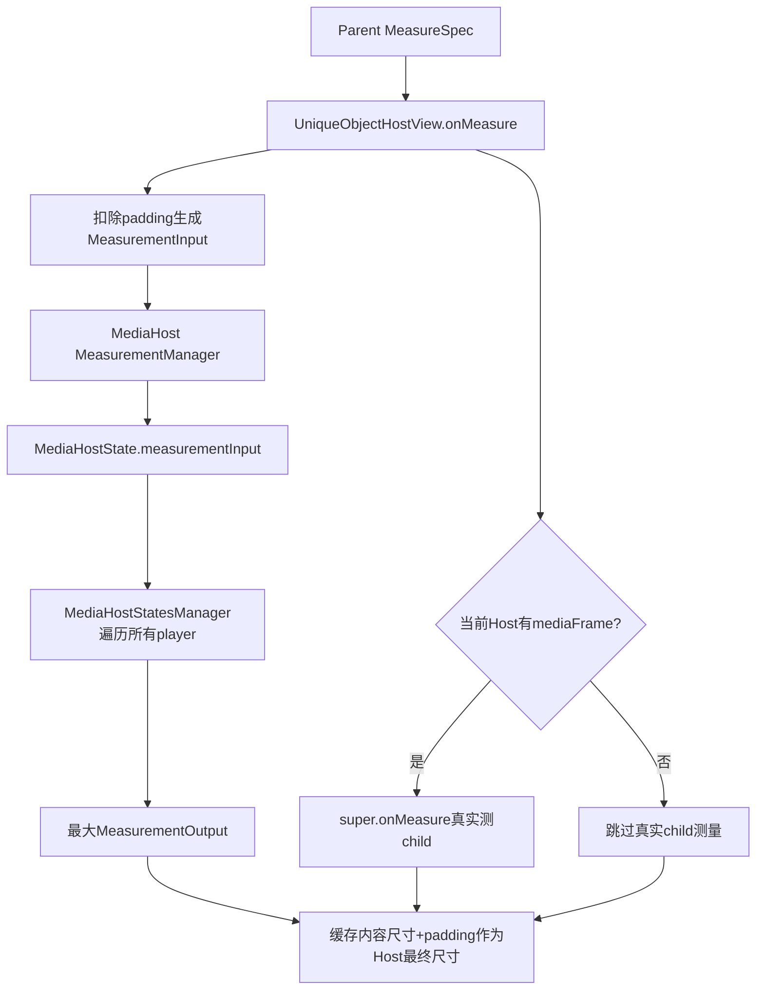
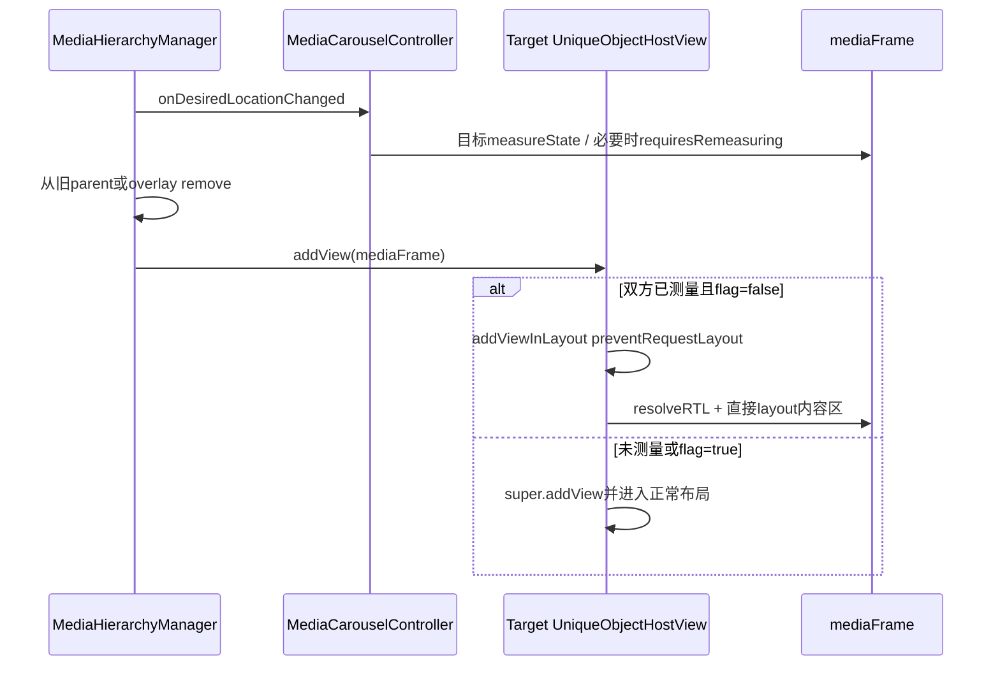
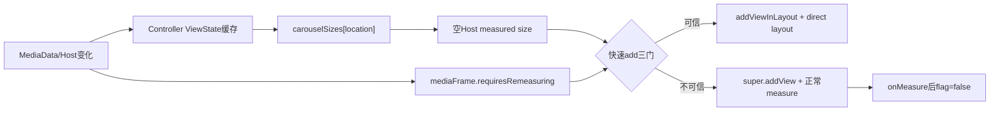

# 第 443 章 Android SystemUI UniqueObjectHostView：无 Child 测量、快速重挂与缓存一致性

> 源码基线：Android 11 / API 30 / `android-11.0.0_r48`。本章只在 macOS 阅读源码，不编译。核心文件：`UniqueObjectHostView.kt`、`MeasurementInput.kt`、`MediaHost.kt`、`MediaHostStatesManager.kt`、`MediaViewController.kt`、`MediaCarouselController.kt`、`MediaHierarchyManager.kt` 与 `TransitionLayout.kt`。

## 1. 本章要解决什么问题

三个Host中只有一个真正持有mediaFrame，另外两个为什么仍能占对尺寸？唯一View从overlay挂回目标Host时，为何有时可以跳过requestLayout和measure？缓存尺寸、真实child测量与Host报告尺寸若不一致，谁说了算？

## 2. 核心设计

UniqueObjectHostView把“有没有child”和“能不能测量”解耦。每次onMeasure都先让MeasurementManager用HostState预测Carousel尺寸；当前Host再真实measure child；最终Host无论是否持有child，都报告同一份缓存尺寸。

## 3. 为什么普通 FrameLayout 不够

空FrameLayout通常只能根据padding/minimum测量，无法提供未来mediaFrame的终点高度。跨Host动画需要开始前同时知道QQS、QS、锁屏三个Rect，因此空Host也必须像一直持有唯一View一样测量。

## 4. 谁提供预测尺寸

MediaHost为HostView安装MeasurementManager：把输入写入MediaHostState，再让MediaHostStatesManager遍历所有MediaViewController，求该location下所有player的最大宽高。

## 5. 谁是真实 child

唯一child是MediaCarouselController.mediaFrame，里面才有ScrollView、mediaContent和多个MediaControlPanel。Host不是每张卡的parent，而是整个Carousel根的候选parent。

## 6. 三种测量账

父布局给Host的MeasureSpec；Host扣padding后形成MeasurementInput；Manager返回Carousel内容MeasurementOutput。Host最后把padding加回，成为自己的measuredWidth/Height。

## 7. 当前 Host 的额外工作

childCount非0时调用FrameLayout.super.onMeasure，让mediaFrame/其子树真正获得measured size并处理内部布局；但super算出的Host尺寸随后被缓存结果覆盖。

## 8. 非当前 Host 的工作

没有child就完全不调用super.onMeasure，仍根据所有MediaViewController的Constraint端点计算内容尺寸并setMeasuredDimension。它只测“数据快照”，不需要临时搬View。

## 9. 运行线程

这是View测量流程，只能在SystemUI UI线程。MeasurementManager会触发Constraint测量、HostState回调和Controller遍历，绝不是可从后台并发调用的纯函数。

## 10. 总体测量流水线



## 11. measurementManager 为什么 lateinit

HostView由Hierarchy先new，MediaHost.init紧接着设置manager，正常在attach/measure前完成。类本身没有默认实现；若通用调用者创建后直接放入布局，第一次onMeasure会抛UninitializedPropertyAccessException。

## 12. onMeasure 先算 padding

横向使用 `paddingStart + paddingEnd`，纵向使用top+bottom；输入size减去padding，mode保持父MeasureSpec原样。RTL下start/end总和仍等于物理左右padding总和。

## 13. 输入构造源码

```kotlin
val width = MeasureSpec.getSize(widthMeasureSpec) - paddingHorizontal
val widthSpec = MeasureSpec.makeMeasureSpec(width, MeasureSpec.getMode(widthMeasureSpec))
val height = MeasureSpec.getSize(heightMeasureSpec) - paddingVertical
val heightSpec = MeasureSpec.makeMeasureSpec(height, MeasureSpec.getMode(heightMeasureSpec))
```

这两个spec描述Host内容区，不含padding。

## 14. padding 大于可用尺寸的边界

代码没有max(0, size-padding)。结果为负时，makeMeasureSpec会用位掩码编码成很大的正size，可能导致异常缓存/分配；当前媒体Host资源保证padding合理，但类作为通用组件缺少防守。

## 15. 为什么有 SuppressLint DrawAllocation

每次onMeasure都会new一个MeasurementInput data class。Lint认为draw/layout热路径分配有GC风险；源码显式压制，选择对象化协议换可读性。

## 16. MeasurementInput 保存什么

两个可变Int spec，既含mode高位也含size低位；`width/height` getter只取size，不保留mode。equals/hashCode由data class按两个完整Int比较。

## 17. 为什么它是 mutable

MediaHost收到AT_MOST宽度时会原地改成相同size的EXACTLY，要求媒体卡填满横向空间。若是不可变对象，就要返回新的输入或单独保存转换结果。

## 18. width AT_MOST 怎样转换

```kotlin
if (MeasureSpec.getMode(input.widthMeasureSpec) == MeasureSpec.AT_MOST) {
    input.widthMeasureSpec = MeasureSpec.makeMeasureSpec(
        MeasureSpec.getSize(input.widthMeasureSpec), MeasureSpec.EXACTLY)
}
```

只改mode，不改size。

## 19. 为什么只强制宽度

Carousel分页要统一填满Host宽度；高度由collapsed/expanded内容和约束求出。把height AT_MOST也强制EXACT可能让卡片无条件占满父剩余高度，违背wrap_content需求。

## 20. EXACT 与 UNSPECIFIED 宽度

EXACT保持不变；UNSPECIFIED也保持，常见size为0，可能得到零宽卡。真实QS/锁屏父布局会提供有界宽度，本类不为异常UNSPEC输入猜测默认值。

## 21. state 保存的是同一个 input 对象

`state.measurementInput = input` 没有copy。当前方法在赋值后不再修改它，因此正常安全；若外部保留并后来原地改spec，HostState会静默变化而不触发setter/changedListener。

## 22. setter 怎样判断变化

`if (value?.equals(field) != true)`。两个非null且值相等时不通知；新非null不同则保存并callback。若value和field都null，表达式null != true成立，重复赋null也会触发，这是可空写法的边界。

## 23. changedListener 在什么时候安装

MediaHost.init先注册Host、配置HostView attach/measurement manager，再把state.changedListener指向MediaHostStatesManager.updateHostState，最后更新visible。第一次真实onMeasure时listener已经存在。

## 24. 新 MeasurementInput 会触发什么

setter调用changedListener，Manager复制HostState、更新carousel最大尺寸、通知相关MediaViewController和其他callbacks；随后MeasurementManager自己又显式调用updateCarouselDimensions并返回结果。

## 25. 复读确认：变化输入会算两遍

第一次来自state callback中的updateHostState，第二次来自onMeasure返回表达式。每次都遍历所有Controller并调用getMeasurementsForState；r48用重复工作换同步返回最新输出。

## 26. 相同输入还会算几遍

setter因equals不通知，但显式updateCarouselDimensions仍执行一次。因此每次Host onMeasure都至少遍历一次players，不是纯Map读取。

## 27. Manager 为什么不能直接返回旧Map

player集合、绑定后的ConstraintSet和guts状态可能改变，而Host MeasureSpec没变；仅以input相等命中旧carouselSizes会漏掉内容变化。显式重算保证当前请求考虑现有Controllers。

## 28. Controller怎样产生单卡测量

`getMeasurementsForState` 调MediaViewController.obtainViewState；端点缓存命中时很便宜，未命中则临时用TransitionLayout计算collapsed/expandedConstraint状态；中间expansion插值两端。

## 29. 输出为什么取最大宽和最大高

遍历所有player分别更新max，保证Carousel所有页外框一致。最大宽和最大高可来自不同卡，结果只表示统一容器需求，不一定对应某张卡真实组合。

## 30. 没有 Controller 时输出什么

Manager从MeasurementOutput(0,0)开始并直接存入carouselSizes。Host最终尺寸只剩padding；等新player注册和后续测量/状态变化再扩大。

## 31. MeasurementOutput 也是 mutable data class

包含measuredWidth/Height两个var。Manager每次汇总创建新对象并存Map；MediaViewController内部则复用自己的单个measurement对象返回，Manager必须立即读取，不能长期保存该引用作为单卡快照。

## 32. onMeasure 的解构是否复制对象

`val (cachedWidth,cachedHeight)` 只是调用component1/2取两个Int，不保存MeasurementOutput引用。因此其他Controller以后复用输出不会改变本次局部值。

## 33. isCurrentHost 的定义

只看 `childCount != 0`，不检查child是否正是mediaFrame，也不要求恰好一个。类名说“single unique object”，实现却没有强制单child不变量。

## 34. 错误添加两个 child 会怎样

isCurrent仍true，super测量全部child；只把 `getChildAt(0).requiresRemeasuring=false`，第二个标志不清；最终缓存尺寸仍只按媒体Controllers计算，可能与额外child完全不匹配。

## 35. 当前 Host 的测量顺序

先计算缓存，再super真实测child，最后setMeasuredDimension覆盖Host结果。这样Manager先把目标measureState推到mediaFrame，真实child测量更可能采用同一目标尺寸。

## 36. 为什么 super 结果被覆盖

三个Host必须无论是否当前都报告一致的预测值，否则移入/移出时父布局高度会跳。真实measure的主要目的变成测child内部，而非决定Host最终外框。

## 37. Host 是否遵守父 spec state

最后直接 `setMeasuredDimension(cached+padding)`，没有resolveSizeAndState，也不传播MEASURED_STATE_TOO_SMALL。正常缓存是在输入spec下算出；若Manager错误返回过大值，Host可能违反AT_MOST。

## 38. child 真实测量可能与缓存不一致吗

理论上可能：super按FrameLayout规则测child，而Manager按MediaViewController状态快照汇总。实现假定两者共享Constraint/measureState并收敛；最终Host仍以缓存为准，child暂时可能被layout到不同内容区。

## 39. requiresRemeasuring 何时清除

当前Host调用super后，只清第一个child的tag。它表示“已在真实Host measure过当前集合”，允许下次跨Host快速add跳过普通requestLayout。

## 40. 谁把它设为 true

MediaCarouselController在每次MediaData loaded/rebound、players和page indicator更新后设置 `mediaCarousel.requiresRemeasuring=true`。不是每个View属性变化都自动置位，而是Carousel数据变化的显式协议。

## 41. removePlayer 路径是否也设置

不会。全仓只有loaded/rebind尾部把flag置true、Host真实measure后置false；`removePlayer()` 移除View、销毁Panel并更新Scroll/Page，却没有显式置true。它仍可能靠其他尺寸/requestLayout链收敛，但协议赋值确实不对称。

## 42. 快速 add 的三道门

child.measuredWidth不能0、Host.measuredWidth不能0、child.requiresRemeasuring不能true。任一失败走 `super.addView`，触发正常布局；三项都通过才走addViewInLayout。

## 43. 为什么只检查 width 不检查 height

源码把measuredWidth当“已经测量”的代理；高度可能仍0却进入快速路径。真实媒体卡宽非0通常意味着完整measure已完成，但作为通用ViewGroup这不是严格保证。

## 44. 快速路径源码

```kotlin
invalidate()
addViewInLayout(child, index, params, true /* preventRequestLayout */)
child.resolveRtlPropertiesIfNeeded()
child.layout(left, top, right, bottom)
```

它绕过正常requestLayout，直接把已测量child接入当前布局。

## 45. addViewInLayout 返回值被忽略

ViewGroup API返回是否成功；r48不检查，仍继续resolve RTL和layout。正常合法child/params会成功，异常场景没有回退super.addView。

## 46. 为什么先 invalidate

结构变化但抑制了requestLayout，至少要让Host重绘，避免显示列表仍认为空。invalidate不等于重新measure，只安排绘制脏区。

## 47. resolveRtlPropertiesIfNeeded 为什么手动调用

child正常在onMeasure/layout流程会解析继承的layoutDirection、padding等RTL属性；快速路径故意跳过onMeasure，必须补这一阶段，避免换到RTL Host后方向状态未解析。

## 48. 快速路径怎样决定 child bounds

left/top用Host物理paddingLeft/Top；right/bottom为Host measured尺寸减padding总和。它忽略child.measuredWidth/Height，直接layout填满Host内容区。

## 49. 这是否等于重新 measure

不等于。layout bounds可与child measured尺寸不同；TransitionLayout内部通过measureState/currentState、clip和direct bounds应对。若普通View依赖measuredWidth严格等于layout width，复用此Host可能出错。

## 50. 为什么可以冒这个险

mediaFrame是专门设计的Transition/Carousel容器，目标Host在离屏时已经用同一Controller状态测量，且Hierarchy在重挂前调用onLocationPreChange。组件之间有强协议，不是通用任意View托管器。

## 51. 快速重挂时序



## 52. flag=true 时何时恢复false

下一次这个Host成为current、onMeasure执行super后清除。仅addView走super并不会在add方法里清；必须等真实measure完成。

## 53. Host measuredWidth=0 的意义

目标Host尚未经过有效onMeasure，无法知道内容区bounds，必须走正常add。即便child已测量，也不能盲目按0宽快速layout。

## 54. child measuredWidth=0 的意义

唯一View从未真实测量或当前状态为零宽，直接layout可能缺内部测量结果；走super让父布局安排完整measure。

## 55. flag 的 tag 实现

使用 `R.id.requires_remeasuring` 存Boolean；getter比较是否true，null和false都视为不需要。setter(false)仍保留一个false tag，不移除键。

## 56. tag 会不会与业务冲突

使用SystemUI专用资源id，普通setTag(Object)槽不同；只有其他代码故意用同一key才会覆盖。搜索r48生产赋值可确认协议范围。

## 57. MediaHost.currentBounds 怎样算

每次getter现场getLocationOnScreen；left/top加内容padding，right/bottom用Host屏幕位置+实际width/height减右/下padding，返回内容区屏幕Rect。

## 58. currentBounds 源码

```kotlin
var left = tmpLocationOnScreen[0] + hostView.paddingLeft
var top = tmpLocationOnScreen[1] + hostView.paddingTop
var right = tmpLocationOnScreen[0] + hostView.width - hostView.paddingRight
var bottom = tmpLocationOnScreen[1] + hostView.height - hostView.paddingBottom
```

Hierarchy overlay动画使用的正是这组绝对坐标。

## 59. 为什么用 width 而不是 measuredWidth

动画终点需要已经layout后的真实屏幕边界，width/height反映当前left/right；measured尺寸可能刚更新但尚未布局。候选Host预测仍要等parent完成layout才能产生可靠currentBounds。

## 60. width为0且有padding怎样防负矩形

若right<left，就把left/right同时设0；高度同理。不是保留屏幕x/y的零宽Rect，而是归到全局原点，避免Rect负宽但可能让异常动画朝(0,0)飞。

## 61. 一维异常是否影响另一维

宽和高分别修正。宽无效可变0..0，但top/bottom仍保留真实Y；高度无效则Y归0，X仍可用。

## 62. getter 返回新 Rect 吗

不。`currentBounds`有一个field Rect，每次getter原地set并返回同一对象。调用者若长期保存引用，下一次访问会改变旧快照；Hierarchy通常用Rect.set复制。

## 63. getLocationOnScreen 的前提

未attach或GONE/未layout Host可能返回默认/旧坐标，width也可能0。Hierarchy在Host invisible时借另一端bounds，正是为避免把这种候选矩形当可靠终点。

## 64. Host visibility 与测量是否同义

不是。GONE Host在父布局中可能不被测量，旧measurementInput/carouselSizes仍存在；visible表示内容策略，是否获得最新layout还取决于祖先与View状态。

## 65. MediaData listener 生命周期

HostView attach时MediaHost向MediaDataManager addListener并立即update visibility；detach时remove。listener对象固定，Manager通常用Set，不会因一次重复attach产生同一对象多份。

## 66. 为什么 attach 时要立即 update

Host离窗期间可能错过MediaData变化，重新attach不能等下一条事件；现场查询hasActive/hasAny保证visible与当前账同步。

## 67. init 末尾为什么也 update

HostView可能尚未attach，但Hierarchy已经在calculateLocation读取Host.visible。立刻校正默认true，避免空媒体锁屏Host被短暂选中。

## 68. visible 更新的两条输出

StateHolder.visible变化通知MediaHostStatesManager；hostView.visibility变化通知visibleChangedListeners。若state值未变但View值异常不同，第二条仍可修View并发listener。

## 69. 初始都为 true 的细节

State visible默认true、View visibility默认VISIBLE；有媒体时update不触发任何listener，但事实已经正确。无媒体时两者改false/GONE并触发Manager/Hierarchy。

## 70. visible listener 为什么没有 remove API

MediaHost只提供add。三个Host通常常驻进程；但locale重建/重复attach会新增lambda，造成上一章的累计回调。生命周期设计没有覆盖可替换消费者。

## 71. StateHolder 的字段通知原则

expansion、showsOnlyActive、visible、falsing仅在值变时通知；measurement按equals；disappearParameters按hash。changedListener本身不复制到HostState快照。

## 72. 为什么 Manager 保存 state.copy

HostStateHolder继续可变，直接存引用会让旧状态跟着变。copy深拷MeasurementInput和DisappearParameters，其他primitive复制，形成回调使用的稳定快照。

## 73. copy 会不会触发通知

新Holder的changedListener默认null，逐setter赋值虽执行比较但没有外部回调。最终快照不携带原Host listener。

## 74. disappearParameters 的重新赋值契约

调用者常先取对象原地改PointF，再把同一对象set回Host，setter用上次hash检测变化。若只原地改而不重新set，不会通知；hash碰撞也会漏变更。

## 75. HostState equals 包含什么

MeasurementInput、expansion、showsOnlyActive、visible、falsing和DisappearParameters全部比较。即使某字段不改变MediaViewController缓存几何，也可能影响Carousel交互或位置，Manager仍需发HostState变化。

## 76. MediaViewController CacheKey 为什么更小

只含spec、expansion、guts，因为这些决定卡内Constraint端点；visible/disappear在基础ViewState后推导，active-only/falsing不改几何。HostState完整equals与单卡几何cache承担不同层次。

## 77. host measurement 变化的回调顺序

state setter→Manager保存copy并先算最大尺寸→所有MediaViewController stateCallback→其他callbacks；MeasurementManager返回前又再算一次。调用栈可能深但仍主线程同步。

## 78. 会不会递归无限 measure

Manager测Controller时TransitionLayout.calculateViewState可能临时measure媒体child，但不是再次测这个HostView；最终preDraw恢复视觉。正常链不会直接递归回UniqueObjectHostView.onMeasure。

## 79. 当前Host super.onMeasure 的重复成本

先Manager计算各player状态，后FrameLayout再measure整个mediaFrame/child；缓存未命中时同一轮可能既有端点计算又有真实View测量。设计优先保证一致性和离屏终点。

## 80. 非当前Host的性能优势

不走整棵Carousel ViewGroup真实measure，只遍历Controllers并尽量命中TransitionViewState端点缓存。三Host同时布局时，只有一个承担完整child测量。

## 81. player数量变化为何影响所有Host

每个location的最大宽高要重新取所有controllers；requires flag保证真实mediaFrame以后重测，Host各自下一onMeasure又更新对应carouselSizes。不是只更新当前Host。

## 82. add/removeController 不立即重算

MediaHostStatesManager注册/删除Controller只改Set。已有carouselSizes要等Host测量/状态更新等调用刷新；这段时间快速重挂若flag或目标measureState不配合，可能短暂使用旧最大尺寸。

## 83. 快速路径的缓存信任图



## 84. 为什么“缓存”不是一张表

至少有HostState.measurementInput、MediaViewController.viewStates、Manager.carouselSizes、Host.measured size、mediaFrame measured size和requires flag。排错必须找出哪一层过期。

## 85. padding 在哪些层加减

Host输入先减padding；Manager/Controller算内容宽高；Host最终加padding；Hierarchy currentBounds再排除padding，得到mediaFrame内容屏幕区。闭环中padding只占Host外框，不进入卡片ViewState。

## 86. RTL padding 的细节

测量用start+end总和，layout child左边用paddingLeft；在RTL下资源解析把start/end映射到物理left/right，内容宽总量不变，起点选择正确物理left。

## 87. LayoutParams 是否在快速路径生效

addViewInLayout接收params并建立父子关系，但跳过普通测量；MATCH_PARENT/WRAP_CONTENT不会重新计算child measured size，最终bounds由Host手工layout决定。

## 88. child 已有旧 parent 怎么办

UniqueObjectHostView不负责remove。Hierarchy在add前显式从mediaFrame.parent remove；调用者直接把仍有parent的View传进来，super或addViewInLayout会失败/抛异常。

## 89. currentHost 判断与 overlay

mediaFrame移入rootOverlay后三个Host childCount都0，因此都走离屏预测测量；动画结束目标Host重新childCount1，下一onMeasure恢复真实测量。

## 90. 快速add后何时成为current

addViewInLayout成功时childCount立即增加，isCurrentHost返回true；下一父测量会走super。Hierarchy的currentAttachmentLocation账与这里的childCount分别维护，异常时可能分叉。

## 91. setMeasuredDimension 是否会触发 layout

它只结束当前measure并设置结果；若尺寸较前次变化，View框架在当前遍历继续layout。非当前Host虽无child，也能让父布局为未来终点调整位置。

## 92. Host GONE 时是否仍能做预测

父ViewGroup通常跳过GONE child的measure，所以不保证每帧更新；但此前缓存保留，Host再次VISIBLE会重新进入测量。Hierarchy对不可见端点还会借用另一Host bounds。

## 93. MeasurementInput mode 为什么是缓存键一部分

MediaViewController CacheKey保存完整width/heightMeasureSpec Int，不只size；相同300px的EXACT与AT_MOST可能得到不同Constraint结果，必须分开缓存。MediaHost提前把宽AT_MOST转EXACT统一了常见情况。

## 94. `width` getter 何时使用

Carousel update size等逻辑可快速取spec size，但若只读width就丢mode。需要几何cache或重新measure时必须传完整widthMeasureSpec。

## 95. MeasurementOutput 不含 measuredState

没有TOO_SMALL位、baseline或最小尺寸信息，只传两个像素数。协议专门服务媒体Carousel，不是Android完整MeasureResult替代品。

## 96. currentBounds 与 measured尺寸可能差一帧

onMeasure更新measuredWidth后，layout尚未执行时hostView.width仍是旧值；Hierarchy若此刻读currentBounds会拿旧布局尺寸。普通动画postOnAnimation正是给目标布局一个收敛机会。

## 97. 快速add为何仍手工layout

抑制requestLayout意味着不会立刻获得一次常规layout pass；直接layout到padding内容区让mediaFrame当帧就有正确bounds，避免重挂后空白一帧。

## 98. 手工layout会调用 child.onLayout 吗

会。View.layout在bounds变化或需要layout时进入其onLayout；但没有先measure。代码依赖child已有有效measured状态。

## 99. addViewInLayout 的 preventRequestLayout

传true阻止LayoutParams设置等引发requestLayout传播。若预测错误，没有框架自动补救；requires flag和下一Host measure必须承担纠错。

## 100. 哪些异常会强制走慢路径

首次创建、Host从未测量、mediaFrame从未测量，以及loaded/rebind后requires=true。慢路径不是失败，而是建立下一轮可快速迁移的可信基线。

## 101. 哪些变化可能没置 requires

仅Host padding/尺寸变化由Host自身measure覆盖；某些player removal、纯View内部状态或外部直接改mediaFrame内容若没有走loaded赋值点，flag可能仍false。是否安全要同时看目标measureState和Host是否已重新measure。

## 102. remove路径如何审计

搜索所有 `requiresRemeasuring =` 只有Carousel loaded尾部true与Host真实measure后false；因此remove若没有经过同一loaded路径，不会显式true。它仍可能通过尺寸listener/requestLayout更新，但快速重挂契约存在不对称。

## 103. 没有单测意味着什么

r48 SystemUI tests未找到UniqueObjectHostView/MediaHost测量专用测试；现有Hierarchy测试mock Host bounds，也没有覆盖真实measure/add快速路径。代码注释是设计意图，不是行为已被测试证明。

## 104. 最值得补的测试一

建立两个真实Host和一个计数child：先在A测量、移到B，断言B无child时尺寸与有child相同；flag=false走快速路径不再次measure，flag=true走正常measure。

## 105. 最值得补的测试二

分别给EXACT/AT_MOST/UNSPEC和padding，捕获MeasurementInput mode/size与Host最终尺寸；加入padding大于spec的用例，暴露负size编码风险。

## 106. 最值得补的测试三

player add/remove改变Manager最大高度，在mediaFrame位于overlay时测三个空Host，再重挂目标，断言Host、child layout bounds与carouselSizes同步。

## 107. 排查Host高度跳变的顺序

检查父spec与padding、state.measurementInput、Controller端点cache、carouselSizes、Host measured/width、mediaFrame measured、requires flag以及add走快/慢哪条路径。

## 108. 排查重挂后内容裁切的顺序

确认目标Host内容区宽高、child旧measured尺寸、requires是否误false、TransitionLayout measureState、手工layout bounds和clipBounds；不要只增加Host高度掩盖内部旧测量。

## 109. 排查RTL重挂异常的顺序

看Host layoutDirection、paddingStart/End解析、child.resolveRtlPropertiesIfNeeded是否执行、MediaViewController RTL refresh和Constraint端点cache是否清理。

## 110. 更稳健的通用化方向

钳制内容size≥0；强制单child；检查height及addViewInLayout结果；快速前验证child measured与目标内容区或版本号；把MeasurementInput改不可变并显式normalize；为listener提供remove。

## 111. 本章审计清单

固定列出父spec→去paddinginput→HostState→单卡ViewState→max output→Host measured→child measured/layout七步；标明当前/空Host；审查快路径信任条件、flag生产者、可变对象别名和GONE/未layout边界。

## 112. macOS只读练习一：手算有无 child 的测量

假设父EXACT 360×200、左右padding16、上下padding8、Manager返回328×160。分别推演childCount0与1的调用，写出MeasurementInput、是否super以及Host最终360×176；只读不编译。

## 113. macOS只读练习二：推演 AT_MOST 转 EXACT

用 `rg -n "AT_MOST|measurementInput|updateCarouselDimensions" frameworks/base/packages/SystemUI/src/com/android/systemui/media/MediaHost.kt`，假设内容宽328，写转换前后spec mode/size，并说明为何CacheKey会视作不同输入。

## 114. macOS只读练习三：判断快速重挂

只读UniqueObjectHostView.addView，给出四组：child宽0、Host宽0、flag true、三者均通过；逐组写super/addViewInLayout分支及下一次onMeasure如何清flag。

## 115. macOS只读练习四：追 requires 标志生产者

执行 `rg -n "requiresRemeasuring" frameworks/base/packages/SystemUI/src/com/android/systemui`，记录loaded/rebind与Host真实measure两个赋值点，再检查removePlayer是否显式置true。只做结论笔记，不改文件。

## 116. 容易误解一：空 Host 的尺寸就是0

不准确。它每次onMeasure通过Manager计算仿佛持有mediaFrame的缓存尺寸，正因如此跨Host动画能提前知道终点。

## 117. 容易误解二：当前Host最终尺寸由super.onMeasure决定

不准确。super主要真实测child；Host随后仍用Manager缓存宽高加padding覆盖自身measured dimension。

## 118. 容易误解三：addViewInLayout 会重新测 child

不准确。快速路径只接入、解析RTL并直接layout，完全信任旧measured状态和预测Host尺寸。

## 119. 容易误解四：requiresRemeasuring 会自动跟踪所有内容变化

不准确。它只是显式View tag，r48主要在loaded/rebind路径置true、真实Host measure置false，remove等路径并不天然对称。

## 120. 本章总结与下一章连接

本章把“空Host也有尺寸”还原为可变MeasurementInput、HostState传播、单卡端点缓存、最大Carousel输出和快速重挂协议，并补出padding负size、单child未强制与flag不对称等边界。下一章继续研究SystemUI媒体恢复链，追 `MediaResumeListener`、ResumeMediaBrowser和Tuner/用户切换怎样把已消失通知变成可恢复卡。
