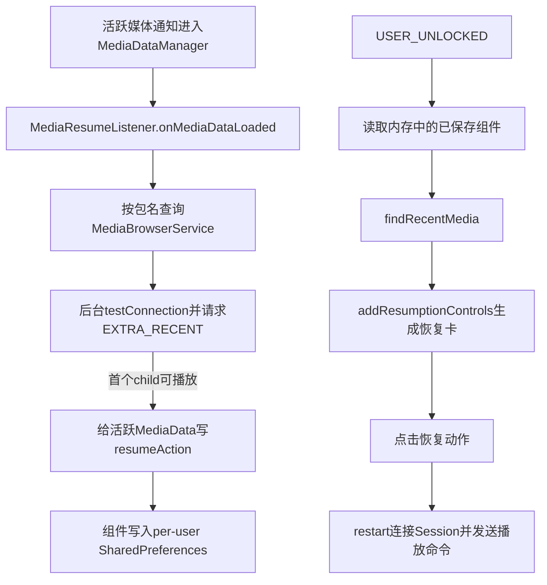
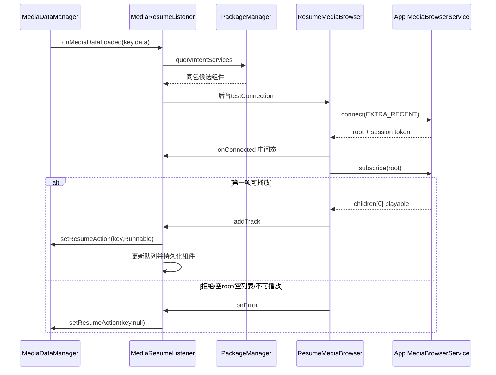
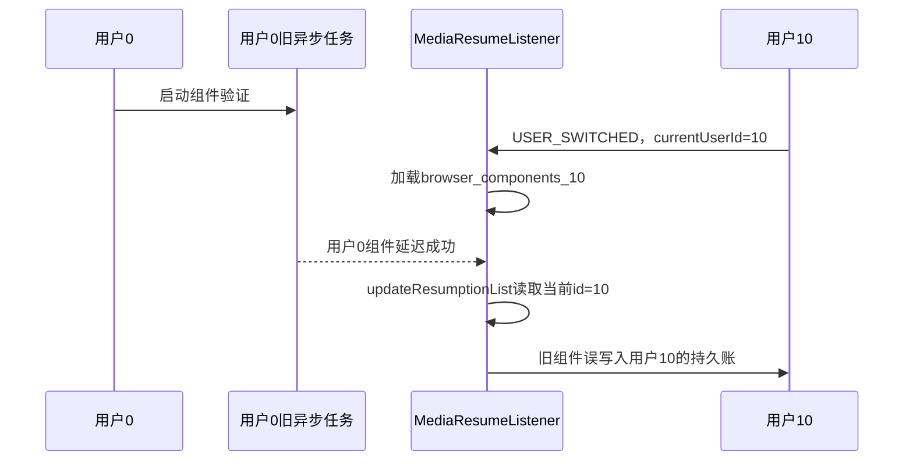

# 第 444 章 Android SystemUI MediaResumeListener：恢复播放、组件发现、持久化与用户切换

> 源码基线：Android 11 / API 30 / `android-11.0.0_r48`。本章只在 macOS 阅读源码，不编译。核心文件：`MediaResumeListener.kt`、`ResumeMediaBrowser.java`、`ResumeMediaBrowserFactory.java`、`MediaDataManager.kt`、`MediaResumeListenerTest.kt` 与 `ResumeMediaBrowserTest.kt`。

## 1. 本章要解决什么问题

通知消失后，SystemUI为什么还能显示一张“不活跃但可继续播放”的媒体卡？它怎样发现应用的`MediaBrowserService`、验证最近媒体、保存最多五个组件，并在用户解锁后重建卡片？点击恢复按钮时，又是谁真正发出播放命令？

## 2. 先给出一句话答案

`MediaResumeListener`监听活跃`MediaData`，找到同包的浏览服务后用`ResumeMediaBrowser`连接并订阅最近媒体；验证成功便把恢复动作写回活跃卡并持久化服务组件。用户解锁时再遍历已存组件，把最近媒体转换成新的resumption卡。

## 3. 不要把“恢复卡”理解成通知

恢复卡不依赖仍存在的`StatusBarNotification`。`MediaDataManager.addResumptionControls()`直接用包名作为Map key，后台加载标题、图标和颜色，最终生成`active=false`、`resumption=true`的媒体数据。

## 4. 三个参与者的职责

`MediaResumeListener`负责政策、发现和持久化；`ResumeMediaBrowser`负责连接一个具体服务、订阅root或重启播放；`MediaDataManager`负责媒体账本、卡片迁移和向下游分发。三者不能合并成“一个恢复播放器”。

## 5. 两条主链必须分开

第一条是“活跃通知出现后，检查它未来能否恢复”；第二条是“用户解锁后，从已保存组件重新生成恢复卡”。前者只给已有卡补`resumeAction`，后者才调用`addResumptionControls()`新建卡。

## 6. 总体数据流



## 7. 功能总开关从哪里来

字段初始化调用`Utils.useMediaResumption(context)`。在这个版本中它组合QS媒体播放器能力和`Settings.Secure.MEDIA_CONTROLS_RESUME`；后者默认值是1，因此不能只看Settings数据库是否显式存在该键。

## 8. 构造期与运行期的开关不是同一件事

构造函数的`init`只在当时开关为true时注册用户广播并加载保存列表；`setManager()`后来注册Tuner，仅更新boolean并通知Manager。若实例构造时关闭、运行中再开启，源码不会补注册Receiver，也不会补加载列表。

## 9. 为什么先构造后setManager

依赖注入先创建单例Listener，再由`MediaDataManager`调用`setManager(this)`完成反向接线。构造期只能加载Preferences，不能调用尚未初始化的`lateinit mediaDataManager`。

## 10. lateinit 的真实风险

若`USER_UNLOCKED`或浏览回调在`setManager()`前到达，`addResumptionControls()`会触发`UninitializedPropertyAccessException`。正常SystemUI装配顺序把窗口压得很小，但类本身没有状态门或安全默认值。

## 11. Listener 如何接入媒体管线

它实现`MediaDataManager.Listener`。正常装配由`MediaDataManager.init`先调用`addInternalListener(mediaResumeListener)`，再调用`mediaResumeListener.setManager(this)`建立反向写入口；公开的`addListener()`会把外部监听者挂到末端`MediaDataFilter`，不是本内部接线的替代品。

## 12. onMediaDataLoaded 的入口条件

只有`useMediaResumption=true`才工作。每次媒体数据加载先断开共享`mediaBrowser`，然后仅当`resumeAction==null && !hasCheckedForResume`时做组件发现。

## 13. hasCheckedForResume 为什么重要

媒体数据可能因元数据、播放状态、设备路由等多次更新。这个标志让失败也成为可缓存结论，避免每个更新都重新做PackageManager查询和跨进程浏览连接。

## 14. 谁把 hasCheckedForResume 设为 true

`MediaDataManager.setResumeAction(key, action)`同时写`resumeAction`并把`hasCheckedForResume=true`。传null不是“什么都没做”，而是明确记录“已检查但当前不可恢复”。

## 15. key 失效时会怎样

`setResumeAction()`用`mediaEntries.get(key)?.let`，若后台验证完成前通知已删除或key已迁移，结果静默丢弃。不过组件仍可能在成功回调中写入Preferences，因为更新列表不依赖该Map项仍存在。

## 16. 怎样发现候选服务

源码构造action为`MediaBrowserService.SERVICE_INTERFACE`的隐式Intent，调用`PackageManager.queryIntentServices(intent, 0)`，再按`serviceInfo.packageName == data.packageName`过滤。

## 17. 这不是启动任意 Service

查询结果只是声明能响应`android.media.browse.MediaBrowserService`的组件。随后必须由`MediaBrowser.connect()`完成协议握手，服务可以按调用包、UID或证书在`onGetRoot()`中拒绝SystemUI。

## 18. 为什么查询后还要 testConnection

Manifest声明只能证明“候选存在”，不能证明SystemUI有权限，也不能证明服务能给出最近且可播放的媒体项。`testConnection()`实际连接、取得root、订阅并检查第一个child。

## 19. 多个服务时怎样选择

过滤后直接取`inf[0]`。源码没有稳定排序、优先级解释或失败后尝试第二个服务；若同包声明多个浏览服务，PackageManager返回顺序就会影响恢复能力。

## 20. 查询发生在哪个线程

`onMediaDataLoaded()`通常由媒体管线在主线程回调，`queryIntentServices()`也就同步发生在主线程。真正的连接测试被投到`@Background Executor`，但PackageManager查询本身没有移出主线程。

## 21. 后台任务是否天然串行

仅看构造参数`Executor`不能推出串行；继续追Dagger可见r48的`@Background Executor`由同一个`@Background Looper`上的`ExecutorImpl`提供，所以正常产品绑定会串行执行验证任务。但主线程的unlock加载、媒体回调与该后台Looper仍会交错，共享browser问题并未因此消失。

## 22. 组件发现源码

```kotlin
val serviceIntent = Intent(MediaBrowserService.SERVICE_INTERFACE)
val resumeInfo = pm.queryIntentServices(serviceIntent, 0)
val inf = resumeInfo?.filter {
    it.serviceInfo.packageName == data.packageName
}
if (inf != null && inf.size > 0) {
    backgroundExecutor.execute {
        tryUpdateResumptionList(key, inf[0].componentInfo.componentName)
    }
} else {
    mediaDataManager.setResumeAction(key, null)
}
```

## 23. 没有服务时为什么立刻回写 null

这会把`hasCheckedForResume`置true，终止后续重复检查。若应用稍后动态安装/启用浏览服务，当前活跃MediaData不会因为包状态变化自动把标志清零，只能等新数据对象或新通知周期。

## 24. 有服务时为什么不能先写已检查

连接测试可能成功也可能失败。成功要写Runnable，失败写null；在结果前若先标记，会丢失真实动作。代价是测试未完成期间的媒体更新可能重复排队。

## 25. 重复排队窗口

`hasCheckedForResume`直到异步回调才更新。同一个key若连续收到多个`onMediaDataLoaded`，每次都可能发现同一组件并提交测试任务，源码没有in-flight集合或generation去重。

## 26. ResumeMediaBrowserFactory 有什么价值

它只保存Context和`MediaBrowserFactory`，每次创建新的`ResumeMediaBrowser`。把构造过程包成可注入工厂，使Listener单测能捕获Callback并返回mock browser。

## 27. ResumeMediaBrowser 内部状态

每个实例保存一个目标`ComponentName`、一个上层Callback和一个可变`MediaBrowser mMediaBrowser`。`disconnect()`断开并把字段置null，因此ConnectionCallback读到的是“当前字段”，不一定是最初触发该回调的对象。

## 28. 三个公开动作

`testConnection()`和`findRecentMedia()`在r48实现完全走同一个连接与订阅回调；语义差别主要在调用者如何处理`addTrack`。`restart()`则用另一套ConnectionCallback，取得Session Token后直接发播放命令。

## 29. EXTRA_RECENT 的含义

三个动作都在root hints写`MediaBrowserService.BrowserRoot.EXTRA_RECENT=true`。这是向应用表达“请提供最近媒体”的提示，不是框架强制排序；服务端仍决定root和children。

## 30. 连接成功还不等于可恢复

通用ConnectionCallback先确认browser connected和root非空，调用上层`onConnected()`后订阅root。真正验证要等children回来，且列表非空、第一项带`FLAG_PLAYABLE`。

## 31. 为什么只看第一个 child

源码注释约定：收到EXTRA_RECENT时，应用应把可恢复项放在第一个。SystemUI不向后扫描；第二项可播放也不能挽救第一项不可播放的响应。

## 32. playable 与 browsable 的区别

`FLAG_PLAYABLE`表示该item可直接播放；只带`FLAG_BROWSABLE`通常是目录，需要继续展开。恢复卡需要一个具体最近曲目，所以目录项会走`onError()`。

## 33. 订阅回调怎样收尾

无children、首项不可播放和订阅错误都会通知`onError()`；成功调用`addTrack()`。无论成功失败，`onChildrenLoaded()`末尾都`disconnect()`，所以find/test正常完成后不会长期保持连接。

## 34. onConnected 是中间态

通用路径在subscribe之前调用上层`onConnected()`。因此它只证明连接与root成立，不能用来把组件加入恢复列表；Listener的测试Callback也只打日志，必须等`addTrack()`。

## 35. testConnection 的成功判据

Listener只在`addTrack()`中设置动作并持久化。连接成功但children为空最终会先打印Connected，再打印Cannot resume并写null；两条日志不矛盾，分别描述协议不同阶段。

## 36. 验证链时序



## 37. tryUpdateResumptionList 怎样建立浏览器

它先断开全局`mediaBrowser`，创建新实例赋给同一字段，再调用`testConnection()`。Callback闭包捕获`key`和`componentName`，因此结果知道要更新哪张活跃卡。

## 38. 成功回调做哪三件事

给key写入`getResumeAction(componentName)`；调用`updateResumptionList(componentName)`更新最近顺序和Preferences；最后断开并清空共享browser字段。

## 39. 失败回调做哪三件事

给key写null并标记已检查；断开共享browser；把共享字段置null。它不从已保存列表删除该组件，因为候选可能只是暂时失败，也可能来自尚未持久化的新发现。

## 40. Callback 参数为什么很关键

`addTrack`明明传入完成工作的`browser`，测试Callback却不用它，改操作外层共享`mediaBrowser`。如果另一任务已替换字段，旧回调会断开新任务、清掉新引用，而旧实例由自己在children回调末尾断开。

## 41. 这是怎样的竞态

任务A连接较慢，任务B后来覆盖字段；A回调成功后执行`mediaBrowser?.disconnect()`，实际断开B。随后A置null，B回调又可能写自己的结果。线程安全队列无法修复这个跨对象身份错误。

## 42. onMediaDataLoaded 的无差别 disconnect

任何媒体条目更新都会先断开共享browser，不判断browser属于哪个key或组件。一个无关播放器的状态刷新，可以中断正在验证或正在恢复播放的另一个应用。

## 43. 为什么单测没发现共享字段竞态

单测工厂始终返回同一个mock `resumeBrowser`，回调也同步触发，覆盖、延迟和乱序都没有出现。它验证单条happy path，不证明并发任务之间的身份安全。

## 44. updateResumptionList 的数据结构

内存使用`ConcurrentLinkedQueue<ComponentName>`。它保证单个`add/remove/iterate`不会破坏容器内部结构，但“remove旧项→add末尾→检查size→删除头→遍历保存”整个事务并不原子。

## 45. 注释说 front，代码却做 tail

源码注释写“Insert at front of queue”，实际`resumeComponents.add(componentName)`追加到队尾。随后超限调用无参`remove()`删除队头，所以真实顺序是“最旧在头、最新在尾”，行为仍符合淘汰最旧。

```kotlin
resumeComponents.remove(componentName)
// 注释称“front”，ConcurrentLinkedQueue.add实际追加到尾部
resumeComponents.add(componentName)
if (resumeComponents.size > ResumeMediaBrowser.MAX_RESUMPTION_CONTROLS) {
    resumeComponents.remove() // 删除头部最旧项
}
```

## 46. 最多保存多少个

`ResumeMediaBrowser.MAX_RESUMPTION_CONTROLS`为5。加入第六个后删除队头一个；这限制的是浏览服务组件数，不保证UI最终一定显示五张，因为连接、最近媒体和Manager去重都可能减少。

## 47. 同一组件再次成功会怎样

先`remove(componentName)`再add到尾部，相当于刷新最近使用顺序。`ComponentName.equals()`按包名和类名比较，所以同一包的两个不同Service仍是两个候选。

## 48. 并发更新可能超限吗

可能。两个线程分别完成remove/add后都观察size并remove，可能多删；也可能一个线程在另一个遍历保存期间改变队列，使持久串只是弱一致快照。Concurrent不代表复合逻辑线性化。

## 49. 持久化格式

每项使用`ComponentName.flattenToString()`，项后追加冒号，例如`pkg/A:pkg2/B:`。Preferences文件是`media_control_prefs`，key为`browser_components_<userId>`。

## 50. 为什么末尾保留冒号

写入实现简单；读取时按冒号split后`dropLastWhile { it.isEmpty() }`去掉末尾空项。冒号不是转义协议，但合法Android包名和Java类名不包含冒号，当前数据域可用。

## 51. SharedPreferences apply 的语义

`apply()`先更新进程内存快照，再异步落盘，没有成功回调。SystemUI若紧接着异常退出，最新顺序可能未持久化；恢复能力不属于必须同步fsync的关键事务。

## 52. 为什么按 userId 分 key

不同Android用户可能安装、启用或使用不同媒体应用。组件列表必须按当前用户隔离，否则用户A最近播放的包会在用户B解锁时被尝试恢复。

## 53. Context 是否切换到目标用户

没有。类只改变`currentUserId`数字，PackageManager、SharedPreferences、PendingIntent和MediaBrowser仍来自注入的原Context。r48代码依赖SystemUI运行环境和跨用户能力，不能把“key按用户”误讲成所有API都显式使用目标UserContext。

## 54. 用户切换 Receiver 做什么

收到`ACTION_USER_SWITCHED`后从`Intent.EXTRA_USER_HANDLE`读取新id，清空内存队列并加载新key的组件。它不立即调用`loadMediaResumptionControls()`。

## 55. 用户解锁 Receiver 做什么

收到任意`ACTION_USER_UNLOCKED`就遍历当前内存队列，调用`findRecentMedia()`。它没有检查广播携带的user是否等于`currentUserId`。

## 56. 为什么通常要等解锁

应用的CE数据和媒体服务内部历史可能在用户解锁前不可用。先切换组件账，再等解锁请求最近媒体，符合FBE生命周期的总体意图。

## 57. 已解锁用户的边界

源码把“切换”和“加载控制”分成两个广播。如果切到一个已经解锁、且系统不再发送对应unlock事件的用户，这段类不会在switch分支立即恢复卡；是否补发取决于系统广播时序，类自身没有查询`isUserUnlocked()`兜底。

## 58. 后台用户解锁的边界

Receiver注册到`UserHandle.ALL`，unlock分支又不核对id，所以后台用户解锁也可能让当前用户的五个组件重新查询一次，造成重复卡加载或额外连接。

## 59. 用户切换时没有做什么清理

它没有断开已有browser、取消Executor任务、给任务绑定user generation，也没有清理Manager中的旧用户卡；后者通常由媒体过滤管线的用户切换逻辑负责，但Listener自身的异步结果仍可越界。

## 60. 跨用户异步竞态

旧用户任务启动后切换用户，成功回调读取的是当时最新`currentUserId`。于是旧组件可能被保存到新用户Preferences，并以新userId调用`addResumptionControls()`。

## 61. currentUserId 为什么应被快照

任务创建时应捕获`val userIdAtStart=currentUserId`，回调时校验generation/当前用户，再把快照传给Manager和Preferences。r48未做这一步，因此字段“线程可见”也不能保证语义正确。



## 62. loadSavedComponents 怎样解析

它清队列、取字符串、按冒号切项，再对每项`split("/")`并直接取索引0和1，最后`ComponentName(packageName,className)`入队。

## 63. 为什么不用 unflattenFromString

Android已有`ComponentName.unflattenFromString()`可集中处理格式和相对类名；r48手工split没有校验。正常数据由自身`flattenToString()`产生时可逆，但Preferences损坏或人工改写会抛下标异常。

## 64. 保存列表会主动校验安装状态吗

不会。卸载应用的组件仍可留在Preferences，直到被新成功组件挤出；解锁时连接失败只被browser callback忽略，不会从队列删除。

## 65. loadMediaResumptionControls 怎样并发

它对每个组件创建局部`val browser`并立即`findRecentMedia()`，没有赋给共享`mediaBrowser`。最多五次连接可同时在途，也无法由Listener统一取消。

## 66. 为什么这里用局部 browser 反而更安全

公共`mediaBrowserCallback.addTrack()`使用回调参数取得token和appIntent，所以能对应正确实例。与验证Callback不同，它没有用共享字段读取这两个关键结果。

## 67. 解锁加载失败怎样处理

公共Callback只覆写`addTrack()`，没有覆写`onError()`。失败只留下`ResumeMediaBrowser`自身日志并断开，不删除保存组件、不通知Manager，也不会影响其他组件继续加载。

## 68. addTrack 需要哪些数据

MediaDescription提供曲目描述；browser提供Session Token和应用启动PendingIntent；PackageManager提供应用label；组件包名成为Manager的packageName；`getResumeAction(component)`成为点击动作。

## 69. 应用名取不到怎样降级

先以packageName作为appName，再尝试`getApplicationInfo`和`getApplicationLabel`。只捕获`NameNotFoundException`，因此卸载竞态至少能降级显示包名。

## 70. getAppIntent 的潜在空值

`getLaunchIntentForPackage()`可对无Launcher入口的包返回null，但Java方法把它直接传给`PendingIntent.getActivity()`。源码没有显式判空；这不是“所有MediaBrowserService都一定能打开应用”的保证。

## 71. getToken 的潜在平台类型

Java `getToken()`在browser为空或断开时返回null，Kotlin调用点却传给声明为非空的`addResumptionControls`参数。正常`addTrack()`发生在断开前，但异步交错仍让这个平台类型边界值得警惕。

## 72. addTrack 后何时断开

公共Callback先同步读取token/appIntent并调用Manager；返回到`SubscriptionCallback.onChildrenLoaded()`后，ResumeMediaBrowser才执行`disconnect()`。因此正常单线程回调内token仍有效。

## 73. MediaDataManager 如何避免同包重复恢复卡

恢复卡以packageName为key。如果Map没有该包才先放`LOADING`；随后无论是否已有，都排后台加载。多个组件属于同包时可能竞争更新同一key，而不是并排显示多张同包卡。

## 74. 恢复卡怎样遇到新通知

`findExistingEntry(notificationKey, packageName)`会找到包名恢复项，移除旧key并迁移到真实通知key。于是“历史卡”转回活跃通知卡，而非长期保留两个副本。

## 75. 活跃通知消失时怎样变恢复卡

`onNotificationRemoved()`发现removed数据有`resumeAction`且开关开启，就复制为token=null、active=false、resumption=true、可清除，并用packageName作为key重新发布。

## 76. resumeAction 是桥梁

前面的连接测试并不立即新建卡，而是给活跃数据埋入Runnable。通知移除时Manager看到这个Runnable，才知道可以把原卡迁移成可恢复状态。

## 77. 恢复卡按钮动作怎样包装

Manager会用`getResumeMediaAction(resumeAction)`生成UI的播放Action。按钮最终调用Listener创建的Runnable，Runnable再连接相应`MediaBrowserService`。

## 78. getResumeAction 的第一步

点击后先断开共享browser，再创建目标组件的新`ResumeMediaBrowser`赋给字段，安装成功/失败Callback，最后调用`restart()`。

## 79. restart 实际做了什么

它自己连接、取得Session Token、创建`MediaController`，依次调用`prepare()`和`play()`，然后才调用上层`mCallback.onConnected()`。因此播放不是由Listener单独完成。

## 80. Listener 成功回调又做了什么

它再次从共享browser取token，再创建第二个`MediaController`，又调用一次`prepare()`和`play()`。这意味着r48点击一次恢复按钮，成功路径会发两组命令。

```kotlin
override fun onConnected() {
    if (mediaBrowser?.token == null) return
    val controller = MediaController(context, mediaBrowser!!.token)
    controller.transportControls.prepare()
    controller.transportControls.play()
}
```

## 81. 双重命令的源码证据

```java
// ResumeMediaBrowser.restart() 内部
MediaController controller = createMediaController(token);
controller.getTransportControls().prepare();
controller.getTransportControls().play();
mCallback.onConnected();
```

而`MediaResumeListener.getResumeAction()`的`onConnected()`又创建控制器并重复`prepare()/play()`。这是源码实际行为，不应按注释美化成一次。

## 82. 双重 play 一定播放两首吗

不一定。MediaSession命令通常是幂等式状态请求，连续play可能都落在同一会话；但应用自定义实现可能重复触发准备、网络请求或埋点。框架没有完成ACK来证明第二组无害。

## 83. ResumeMediaBrowserTest 验证了哪一半

`testRestart_connects`只断言Browser内部mock TransportControls收到一次prepare/play，并断言上层onConnected。它没有把真实Listener Callback一起接入，因此不会看到组合后的第二次命令。

## 84. ListenerTest 为什么也没看到双发

Listener单测把`ResumeMediaBrowser`整体mock掉，当前文件也没有点击捕获到的Runnable并让真实restart完成的测试。两套单元测试各自覆盖局部，组合行为落在缝隙里。

## 85. restart 的空指针顺序问题

成功回调第一行日志调用`mMediaBrowser.isConnected()`，之后才判断`mMediaBrowser == null`。若异步回调前该实例被disconnect置null，会先在日志表达式处NPE，后面的null检查来不及保护。

## 86. Listener 回调读错实例的可能

成功回调检查`mediaBrowser?.token`，它是Listener当前共享字段，不是触发Callback的browser参数，因为restart Callback没有参数。若字段已被另一任务替换，可能用另一个组件的token再次播放。

## 87. 成功后是否主动 disconnect

Browser的restart文档要求调用者完成后disconnect，但Listener成功Callback没有断开或置null。通常新活跃MediaData到达会在`onMediaDataLoaded()`开头断开；若应用未发布更新，连接可能继续保持。

## 88. 失败后怎样收尾

Listener失败Callback断开共享字段并置null；但Browser内部连接失败Callback本身没有调用`disconnect()`。当前Listener弥补了它，独立调用者若只记录error则可能保留字段直到下次动作。

## 89. restart 的 root hints 是否被使用

它仍发送EXTRA_RECENT，但成功后不读取root、不订阅MediaItem；直接控制服务暴露的Session。最终恢复哪一首由应用的Session和prepare/play语义决定，不由之前保存的MediaDescription指定mediaId。

## 90. 恢复卡描述与实际播放可能不同

解锁时findRecentMedia展示服务当时返回的第一首；用户点击时restart没有`playFromMediaId(desc.mediaId)`。若应用最近队列在两者之间变化，卡面曲目和实际恢复曲目可以不同。

## 91. appIntent 与播放动作是两条链

点击卡片主体通常使用appIntent打开应用；点击播放Action运行resumeAction连接Session。启动Activity失败不必然阻止恢复播放，反之浏览服务失败也不必然说明Launcher入口失败。

## 92. 开关关闭后 Manager 做什么

`setMediaResumptionEnabled(false)`遍历`mediaEntries`中`!active`的项，删除并通知下游。它清理的是不活跃媒体项，并不只按`resumption=true`过滤，因此政策范围比类名看起来更宽。

## 93. 开关关闭后 Listener 没做什么

它不注销Receiver、不取消任务、不清queue、不清Preferences，也不立即disconnect browser。已有异步成功回调仍可能更新保存列表；后续`onMediaDataLoaded`因boolean为false会停止新检查。

## 94. 运行中重新开启的恢复范围

若实例最初开启过，Receiver仍注册、保存队列仍在，重新开启后下一次unlock可加载；若构造时就是关闭，重新开启只改boolean和Manager，没有Receiver和已加载队列，行为不对称。

## 95. BroadcastReceiver 的生命周期

Listener是`@Singleton`且没有destroy/unregister路径，注册Receiver与SystemUI进程同寿命。单例场景可接受，但若测试或未来作用域改变，重复实例会产生重复注册。

## 96. Tuner 回调的生命周期

匿名Tunable也没有remove。它依赖Listener单例长期存活；同时匿名对象被Tuner持有，会反向保持Listener，不能把它当短生命周期组件复用。

## 97. MediaBrowser 回调在哪个线程

`MediaBrowser`在构造线程建立Handler语境。产品绑定中，验证browser由带Looper的SystemUI后台Executor线程创建，因此其回调回到该后台Looper；unlock路径在Receiver所在线程创建局部browser，通常落在主线程语境。不能笼统说本类所有browser回调都在主线程或都在后台。

## 98. r48 的线程设计为何难读

入口通常在主线程，候选测试及其browser回调位于后台Looper，unlock浏览及公共回调通常位于Receiver线程；共享字段跨这两套执行域无锁，队列只提供局部线程安全，Manager更新又可触发主线程管线。正确分析必须逐个标出线程、任务和对象身份。

## 99. 进程边界在哪里

PackageManager查询跨Binder到system_server；`MediaBrowser.connect/subscribe`最终绑定目标应用的MediaBrowserService；MediaController命令通过MediaSession Binder发到应用。Listener和Manager本身在SystemUI进程。

## 100. 用户边界在哪里

SharedPreferences key显式含userId；广播覆盖ALL；服务查询与Browser连接却没有在调用点显式传UserHandle。因而“每用户列表”与“每用户执行上下文”是两层不同保证。

## 101. 测试覆盖：无服务

`testOnLoad_checksForResume_noService`验证Manager收到`setResumeAction(KEY,null)`。它证明失败结论被记账，但未断言`hasCheckedForResume`，因为Manager是mock；真实字段副作用由Manager实现承担。

## 102. 测试覆盖：有服务

测试模拟query返回组件，让mock browser在`testConnection()`同步触发`addTrack`，断言设置非空动作、不调用`addResumptionControls`、最终disconnect。它清楚区分“验证活跃卡”和“创建恢复卡”。

## 103. 测试覆盖：用户解锁

Preferences预置三个组件；unlock后同一个mock browser的`findRecentMedia()`被调用三次，并三次回调addTrack，所以Manager三次收到addResumptionControls。它验证数量，不验证真实组件各自独立。

## 104. 测试没有覆盖：用户切换

现有ListenerTest没有断言新user key加载、旧任务取消、已解锁用户立即恢复、后台用户unlock过滤或缺失EXTRA_USER_HANDLE。多用户边界主要靠源码推演而非本文件测试担保。

## 105. 测试没有覆盖：Preferences损坏

没有空项中段、缺少斜杠、多余斜杠、超五项或卸载组件用例。解析器的下标异常和缺少自愈因此不会被现有单测暴露。

## 106. 测试没有覆盖：多服务选择

只构造一个ResolveInfo。没有测试第一个失败、第二个成功，也没有断言稳定选择策略；因此不能从测试推导“SystemUI会尝试应用所有MediaBrowserService”。

## 107. 测试没有覆盖：异步乱序

FakeExecutor只在指定时刻`runAllReady()`，mock callback同步完成。没有A慢B快、切用户后旧回调、媒体更新中断browser、共享字段被覆盖等交错测试。

## 108. 复读后最容易误解的一点

`findRecentMedia()`和`testConnection()`代码相同，不代表业务作用相同。区别在Callback：验证回调只补动作并存组件；解锁公共回调拿完整描述并创建恢复卡。

## 109. 复读后第二个易错点

`onConnected()`不是最终成功。对test/find而言，必须再等可播放child；对restart而言，Browser内部在调用onConnected前已经发过播放命令。相同方法名在两套Callback中处于不同阶段。

## 110. 复读后第三个易错点

队列注释“front”与代码不一致。不要机械抄注释；从`add尾部 + 超限remove头部 + 迭代保存`可证明真实LRU方向是旧到新。

## 111. 复读后第四个易错点

“使用ConcurrentLinkedQueue”不等于整个类线程安全。browser身份、currentUserId、复合队列事务和异步任务归属都没有由该容器保护。

## 112. macOS只读练习一：画出活跃卡变恢复卡

依次定位`onMediaDataLoaded → tryUpdateResumptionList → setResumeAction → onNotificationRemoved`，在纸上写出key从通知key迁移到packageName的时刻，并标注哪一步没有新建卡。

## 113. macOS只读练习二：证明 unlock 才创建历史卡

定位`userChangeReceiver → loadMediaResumptionControls → mediaBrowserCallback.addTrack → addResumptionControls`，对比验证Callback，列出两者各自调用Manager的API和输入字段。

## 114. macOS只读练习三：验证双重播放命令

分别在`ResumeMediaBrowser.restart()`和`MediaResumeListener.getResumeAction().onConnected()`圈出`prepare/play`，再阅读两份单测，解释为何局部测试都通过却没有检查组合后总调用次数。

## 115. macOS只读练习四：构造跨用户竞态

假设用户0的testConnection尚未回调，此时切到用户10，然后旧任务成功。逐行写出`setResumeAction`使用的key、`updateResumptionList`写入的Preferences key，以及解锁addTrack传入的userId可能分别属于谁。

## 116. 如果要改进：每任务持有自己的 browser

Callback应操作参数或闭包捕获的`val browser`，并用identity/generation判断它仍有效；不要让所有包、所有用途共享一个可变字段。取消时也应按任务或组件明确定位。

## 117. 如果要改进：固定用户快照

创建验证/加载任务时捕获userId和generation；回调先校验当前generation，过期就只断开不写Manager/Preferences。User switch应取消或失效化旧任务，并按已解锁状态决定是否立即加载。

## 118. 如果要改进：明确一次播放职责

要么让`ResumeMediaBrowser.restart()`负责prepare/play，上层只记录成功并断开；要么Browser只返回token，由Listener发命令。不能两层都执行。还应在finally/终态统一disconnect。

## 119. 如果要改进：健壮持久化与服务选择

使用`ComponentName.unflattenFromString()`并跳过/修复坏项；更新列表放入同一串行执行域；查询多个服务时定义稳定优先级并逐个回退，同时把失败原因区分为拒绝、空root、无媒体和不可播放。

## 120. 本章结论

Media恢复不是“保存一首歌再播放”，而是保存能回答最近媒体的服务组件：活跃期验证并植入Runnable，解锁期重新询问描述，点击期控制服务Session。r48主链可用，但共享browser、用户代际、非原子LRU、脆弱解析与双重prepare/play都说明：读源码必须把对象身份、线程、用户和回调阶段逐项核准。

### 本章源码追踪清单

- `frameworks/base/packages/SystemUI/src/com/android/systemui/media/MediaResumeListener.kt`
- `frameworks/base/packages/SystemUI/src/com/android/systemui/media/ResumeMediaBrowser.java`
- `frameworks/base/packages/SystemUI/src/com/android/systemui/media/ResumeMediaBrowserFactory.java`
- `frameworks/base/packages/SystemUI/src/com/android/systemui/media/MediaDataManager.kt`
- `frameworks/base/packages/SystemUI/tests/src/com/android/systemui/media/MediaResumeListenerTest.kt`
- `frameworks/base/packages/SystemUI/tests/src/com/android/systemui/media/ResumeMediaBrowserTest.kt`

### 本章自测答案提示

1. 活跃验证成功只写`resumeAction`；通知移除后Manager才把条目迁移成packageName恢复卡。
2. 通用browser的`onConnected`只是连接/root阶段，`addTrack`才证明首项可播放。
3. SharedPreferences只把key按用户分开，异步任务并没有自动绑定用户代际。
4. restart和Listener成功回调各发一组prepare/play，这是组合源码而非单个测试能直接展示的事实。
