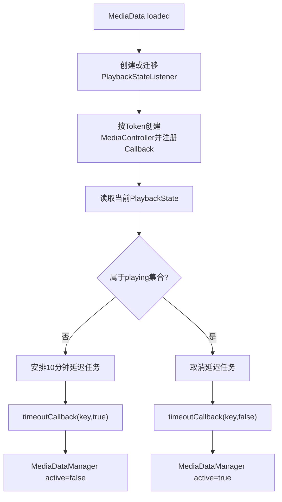
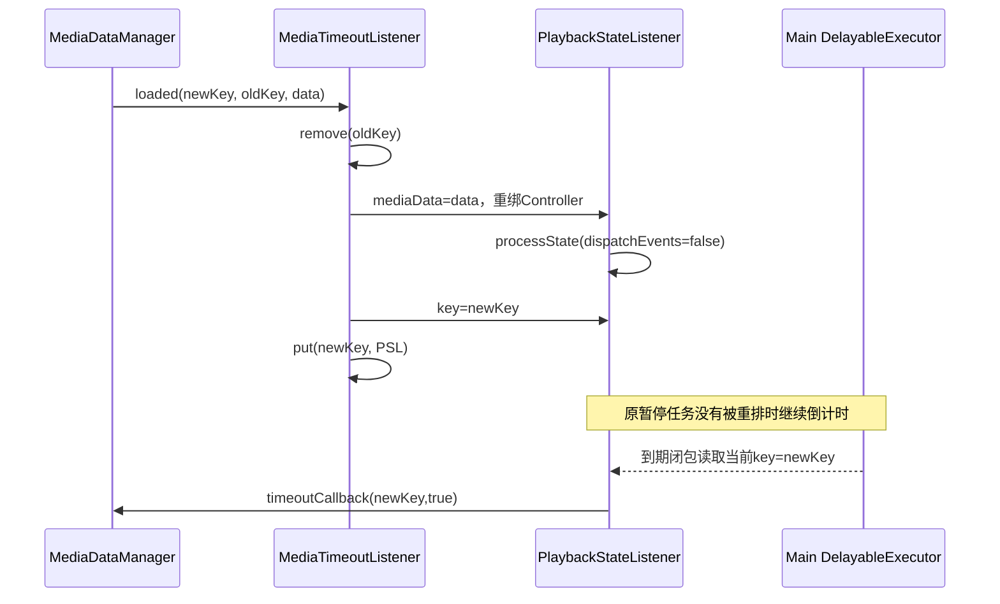
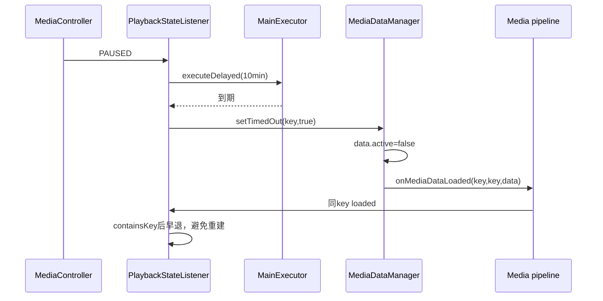

# 第 445 章 Android SystemUI MediaTimeoutListener：播放状态超时、Key迁移与延迟任务

> 源码基线：Android 11 / API 30 / `android-11.0.0_r48`。本章只在 macOS 阅读源码，不编译。核心文件：`MediaTimeoutListener.kt`、`MediaDataManager.kt`、`NotificationMediaManager.java`、`ConcurrencyModule.java` 与 `MediaTimeoutListenerTest.kt`。

## 1. 本章要解决什么问题

媒体暂停后为什么不是立即从QQS和锁屏消失，而是十分钟后才变成不活跃？播放恢复时如何取消计时？通知key与包名恢复key互相迁移时，旧计时器怎样继续生效？

## 2. 一句话主线

`MediaTimeoutListener`为每个媒体key维护一个`PlaybackStateListener`，把播放状态压成playing/non-playing二值；non-playing首次出现便安排十分钟任务，playing会取消任务并通知Manager重新激活，超时则通知Manager把`active`改为false。

## 3. 超时不是删除

回调最终进入`MediaDataManager.setTimedOut(key,true)`，只写`MediaData.active=false`并重新分发同一条数据。active-only的QQS和锁屏不再显示它，完整QS的all-media Host仍可能保留。

## 4. 谁负责真正移除

通知移除、用户清除、包卸载、媒体轮播清理等路径负责Map删除。TimeoutListener只管理活跃性，不调用`removeEntry()`，也不停止应用播放。

## 5. 对象关系

Manager拥有全局MediaData账；TimeoutListener拥有`key → PlaybackStateListener`观察账；每个观察者可持有一个MediaController和一个延迟任务取消Runnable。

## 6. 总体流程



## 7. 超时时长定义

默认值是`TimeUnit.MINUTES.toMillis(10)`，通过系统属性`debug.sysui.media_timeout`覆盖，单位毫秒。它是文件顶层val，在类加载时读取一次，不会运行中持续观察属性。

## 8. debug 属性的定位

属性名表明它主要用于调试和测试设备，不是普通用户设置。源码没有对零、负数或极大值校验，Executor如何处理异常延迟取决于其实现。

## 9. 何时开始十分钟

从SystemUI第一次观察到non-playing状态时起算，不从PlaybackState携带的position更新时间或应用真实暂停时刻起算。SystemUI重启后会重新给一段完整十分钟。

## 10. Listener 怎样接入管线

`MediaDataManager.init`把它作为内部listener加入，然后把`timeoutCallback`设置为调用`setTimedOut(token,timedOut)`的lambda。这里参数名写token，实际传递的是MediaData Map key。

## 11. timeoutCallback 为什么是 lateinit

它需要反向调用尚在构造的Manager，依赖注入后再接线。正常Manager初始化期间没有媒体事件；若独立构造Listener却忘记赋值，首次状态恢复或超时会抛未初始化异常。

## 12. Map 为什么按 key 而非 Session Token

媒体管线以通知key或packageName恢复key定位条目；同一Session可能经历key迁移。Listener跟随UI数据身份，而不是另建Token主键。

## 13. 新 key 的入口

若`mediaListeners`不含key，且无法从oldKey迁移，就构造`PlaybackStateListener(key,data)`并放入Map。构造过程会立即绑定Controller并处理当前状态。

## 14. 相同 key 的入口

方法第一句发现Map已有key就直接return，不比较oldKey、Token或MediaData内容。这避免元数据更新反复注册，但也让同key换Session Token时保留旧Controller。

## 15. 同 key 早退的源码

```kotlin
override fun onMediaDataLoaded(key: String, oldKey: String?, data: MediaData) {
    if (mediaListeners.containsKey(key)) {
        return
    }
    // 只有新key才继续迁移或创建监听器
}
```

## 16. 为什么正常情况下问题不明显

同一通知的标题、Artwork和动作频繁变化，而MediaSession Token通常稳定。早退省去无意义重绑；但源码没有把“同key必同token”写成可验证不变量。

## 17. 同 key 换 token 的后果

旧MediaController继续接收旧Session回调，新Session状态无人监听，旧暂停任务也继续。媒体卡内容已是新数据，活跃性却可能由旧会话决定。

## 18. oldKey 表示什么

当条目从packageName恢复key迁到通知key，或其他管线发生重命名，Manager以`onMediaDataLoaded(newKey,oldKey,data)`告知Listener复用观察者。

## 19. 何时认为正在迁移

条件是`oldKey != null && key != oldKey`。oldKey等于key只是普通更新，已在最前面的containsKey分支返回。

## 20. 迁移首先做什么

从Map移除oldKey对应listener；若存在，保存其旧playing值，替换mediaData、修改listener.key，再以newKey放回Map。

## 21. 为什么复用而不是销毁重建

复用能保留已消耗的暂停时长，避免通知key变化就重新获得十分钟。同时data setter会按新Token重新绑定Controller，兼顾会话变化。

## 22. 迁移时序



## 23. mediaData setter 的顺序

先从旧Controller注销Callback，再保存新data；有Token则创建新Controller，否则置null；随后注册新Callback，并现场读取`playbackState`处理。

## 24. 为什么现场读取 playbackState

注册Callback通常只保证未来变化，不保证自动回放当前状态。若不主动读取，已经暂停且长期不变化的Session永远不会启动超时。

## 25. data setter 为什么 dispatchEvents=false

Listener正在处理Manager的loaded回调，若立刻反向调用Manager，可能重入同一媒体分发。它先维护取消任务和内部状态，必要的激活通知稍后投Executor。

## 26. null Token 怎样处理

恢复卡可能没有Session Token，因此不建Controller，`processState(null,false)`把它视为non-playing并安排十分钟任务。

## 27. null Token 计时是否有UI效果

恢复卡本来通常`active=false`。十分钟后Manager发现`active == !timedOut`已经成立便早退，所以任务多半不改变UI，只留下状态账和一次无效回调。

## 28. 状态如何压成二值

`state != null && NotificationMediaManager.isPlayingState(state.state)`。null一定是false；非null则由共享静态集合判断。

## 29. 哪些状态明确算暂停

r48集合包含`STATE_NONE`、`STOPPED`、`PAUSED`、`ERROR`和`CONNECTING`。这些状态都会进入十分钟倒计时。

## 30. 哪些状态算 playing

实现采用补集，因此PLAYING、BUFFERING、FAST_FORWARDING、REWINDING、SKIPPING等均为true。未来新增而未加入暂停集合的状态也会默认算playing。

## 31. CONNECTING 为什么算 non-playing

该版本政策倾向于让长期连接中的会话最终不活跃；它不是“正在出声”。但短暂CONNECTING与PAUSED之间变化仍属于同一个false，不会重置计时。

## 32. isPlayingState 源码

```java
private static final HashSet<Integer> PAUSED_MEDIA_STATES = new HashSet<>();
static {
    PAUSED_MEDIA_STATES.add(PlaybackState.STATE_NONE);
    PAUSED_MEDIA_STATES.add(PlaybackState.STATE_STOPPED);
    PAUSED_MEDIA_STATES.add(PlaybackState.STATE_PAUSED);
    PAUSED_MEDIA_STATES.add(PlaybackState.STATE_ERROR);
    PAUSED_MEDIA_STATES.add(PlaybackState.STATE_CONNECTING);
}
public static boolean isPlayingState(int state) {
    return !PAUSED_MEDIA_STATES.contains(state);
}
```

## 33. 相同二值为什么直接返回

若`playing == isPlaying`且不是初始null，`processState`直接结束。PAUSED→STOPPED→ERROR不会延长计时，BUFFERING→PLAYING也不会重复发激活通知。

## 34. 这丢掉了什么信息

Listener不保留具体PlaybackState、position或状态发生时间，只关心二值边沿。诊断时不能从它回答“为何暂停”或“暂停了多久”。

## 35. 初始 playing 为什么可空

null表示从未判定。即便首个状态算false也必须进入调度，不能和默认false混淆；处理一次后字段永远是非空Boolean。

## 36. non-playing 分支先做什么

先记录playing=false；若`cancellation`已存在便直接return，否则清理旧任务引用并安排新的延迟任务。

## 37. cancellation 已存在意味着什么

一个倒计时已经在运行。正常相同二值早退已拦截大部分情况；迁移setter等路径仍显式检查，防止重复安排。

## 38. expireMediaTimeout 的语义

它调用取消Runnable并把字段置null。名字像“让媒体过期”，实际是“取消已安排的媒体超时”，阅读日志和方法名时容易反向理解。

## 39. 延迟任务到期做什么

先把cancellation置null，再把`timedOut=true`，最后调用`timeoutCallback(key,true)`。先清引用允许未来播放后再次暂停时安排新任务。

## 40. 延迟闭包读取哪个 key

它读取`PlaybackStateListener`的可变属性`key`，不是安排时的局部参数。因此迁移后旧任务自然作用到newKey，这正是“不延长暂停时长”的关键。

## 41. non-playing 调度源码

```kotlin
cancellation = mainExecutor.executeDelayed({
    cancellation = null
    timedOut = true
    timeoutCallback(key, timedOut)
}, PAUSED_MEDIA_TIMEOUT)
```

## 42. playing 分支做什么

取消倒计时、将timedOut=false；若此次来自真实PlaybackState回调，即`dispatchEvents=true`，立刻调用`timeoutCallback(key,false)`恢复active。

## 43. 为什么恢复播放立即激活

用户正在播放时QQS和锁屏应立即出现控制卡，不需要等待另一个MediaData刷新。Controller状态回调就是最及时的事实源。

## 44. 重复 playing 会重复通知吗

不会。二值相同在开头返回；只有false→true边沿触发取消和回调。不同playing类状态之间切换不会反复刷新MediaData。

## 45. true→false 会立即通知Manager吗

不会。卡继续active，十分钟到期才发送true。这样短暂停播仍保留快速控制入口。

## 46. false→true 会立即通知Manager吗

来自Controller回调时会发送false；来自迁移期间现场读取时先抑制，外层迁移逻辑再异步补发，避免重入。

## 47. 迁移为什么保存 wasPlaying

setter会改变listener.playing。外层比较旧值和新值，只有状态发生变化才考虑补一条延迟激活事件。

## 48. 迁移从 false 变 true

setter取消旧暂停任务、置timedOut=false但不dispatch；外层发现变化，向mainExecutor排一个立即任务，稍后确认newKey当前仍playing才回调false。

## 49. 迁移从 true 变 false

setter安排十分钟任务。外层也排立即任务，但Runnable检查`mediaListeners[key]?.playing == true`失败，因此不会错误激活。

## 50. 为什么变化两种方向都先排任务

源码只判断`wasPlaying != reusedListener.playing`，没有只筛false→true；安全性依赖Runnable内部的playing==true二次门。可读性不如显式方向判断。

## 51. 延迟激活的身份检查

Runnable按newKey查询Map并看当前playing，能防止条目已删除或又暂停；但若旧listener被移除后同key放入另一个正在playing的新listener，它仍可能为新对象发送一次false。

## 52. 迁移仍暂停为什么不延长

旧listener的playing已是false，setter读取新Controller仍false时`processState`在相同二值处早退，不取消原任务。测试专门断言pending任务数量保持1。

## 53. 原任务如何跟随新 key

闭包捕获PlaybackStateListener实例，执行时动态读其`key`属性；外层在到期前把属性改成newKey。它没有捕获oldKey字符串。

## 54. 迁移找不到 old listener

源码打印warning后继续创建newKey的新listener。它会按当前状态从零开始计时，无法继承旧暂停剩余时间。

## 55. newKey 已存在的冲突

最前面的`containsKey(key)`会直接返回，迁移逻辑根本不执行，oldKey listener仍留在Map。若上下游提供这种冲突输入，可能同时保留旧新两个观察者。

## 56. onMediaDataRemoved 做什么

从Map移除key并调用listener.destroy()。重复remove因Map已空而无操作，单测验证不会第二次注销Callback。

## 57. destroy 的两步清理

从MediaController注销Callback，再运行cancellation取消延迟任务。它没有显式把controller和cancellation字段置null，但对象已从Map移除，正常随后可回收。

## 58. 取消任务是否删除队列节点

`DelayableExecutor.executeDelayed`返回取消Runnable；调用它应使任务不再执行。FakeExecutor测试以pending数量从1变0验证契约。

## 59. 已经开始执行时能否取消

取消与到期都在产品的主Looper Executor上串行，主执行域内不会同时执行；跨线程调用onMediaDataRemoved时仍要依赖调用管线遵守主线程约束，类本身没有同步锁。

## 60. 为什么注入 @Main Executor

延迟任务最终会反向修改Manager媒体账并触发UI管线，放在主执行域减少Map和View状态并发。Controller callback是否主线程还需看MediaController注册所在线程的Handler语境。

## 61. MediaController Callback 线程

`registerCallback(this)`未显式传Handler，框架使用调用线程Looper相关默认行为。Listener通常在主媒体管线创建/迁移观察者，因此产品路径意图仍是主线程状态机。

## 62. Map 不是并发容器

`mutableMapOf()`没有线程安全保证。正确性依赖MediaData内部listener分发、Controller回调和Executor任务落在一致主执行域，而不是Map自行加锁。

## 63. timeout 到 Manager 的闭环



## 64. setTimedOut 的早退条件

若`data.active == !timedOut`，Manager不再分发。重复true不会重复画UI，null-token恢复卡超时也通常在这里被吸收。

```kotlin
internal fun setTimedOut(token: String, timedOut: Boolean) {
    mediaEntries[token]?.let {
        if (it.active == !timedOut) return
        it.active = !timedOut
        onMediaDataLoaded(token, token, it)
    }
}
```

## 65. setTimedOut 为什么原地改 data

它直接写`it.active = !timedOut`，再调用`onMediaDataLoaded(token,token,it)`。MediaData是含可变字段的数据对象，下游收到的可能是同一引用而非全新copy。

## 66. 这次 loaded 会不会重置十分钟

不会。TimeoutListener作为内部listener再次收到同key，containsKey后立即返回，所以不会重绑或安排新任务。

## 67. 超时后仍暂停会怎样

cancellation已null、timedOut=true、playing=false。若应用再次发PAUSED/STOPPED，二值相同直接返回，不再安排第二个十分钟任务。

## 68. 超时后恢复播放会怎样

false→true会清理空任务引用、置timedOut=false并回调Manager；Manager把active改true并重新分发卡片。

## 69. 恢复后再次暂停会怎样

true→false不被相同二值拦截，安排新的完整十分钟。一个会话可经历多轮活跃—超时—恢复。

## 70. timedOut 与 MediaData.active 是否总同步

不一定。内部timedOut初值false，但新恢复卡active可能已false；`isTimedOut(packageKey)`仍返回false。这个方法报告观察者是否执行过超时，不是Manager active的严格反值。

## 71. isTimedOut 的用途

r48生产源码没有其他调用者，只有单测检查初值。它更像调试/未来接口，不能作为当前UI可见性的权威来源。

## 72. 暂停状态变化为什么不延时刷新文本

TimeoutListener只控制active；播放按钮、SeekBar和文本仍由MediaData加载及MediaController观察链更新。十分钟政策不冻结卡内状态。

## 73. active 与 isPlaying 的区别

暂停后的十分钟内isPlaying=false但active=true；恢复卡可active=false且没有Token；BUFFERING按本政策isPlaying=true。两者不是同义字段。

## 74. active 与 resumption 的区别

active描述是否进入active-only Host，resumption描述卡是否为历史恢复形态。活跃通知超时可以active=false但resumption=false，不能只用resumption筛超时卡。

## 75. 与 MediaResumeListener 如何协作

ResumeListener为活跃卡补resumeAction；TimeoutListener独立观察播放状态。暂停十分钟可先把卡从QQS隐藏，通知真正移除时Manager仍可依据resumeAction迁成恢复卡。

## 76. 与 MediaCarousel swipe 如何协作

轮播侧滑可直接调用`setTimedOut(key,true)`，无需等待十分钟。TimeoutListener内部timedOut字段不会因此自动变true，因为同key重分发被早退。

## 77. 手动 timedOut 后仍 playing 的边界

若Carousel把正在播放项设inactive，Controller不发生false→true边沿就不会发送恢复回调；内部playing一直true。后续相同PLAYING回调被早退，卡可能保持inactive直到状态先变非播放再播放或别的管线更新。

## 78. 这是两个状态源不完全同步

Manager允许外部直接改active，TimeoutListener只在播放二值边沿更新自己的timedOut。源码没有统一状态机或强制回读Manager active。

## 79. 取消时使用 run 是否直观

返回值类型是Runnable，却表示cancel handle，调用`run()`不是执行超时正文。若把它误读成“立即运行任务”，会完全颠倒destroy和恢复播放的行为。

## 80. 日志中的 mediaKey 参数

`expireMediaTimeout(mediaKey,reason)`只用参数打印日志；真正取消的是当前字段cancellation。迁移前后日志key与任务最终读取key可以不同。

## 81. DEBUG 为什么恒为 true

本文件`DEBUG=true`，verbose/debug日志在相应log level开启时可观察状态与取消原因。它不是Build.IS_DEBUGGABLE门，生产构建代码路径仍包含这些日志调用。

## 82. 超时没有 WakeLock

DelayableExecutor基于主Looper延迟消息，不承诺设备深睡时精确十分钟唤醒。它是UI过期政策，不是AlarmManager精确计时；设备醒来处理消息时才收敛。

## 83. 时间基准是什么

取决于Executor/Handler的延迟消息时钟，通常遵循uptime语义，深睡时间不按墙钟等比例执行。源码只传delay，不保存绝对deadline。

## 84. 进程重启会怎样

mediaListeners和延迟任务都在内存中丢失。新MediaData加载后重新读取Session当前状态并从零安排；暂停剩余时长不持久化。

## 85. 用户切换会怎样

MediaDataFilter会移除旧用户投影并重加新用户，但Manager内部全量数据和内部Listener时序需分开看。TimeoutListener没有显式userId索引，只随key loaded/removed事件维护。

## 86. 相同 key 跨用户的风险

通知key通常全局包含身份但源码不验证；恢复key只是packageName，不同用户可相同。若内部管线未按顺序remove再add，相同key早退可能复用错误用户/Token的观察者。

## 87. MediaControllerFactory 的作用

把`MediaController(context,token)`封装为可注入工厂，单测用同一个mock Controller捕获register/unregister和现场playbackState。

## 88. 注册 Callback 后的竞态

代码先register再读取`playbackState`。若状态在两者之间变化，可能先收到callback再读现场状态；二值去重通常吸收重复，但乱序快照仍可能短暂覆盖更新，取决于框架回调顺序。

## 89. 注销旧 Callback 是否阻止在途消息

不一定取消已经排入Looper的回调。旧Controller迟到状态仍调用同一个listener实例，而实例可能已迁移到新key和新Controller，从而用旧会话状态影响新条目。

## 90. 为什么需要 controller generation

更稳健实现会为每次绑定递增generation，Callback携带/校验来源；MediaController.Callback当前没有来源参数，复用同一个Callback对象让旧消息难以识别。

## 91. 单测初始 paused 怎样工作

mock Controller默认或设置为PAUSED，onMediaDataLoaded后注册Callback并现场处理，FakeExecutor出现一个pending任务，timeoutCallback尚未调用。

## 92. 单测如何验证 remove 清理

先加载paused数据确认一个pending，再remove；断言pending变0，并验证unregisterCallback。它验证取消契约，没有模拟任务已到执行边界的竞争。

## 93. 单测如何验证状态切换

捕获MediaController.Callback，手动发送PAUSED令pending=1，再发送PLAYING令pending=0。它没有额外断言false回调次数与Manager active结果。

## 94. 单测如何验证 non-playing 不重置

PAUSED后再发STOPPED，pending仍是1。因为两者都压成false，processState在开头返回。

## 95. 单测如何触发超时

FakeSystemClock跳到下一任务时间，再`runAllReady()`，断言`timeoutCallback(KEY,true)`。真实十分钟无需等待。

## 96. 迁移测试验证了什么

旧paused listener迁到newKey、现场状态改playing，验证旧Controller注销、新Controller注册且Executor排入一个激活回调任务。

## 97. noTimeoutExtension 测试验证了什么

迁移前后都paused，pending仍为1。它用任务数量间接证明旧倒计时保留，但没有推进时钟断言最终callback使用NEWKEY。

## 98. 测试没有覆盖同 key 换 Token

现有“same key ignores”只断言不重复register，并未传不同Token来说明后果。这既是优化行为的测试，也是陈旧Controller风险未被审查的地方。

## 99. 测试没有覆盖 old callback 迟到

没有在迁移注销后手动调用旧在途回调，也没有两个真实Controller。单mock Controller会隐藏来源身份问题。

## 100. 测试没有覆盖超时后同态

没有验证timedOut=true后再收到PAUSED不会重排、再收到PLAYING会激活，以及外部setTimedOut导致内部状态不同步。

## 101. 测试没有覆盖 null Token 恢复卡

虽然源码注释明确允许null Token，测试MediaData总带Session Token。无Controller仍安排无效十分钟任务的行为没有被锁定。

## 102. 测试没有覆盖属性覆盖

PAUSED_MEDIA_TIMEOUT在类加载期读取系统属性，测试用FakeExecutor只跳到next，不断言默认确为十分钟，也不验证零/负值。

## 103. 复读最容易误解之一

“timeout”不是删除和stop，只是切active。应用音频若仍播放、状态却错误报告PAUSED，SystemUI十分钟后只是隐藏active-only控制卡。

## 104. 复读最容易误解之二

十分钟不是每次PAUSED事件重新起算。所有non-playing状态被压成false，重复与PAUSED→STOPPED都不会续期。

## 105. 复读最容易误解之三

key迁移不是销毁旧任务。任务闭包读取可变key，所以保留剩余时间并在到期时命中新key。

## 106. 复读最容易误解之四

相同key的loaded完全不更新listener.mediaData。不能因为data setter写得完整，就假设每次loaded都会重绑Token；setter只在构造和迁移中执行。

## 107. 复读最容易误解之五

`cancellation.run()`执行的是取消句柄，不是超时正文。DelayableExecutor契约决定了这种看似反直觉的命名。

## 108. 可改进：比较 Token

同key loaded时若Token身份变化，应重绑Controller并用generation隔离旧回调；仅元数据变化时才安全早退。还要定义是否保留原暂停deadline。

## 109. 可改进：统一 deadline

显式保存nonPlayingSince/deadline可让迁移、进程恢复和诊断更清楚；状态仍false时按剩余时间调度，而不是靠可变闭包和现有cancellation隐式表达。

## 110. 可改进：统一 active 状态源

外部swipe、TimeoutListener和Manager都能改active。可引入原因化状态，例如`PLAYBACK_TIMEOUT`、`USER_DISMISS`，避免内部timedOut与MediaData.active脱节。

## 111. 可改进：增加组合测试

应覆盖同key换Token、迁移后旧Controller迟到、timeout闭包命中新key、null Token、外部setTimedOut后PLAYING同态，以及用户切换同包恢复key。

## 112. macOS只读练习一：追十分钟闭环

从`processState(PAUSED)`追到`executeDelayed`、`timeoutCallback`、`MediaDataManager.setTimedOut`和再次`onMediaDataLoaded`，说明为何不会递归创建第二个任务。

## 113. macOS只读练习二：证明迁移不续期

圈出`reusedListener.mediaData=data`、`reusedListener.key=key`和闭包中的动态`key`读取，结合`migratesKeys_noTimeoutExtension`测试解释剩余时间怎样带到newKey。

## 114. macOS只读练习三：构造同 key 换 Token

假设KEY先绑定Token A，再以同KEY加载Token B。逐行说明containsKey早退后哪个Controller仍注册、哪个Session无人监听，以及A的PAUSED如何改变B卡片的active。

## 115. macOS只读练习四：区分四个布尔量

为“活跃播放、暂停5分钟、暂停11分钟、历史恢复卡”填写`playing`、`timedOut`、`MediaData.active`、`resumption`，注意null-token恢复卡的timedOut初值并不等于!active。

## 116. 阅读时的进程边界

TimeoutListener与Manager在SystemUI进程；MediaController通过MediaSession Binder观察/控制应用进程会话。延迟任务只在SystemUI主Looper，不跨进程计时。

## 117. 阅读时的线程边界

Manager内部分发与mainExecutor任务意图在主线程；MediaController默认Callback Handler也依赖注册线程Looper。源码无锁MutableMap要求调用方维持这一约束。

## 118. 阅读时的身份边界

UI key、packageName恢复key、MediaSession Token和userId是四种身份。本类Map只用key、Controller只用Token、对userId不建索引，迁移正确性依赖上游同时提供oldKey和新data。

## 119. 本章诊断口诀

先问“当前key是谁”，再问“listener绑哪个Token”，再看“playing二值是否发生边沿”，最后看“是否已有cancellation及闭包执行时读哪个key”。只看卡片是否可见不足以定位。

## 120. 本章结论

MediaTimeoutListener是一个小型边沿状态机：首次non-playing开始十分钟，持续non-playing不续期，playing取消并激活，key迁移复用listener和剩余时长。其简洁建立在key稳定、主线程串行和旧Controller回调及时失效的假设上；同key换Token、在途旧回调及外部active修改是r48最值得警惕的边界。

### 本章源码追踪清单

- `frameworks/base/packages/SystemUI/src/com/android/systemui/media/MediaTimeoutListener.kt`
- `frameworks/base/packages/SystemUI/src/com/android/systemui/media/MediaDataManager.kt`
- `frameworks/base/packages/SystemUI/src/com/android/systemui/statusbar/NotificationMediaManager.java`
- `frameworks/base/packages/SystemUI/src/com/android/systemui/util/concurrency/ConcurrencyModule.java`
- `frameworks/base/packages/SystemUI/tests/src/com/android/systemui/media/MediaTimeoutListenerTest.kt`

### 本章自测答案提示

1. 超时只把active改false，不删除条目、不停止Session。
2. PAUSED到STOPPED仍是false，所以原任务继续且不延长。
3. 迁移更新同一listener的key，旧延迟闭包到期时读取新key。
4. 同key直接早退意味着Token变化不会重绑，这是优化也是风险。
