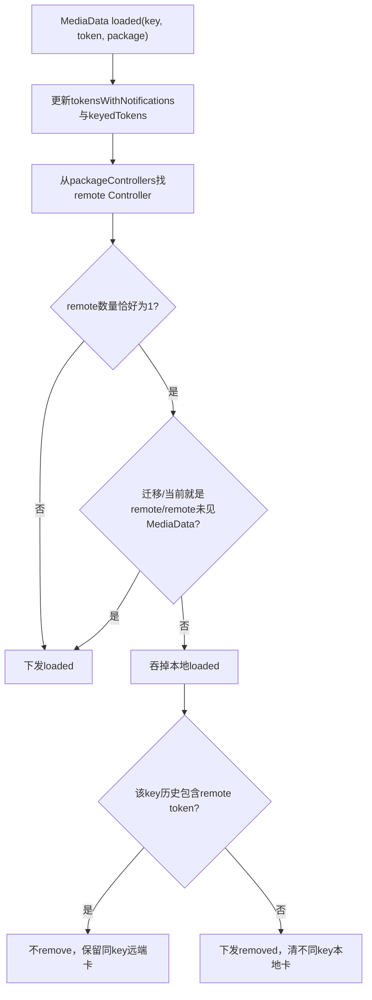
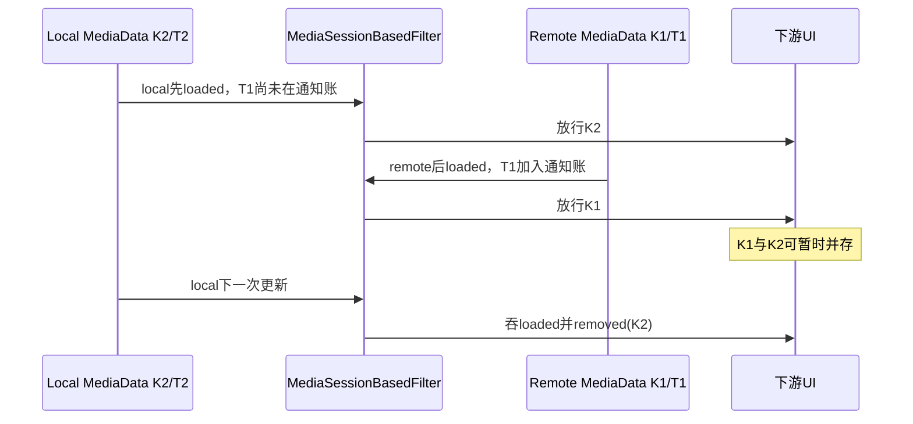
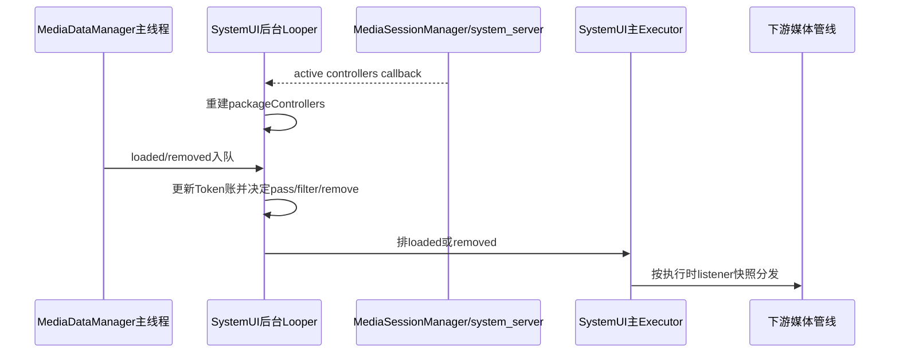

# 第 446 章 Android SystemUI MediaSessionBasedFilter：远端/本地会话去重、Token账与移除语义

> 源码基线：Android 11 / API 30 / `android-11.0.0_r48`。本章只在 macOS 阅读源码，不编译。核心文件：`MediaSessionBasedFilter.kt`、`MediaDataManager.kt`、`MediaDataFilter.kt`、`MediaSessionBasedFilterTest.kt`、`MediaSessionManager.java` 与 `NotificationListenerWithPlugins.java`。

## 1. 本章要解决什么问题

同一个音乐应用投屏时，为什么SystemUI不同时显示“手机本地Session卡”和“远端投屏Session卡”？过滤器怎样确认远端Session确实有媒体数据、同key与不同key为何采取不同移除策略，以及Token历史会留下哪些边界？

## 2. 一句话结论

过滤器把MediaSessionManager的活跃Controller快照与MediaData通知流合并：同包恰好一个remote Controller且其Token曾随MediaData出现时，本地Token的loaded被吞掉；若本地与远端使用不同key，还向下游发送removed清掉旧本地卡。

## 3. 它在管线中的位置

MediaDataManager先通知TimeoutListener、ResumeListener和本Filter；本Filter把通过的事件送给MediaDeviceManager与CombineLatest，最后到MediaDataFilter和UI。被过滤的loaded不会进入后续设备合流。

## 4. 为什么不能只看 MediaData.isLocalSession

单张MediaData只能告诉当前Token是本地还是远端，不能知道同包是否同时存在另一个更权威远端Session。过滤决策需要包级活跃Controller集合。

## 5. 为什么也不能只看活跃Session

应用可能保留remote Session却没有对应媒体通知/卡。若remote没有MediaData，贸然压掉local会让UI两边都没有控制项，所以还要维护“哪些Token曾进入媒体流”。

## 6. 三本账

`packageControllers`是包名到当前活跃Controller列表；`keyedTokens`是每个媒体key历史见过的Token集合；`tokensWithNotifications`记录被MediaData loaded观察到、且尚未被后续ActiveSessions快照淘汰的Token。刚加入的Token不要求已被上一份快照证明active。

## 7. 总体判定图



## 8. 初始化做什么

构造后向`@Background Executor`排任务：以`NotificationListenerWithPlugins`组件身份注册ActiveSessions监听，再同步获取当前active sessions并建立初始账。

## 9. 为什么需要通知监听组件身份

查询全部活跃MediaSession受权限约束。SystemUI借已授权NotificationListener组件调用MediaSessionManager，而不是普通应用上下文随意枚举会话。

## 10. 初始化为什么放后台

注册和`getActiveSessions()`可能跨Binder到system_server，避免阻塞SystemUI主线程。产品`@Background Executor`绑定单一后台Looper，后续loaded/removed任务可保持顺序。

## 11. 注册与初始查询的竞态

源码先add listener再get snapshot，避免“先查询、后注册”之间漏变化。注册发生在带Looper的同一后台任务，MediaSessionManager把回调post回该Looper，因此当前任务里的查询先应用、排队回调后应用；变化期间可能短暂使用查询快照，但正常顺序会由后到的回调收敛。

## 12. 没有 destroy

过滤器没有调用`removeOnActiveSessionsChangedListener`的生命周期出口。它随SystemUI媒体管线长期存活；若未来改成短作用域或重复构造，会累积监听。

## 13. ActiveSessions 回调做什么

`onActiveSessionsChanged(controllers)`直接调用`handleControllersChanged()`，不再次post。线程取决于MediaSessionManager注册时使用的Handler语境，产品意图是后台Looper。

## 14. packageControllers 如何重建

每次回调先clear，再按`controller.packageName`分组追加Controller。它不复用旧列表、不比较差分，当前快照完全替代上一版。

## 15. 为什么使用 LinkedHashMap

保留Controller遍历时的包顺序，便于可预测调试；过滤只按包名get，并不依赖Map顺序决定优先级。

## 16. Controller 列表是否去重

使用MutableList，源码不按Token去重。若系统快照意外重复同一remote Controller，remote数量会变2，从而保守地关闭过滤。

## 17. playbackInfo 为 null 怎么办

筛选条件使用安全调用`it.playbackInfo?.playbackType`，null不算remote。连接尚未准备好或Controller信息缺失时，local loaded会正常下发。

## 18. remote 的定义

只看`MediaController.PlaybackInfo.PLAYBACK_TYPE_REMOTE`，通常表示音量控制/播放发生在远端设备。它是“正在casting”的启发式，不证明具体路由协议或屏幕投射。

## 19. 为什么限制恰好一个 remote

多个远端Session时无法判断哪一个应代表应用主卡。源码选择不删任何local，宁可重复也不冒险删错。

## 20. local 数量受限制吗

不受。一个remote配多个local时，每个local更新都可被过滤；注释说“potentially more local sessions”正对应这种情况。

## 21. 活跃会话快照源码

```kotlin
private fun handleControllersChanged(controllers: List<MediaController>) {
    packageControllers.clear()
    controllers.forEach { controller ->
        packageControllers.get(controller.packageName)?.add(controller) ?: run {
            packageControllers.put(controller.packageName, mutableListOf(controller))
        }
    }
    tokensWithNotifications.retainAll(controllers.map { it.sessionToken })
}
```

## 22. retainAll 为什么存在

Token只要不再属于active sessions，就从`tokensWithNotifications`移除，避免一个早已结束的远端通知永久压制未来local会话。

## 23. retainAll 没清什么

它不清`keyedTokens`。每个key见过的Token历史只在MediaData removed时整组删除，活跃Session变化不会收缩这个集合。

## 24. tokensWithNotifications 名称准确吗

不完全准确。它记录所有MediaData loaded的非空Token，包括恢复卡等非通知形态；removed事件也不立即删除Token。更准确是“曾进入媒体流且未被active snapshot淘汰的Token”。

## 25. loaded 为什么先 post 后台

所有Token账和包Controller账应在同一后台串行域读写；随后只把最终UI事件post到前台。这样loaded与removed按进入后台队列的顺序处理。

## 26. info.token 非空时第一本账

先执行`tokensWithNotifications.add(token)`。过滤判断稍后进行，因此当前remote MediaData会立即使自身满足“remote有通知”的证据。

## 27. null Token 会怎样

不会加入任何Token账，但后续仍会做remote判断。恢复卡允许token为null，这条路径对安全性很重要。

## 28. key 迁移怎样识别

`oldKey != null && key != oldKey`。迁移时从`keyedTokens`移走oldKey集合并put到newKey，再把当前Token加入newKey集合。

## 29. 为什么迁移必须搬集合

同一UI条目可能先后关联local和remote Token。若只搬当前Token，会忘记“remote与local曾共享旧key”，之后过滤local时可能误发removed删掉仍显示的remote卡。

## 30. 搬迁覆盖的边界

若newKey已经有Token集合，`put(key,removed)`会覆盖它，而不是union。上游正常迁移应保证目标key无冲突；类本身没有防守。

## 31. oldKey 找不到怎么办

安全调用得到null便不搬，但`isMigration`仍为true；当前Token会写入newKey，且本次loaded必定放行。

## 32. 同一个 oldKey 连续迁移多Token

第一次搬整个旧集合；第二次remove oldKey为空，但会把当前Token加入已存在newKey集合。现有单测正用两个事件验证迁移后集合仍含两Token。

## 33. keyedTokens 的更新源码

```kotlin
if (isMigration) {
    keyedTokens.remove(oldKey)?.let { removed -> keyedTokens.put(key, removed) }
}
if (info.token != null) {
    keyedTokens.get(key)?.add(info.token) ?: run {
        keyedTokens.put(key, mutableSetOf(info.token))
    }
}
```

## 34. MutableSet 解决什么

同key同Token反复loaded不会无限重复。它按Token equality去重，但不会标记哪个Token是当前值、哪个只是历史。

## 35. MediaSession.Token equality 的意义

同一Session的Token跨Parcel/对象实例仍应可比较；过滤基于Token身份而非引用地址或包名，才能区分同包多个Session。

## 36. 如何找到候选 remote

先按`info.packageName`取Controller列表，再过滤playbackType remote。不同包的remote永远不会影响当前MediaData。

## 37. 远端数量为0

`remote=null`，无条件dispatch loaded。普通本地播放不受过滤器干扰。

## 38. 远端数量大于1

同样令`remote=null`并放行所有事件。这是明确的保守退化，而不是选择列表第一项。

## 39. 当前 info 就是 remote

若`remote.sessionToken == info.token`，loaded放行。远端卡必须先进入下游，才能替代local。

## 40. remote Token 没在通知账

loaded放行。仅存在remote Controller不足以删local，避免远端会话后台残留却没有可显示MediaData时造成空白。

## 41. key migration 为什么无条件放行

下游必须先完成oldKey→newKey账本迁移，否则直接吞掉事件会让旧key残留。放行可能短暂展示local，但保持身份连续性优先。

## 42. 完整放行条件

```kotlin
if (isMigration || remote == null || remote.sessionToken == info.token ||
        !tokensWithNotifications.contains(remote.sessionToken)) {
    dispatchMediaDataLoaded(key, oldKey, info)
} else {
    // 当前是local，且同包唯一remote确有MediaData
}
```

## 43. 真正被过滤的四个条件

不是迁移；同包remote恰好一个；当前Token不是remote；remote Token已在通知账。四者缺一都不会吞loaded。

## 44. 被过滤后为何还可能 remove

只吞loaded能阻止更新，但下游可能已经有一张local卡。若local和remote用不同key，就需要额外removed清掉local旧卡。

## 45. 同 key 为什么不能 remove

若该key历史Token集合含remote Token，下游同key位置可能正显示远端卡。发送removed会把正确远端卡一起删掉，所以只吞当前local更新。

## 46. 不同 key 如何判定

不是直接比较两个key，因为remote Controller不知道通知key；源码看`keyedTokens[currentKey]`是否含remote Token。未含即推断remote用另一个key。

## 47. remove 判定源码

```kotlin
if (!keyedTokens.get(key)!!.contains(remote.sessionToken)) {
    dispatchMediaDataRemoved(key)
}
```

## 48. 这里的双感叹号安全吗

仅当当前info.token非空时，前面保证为key创建集合。若info.token为null、同包唯一remote且remote Token已被记账，代码进入过滤分支后`keyedTokens[key]`可能不存在，`!!`直接NPE。

## 49. null Token 场景是否真实

MediaData恢复卡明确允许null Token；某些加载失败或历史控制也可能为空。只要同包remote活跃且其Token曾进入媒体流，就满足触发条件，不能把它视为类型系统不可能状态。

## 50. NPE 发生在哪个线程

loaded任务在SystemUI后台Executor执行；异常若未被Executor隔离，可能终止该消息处理并影响后台Looper稳定性。下游不会收到loaded或removed。

## 51. 最小修正思路

用`keyedTokens[key]?.contains(remoteToken) == true`判同key；不存在集合应按不同key处理removed，或先定义null-token恢复卡是否应完全绕过本过滤器。

## 52. remote 先到、local 后到、同 key

remote loaded放行并把Token写入该key集合；local loaded随后被过滤，但集合含remote，所以不remove，下游继续显示remote卡。

## 53. remote 先到、local 后到、不同 key

remote key1放行；local key2被过滤，key2集合只有local Token，不含remote，于是dispatch removed(key2)，清掉可能存在的local卡。

## 54. local 先到、remote 后到

local到达时remote Token尚未在通知账，所以local放行；remote随后也放行。若key不同，源码不会回头主动扫描并移除已经显示的local，需等local下一次update才过滤。

## 55. 顺序依赖的可见窗口

因此“只显示remote”不是瞬时强不变量。事件顺序和下一次local刷新决定重复卡持续多久；Filter没有维护当前下游卡集合来做retroactive cleanup。



## 56. remote 通知 removed 后怎样

`onMediaDataRemoved(remoteKey)`只删`keyedTokens[remoteKey]`，不会从`tokensWithNotifications`删remote Token。只要Session仍active，Token会继续被视作有通知。

## 57. 这会造成什么

远端卡已经删除但远端Session仍活跃时，后续local更新仍可能被过滤，违背“remote必须有通知/MediaData才过滤”的设计注释。

## 58. Token 何时最终从通知账消失

下一次ActiveSessions快照不再包含该Token时，`retainAll()`才删除。若remote Session长期active，陈旧标记长期存在。

## 59. 为什么 removed 不直接删 Token

一个Token可能关联多个key，直接删除可能误判另一个MediaData仍存在。源码没有Token引用计数或`key→当前通知Token`反向索引，于是选择延迟到Session结束清理。

## 60. keyedTokens 历史为什么会陈旧

同key每次loaded只add不替换。只要key不removed，早期remote Token永久留在集合，即便当前该key已完全换成local。

## 61. 陈旧历史的保护与副作用

保护作用是避免同key remote卡被local update误删；副作用是remote早已不在下游时也可能继续抑制remove，留下旧local/remote视觉状态。

## 62. onMediaDataRemoved 的顺序

它也post后台，先`keyedTokens.remove(key)`，再post前台removed。与此前loaded共用后台Executor，正常入队顺序保持。

## 63. removed 是否会被过滤

不会。无论active remote情况如何，上游明确remove都会向所有下游转发；过滤只针对loaded，并在特定local loaded时额外合成removed。

## 64. 合成 removed 会清内部 keyedTokens 吗

不会。过滤分支直接`dispatchMediaDataRemoved(key)`，没有执行`keyedTokens.remove(key)`。因此下游已删除，本Filter仍保留该key Token历史。

## 65. 合成 remove 后的下一次 local update

仍会把local Token加入同一集合并再次过滤；若集合不含remote，每次都可能重复dispatch removed，即使UI早已没有该key。

## 66. 为什么可能接受重复 remove

下游Map remove通常幂等，额外事件成本较小；源码用简化账本换取不误删同keyremote。但监听者若把removed当严格一次事件，需自行防重复。

## 67. dispatch 为何切回前台

后续MediaDeviceManager、CombineLatest和UI管线依赖主线程有序状态。后台只做Session/Token计算，最终Listener回调通过`@Main Executor`执行。

## 68. listeners 为什么在前台任务内复制

`listeners.toSet()`发生在Runnable执行时，避免迭代时直接修改集合。异常或并发修改不会破坏当前快照遍历。

## 69. 任务排队后新加 listener

因为快照不是dispatch调用时生成，而是前台真正执行时生成，新listener可能收到加入前已经在后台判定并排队的历史事件。

## 70. 任务排队后移除 listener

相反，前台执行前remove的listener不会收到该事件。这是一种执行时订阅语义，不是事件产生时订阅语义。

## 71. addListener 是否线程安全

只是`MutableSet.add/remove`，没有post或同步。正常装配在主线程初始化；若后台并发修改，集合本身不安全，toSet也不能解决数据竞争。

## 72. listener 是否去重

Set按equals去重，同一对象重复add不会重复回调。与前几章某些ArrayList监听器不同。

## 73. listener 异常会怎样

forEach没有try/catch，一个Listener抛异常会中断当前事件后续监听者，并可能让主Executor任务失败；过滤器不做隔离。

## 74. 整体线程流水线



## 75. Binder 边界在哪里

注册/查询ActiveSessions跨Binder到system_server的MediaSessionService；MediaController对象代表应用MediaSession Binder。过滤计算和媒体事件转发都在SystemUI进程内。

## 76. packageControllers 保存 Controller 有何成本

它只持当前快照直到下次变化；没有为Controller注册Playback回调。每次loaded现场读取playbackInfo，可能跨Binder或读取框架缓存。

## 77. playbackInfo 变化会触发 ActiveSessionsChanged 吗

不应假设一定触发。过滤器不单独监听AudioInfo变化；若Controller从local变remote但active sessions列表不变，下一次loaded现场读新playbackInfo仍可能识别，因为保存的是Controller对象。

## 78. packageName 会变化吗

Controller packageName视作Session稳定身份，快照重建时读取一次用于分组。若代理/路由应用以不同包持有remote Session，无法与原媒体包关联，不会过滤。

## 79. “casting”并非路由真相

PLAYBACK_TYPE_REMOTE也可代表其他远端音量提供者；反之某些投屏架构可能只暴露local类型。此Filter是UI去重启发式，不是MediaRouter权威路由模型。

## 80. MediaData token 为当前 Session 吗

来自通知MediaStyle或恢复浏览Session；应用可发布多个Token、重用通知key或更新Session。Filter因此维护集合而非单值，但也承担历史陈旧问题。

## 81. key migration 为什么短暂绕过政策

迁移事件即使是local也下发，使下游先正确rename；下一次普通loaded才过滤。UI可能短暂显示local卡，这是身份一致性与即时去重的权衡。

## 82. migration 本身会不会 remove old key

Filter只把`onMediaDataLoaded(new,old,info)`下发，下游按oldKey迁移；不另发removed(oldKey)。额外remove会造成重复或误删。

## 83. 两次迁移事件的边界

同一oldKey对应remote/local两个Token时，两个migration都无条件下发。后一个可能覆盖同newKey UI；之后普通update才依据remote规则收敛。

## 84. MediaData token null 的放行策略更合理吗

从语义看，null无法证明它是与remote竞争的local Session，保守做法应放行或按resumption字段单独处理。r48没有这道显式门，导致前述NPE与误过滤风险。

## 85. tokensWithNotifications 会把恢复卡算通知吗

会，只要恢复MediaData带非空Token。类名和注释说notification，但实际接口无法区分来源，除非读取`info.resumption`；r48未排除。

## 86. 恢复 remote 卡可能压制什么

一个active remote Session的resumption数据把Token加入账后，同包local活跃通知更新可能被过滤，即使remote只是历史卡而非真实当前通知。

## 87. active 字段参与判定吗

完全不参与。remote MediaData即使`active=false`，只要Token在账且Session active，仍可成为过滤依据。

## 88. resumption 字段参与判定吗

也不参与。这再次说明`tokensWithNotifications`并不等于严格通知集合。

## 89. userId 参与分组吗

没有。packageControllers只按packageName，Token/key账也不带userId。它依赖ActiveSessions查询与上游媒体管线已经处于正确用户范围。

## 90. 多用户同包风险

若不同用户数据同时进入内部管线且key/package重合，可能跨用户关联remote和local。外部MediaDataFilter在更后端才按当前profile筛选，无法保护本Filter前面的账。

## 91. SystemUI 管线为何仍可能看到后台用户

MediaDataManager内部保留/处理多用户数据，末端MediaDataFilter才投影当前profile。Filter位于末端之前，所以用户隔离不能只看最终UI。

## 92. 初始化前 loaded 会怎样

构造时注册任务先进入同一后台Executor，正常Manager随后提交loaded，故初始快照任务先执行。若自定义Executor不保序或直接并发，packageControllers可能暂空而放行本可过滤事件。

## 93. 测试如何模拟初始化

setUp先构造Filter，再`bgExecutor.runAllReady()`，捕获注册到MediaSessionManager的sessionListener，然后添加下游mediaListener。它明确控制两级Executor。

## 94. 无Session测试证明什么

loaded和removed都原样穿过后台、前台两队列。它验证基础转发，不验证事件进入两个Executor之间的listener变化。

## 95. matching Session 测试证明什么

当前MediaData Token就是唯一Controller Token时放行，无论Controller初始设为local还是remote。remote卡本身永不被自己的规则过滤。

## 96. remote 无通知测试证明什么

活跃列表含remote Controller，但remote Token尚未随MediaData loaded，local仍放行。它锁定了“双证据”门。

## 97. 不同 key 测试证明什么

先让remote key1进入，再让local key2进入；断言local loaded被吞且收到removed(key2)，验证防悬挂清理。

## 98. 同 key 测试少断言什么

测试验证local loaded被吞，但没有显式断言`onMediaDataRemoved(KEY)`从未调用。源码意图虽清楚，单测对“保留remote卡”终点证据不完整。

## 99. 多remote测试证明什么

两个remote时remote选择为null，remote与local loaded都放行。它验证不是“取第一个remote”。

## 100. migration 测试证明什么

即使remote证据齐全，local迁移loaded也必须下发；后续普通local loaded才过滤，remote普通loaded仍放行。

## 101. 测试未覆盖 null Token NPE

所有四个MediaData都复制真实Session Token。没有构造同包remote已记账后加载token=null的新key，因此`!!`崩溃路径未被发现。

## 102. 测试未覆盖 remote removed 陈旧账

没有先remove remote MediaData、保持remote Controller active、再发送local update。因而tokensWithNotifications不在remove时清理的语义未验证。

## 103. 测试未覆盖 local 先到顺序

多数过滤用例先发送remote，再发送local。没有断言local先显示、remote后来不同key时是否主动清local；源码不会主动清。

## 104. 测试未覆盖合成 remove 后内部账

没有在合成removed后再次发local update观察重复removed，也没检查keyedTokens仍保留。这是UI幂等但事件语义不严格的边界。

## 105. 测试未覆盖多用户

所有MediaData userId=0，所有Controller同包。无法证明包级账不会关联后台用户。

## 106. 复读最容易误解之一

Filter不是“只要有remote就删local”。remote必须唯一，而且remote Token先被MediaData流观察到；否则一律放行。

## 107. 复读最容易误解之二

`tokensWithNotifications`不是当前通知的精确集合。它不在MediaData removed时删Token，还会纳入resumption数据。

## 108. 复读最容易误解之三

同key与不同key的差别不是比较字符串得出，而是看当前key的历史Token集合是否含remote Token。

## 109. 复读最容易误解之四

过滤local loaded不一定产生removed。同key必须保留remote卡；不同key才补remove。

## 110. 复读最容易误解之五

后台Executor保证loaded/removed计算顺序，不代表ActiveSessions回调、listener集合修改和前台执行形成一个原子事务。

## 111. 更稳健的数据模型

可维护`key→当前Token`、`Token→MediaData引用计数/形态`和`(user,package)→active controllers`，而非无限历史Set；这样removed、resumption与多用户语义都可精确表达。

## 112. macOS只读练习一：推演同 key 去重

先送remote(T1,KEY)，再送local(T2,KEY)。逐行填写三个账，说明第二次为什么吞loaded却不发removed，并指出下游最终保留谁。

## 113. macOS只读练习二：推演不同 key 清理

先送remote(T1,K1)，再送local(T2,K2)。定位`keyedTokens[K2]`内容，证明为何dispatch removed(K2)，再分析第三次local更新是否会重复remove。

## 114. macOS只读练习三：构造 null Token 崩溃

令同包唯一remote T1 active且已随MediaData出现，再加载新key K2、token=null的数据。沿放行条件和`keyedTokens.get(K2)!!`写出NPE成立的每个前提。

## 115. macOS只读练习四：验证陈旧通知账

remote T1 loaded后调用`onMediaDataRemoved(K1)`，但不改变ActiveSessions；再送local T2。说明哪本账删了、哪本账未删，以及local为何仍可能被过滤。

## 116. 可改进：消除 null Token 崩溃

先给null Token定义政策并显式分支，禁止使用`!!`依赖隐式前置更新。最保守做法是无法确认Session身份时放行。

## 117. 可改进：精确维护通知引用

MediaData loaded/removed应更新key当前Token和Token引用计数；resumption可单独标志。只有仍有真实当前媒体项引用的remote Token才压制local。

## 118. 可改进：事件顺序收敛

remote首次出现时可扫描当前同包local keys并发定向remove，消除“local先到要等下次更新”的窗口；同时用generation避免旧ActiveSessions快照覆盖新快照。

## 119. 本章诊断口诀

先数同包remote，再查remote Token是否在通知账；然后判断是否迁移/是否同Token；若过滤，再查当前key历史是否含remote Token。最后核对事件在后台判定、前台执行的时间差。

## 120. 本章结论

MediaSessionBasedFilter用两个异步事实源解决投屏重复卡：活跃Session证明“有唯一remote”，MediaData Token账证明“remote有可显示对象”，key历史决定只吞更新还是补删本地卡。r48策略保守但账本并不精确；null Token NPE、removed不清通知Token、历史集合不收缩、local先到不追溯清理和用户维度缺失，是理解与改进时必须保留的真实边界。

### 本章源码追踪清单

- `frameworks/base/packages/SystemUI/src/com/android/systemui/media/MediaSessionBasedFilter.kt`
- `frameworks/base/packages/SystemUI/src/com/android/systemui/media/MediaDataManager.kt`
- `frameworks/base/packages/SystemUI/src/com/android/systemui/media/MediaDataFilter.kt`
- `frameworks/base/packages/SystemUI/tests/src/com/android/systemui/media/MediaSessionBasedFilterTest.kt`
- `frameworks/base/media/java/android/media/session/MediaSessionManager.java`

### 本章自测答案提示

1. remote唯一且其Token已见MediaData，才会过滤同包local。
2. 同key只吞local loaded；不同key还发removed清本地卡。
3. tokensWithNotifications不等于当前通知集合，removed不立即删除Token。
4. token=null时未必有keyedTokens集合，`!!`可崩溃。
