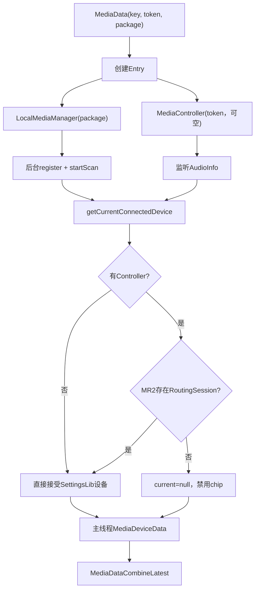
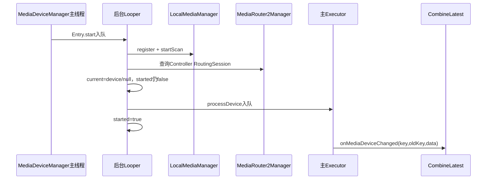
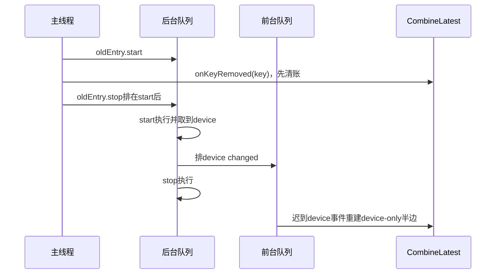

# 第 447 章 Android SystemUI MediaDeviceManager：路由设备可信门、Entry生命周期与迟到回调

> 源码基线：Android 11 / API 30 / `android-11.0.0_r48`。本章只在 macOS 阅读源码，不编译。核心文件：`MediaDeviceManager.kt`、`MediaDataCombineLatest.kt`、`LocalMediaManager.java`、`MediaDevice.java`、`MediaRouter2Manager.java` 与 `MediaDeviceManagerTest.kt`。

## 1. 本章要解决什么问题

媒体卡右上角为何能显示“此设备、蓝牙耳机或投屏设备”？MediaDeviceManager如何把MediaSession Token、SettingsLib扫描结果和MediaRouter2 RoutingSession合成可信设备；key迁移、Token替换和异步stop时又为何会出现迟到回调？

## 2. 一句话主线

Manager为每个媒体key创建Entry：后台启动LocalMediaManager扫描并监听MediaController，读取当前连接设备；有Controller时必须同时查到RoutingSession才信任设备，随后把图标/名称封成MediaDeviceData投主线程，与MediaData做CombineLatest。

## 3. 它不负责切换设备

本类只提供当前输出设备快照和key生命周期事件。用户点击chip打开MediaOutputDialog，真正select/transfer route由LocalMediaManager、InfoMediaManager和MediaRouter2Manager处理。

## 4. 它在媒体管线中的位置

MediaSessionBasedFilter把通过的MediaData同时送给MediaDeviceManager和MediaDataCombineLatest；本Manager再把Device事件送给CombineLatest。只有同key的MediaData和MediaDeviceData都存在，下游才收到完整卡。

## 5. 两级账本

Manager持有`entries: key→Entry`；每个Entry持有固定key/oldKey、可选MediaController、一个LocalMediaManager、started、缓存playbackType和current MediaDevice。

## 6. 总体数据流



## 7. 构造期做什么

只向DumpManager注册自身，不创建扫描器。扫描严格按媒体条目懒启动，避免没有媒体时持续发现设备。

## 8. listeners 的类型

MutableSet避免同一Listener重复注册。add/remove没有线程切换或锁，正常管线在主线程装配。

## 9. entries 的线程假设

onMediaDataLoaded/Removed由媒体主管线调用并直接读写普通MutableMap；dump可能来自其他线程。本类没有同步，依赖调用约束而非容器线程安全。

## 10. 新媒体到达的第一步

若`oldKey != null && oldKey != key`，先从entries删除oldKey并异步stop旧Entry。它不把旧Entry直接改key复用。

## 11. 为什么迁移也重建 Entry

Entry的key和oldKey是val，LocalMediaManager也按package创建。重建能让首次Device事件携带`(newKey,oldKey)`供CombineLatest迁移设备半边。

## 12. 迁移 stop 是否已完成

没有。`oldEntry.stop()`只向后台Executor排任务；当前主线程立刻继续查newKey、创建并start新Entry。

## 13. 同 key 已有 Entry 时怎样

若Entry存在且`entry.token == data.token`，什么都不做：不更新package、oldKey或扫描状态，也不重新发布DeviceData。

## 14. Token 变化怎样处理

停止旧Entry，按新Token创建Controller、按当前package创建LocalMediaManager，覆盖entries[key]并异步start新Entry。

## 15. null Token 的相等边界

已有null-token Entry再次收到null token会早退，即使packageName变化。恢复卡通常包稳定，但源码没有比较package或userId。

## 16. 加载入口源码

```kotlin
override fun onMediaDataLoaded(key: String, oldKey: String?, data: MediaData) {
    if (oldKey != null && oldKey != key) {
        entries.remove(oldKey)?.stop()
    }
    var entry = entries[key]
    if (entry == null || entry.token != data.token) {
        entry?.stop()
        val controller = data.token?.let { controllerFactory.create(it) }
        entry = Entry(key, oldKey, controller,
                localMediaManagerFactory.create(data.packageName))
        entries[key] = entry
        entry.start()
    }
}
```

## 17. Controller 为什么可空

历史恢复MediaData可能无Session Token。没有Controller就无法用MediaRouter2将设备和具体Session关联，但SettingsLib仍可能给出当前系统媒体设备。

## 18. LocalMediaManager 为什么按包创建

MediaRouter2的可选路由、RoutingSession和设备显示可能与客户端包有关。使用MediaData.packageName使扫描结果面向该媒体应用。

## 19. Entry.start 的执行域

start可从任意线程调用，但正文总是post到`@Background Executor`。产品绑定为单一后台Looper，start/stop及设备更新任务按队列串行。

## 20. start 的六步顺序

注册LocalMediaManager callback、startScan、现场读取Controller playbackType、注册MediaController callback、updateCurrent、最后`started=true`。

## 21. 为什么先注册再扫描

扫描可能立即产生列表变化；先注册可避免启动窗口漏回调。同步回调若发生，onDeviceListUpdate还会post到同一后台队列，等当前start任务结束后处理。

## 22. 为什么 started 最后才 true

初始`updateCurrent()`必须无论device是否等于字段默认null都发一帧。current setter以`!started`强制首次投递。

## 23. start 源码

```kotlin
fun start() = bgExecutor.execute {
    localMediaManager.registerCallback(this)
    localMediaManager.startScan()
    playbackType = controller?.playbackInfo?.playbackType ?: PLAYBACK_TYPE_UNKNOWN
    controller?.registerCallback(this)
    updateCurrent()
    started = true
}
```

## 24. start 异常的边界

步骤没有try/finally。若startScan或Binder查询抛运行时异常，可能已经注册部分callback却没把started置true，也没有自动rollback。

## 25. playbackType 缓存的用途

它只帮助`onAudioInfoChanged`判断类型是否变化；updateCurrent并不根据local/remote选择不同算法。

## 26. UNKNOWN 值

本类自定义0，Android的LOCAL为1、REMOTE为2。Controller为空或PlaybackInfo为空时缓存unknown。

## 27. MediaController Callback 在哪条线程

Entry在后台Looper注册Callback且未显式Handler，MediaController使用注册线程Handler，因此AudioInfo回调回到SystemUI后台Looper。

## 28. LocalMediaManager Callback 在哪条线程

来源线程不被本类信任；`onDeviceListUpdate`与`onSelectedDeviceStateChanged`都只向bgExecutor排`updateCurrent()`。

## 29. 为什么忽略 callback 参数 devices

设备列表变化只是“事实可能变了”的触发器；权威当前值重新调用`getCurrentConnectedDevice()`，不从传入列表自己推导。

## 30. 为什么忽略 selected state 参数

同理，传入device/state只表示选择过程变化。最终显示哪个设备仍由LocalMediaManager当前连接设备决定。

## 31. AudioInfo 未变时怎样

新playbackType等于缓存就return，不查询设备和RoutingSession。避免每个相同音频信息回调重复Binder/Device事件。

## 32. AudioInfo 变化时怎样

更新缓存并调用updateCurrent。类型本身不直接决定enabled，它只是促使重新核验路由Session。

## 33. updateCurrent 第一步

先读取`localMediaManager.getCurrentConnectedDevice()`，可能得到手机、本地蓝牙或远端route对应MediaDevice，也可能null。

## 34. 有 Controller 的可信门

调用`mr2manager.getRoutingSessionForMediaController(controller)`；返回非null才接受SettingsLib device，否则强制current=null。

## 35. 为什么需要可信门

LocalMediaManager可能先发现一个“当前设备”，但尚不能证明它属于这张媒体卡的Session。RoutingSession存在说明MediaRouter2能把Controller关联到路由会话。

## 36. 门只证明存在，不证明精确设备

源码不比较device.id与RoutingSession.selectedRoutes，只检查route对象非空。它是最低可信门，不是完整一致性校验。

## 37. null Controller 的政策

跳过RoutingSession门，直接接受LocalMediaManager device。于是null-token历史卡也能产生enabled=true的MediaDeviceData。

## 38. 为什么两种政策不对称

有Token时可以做Session级核验，不通过就宁可禁chip；无Token时没有核验手段，源码选择best-effort显示SettingsLib当前设备，而不是一律禁用。

## 39. updateCurrent 源码

```kotlin
private fun updateCurrent() {
    val device = localMediaManager.getCurrentConnectedDevice()
    controller?.let {
        val route = mr2manager.getRoutingSessionForMediaController(it)
        current = if (route != null) device else null
    } ?: run {
        current = device
    }
}
```

## 40. 本地 Session 也要求 RoutingSession 吗

要求。playbackType没有参与门判断；只要Controller非空，不论LOCAL还是REMOTE，MR2返回null都禁用输出chip。

## 41. RoutingSession 非空但 device 为空

current仍为空，MediaDeviceData.enabled=false。两条事实都要满足：能关联Session，且SettingsLib有当前设备。

## 42. device 非空但 route 为空

同样disabled，图标和名称都置null。现有三个测试分别覆盖初始、设备列表变化和选择状态变化时的null route。

## 43. current setter 的条件

`if (!started || value != field)`。启动中无条件投递一次；启动完成后仅当MediaDevice不相等才投递。

## 44. MediaDevice equality 比较什么

SettingsLib `MediaDevice.equals()`只比较`getId()`。同一路由的名称、图标、连接state、音量等属性变化不会被current setter视为新设备。

## 45. 同 ID 属性变化的后果

即使回调触发updateCurrent，只要返回同ID MediaDevice，Manager不再发布MediaDeviceData，UI可能继续显示旧名称或图标。若对象本身被原地改，field也指向新状态但没有下游事件。

## 46. current setter 源码

```kotlin
private var current: MediaDevice? = null
    set(value) {
        if (!started || value != field) {
            field = value
            fgExecutor.execute { processDevice(key, oldKey, value) }
        }
    }
```

## 47. 为什么捕获 value 而非稍后读 field

多个变化快速排队时，每个前台任务保存各自快照引用，理论上可按顺序发A→B；若只读最新field，中间状态会合并掉。

## 48. 这是不是不可变快照

不是。捕获的是可变MediaDevice对象引用；前台执行前对象属性可能被后台修改。processDevice执行时才读取icon/name。

## 49. processDevice 怎样生成数据

device非null即enabled=true，读取`iconWithoutBackground`和name；null则enabled=false、icon/name均null。

## 50. enabled 不证明图标名称非空

MediaDevice API可能返回null icon/name，源码仍enabled=true。UI绑定必须为缺图或空名提供fallback。

## 51. processDevice 的线程

标注`@MainThread`，由fgExecutor调用。它直接遍历listeners，没有复制集合、没有异常隔离。

## 52. listener 增删与待执行事件

process时读取当前MutableSet；事件排队后加入的Listener会收到旧事件，执行前移除的不会收到。与上一章Filter相同，属于执行时订阅语义。

## 53. Listener 异常的影响

一个Listener抛出会中断后续listener，并使当前前台任务失败。本版本正常只有CombineLatest等受控内部监听者。

## 54. 首次设备发布时序



## 55. MediaDataCombineLatest 等什么

若先收到MediaData，只保存data半边；等DeviceData到达才copy为`data.copy(device=device)`并向下游loaded。设备扫描因此可能延迟整张媒体卡首次发布。

## 56. DeviceData 先到会怎样

CombineLatest保存device半边，不向下游；MediaData随后到达再合流。两个源的顺序都支持。

## 57. oldKey 在首次Device事件中的作用

迁移创建的新Entry保存oldKey；Device事件到Combine时可把旧key的device半边迁到newKey，并向下游报告正确oldKey。

## 58. oldKey 会被清空吗

不会。Entry字段是构造时val，后续所有设备变化都重复携带同一个oldKey，直到Entry因Token变化或removed被替换。

## 59. 重复 oldKey 的实际收敛

CombineLatest只有entries仍含oldKey才走迁移；第一次迁走后，后续事件进入else，以`update(key,key)`下发，所以通常不会反复删除旧数据，但事件参数语义仍陈旧。

## 60. 目标 key 冲突边界

迁移时若entries[newKey]已有同Token Entry，Manager删停oldEntry后不会重建目标Entry，也不会发带oldKey的新Device事件。上游正常应避免冲突。

## 61. stop 做什么

后台先`started=false`，注销MediaController Callback，stopScan，再注销LocalMediaManager Callback。不清current，也不发布disabled；key删除由单独onKeyRemoved表达。

## 62. stop 源码顺序为何重要

先置false意味着随后任何迟到updateCurrent都会进入`!started`分支并强制发布，而不是被started门丢弃。这是r48最反直觉的边界。

## 63. remove 的同步部分

onMediaDataRemoved从entries移除Entry并调用stop入队；只要Entry存在，就立即在当前调用线程遍历listeners发送`onKeyRemoved(key)`。

## 64. onKeyRemoved 为什么不走 fgExecutor

媒体remove入口本来就在主管线，源码直接同步通知以尽快清CombineLatest。类没有运行时assert；若调用方换线程，注解约束不会自动保护。

## 65. 未知 key remove

Map返回null，不stop，也不通知listeners。下游不会收到重复onKeyRemoved；测试`removeUnknown`只验证不崩溃。

## 66. start 尚未执行就 remove

后台队列已有start，随后排stop。执行顺序是先真正注册/扫描/发布初始device，再注销；主线程却已经同步发过onKeyRemoved。

## 67. 迟到初始设备怎样形成

start中的current setter向fgExecutor排Device事件；remove同步使CombineLatest先删key，之后fg任务仍执行并重新创建device-only半边，可能长期成为孤儿账。

## 68. start-remove 竞态图



## 69. stop 后设备回调仍可能到达吗

可以。已在外部线程或后台队列中的callback不会因unregister自动撤回；Framework的Callback契约通常也允许注销后收到已投递消息。

## 70. stop 后 updateCurrent 会被抑制吗

不会，started=false反而让setter无条件投递，即使device与field相同。Entry没有destroyed/generation检查。

## 71. Token替换的迟到覆盖

旧Entry stop与新Entry start排队；旧Entry已排的fg device可能在新Entry device之后执行，用相同key覆盖新设备。processDevice不检查`entries[key] === this`。

## 72. 最小身份门

在投前台前或前台执行时校验`entries[key] === entry && entry.started`，并给Entry generation。旧实例的事件只应被丢弃，不应写新key。

## 73. started 原本想表达什么

源码用它同时表达“初始值尚未发布”和“扫描是否运行”，两个语义冲突。拆成`hasPublishedInitial`与`destroyed`能避免stop后强制发布。

## 74. Device列表测试的隐藏问题

测试在start后只运行bgExecutor，未先清空初始fg事件；触发DeviceListUpdate后同ID设备不会产生新fg任务，但断言`fgExecutor.runAllReady()==1`消费的其实是启动遗留任务。

## 75. SelectedDevice测试同样如此

它也没有在触发回调前运行初始fg队列。因此用例证明“最终有一帧”，没有证明选择状态回调对同ID设备发布了新一帧。

## 76. 为什么同ID不会新投递

started已经true，LocalMediaManager仍返回同一个mock device，`value != field`为false。bg任务确实执行一次，但不向fg新增任务。

## 77. 更准确的测试写法

先完整drain初始bg+fg并reset listener；改变device id或返回另一个不同ID device，再触发callback；分别断言新fg任务和新MediaDeviceData。

## 78. null RoutingSession 测试覆盖较好

初始、DeviceListUpdate、SelectedState三种触发都把route改null；current从device变null，equals不同，确实会产生新的disabled帧。

## 79. AudioInfoChanged 测试证明什么

LOCAL→REMOTE会调用updateCurrent并查询MR2；REMOTE→REMOTE直接return，不查MR2。它只验证route被查询，不验证DeviceData是否重新发布。

## 80. playbackType 变化但设备相同

route仍非null且LMM device同ID时，current不变，不发布新DeviceData。这合理，因为MediaDeviceData本身没有playbackType字段。

## 81. RoutingSession 自身变化如何获知

本类没有直接注册MediaRouter2Manager Callback。它依赖AudioInfo变化或LocalMediaManager设备回调触发重查；若route从存在变null却两者都不回调，chip可能保持陈旧enabled。

## 82. route 恢复也一样

disabled后RoutingSession重新出现，但没有LMM/AudioInfo触发时不会主动启用。本类不是MR2 session的完整观察者。

## 83. LocalMediaManager startScan 的成本

每个媒体key各创建并startScan。一个包多个媒体Session可能并行持有多个LocalMediaManager扫描/回调，虽底层可能共享MediaRouter资源，本类不做包级复用。

## 84. 同包多 key 的重复工作

相同package、不同key各自构建Entry与Controller，设备结果大概率相同，却各自查询MR2并向CombineLatest发事件。

## 85. stop 是否停止媒体

不会。只停止设备发现和监听，绝不调用MediaController.stop或断开路由。名字是Entry观测生命周期的stop。

## 86. null-token Entry 能监听路由变化吗

没有MediaController AudioInfo回调，只依赖LocalMediaManager callback。它也无法用MR2 Controller关联校验。

## 87. MediaDeviceData 是怎样的快照

包含enabled、Drawable icon、CharSequence name。Drawable和CharSequence仍可能是可变/富对象，不是跨线程深复制；生成动作在主线程减少View访问风险。

## 88. iconWithoutBackground 为什么使用

媒体输出chip有自己的背景/着色，使用无背景设备图标避免双层圆形底。具体Tint由MediaControlPanel绑定处理。

## 89. current 保存的设备有什么用

用于抑制同ID重复发布和dump显示当前name。真正传给下游的MediaDeviceData另建对象，Entry不缓存它。

## 90. dump 输出什么

每key打印current name、Controller实时PlaybackType及缓存值、RoutingSession和selectedRoutes，帮助区分“LMM有设备但MR2不可信”。

## 91. dump 的线程风险

DumpManager可能在非主/后台扫描线程调用；dump直接遍历普通entries并跨Binder查Controller/MR2，没有快照或锁，可能与loaded/removed并发或变慢。

## 92. dump 为什么比较实时与缓存类型

两者不同说明AudioInfo回调尚未处理或已丢失，能诊断chip为何没有重新核验route。

## 93. selectedRoutes 只在 dump 使用

生产updateCurrent不验证selectedRoutes。dump能展示更强证据，但政策只消费RoutingSession非null。

## 94. Listener remove 测试的不足

测试removeListener后立即loaded，却不运行bg/fgExecutor；即使未移除，回调尚未执行也会verify never通过。它没有真正证明排队事件执行时Listener已被排除。

## 95. loadMediaData 测试证明什么

只验证LocalMediaManagerFactory按package调用，未运行start；不能证明callback注册、scan或Device事件。

## 96. null Token 测试证明什么

无Controller时LMM device直接可信，最终enabled=true/name正确。它没有覆盖LMM device=null或后续Token仍null更新。

## 97. new key 测试证明什么

旧Entry注销callback，新Entry发带`key,oldKey`的设备事件。因Factory返回同一个mock LMM，无法验证两个实例扫描真正独立。

## 98. same oldKey 测试证明什么

同key同Token早退，没有新Device事件。测试也未drainExecutor，因此主要锁定同步不重建行为。

## 99. Token null→非空测试

Manager重建Entry；MR2 route=null使新DeviceData disabled。旧null-token Entry的迟到事件若存在，测试队列顺序刚好drain后未模拟更晚callback。

## 100. 测试未覆盖 Token A→B 乱序

没有两个LocalMediaManager、两个不同device和交错前台队列，无法发现旧Entry设备覆盖新Entry。

## 101. 测试未覆盖 remove 前 pending start

`loadAndRemove`运行bg后只验证unregister，没有运行fg并断言remove之后绝无DeviceChanged，迟到半边问题未被覆盖。

## 102. 测试未覆盖 stop 后 callback

没有捕获DeviceCallback、remove/replace Entry后再手动调用它。started=false强制发布的行为因此未锁定。

## 103. 测试未覆盖同 ID 属性变化

mock始终同对象同ID语义，且初始fg未清；没有改变name/icon后验证是否应刷新。真实equals只看ID的限制未被测试发现。

## 104. 测试未覆盖 package 变化同 Token

早退会继续使用旧LocalMediaManager，但正常Token应归属稳定包。是否把它作为不变量应由测试或assert明确。

## 105. 复读最容易误解之一

playbackType不决定chip enabled；真正门是Controller存在时RoutingSession非null，加上LMM device非null。

## 106. 复读最容易误解之二

LocalMediaManager回调参数不直接成为current，所有触发都重新查询`getCurrentConnectedDevice()`。

## 107. 复读最容易误解之三

stop是异步注销，不是同步失效；Entry没有destroyed门，迟到回调仍能发布。

## 108. 复读最容易误解之四

`!started || changed`不是“未启动就不发”，恰好是未启动/已停止时强制发。初始帧需求和销毁语义混在一起。

## 109. 复读最容易误解之五

测试里fg pending数量为1不一定来自刚触发的设备回调；可能是初始start留下的任务。验证异步代码必须先清队列与mock调用。

## 110. 可改进：Entry generation

每次key创建递增代次；bg/fg任务执行前验证entries[key]仍是本Entry。stop立即标destroyed，所有回调和current setter先检查后返回。

## 111. 可改进：设备属性快照

比较id、name、icon/类型或直接比较生成的不可变MediaDeviceData，而非只按MediaDevice.equals(id)；在后台采集必要字段，主线程只发布稳定值。

## 112. macOS只读练习一：推演首次设备合流

从MediaData loaded画到Entry.start、updateCurrent、processDevice和CombineLatest；分别写出Data先到与Device先到时Map中两半如何变化。

## 113. macOS只读练习二：证明 route 是可信门

对同一个非空LMM device，分别令Controller=null、Controller非空且route=null、route非空，填写最终enabled/icon/name并解释政策不对称。

## 114. macOS只读练习三：构造 stop 后迟到事件

先load后立即remove，不运行Executor；按bg/fg队列顺序执行，指出onKeyRemoved与DeviceChanged谁先到，以及CombineLatest为何会留下device-only半边。

## 115. macOS只读练习四：审查设备更新测试

阅读`deviceListUpdate`测试，标出初始fg任务未drain的位置；结合MediaDevice equals按ID，说明为什么`runAllReady()==1`不能证明回调生成了新事件。

## 116. 可改进：观察 RoutingSession

直接订阅MR2 session/route变化，或由共享InfoMediaManager提供可信当前route，避免只靠AudioInfo和LMM回调间接重查造成陈旧chip。

## 117. 可改进：同步移除语义

主线程从entries移除时即标Entry destroyed；onKeyRemoved后保证该代次不再发布DeviceChanged。后台stop只负责资源注销，不再承担逻辑失效。

## 118. 进程与Binder边界

Manager/Entry在SystemUI；Controller playbackInfo和MR2 RoutingSession查询跨MediaSession/MediaRouter Binder到system_server；LocalMediaManager再通过SettingsLib/MediaRouter2观察路由。

## 119. 诊断口诀

先核对key对应哪一代Entry和Token，再看LMM current device，随后查Controller是否有MR2 RoutingSession；最后检查started/destroyed与bg、fg队列里是否还有旧Entry任务。

## 120. 本章结论

MediaDeviceManager用“LMM当前设备 + Controller可关联RoutingSession”给媒体卡提供可信输出chip，并以Entry隔离每个key的扫描生命周期。r48正常主链清楚，但异步start/stop没有代次失效、started=false会强制发布、同ID属性更新被抑制、oldKey永久保留、route变化缺直接观察及若干单测消费初始残留任务，使迟到设备覆盖和CombineLatest孤儿半边成为真实边界。

### 本章源码追踪清单

- `frameworks/base/packages/SystemUI/src/com/android/systemui/media/MediaDeviceManager.kt`
- `frameworks/base/packages/SystemUI/src/com/android/systemui/media/MediaDataCombineLatest.kt`
- `frameworks/base/packages/SettingsLib/src/com/android/settingslib/media/LocalMediaManager.java`
- `frameworks/base/packages/SettingsLib/src/com/android/settingslib/media/MediaDevice.java`
- `frameworks/base/packages/SystemUI/tests/src/com/android/systemui/media/MediaDeviceManagerTest.kt`

### 本章自测答案提示

1. 有Controller时route与device都非空才enabled；无Controller时只看device。
2. stop只排后台注销，逻辑上没有阻止旧Entry继续发布。
3. MediaDevice equality只看ID，同ID名称/图标变化可能不刷新。
4. CombineLatest需要同key Data和Device两半，迟到Device可留下孤儿半边。
