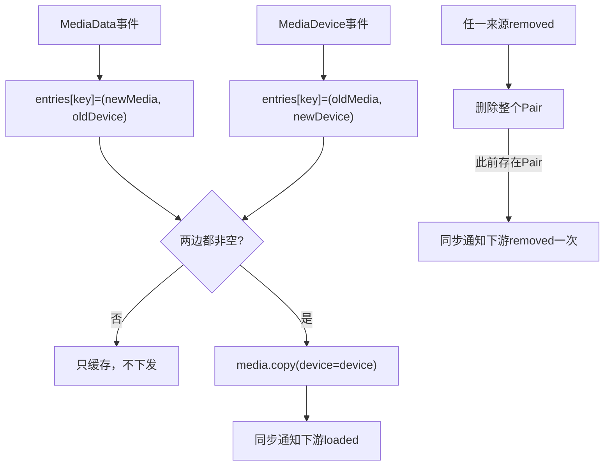
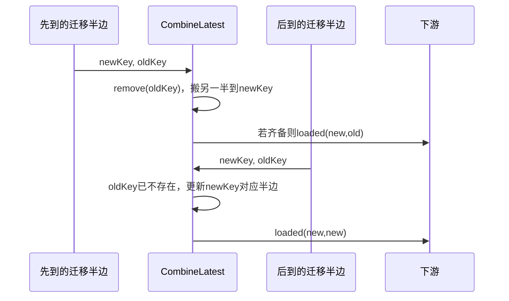
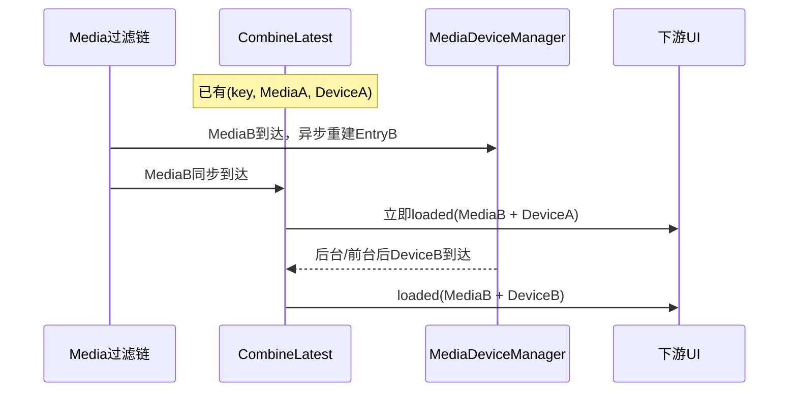

# 第 448 章 Android SystemUI MediaDataCombineLatest：双边合流、Key迁移与半边孤儿

> 源码基线：Android 11 / API 30 / `android-11.0.0_r48`。本章只在 macOS 阅读源码，不编译。核心文件：`MediaDataCombineLatest.kt`、`MediaDeviceManager.kt`、`MediaSessionBasedFilter.kt`、`MediaDataManager.kt` 与 `MediaDataCombineLatestTest.java`。

## 1. 本章要解决什么问题

媒体通知数据和当前输出设备来自两条异步链，谁先到都不确定。SystemUI怎样等二者齐备后才向UI发布？key迁移由哪一半先到都能完成吗？删除、迟到事件和Token替换又怎样留下“只有一半”的孤儿状态？

## 2. 一句话答案

`MediaDataCombineLatest`为每个key保存`Pair<MediaData?,MediaDeviceData?>`；任何一边更新都保留另一边，只有两边非空才copy出带device的MediaData并同步下发。任一来源remove会删除整对并至多发一次removed。

## 3. 为什么需要合流

MediaData来自通知/Session解析，MediaDeviceData来自后台路由扫描。若MediaData先发，chip会无设备而后跳；若设备先发，UI又没有标题/动作。合流器把“准备完成”定义为两边齐备。

## 4. 它不是缓存最终 MediaData

Map保存原媒体半边和设备半边；每次update现场`entry.copy(device=device)`创建输出。带device的输出对象不写回Pair中的原MediaData。

## 5. 核心账本

`entries: MutableMap<String, Pair<MediaData?, MediaDeviceData?>>`。Pair不可变，但Map和MediaData内容可变；每次事件用新Pair替换该key。

## 6. 总体流程



## 7. 两个输入接口

它同时实现`MediaDataManager.Listener`和`MediaDeviceManager.Listener`，所以能接收loaded/removed与deviceChanged/keyRemoved两套事件。

## 8. 一个输出接口

下游仍是`MediaDataManager.Listener`，设备信息被写进MediaData.device；后续MediaDataFilter和Carousel不需了解双源细节。

## 9. 谁把两个输入接到它

MediaDataManager初始化时让MediaSessionBasedFilter同时监听MediaDeviceManager和CombineLatest；再让MediaDeviceManager把设备事件监听者设为CombineLatest。

## 10. 正常事件线程

Filter把MediaData事件post到主Executor；MediaDeviceManager也把processDevice post到主Executor，keyRemoved通常从主媒体回调同步进入。因此本类意图在主线程串行运行。

## 11. 类本身有没有线程保护

没有注解、assert、Executor或锁，entries和listeners都是普通Mutable集合。直接从不同线程调用会数据竞争；单测同步调用不会暴露线程问题。

## 12. listeners 为什么是 Set

同一对象重复add只保留一次。add/remove不回放当前合流快照，也没有生命周期destroy。

## 13. MediaData 普通更新

若不满足真实迁移条件，写`entries[key] = data to entries[key]?.second`，保留当前key已有设备半边，再调用`update(key,key)`。

## 14. 为什么 oldKey 传 key

普通路径无论上游oldKey是null还是等于key，都向下游使用`oldKey=key`。这把“新建/普通更新”统一成同key更新语义，但丢失了上游首次null信息。

## 15. 首次 MediaData 到达

Map此前无key，形成`(data,null)`；update发现device为空，不通知下游。

## 16. 第二次 MediaData 仍无设备

用新data替换媒体半边，device仍null，继续不发。只保留最新媒体对象。

## 17. 已有设备时 MediaData 到达

形成`(newData,oldDevice)`并立即输出`newData.copy(device=oldDevice)`。这是标准combineLatest：任一边变化都配对另一边最新值。

## 18. MediaData 入口源码

```kotlin
override fun onMediaDataLoaded(key: String, oldKey: String?, data: MediaData) {
    if (oldKey != null && oldKey != key && entries.contains(oldKey)) {
        entries[key] = data to entries.remove(oldKey)?.second
        update(key, oldKey)
    } else {
        entries[key] = data to entries[key]?.second
        update(key, key)
    }
}
```

## 19. 真迁移的三道门

oldKey非null、oldKey不同于new key、Map当前确实包含oldKey。缺一就按普通newKey更新，不尝试删除oldKey。

## 20. contains(oldKey) 是什么

Kotlin Map的`contains(key)`等价containsKey。它检查Pair存在，即使Pair只有Media或只有Device也算可迁移。

## 21. Media先发起迁移

取old Pair的device半边，与新data组成newKey Pair，删除oldKey，并调用`update(newKey,oldKey)`。

## 22. old Pair 两边齐备时

迁移后new Pair也齐备，立即向下游发送loaded(newKey,oldKey,combined)，UI可原地rename而不是remove/add。

## 23. old Pair 只有 Media 时

迁移得到`(newData,null)`，不会下发；后续newKey设备到达才输出，但那次oldKey通常变成newKey，下游从未见过旧合流卡，因此无需迁移可见对象。

## 24. old Pair 只有 Device 时

迁移得到`(newData,oldDevice)`并立即齐备。即使此前旧key从未输出卡，向下游仍会带oldKey；监听者通常找不到旧项后按新增处理。

## 25. 目标 key 已有 Pair 会怎样

真迁移直接覆盖`entries[newKey]`，丢弃目标原有媒体/设备半边。上游应保证key rename目标空闲，本类没有merge冲突策略。

## 26. contains 与 remove 是否原子

不是。主线程串行假设下安全；若多线程，contains后另一线程remove会让迁移得到device=null并覆盖目标。

## 27. Device 普通更新

写`entries[key] = entries[key]?.first to data`，保留媒体半边并更新设备，再`update(key,key)`。

## 28. 首次 Device 到达

形成`(null,device)`，不下发。MediaDeviceManager可能比通知解析更快，这个半边等待MediaData。

## 29. DeviceData enabled=false 仍算齐备吗

算。只要对象非null，即使内部enabled=false、icon/name为空，也会与MediaData合流，让媒体卡及时出现但输出chip禁用。

## 30. 为什么不能把 disabled 当缺失

disabled是一个已完成的可信结论，例如Controller没有RoutingSession；null才表示设备源尚未准备。混淆会让整张卡永久等待。

## 31. Device 入口源码

```kotlin
override fun onMediaDeviceChanged(
    key: String,
    oldKey: String?,
    data: MediaDeviceData?
) {
    if (oldKey != null && oldKey != key && entries.contains(oldKey)) {
        entries[key] = entries.remove(oldKey)?.first to data
        update(key, oldKey)
    } else {
        entries[key] = entries[key]?.first to data
        update(key, key)
    }
}
```

## 32. DeviceData 为什么可 null

Listener接口允许null，表示没有设备半边；但r48 MediaDeviceManager正常总发送一个MediaDeviceData，disabled也不是null。

## 33. 已合流后收到 null device

Map变成`(media,null)`，update不下发任何loaded或removed。下游继续保留上一帧带旧device的MediaData，可能长期陈旧。

## 34. null device 的隐含契约

生产者应优先发送`MediaDeviceData(false,null,null)`表达禁用，而不是null。源码没有注释或assert锁定这个不变量，也没有null测试。

## 35. Device先发起迁移

从old Pair取media半边，与新device组成newKey Pair，删除oldKey并尝试输出。算法与Media迁移完全对称。

## 36. 为什么两边都能迁移

媒体链与设备链异步，无法保证谁先看到key变化。第一个到达者搬整个旧Pair的另一半，第二个到达者发现oldKey已无Pair，按newKey普通更新。

## 37. 双边迁移时序



## 38. 为什么第二次 oldKey 变成 newKey

else分支固定`update(key,key)`。第一半已完成可见身份迁移，第二半只应视为newKey内容更新，避免下游重复迁移。

## 39. 单测怎样锁定这一点

`migrateKeyMediaAfter`和`migrateKeyDeviceAfter`分别让另一半先迁移，再断言后到事件下发`oldKey==KEY`。

## 40. update 做什么

读取key Pair，只有entry和device都非null才copy并遍历listeners；任一为空直接静默返回。

## 41. update 源码

```kotlin
private fun update(key: String, oldKey: String?) {
    val (entry, device) = entries[key] ?: null to null
    if (entry != null && device != null) {
        val data = entry.copy(device = device)
        listeners.toSet().forEach {
            it.onMediaDataLoaded(key, oldKey, data)
        }
    }
}
```

## 42. Elvis 表达式的含义

Map无key时使用`null to null`作为临时Pair，方便解构；不会把空Pair写回Map。

## 43. 为什么 copy 而不是原地写 device

保留上游MediaData不被本阶段污染，避免同一对象在其他内部Listener中突然出现设备字段；每次合流输出是独立data class副本。

## 44. copy 是深复制吗

不是。除device字段替换外，Artwork、actions、token等引用都共享；MediaDeviceData内部Drawable/CharSequence也未深拷贝。

## 45. listeners 快照在何时生成

update同步执行时立即`listeners.toSet()`。回调中新增listener不参加本轮，删除尚未轮到的listener也仍会收到本轮，因为快照已固定。

## 46. 与上一章执行时快照的区别

MediaDeviceManager事件先排Executor，真正process时才读listeners；本类没有异步队列，事件进入update时就固定快照。

## 47. Listener 异常是否隔离

不隔离。一个下游抛异常会中止其后listener，并沿当前主线程调用栈传播。

## 48. addListener 是否回放当前状态

不回放。新UI监听者只有等下一次Media或Device更新才收到卡；正常下游单例在事件前装配。

## 49. remove 的两个入口

`onMediaDataRemoved(key)`和`onKeyRemoved(key)`都调用相同私有`remove(key)`，不区分是媒体源还是设备源结束。

## 50. 为什么任一边 remove 就删整对

没有媒体就不应显示卡，没有Entry设备观测也意味着该key生命周期结束。整对删除避免保留另一半与未来错误合流。

## 51. remove 源码语义

Map此前存在任何Pair就通知下游removed，即使Pair只有一半、从未产生过loaded；此前无Pair则完全静默。

## 52. remove 源码

```kotlin
private fun remove(key: String) {
    entries.remove(key)?.let {
        listeners.toSet().forEach {
            it.onMediaDataRemoved(key)
        }
    }
}
```

## 53. 两个来源都 remove 会重复吗

第一个删除Pair并发一次removed；第二个找不到Pair，不再发。因此Map存在性兼作remove去重门。

## 54. 实际管线里谁通常先 remove

MediaSessionBasedFilter按listener注册顺序先调用MediaDeviceManager；它同步`onKeyRemoved`给CombineLatest，随后Filter再直接调用CombineLatest.onMediaDataRemoved。通常设备源先完成唯一removed。

## 55. 只有半边也发 removed 合理吗

下游可能从未见loaded，removed通常幂等无害；这简化了账本。但严格事件消费者不能假设每个removed前一定有loaded。

## 56. late Media 事件会怎样

remove后迟到MediaData重新创建`(data,null)`；若另一边不再到达，它成为media-only孤儿且不下发。

## 57. late Device 事件会怎样

remove后迟到DeviceData重建`(null,device)`。上一章停止Entry后仍可发布，正是device-only孤儿的主要来源。

## 58. 两种迟到半边若都到达

即使原生命周期已removed，只要同key的旧Media和旧Device先后迟到，CombineLatest会再次下发loaded，造成已删除卡复活。

## 59. 为什么没有 generation 防复活

Pair不存Token、代次或removed tombstone，只按字符串key匹配。类无法判断事件属于旧Entry还是新生命周期。

## 60. key reuse 的正常场景

通知key可能重用，恢复卡固定用packageName。新生命周期本就应允许重新创建；难点是区分合法新事件与旧异步迟到事件。

## 61. 最小代次模型

上游给Media与Device携带同一generation/Token，Pair只合流代次相同的两边；remove提升generation并拒绝旧事件。

## 62. Token 为什么不在 DeviceData

MediaDeviceData只有enabled/icon/name，进入CombineLatest后失去它由哪个Controller Entry生成的信息。因此同keyToken变化无法关联两半。

## 63. 同 key Token A→B 的短暂错配

旧Pair已有Media A+Device A；新Media B先到时普通路径保留Device A并立即输出B+A。新Entry后台稍后产生Device B才纠正。

## 64. Token替换时序



## 65. 这种错配一定错误吗

新旧Session常在同设备播放，因此视觉可能相同；但若Token切换同时代表投屏/本地切换，chip会短暂显示旧路由。

## 66. 为什么 combineLatest 天然允许它

算子定义就是“任一源新值 + 另一源最新值”，不等待语义相关的新一代。要避免必须把Token/generation纳入设备事件。

## 67. MediaData 原本已有 device 怎么办

Map保存整个上游data，但输出时copy覆盖device为设备半边。上游残留device不会替代缺失半边；设备为空时仍不下发。

## 68. 同 key Media频繁更新

每次都与当前DeviceData立即合流，标题、播放状态、动作能及时刷新而不重新扫描设备。

## 69. 同 key Device频繁更新

每次都copy最新MediaData并输出，保持媒体字段不变、只换chip。但MediaDeviceManager可能按ID抑制部分属性更新。

## 70. 输出 active 等字段来自谁

全部来自最新MediaData副本；CombineLatest不解释active/resumption/isPlaying，只注入device。

## 71. disabled Device 变化为 enabled

两个都是非null对象，每次Device事件都会输出；UI从禁用chip更新为设备名称，无需新MediaData。

## 72. enabled 变化为 disabled

同样立即输出`MediaData.copy(device=disabledData)`，不删除媒体卡。

## 73. entries 是否有大小上限

没有。正常remove清理；任何迟到单边且没有后续remove都会永久留到进程结束。

## 74. 是否可 dump 这些孤儿

本类未实现Dumpable，也没有日志。device-only/media-only泄漏很难从dumpsys直接观察，只能在调试器或增加诊断。

## 75. userId 是否进入 key

Map只按字符串key，不显式组合userId。若不同用户产生相同package恢复key且内部事件交错，可能错配两半；末端用户过滤发生在本类之后。

## 76. packageName 是否校验

不校验。MediaData包名与DeviceData没有包字段，完全依赖MediaDeviceManager按同一key创建正确LMM。

## 77. oldKey 参数是否可信历史

本类只在旧Pair仍存在时承认真迁移；迟到的第二半即使携带真实oldKey也会被改写为key。下游看到的是“是否本类第一次搬Pair”，不是原始事件原封不动。

## 78. 为什么这通常正确

可见卡只需迁移一次。第二次重复oldKey可能让下游再次移除已经不存在的旧项，反而增加混乱。

## 79. 首次普通事件 oldKey=null 为什么也改 key

当两半终于齐备时，下游把它作为同key update/insert处理；MediaDataManager消费者通常以`oldKey!=key`才迁移，因此null与key对新增结果相同。

## 80. 哪些消费者可能看出差别

日志、指标或严格区分insert/update的Listener会看到首次合流oldKey=key，而非上游null。源码没有文档提醒这个规范化。

## 81. Map Pair 是否可能 null-null

正常事件每次至少提供一边非null；`null to null`只在update局部默认，不写Map。除非调用deviceChanged(data=null)且当前无media，才会写入`(null,null)`。

## 82. null-null 的后果

entries仍contains key，迁移/removed会把它当存在；remove会向下游发removed，尽管从未有任何有效半边。

## 83. data=null Device事件是真实输入吗

当前MediaDeviceManager不发送null，但接口公开允许。测试没有覆盖，未来调用者可触发空Pair语义。

## 84. listener 在回调中 remove 自己

快照已建，本轮继续正常；后续事件不再收到。这比直接遍历MutableSet稳定。

## 85. listener 在回调中 remove 别人

被移除者若在快照后面，仍收到当前事件；这是一致快照语义。

## 86. listener 在回调中触发重入

没有重入保护。下游若同步回调本类，新事件可在当前forEach中嵌套修改entries并产生另一次快照。

## 87. 正常管线为何少重入

下游MediaDataFilter/Carousel通常消费并更新UI，不反向写CombineLatest；Manager反向路径多经过Executor或更上游Map。

## 88. 测试 eventNotEmittedWithoutDevice

证明media-only不下发，但没有检查entries确实保留最新MediaData；后续MediaFirst用例间接证明。

## 89. 测试 eventNotEmittedWithoutMedia

证明device-only不下发；DeviceFirst随后Media到达并输出，证明设备半边被缓存。

## 90. 两个顺序测试的价值

`emitEventAfterDeviceFirst`和`emitEventAfterMediaFirst`锁定合流交换律：最终都得到非null device。

## 91. 测试只检查 device 非空

没有断言输出MediaData其余字段等于最新输入，也没有验证原MediaData未被原地修改。

## 92. migrateKeyMediaFirst

旧Pair完整，Media迁移先到后立即输出newKey/oldKey且保留device，覆盖一半发起迁移的主路径。

## 93. migrateKeyDeviceFirst

对称验证Device先迁移也保留media并输出正确oldKey。

## 94. migrateKeyMediaAfter

Device已经搬走Pair，Media携oldKey后到时走普通newKey路径，断言下游oldKey=newKey。

## 95. migrateKeyDeviceAfter

Media先搬走Pair，Device后到同样被规范为同key更新。

## 96. mediaDataRemoved 无历史

Map不存在时不发removed，锁定去重门。

## 97. 只有 media 半边时 remove

测试期待removed，证明下游remove不以“曾成功合流”为条件。

## 98. 只有 device 半边时 remove

同样期待removed，明确Pair任一半存在就算key生命周期存在。

## 99. 测试没有覆盖两个 remove 来源

没有连续调用onKeyRemoved和onMediaDataRemoved断言只一次；实现显然由Map remove去重，但组合契约未锁定。

## 100. 测试没有覆盖 null DeviceData

因此已合流后device变null不通知、空Pair也触发removed等边界未被发现。

## 101. 测试没有覆盖 Token替换错配

DeviceData不带Token，测试MediaData token本来就是null；无法表达A/B代次，更无法观察B+A短暂输出。

## 102. 测试没有覆盖迟到复活

没有remove后再送旧Media和旧Device；Map无tombstone/generation的问题未验证。

## 103. 测试没有覆盖目标 key 冲突

迁移newKey预先有Pair时的覆盖丢失没有用例。正常上游不应制造，但类没有assert。

## 104. 测试没有覆盖 listener 快照

只有一个mock Listener，没有自删、互删、添加或异常；快照语义靠源码推导。

## 105. 复读最容易误解之一

“Latest”不是等同一代，两边只按key关联。新Token Media可立即搭配旧Token Device。

## 106. 复读最容易误解之二

disabled DeviceData仍是已就绪半边；只有null才阻止合流。

## 107. 复读最容易误解之三

首次普通输出的oldKey被规范为key，不保留上游null。

## 108. 复读最容易误解之四

任一来源remove会删整对并可能发removed，即使该key从未成功loaded到下游。

## 109. 复读最容易误解之五

第二个迁移半边不再携真实oldKey下发，因为Pair已由第一半搬走；这正是防重复迁移。

## 110. 可改进：带代次的 DeviceData

让设备事件携带Token或Entry generation，Pair键使用`(key,generation)`；Media Token变化时不再与旧设备半边合流。

## 111. 可改进：removed tombstone

为key记录最新移除代次，拒绝旧代迟到事件；合法新生命周期必须携带更高代次。并增加dump显示media-only/device-only年龄。

## 112. macOS只读练习一：推演两种到达顺序

分别模拟Media→Device和Device→Media，每一步写出Pair内容、是否update以及下游oldKey，确认最终输出等价但首次半边不同。

## 113. macOS只读练习二：推演双边迁移

从完整old Pair开始，让Device先迁移、Media后迁移；说明第一次为何oldKey真实、第二次为何变newKey，并对照两个After单测。

## 114. macOS只读练习三：构造 Token 错配

已有key的MediaA+DeviceA；同key MediaB先到、DeviceB延迟。写出两次下游MediaData.device，并说明DeviceData缺哪个身份字段。

## 115. macOS只读练习四：构造移除后复活

先完整合流再remove；随后依次送旧Device、旧Media。记录Map从空到两半齐备的过程，证明没有generation时卡会重新loaded。

## 116. 可改进：明确 null 语义

禁止生产者发送null，统一用disabled对象；或把null解释成来源撤销并立即remove/更新下游。当前“静默清半边但保留旧UI”最难推理。

## 117. 可改进：迁移冲突检查

newKey已有不同代Pair时应记录错误并按Token/代次合并或拒绝，而不是无声覆盖；oldKey缺失也可输出诊断原因。

## 118. 进程与线程边界

本类完全在SystemUI进程，正常事件在主线程同步执行；Binder和后台扫描都已由上游封装。其简单性依赖上游严格把两源回到同一主执行域。

## 119. 诊断口诀

先打印`entries[key]=(media?,device?)`，再看第一次搬迁的是哪一半、oldKey是否仍存在；若设备错，核对Media Token与Device Entry代次；若卡复活，查remove之后哪条旧半边迟到。

## 120. 本章结论

MediaDataCombineLatest以极小代码完成双源准备栅栏、最新值合流、双边key迁移和remove去重。它的正确性建立在主线程串行、key生命周期稳定、Device事件不为null且旧任务不会迟到之上；r48没有Token/generation关联，因而新媒体搭旧设备、remove后孤儿/复活、迁移目标覆盖和null半边保留旧UI，都是读取媒体总链时不可忽略的真实边界。

### 本章源码追踪清单

- `frameworks/base/packages/SystemUI/src/com/android/systemui/media/MediaDataCombineLatest.kt`
- `frameworks/base/packages/SystemUI/src/com/android/systemui/media/MediaDeviceManager.kt`
- `frameworks/base/packages/SystemUI/src/com/android/systemui/media/MediaSessionBasedFilter.kt`
- `frameworks/base/packages/SystemUI/src/com/android/systemui/media/MediaDataManager.kt`
- `frameworks/base/packages/SystemUI/tests/src/com/android/systemui/media/MediaDataCombineLatestTest.java`

### 本章自测答案提示

1. 只有Media与Device对象都非null才下发loaded，disabled Device仍算就绪。
2. 第一条迁移半边搬Pair并携oldKey，第二条按newKey普通更新。
3. 任一来源remove删除整Pair，Map存在性保证至多一次removed。
4. 两边只按字符串key关联，Token变化时会短暂组合不同代数据。
