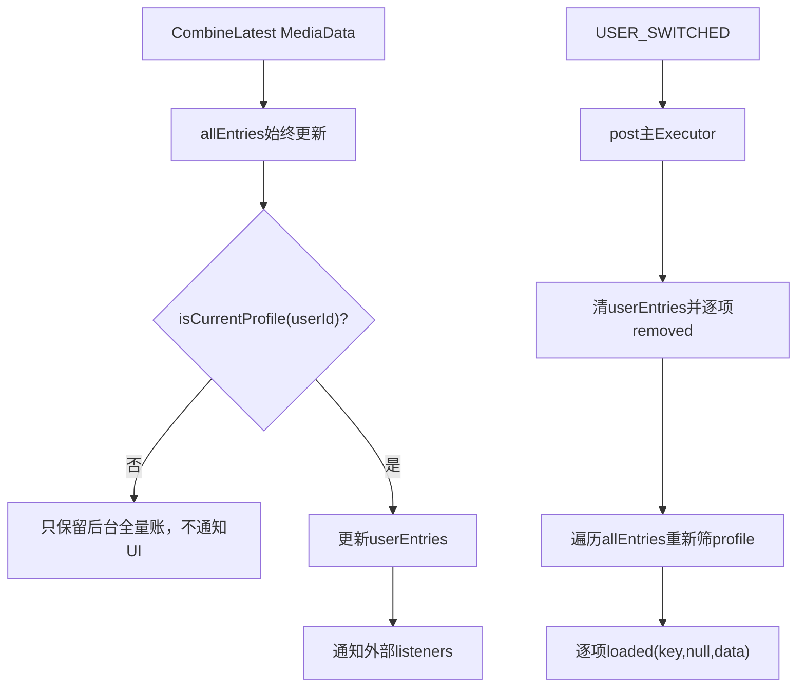
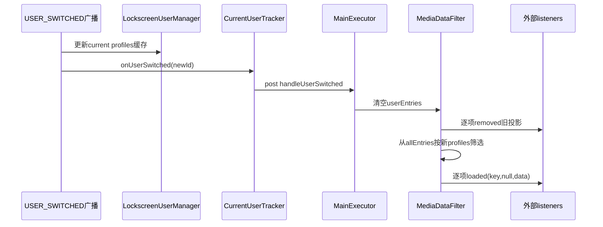
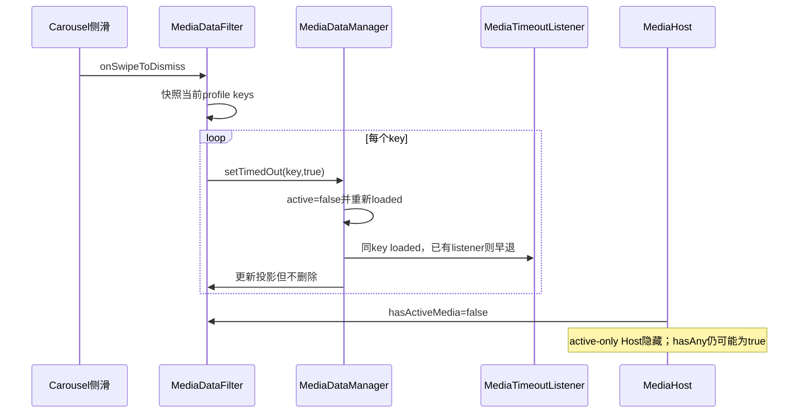

# 第 449 章 Android SystemUI MediaDataFilter：当前 Profile 投影、用户切换与 Swipe 策略

> 源码基线：Android 11 / API 30 / `android-11.0.0_r48`。本章只在 macOS 阅读源码，不编译。核心文件：`MediaDataFilter.kt`、`MediaDataManager.kt`、`CurrentUserTracker.java`、`NotificationLockscreenUserManagerImpl.java`、`MediaHost.kt` 与 `MediaDataFilterTest.kt`。

## 1. 本章要解决什么问题

为什么媒体管线要保留后台用户数据，却只把当前用户/工作资料的卡发给UI？用户切换时怎样先撤旧卡再重建新投影？侧滑整个轮播为何只把卡设为inactive，而不是删除或停止播放？

## 2. 一句话答案

MediaDataFilter位于管线末端：`allEntries`保存所有收到的合流MediaData，`userEntries`只投影`isCurrentProfile(userId)`为真的项；切用户时清空旧投影、通知remove，再从全量账重新筛选并以oldKey=null重发。

## 3. 为什么一定放在末端

Timeout、Resume、Session过滤、设备扫描等内部模块仍需处理后台用户回调。若过早丢弃后台数据，切换回来无法恢复最新active、设备和恢复动作状态。

## 4. 两本账

`allEntries`是所有用户/profile的最近MediaData；`userEntries`是当前可见profile集合的子集，也是hasAny/hasActive与Swipe的权威输入。

## 5. “当前用户”并不准确

判断调用`NotificationLockscreenUserManager.isCurrentProfile(userId)`；它接受当前主用户、关联managed profiles，并对`UserHandle.USER_ALL`返回true。

## 6. 总体投影



## 7. 为什么使用 LinkedHashMap

保存稳定插入顺序。用户切换重放时按allEntries顺序发loaded；更新同key不改变位置，真实key迁移remove+put会把newKey放到尾部。

## 8. 最终UI排序由它决定吗

不完全。MediaCarousel的MediaPlayerData还有playing/local/active与更新时间排序；本Filter重放顺序影响事件时序，但不是最终视觉排序唯一来源。

## 9. Listener集合

内部`_listeners`是MutableSet，公开internal getter每次返回`toSet()`快照。add/remove不回放当前userEntries。

## 10. 为什么公开快照 getter

分发时listener可自删/互删而不破坏迭代。当前事件仍按快照完成，后续事件再看到新集合。

## 11. mediaDataManager 为什么 lateinit

Filter由Manager构造依赖创建，Manager.init后再反向赋`mediaDataFilter.mediaDataManager=this`。只有Swipe需要反向写active状态。

## 12. 未接线就 Swipe

会抛`UninitializedPropertyAccessException`。正常SystemUI装配先完成Manager init再创建可交互Carousel，类本身没有安全门。

## 13. mediaResumeListener 参数是否被使用

构造函数保存该依赖，但本文件没有任何读取。它可能参与Dagger对象图/历史装配，但不能把恢复策略归到Filter代码里。

## 14. CurrentUserTracker 怎样创建

Filter在init构造匿名Tracker，只覆写`onUserSwitched(newUserId)`，把处理post到`@Main Executor`，随后立刻`startTracking()`。

## 15. 为什么不在广播回调里直接重建

注释明确要确保NotificationLockscreenUserManager先处理同一USER_SWITCHED广播、更新current profiles缓存，再调用`isCurrentProfile()`。

## 16. post 能提供什么顺序

当前广播栈结束后主队列再执行Filter重建，通常让同步profile更新先完成；若LockscreenUserManager自身还有更晚异步工作，单次post并非通用完成屏障。

## 17. UserTracker 共享 Receiver

CurrentUserTracker使用进程静态UserReceiver，首次tracker注册系统广播，记录`ActivityManager.getCurrentUser()`；多个tracker共享回调列表并抑制重复userId。

## 18. Filter 是否停止 Tracking

没有destroy/stopTracking出口。它与SystemUI媒体单例同寿命；短生命周期复用会泄露回调。

## 19. 初始 startTracking 会回放用户吗

不会调用匿名`onUserSwitched`，只让共享Receiver缓存当前id。初始投影依赖LockscreenUserManager已经建立profiles，随后每条loaded现场判断。

## 20. loaded 首先更新哪本账

若oldKey是真迁移，先从allEntries删除oldKey；无论data属于谁，都put到allEntries[newKey]。

## 21. 为什么后台数据也更新全量账

后台会话的timeout、设备或状态可持续变化。切换到该用户时应展示最新快照，而不是切走前的陈旧值。

## 22. loaded 全量账源码

```kotlin
override fun onMediaDataLoaded(key: String, oldKey: String?, data: MediaData) {
    if (oldKey != null && oldKey != key) {
        allEntries.remove(oldKey)
    }
    allEntries.put(key, data)

    if (!lockscreenUserManager.isCurrentProfile(data.userId)) {
        return
    }
    // 当前profile才继续更新userEntries和分发
}
```

## 23. 非当前 profile 的终点

在isCurrentProfile为false处return，不更新userEntries，也不通知外部listener。内部全量账已经完成更新。

## 24. 当前 profile 的更新

真实迁移先删userEntries[oldKey]，再put newKey，随后用原始`key,oldKey,data`同步通知listener快照。

## 25. 首次 loaded 的 oldKey

Filter保留上游值；但上一章CombineLatest普通路径通常已规范为oldKey=key。因此外部UI常看到同key而不是最初null。

## 26. userEntries 存的是 copy 吗

不是，直接保存同一个MediaData引用；allEntries和userEntries当前profile项也指向同一对象，下游又接收该引用。

## 27. 原地 active 变化的影响

MediaDataManager.setTimedOut原地写active后重新走管线；即使重分发延迟，两本账中的引用也可能已观察到新active。线程约束因此很重要。

## 28. profile 判断每次都现场调用

Filter不缓存currentUserId或profile ids。loaded到达时以NotificationLockscreenUserManager当前缓存为准。

## 29. 广播切换窗口

USER_SWITCHED已到但post的handle尚未执行时，新旧loaded可能按profile缓存更新时刻被归类；最终handle会清空并从allEntries重建，通常收敛。

## 30. key 是全用户复合键吗

不是本类构造的，Map只拿字符串。通知key通常含区分信息，但恢复卡使用packageName，跨用户同包容易冲突。

## 31. allEntries 同 key 冲突

后台用户同key loaded会覆盖当前用户allEntries值。Map无法同时保存两用户的packageName恢复卡；切换回来时可能只剩最后写入者。

## 32. userEntries 同 key 陈旧边界

若当前userEntries已有KEY，随后后台用户用同KEY loaded，allEntries被覆盖后return，userEntries旧对象不会删除或更新，UI继续显示当前旧卡。

## 33. 这是有意隔离还是账本分裂

不通知后台更新是正确隔离，但全量Map和投影Map对同key指向不同用户，之后remove或切换会产生非直观结果。根因是key缺user维度。

## 34. 后台真迁移影响当前旧 key

allEntries先删除oldKey、put新后台key，然后return；若userEntries恰有同名oldKey，它仍保留。Filter假设迁移不会跨用户碰撞。

## 35. 当前 profile loaded 源码

```kotlin
if (oldKey != null && oldKey != key) {
    userEntries.remove(oldKey)
}
userEntries.put(key, data)
listeners.forEach {
    it.onMediaDataLoaded(key, oldKey, data)
}
```

## 36. listeners 属性何时快照

进入`listeners.forEach`时getter先生成Set快照。当前同步分发中自删不会跳过其他listener，新增不参加本轮。

## 37. Listener 异常

没有try/catch，一个外部Listener异常会阻断后续listener；两本Map已经更新，不回滚，UI消费者可能彼此不一致。

## 38. removed 首先做什么

无条件`allEntries.remove(key)`。它不知道removed属于哪个user，因为事件只带key。

## 39. 何时通知外部 removed

只有`userEntries.remove(key)`返回非null时。后台独有条目移除不会通知当前UI。

## 40. removed 源码

```kotlin
override fun onMediaDataRemoved(key: String) {
    allEntries.remove(key)
    userEntries.remove(key)?.let {
        listeners.forEach { it.onMediaDataRemoved(key) }
    }
}
```

## 41. 同 key 冲突下 remove 的问题

若allEntries当前是后台数据、userEntries同key仍是前台旧数据，后台remove会同时清两本账并向UI发送removed，误删前台投影。

## 42. 重复 remove

第一次userEntries已空后，第二次不通知。userEntries存在性兼作外部removed去重。

## 43. allEntries 不存在但 userEntries 存在

冲突或异常时仍会删userEntries并通知；两本账不要求原子一致。

## 44. 用户切换总体策略

不计算旧/新集合差分，而是先把当前投影全部remove，再从allEntries把新profiles全部loaded回来。

## 45. handleUserSwitched 的 id 用了吗

参数完全未使用。真实选择由LockscreenUserManager的profile缓存决定；id只存在于方法签名和测试调用语境。

## 46. 为什么不用 id 直接比较

当前可见集合包含managed profiles与USER_ALL，单一newUserId不足以判断。委托锁屏用户管理器复用统一profile政策。

## 47. 切换第一份快照

`listenersCopy = listeners`固定整轮监听者；`keyCopy = userEntries.keys.toMutableList()`固定要删除的旧key顺序。

## 48. 为什么先 clear userEntries

注释说保证listener回调查询状态时已是最新：第一个removed回调里调用hasAny/hasActive会看到空，而不是还看到尚未逐项删完的旧卡。

## 49. 清空与逐项通知不是同一回事

内部投影瞬间为空，但外部Listener按key逐个收到removed。回调期间内部`hasAny=false`，外部UI可能还未处理完全部旧卡。

## 50. 删除顺序

按userEntries的LinkedHashMap key顺序。listeners用同一快照，对每key完整遍历后处理下一key。

## 51. 重建怎样筛选

遍历allEntries；每条再次调用`isCurrentProfile(data.userId)`，符合则put userEntries并向每个listener发送loaded(key,null,data)。

## 52. 为什么重建 oldKey=null

这是对新用户投影的新增，而不是从旧用户同名key迁移。传null防止UI错误把两个用户的卡视作同一对象rename。

## 53. 切换源码

```kotlin
val listenersCopy = listeners
val keyCopy = userEntries.keys.toMutableList()
userEntries.clear()
keyCopy.forEach { key ->
    listenersCopy.forEach { it.onMediaDataRemoved(key) }
}
allEntries.forEach { (key, data) ->
    if (lockscreenUserManager.isCurrentProfile(data.userId)) {
        userEntries.put(key, data)
        listenersCopy.forEach { it.onMediaDataLoaded(key, null, data) }
    }
}
```

## 54. USER_ALL 条目怎样切换

旧投影阶段先remove，重建阶段因isCurrentProfile(USER_ALL)=true再add。即使对所有用户都可见，也经历一次完整闪断式重投影。

## 55. 两边都属于的 managed profile

某profile若切换前后均被政策视作current，也仍remove再add；源码不做集合差分，换取逻辑简单和状态全量刷新。

## 56. 切换时序图



## 57. listener 回调查询 hasAny

在旧项removed阶段看到false；重加第一项后变true。整轮并非对外原子事务，观察者会看到中间状态。

## 58. listener 回调修改 allEntries

删除阶段回调发生在`allEntries.forEach`开始前，修改会影响随后重建快照；重加阶段回调若同步修改allEntries，可能触发ConcurrentModificationException。

## 59. 为什么 allEntries 没有复制

源码假设外部listeners只消费，不反向同步修改上游Filter。与listenersCopy不同，全量数据没有防重入快照。

## 60. Listener 异常发生在删除阶段

userEntries已经clear；异常中断后剩余removed和全部重建都不执行，UI与内部账严重分裂，下一次loaded/切换才可能修复。

## 61. Listener 异常发生在重建阶段

userEntries只加入部分新项，allEntries仍完整；后续项未投影。无try/finally或重试。

## 62. handle 参数与profile缓存错位

即使传入id=10，若LockscreenUserManager缓存仍是user0，Filter会重新投影user0；它不会校验两者一致或重post。

## 63. 测试如何模拟切换

`setUser(id)`让mock对该id返回true，再直接调用handleUserSwitched(id)。它绕过CurrentUserTracker、广播和Executor顺序。

## 64. 因此测试没证明什么

没有证明匿名Tracker确实post、LockscreenUserManager先更新、重复广播被抑制或主线程执行，只验证重建算法本体。

## 65. onSwipeToDismiss 的入口

MediaCarouselScrollHandler完成侧滑后经MediaDataManager代理调用Filter。它操作当前userEntries，而非allEntries。

## 66. Swipe 首先快照 keys

`val mediaKeys = userEntries.keys.toSet()`，避免随后setTimedOut同步重入媒体管线、修改userEntries时破坏迭代。

## 67. 每个 key 做什么

调用`mediaDataManager.setTimedOut(key,true)`。Manager把active改false并重新走loaded；不删除、不stop Session、不清resumeAction。

## 68. Swipe 源码

```kotlin
fun onSwipeToDismiss() {
    val mediaKeys = userEntries.keys.toSet()
    mediaKeys.forEach {
        mediaDataManager.setTimedOut(it, timedOut = true)
    }
}
```

## 69. 已 inactive 条目会怎样

Manager发现`active == !true`即false，直接return，不产生新事件。Swipe仍遍历它但无副作用。

## 70. active 条目会怎样

原地active=false并重新loaded；Filter仍把它保留在userEntries，因为profile没变，只向下游发送内容更新。

## 71. 为什么卡看起来被划走

active-only Host的`hasActiveMedia()`变false并隐藏，ScrollHandler也执行视觉侧滑；数据在all-media Host/账本仍存在。

## 72. 完整 QS 会永久保留吗

hasAny仍true，所以all-media Host政策上仍可显示inactive卡。具体Carousel视觉复位、timeout/resumption和用户清理共同决定后续呈现；Swipe本身不做remove。

## 73. Swipe 包含工作资料吗

包含。userEntries是所有current profiles投影，操作不按userId拆分；一次侧滑使当前用户及其工作资料媒体全设inactive。

## 74. Swipe 包含 USER_ALL 吗

只要这种MediaData进入userEntries，也包含。

## 75. Swipe 与 MediaTimeoutListener 的账一致吗

不一定。Manager active被外部改false，TimeoutListener同keyloaded直接早退，其内部timedOut/playing不随之更新；第445章已说明状态源分裂。

## 76. 正在播放的卡被 Swipe

active可被设false，但PlaybackState仍playing且没有false→true边沿，TimeoutListener不会立即重新激活。下一次状态边沿或其他更新才可能改变。



## 77. hasActiveMedia 的定义

`userEntries.any { it.value.active }`。不看PlaybackState、isPlaying、initialized或resumption；active是唯一门。

## 78. hasAnyMedia 的定义

只判断userEntries非空，inactive恢复卡也算。它对应QS等“显示所有媒体”的Host。

## 79. 两个查询都只看投影

后台用户allEntries再多也不影响当前UI Host可见性。工作profile因为进入userEntries会影响。

## 80. 查询是否线程安全

没有锁；正常主线程调用。后台dump/调用者若并发修改Map，可能读到不一致或抛异常。

## 81. MediaHost 怎样选择查询

`showsOnlyActiveMedia=true`调用hasActiveMedia，否则hasAnyMedia。Keyguard和QQS通常active-only，完整QS通常all-media。

## 82. Filter 是否直接控制 View visibility

不控制。它提供数据事件与查询；MediaHost根据查询更新visible，Carousel根据loaded/removed维护player。

## 83. allEntries 与 Manager.mediaEntries 是否重复

是不同阶段快照：Manager原始账还未必有device/current-user过滤；Filter全量账保存经过Session过滤和Device合流后的MediaData，用于切换时重发最终形态。

## 84. 为什么不能切换时直接查 Manager

会绕过中间管线或重复异步设备合流。Filter保存末端全量快照，可直接重投影已处理数据。

## 85. background timeout 如何保鲜

后台用户MediaData active变化仍一路到Filter，allEntries更新后因profile false return；切换过去时重发最新active值。

## 86. background device 如何保鲜

CombineLatest产生的新MediaData同样更新allEntries。代价是后台用户设备扫描仍可能运行，正是“Filter放末端”的设计选择。

## 87. 包卸载/Session过滤 remove

事件到Filter时无userId，只按key清allEntries和可能的userEntries。上游必须保证key精确定位正确条目。

## 88. key migration 顺序与 LinkedHashMap

remove old后put new使条目移到全量账尾；用户Entries同样。用户切换重放时相对顺序可能变化，即便媒体排序稍后重排。

## 89. data.userId 变化同 key

当前数据先是profile、后同key更新为后台：allEntries换成后台，profile检查return，userEntries仍保留旧profile数据，形成明确陈旧投影。

## 90. 反向变化同 key

后台allEntries已有key，随后当前profile同key loaded：allEntries和userEntries都覆盖当前并通知，陈旧状态被修复。

## 91. 更稳健的 key

内部账应使用`(userId,key)`，对外当前投影再映射视觉key；恢复package key也必须含user。这样全量多用户数据可并存。

## 92. 更稳健的非当前更新

若同视觉key当前userEntries属于不同user，不应被后台数据触碰；removed也需携userId或可查来源，避免按字符串误删。

## 93. 测试 current loaded

验证isCurrentProfile=true时listener收到原key、oldKey=null和data。它绕过CombineLatest oldKey规范化，属于Filter单元契约。

## 94. 测试 guest loaded

验证后台数据不通知listener，但没有断言allEntries已缓存；后续switch add测试间接证明缓存存在。

## 95. current removed 测试

先当前loaded再remove，断言外部removed。没有检查allEntries/userEntries查询同时为空之外的内部状态。

## 96. guest removed 测试

后台loaded后remove，不通知外部。它没有同key前台条目，因此未覆盖冲突误删。

## 97. switch removes 测试

当前主用户卡加载后切guest，断言KEY removed。没有多个key顺序、listener快照或USER_ALL重加。

## 98. switch adds 测试

先缓存主/guest不同key，切guest后只重发guest且oldKey=null。锁定allEntries保留后台数据的核心目的。

## 99. hasAny/Active 测试

分别验证当前条目影响查询、guest条目不影响。未覆盖inactive条目：hasAny应true而hasActive false。

## 100. Swipe 测试

只放一个当前key并断言Manager.setTimedOut(KEY,true)。没有验证多个profile key、inactive早退或同步重入安全。

## 101. 测试未覆盖工作资料

mock一次只让一个id为current，没有当前user+managed profile同时true，也没有quiet mode/profile removal。

## 102. 测试未覆盖 USER_ALL

无法证明跨切换会remove再add，或hasActive/Swipe包含它。

## 103. 测试未覆盖同 key 跨用户

主和guest使用KEY与KEY_ALT，避开最危险的全量Map覆盖与投影陈旧问题。

## 104. 测试未覆盖 Tracker post

executor是mock，匿名Tracker没有被捕获/驱动；注释所依赖的广播顺序完全未验证。

## 105. 复读最容易误解之一

Filter不是删除后台数据，而是只停止向UI投影；allEntries仍持续更新。

## 106. 复读最容易误解之二

“current user”其实是current profiles集合，工作资料与USER_ALL也能进入userEntries。

## 107. 复读最容易误解之三

handleUserSwitched(id)不读取id，结果只取决于LockscreenUserManager缓存。

## 108. 复读最容易误解之四

Swipe不是remove；它只设active=false，因此hasAny可能仍true，播放也不会stop。

## 109. 复读最容易误解之五

用户切换不是差分更新，而是先全remove再全add；同样仍可见的USER_ALL/profile项也会抖动一次。

## 110. 可改进：用户复合键

把allEntries和上游恢复key改为user-scoped身份；removed/migration事件携userId，杜绝后台同包覆盖当前数据。

## 111. 可改进：原子重投影

先从allEntries快照计算new projection，再对old/new做差分；listener异常逐个隔离，避免清空后半途失败。必要时提供批次开始/结束信号。

## 112. macOS只读练习一：推演后台保鲜

主用户可见、guest不可见时，让guest data连续active→inactive更新，再切guest。逐步记录allEntries/userEntries，证明重放的是最新inactive快照。

## 113. macOS只读练习二：推演工作资料

假设isCurrentProfile对user0和profile10都true，各加载一张卡；计算hasAny/hasActive与Swipe操作的key集合，说明为什么不只是user0。

## 114. macOS只读练习三：构造同 key 冲突

先加载user0的KEY，再加载guest的同KEY但不切用户；写出两本账各自指向谁。随后remove(KEY)，说明为何UI会收到前台removed。

## 115. macOS只读练习四：审查切换中间态

在第一个removed callback、最后一个removed后、第一条new loaded后分别调用hasAny；说明clear-before-callback怎样让内部查询与外部UI暂时不同步。

## 116. 可改进：明确 Swipe 语义

区分“隐藏active-only轮播”“用户永久清除历史卡”“停止本地Session”三种动作，使用原因化API而非统一setTimedOut，避免TimeoutListener内部账失配。

## 117. 可改进：生命周期与诊断

提供destroy停止CurrentUserTracker，增加dump输出all/user条目及userId、profile快照、最后切换代次和冲突key，方便定位跨用户覆盖。

## 118. 进程与线程边界

Filter完全在SystemUI进程；正常Media事件和重建运行主线程。用户广播由共享CurrentUserTracker接收，再post主Executor；Binder工作已在上游完成。

## 119. 诊断口诀

先查allEntries[key]的userId，再查userEntries[key]是否同一对象；核对LockscreenUserManager current profiles，随后看USER_SWITCHED重建是否已执行；Swipe问题则分别看active与条目是否仍存在。

## 120. 本章结论

MediaDataFilter以“全量末端缓存 + 当前profiles投影”让后台回调继续保鲜，并在用户切换时用remove-all/add-current重建UI；hasActive/hasAny和Swipe都只面向投影。r48主线简洁，但字符串key缺用户维度、非当前同key更新可造成两本账分裂、切换id未校验、重放非原子、listener异常无恢复及Swipe只改active不改超时观察者，都是多用户媒体链的关键边界。

### 本章源码追踪清单

- `frameworks/base/packages/SystemUI/src/com/android/systemui/media/MediaDataFilter.kt`
- `frameworks/base/packages/SystemUI/src/com/android/systemui/media/MediaDataManager.kt`
- `frameworks/base/packages/SystemUI/src/com/android/systemui/settings/CurrentUserTracker.java`
- `frameworks/base/packages/SystemUI/src/com/android/systemui/statusbar/NotificationLockscreenUserManagerImpl.java`
- `frameworks/base/packages/SystemUI/tests/src/com/android/systemui/media/MediaDataFilterTest.kt`

### 本章自测答案提示

1. allEntries保留所有用户最新末端数据，userEntries只含current profiles。
2. 切换参数id未使用，实际依赖LockscreenUserManager缓存。
3. Swipe只setTimedOut true，使active=false，不删除也不stop。
4. 同字符串key跨用户会让allEntries覆盖而userEntries可能保留旧对象。
