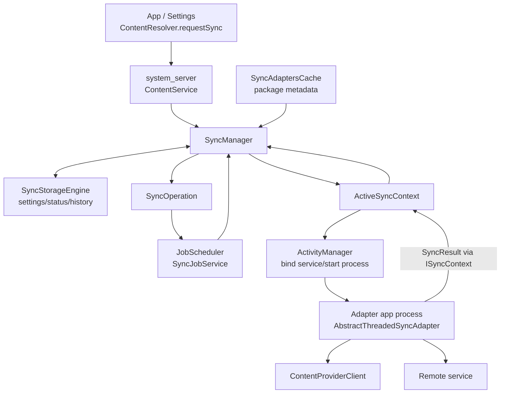
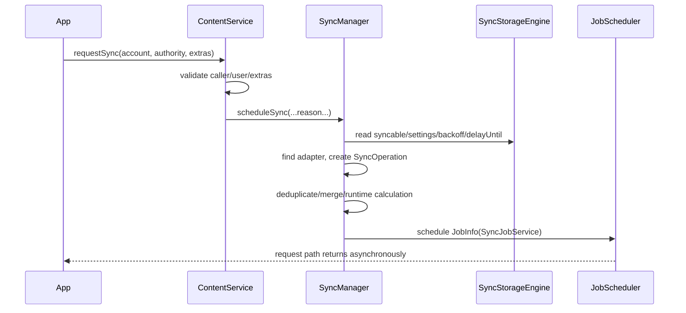
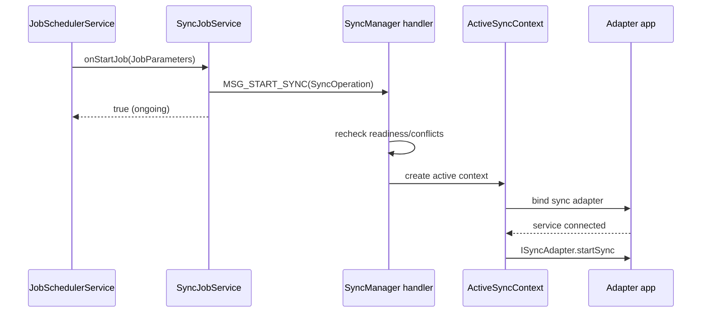

# 45 Android 账户同步、SyncManager、SyncStorageEngine 与 SyncAdapter

> 源码版本：Android 11 / API 30 / `android-11.0.0_r48`  
> 学习方式：macOS 只读源码，不要求编译  
> 前置章节：[13 PMS](./13-PackageManagerService包管理与APK安装.md)、[17 Service](./17-Service与ContentProvider跨进程组件.md)、[43 JobScheduler](./43-AndroidJobSchedulerJobStore与约束控制器.md)

Android Sync Framework 把“某账户的某类数据需要同步”转换为可持久、受网络和后台策略约束的 SyncOperation，再借 JobScheduler 选择执行时机，绑定目标 SyncAdapter 进程调用 `onPerformSync()`。它不是数据库自动复制协议；冲突解决、增量游标、服务端 API 和事务仍由 Adapter 业务实现。

---

## 1. 四种状态

```text
sync enabled/configured
 → SyncOperation scheduled as a Job
 → active SyncContext bound to adapter
 → data reconciled and SyncResult reported
```

“自动同步已开启”不是请求已排队；“正在同步”也不证明本地和服务端最终一致。

---

## 2. 总体架构



`SyncJobService` 在 system_server 协调 Job；应用声明的 sync adapter Service 在 Adapter 应用进程做业务，两者不要混淆。

---

## 3. Android 11 核心源码

```text
frameworks/base/core/java/android/content/ContentResolver.java
frameworks/base/core/java/android/content/IContentService.aidl
frameworks/base/core/java/android/content/SyncRequest.java
frameworks/base/core/java/android/content/SyncAdapterType.java
frameworks/base/core/java/android/content/SyncAdaptersCache.java
frameworks/base/core/java/android/content/AbstractThreadedSyncAdapter.java
frameworks/base/core/java/android/content/ISyncAdapter.aidl
frameworks/base/core/java/android/content/ISyncContext.aidl
frameworks/base/core/java/android/content/SyncResult.java
frameworks/base/core/java/android/content/SyncStatusInfo.java
frameworks/base/services/core/java/com/android/server/content/ContentService.java
frameworks/base/services/core/java/com/android/server/content/SyncManager.java
frameworks/base/services/core/java/com/android/server/content/SyncStorageEngine.java
frameworks/base/services/core/java/com/android/server/content/SyncOperation.java
frameworks/base/services/core/java/com/android/server/content/SyncJobService.java
frameworks/base/services/core/java/com/android/server/accounts/AccountManagerService.java
```

---

## 4. 进程与线程

- requestSync 调用者：App/Settings 进程。
- ContentService、SyncManager、SyncStorageEngine、SyncJobService：`system_server`。
- JobSchedulerService：`system_server`，jobscheduler APEX 代码。
- SyncAdapter：声明它的应用进程。
- `AbstractThreadedSyncAdapter.onPerformSync()`：它创建的后台线程，不是 App 主线程。

业务网络/数据库逻辑不在 system_server 执行。

---

## 5. 三元定位：Account、authority、user

一次同步目标通常由：

```text
Account(name, type)
authority (ContentProvider authority)
userId
```

组成 EndPoint。相同账户名在不同 user 是不同目标；同一账户可为 contacts、calendar 等多个 authority 配不同同步设置。

---

## 6. Account 的角色

AccountManager 保存账户身份和 token 获取机制。SyncManager 使用 Account/type 选择 Adapter 并建立目标，但不会替 Adapter 登录远端服务。

Adapter 应通过 AccountManager 获取/刷新 auth token，并妥善处理认证失效。

---

## 7. authority 的角色

authority 标识要同步的数据域/ContentProvider。Adapter metadata 声明支持的 authority 与 accountType。

authority 不是远端 URL；远端 endpoint 和协议由 Adapter 自己决定。

---

## 8. SyncAdapter 声明

Manifest Service 常见：

```xml
<service
    android:name=".ContactsSyncService"
    android:permission="android.permission.BIND_SYNC_ADAPTER"
    android:exported="true">
    <intent-filter>
        <action android:name="android.content.SyncAdapter" />
    </intent-filter>
    <meta-data
        android:name="android.content.SyncAdapter"
        android:resource="@xml/syncadapter" />
</service>
```

signature 权限让 system_server 绑定；metadata 决定 authority/accountType、userVisible、supportsUploading、allowParallelSyncs 等。

---

## 9. syncadapter XML

```xml
<sync-adapter
    android:contentAuthority="com.example.contacts"
    android:accountType="com.example.account"
    android:userVisible="true"
    android:supportsUploading="true"
    android:isAlwaysSyncable="false"
    android:allowParallelSyncs="false" />
```

这些是能力/策略声明，不是当前 master sync、per-authority enabled 的运行状态。

---

## 10. SyncAdaptersCache

它基于 PackageManager 扫描/缓存 sync adapter services 和 metadata，按 SyncAdapterType 查 component。

包安装、更新、删除或 user 变化会刷新。metadata 声明存在不代表 component 当前 enabled 或包未被停止。

---

## 11. requestSync 入口

```java
Bundle extras = new Bundle();
extras.putBoolean(ContentResolver.SYNC_EXTRAS_MANUAL, true);
ContentResolver.requestSync(account, authority, extras);
```

调用最终经 `IContentService.requestSync()` 到 ContentService。extras 会影响 manual、expedited、upload、ignore settings/backoff 等语义，但特权 flag 受权限限制。

---

## 12. SyncRequest

Builder 可表达一次性或周期同步、account、authority、extras、flex 等。它是请求描述，不是 Adapter Binder。

Android 版本对周期最小间隔、extras 持久性和 flag 组合有限制。

---

## 13. ContentService

ContentService 是 ContentResolver Binder 服务入口，也管理 ContentObserver。requestSync 时它：

- 校验 extras。
- 取 calling UID/package/user。
- 检查跨用户/权限。
- 清除 Binder identity 后调用 SyncManager.scheduleSync。

接受请求不等于 Adapter 已启动。

---

## 14. 请求主链



---

## 15. 自动同步三道开关

通常需要：

1. master sync automatically enabled。
2. account + authority 的 syncAutomatically enabled。
3. target isSyncable 状态允许。

手动/初始化/特权请求可能有不同 override flags。排障不能只看设置页总开关。

---

## 16. isSyncable

常见状态概念：

- >0：可同步。
- 0：不可同步。
- <0：未知/需要初始化。

`isAlwaysSyncable` metadata 可影响初始状态。未知时 SyncManager 可能先安排 initialization sync，让 Adapter 建立状态。

---

## 17. initialization sync

Adapter 收到 `SYNC_EXTRAS_INITIALIZE` 时通常只做轻量初始化，例如检查账户/Provider、设置 isSyncable，而非完整下载所有数据。

如果忽略初始化语义，可能造成首次同步循环或不必要的大流量。

---

## 18. manual sync

manual flag 表示用户主动请求，SyncManager 可推导 ignore settings/backoff 等更积极语义。它不应绕过所有安全、网络、用户停止或组件有效性条件。

用户点击“立即同步”仍是异步调度，不是 UI 线程直接调用 Adapter。

---

## 19. SyncOperation

运行/调度包装包括：

- EndPoint。
- owning/source UID/package。
- reason/source。
- extras。
- periodic/flex。
- expected runtime/jobId。
- allowParallelSyncs。
- exemption/standby 信息。
- retries。

同一目标因 extras/reason 不同可能是不同 operation。

---

## 20. operation key

SyncOperation 生成 key 用于去重/匹配，通常考虑 target 和影响语义的 extras。不是所有 extras 都等价；某些调度控制 extras 可能在 key 中规范化。

重复 requestSync 不必产生等量 Adapter 执行，SyncManager 可合并或替换更晚 Job。

---

## 21. jobId

SyncManager 为 SyncOperation 分配稳定/唯一 jobId，并保存到 JobInfo extras。JobScheduler 中看到的是 system_server 的 SyncJobService job，不是 Adapter package 自己 schedule 的 JobService。

Sync operation key 与 JobScheduler 的 UID+jobId 两层身份不要混淆。

---

## 22. scheduleSyncOperationH

当前源码核心思想：

```text
calculate effective run time from minDelay/backoff/delayUntil
 → find duplicate pending operation
 → keep earlier/more appropriate request, cancel duplicate if needed
 → build JobInfo targeting SyncJobService
 → set network/charging/latency/periodic extras
 → JobScheduler.scheduleAsPackage / schedule
```

方法名 H 表示 handler-thread 路径，避免跨线程直接修改调度状态。

---

## 23. 为什么用 JobScheduler

JobScheduler 提供：

- 持久调度。
- network/charging constraints。
- standby/quota/Doze 协同。
- 重启恢复。
- system_server 统一并发资源。

SyncManager 仍保留同步领域特有的去重、backoff、delayUntil 和 Adapter 生命周期。

---

## 24. SyncJobService

它是 system_server 内承接 JobScheduler callback 的桥：

- `onStartJob()` 解析 SyncOperation，通知 SyncManager handler 启动。
- 标记 job started，监督“Job 已启动但 SyncManager 未接手”的异常。
- `onStopJob()` 通知 SyncManager 停止/重排。
- `callJobFinished()` 回 JobScheduler。

它不执行远端 API 或数据库 merge。

---

## 25. Job 到 SyncManager 时序



Job 约束满足后，SyncManager 仍会重新校验账户、adapter、冲突和 active limits。

---

## 26. 并发控制

SyncManager 区分 regular、initialization 等，并限制 active sync 数量。`allowParallelSyncs=false` 时，同 Adapter/accountType 的冲突 operation 不能并行；true 也要遵守全局并发和同 endpoint 规则。

JobScheduler 给了执行槽，不代表 SyncManager 一定立即启动该 operation。

---

## 27. ActiveSyncContext

表示一次 active attempt，包含：

- SyncOperation。
- start time/history row。
- Adapter service connection/Binder。
- ISyncContext callback stub。
- wakelock。
- timeout/monitor 信息。

它类似一次运行会话，不是持久化配置。

---

## 28. bindToSyncAdapter

SyncManager 找到 component 后通过 `bindServiceAsUser()` 启动/连接 Adapter。失败可能来自 component disabled、包停止、user locked/stopped、进程启动失败或权限/metadata 错误。

绑定成功只得到 ISyncAdapter Binder，业务还未执行。

---

## 29. Service connected

连接回调中 SyncManager 调：

```java
syncAdapter.startSync(
        activeSyncContext,
        operation.target.provider,
        operation.target.account,
        operation.extras);
```

这是当前源码主干的裁剪。`activeSyncContext` 实现 ISyncContext，Adapter 完成后通过它回报 SyncResult。

---

## 30. AbstractThreadedSyncAdapter

它封装 ISyncAdapter Stub，接收 startSync 后：

- 按 account 或统一 key 检查已有 sync thread。
- 若冲突回 `ALREADY_IN_PROGRESS`。
- 创建 SyncThread。
- 获取 ContentProviderClient。
- 调用应用实现的 `onPerformSync()`。
- finally 释放 provider，并 onFinished(SyncResult)。

---

## 31. onPerformSync 线程

与 JobService 不同，`AbstractThreadedSyncAdapter` 为业务创建后台 SyncThread，因此 `onPerformSync()` 不是主线程回调。

但 Adapter Service 的生命周期/绑定回调仍有主线程部分；不要在 Service `onCreate()` 做长工作。

---

## 32. onPerformSync 参数

```java
public void onPerformSync(
        Account account,
        Bundle extras,
        String authority,
        ContentProviderClient provider,
        SyncResult syncResult) { ... }
```

方法通过修改 SyncResult 表达结果，不是返回 boolean。

---

## 33. ContentProviderClient

Framework 为目标 authority 获取 provider client，Adapter 用它查询/插入/更新/删除本地数据。使用 batch/transaction 可减少 IPC并维持一致性。

provider 可能与 Adapter 同进程或跨进程；业务不能假定调用总是本地方法。

---

## 34. 双向同步基本算法

```text
读取本地 dirty/change token
 → 上传本地新增/修改/删除
 → 获取远端增量 cursor/token
 → 在本地事务中 merge
 → 解决冲突
 → 保存新 cursor 和完成标记
 → 填 SyncResult stats/errors
```

Framework 不规定冲突优先级和远端协议。

---

## 35. 增量同步

维护 server cursor、ETag、version 或 last-modified，避免每次全量比较。token 只在本地事务成功后推进，否则崩溃可能跳过未落盘数据。

服务端 token 失效时应能回退完整重建，而不是永久失败。

---

## 36. 幂等性

上传可能发生：服务端已提交、客户端未收到响应、进程死亡、系统重试。使用 operation ID/idempotency key、服务端 upsert 和本地提交日志防重复。

Sync Framework 不提供 exactly-once 网络事务。

---

## 37. SyncResult

包含：

- `stats`：insert/update/delete、IO/auth exceptions 等。
- databaseError。
- tooManyDeletions/retries。
- fullSyncRequested。
- partialSyncUnavailable。
- moreRecordsToGet。
- delayUntil。
- syncAlreadyInProgress。

空的 SyncResult 表示本 attempt 成功完成，不证明业务数据逻辑无 bug。

---

## 38. soft error 与 hard error

概念上：

- soft：IO、临时网络、already in progress，可退避重试。
- hard：认证、解析、database 等需用户/代码修复的错误。

具体字段组合由 `hasSoftError()/hasHardError()` 判断；不要只看一个 exception count。

---

## 39. authentication error

Adapter 可增加 auth exception。SyncManager 记录失败/通知策略并退避；应用通常应刷新 token、提示重新登录或在凭据恢复后主动 requestSync。

无限重试错误密码会浪费电量并触发服务端锁定。

---

## 40. IO error

网络 timeout、服务器 5xx 等可记 IO exception，触发 exponential backoff。业务应区分离线、TLS、DNS、HTTP 和应用层错误，日志不要只写“sync failed”。

JobScheduler 网络约束满足也不证明远端服务可用。

---

## 41. delayUntil

Adapter 可设置服务器建议的下次时间（例如 Retry-After 转换）。SyncStorageEngine 按 endpoint 保存，调度 effective runtime 取 backoff、delayUntil、requested delay 的最大约束。

注意 delayUntil 的时间基准/单位，不能把墙上秒值当 elapsed 毫秒。

---

## 42. backoff

失败后 SyncManager 增加 endpoint backoff，通常指数增长并带抖动/上限。成功后清除或降低 backoff。

新 requestSync 不总会绕过 backoff；manual/ignoreBackoff flag 的权限和语义需看 extras。

---

## 43. maybeRescheduleSync

根据 SyncResult：

- already in progress：短延迟重排。
- too many retries/hard error：可能停止自动重试。
- made progress：允许继续重试剩余工作。
- soft error：按 backoff 重排。
- fullSyncRequested：创建全量 operation。

重试决策是多字段策略，不是 `error()==true` 就统一一分钟后重来。

---

## 44. tooManyDeletions

大量删除可能是服务端/本地 bug或错误账户，Framework 可要求用户确认，避免灾难性删除扩散。

Adapter 要准确填写 deletion stats；随意忽略保护会造成数据损失。

---

## 45. cancelSync

取消主链：

```text
ContentResolver.cancelSync
 → ContentService/SyncManager
 → 取消匹配 pending Job
 → 对 active context 调 ISyncAdapter.cancelSync
 → SyncThread interrupt
 → cleanup/jobFinished/history
```

interrupt 是协作式取消；网络库和业务循环要响应，否则线程可能继续。

---

## 46. cancel 竞态

Adapter 正在写本地事务时取消：应让事务完成或安全回滚，再回报。SyncManager 可能已认为 context 停止，因此过期 onFinished 需被防重处理。

取消不保证远端已经收到的请求撤销。

---

## 47. SyncStorageEngine

持久化/管理：

- authorities/account/user sync settings。
- master sync flag。
- isSyncable。
- periodic sync definitions（兼容/状态）。
- backoff、delayUntil。
- pending/active/status/history。
- day statistics。

它是状态数据库，不执行网络同步。

---

## 48. settings 与 status 分开

- settings：用户/系统希望怎样同步。
- status：上次成功/失败、pending、统计等运行结果。

“上次同步失败”不会自动等于 syncAutomatically 被关闭。

---

## 49. 历史记录

SyncManager 在开始时插 history，结束时写 elapsed、source、result/error、downstream/upstream activity。可用于 Settings 展示和 dumpsys。

历史记录不是业务级审计日志，可能受数量/时间裁剪。

---

## 50. 周期同步

周期 SyncOperation 借 JobScheduler periodic/flex 执行。它不保证固定钟点；网络、Doze、standby、quota 和冲突会调整。

周期到期时若已有同目标 one-shot，可合并/延后，避免重复工作。

---

## 51. 上传触发

ContentProvider 可在 `notifyChange(uri, observer, syncToNetwork=true)` 后请求上传同步，前提是 Adapter supportsUploading、设置和 syncable 允许。

notifyChange 本身不携带变更数据；Adapter仍需从本地 dirty/change log 找内容。

---

## 52. ContentObserver 与 SyncAdapter

ContentObserver 是本地变更通知，SyncAdapter 是账户/authority 数据同步。两者可连接但不是同一机制。

Observer callback 不应直接做大网络同步，可触发 requestSync 让系统择机执行。

---

## 53. 用户解锁

账户和凭据可能在 CE storage，user locked 时 Adapter/Provider不可用。SyncManager 跟踪 user lifecycle，解锁后再恢复调度。

directBootAware metadata 也不能自动让所有账户 token 和业务数据库在锁屏前可用。

---

## 54. 多用户与工作资料

同一账户名在不同 user/profile 隔离，policy 可由 DevicePolicyManager 控制。工作资料暂停时其 sync 停止，个人区 operation 不应代替执行。

排障记录完整 userId/accountType/authority。

---

## 55. 包更新与 Adapter 变化

SyncAdaptersCache 监听包变化。Adapter component 消失、metadata 改变或签名/权限问题会使 pending operation 无法绑定，SyncManager需取消或重排。

Job 仍在不代表 Adapter 仍可解析。

---

## 56. 网络策略交互

JobScheduler connectivity constraint、Data Saver、UID network policy、VPN、metered 状态共同影响。Adapter package UID 被限制时，即便 system_server 的 SyncJobService 已开始，业务 socket 仍可能失败。

检查 system_server job 和 Adapter UID 网络规则两个层次。

---

## 57. 电源与 Standby

Sync Job 受 Doze、App Standby、JobScheduler quota 和 exemption flag 影响。用户主动 sync 可能获得更积极待遇，自动后台 sync 则被批处理。

自动同步不是后台常驻轮询器。

---

## 58. wakelock

ActiveSyncContext 在绑定和 active sync 期间持适当 wakelock/归因，避免 CPU 睡眠。Adapter onFinished/cancel 后应立即清理。

业务线程若脱离 SyncThread 并提前 onFinished，将失去系统同步生命周期保护。

---

## 59. 超时与监控

SyncManager 监控 active sync 是否有进展/超时，JobService 也监督 Job start 后 SyncManager 是否接手。卡死 Adapter 可被取消、断开并增加 backoff。

具体 timeout 是实现配置，不应成为业务协议假设。

---

## 60. 典型时间线

| 时间 | 事件 | 尚不能证明 |
|---|---|---|
| 10:00:00 | requestSync 返回 | Job 已运行 |
| 10:00:00.1 | SyncOperation Job 入队 | 网络约束满足 |
| 10:03:00 | SyncJobService onStartJob | Adapter 已绑定 |
| 10:03:00.2 | ISyncAdapter.startSync | 业务 merge 完成 |
| 10:03:05 | onPerformSync 返回 clean result | 远端与本地永远一致 |
| 10:03:05.1 | history/jobFinished | 本 attempt 完成 |

---

## 61. “点击同步但没反应”分层

| 层 | 检查 |
|---|---|
| 请求 | ContentService 权限、account/authority/extras |
| 配置 | master、auto、syncable、user unlocked |
| Adapter | metadata/cache/component/package |
| operation | key、duplicate、backoff、delayUntil |
| Job | pending/constraints/quota/standby |
| active | conflict/concurrency/bind/startSync |
| business | token/network/provider/SyncResult |

---

## 62. “不断重复同步”

检查 SyncResult IO/auth counts、backoff 是否被 ignore、moreRecords/fullSync、notifyChange upload 环、未清 dirty flag、onFinished 前崩溃和幂等性。

Adapter 写 provider 后若又触发 upload sync，需用 observer syncToNetwork flag/业务标记避免反馈环。

---

## 63. “显示成功但数据没变”

空 SyncResult 只代表 Adapter没报告错误。检查增量 token是否过早推进、provider transaction、错误被吞、错误账户/authority、服务端响应语义和冲突策略。

Framework 无法验证业务数据一致性。

---

## 64. dumpsys 与 shell

```bash
adb shell dumpsys content
adb shell dumpsys jobscheduler
adb shell dumpsys account
adb shell dumpsys package <adapter.package>
```

重点关联 account/user/authority、pending/active/history、Sync Job jobId 和 Adapter component。敏感账户/token 不应复制到公开日志。

---

## 65. 源码路线一：请求

```text
frameworks/base/core/java/android/content/ContentResolver.java
frameworks/base/core/java/android/content/IContentService.aidl
frameworks/base/services/core/java/com/android/server/content/ContentService.java
frameworks/base/services/core/java/com/android/server/content/SyncManager.java
```

练习：从 requestSync 追 calling identity、reason、settings 检查和 operation 创建。

---

## 66. 源码路线二：存储

```text
frameworks/base/services/core/java/com/android/server/content/SyncStorageEngine.java
frameworks/base/services/core/java/com/android/server/content/SyncOperation.java
frameworks/base/core/java/android/content/SyncStatusInfo.java
```

练习：区分 settings/status/history/backoff/delayUntil 与 operation key。

---

## 67. 源码路线三：Job 桥

```text
frameworks/base/services/core/java/com/android/server/content/SyncManager.java
frameworks/base/services/core/java/com/android/server/content/SyncJobService.java
```

练习：追 scheduleSyncOperationH 构建 JobInfo，到 Job callback 再回 SyncManager handler。

---

## 68. 源码路线四：Adapter 绑定

```text
frameworks/base/core/java/android/content/SyncAdaptersCache.java
frameworks/base/services/core/java/com/android/server/content/SyncManager.java
frameworks/base/core/java/android/content/ISyncAdapter.aidl
frameworks/base/core/java/android/content/ISyncContext.aidl
```

练习：追 ActiveSyncContext bind、service connected、startSync 和 onFinished。

---

## 69. 源码路线五：业务线程

```text
frameworks/base/core/java/android/content/AbstractThreadedSyncAdapter.java
frameworks/base/core/java/android/content/SyncResult.java
```

练习：找 SyncThread 创建、provider acquire/release、cancel interrupt 与 result 回报。

---

## 70. 八组只读练习

1. **四态图**：configured、scheduled、active、finished。
2. **目标表**：account/type/authority/user/component。
3. **三开关图**：master、automatic、syncable。
4. **去重纸算**：相同 endpoint 不同 extras。
5. **Job 桥图**：SyncOperation ↔ JobInfo。
6. **绑定图**：ActiveSyncContext 到 Adapter SyncThread。
7. **结果表**：soft/hard/delayUntil/backoff。
8. **故障表**：不执行、循环、假成功。

---

## 71. 初学者易混淆的十二点

1. 自动同步开启不等于已有 operation。
2. requestSync 返回不等于 Adapter 已运行。
3. SyncJobService 与 Adapter Service 不是一个服务。
4. authority 不是远端 URL。
5. SyncOperation job 属于 system_server 桥接调度。
6. Job ready 后 SyncManager 仍会二次校验。
7. onPerformSync 在 SyncThread，不是主线程。
8. SyncResult 是可变输出参数，不是返回值。
9. 空 SyncResult 不证明数据逻辑正确。
10. backoff 与 delayUntil 是两类延迟来源。
11. cancelSync 的 interrupt 是协作式。
12. Sync Framework 不保证 exactly-once 或冲突解决。

---

## 72. 自测题

1. 同步 EndPoint 由什么组成？
2. SyncAdaptersCache 如何找到 Adapter？
3. master/auto/isSyncable 如何配合？
4. SyncOperation 与 JobInfo 有何关系？
5. SyncJobService 做业务同步吗？
6. ActiveSyncContext 表示什么？
7. onPerformSync 在哪个线程？
8. SyncResult 如何回到 SyncManager？
9. soft 与 hard error 有何差异？
10. backoff 与 delayUntil 如何共同限制时间？
11. 为什么 Adapter 必须幂等？
12. “成功但数据没变”应查哪层？

---

## 73. 参考答案

1. account、authority、userId。
2. 扫描声明 SyncAdapter action/metadata 的 Service，以 accountType+authority 匹配 component。
3. 自动请求通常三者都允许；manual/init 等有特定 override。
4. SyncManager 把 operation 编码成指向 SyncJobService 的 Job，Job 到期再恢复 operation。
5. 不，它只把 Job callback 交回 SyncManager。
6. 一次 active attempt 的 Binder、wakelock、history、operation 会话。
7. AbstractThreadedSyncAdapter 创建的后台 SyncThread。
8. SyncThread 调 ISyncContext.onFinished(SyncResult)。
9. soft 可退避重试；hard 通常需认证/配置/代码修复。
10. effective earliest time 通常受二者以及请求 delay 的最大值约束。
11. 远端提交与本地回执间崩溃会造成重复执行。
12. Adapter 增量 token、业务 merge/provider transaction 和错误报告，而非只看 Framework history。

---

## 74. 最终主线

```text
ContentResolver.requestSync / auto/content/periodic trigger
 → ContentService 校验 caller/user/extras
 → SyncManager 根据 account+authority+user 查 Adapter 与 sync settings
 → 创建/去重 SyncOperation，结合 backoff/delayUntil
 → 构建指向 system_server SyncJobService 的 JobInfo
 → JobScheduler 等待网络、Doze、standby、quota 与并发
 → SyncJobService 回调 SyncManager handler
 → 二次校验并创建 ActiveSyncContext
 → bind Adapter component，ISyncAdapter.startSync
 → AbstractThreadedSyncAdapter 的 SyncThread 调 onPerformSync
 → Adapter 访问 Provider/远端并填写 SyncResult
 → ISyncContext.onFinished
 → SyncManager 写 status/history，清 backoff或按结果重试，jobFinished
```

面对同步故障，先确认目标三元组和 Adapter component，再看三道开关、operation/job、约束与 backoff、active bind 和 SyncResult，最后才进入业务 token、Provider 和远端协议。这样能把 Framework 调度问题与数据同步算法问题清楚分开。
