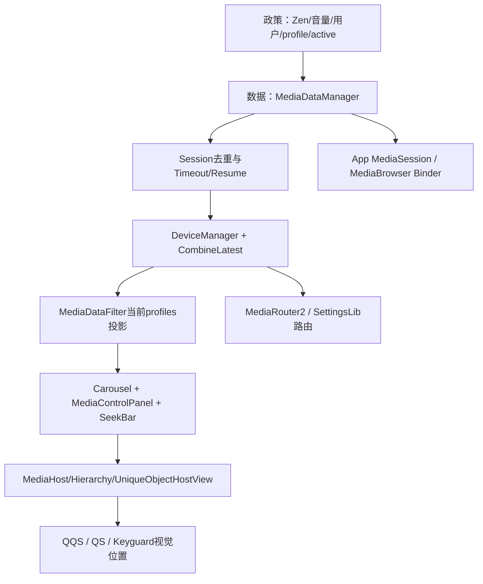
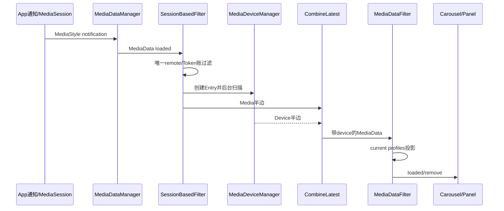

# 第 450 章 Android SystemUI 第431—449章阶段复盘：通知策略、媒体管线与故障导航

> 源码基线：Android 11 / API 30 / `android-11.0.0_r48`。本章只在 macOS 阅读与交叉核对源码，不编译。本章复盘第431—449章，并以本地源码、单测和结构审计为依据建立后续排障导航。

## 1. 本章不是简单目录

前19章已分别拆开DND、音量和媒体子系统；本章把它们重新拼成“政策输入→状态账→异步事实→UI投影→跨Host几何”五层，并给出从症状反查源码的入口。

## 2. 阶段覆盖范围

431是DND通知政策，432是系统音量控制；433给媒体总览，434—449依次深入输出路由、SeekBar、Carousel、绑定、材质、锁屏Host、唯一View几何、恢复、超时、Session过滤、设备合流和多用户投影。

## 3. 为什么把 DND 与媒体放在一阶段

它们共同展示SystemUI的核心定位：SystemUI通常不拥有底层事实，只接收system_server/App的状态，施加展示政策，发控制请求，再等待回调收敛。

## 4. 第一条学习主线：请求不等于完成

DND setZen、音量setStreamVolume、Media seekTo、route transfer、resume play都只是请求。可靠UI必须以Zen回调、Audio状态、PlaybackState、onTransferred或新MediaData作为完成事实。

## 5. 第二条主线：一个界面有多本账

媒体至少有Manager mediaEntries、Session Filter Token账、Device Entry、CombineLatest Pair、Profile投影、Carousel players和Hierarchy位置账。名称相近不代表同一权威。

## 6. 第三条主线：身份必须分层

通知key定位一次通知，packageName定位恢复卡，MediaSession.Token定位会话，MediaDevice id定位route，userId定位用户，Host location定位视觉容器。混用会制造错删、错绑和迟到覆盖。

## 7. 第四条主线：线程切换不是实现细节

媒体解析/设备扫描/Session过滤在后台，UI与末端投影在主线程，Binder回调又有自己的Handler。每次post都会产生旧代任务晚到的可能。

## 8. 第五条主线：可见性不是单个 boolean

一张卡可存在于Manager却未合流，可已合流却不属于当前profile，可属于profile但active=false，可Host可见却唯一mediaFrame仍在overlay动画中。

## 9. 五层架构

政策层决定是否显示/允许；数据层维护媒体与Token；事实合流层加入设备/用户；交互层绑定按钮与手势；几何层在QQS/QS/锁屏间移动唯一View。

## 10. 阶段全景图



## 11. 第431章的核心：Zen不是一个开关

Tile只显示boolean，但底层有OFF、IMPORTANT、ALARMS、NO_INTERRUPTIONS，manual rule和多个automatic rule共同生成consolidated policy，再由音频/AppOps/视觉执行面消费。

## 12. DND 三个入口并不等价

主点击关闭时直接OFF，开启时走onboarding/prompt/forever/countdown；secondary先启Zen再展示详情；Detail toggle常直接forever。排障必须先问用户从哪个入口操作。

## 13. DndTile 源码锚点

```java
protected void handleClick() {
    if (mState.value) {
        mController.setZen(ZEN_MODE_OFF, null, TAG);
    } else {
        showDetail(true);
    }
}
```

这个短方法把复杂性全部推给showDetail和ZenModeController，不能仅据它判断最终持续时间。

## 14. DND 最重要的r48边界

DndTile重写showDetail却不调用父实现，且忽略show参数；子/父详情显示状态可能断开，使自动规则摘要刷新门长期错误。读框架时要比较override与父类协议。

## 15. DND 排障入口

“Tile状态错”先查ZenModeController回调；“持续时间错”查ZEN_DURATION与Condition id；“详情不刷新”查showDetail/isShowingDetail两套字段；“仍有声音”查consolidated policy执行面。

## 16. 第432章的核心：音量是双向状态机

音量键经AudioService选择stream/alias并修改状态，IVolumeController Binder把State推回SystemUI；Dialog slider请求又回AudioService，最终仍等反向状态确认。

## 17. VolumeUI 只负责装配

```java
public void start() {
    boolean enableVolumeUi = mContext.getResources().getBoolean(R.bool.enable_volume_ui);
    boolean enableSafetyWarning =
            mContext.getResources().getBoolean(R.bool.enable_safety_warning);
    mEnabled = enableVolumeUi || enableSafetyWarning;
    if (!mEnabled) return;
    mVolumeComponent.setEnableDialogs(enableVolumeUi, enableSafetyWarning);
    setDefaultVolumeController();
}
```

真正stream状态、Dialog和Binder逻辑在VolumeDialogController/Component，而非VolumeUI类名本身。

## 18. 音量的三个关键时间窗口

首按可因Dialog尚不可见而抑制反馈；slider tracking期间用户值优先；松手后保留约一秒grace再接受服务端回值，避免滑块跳回。

## 19. 音量排障入口

“按键无Dialog”查SHOW_UI flags与AOD门；“滑块跳”查tracking/requested/grace；“远端行残留”查dynamic stream remove；“配置变化后状态怪”查dismiss与mShowing是否同步。

## 20. DND与音量的共同教训

SystemUI展示状态通常是底层状态copy，而非直接读取View；控制请求和事实回调之间必须允许短暂不一致。把View值当系统真相会误判。

## 21. 第433章提供的媒体总骨架

通知进入MediaDataManager异步提取Token、metadata、Artwork和actions，再经Session过滤、设备合流、profile过滤、Carousel/Panel，最后由Hierarchy把唯一mediaFrame放到一个Host。

## 22. MediaDataManager 内部接线是权威导航

```kotlin
addInternalListener(mediaTimeoutListener)
addInternalListener(mediaResumeListener)
addInternalListener(mediaSessionBasedFilter)
mediaSessionBasedFilter.addListener(mediaDeviceManager)
mediaSessionBasedFilter.addListener(mediaDataCombineLatest)
mediaDeviceManager.addListener(mediaDataCombineLatest)
mediaDataCombineLatest.addListener(mediaDataFilter)
```

遇到卡片问题时沿这条顺序追，比按文件名猜测更可靠。

## 23. Pending LOADING 的意义

通知到达先用key放占位，再后台解析；后续remove可能先发生。所有后台完成回写都必须确认key/条目仍有效，否则旧任务会复活或覆盖新生命周期。

## 24. 三类媒体 key

通知key服务于活跃通知，packageName服务于恢复卡，Token服务于Session。live→resume和resume→live会迁移Map key，不是简单字段切换。

## 25. active、isPlaying、resumption 三者

active决定active-only Host；isPlaying用于排序/状态；resumption表示历史恢复形态。暂停十分钟内isPlaying=false而active=true，历史卡可两者都false。

## 26. 第434章：输出Dialog是控制面

MediaOutputDialog把LocalMediaManager设备、RoutingSession selected/selectable/deselectable routes和音量组合成列表；connect返回请求结果，onTransferred才是路由成功事实。

## 27. route 与 device 身份

MediaDevice是SettingsLib展示/操作包装，RouteInfo代表MR2 route，RoutingSession代表一次客户端会话。相同名字不代表相同对象，分组操作尤其要按id集合判断。

## 28. 输出Dialog排障入口

“点击不切换”查connect请求与onTransferred；“组设备不对”查selected/selectable/deselectable；“音量错”区分route volume和session volume；“关闭不了”区分普通/组Dialog Factory引用。

## 29. 第435章：两个输出chip链

旧通知seamless chip按NotificationContentView创建Manager且默认feature关闭；QS媒体卡chip来自MediaDeviceManager合流。两者共享输出Dialog，不共享扫描生命周期。

## 30. Chip可信度政策

QS链有Token时必须找到RoutingSession才接受LocalMediaManager current device；没有Token时best-effort。这个政策在第447章被逐行证实。

## 31. 第436章：SeekBar不是直接读 position

用PlaybackState基准position、speed、lastUpdateTime与elapsedRealtime推算；只在展开、非拖动且播放类状态时每100ms轮询。

## 32. Seek能力和进度显示分开

duration/position可显示不等于ACTION_SEEK_TO可用；Observer区分禁用细线、只读进度和可拖动三态。

## 33. Seek排障入口

“进度不走”查listening、playback state和poll任务；“不能拖”查ACTION_SEEK_TO；“松手跳回”查seekTo后清旧state与App回调；“离屏耗电”查Carousel整体expanded门。

## 34. 第437章：Carousel有两套横向坐标

relativeScrollX控制分页，mediaContent.translationX控制边缘侧滑；把两者混在一起会误判页吸附、删除阈值和RTL。

## 35. 媒体事件主时序



## 36. Carousel排序四级

playing优先、local优先、live优先、最后按最近更新时间；TreeMap SortKey若完全相同会覆盖，r48缺少key最终tie-breaker。

## 37. Carousel Swipe不是删除

整体侧滑调用onSwipeToDismiss，把当前profiles所有key设timedOut/active=false。Manager条目和inactive恢复卡可能仍在，完整QS的hasAny仍为true。

## 38. 第438章：卡内与Host间是两级动画

MediaViewController在collapsed/expanded Constraint端点间插值控件；MediaHierarchyManager在QQS/QS/锁屏Host矩形间移动整个Carousel。不能用一套progress解释两层。

## 39. TransitionLayout 的目标与当前尺寸

目标measure尺寸稳定父布局，currentState视觉尺寸用于连续变形/裁剪。GONE控件有专用20%淡入淡出窗口，不只是普通alpha线性插值。

## 40. 第439章：attach 与 bind 分开

attach安装长期Outline、SeekBar观察和固定监听；bind反复写文本、Artwork、设备chip、actions和guts。复用View时每个bind分支都必须清旧状态。

## 41. 绑定类问题的典型症状

null clickIntent不清旧listener会点进上一App；空action槽不清旧Drawable/listener会残留按钮；Artwork缺失不清旧图会串卡。排障先找“else清理”而非只看设置分支。

## 42. 第440章：材质动画也是状态机

IlluminationDrawable做370ms背景换色，LightSourceDrawable按pressed/focused/hovered做热点与800ms扩散；它们有独立Animator和dirty bounds。

## 43. 材质排障入口

“颜色跳”查HSL亮度0.85分支；“波纹被裁”查dirty bounds与TransitionLayout clip；“焦点高光不恢复”查UP/CANCEL共享收尾；“崩溃”查null tint强制解引用。

## 44. 第441章：锁屏可见有四层

MediaDataFilter是否有当前active数据、MediaHost visible、Header View visibility、唯一mediaFrame实际parent必须分别检查。任一层为false都可能“看不到”。

## 45. 三个 Host 不是三份卡

LOCKSCREEN、QQS、QS各有UniqueObjectHostView占位，但只存在一个mediaFrame。Hierarchy在Host或root overlay之间重挂它。

## 46. 第442章：Hierarchy 三位置账

previousLocation、desiredLocation、currentAttachmentLocation分别表示历史、政策目标和真实parent；动画还有start/target/current三矩形。

## 47. 两类跨Host过渡

QQS→QS可由panel expansion guided progress直接插值；其他转换用ValueAnimator推进根bounds并让每张卡内部同时变形。

## 48. 睡眠/Doze为何冻结位置

goingToSleep、fullyAwake、dozeAnimationRunning等门避免不可见/半醒状态中把唯一View搬到不稳定Host；恢复时再无动画收敛。

## 49. Hierarchy 排障入口

“卡消失”查真实parent/overlay；“位置跳”查start/target bounds与padding坐标；“动画不结束”查pending post、Animator cancel listener；“锁屏错位”查statusbarState preChange与Doze端点。

## 50. 第443章：空 Host 也必须会测量

只有一个Host持有mediaFrame，另外两个仍要提前给Hierarchy目标Rect。因此UniqueObjectHostView通过MediaHostStatesManager预测Carousel最大尺寸。

## 51. 测量三本账

父MeasureSpec、扣padding后的MeasurementInput、Controller汇总MeasurementOutput分别属于Host外部约束、内容输入和预测结果。

## 52. 当前 Host 为何还调用 super

它需要真实测量child内部，但最终Host measuredWidth/Height仍被统一缓存输出覆盖，以保证三个候选Host几何一致。

## 53. 快速重挂的条件

child和Host已有非零宽、requiresRemeasuring=false时使用addViewInLayout免requestLayout，并手动resolve RTL和layout。它是媒体专用协议，不是通用ViewGroup技巧。

## 54. 几何总图


## 55. 几何层的共同假设

Controller集合、HostState、requiresRemeasuring与parent重挂必须在主线程有序更新；任何一项缓存旧代都会造成目标尺寸和真实child不一致。

## 56. 第444章：恢复链分四阶段

活跃卡发现同包MediaBrowserService；testConnection验证EXTRA_RECENT首项playable；成功给活跃卡补resumeAction并存组件；用户解锁后findRecentMedia才新建历史卡。

## 57. 恢复卡不是保存歌曲文件

Preferences保存最多五个MediaBrowserService ComponentName。解锁时重新问应用“最近媒体是什么”，描述可能变化。

## 58. test/find 的 onConnected 不是成功终点

它只证明连接和root有效；必须等subscribe children且第一项playable的addTrack，才能保存组件或生成恢复卡。

## 59. restart 的双重播放命令

ResumeMediaBrowser.restart内部已经prepare/play，Listener成功Callback又创建Controller重复prepare/play。两份局部单测各自通过，却没覆盖组合调用次数。

## 60. 恢复链最大风险是共享 browser

不同包验证、用户点击和媒体更新共用一个可变字段；旧Callback可断开/读取新实例，且异步任务没有user generation，旧用户结果可写新用户Preferences。

## 61. 第445章：Timeout是二值边沿状态机

PlaybackState被压成playing/non-playing；首次false安排十分钟，同类false不续期，true取消并active=true，到期只active=false。

## 62. Timeout不做什么

不删除MediaData、不stop Session、不持久化deadline。SystemUI重启后从现场状态重新给完整十分钟。

## 63. key迁移为何不延长超时

复用同一PlaybackStateListener和cancellation；延迟闭包执行时读取可变listener.key，迁移后自然命中新key。

## 64. Timeout 同 key 风险

已有key立即return，不比较Token。相同通知key换Session后仍监听旧Controller，旧Session状态可控制新卡active。

## 65. 第446章：Session过滤需要双证据

同包恰好一个remote Controller只是第一证据；remote Token还必须曾随MediaData loaded进入账，才压掉local更新。

## 66. Session过滤放行公式

```kotlin
if (isMigration || remote == null || remote.sessionToken == info.token ||
        !tokensWithNotifications.contains(remote.sessionToken)) {
    dispatchMediaDataLoaded(key, oldKey, info)
} else {
    // 吞掉local；不同key时再removed
}
```

## 67. 同 key 与不同 key 的策略

同key历史含remote Token时只吞local loaded，避免removed误删remote卡；不同key则补发removed(localKey)清悬挂本地卡。

## 68. Session过滤账本并不精确

tokensWithNotifications不在MediaData removed时删Token，还会纳入resumption；keyedTokens只add历史。remote Session仍active时陈旧证据可长期过滤local。

## 69. null Token 崩溃点

待过滤MediaData token=null时不一定创建keyedTokens[key]，后面`keyedTokens.get(key)!!`可NPE。类型允许null，单测却全用非空Token。

## 70. 第447章：Device可信门

Entry用LocalMediaManager拿current device；有Controller时还要求MR2能返回RoutingSession，否则输出disabled MediaDeviceData；无Token直接best-effort接受device。

## 71. Device Entry 的生命周期

start/stop都post后台。start注册扫描、Controller callback、取初值；stop注销资源，但主线程Map已立即替换/删除。

## 72. started 字段的反直觉

current setter条件是`!started || value!=field`，用未started强制初始帧；stop把started=false后，迟到回调也被强制发布。

## 73. 旧设备覆盖新设备

Token A Entry stop、新Token B Entry start后，A已排前台任务或在途callback仍能以同key写DeviceData；没有`entries[key]===this`或generation校验。

## 74. 同ID设备属性不刷新

MediaDevice.equals只比较id，名称/图标/state变化不触发current setter。两个设备回调单测又未先drain初始fg任务，不能证明同ID更新发布。

## 75. 第448章：CombineLatest的精确定义

每key Pair保存Media和Device最新半边，两者非null才输出；disabled Device对象仍是就绪，null才阻止合流。

## 76. key迁移由第一半完成

Media或Device谁先携oldKey，谁删除old Pair、搬另一半并报告真实oldKey；第二半到达时old已空，规范为同key更新。

## 77. 任一 remove 删除整对

onMediaDataRemoved和onKeyRemoved共用remove；第一个发removed并清Pair，第二个静默，Map存在性实现去重。

## 78. CombineLatest 没有代次

同key Media B到达会立即搭配Device A输出，直到新Entry异步给Device B；remove后旧Media/Device两半迟到还可让卡复活。

## 79. 第449章：末端双账投影

allEntries保存所有用户最终合流数据，userEntries只含current profiles。hasActive/hasAny与Swipe都读userEntries。

## 80. 为什么 current profile 而非 userId

工作资料媒体也应在当前用户界面显示，USER_ALL也需通过。LockscreenUserManager维护统一profiles政策。

## 81. 用户切换不是差分

先clear userEntries并逐项removed，再遍历allEntries按新profiles逐项loaded(oldKey=null)。USER_ALL和两边共同profile也会remove/add一次。

## 82. handleUserSwitched 的 id 未使用

结果完全依赖LockscreenUserManager缓存；post只是等待其更新。缓存若仍旧，Filter会重建错误投影且不校验参数。

## 83. 跨用户同 key 的根问题

allEntries只按字符串key，后台同包恢复卡可覆盖前台全量值，却因profile过滤不更新userEntries；两本账分裂，后续remove可误删前台卡。

## 84. 从卡片“不见了”反查

依次查Manager是否有key、SessionFilter是否吞loaded、Device/Combine是否两半齐备、Profile是否当前、active查询、Carousel player、Host visible、mediaFrame parent。不要第一步就改View visibility。

## 85. 从卡片“重复了”反查

查remote/local Token与key是否同一、remote通知是否先到、不同key合成remove是否执行、oldKey迁移是否只一次、SortKey是否覆盖/重排、用户同包key是否冲突。

## 86. 从卡片“设备错了”反查

查MediaData Token、Entry generation、LMM current id、MR2 RoutingSession、Combine Pair里的Device是否旧代，以及同ID属性更新是否被equals抑制。

## 87. 从卡片“暂停后不隐藏”反查

查PlaybackState是否属于non-playing集合、Timeout cancellation是否存在、系统属性时长、key是否迁移、Manager active是否已经false、Host是否showsOnlyActiveMedia。

## 88. 从卡片“恢复点一次行为异常”反查

查组件是否唯一/可连接、EXTRA_RECENT第一项playable、共享browser当前属于谁、用户generation、restart与Listener是否双发prepare/play、成功后是否disconnect。

## 89. 从卡片“动画跳动”反查

先分卡内Constraint插值还是Host间根bounds；再查Host预测尺寸、current/target Rect、overlay坐标、requiresRemeasuring、Animator pending/cancel和真实parent。

## 90. 从“切用户串卡”反查

核对MediaData.userId、恢复Preferences key、异步任务启动user、allEntries/userEntries同key对象、Lockscreen profiles缓存与handle执行代次。

## 91. 跨章节竞态一：Token替换

Manager新MediaData先进入Filter/Combine，DeviceManager异步重建；Timeout同key又不重绑Controller。短窗口内标题属于Token B，设备和超时状态可能仍属于A。

## 92. 跨章节竞态二：remove 与迟到设备

DeviceManager onKeyRemoved使Combine清Pair；旧Entry start/回调随后发Device半边，若旧Media解析也迟到，Combine可重新齐备并复活已删卡。

## 93. 跨章节竞态三：用户切换与恢复

MediaResumeListener旧用户browser回调读最新currentUserId，可能向新用户Manager/Preferences写结果；末端Filter再按新profile接受，形成真正串用户卡。

## 94. 跨章节竞态四：Swipe 与 playing

Swipe直接active=false，但TimeoutListener内部playing仍true/timedOut未变；相同PLAYING回调被二值去重，卡不会自动重新active。

## 95. 跨章节竞态五：迁移 oldKey

Timeout复用listener并动态读newKey；SessionFilter搬Token集合；DeviceManager重建Entry保存oldKey；Combine只让第一半真正迁移。四处必须对同一rename达成一致。

## 96. r48最常见的设计模式

“先缓存，再异步补另一事实”“先发请求，再等回调”“用Map存在性去重”“用可变字段让延迟任务跟随迁移”“用主Looper串行代替锁”。

## 97. 这些模式何时失效

key被重用、Token改变但key不变、任务缺generation、回调注销后仍迟到、用户维度未入key、listener异常中断或两个执行域交错时。

## 98. 单测阅读的第一问

Executor队列是否在断言前drain？若未drain，verify never可能只是任务尚未执行；pending数量也可能来自初始化遗留而非刚触发路径。

## 99. 单测阅读的第二问

mock是否始终返回同一个对象？MediaDeviceManager用同一LMM/device掩盖多Entry与equals问题，SessionFilter用同步callback掩盖乱序。

## 100. 单测阅读的第三问

测试是否只覆盖局部类？ResumeBrowser和ResumeListener各自测试都通过，却漏掉组合双重play。需要集成时序用例。

## 101. 单测阅读的第四问

nullable生产类型是否被测试？SessionFilter与恢复/设备链多处允许null Token，但happy path统一非空会漏掉`!!`崩溃。

## 102. 单测阅读的第五问

是否覆盖remove后的迟到回调、A→B代次和用户切换？没有这些就不能把“注销成功”当作“旧事件绝不会再来”。

## 103. 阶段结构审计范围

本次实际扫描`431-*.md`至`449-*.md`，逐篇确认文件唯一存在、README有且仅有一个链接、二级编号序列严格1—120。

## 104. 图与练习审计结果

19篇每篇恰有3个Mermaid代码块；第112—115节均恰好四个、且标题以“macOS只读练习”开头。

## 105. 连续性审计结果

431—449无缺号、无重复文件；README表格连续到449，00-学习进度在写本章前的权威断点为449并指向450阶段复盘。

## 106. 审计不能证明什么

结构通过不等于每个解释永远正确。准确性仍以r48本地源码和单测交叉复读为证；未来切换Android版本时必须重新核对，不能把章节当最新平台文档。

## 107. 本阶段应形成的源码阅读习惯

先定位权威Map/字段，再标线程与回调，画身份迁移，列请求/事实，最后读测试的队列与mock。不要先从UI现象猜结论。

## 108. 一张卡的最短排查链

`MediaDataManager.mediaEntries → MediaSessionBasedFilter → MediaDeviceManager Entry → CombineLatest Pair → MediaDataFilter.userEntries → MediaPlayerData → Panel/Hierarchy`。

## 109. 一次控制动作的最短排查链

`View listener → Controller/Manager请求 → Binder到App/system_server → 回调事实 → MediaData/Device更新 → 主线程重新绑定`。

## 110. 一次动画的最短排查链

`StatusBar/QS/Doze政策 → desiredLocation → HostState/目标尺寸 → overlay或guided progress → currentBounds → 重挂mediaFrame`。

## 111. 下一阶段如何避免重复

451以后不再重新泛讲媒体总览，而应选择未覆盖的SystemUI子系统或沿现有链进入更底层服务；每章继续明确与431—450哪一层连接。

## 112. macOS只读练习一：完整追一张媒体卡

从MediaStyle通知key开始，依次写出每层Map的key、value和线程，直到MediaControlPanel.bind；在每个异步边界标一个可能迟到的旧任务。

## 113. macOS只读练习二：推演投屏去重

设计remote先到/local后到且不同key的时序，写出tokensWithNotifications、keyedTokens、Device Entry和Combine Pair，解释何时local removed、remote卡为何保留。

## 114. macOS只读练习三：推演用户切换恢复

用户0有暂停恢复卡、用户10有同包卡；让用户0 browser回调迟到到切换后。标出Preferences、Manager key、allEntries/userEntries各自可能被谁覆盖。

## 115. macOS只读练习四：审查一个异步单测

选择MediaDeviceManager的deviceListUpdate测试，列出bg/fg队列每个任务；先不看注释，只用队列证明断言消费的是初始化帧还是新回调帧。

## 116. 阶段改进优先级一：统一 generation

Media加载、Device Entry、Resume browser、Timeout Controller和延迟dismiss都需要key内代次；旧任务执行前校验身份，解决最多跨章节竞态。

## 117. 阶段改进优先级二：用户复合身份

恢复Preferences已有per-user key，但Manager/Filter的package恢复key仍缺user维度。统一`(userId,key/package)`可消除跨用户覆盖。

## 118. 阶段改进优先级三：明确终态与ACK

seek、route、resume、音量、Zen应区分requested/in-flight/succeeded/failed/timeout；UI不再只靠乐观字段和不相关下一次回调收敛。

## 119. 阶段改进优先级四：可观测性

为每层dump key、user、Token、generation、pending任务和parent/Host；日志带事件来源与旧新身份。没有这些，偶发串卡/错设备只能靠猜。

## 120. 本章结论

431—449把SystemUI从政策Tile、音量Overlay一路追到媒体数据、设备、用户、交互和唯一View几何。贯穿全阶段的不是某个API，而是“多事实源、异步回调、身份迁移、末端投影”。结构审计已证明19篇均满足120节、3图、4练习和README连续性；理解层面则应牢记请求不等于完成、key不等于Token、存在不等于可见、stop不等于旧回调失效。

### 本章源码追踪清单

- `frameworks/base/packages/SystemUI/src/com/android/systemui/qs/tiles/DndTile.java`
- `frameworks/base/packages/SystemUI/src/com/android/systemui/volume/VolumeUI.java`
- `frameworks/base/packages/SystemUI/src/com/android/systemui/media/MediaDataManager.kt`
- `frameworks/base/packages/SystemUI/src/com/android/systemui/media/MediaSessionBasedFilter.kt`
- `frameworks/base/packages/SystemUI/src/com/android/systemui/media/MediaDeviceManager.kt`
- `frameworks/base/packages/SystemUI/src/com/android/systemui/media/MediaDataCombineLatest.kt`
- `frameworks/base/packages/SystemUI/src/com/android/systemui/media/MediaDataFilter.kt`
- `frameworks/base/packages/SystemUI/src/com/android/systemui/media/MediaHierarchyManager.kt`

### 阶段审计结论

- 第431—449章文件连续、唯一。
- 每篇编号型二级标题严格1—120。
- 每篇恰有3幅Mermaid图。
- 每篇第112—115节恰好为四个macOS只读练习。
- 每篇README链接唯一存在；阶段内容已基于Android 11 r48本地源码复读。
