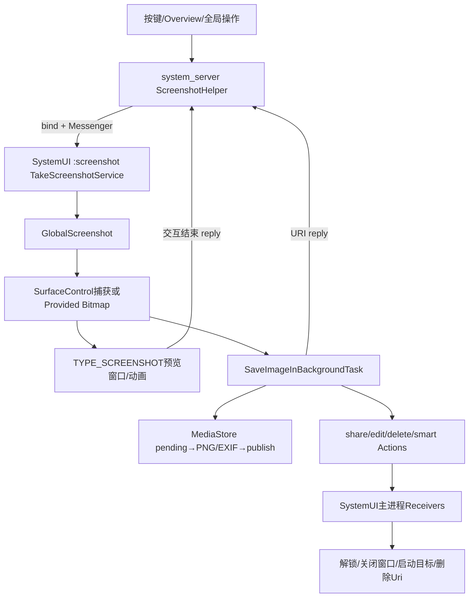
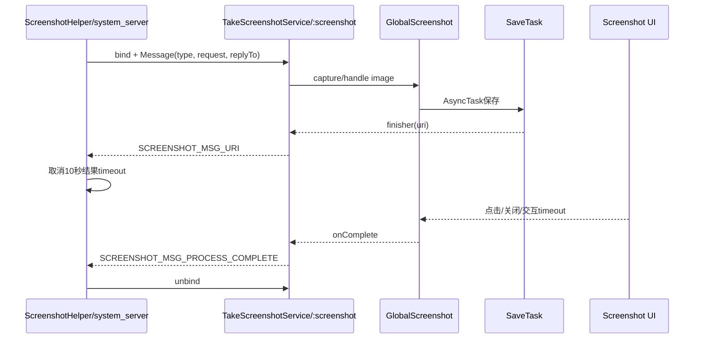
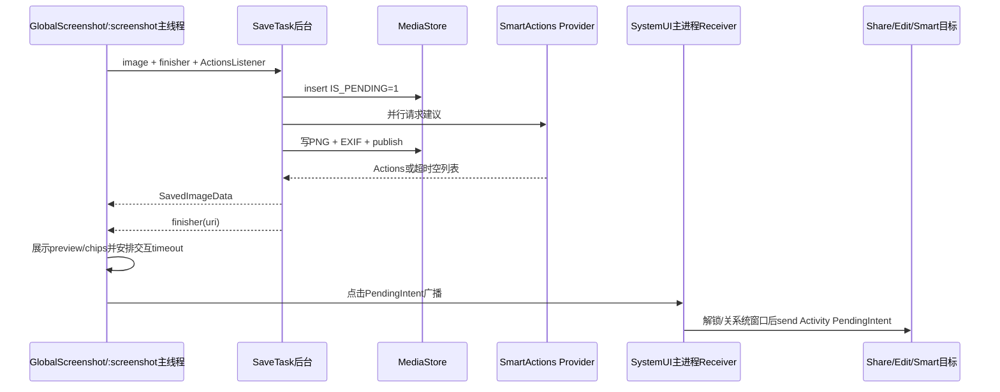

# 第 451 章 Android SystemUI Screenshot：截图服务、捕获、保存、预览与动作安全链

> 源码基线：Android 11 / API 30 / `android-11.0.0_r48`。本章只在 macOS 阅读源码，不编译。核心文件：`ScreenshotHelper.java`、`TakeScreenshotService.java`、`GlobalScreenshot.java`、`SaveImageInBackgroundTask.java`、`ActionProxyReceiver.java`、`DeleteScreenshotReceiver.java`、`SmartActionsReceiver.java` 与 `AndroidManifest.xml`。

## 1. 本章要解决什么问题

电源键组合、全局操作或Overview发出截图请求后，Bitmap如何跨进程进入SystemUI、写入MediaStore、显示左下角预览，并安全启动分享/编辑/智能动作？URI完成与界面完成为什么是两条回调？

## 2. 一句话主线

system_server的ScreenshotHelper绑定SystemUI独立`:screenshot`进程，以Messenger发送Request；Service选择全屏/区域/已有Bitmap路径，GlobalScreenshot捕获并显示TYPE_SCREENSHOT窗口，AsyncTask写MediaStore并构造Actions，最后回URI及用户交互结束信号。

## 3. 三个进程角色

PhoneWindowManager/ScreenshotHelper通常在system_server；TakeScreenshotService、GlobalScreenshot与保存任务在SystemUI `:screenshot`进程；ActionProxy/Delete/SmartActions Receiver默认在SystemUI主进程，以便解锁、收Shade和执行动作。

## 4. 为什么截图使用独立进程

大Bitmap、压缩、EXIF和智能分析有明显内存/CPU压力。独立`:screenshot`可隔离主SystemUI，但动作Receiver需要StatusBar实例，因此Manifest刻意让ActionProxy留在主进程。

## 5. 两个完成概念

`SCREENSHOT_MSG_URI`表示保存得到Uri或失败null，调用方据此结束“截图结果”等待；`SCREENSHOT_MSG_PROCESS_COMPLETE`表示截图交互UI完成，可解绑Service。二者时刻不同。

## 6. 三种请求类型

`TAKE_SCREENSHOT_FULLSCREEN`由SurfaceControl捕获全屏；`SELECTED_REGION`先显示选择层；`PROVIDED_IMAGE`接收外部硬件Bitmap、bounds、insets、task/user/component元数据并按截图处理。

## 7. 总体架构



## 8. Manifest 权限边界

TakeScreenshotService和ErrorReceiver都`exported=false`且运行`:screenshot`；Manifest注释承认Service仍有“应增加permission”的TODO。非导出阻止普通外部显式绑定，但同UID/System组件路径仍依赖配置可信。

## 9. 谁选择 Service 组件

ScreenshotHelper读取framework资源`config_screenshotServiceComponent`，不硬编码类名；Error Receiver同理由`config_screenshotErrorReceiverComponent`选择，便于产品替换实现。

## 10. ScreenshotRequest 装什么

所有请求带source、状态栏/导航栏可见标志；Provided Image额外带Bitmap Bundle、屏幕bounds、Insets、taskId、userId和topComponent。r48 GlobalScreenshot暂未消费后三项做智能动作。

## 11. ScreenshotHelper 的锁

`mScreenshotLock`保护共享ServiceConnection和IBinder。发请求、连接回调、断开、超时和用户切换reset都在锁内检查/修改连接身份。

## 12. 为什么连接可以复用

若已有mScreenshotConnection与mScreenshotService，Helper直接用Messenger发送新Message，不重新bind；Service和GlobalScreenshot是单实例，因而必须处理重入请求。

## 13. 首次请求怎样绑定

构造显式Intent，`bindServiceAsUser(... BIND_AUTO_CREATE | BIND_FOREGROUND_SERVICE, UserHandle.CURRENT)`；onServiceConnected确认连接仍是自身后保存Binder并send Message。

## 14. bind 返回 false 的边界

源码只有返回true才保存connection并post超时；返回false时既不调用completionConsumer，也不显示Error、也不安排timeout，调用方可能永久等不到结果。

## 15. 调用方10秒超时

超时若连接仍存在，resetConnection、广播错误通知；随后completionConsumer(null)。它以连接是否仍存在判断请求未完成，不维护request id。

## 16. URI回调如何处理

Reply Handler收到URI就调用completionConsumer(uri/null)，并移除该请求的10秒timeout。它不会解绑Service。

## 17. PROCESS_COMPLETE 如何处理

收到后在锁内resetConnection，解绑并清Binder。它不再次调用completionConsumer。

```java
case SCREENSHOT_MSG_URI:
    if (completionConsumer != null) {
        completionConsumer.accept((Uri) msg.obj);
    }
    handler.removeCallbacks(mScreenshotTimeout);
    break;
case SCREENSHOT_MSG_PROCESS_COMPLETE:
    synchronized (mScreenshotLock) {
        resetConnection();
    }
    break;
```

## 18. 为什么 URI 后仍保持绑定

保存完成时用户还可能看预览、点分享/编辑或等待无障碍调整后的超时。Service需活着维持Window和交互，直到PROCESS_COMPLETE。

## 19. URI取消超时的后果

一旦URI到达，调用方不再有10秒兜底；如果PROCESS_COMPLETE永远不发，连接会长期保持，直到用户切换、Service断开或另一条路径reset。

## 20. Messenger 协议时序



## 21. 多请求共用连接的问题

每个请求各建Reply Handler和timeout，但共享一个connection；任一PROCESS_COMPLETE都会reset整个连接，可能打断另一请求。Service端也只有一套GlobalScreenshot可变字段。

## 22. RemoteException 后会怎样

send失败会立即completionConsumer(null)，但初次bind已安排的timeout或复用路径随后安排的timeout仍存在，可能二次回调null/错误通知；catch没有reset或移除timeout。

## 23. 用户切换怎样处理

ScreenshotHelper注册ACTION_USER_SWITCHED，锁内resetConnection。它不主动回调在途请求，也不取消各Handler上已post的timeout；后者到期时connection已null但仍调用completionConsumer(null)。

## 24. ServiceDisconnected 怎样处理

若连接仍有效就reset；仅当timeout Runnable仍在Handler队列时移除并发错误通知。URI已到后timeout被移除，此时进程断开不会再通知保存失败。

## 25. ErrorReceiver 为什么另设进程

截图Service崩溃时system_server广播显式ErrorReceiver，后者在`:screenshot`新/现进程构造NotificationsController显示失败通知，不依赖已崩的GlobalScreenshot对象。

## 26. TakeScreenshotService Handler 线程

字段以`new Handler(Looper.myLooper())`创建；Android Service通常在进程主线程构造，因此消息在`:screenshot`主Looper处理。若非Looper线程实例化，构造即失败。

## 27. 每条消息建立两个闭包

uriConsumer发`SCREENSHOT_MSG_URI`，onComplete发`PROCESS_COMPLETE`，都捕获msg.replyTo Messenger；只吞RemoteException，不处理replyTo为null导致的NPE。

## 28. 存储未解锁门

UserManager.isUserUnlocked=false时不捕获、不动画，Handler post URI null和PROCESS_COMPLETE，避免CE MediaStore不可用却显示误导UI。

## 29. 为什么两个回调都 post

即使当前已在Handler，post让handleMessage先返回，保持Messenger处理栈简单，并确保URI先于complete按队列顺序发送。

## 30. Request 强制转换的位置

解锁后、switch之前就把`msg.obj`强转ScreenshotRequest；无效what但obj类型错误会先ClassCastException，走不到“Invalid option”日志。

## 31. Service 分发源码

```java
switch (msg.what) {
    case WindowManager.TAKE_SCREENSHOT_FULLSCREEN:
        mScreenshot.takeScreenshotFullscreen(uriConsumer, onComplete);
        break;
    case WindowManager.TAKE_SCREENSHOT_SELECTED_REGION:
        mScreenshot.takeScreenshotPartial(uriConsumer, onComplete);
        break;
    case WindowManager.TAKE_SCREENSHOT_PROVIDED_IMAGE:
        Bitmap screenshot = BitmapUtil.bundleToHardwareBitmap(
                screenshotRequest.getBitmapBundle());
        mScreenshot.handleImageAsScreenshot(screenshot, screenBounds, insets,
                taskId, userId, topComponent, uriConsumer, onComplete);
        break;
    default:
        Log.d(TAG, "Invalid screenshot option: " + msg.what);
}
```

## 32. invalid option 的协议缺口

default只写日志，不发URI null，也不发PROCESS_COMPLETE；调用方10秒后超时、解绑并显示通用错误。

## 33. Provided Bitmap 反序列化失败

bundleToHardwareBitmap可能返回null，后续aspectRatiosMatch会解引用Bitmap；Service没有try/catch把异常转换成协议失败。

## 34. source 日志

Service在分发前用ScreenshotEvent.getScreenshotSource记录按键、Overview、Global Actions等来源；记录请求来源不代表截图最终保存成功，成功/失败另在GlobalScreenshot记录。

## 35. onBind 的 Receiver

每次onBind注册ACTION_CLOSE_SYSTEM_DIALOGS动态Receiver，返回Messenger Binder。收到广播只dismissScreenshot，不调用onComplete。

## 36. onUnbind 做什么

调用stopScreenshot、注销Receiver并return true。return true表示未来同一Service实例可能走onRebind而非onBind。

## 37. onRebind Receiver 漏注册

类没有覆写onRebind；首次onUnbind已注销Receiver，下一次因return true只回onRebind时不会重新注册，之后CLOSE_SYSTEM_DIALOGS可能失效。

## 38. stopScreenshot 不是全面停止

它只在Selector已有selectionRect时remove选择层并stopSelection，不取消保存Task、不dismiss角落预览、不发任何回调。

## 39. 未开始拖选时 unbind

Selector Window已add但selectionRect仍null，stopScreenshot条件不成立，可能把全屏选择层留在窗口上；同时Receiver已注销。

## 40. GlobalScreenshot 是 Singleton

在`:screenshot`进程共享一个Window、Bitmap、SaveTask、Animations和mOnCompleteRunnable。重入处理必须显式淘汰旧操作，否则回调相互覆盖。

## 41. 全屏捕获怎样算 Rect

刷新Display real metrics，以`Rect(0,0,width,height)`调用takeScreenshotInternal；内部复制Rect，因为SurfaceControl.screenshot可能修改输入。

## 42. SurfaceControl.screenshot 参数

传crop、crop宽高和当前Display rotation，返回Bitmap。它是系统级屏幕合成捕获，不走View.draw或应用进程。

## 43. 捕获失败怎样收敛

Bitmap null时发错误通知、finisher(null)、立即onComplete，然后return；这是少数完整发送两阶段回调的失败路径。

## 44. Provided Image 的比例判断

先去掉visibleInsets，比较Bitmap内容宽高比与screenBounds宽高比，差值小于0.1视作匹配；匹配保留bounds/insets且不闪白，不匹配退化为Bitmap自身bounds、无Insets、显示flash。

## 45. Provided 元数据未消费

taskId、userId、topComponent只有TODO，智能动作仍现场查询running task/foreground user，可能与提供截图的原任务不一致。

## 46. 退化尺寸边界

aspectRatiosMatch检查Bitmap及去Insets尺寸非零，却不显式检查screenBounds.height为0或bounds为null；除零可得Infinity，null会NPE。

## 47. 区域截图先做什么

立即dismiss旧截图、覆盖mOnCompleteRunnable、把ScreenshotLayout作为全屏TYPE_SCREENSHOT窗口addView，并给Selector安装触摸监听。

## 48. 区域触摸状态机

DOWN记录起点，MOVE更新矩形，UP隐藏Selector、remove整个Window，读取selectionRect；宽高均非零才post真正捕获，最后stopSelection。

## 49. 区域选择源码

```java
case MotionEvent.ACTION_UP:
    view.setVisibility(View.GONE);
    mWindowManager.removeView(mScreenshotLayout);
    final Rect rect = view.getSelectionRect();
    if (rect != null && rect.width() != 0 && rect.height() != 0) {
        mScreenshotLayout.post(() -> takeScreenshotInternal(finisher, rect));
    }
    view.stopSelection();
    return true;
```

## 50. 零尺寸选择的协议缺口

Window被移除，但既不finisher(null)也不onComplete；ScreenshotHelper最终10秒超时。用户轻点而未拖动就可能进入此路径。

## 51. ACTION_CANCEL 的缺口

触摸switch未处理CANCEL，返回false，不保证remove Window、stopSelection或完成回调；手势被系统取消时状态可能悬挂。

## 52. 部分截图为何 post 捕获

要先让选择遮罩从Surface合成中消失，否则截图会把半透明选区UI也拍进去；在layout消息队列后执行给WMS/Surface一个移除窗口的机会。

## 53. saveScreenshot 的重入门

若ScreenshotLayout已attach，记录SCREENSHOT_REENTERED并立即dismiss旧UI。它不在这里调用旧mOnCompleteRunnable。

## 54. mOnCompleteRunnable 覆盖时机

full/provided入口在调用save前就写新Runnable；因此save发现旧UI并dismiss时，旧complete引用已经丢失，新引用也不应为旧UI调用。

## 55. 重入旧请求的结果

旧SaveTask仍完成并回旧URI finisher，但旧PROCESS_COMPLETE可能永远不发；新请求的complete控制共享连接，任一complete又可解绑两者共用Service。

## 56. User Setup 未完成政策

不展示分享/编辑预览，只播放快门、后台保存，成功Toast或失败通知，避免Setup Wizard期间暴露外部Activity。

## 57. Setup路径缺 complete

saveScreenshotAndToast的ActionsReadyListener只调用finisher和Toast/错误，没有mOnCompleteRunnable；URI到达后Helper取消10秒timeout，却收不到PROCESS_COMPLETE，连接可能长期保持。

## 58. 正常截图的优化

Bitmap设无alpha并prepareToDraw；读取最新配置，必要时重新inflate资源；取消正在运行的dismiss动画，把Window恢复focusable，然后启动截图动画与保存。

## 59. TYPE_SCREENSHOT Window 特征

全屏、layout in screen、show when locked、cutout always、fitInsetsTypes=0；NOT_TOUCH_MODAL与WATCH_OUTSIDE_TOUCH配合自定义Touchable Region，只让预览、actions、关闭按钮和手势边缘接收触摸。

## 60. 为什么需要可聚焦

布局请求焦点并监听BACK。用户外部触摸ACTION_OUTSIDE后只把Window设NOT_FOCUSABLE，避免继续截获输入；下次截图save再恢复focusable。

## 61. BACK 的协议缺口

KeyListener只调用dismissScreenshot并return true，没有mOnCompleteRunnable。UI消失但PROCESS_COMPLETE不发，且dismiss已移除角落timeout，Helper再无兜底。

## 62. CLOSE_SYSTEM_DIALOGS 同样如此

Service Receiver仅dismiss，不complete。Home/系统Dialog关闭截图UI后，Service连接可留下。

## 63. 显式关闭按钮为什么不同

按钮记录事件、dismiss，并立即调用mOnCompleteRunnable；分享、编辑、智能Chip和预览点击也遵守同样两步。

## 64. UI自动超时从何时起算

不是截图捕获时，而是SaveTask ActionsReady回调后；先查询Accessibility推荐timeout，默认6000ms，再安排MESSAGE_CORNER_TIMEOUT。

## 65. 保存卡住时没有角落超时

Actions一直没ready就不会安排6秒UI timeout；只有ScreenshotHelper原10秒结果timeout兜底。若SaveTask已回URI却Actions回调异常，则结果timeout又已取消。

## 66. timeout 处理顺序

记录交互超时、dismissScreenshot、调用onComplete。dismiss先remove同类消息并启动350ms动画，complete立即解绑Service，不等待动画结束；进程/Window生命周期依赖绑定外的进程存活。

## 67. dismiss 是否可重入

非immediate每次都创建新Animator，没有先取消已有mDismissAnimation；多次调用可启动多个动画，最终各自clearScreenshot。attached检查让removeView大多幂等，但状态回调仍重复。

## 68. clearScreenshot 清了什么

remove Window、清两个ImageView drawable/visibility、actions/background、preview listener/content description及translation/alpha。

## 69. clearScreenshot 没清什么

没有把`mScreenBitmap`、`mSaveInBgTask`、`mOnCompleteRunnable`置null。注释称清Bitmap引用，但Singleton仍持最新大Bitmap，直到下一截图或进程死亡。

## 70. 配置更新的实际时机

onConfigChanged是private，只在每次saveScreenshot主动调用，不是ConfigurationController回调；截图UI已显示期间旋转/主题变化未必即时reload，下一截图才核对。

## 71. reloadAssets attach 分支

若旧layout已attach先remove，inflate全新树，重新安装监听；最后再add。它不会把旧preview/actions逐字段迁移到新树，正常调用时尚未开始新动画。

## 72. 截图入角动画

全屏Bitmap从屏幕中心/原bounds缩放移动到预览位置：X约234ms完成，Y 500ms，scale 234ms；可选flash 133ms进、217ms出。

## 73. Actions展开动画

保存Actions ready后，等drop-in结束再从scaleX 0.7扩到1、前100ms淡入；每个Chip用反向scale保持自身尺寸不随容器拉伸。

## 74. RTL 怎么处理

预览关闭按钮位置、Actions pivot/scroll起点按mDirectionLTR分支；配置只在新截图save时更新方向缓存。

## 75. Insets Drawable 为什么可负 inset

Provided Bitmap可能含或缺屏幕边缘；InsetDrawable用分数负inset扩展/裁切。若Insets为负表示Bitmap比bounds小，外层加黑色ColorDrawable填背景。

## 76. 保存任务怎样启动

构造SaveImageInBackgroundData，复制当前mScreenBitmap、finisher与Actions listener；若已有mSaveInBgTask，只把旧Task的Actions listener替换为“仅记录成功失败”，不取消旧保存。

## 77. 旧 Task listener 替换的目的

第二张截图出现时，第一张仍应保存并回URI，但不能再把第一张Actions渲染到当前共享UI。旧Task改成只log。

## 78. listener 替换的竞态

mParams.mActionsReadyListener跨主线程和AsyncTask后台读写，没有volatile/同步；旧Task恰好完成时可能仍调用原UI listener或新log listener，身份不受generation保护。

## 79. AsyncTask 是并行吗

调用`execute()`使用平台默认Executor；Android 11 AsyncTask默认通常串行执行任务，而智能Actions Provider显式使用THREAD_POOL_EXECUTOR。不能因类名“Background”就假设多截图保存并行。

## 80. SaveTask 构造元数据

使用当前毫秒、默认时区格式`Screenshot_yyyyMMdd-HHmmss.png`，ScreenshotId另用UUID。同一秒多张显示名相同，MediaStore可能自行解决冲突，逻辑id仍唯一。

## 81. MediaStore pending 协议

先insert相对路径Pictures/Screenshots、MIME、时间、DATE_EXPIRES和IS_PENDING=1；写PNG与EXIF成功后update为IS_PENDING=0并清过期时间。

## 82. 保存源码

```java
values.put(MediaColumns.RELATIVE_PATH, Environment.DIRECTORY_PICTURES
        + File.separator + Environment.DIRECTORY_SCREENSHOTS);
values.put(MediaColumns.DISPLAY_NAME, mImageFileName);
values.put(MediaColumns.MIME_TYPE, "image/png");
values.put(MediaColumns.IS_PENDING, 1);
Uri uri = resolver.insert(MediaStore.Images.Media.EXTERNAL_CONTENT_URI, values);
try (OutputStream out = resolver.openOutputStream(uri)) {
    if (!image.compress(Bitmap.CompressFormat.PNG, 100, out)) {
        throw new IOException("Failed to compress");
    }
}
values.clear();
values.put(MediaColumns.IS_PENDING, 0);
resolver.update(uri, values, null, null);
```

## 83. pending 的意义

其他应用在文件未完整写入前看不到它；异常时delete Uri，避免图库出现半张图。DATE_EXPIRES又为遗留pending row提供一天后清理线索。

## 84. 哪些EXIF被写入

Android Build.DISPLAY、宽高、原始日期/毫秒和UTC offset。PNG压缩本身不自动携这些索引元数据，需重新以rw打开Uri写EXIF。

## 85. update 结果被忽略

resolver.update返回0也被当成功，mImageData.uri仍设置；row可能保持pending直到过期，外部Activity拿Uri却看不到/无法读。

## 86. Smart Actions 何时请求

MediaStore insert后、写Bitmap前就启动CompletableFuture，让图像智能分析与PNG/EXIF写入并行；随后文件publish后最多等待DeviceConfig默认1000ms取Actions。

## 87. 为什么要求 Hardware Bitmap

ScreenshotSmartActions仅对`Bitmap.Config.HARDWARE`调用Provider，其他配置直接空列表；全屏Surface截图通常满足，外部Provided Bitmap若转换失败/配置不同则无智能动作。

## 88. Smart Actions 超时是不是保存失败

不是。Future超时/异常记录状态并返回空列表，截图Uri、share/edit/delete仍成功。智能建议是可选增强，不能阻断基本保存。

## 89. foreground user 查询风险

SmartActions UserHandle通过ATM最后Resumed Activity user，再`UserManager.getUserInfo(id).getUserHandle()`；getUserInfo返回null会NPE。

## 90. pending orphan 风险

getUserHandle发生在MediaStore insert之后、内层“写失败delete uri”try之前；这里异常落到外层catch，不执行resolver.delete，可能留下IS_PENDING row直到DATE_EXPIRES清理。

## 91. Task 回调在哪个线程

`mActionsReadyListener.onActionsReady`和finisher都直接在doInBackground调用，不在onPostExecute；GlobalScreenshot内部再用Main Handler处理View，但URI Messenger reply可从后台线程发送。

## 92. Actions与URI顺序

成功时先ActionsReady listener，再finisher(uri)；正常UI listener会安排Actions/timeout，然后Service回URI。失败同样先ActionsReady(null)显示错误，再finisher(null)。

## 93. onCancelled 的契约

重置ImageData、通知Actions listener、finisher(null)、清Bitmap引用；GlobalScreenshot重入并不cancel旧Task，只换listener，因此此路径很少由本主链触发。

## 94. 保存与动作全链



## 95. Share Intent 的URI授权

ACTION_SEND放EXTRA_STREAM，同时把Uri写ClipData并加FLAG_GRANT_READ_URI_PERMISSION；ClipData使Intent权限授予系统能发现Uri，避免仅extras被漏扫。

## 96. 为什么 Share 经过 chooser

始终Intent.createChooser，避免直接启动目标并控制PiP行为；外层ActionProxy可设置disallowEnterPiP，并统一关闭系统窗口/解锁。

## 97. Edit 权限

ACTION_EDIT以Uri为data，授予READ与WRITE；若config_screenshotEditor指定Component就直达，否则走系统解析。Activity PendingIntent面向UserHandle.CURRENT。

## 98. ActionProxy 的执行顺序

若StatusBar存在，交给`executeRunnableDismissingKeyguard`延迟执行；Runnable最多同步等3秒closeSystemWindows Future，再send目标PendingIntent。

## 99. 3秒等待在哪个线程

无StatusBar时直接在BroadcastReceiver onReceive线程运行，可能阻塞主线程3秒；有StatusBar时Runnable执行线程/时机由StatusBar控制，但仍同步get Future。

## 100. Share/Edit 日志不是成功ACK

SmartActions notifyScreenshotAction在安排解锁Runnable后立即调用；即使close windows超时或PendingIntent canceled，也可能已记录“Share/Edit action”。它表示点击意图，不证明Activity成功打开。

## 101. Corner UI 使用 Delete Action 吗

SaveTask构造deleteAction，但`createScreenshotActionsShadeAnimation`只加入smart/share/edit chips，X按钮只是dismiss不删除文件。ScreenshotNotificationsController的成功通知方法在r48 GlobalScreenshot中没有调用，deleteAction主链近似遗留。

## 102. DeleteReceiver 做什么

校验URI extra后向后台Executor提交ContentResolver.delete，不调用goAsync、不检查删除行数；SystemUI主进程常驻所以任务通常继续，但Broadcast生命周期没有显式延长。

## 103. Delete 日志时机

智能动作Provider通知在提交后台删除后立即进行，早于真实delete完成；同样是点击事件，不是存储成功ACK。

## 104. SmartActionsReceiver 边界

直接取PendingIntent/actionType，先日志调用`pendingIntent.getIntent()`再try send；若extra缺失可在try之前NPE。send canceled仍继续notify action。

## 105. Receiver exported=false 的价值

普通外部应用不能直接显式触发这些组件，降低伪造Uri删除和任意PendingIntent代理风险；合法PendingIntent由SystemUI创建，系统可按其身份回送。

## 106. PendingIntent 唯一性

ScreenshotId UUID用于日志；Share/Edit外层Broadcast requestCode使用context userId避免系统用户跨用户冲突。Share内层Chooser因ClipData不参与matching使用FLAG_CANCEL_CURRENT刷新。

## 107. 成功通知代码为何仍存在

ScreenshotNotificationsController保留saving/saved BigPicture通知构建、share/edit/delete/smart actions，但新corner UI只用它显示错误。阅读r48必须以全仓调用搜索区分活代码与遗留API。

## 108. 现有测试覆盖范围

只有ActionProxyReceiver、DeleteReceiver、SmartActionsReceiver和SmartActions Provider相关测试；没有TakeScreenshotService、GlobalScreenshot、区域选择、重入、MediaStore事务或PROCESS_COMPLETE的核心集成测试。

## 109. Receiver单测不能证明什么

它们可验证PendingIntent发送/Provider通知，却不能证明`:screenshot`进程窗口收尾、Helper解绑、URI授权跨用户或旧SaveTask不会覆盖新UI。

## 110. 最严重的协议缺口集合

区域零尺寸/CANCEL、BACK、CLOSE_SYSTEM_DIALOGS、Setup未完成路径都可能不发PROCESS_COMPLETE；invalid option则URI与complete都不发；URI一到调用方timeout已取消。

## 111. 最严重的代次问题

GlobalScreenshot只有一个mOnCompleteRunnable/mScreenBitmap/mSaveInBgTask；新请求覆盖旧complete，旧Task listener又无同步替换，Helper侧也没有request id隔离共享connection。

## 112. macOS只读练习一：追双回调协议

从ScreenshotHelper Message.replyTo追Service的uriConsumer/onComplete，再分别模拟成功保存、BACK、零尺寸区域和存储未解锁，写出URI、PROCESS_COMPLETE、timeout与unbind终态。

## 113. macOS只读练习二：审计区域截图

画DOWN/MOVE/UP/CANCEL状态机，标出Window何时add/remove、selectionRect何时非null；解释onUnbind在用户尚未DOWN时为什么可能无法remove Selector。

## 114. macOS只读练习三：推演连续两张截图

第一张UI已显示且SaveTask未完，第二张full请求到达。记录mOnCompleteRunnable、mScreenBitmap、两个Params.finisher和旧Task Actions listener分别指向谁，找出旧PROCESS_COMPLETE丢失点。

## 115. macOS只读练习四：审计MediaStore异常

从insert pending row开始，分别让PNG写失败、EXIF失败、publish update返回0、getUserInfo为空；判断哪条路径delete Uri、哪条可能留下pending orphan。

## 116. 改进一：请求级 Session 对象

为每条Message创建requestId、独立Bitmap/SaveTask/complete状态；所有回调校验id并用一次性finish状态机保证URI与PROCESS_COMPLETE各至多一次。

## 117. 改进二：统一所有终点

BACK、系统Dialog、零选区、CANCEL、Setup toast、invalid request和异常都走`finish(uri?, reason)`；URI后仍保留独立interaction timeout，保证最终complete。

## 118. 改进三：保存事务与动作ACK

检查insert/update/delete结果，把getUserHandle/SmartAction启动纳入pending row清理finally；Provider日志区分TAPPED、INTENT_SENT、ACTIVITY_STARTED/DELETE_SUCCEEDED。

## 119. 诊断口诀

先分“没捕获、没保存、没显示、动作没启动、连接没解绑”；再查request type/id、Bitmap、MediaStore Uri/pending、ActionsReady、URI reply、PROCESS_COMPLETE和Window attached状态。

## 120. 本章结论

Android 11截图链把system_server请求、独立截图进程、Surface捕获、MediaStore事务、corner UI和主SystemUI动作代理串成双阶段协议。正常路径清楚，但r48缺request generation与统一finish：多种退出不发complete、URI后取消总timeout、重入覆盖旧回调、Selector未拖动无法stop、Global仍持Bitmap、pending row异常清理不全，以及成功通知/删除Action成为遗留代码，都是源码学习与排障必须看见的真实边界。

### 本章源码追踪清单

- `frameworks/base/core/java/com/android/internal/util/ScreenshotHelper.java`
- `frameworks/base/packages/SystemUI/src/com/android/systemui/screenshot/TakeScreenshotService.java`
- `frameworks/base/packages/SystemUI/src/com/android/systemui/screenshot/GlobalScreenshot.java`
- `frameworks/base/packages/SystemUI/src/com/android/systemui/screenshot/SaveImageInBackgroundTask.java`
- `frameworks/base/packages/SystemUI/src/com/android/systemui/screenshot/ActionProxyReceiver.java`
- `frameworks/base/packages/SystemUI/src/com/android/systemui/screenshot/DeleteScreenshotReceiver.java`
- `frameworks/base/packages/SystemUI/src/com/android/systemui/screenshot/SmartActionsReceiver.java`
- `frameworks/base/packages/SystemUI/AndroidManifest.xml`

### 本章自测答案提示

1. URI代表保存结果，PROCESS_COMPLETE代表交互结束与可解绑，两者不可合并理解。
2. screenshot主逻辑在`:screenshot`，ActionProxy等默认在主SystemUI进程。
3. MediaStore先pending、再写PNG/EXIF、最后publish；异常应delete。
4. r48多个退出路径只dismiss不complete，URI后又无Helper timeout，可能留下连接。
