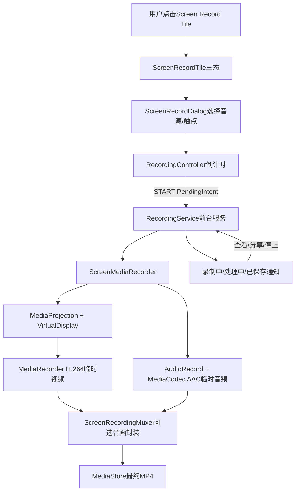
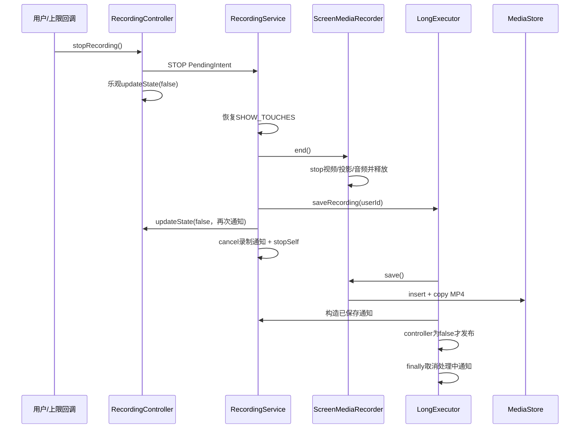

# 第 452 章 Android SystemUI ScreenRecord：屏幕录制倒计时、音画捕获、保存与通知链

> 源码基线：Android 11 / API 30 / `android-11.0.0_r48`。本章只在 macOS 阅读源码，不实际编译。核心文件：`ScreenRecordTile.java`、`ScreenRecordDialog.java`、`RecordingController.java`、`RecordingService.java`、`ScreenMediaRecorder.java`、`ScreenInternalAudioRecorder.java`、`ScreenRecordingMuxer.java`、`ScreenRecordingAudioSource.java`、SystemUI `AndroidManifest.xml` 以及相应单元测试。

## 1. 本章要解决什么问题

点击快捷设置“屏幕录制”后，SystemUI 怎样让用户选音源和触点、倒数三秒、创建 MediaProjection 与 VirtualDisplay、把屏幕编码为 H.264、把内部声音或麦克风编码为 AAC、停止并保存 MP4，最后显示可查看和分享的通知？更重要的是：界面显示的“正在录制”究竟是设备事实、服务事实，还是一个提前写入的控制状态？

## 2. 一句话主线

`ScreenRecordTile` 打开 `ScreenRecordDialog`；Dialog 用当前用户 Context 构造 START/STOP 两个 PendingIntent，交给 `RecordingController` 倒计时；START 启动 `RecordingService`，后者创建 `ScreenMediaRecorder`，用特权 MediaProjection 把 VirtualDisplay 画面送进 MediaRecorder；内部音频另录 AAC，停止后可再与视频封装，复制进 MediaStore，并以处理完成通知提供查看和分享入口。

## 3. 先分清八个角色

Tile 负责入口和三态文案；Dialog 负责收集选项；Controller 保存倒计时/录制的轻量状态并通知观察者；Service 负责前台生命周期、通知和保存调度；ScreenMediaRecorder 负责投影与视频；ScreenInternalAudioRecorder 负责播放捕获、麦克风混音与 AAC；ScreenRecordingMuxer 负责把轨道重新封装到 MP4；MediaStore 负责最终可见文件。把这些类混成“录屏服务”会看不清故障归属。

## 4. 进程边界

Manifest 没为 Dialog 或 RecordingService 指定 `android:process`，因此它们和 Tile、Controller 都在 SystemUI 主进程。MediaProjectionManager、显示服务、AudioFlinger/AudioPolicy、MediaCodec 及 MediaStore Provider 在别的系统进程或媒体进程中，Java API 背后会跨 Binder；MediaRecorder/MediaCodec 还会进入 native 媒体栈。

## 5. 线程边界

Tile、Dialog、Controller 的正常回调和 Service 生命周期主要在 SystemUI 主线程；`mLongExecutor` 在后台执行封装、复制和缩略图生成；内部音频有专门 Java Thread 做 AudioRecord 读取与 MediaCodec 喂入。这里 MediaRecorder 在 Service 主线程构造，其 EventHandler 绑定当前 Looper，所以 `onInfo` 正常也回到主线程；问题不是“必然跑在媒体线程”，而是 r48 仍手工调用了生命周期入口。

## 6. 总体架构



## 7. Manifest 给出的边界

`ScreenRecordDialog` 带 `showForAllUsers=true`，布局窗口又加 `SYSTEM_FLAG_SHOW_FOR_ALL_USERS`；RecordingService 只是普通声明。二者都没有 intent-filter，在 Android 11 的默认导出规则下不是给任意第三方调用的公开入口。这里也没有单独进程、显式 permission 或 `foregroundServiceType` 声明；安全性主要来自 SystemUI 身份、显式组件和平台权限。

## 8. QS Tile 有哪三种可见状态

Controller `isStarting()` 为真时，Tile 激活并显示四舍五入后的 `3.../2.../1...`；`isRecording()` 为真时显示“停止”；二者都假时显示“开始”。`state.value` 是 `starting || recording`，所以 BooleanState 不是“视频编码器已工作”的纯事实，而是“录屏流程占用中”的界面抽象。

## 9. 点击行为是一个优先级判断

点击时先看 starting：正在倒数就取消；否则看 recording：录制中就停止；最后才打开配置 Dialog。若两个布尔值因为竞态同时为真，取消倒计时分支优先，不会发送停止请求。

## 10. 为什么打开 Dialog 前收起 QS

源码注释直接说明：不收起 QS，Dialog 会出现在它下面。Tile 先 `collapsePanels()`，再经 `KeyguardDismissUtil.executeWhenUnlocked()` 解锁并显式启动 Dialog；这既处理窗口层级，也避免在锁屏上直接暴露录屏选项。

## 11. Tile 不支持长按

`handlesLongClick=false` 且 `getLongClickIntent()` 返回 null。r48 没把长按导向设置页；用户的全部选择都放在短按后的 ScreenRecordDialog。

## 12. Tile 怎样订阅状态

构造时用 `mController.observe(this, mCallback)` 建立生命周期感知观察；四个回调——倒计时 tick、倒计时结束、录制开始、录制结束——都只更新本地毫秒值或 `refreshState()`。Tile 不直接询问 MediaRecorder，也没有服务 Binder。

## 13. Dialog 为什么显示在屏幕顶部

`onCreate()` 先触发 decor inflate，再设置 MATCH_PARENT × WRAP_CONTENT，增加全用户私有 flag，并把 gravity 设为 TOP。它更像 SystemUI 顶部系统面板，而不是居中普通 Activity 对话框。

## 14. 四种音频语义

枚举真实顺序是 `NONE(0)、INTERNAL(1)、MIC(2)、MIC_AND_INTERNAL(3)`。NONE 表示只录画面；INTERNAL 是允许被播放捕获的应用声音；MIC 是麦克风；最后一种把两路 PCM 混合后编码。序号会直接塞进 Intent，因而枚举顺序是跨组件协议的一部分。

## 15. Dialog 的下拉顺序不是枚举顺序

下拉列表按 `MIC、INTERNAL、MIC_AND_INTERNAL` 展示，并不展示 NONE；音频总开关关闭时才选择 NONE。选择任何下拉项都会自动勾上音频 Switch。默认选中第一个可见项，因此用户打开音频后通常得到 MIC，而不是 ordinal 1 的 INTERNAL。

## 16. “显示触点”改的是什么

它最终写 `Settings.System.SHOW_TOUCHES`。这不是只作用于录屏视频的特效，而是系统级显示触摸位置设置：录制期间屏幕本身出现触点，VirtualDisplay 捕获到它。Service 会先保存原值，停止时尝试恢复。

## 17. 为什么必须使用当前用户 Context

Dialog 可为所有用户显示，但真正启动服务、写设置和写 MediaStore 应属于当前前台用户。因此 `requestScreenCapture()` 每次现场取 `CurrentUserContextTracker.getCurrentUserContext()`，并用它创建两个 PendingIntent，而不是沿用 Activity 构造时可能陈旧的 Context。

## 18. START 和 STOP PendingIntent

START 用 `PendingIntent.getForegroundService()`，保证进入需要立即前台化的 Service；STOP 用普通 `getService()`。两者 requestCode 都是 2、都有 UPDATE_CURRENT 与 IMMUTABLE，但 Intent action 不同，因而可作为不同 PendingIntent 身份存在。STOP 额外写入 Context 的 userId，供用户切换后把结果通知发回原用户。

## 19. Dialog 到倒计时的关键源码

```java
ScreenRecordingAudioSource audioMode = mAudioSwitch.isChecked()
        ? (ScreenRecordingAudioSource) mOptions.getSelectedItem()
        : NONE;
PendingIntent startIntent = PendingIntent.getForegroundService(userContext,
        RecordingService.REQUEST_CODE,
        RecordingService.getStartIntent(userContext, RESULT_OK,
                audioMode.ordinal(), showTaps),
        PendingIntent.FLAG_UPDATE_CURRENT | PendingIntent.FLAG_IMMUTABLE);
PendingIntent stopIntent = PendingIntent.getService(userContext,
        RecordingService.REQUEST_CODE,
        RecordingService.getStopIntent(userContext),
        PendingIntent.FLAG_UPDATE_CURRENT | PendingIntent.FLAG_IMMUTABLE);
mController.startCountdown(DELAY_MS, INTERVAL_MS, startIntent, stopIntent);
```

## 20. RESULT_OK 在这里容易误导

`getStartIntent()` 带 `resultCode` 参数并写 extra，但 r48 `RecordingService.onStartCommand()` 根本没有读取它。普通应用需通过用户授权 Activity result 获得 MediaProjection token；SystemUI 走特权 `createProjection()`，所以这个参数在当前实现是遗留接口形状，不是实际授权证据。

## 21. 倒计时参数

Dialog 使用 3000ms 总时长和 1000ms tick。CountDownTimer 的 tick 时间不是精确整数秒，因此 Tile 用 `(millis + 500) / 1000` 近似显示。倒计时是给用户准备的 UX，不是音视频时间轴的一部分。

## 22. Controller 的四份核心状态

`mIsStarting` 表示倒数中；`mIsRecording` 表示控制器认为录制流程已开始；`mStopIntent` 是将来停止服务的能力；`mCountDownTimer` 是当前计时器。它还保存一个可变 ArrayList listeners 和用户切换 Receiver。

## 23. startCountdown 先做什么

它立刻把 `mIsStarting=true` 并覆盖 `mStopIntent`，再创建并启动 CountDownTimer。没有先取消旧 timer，也没有 generation/session id，所以理论上连续调用会让旧新 timer 共存，共享同一组状态和新 stopIntent。

## 24. 每次 tick 做什么

CountDownTimer 遍历 live `mListeners`，直接调用 `onCountdown(millisUntilFinished)`。没有复制快照、没有异常隔离；若回调在遍历中增删 listener 或抛异常，会影响后续通知。

## 25. onFinish 的乐观状态

到时后先设置 `starting=false、recording=true`，再通知 `onCountdownEnd()`，最后才 `startIntent.send()`。所以 Controller 的 recording 并不证明 Service 已启动，更不证明 MediaRecorder.start 已成功；它是“准备发起启动”的乐观状态。

## 26. 为什么 onFinish 不发 onRecordingStart

它只发 `onCountdownEnd()`。真正的 `onRecordingStart()` 来自 RecordingService 成功执行 `mRecorder.start()` 后的 `mController.updateState(true)`。于是 Tile 可在两者之间通过主动 refresh 读到 recording=true，却尚未收到正式 start callback。

## 27. Controller 倒计时时序

```mermaid
sequenceDiagram
    participant Tile as ScreenRecordTile
    participant Dialog as ScreenRecordDialog
    participant Ctrl as RecordingController
    participant PI as START PendingIntent
    participant Svc as RecordingService
    Dialog->>Ctrl: startCountdown(3000,1000,START,STOP)
    Ctrl-->>Tile: onCountdown(约3/2/1秒)
    Ctrl->>Ctrl: starting=false; recording=true
    Ctrl-->>Tile: onCountdownEnd()
    Ctrl->>PI: send()
    PI->>Svc: ACTION_START
    Svc->>Svc: recorder.start()
    Svc->>Ctrl: updateState(true)
    Ctrl-->>Tile: onRecordingStart()
```

## 28. START PendingIntent 已取消时的真实结果

catch 只记日志，不把 `mIsRecording` 改回 false，也不清 stopIntent。由于 Receiver 注册放在 send 成功后，用户切换监听也不会建立。Tile 可能长期显示“停止”，但真正的 RecordingService 从未运行；这是本章最重要的“控制状态不等于设备事实”示例。

## 29. 用户切换为什么停止录屏

START PendingIntent 成功发送后，Controller 才通过 BroadcastDispatcher 为 `UserHandle.ALL` 注册 ACTION_USER_SWITCHED。Receiver 不比较新旧 id，只要 `mStopIntent != null` 就调用 `stopRecording()`，意图是避免继续捕获前一用户内容并把文件串到新用户。

## 30. 注册时刻仍有窗口

注册发生在“START PendingIntent 已发送”之后，而不是“录制器已成功开始”之后。Service 可能尚在 prepare，也可能已经失败；反过来，在 send 与注册之间发生用户切换也可能漏掉。这里没有启动 ACK 把 Controller、Service、Receiver 绑定成一个事务。

## 31. cancelCountdown 的边界

只要 timer 非 null 就 cancel，然后无条件 `starting=false` 并遍历 listeners 发 `onCountdownEnd()`。它不把 timer 置 null，也不检查是否仍处于 starting；重复取消或录制开始后误调用，都可能再次发 countdownEnd。

## 32. stopRecording 的理想路径

若 stopIntent 非空，就 send ACTION_STOP；随后立即 `updateState(false)`，并注销用户切换 Receiver。Service 还没有真正 end/save，Tile 已先显示未录制。这是为了快速响应 UI，但同样是乐观停止。

## 33. STOP PendingIntent 已取消的特殊错误

`updateState(false)` 在 try 块中，send 抛 CanceledException 后 catch 只写日志，因此 Controller 反而保持 recording=true；之后仍调用 unregisterReceiver。此时服务可能继续录制，却失去用户切换保护，Tile 也一直显示停止入口。

## 34. stopIntent 为 null 反而会清状态

null 分支只记录错误，不抛异常，代码仍执行 `updateState(false)`。这与“非 null 但已取消”形成不直观的不对称：没有停止能力会清 UI 状态，失效的停止能力却不清。

## 35. Controller 状态源码

```java
public void onFinish() {
    mIsStarting = false;
    mIsRecording = true;
    for (RecordingStateChangeCallback cb : mListeners) {
        cb.onCountdownEnd();
    }
    try {
        startIntent.send();
        mBroadcastDispatcher.registerReceiver(mUserChangeReceiver, userFilter,
                null, UserHandle.ALL);
    } catch (PendingIntent.CanceledException e) {
        Log.e(TAG, "Pending intent was cancelled: " + e.getMessage());
    }
}

public void stopRecording() {
    try {
        if (mStopIntent != null) mStopIntent.send();
        updateState(false);
    } catch (PendingIntent.CanceledException e) {
        Log.e(TAG, "Error stopping: " + e.getMessage());
    }
    mBroadcastDispatcher.unregisterReceiver(mUserChangeReceiver);
}
```

## 36. synchronized 保护了什么

`isRecording()` 与 `updateState()` 是 synchronized，保护 recording 的读写；`mIsStarting`、timer、stopIntent 和 listener list 不受同一锁完整保护。常规 UI 路径大多在主线程，但 MediaRecorder 回调和外部调用会让“默认单线程”假设变脆弱。

## 37. 在锁内回调 listener 的风险

`updateState()` 持有 Controller monitor 遍历并调用外部 listener。Java synchronized 可重入，所以同线程回调再读状态不会死锁；但回调增删 ArrayList 可能 ConcurrentModificationException，耗时回调也会延长锁占用。更稳妥是锁内改状态并复制快照，锁外通知。

## 38. 重复状态会不会抑制通知

不会。Controller 不比较旧值；`updateState(true)` 连续调用两次会发两次 onRecordingStart，false 同理。onFinish 提前写 true 却不发 start，Service 再写同一个 true 才发 start——这正是 r48 有意依赖的重复写入。

## 39. 新 listener 有初值回放吗

`addCallback()` 只是追加，不去重，也不回放 starting/recording 当前值。ScreenRecordTile 的 `handleUpdateState()` 会主动查询，所以不完全依赖回放；其他监听者若只等待事件，可能错过订阅前已经发生的状态。

## 40. Controller 单测覆盖了什么

单测验证取消倒计时清 starting、零时长倒计时发送 START、正常 STOP 发送并回调、updateState 真/假回调，以及用户切换触发停止。它没有覆盖 START/STOP PendingIntent 被取消、重复倒计时、重复取消、listener 修改列表、Service 启动失败或跨线程可见性；因此“测试通过”不能推出这些边界安全。

## 41. RecordingService 是 startService 还是 bindService

它是纯 started Service，`onBind()` 返回 null。ACTION_START、ACTION_STOP、ACTION_STOP_FROM_NOTIF 和 ACTION_SHARE 都复用同一 `onStartCommand()`；Controller 与 Service 也没有 Binder ACK，只通过共享单例 Controller 和 PendingIntent 协作。

## 42. null Intent 的重启语义

`intent == null` 时返回 START_NOT_STICKY；其他 action 处理完统一返回 START_STICKY。也就是说，正常 START/STOP/SHARE 都请求系统在进程被杀后重建服务，但重建传入 null 时又不继续重启。对于已经 `stopSelf()` 的停止路径无碍，分享路径却没有 stopSelf，可能留下不必要的 sticky Service。

## 43. ACTION_START 怎样解析音源

源码直接执行 `ScreenRecordingAudioSource.values()[extra]`，没有范围检查。来自 Dialog 的 ordinal 合法，但任何内部错误、版本错配或伪造显式 Intent 给出负数/过大值都会抛 ArrayIndexOutOfBoundsException，而不是转成可见启动失败。

## 44. ACTION_START 先改触点再启动

Service 从 application ContentResolver 读取原 SHOW_TOUCHES，立即写成用户选择，再创建 Recorder 并 start。如果 prepare/start 抛异常，catch 只 toast 并 `updateState(false)`，没有恢复原触点设置。因此“录屏启动失败但屏幕持续显示触点”是源码可推导的真实边界。

## 45. 两次 CurrentUserContext 不是一个快照

onStartCommand 先读取一次当前 userId，创建 Recorder 时又调用一次 `getCurrentUserContext()`。若极窄窗口内发生用户切换，Context 和传给 projection 的 userId 理论上可能不属于同一用户。更稳妥的实现会一次取 Context，再从它得到 id。

## 46. Service 启动的关键源码

```java
case ACTION_START:
    mAudioSource = ScreenRecordingAudioSource.values()[
            intent.getIntExtra(EXTRA_AUDIO_SOURCE, 0)];
    mShowTaps = intent.getBooleanExtra(EXTRA_SHOW_TAPS, false);
    mOriginalShowTaps = Settings.System.getInt(
            getApplicationContext().getContentResolver(),
            Settings.System.SHOW_TOUCHES, 0) != 0;
    setTapsVisible(mShowTaps);
    mRecorder = new ScreenMediaRecorder(
            mUserContextTracker.getCurrentUserContext(),
            mCurrentUserId, mAudioSource, this);
    startRecording();
    break;
```

## 47. startRecording 的成功顺序

先 `recorder.start()`，再 `controller.updateState(true)`，然后创建前台通知，最后记录 SCREEN_RECORD_START 事件。Controller 的正式 start callback 因而证明 Recorder.start 已返回，但还不证明 `startForeground()` 成功，也不保证稍后音视频线程不会崩溃。

## 48. 为什么先 start 再 startForeground 有时间窗口

PendingIntent 以 getForegroundService 启动，系统要求服务及时调用 startForeground。r48 先进行 MediaProjection、MediaRecorder.prepare、VirtualDisplay 和内部音频初始化，这些可能耗时或阻塞；若超过系统时限，就可能触发前台服务违规。更稳妥通常是尽早展示“正在准备”前台通知。

## 49. 启动 catch 覆盖哪些异常

它捕获 IOException、RemoteException、IllegalStateException，显示 start error Toast 并把 Controller 置 false。没有捕获 RuntimeException 的其他子类、SecurityException、枚举越界等；也没有 stopSelf、取消通知、清临时文件或调用 Recorder 的部分清理。

## 50. 部分启动失败为何危险

`ScreenMediaRecorder.start()` 是 prepare → `MediaRecorder.start()` → `mAudio.start()`。如果视频已经录制，而内部音频 start 再抛 IllegalStateException，Service catch 会宣告失败，但不会 stop/release 已运行的视频投影。用户看见 Tile 关闭，底层资源却可能继续占用。

## 51. 前台录制通知

Service 创建 `screen_record` channel，用红色、小图标、ongoing、chronometer 显示“仅屏幕”或“屏幕和音频”。contentIntent 不是打开详情，而是 ACTION_STOP_FROM_NOTIF；点击整条通知就停止录制。

## 52. 通知停止为什么缺 userId

`getNotificationIntent()` 只设置 action，不写 EXTRA_USER_HANDLE。ACTION_STOP_NOTIF 因而回退到执行时的当前用户；若通知跨用户切换后仍存在，保存结果可能发给新用户。Controller 创建的 STOP Intent 则携带创建 Context 的 userId，两条停止入口并不完全等价。

## 53. ACTION_STOP 的主线程工作

它先选择通知归属 userId，调用 `stopRecording(userId)`，取消 recording notification，再 stopSelf。`stopRecording()` 内部直接执行 `MediaRecorder.stop()`、释放投影和内部音频 join；这些都可能耗时，正常 PendingIntent 路径运行在 Service 主线程，可能阻塞 SystemUI。

## 54. 停止时先恢复触点

`setTapsVisible(mOriginalShowTaps)` 在检查 recorder 前执行，所以 recorder 为 null 的正常分支仍恢复设置。但如果 Service 被重建、未经历 ACTION_START 就收到 STOP，字段默认 false，可能把用户原本开启的 SHOW_TOUCHES 错误关闭。读写还都用了 Service/application 自身 resolver，而非前面取得的 current-user Context resolver；多用户设备上不能未经验证就认定它修改的是目标前台用户设置。

## 55. MediaRecorder.stop 不是必然成功

录制过短、编码器出错或状态不合法时 stop 可抛 RuntimeException。r48 stopRecording 没有 try/finally；一旦 end 中途抛出，后面的 save、Controller false、通知 cancel 与 stopSelf 都不执行。最明显症状是 Tile/通知卡住，且投影或 Surface 可能泄漏。

## 56. Service 的停止与保存源码

```java
private void stopRecording(int userId) {
    setTapsVisible(mOriginalShowTaps);
    if (getRecorder() != null) {
        getRecorder().end();
        saveRecording(userId);
    } else {
        Log.e(TAG, "stopRecording called, but recorder was null");
    }
    mController.updateState(false);
}

private void saveRecording(int userId) {
    UserHandle currentUser = new UserHandle(userId);
    mNotificationManager.notifyAsUser(null, NOTIFICATION_PROCESSING_ID,
            createProcessingNotification(), currentUser);
    mLongExecutor.execute(() -> {
        try {
            Notification notification = createSaveNotification(getRecorder().save());
            if (!mController.isRecording()) {
                mNotificationManager.notifyAsUser(null, NOTIFICATION_VIEW_ID,
                        notification, currentUser);
            }
        } finally {
            mNotificationManager.cancelAsUser(null, NOTIFICATION_PROCESSING_ID,
                    currentUser);
        }
    });
}
```

## 57. 为什么保存要放 LongRunning Executor

内部/视频重新封装、把大 MP4 复制进 ContentProvider、抽取缩略图都可能耗时数秒。Service 主线程只发布“正在处理”通知并排队后台任务，然后很快把 Controller 改为 false、取消录制通知和 stopSelf。

## 58. Service stopSelf 后后台任务还能跑吗

能，只要 SystemUI 进程仍活着，Executor 持有 Runnable，Java 对象也被闭包引用；stopSelf 结束的是 Service 的 started 生命周期，不会中止线程。但进程没有专门因这个普通后台任务获得持久保障，若进程被杀，保存可能中断。

## 59. 旧保存任务读取可变 mRecorder

Runnable 没捕获“本次 recorder”的 final 局部变量，而是执行时调用 `getRecorder().save()`。若旧视频仍在排队时用户迅速开始新录制，ACTION_START 会覆盖字段；旧任务可能保存新 Recorder、访问尚未 end 的临时文件，或与新会话竞争。这是典型的“闭包捕获容器，而非会话对象”问题。

## 60. 为什么已保存通知可能消失

保存完成后只有 `!mController.isRecording()` 才发布 view notification。若用户已开始下一次录制，旧文件虽然保存成功，通知会被抑制；代码没有按 session/generation 判断“这是不是当前正在录制的同一个任务”。

## 61. 保存失败提示的文案问题

IOException 分支显示 `screenrecord_delete_error`，名称表明它是“删除错误”文案，并非保存错误。更严重的是 Toast 从 LongRunning Executor 调用；不同 Android 实现对后台线程 Toast 的 Looper 依赖不同，这不是稳健的 UI 调度方式，应 post 回主线程。

## 62. Processing 通知怎样收尾

finally 总会按目标 UserHandle 取消 processing notification，这是少数明确的资源收尾。但它只捕获 IOException；NullPointerException、IllegalStateException、muxer runtime error 等仍会越过 catch，不过 finally 仍执行。

## 63. ACTION_SHARE 的执行链

已保存通知的 share Action 再启动同一个 RecordingService，解析 EXTRA_PATH 为 Uri，经 KeyguardDismissUtil 解锁后启动 ACTION_SEND chooser，并取消 view notification；同时立即广播 CLOSE_SYSTEM_DIALOGS 收起系统面板。

## 64. 分享 Intent 少了什么授权

ACTION_SEND 设置 MIME 与 EXTRA_STREAM，却没有 `FLAG_GRANT_READ_URI_PERMISSION`，也没通过 ClipData 附加 URI grant。查看通知的 ACTION_VIEW 正确带了读授权，但分享 chooser 这条链可能让目标应用无法读取 MediaStore Uri；“系统 Provider 可能允许”不能替代显式授权契约。

## 65. 分享 path 为空会怎样

`Uri.parse(intent.getStringExtra(EXTRA_PATH))` 没有 null 检查；无效内部 Intent 可导致空值异常。正常 save notification 始终放入 Uri 字符串，但接口本身不健壮。

## 66. 分享 Service 为什么可能留存

ACTION_SHARE 不调用 stopSelf，onStartCommand 最终又返回 START_STICKY。如果先前停止已让 Service 结束，点击分享会重新启动它，完成 chooser 后仍没有明确终止。它不再是前台 Service，也没有持续工作，生命周期设计显得不完整。

## 67. onInfo 自动停止链

MediaRecorder 达到一小时或 5GB 等 info 条件时回调 RecordingService.onInfo。由于 MediaRecorder 是在 Service 主线程构造，framework `MediaRecorder.EventHandler` 绑定该 Looper，所以正常回调仍在主线程；r48 随后不是 `startService(getStopIntent())`，而是直接调用自己的 `onStartCommand()`。

## 68. onInfo 为什么不应手调生命周期方法

生命周期入口还包含由 ActivityManager 分配的 startId、启动记账和调度顺序等框架语义。直接调用虽然复用 switch，却传入固定 startId=0、不会形成新的 started-Service 请求，也使单测和重入推演变模糊；更合理是把停止逻辑抽成普通主线程方法，或真正发送 Service Intent。

## 69. RecordingService 单测真正证明什么

现有测试 spy Service 并 mock Recorder/Notification，主要验证 START、QS STOP、通知 STOP 三种 UiEventLogger 事件是否正确。它没有推进异步保存，也没覆盖 stop 异常、分享授权、触点恢复、前台时限、多会话覆盖和 onInfo 线程；测试目标是日志路由，不是端到端录屏正确性。

## 70. MediaProjection 从哪里来

ScreenMediaRecorder 直接从 ServiceManager 取 MEDIA_PROJECTION_SERVICE，通过 `IMediaProjectionManager.createProjection(user, package, TYPE_SCREEN_CAPTURE, false)` 创建投影，再包装成 MediaProjection。这里没有普通应用的 consent Activity/token，因为 SystemUI 是受信任平台组件。

## 71. 特权不等于没有隐私边界

系统允许 SystemUI 免普通授权弹窗创建投影，是为了内置录屏功能；真正的用户确认由 QS 点击、配置 Dialog、三秒倒数和常驻通知承担。若这些入口/状态被绕开，底层 createProjection 本身不会再次弹出同意页。

## 72. 临时文件布局

所有会话先在当前用户 Context 的 cacheDir 创建临时 `.mp4`；INTERNAL 或 MIC_AND_INTERNAL 再创建临时 `.aac`。MIC 模式直接让 MediaRecorder 把麦克风轨与视频写入同一个 MP4，因此无需第二次 mux。

## 73. 视频源为什么是 Surface

MediaRecorder 设置 `VideoSource.SURFACE`，prepare 后取输入 Surface；MediaProjection 创建 VirtualDisplay，把屏幕合成结果输出到这个 Surface。编码器无需 CPU 逐帧读 Bitmap，显示栈和硬件编码路径可直接传递 buffer。

## 74. 真实屏幕尺寸和刷新率

代码用 defaultDisplay.getRealMetrics 得到物理像素和 density，用 getRefreshRate 强转 int，设置为视频 frame rate。它不是固定 30fps；常量 30 只在 bitrate 公式分母中作为基准。

## 75. 码率公式怎样理解

`width × height × refreshRate / 30 × 6`。60Hz 的码率约为同分辨率 30Hz 的两倍，像素越多码率越高。这个整数公式简单，却没有查询设备 H.264 编码器支持的最大分辨率、帧率、对齐或码率范围。

## 76. 编码配置可能不兼容

源码强制 H.264 High Profile Level 4.2，并使用当前真实分辨率/刷新率。高分屏、90/120Hz 或某些编码器未必支持这一组合；失败会在 prepare/start 处以异常体现，而不是提前降级选择。

## 77. 旋转期间会怎样

VirtualDisplay 的宽高和 Surface 在 prepare 时按当时方向固定，r48 没注册 display/configuration callback 重建录制链。旋转后的内容可能由显示投影做缩放、裁剪或方向元数据表现，不能从这份代码推断“自动无缝切换分辨率”。

## 78. VirtualDisplay 的 flag

使用 `VIRTUAL_DISPLAY_FLAG_AUTO_MIRROR`，将投影内容镜像到录制 Surface。densityDpi 同样来自真实 display metrics。VirtualDisplay 没有 callback/handler，显示失效时也缺少专门恢复逻辑。

## 79. MediaRecorder 限制

最大时长一小时、最大文件 5GB，并把 RecordingService 设为 OnInfoListener。到达限制只是触发 info 回调；最终能否安全 stop/save 仍受前述 `end()` 无 try/finally 和线程问题影响。

## 80. start 的三步不是事务

`prepare()` 可能已创建 projection、临时文件、MediaRecorder、Surface 和 VirtualDisplay；随后 MediaRecorder.start；最后内部音频 start。任一步失败都可能留下前面资源，Service catch 没有按“已完成阶段”回滚，所以读源码时必须把“成功返回”与“部分初始化”分别推演。

## 81. ScreenMediaRecorder.end 的释放顺序

它依次 stop MediaRecorder、stop MediaProjection、release MediaRecorder、清字段、release input Surface、release VirtualDisplay，最后停止内部音频。顺序表达“先结束视频输入，再停音频”，但没有 try/finally；任何一步抛异常都会跳过后续所有释放。

## 82. 为什么内部音频最后停

视频 MediaRecorder.stop 返回后再让独立 AAC 结束，可减少音频提前截断；随后保存阶段会重新封装两轨。但两路没有共享起始时间基准或显式同步校准，启动/停止调用间的时间差会留给容器 timestamp 自行表现。

## 83. INTERNAL 捕获的不是所有声音

AudioPlaybackCaptureConfiguration 只匹配 USAGE_MEDIA、USAGE_UNKNOWN、USAGE_GAME。电话、闹钟、通知等 usage 不在列表；应用还可通过 capture policy 禁止自己的音频被捕获，受保护/DRM 内容也可能静音。因此“内部音频”应理解为“系统允许的可播放捕获音频子集”。

## 84. MIC 模式为何走另一条路

仅 MIC 时，MediaRecorder 自己配置 DEFAULT audio source、HE-AAC、单声道、196kbps、44.1kHz，并与 H.264 一起写 MP4。INTERNAL 不能直接当 MediaRecorder 麦克风源，所以用 AudioRecord playback capture + MediaCodec AAC 输出独立文件。

## 85. MIC_AND_INTERNAL 怎样混合

内部声音由 playback capture AudioRecord 读取；麦克风另建 VOICE_COMMUNICATION 单声道 AudioRecord。线程分别读 short 数组，把麦克风乘 1.4，逐采样相加并饱和到 Short 范围，再转成 little-endian PCM 字节送 AAC encoder。

## 86. 为什么使用两次阻塞 read 会有对齐问题

线程先读内部声，再读麦克风，两次 read 不是同一个硬件时刻；取两次返回长度的较小值编码，能避免一边无数据时越界，却不能消除采集延迟和时钟漂移。长录制可能有轻微不同步或丢弃较长一侧尾部。

## 87. 混音函数有一个 off-by-one

判断写成 `i > a1Limit` / `i > a2Limit`，正确的“已经超出有效读取区”应从 `i >= limit` 开始。当一边实际只读 N 个 short 时，索引 N 会误用数组中的旧值或零值参与一个采样，形成细小杂音；因为数组按最大 buffer 分配，通常不立刻越界，所以更隐蔽。

## 88. AudioRecord 返回负数时

非混音模式直接把负 readBytes 作为结束信号；混音模式取两个返回值 min 后乘 2，只要任一路负数就退出。线程随后 `endStream()` 给 AAC encoder 送 EOS。0 字节不会退出，会调用 encode(0) 后继续下一轮。

## 89. 首次 start 为什么总写一条错误日志

`setupSimple()` 构造阶段已经创建 `mThread`；`start()` 却用 `if (mThread != null)` 判断“正在并行录制或未 stop”，所以第一次合法 start 条件也恒真并打印错误。它没有 return，功能继续；这是判断条件与字段生命周期设计不一致，不代表真的并行启动。

## 90. start 只验证了哪一路

它启动内部 AudioRecord、可选 mic AudioRecord 和 codec，只检查内部 AudioRecord 是否进入 RECORDSTATE_RECORDING。没有检查 mic 的 recordingState，也没有在失败时逆序释放已启动对象。

## 91. AAC 时间戳怎样计算

每提交一段 PCM，就累计输入字节；单声道 16-bit 每采样 2 字节，所以 PTS = `1_000_000 × (totalBytes / 2) / sampleRate`。它以“送入编码器的样本数”为时钟，稳定但不与视频首帧的系统时间做显式对齐。

## 92. 编码器暂时没有输入 buffer 时

`dequeueInputBuffer(500µs)` 返回负数就先 `writeOutput()` 并直接 return；当前尚未喂入的 read buffer 余量就被丢弃，而不是保留到下一轮。这会在编码器背压时造成音频缺口。

## 93. endStream 的负索引风险

结束时同样只 dequeue 一次，然后无条件以返回值调用 queueInputBuffer。若 500µs 内没有可用输入 buffer，索引为负会触发异常。正确做法应循环等待/处理输出，直到拿到合法 buffer 或明确超时策略。

## 94. 输出 drain 是否保证完整 EOS

`writeOutput()` 遇 INFO_TRY_AGAIN_LATER 就退出；endStream 只调用一次，之后 end 立即 stop/release codec 和 muxer，没有循环等到输出 BUFFER_FLAG_END_OF_STREAM。最后几帧 AAC 理论上可能尚在 codec 内而被截断。

## 95. 内部音频 end 为什么会卡主线程

先 stop AudioRecord 让 read 返回，再 release，之后 `mThread.join()` 没有超时。若音频线程卡在 codec/muxer、驱动 read 没被 stop 唤醒或异常状态未退出，正常 Service stop 会无限等它，SystemUI 主线程随之卡住。

## 96. 临时音频容器的命名

文件扩展名是 `.aac`，实际 ScreenInternalAudioRecorder 使用 MediaMuxer `MUXER_OUTPUT_MPEG_4`（从类构造可追）写 AAC track。扩展名与容器/轨道语义容易混淆；后续 MediaExtractor 根据内容解析并把轨道复制进最终 MP4。

## 97. ScreenRecordingMuxer 做的是转码吗

不是。它为视频和音频文件分别创建 MediaExtractor，把每个输入 track 的 MediaFormat 添加给新的 MediaMuxer，然后逐 sample 复制压缩数据、PTS 与 flags。没有解码、重采样、重新编码或音量处理，因此叫“重新封装”更准确。

## 98. Muxer 为什么按轨道顺序整段复制也能工作

它先把某条轨全部 sample 写完，再写下一条，并非按时间交错。MediaMuxer 通常可依据每轨 PTS 构造容器，但这种实现没有校验单轨时间戳单调、首帧偏移或两轨时长；能封装不等于音画对齐质量已被证明。

## 99. 固定 4MB buffer 的边界

每条轨使用 `ByteBuffer.allocate(4MB)`。常见压缩 sample 小于它，但高码率关键帧可能更大；代码不先查询 sample size 或扩容。还复用默认 BufferInfo offset，异常大 sample 的行为取决于 MediaExtractor，缺少明确错误处理。

## 100. Muxer 的异常清理

输入 setDataSource 的 IOException 只跳过该文件；若所有输入都失败，仍会 `muxer.start()`，可能抛 IllegalStateException。整个 mux 没有 finally，add/start/write/stop 任一步失败都可能泄漏 extractor/muxer 和不完整输出文件。

## 101. save 怎样创建 MediaStore 项

用时间命名 `screen-yyyyMMdd-HHmmss.mp4`，填写 DISPLAY_NAME、MIME_TYPE、DATE_ADDED、DATE_TAKEN，插入 external primary video collection。与上一章截图保存不同，这里没有设置 IS_PENDING，也没有 RELATIVE_PATH。

## 102. 没有 IS_PENDING 有什么影响

MediaStore row 插入后立刻可能被其他观察者看见，而大文件尚未复制完成；失败时也没有删除 row。读者可能看到零字节或部分 MP4。事务式写法应先 pending，成功后 publish，失败则关闭流并删除 row。

## 103. insert 返回 null 的后果

下一行直接 `itemUri.toString()`，所以 insert 失败返回 null 会 NPE；方法声明只 throws IOException，后台 Service catch 不会把这个 NPE 转成保存失败 Toast，但 finally 会取消 processing notification。

## 104. 内部音频 mux 失败的降级

`ScreenRecordingMuxer.mux()` 抛 IOException 时，catch 记日志并继续沿用原临时视频，因此最终可能保存“有画面、无内部声音”的 MP4。这是有意的功能降级；但 mux 的 IllegalStateException 等 runtime 异常不在 catch 内，不会降级。

## 105. 文件复制缺少事务清理

`openOutputStream(itemUri, "w")` 后 `Files.copy()`，再手工 close。若 copy 抛异常，流不会关闭，MediaStore row 不删除，临时文件/音频也不清。try-with-resources + pending row + finally delete temp 才能覆盖失败路径。

## 106. 缩略图何时生成

复制完成后，以当前 Context resources displayMetrics 构造 Size，用仍存在的临时视频创建缩略图；然后删除临时视频。若录制后发生旋转、Context metrics 与实际录制分辨率不同，缩略图只是请求尺寸，不应当成录制真实尺寸。

## 107. 最终三类通知

录制中通知是 foreground、ongoing、带计时和停止 action；处理中通知是普通进度文案；已保存通知带查看 PendingIntent、分享 Service action和可选 BigPicture 缩略图。三个固定 id 分离，允许停止录制通知后继续显示处理和结果。

## 108. 多会话为何仍会互相覆盖通知

所有录制都复用 4274/4275/4273 三个 id，没有 session tag。新录制的 processing/view 通知会覆盖旧会话；旧后台任务 finally 又可能取消新任务的 processing 通知。固定 id 保证界面简洁，却需要 generation 才能避免跨会话误操作。

## 109. 完整停止—保存时序



## 110. 一张故障定位表

Tile 卡在倒计时，先查 CountDownTimer/listener；Tile 显示停止但没有红点/通知，查 START PendingIntent 取消与 Service start 失败；有通知但黑屏，查 Projection/VirtualDisplay/Surface；有画无声，查音源选择、capture policy、AudioRecord/Codec/mux；停止卡死，查 MediaRecorder.stop 和 audio join；文件不出现或零字节，查 MediaStore insert/copy；保存通知错乱，查可变 mRecorder、固定 notification id 与 Controller 全局状态。

## 111. 更稳健的会话模型

每次启动生成 `sessionId + userId`，Controller 用 `IDLE → COUNTING → PREPARING → RECORDING → STOPPING → SAVING → DONE/FAILED` 单一状态机；Service 回 ACK 后才进入 RECORDING；所有异步任务捕获 final Recorder 和 session；状态/通知/Receiver 更新比较 session；资源采用分阶段 try/finally；MediaStore pending 写入。这样能把本章多数边界收敛为可验证的不变量。

## 112. macOS只读练习一：画出入口与用户边界

只用 `rg -n "ScreenRecordTile|ScreenRecordDialog|RecordingService" frameworks/base/packages/SystemUI` 找入口；在纸上标出 Tile、Dialog、Controller、Service 是否同进程，以及 START/STOP PendingIntent 使用哪个 Context/userId。验收：能解释 showForAllUsers 不等于用 system user 保存。

## 113. macOS只读练习二：推演启动失败

沿 `startCountdown → onFinish → PendingIntent.send → onStartCommand → startRecording` 逐行推演三种失败：START PendingIntent 取消、MediaRecorder.prepare 失败、内部音频 start 失败。分别记录 Tile 状态、SHOW_TOUCHES、Receiver、projection/Surface 和 Service 是否被清理；不要运行或修改源码。

## 114. macOS只读练习三：追四种音源

从 `ScreenRecordingAudioSource` ordinal 开始，为 NONE、MIC、INTERNAL、MIC_AND_INTERNAL 各画一条数据流，标明 MediaRecorder、AudioRecord playback capture、mic AudioRecord、MediaCodec、临时文件和 ScreenRecordingMuxer。验收：能说明 MIC 为什么不需后置 mux，INTERNAL 为什么可能合法静音。

## 115. macOS只读练习四：审计一次快速连录

只读推演会话 A 停止后 save Runnable 尚未执行，用户立刻开始会话 B；追踪 `mRecorder`、Controller boolean、三个 notification id、processing finally 与 view notification 门。写出至少四个错配结果，并用 sessionId/final 局部变量给出概念修复，不编译。

## 116. 复读后修正的第一个易错说法

不能说“倒计时结束后 Controller 通知录制开始”。准确说法是：onFinish 先把布尔值乐观设 true，只发 countdownEnd；Service 的 Recorder.start 成功后再次 updateState(true)，才发 onRecordingStart。这个差异决定了启动失败时 Tile 为何可能与底层事实分离。

## 117. 复读后修正的第二个易错说法

不能笼统说“四种音源都由 MediaRecorder 写 MP4”。只有 NONE/MIC 的最终临时视频由 MediaRecorder 单独或内嵌麦克风轨完成；INTERNAL/MIC_AND_INTERNAL 先产生独立 AAC 路径，再由 ScreenRecordingMuxer 复制轨道到新 MP4，失败时还会退化成无内部音频的视频。

## 118. 复读后修正的第三个易错说法

不能说“停止后 Service 自己保存完再结束”。实际是主线程 end 后发布处理通知，把 save 排到 LongRunning Executor，紧接着 Controller false、取消录制通知并 stopSelf；后台任务仍依赖 SystemUI 进程存活，而且它错误地晚读可变 `mRecorder`。

## 119. 复读后确认的测试空白

ControllerTest 只覆盖顺利 PendingIntent 与基础状态，RecordingServiceTest 只覆盖三种日志事件。源码中最关键的失败事务、资源释放、MediaStore pending、分享 URI grant、内部音频 EOS、快速连录 generation 均没有被这些测试证明。阅读测试要问“断言了什么”，也要问“哪些生产分支从未被执行”。

## 120. 本章结论

Android 11 r48 的 SystemUI 录屏主链结构清晰：QS/Dialog 收集意图，Controller 提供倒计时与轻量状态，Service 管前台生命周期，MediaProjection/VirtualDisplay/MediaRecorder 录画，AudioRecord/MediaCodec 录声，Muxer 重封装，MediaStore 与通知交付结果。真正的阅读价值在它的边界：状态是乐观账而非 ACK，start/end 不是资源事务，内部音频 EOS 和 join 脆弱，保存缺 pending 且晚读全局 Recorder，多会话又共享通知 id。掌握这些事实，才能从“会用录屏”进到“能诊断录屏为什么卡、黑、无声、丢文件或串会话”。
