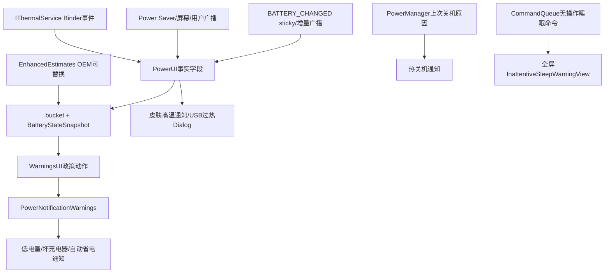
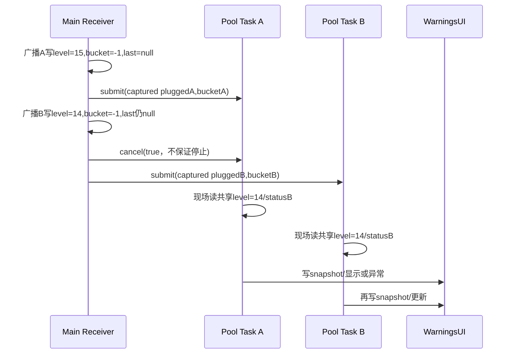
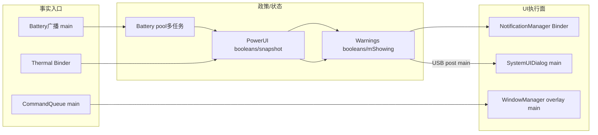

# 第 453 章 Android SystemUI PowerUI：低电量、温度、USB 过热与警告状态链

> 源码基线：Android 11 / API 30 / `android-11.0.0_r48`。本章只在 macOS 阅读，不实际编译。核心文件：`PowerUI.java`、`PowerNotificationWarnings.java`、`BatteryStateSnapshot.kt`、`EnhancedEstimatesImpl.java`、`InattentiveSleepWarningView.java`、SettingsLib `BatterySaverUtils.java`、PowerUI/Warnings 单元测试，以及 CommandQueue 与 system_server 的 InattentiveSleepWarning 调用链。

## 1. 本章要解决什么问题

电量下降时，SystemUI 怎样区分普通低电量、严重低电量、无效充电器和省电模式？温度警告来自轮询还是 ThermalService？USB 过热为什么是不可取消 Dialog？设备上次因过热关机又怎样只提示一次？最后，PowerUI 的“BatteryStateSnapshot”是否真的是一个一致快照？

## 2. 一句话主线

PowerUI 在主进程接收电池/屏幕/省电/用户广播，计算电量 bucket 并异步生成 BatteryStateSnapshot，再调用 WarningsUI；PowerNotificationWarnings 把政策状态投影成低电量、坏充电器、自动省电、高温及热关机通知/对话框；另由 ThermalService Binder listener 驱动皮肤和 USB 紧急温度警告，由 CommandQueue 驱动长时间无操作即将睡眠的全屏遮罩。

## 3. 三层模型

第一层是事实：BATTERY_CHANGED、PowerManager、Temperature；第二层是政策：bucket、hybrid 阈值、每充电周期只提醒一次、VR 抑制；第三层是 UI：Notification、SystemUIDialog、overlay。WarningsUI 不自己读取电池，PowerUI 也不自己构造通知，二者通过接口解耦。

## 4. 主要进程

PowerUI、PowerNotificationWarnings、Dialog 和 InattentiveSleepWarningView 都在 SystemUI 主进程；BATTERY_CHANGED 由系统广播进入；IThermalService 在 system_server 并通过 Binder 回调；NotificationManager、PowerManager、StatusBarManager 同样跨 Binder；BatterySaverUtils 的广播仍回到 SystemUI 动态 Receiver。

## 5. 主要线程

PowerUI.start、BroadcastDispatcher 指定的 Handler、ContentObserver 和 CommandQueue callback 通常在 SystemUI 主线程；电池 warning 评估与省电模式后的 dismiss 被投到 SettingsLib 共享固定线程池；Thermal listener 是 Binder 回调线程；USB alarm 特意 post 到主 Handler。PowerNotificationWarnings 的字段因此并非天然只被一个线程访问。

## 6. 总体架构



## 7. PowerUI 怎样进入启动数组

SystemUI config 的 service 列表包含 `com.android.systemui.power.PowerUI`，由 SystemUIApplication 按顺序实例化并调用 start。它是 `@Singleton`，又实现 CommandQueue.Callbacks；start 不是 Android Service 生命周期，而是 SystemUI 模块生命周期。

## 8. start 做的第一批事

取得 PowerManager，按当前屏幕状态初始化 screenOffTime；从旧 Dependency 取 WarningsUI 与 EnhancedEstimates；保存当前 Configuration；注册低电量触发设置 observer；计算资源阈值；初始化广播 Receiver。

## 9. start 做的第二批事

检查上次是否因热关机；观察皮肤/USB 温度警告 Global setting；初始化 Thermal listener 注册；最后订阅 CommandQueue。任一步未捕获的异常都会让 PowerUI start 失败，没有全局回滚前面已注册的 observer/receiver。

## 10. 广播订阅了什么

Receiver 监听 POWER_SAVE_MODE_CHANGED、BATTERY_CHANGED、SCREEN_OFF、SCREEN_ON 和 USER_SWITCHED。它通过 BroadcastDispatcher 的指定 Handler 接收；同时因 BATTERY_CHANGED 是 sticky，又直接 `registerReceiver(null, filter)` 取一次初值。

## 11. 为什么还要显式取 sticky

BroadcastDispatcher 的注册是异步接线，不能保证立即回放初值。PowerUI 若还没收到过 battery，就直接查询 sticky Intent 并手调 onReceive。`mHasReceivedBattery` 只防止 Receiver.init 被重复调用时再次取，不防真实广播紧接着到达。

## 12. 缺失 extra 的保守默认值

level 默认 100，status 默认 UNKNOWN，plugged 默认 1，invalid charger 默认 0。缺少电源状态时默认“已插电”会阻止低电量警告；缺 status 也阻止显示，倾向于避免误报。

## 13. 屏幕时间账

SCREEN_OFF 把 `mScreenOffTime=elapsedRealtime()`，SCREEN_ON 置 -1；每次 battery update 传给 WarningsUI。PowerNotificationWarnings 保存该值，但 r48 当前通知构造主链没有明显消费它，属于历史/扩展接口数据。

## 14. 用户切换做什么

PowerUI 不重置电量或 bucket，只调用 `mWarnings.userSwitched()`；PowerNotificationWarnings 重新 `updateNotification()`。通知都发给 UserHandle.ALL，但 PendingIntent 使用 CURRENT，重建可让当前用户操作入口和文案重新投影。

## 15. 电池 warning 阈值来自哪里

critical 与 low level 来自 framework internal resources，若 low 小于 critical 就钳到 critical；close level = low + `config_lowBatteryCloseWarningBump`。它构成“进入警告”和“恢复正常”不同阈值，避免电量在边缘抖动时反复出现/消失。

## 16. 被观察的 Setting 没参与公式

PowerUI 观察 `Settings.Global.LOW_POWER_MODE_TRIGGER_LEVEL`，变化后调用 updateBatteryWarningLevels；但该方法只重读三个 resource，没有读取这个 setting。裸 r48 中改自动省电百分比会触发一次无实际变化的重算，像是旧实现残留或 OEM 资源联动预留。

## 17. bucket 的四段语义

level ≥ close 是 1（正常且可关闭警告）；low < level < close 是 0（滞回区）；critical < level ≤ low 是 -1（低）；level ≤ critical 是 -2（严重）。数值越小越危险，不能按常见“数字越大越严重”理解。

## 18. 边界包含关系

恰好等于 low 时进入 -1，恰好等于 critical 时进入 -2，恰好等于 close 时回 1。0 只表示已越过 low 但尚未回到明确关闭线，不等于“电量未知”。

## 19. bucket 源码

```java
private int findBatteryLevelBucket(int level) {
    if (level >= mLowBatteryAlertCloseLevel) return 1;
    if (level > mLowBatteryReminderLevels[0]) return 0;
    final int N = mLowBatteryReminderLevels.length;
    for (int i = N - 1; i >= 0; i--) {
        if (level <= mLowBatteryReminderLevels[i]) {
            return -1 - i;
        }
    }
    throw new RuntimeException("not possible!");
}
```

## 20. 为什么先更新 WarningsUI 基础字段

每次 BATTERY_CHANGED 在异步判断前先 `mWarnings.update(level,bucket,screenOffTime)`。PowerNotificationWarnings 用它更新通知百分比、触发时间和 bucket；随后 `updateSnapshot()` 再给完整 snapshot，最后 show/dismiss/update 构造 UI。

## 21. warningTriggerTime 怎样变化

bucket ≥ 0 时清零；bucket 比旧 mBucket 更低时记 wall-clock 当前时间。通知 setWhen 使用该时间但 setShowWhen(false)，主要用于系统通知排序/“bump”，不是显示给用户的时间戳。

## 22. 无效充电器优先级

invalid 从 0 变非 0，立即 showInvalidChargerWarning 并 return，不启动低电量评估；从非 0 恢复 0 先 dismiss；若 WarningsUI 仍报告坏充电器正在显示，也 return。坏充电器优先于低电量，因为继续使用错误电源是更直接风险。

## 23. invalid 状态由边沿还是电平决定

PowerUI 同时看旧新边沿和 WarningsUI 当前 UI boolean。进程首次 sticky 就是 invalid=1 时也能因 0→1 显示；如果 UI 状态与 PowerUI 字段分裂，`isInvalidChargerWarningShowing()` 会继续压住低电量。

## 24. 取消旧电池任务不等于它停止

收到新 battery 时对 `mLastShowWarningTask.cancel(true)`，再向 ThreadUtils 固定线程池 submit 新任务。若旧任务尚未开始，通常能取消；若已运行，代码不检查 interrupt，Notification/Binder 调用也未必响应中断，所以旧任务仍可继续写 snapshot 和 UI。

## 25. 共享线程池不是串行 Handler

ThreadUtils 使用 `Executors.newFixedThreadPool(availableProcessors)`，多个 battery 评估可以并行。PowerUI 只有一个 Future 引用，只能取消最近一项；更早已运行任务不受新 Future 管理，完成顺序可能与广播顺序不同。

## 26. 异步任务捕获了什么

lambda 捕获本次广播计算的 `plugged` 与 `bucket`，但 maybeShowBatteryWarningV2 又现场读取共享 `mBatteryLevel`、`mBatteryStatus`、PowerManager saver，并写共享 current snapshot。于是旧任务可能组合“旧 plugged/bucket + 新 level/status”，并非同一广播的原子事实。

## 27. lastSnapshot 在哪个线程更新

BATTERY_CHANGED 主线程先做 `last = current`；current 却由后台任务稍后写。连续广播若都发生在第一个任务完成前，last 仍为 null。后台任务之间也无锁读写 current/last，Kotlin data class 虽不可变，引用代际却不一致。

## 28. 首次评估的 null 边界

源码字段初始都是 null；首个 battery 广播把 last 设为 current(null)，后台创建 current 后，standard 和 hybrid 的 maybe 方法都立即解引用 last 来算 playSound。仅从 r48 代码可推导首次任务存在 NullPointerException 路径；任务由 `ExecutorService.submit()` 包进 Future且从不 get，异常可能只被 Future 保存而不形成醒目崩溃日志。current 已在异常前写入，所以下一条 battery 广播又可能自愈。

## 29. BatteryStateSnapshot 是否真正快照

对象本身是不可变 data class，适合一次计算；但构造输入来自不同代际，last 引用又在另一线程更新，所以“容器不可变”不等于“采样原子”。正确方案应在 Receiver 主线程一次性捕获完整 primitive state，并把 current/last 作为参数交给单线程 evaluator。

## 30. 电池异步竞态图



## 31. EnhancedEstimates 的作用

接口可提供预计剩余时间、平均放电时间、low/severe 时间阈值、是否基于个人使用，以及低警告是否开启。OEM 可以替换绑定，用“还剩多久”而不只是百分比判断。

## 32. 裸 AOSP 默认走哪条路

`EnhancedEstimatesImpl.isHybridNotificationEnabled()` 固定 false，estimate 返回 unknown，两个时间阈值为 0。因此本源码基线默认走 standard bucket 分支；hybrid 代码和测试是可替换产品实现的能力，不应写成裸 AOSP 必然行为。

## 33. standard snapshot 装什么

level、power saver、plugged、bucket、battery status、critical level、low level；时间相关字段全部 -1，`isLowWarningEnabled=true`，构造后 `isHybrid=false`。它仍被传给通知用于百分比和红色判断。

## 34. standard 显示条件

当前未插电、未开启省电、status 非 UNKNOWN，并且当前 bucket<0；同时要求 bucket 比上次更危险，或上次仍插电。也就是跨阈值或在低电量状态拔电才弹，不会每个百分比重复 show。

## 35. standard 声音条件

`playSound = current.bucket != last.bucket || last.plugged`。即 bucket 跨段或刚从插电状态进入评估会允许声音。真正通知 Builder 用 `setOnlyAlertOnce(!mPlaySound)`，发布后立刻清 playSound。

## 36. standard 关闭条件

省电模式开启、重新插电，或 bucket 向上跨越且当前已经 >0。-1→0 不关闭，因为 0 是滞回区；要到 1 才明确关闭，防止边缘波动。

## 37. 只更新不显示/关闭的区间

如果既不应 show，也不应 dismiss，就 `updateLowBatteryWarning()`。若 warning 当前 true，会刷新百分比/估计；若 false，updateNotification 只保持无通知或其他优先 UI。

## 38. 省电模式广播做什么

它另投一个后台任务：若 PowerManager 当前为 saver，就 dismissLowBatteryWarning。关闭 saver 时不主动重新评估；要等下一次 BATTERY_CHANGED 才可能再显示。这个任务与 battery evaluator 共用多线程池，也可乱序。

## 39. standard 判断源码

```java
boolean shouldShowLowBatteryWarning(BatteryStateSnapshot cur,
        BatteryStateSnapshot last) {
    return !cur.getPlugged()
            && !cur.isPowerSaver()
            && ((cur.getBucket() < last.getBucket() || last.getPlugged())
                    && cur.getBucket() < 0)
            && cur.getBatteryStatus() != BatteryManager.BATTERY_STATUS_UNKNOWN;
}

boolean shouldDismissLowBatteryWarning(BatteryStateSnapshot cur,
        BatteryStateSnapshot last) {
    return cur.isPowerSaver() || cur.getPlugged()
            || (cur.getBucket() > last.getBucket() && cur.getBucket() > 0);
}
```

## 40. 为什么 status 用 BATTERY_STATUS 而非 HEALTH

生产代码读取 `BatteryManager.EXTRA_STATUS`，值应是 CHARGING/DISCHARGING/FULL/NOT_CHARGING/UNKNOWN。部分测试 wrapper 却赋 `BATTERY_HEALTH_GOOD`；该整数碰巧不是 UNKNOWN，足以测试门条件，但命名语义错位，不能把测试常量当生产字段含义。

## 41. hybrid snapshot 多了什么

它增加预计剩余时间、平均放电时间、严重/低时间阈值、是否基于使用习惯和是否允许低警告，并标记 isHybrid=true。构造时仍保留 level/bucket，使时间估计不可用时能回退百分比门。

## 42. estimate 何时刷新

last 为 null、last estimate=-1，或当前 battery level 与 last level 不同就向 EnhancedEstimates 查询；否则复用 last 的 estimate、usage flag 和 average discharge。因为 last 代际本就有竞态，缓存命中也可能不可靠。

## 43. hybrid 低警告门

必须未显示过低警告、低警告 enabled、未开 saver，并且“有效剩余时间低于 low 时间阈值”或“level≤low 百分比阈值”。再叠加总门：未插电且 status 非 UNKNOWN。

## 44. hybrid 严重警告门

严重警告只要求本充电周期尚未显示，并满足 severe 时间或 level；它不受 low-warning-enabled 和 power saver 限制。因此省电模式可以压普通低警告，但不能压住真正严重警告。

## 45. 一次充电周期怎样记账

显示普通 warning 后设 lowShown；显示 severe 后同时设 severeShown 与 lowShown，防止随后倒退成普通提醒。这里只是进程内 boolean，没有 SharedPreferences；SystemUI 进程重启会忘记本周期已提示。

## 46. 何时重置本周期标志

level≥45%，并且剩余时间 >6小时或 estimate unavailable，就把两个 shown 都清 false。条件不要求 plugged；一次错误的高 level/估计广播也可重置，之后同一实际放电周期可能再提醒。

## 47. hybrid 关闭条件

插电，或有效/无效 timeRemaining 数值大于 low threshold。注意 -1 不大于正常正阈值，因此 estimate unknown 且电量恢复但未触发 show 时，dismiss 不依 level；这可让已有 hybrid 通知继续 update，直到插电或取得较长估计。

## 48. hybrid 的“低于”是严格比较

时间触发用 `< threshold`，不是 ≤；百分比触发用 ≤。恰好等于时间阈值不触发，恰好等于百分比阈值触发。测试若只用明显上下值会漏掉这个边界。

## 49. Snapshot 先交给 WarningsUI

maybeShowBatteryWarningV2 构造 current 后先 `mWarnings.updateSnapshot(current)`，再决定 show/dismiss/update。PowerNotificationWarnings 的 showWarningNotification 会立即解引用 snapshot；顺序正确，但跨线程若另一任务覆盖 snapshot，显示的 level/时间可能不是触发该 show 的那一份。

## 50. WarningsUI 是命令接口还是状态接口

两者兼有：update/updateSnapshot 写事实，show/dismiss/update 发命令，isInvalidChargerWarningShowing 反查 UI 状态，userSwitched 重投影。这种混合使 PowerUI 与具体实现仍共享隐式状态机；更纯的方式是一次提交完整 model，由 renderer 幂等计算 UI。

## 51. PowerNotificationWarnings 的三项互斥账

`mInvalidCharger`、`mWarning`、`mShowAutoSaverSuggestion` 按优先级选择；`mShowing` 记录上次选择：NOTHING、WARNING、INVALID、AUTO_SAVER。索引2字符串 SHOWING_SAVER 没有对应常量，是已移除实现残留。

## 52. updateNotification 优先级

invalid charger 第一，low warning 第二，auto saver suggestion 第三，最后取消三种通知。它把业务 boolean 当事实，调用多次应得到同一选择，因此具备一定幂等性。

## 53. 单一 mShowing 不等于底层只剩一条通知

showInvalid 只取消 low，showWarning 只取消 bad charger；二者都不取消 auto-saver suggestion。若 auto suggestion 已发布后 invalid/warning 置真，旧 suggestion 可能继续存在，而 mShowing 只能记一个状态。只有 NOTHING 分支取消三者。

## 54. invalid charger 通知

使用 ALERTS channel、ongoing、无时间、全用户发布，先取消 NOTE_POWER_LOW。没有 contentIntent 或 action，用户只能修复充电器状态，PowerUI 收到新 battery invalid=0 后取消。

## 55. 低电量通知的内容

standard 显示百分比；hybrid 用 PowerUtil 组合剩余时间、百分比与 usage-based 文案。通知 VISIBILITY_PUBLIC，锁屏可见；可解析 Battery Settings 时点击打开电量页；未开 saver 时附“开启省电模式”Action。

## 56. 红色判断

standard 永远按 error color；hybrid 在 bucket<0 或 timeRemaining<severe threshold 时变红。若 hybrid 因普通时间阈值触发但 percentage bucket 尚正常且未到 severe time，颜色可保持普通主题色。

## 57. deleteIntent 表示什么

用户侧滑低电量通知会发 ACTION_DISMISSED_WARNING，Receiver 把 mWarning=false。它不在 PowerUI 记录“用户已手动忽略本 bucket”；下一次状态跨 bucket 或拔电仍可重新 show，standard 没有每周期抑制账。

## 58. PendingIntent 的用户与权限

通知 action 用显式 package 的 foreground broadcast、UserHandle.CURRENT；Warnings Receiver 按 UserHandle.ALL 注册并要求 DEVICE_POWER permission。普通无权限应用难以伪造这些内部 action；r48 PendingIntent 未加 IMMUTABLE，属于 Android 11 常见旧写法。

## 59. 点击“开启省电”

Receiver 调 `BatterySaverUtils.setPowerSaveMode(context,true,true)`，第三个参数要求首次提示；随后立即 dismiss 低电量通知。真正 saver 是否成功由 PowerManager/Settings 后续事实确认，UI 命令没有 ACK。

## 60. 首次省电确认

BatterySaverUtils 若需要教育会广播 ACTION_SHOW_START_SAVER_CONFIRMATION。PowerNotificationWarnings 先关低电量通知，再根据 extras 显示确认或仅确认计划设置的 Dialog；后者写 automatic mode、trigger level 和 CURRENT 用户 acknowledged。

## 61. 自动省电建议从哪里来

BatterySaverUtils 在多次手动开启且满足策略时给 SystemUI 发 ACTION_SHOW_AUTO_SAVER_SUGGESTION；Warnings 发布 HINTS channel 通知，点击进入 battery saver schedule，No thanks 则 suppress 后续建议。

## 62. 动态 Receiver 的时序

PowerNotificationWarnings 构造函数里就注册 Receiver，比 PowerUI.start 取得它更早。registerReceiverAsUser 使用主 Handler，所以 notification action 和 BatterySaverUtils 广播通常在主线程处理；PowerUI 后台 evaluator 却可同时改它的 boolean。

## 63. Warnings 状态跨线程风险

`mWarning/mInvalidCharger/mShowing/mCurrentBatterySnapshot` 没 synchronized/volatile。主线程 action、共享池 battery task、PowerSave task和 Binder thermal callback会并发调用方法。Java 层没有 happens-before 统一保证，也没有 serial executor；通知最终可能按旧状态重建。

## 64. 高温通知不在三项互斥账里

皮肤高温用独立 tag/id、`mHighTempWarning`，可以与低电量/坏充电器同时出现。它走 ALERTS channel，public、红色，点击转高温 Dialog，侧滑只取消高温通知。

## 65. 点击高温通知

Receiver 先 `dismissHighTemperatureWarningInternal()` 清通知与 boolean，再创建 show-for-all-users SystemUIDialog。Dialog 可选 Help URL，经 ActivityStarter 打开并收 Shade；点击 OK 或 dismiss 只释放 dialog 引用。

## 66. 热关机提示如何避免每次启动重复

SharedPreferences 保存上次检查的 BOOT_COUNT。若全局 boot count 增大，先异步 apply 新 count，再询问 PowerManager.getLastShutdownReason；只有 THERMAL_SHUTDOWN 才发通知。即使不是热关机，也记住本次 boot，不重复检查。

## 67. BOOT_COUNT 读取失败

bootCount 保持 -1，与 lastReboot 比较通常不大，不显示也不更新 pref。下次 PowerUI/进程启动可重试。若 SharedPreferences apply 尚未落盘进程崩溃，同一次 boot 可能再次提示。

## 68. 热关机通知与 Dialog

通知独立 NOTE_THERMAL_SHUTDOWN，点击先取消再显示 show-for-all-users Dialog，侧滑只取消。帮助链接与高温 Dialog 类似；它说明“上次关机”而非当前温度，不由 Thermal listener dismiss。

## 69. Thermal listener 的启用来源

SHOW_TEMPERATURE_WARNING 和 SHOW_USB_TEMPERATURE_ALARM 两个 Global setting 优先，缺值时回退 SystemUI resources。ContentObserver 在 main Handler 上重新注册/注销；MCC/MNC 配置变化也 post 重新读取，以适配运营商资源覆盖。

## 70. 注册状态机

先保存 oldEnable，再把字段写成“设置期望”；仅新旧不同才创建 listener、获取 IThermalService 并 register/unregister。Binder 返回 false 或 RemoteException 时，最后把 enable field 翻回旧值，表示实际注册状态而不是用户期望。

## 71. 注册源码

```java
mEnableSkinTemperatureWarning = Settings.Global.getInt(resolver,
        Settings.Global.SHOW_TEMPERATURE_WARNING,
        defaultValue) != 0;
if (mEnableSkinTemperatureWarning != oldEnable) {
    if (mSkinThermalEventListener == null) {
        mSkinThermalEventListener = new SkinThermalEventListener();
    }
    if (mThermalService == null) {
        mThermalService = IThermalService.Stub.asInterface(
                ServiceManager.getService(Context.THERMAL_SERVICE));
    }
    ret = mEnableSkinTemperatureWarning
            ? mThermalService.registerThermalEventListenerWithType(
                    mSkinThermalEventListener, Temperature.TYPE_SKIN)
            : mThermalService.unregisterThermalEventListener(
                    mSkinThermalEventListener);
    if (!ret) mEnableSkinTemperatureWarning = !mEnableSkinTemperatureWarning;
}
```

## 72. ThermalService 为 null 的边界

Stub.asInterface(null) 得到 null，下一行解引用会 NullPointerException；catch 只捕获 RemoteException。正常系统必有 thermal service，但早期启动、设备裁剪或服务死亡场景没有 null/rebind 保护。

## 73. Binder 死亡如何恢复

PowerUI 没 linkToDeath，也不在 RemoteException 后清 `mThermalService`。注册失败会回滚 boolean，只有 setting 再变化或 MCC/MNC 配置回调才重试；单纯服务重启不会主动恢复 listener。

## 74. 皮肤温度阈值

只有 status≥THROTTLING_EMERGENCY 才显示；CRITICAL 仍走 else dismiss。这里比较的是 Thermal HAL/Service 给出的 throttling status，不是硬编码 60/65°C；测试温度值只是构造样例，真正阈值由设备 thermal 配置决定。

## 75. VR 模式的高温政策

紧急皮肤温度时，如果 StatusBar 报设备在 VR，就不 show；但该分支也不 dismiss 已有高温通知。若通知先出现、随后进入 VR 且仍持续 emergency，新的 emergency callback可能什么都不做，旧通知保留。

## 76. 皮肤降温怎样收敛

任何低于 EMERGENCY 的状态都调用 dismissHighTemperatureWarning；Warnings 先看 boolean，已 false 就直接返回。它不会自动关闭用户已打开的 high-temperature Dialog，只取消通知。

## 77. USB 温度政策不同

USB status≥EMERGENCY 就 show alarm；低于时什么都不做。USB Dialog 是需要用户明确处理的硬警报，不随一次降温 event 自动消失，也没有 mUsb alarm boolean 状态在 PowerUI。

## 78. 为什么 USB 回调 post 主线程

IThermalEventListener 在 Binder 线程；PowerNotificationWarnings.showUsbHighTemperatureAlarm 先 post main Handler，再创建 Dialog、读 Keyguard、操作 Window。皮肤 show/dismiss 直接在 Binder 线程构建/cancel Notification，只有 USB 路径显式线程归一。

## 79. USB Dialog 的强约束

Dialog 使用 alert theme、不可 cancel、全用户、TURN_SCREEN_ON 与 KEEP_SCREEN_ON。用户只能按 OK 或“帮助/护理步骤”；帮助显式启动 Settings HelpTrampoline。它记录显示/关闭事件及当时 Keyguard 是否锁定。

## 80. 重复 USB emergency 如何去重

主线程执行时若 `mUsbHighTempDialog != null` 就 return；多个 Binder event 可排多个 Runnable，但第一个创建后后续被抑制。用户关闭后字段置 null，持续温度若 ThermalService 再发 event 可再次弹；没有冷却周期或 session id。

## 81. Inattentive Sleep 不属于电量警告

它也放在 PowerUI，是因为 system_server PowerManager 负责长时间无交互睡眠政策。InattentiveSleepWarningController 经 StatusBarManagerService/IStatusBar/CommandQueue 发 show/dismiss，PowerUI 只负责 SystemUI 端 overlay，不参与超时计算。

## 82. CommandQueue 怎样交付

Binder 命令被 CommandQueue 编码为主线程 Message，再遍历 callbacks；PowerUI.start 最后 addCallback，因此 overlay View 操作发生在 SystemUI 主线程。show/dismiss 消息没有在此处做 generation，正确性依赖队列顺序。

## 83. Overlay Window 参数

View 是全屏 MATCH_PARENT、TYPE_SYSTEM_OVERLAY、TRANSLUCENT、FLAG_LAYOUT_IN_SCREEN，并加 SHOW_FOR_ALL_USERS 私有 flag；自己创建 Binder token。它默认可聚焦，内部 OnKeyListener 吞所有按键，避免用户继续用按键与下面 UI 交互。

## 84. show 的幂等性

若已有 parent，show 不重复 add；若正 fade-out，则 cancel animator，onCancel 恢复 alpha/visibility 并把 dismissing=false。若没有 parent，就直接恢复 alpha/visible 并 addView。

## 85. dismiss 的两条路

无 parent 直接 return；否则置 dismissing=true。animated 用 postOnAnimation 启动 framework fade_out，动画结束 remove；非动画立即 invisible + WindowManager.removeView。

## 86. Overlay 关键源码

```java
public void show() {
    if (getParent() != null) {
        if (mFadeOutAnimator.isStarted()) mFadeOutAnimator.cancel();
        return;
    }
    setAlpha(1f);
    setVisibility(View.VISIBLE);
    mWindowManager.addView(this, getLayoutParams(mWindowToken));
}

public void dismiss(boolean animated) {
    if (getParent() == null) return;
    mDismissing = true;
    if (animated) postOnAnimation(mFadeOutAnimator::start);
    else removeView();
}
```

## 87. mDismissing 的残留

removeView 成功后不把 mDismissing 恢复 false；下一次 show 在无 parent 分支也不重置。后续 dismiss 会再次写 true，所以主要流程仍工作，但 dump/扩展若把它当当前状态会误判，字段生命周期不闭合。

## 88. WindowManager 异常缺口

addView/removeView 没 catch BadTokenException、IllegalArgumentException 或重复移除异常。PowerUI 也没有 View attach listener修正状态；system_server 认为已 show/dismiss 与 SystemUI Window 实际结果可能分裂。

## 89. show 与动画 dismiss 交错

show 在 fade-out 已 started 时 cancel，Animator 通常先 onCancel 再 onEnd；onCancel 把 dismissing=false，因此紧接的 onEnd 调 removeView 会因 false 不移除，达到“重新显示”效果。这个正确性依赖 listener 顺序和 removeView 的 boolean 门。

## 90. PowerUI dump 提供什么证据

输出 low/critical/close levels、当前 level/status/plug type/invalid charger、screenOffTime 与距今时长、LOW_BATTERY_SOUND_TIMEOUT、当前 bucket、两种 thermal enable，再委托 WarningsUI dump UI booleans/Dialog 引用。

## 91. dump 缺少什么

没有 current/last BatteryStateSnapshot、Future 状态/任务代际、shown-this-cycle 两个 boolean、estimate provider、thermal listener Binder身份、通知实际存在性和 overlay parent/dismissing。异步错乱时仅靠 dump 难以还原哪一代任务最后写入。

## 92. 低电量声音超时只是 dump

PowerUI dump 读取 LOW_BATTERY_SOUND_TIMEOUT，但本章 r48 PowerNotificationWarnings 构建通知未消费这个 setting；实际发声由 notification channel 与 onlyAlertOnce/playSound 控制。不要看到 dump 字段就推断当前类实现了超时门。

## 93. 温度轮询常量是残留

`TEMPERATURE_INTERVAL`、`TEMPERATURE_LOGGING_INTERVAL`、`MAX_RECENT_TEMPS`、`THREE_HOURS_IN_MILLIS` 在当前 PowerUI 文件没有其他引用。r48 主链已经改用 IThermalEventListener，不存在每30秒主动采温的实现；常量不能当执行证据。

## 94. Configuration 只看 MCC/MNC

onConfigurationChanged 用 `CONFIG_MCC | CONFIG_MNC` mask，只有运营商国家/网络码变化才 post initThermalEventListeners；locale、density、night mode不会触发这里的注册重算。通知/Dialog 文案依赖资源，但通常在下次构建时自然取新资源。

## 95. Warnings dump 的小缺陷

它打印 `mSaverEnabledConfirmation=` 后没有 println 对应字段值，下一项高温输出会接在同一行，影响可读性。SHOWING_STRINGS 又保留未用 index2；诊断输出本身也需要按源码复核，不能完全信任格式。

## 96. 通知全用户与 Dialog 全用户

低电量、温度等 NotificationManager 调用多为 UserHandle.ALL；SystemUIDialog 调 `setShowForAllUsers(true)`；PendingIntent 的实际操作用户却是 CURRENT。设计目标是硬件级风险对当前可交互用户可见，同时动作落到当前用户设置页。

## 97. CURRENT 的时刻语义

PendingIntent 创建时指定 UserHandle.CURRENT，发送时系统解析当前用户；通知跨用户存在时，新用户点击会打开自己的设置。这也是 userSwitched 重新 updateNotification 的原因之一，但硬件警告 boolean 本身仍全局共享。

## 98. 热警告与 VR 的职责边界

PowerUI 只问 `StatusBar.isDeviceInVrMode()`，没有直接监听 VR 状态。进入/退出 VR 本身不触发重新判断；只有新的 thermal event 才评估。因此 VR 政策是事件时采样，不是持续约束。

## 99. 低电量与坏充电器的状态收敛

PowerUI 先更新基础 level/bucket，再把 invalid charger 当高优先级短路；invalid 清除的同一广播会继续排 low evaluator。WarningsUI 自己也按 invalid boolean优先。双层门可以避免同次广播闪出低电量，但并发旧 evaluator 仍可能在 invalid show 后调用 low show；renderer 最终会因 invalid 优先保持坏充电器。

## 100. 旧 evaluator 会不会绕过 invalid

它调用 `showLowBatteryWarning` 把 mWarning=true，再 updateNotification；若 mInvalidCharger=true，仍显示 invalid，低 warning boolean 暗中保持。以后 invalid 清除时 updateNotification 会立刻显示旧 low warning，即使当前电池状态已不满足，直到新 evaluator纠正。

## 101. Power saver 任务会不会永久解决竞态

不会。它只在执行时发现 saver=true 就 dismiss；并行 battery task也读 saver，但完成顺序不受广播顺序保护。旧 battery task可在 dismiss 后再次 show，尤其其 snapshot 是混合代际。单线程状态机比“多任务互相纠正”可靠。

## 102. 更稳健的电池处理模型

Receiver 生成带 sequence 的完整 `BatteryEvent(level,status,plug,invalid,bucket,screenOff,saver)`；单线程 executor 串行 reduce；丢弃 sequence 小于 latest 的结果；首次 last=current 或提供显式初始态；UI 更新统一 post main；Warnings renderer 从完整 model 幂等选择通知。

## 103. 更稳健的 Thermal 模型

按 sensor type 保存 `registered、lastStatus、generation`，Binder death 清 registered 并指数退避重连；所有 notify post main；皮肤将 VR 状态变化也作为 reduce 事件；USB Dialog用 alarm generation 去重且明确“降温是否自动关”的产品政策。

## 104. 低电量故障诊断顺序

先看 sticky BATTERY_CHANGED 的 level/status/plugged/invalid；再用 dump 看 thresholds/bucket；确认 naked AOSP 还是 OEM hybrid provider；查 saver；查 PowerUI 当前/last snapshot与后台 task代际；最后看 Warnings booleans、NotificationManager tag/id和 channel。不要一上来只改通知布局。

## 105. 高温不提示的诊断顺序

查 Global setting/resource default、mEnable 字段、IThermalService 注册返回、sensor type、Temperature.status 是否到 EMERGENCY、是否 VR、Warnings boolean与通知 id。温度 value 本身不在 PowerUI 比较，直接盯摄氏值容易误判。

## 106. USB Dialog 不消失是否一定是 bug

不一定。r48 明确没有 status 降低后的 dismiss，且 Dialog cancelable=false；它是需人工确认的安全 alarm。只有产品需求规定“降温自动关闭”时才是行为缺口；源码层事实应先陈述，再评价策略。

## 107. Inattentive overlay 不出现的诊断顺序

从 PowerManagerService 的 inactivity policy、InattentiveSleepWarningController `mIsShown`，追 SBMS mBar、IStatusBar 命令、CommandQueue Message、PowerUI callback、overlay parent、WindowManager add结果与动画状态。它与 BATTERY_CHANGED、ThermalService 无关。

## 108. 测试覆盖了哪些 Thermal 事实

PowerUITest 验证 CRITICAL 不显示/会 dismiss 皮肤警告、EMERGENCY 显示、USB CRITICAL 不弹/EMERGENCY 弹，以及 setting 覆盖 resource、注册/注销成功失败时 boolean 回滚。它证明阈值分支和注册状态机的局部行为。

## 109. 测试覆盖了哪些电池政策

单测直接构造 Snapshot，覆盖 hybrid low/severe/once-per-cycle/reset、standard 插电/省电/UNKNOWN/bucket 边沿、dismiss条件和 estimate缓存。它们绕开真实 Receiver、ThreadUtils 并发与首次 null last，不能证明端到端调度安全。

## 110. Warnings 测试覆盖了什么

验证 invalid/low/high-temp/thermal-shutdown 的 notify/cancel id、BATTERY channel 和 USB Dialog最终非空。没有覆盖互斥状态与 auto suggestion 共存、跨线程、Receiver permission/action、Dialog帮助失败、user switch及 notification action 的完整 round trip。

## 111. 状态—UI—线程对照图



## 112. macOS只读练习一：手算 bucket 滞回

从本机 framework resources 查 low、critical、close bump 的实际值，分别手算 `close、low+1、low、critical+1、critical` 五个 level 的 bucket；再推演电量从 -1 回到0为何不 dismiss、到1才 dismiss。只读，不改资源。

## 113. macOS只读练习二：推演两次快速电池广播

沿 Receiver、ThreadUtils 与 maybeShowBatteryWarningV2，假设广播A为15%未插电、广播B为14%插电，旧任务 cancel 时已经运行；逐字段写出每个任务捕获值与现场读值，说明怎样构成混合 Snapshot，并设计 sequence+单线程概念修复。

## 114. macOS只读练习三：对比皮肤与 USB 高温

为 CRITICAL、EMERGENCY、降温、VR、重复 event 各画两列结果：skin notification 与 USB Dialog。验收：能解释阈值看 status而非摄氏值、skin会自动 dismiss、USB不会、以及只有USB路径显式post主线程。

## 115. macOS只读练习四：追无操作睡眠遮罩

只读搜索 `showInattentiveSleepWarning`，从 system_server PowerManager controller 追到 SBMS、IStatusBar、CommandQueue、PowerUI 和 WindowManager；记录每次 Binder/Handler切换，并推演 fade-out中再次show为何通过cancel保留View。

## 116. 复读后修正的第一个易错结论

不能说“Android 11 低电量按剩余时间提醒”。本基线默认 EnhancedEstimatesImpl 明确关闭 hybrid，裸 AOSP按资源百分比 bucket；时间估计分支只有 OEM/产品替换 provider 后才生效。

## 117. 复读后修正的第二个易错结论

不能说“BatteryStateSnapshot 保证一次广播的一致状态”。data class只保证构造后字段不变；r48 任务捕获旧 plug/bucket，却现场读取新 level/status，current/last 又跨主线程和多线程池无锁更新，首先要修采样与调度代际。

## 118. 复读后确认的首帧缺口

首个 sticky battery 使 lastSnapshot 保持 null，而两套 maybe 逻辑都解引用 last。现有测试只直接传非 null wrapper，start测试也没有跑后台 warning闭环；由于 submit 的异常留在无人读取的 Future，症状可能只是首次 warning评估丢失，下一次广播因 current 已存在而恢复，不能只靠“进程没崩”排除。

## 119. 复读后确认的 UI 账缺口

Warnings 的 `mShowing` 只描述 low/invalid/auto三选一，却不保证三条底层通知真的互斥；invalid/low分支不取消已存在的 auto suggestion。再叠加跨线程 boolean 和全用户通知，dump 中一个枚举不能当 NotificationManager 实际状态证明。

## 120. 本章结论

PowerUI 是硬件事实到用户警告的政策汇合点：默认 percentage bucket 用滞回避免抖动，OEM可引入剩余时间与每周期抑制；坏充电器高优先，ThermalService按EMERGENCY驱动皮肤通知与USB强Dialog，上次热关机按boot count只提示一次，长时间无操作遮罩则来自独立CommandQueue链。r48最值得记住的边界是：电池“快照”由多线程混合采样、首次last可空、Future取消不是代际屏障、Warnings跨线程且单一mShowing不等实际通知集合。学会分事实、政策、UI和线程，才能准确定位误报、漏报、重复提醒与警告卡住。
