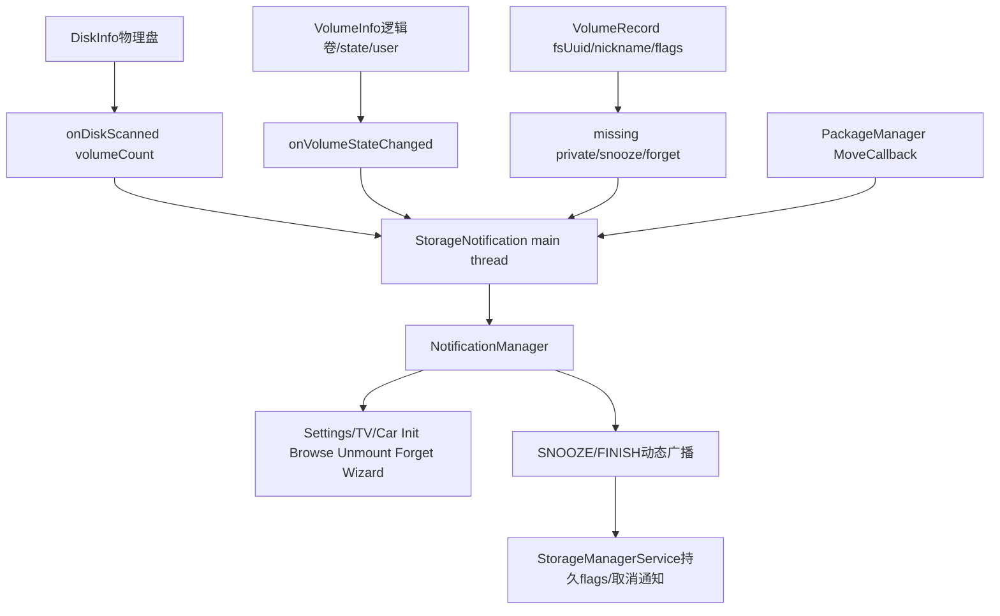
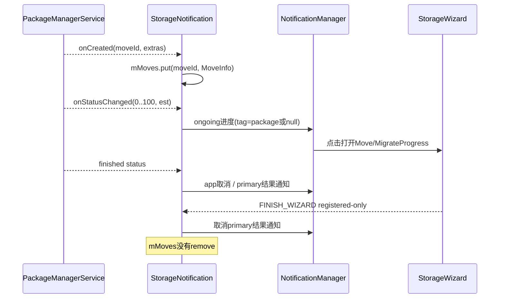
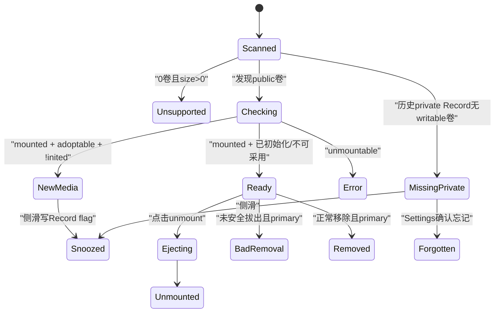

# 第 454 章 Android SystemUI StorageNotification：磁盘、卷、采用存储、迁移与通知动作链

> 源码基线：Android 11 / API 30 / `android-11.0.0_r48`。本章只在 macOS 阅读，不实际编译。核心文件：SystemUI `usb/StorageNotification.java`，framework `StorageManager.java`、`VolumeInfo.java`、`ApplicationPackageManager.java`，Settings 的 StorageWizard 页面，以及 StorageManagerService/PackageManager move 回调相关源码。本分支没有 StorageNotification 专用单元测试。

## 1. 本章要解决什么问题

插入 SD 卡或 USB 盘后，为什么有时显示“正在检查”、有时提示格式化、有时可以浏览/弹出？“私有卷缺失”为什么即使卡不在机器里仍能出现？应用移动与主存储迁移怎样更新进度？通知属于哪个用户，点击动作又按哪个用户执行？

## 2. 一句话主线

StorageNotification 在 SystemUI 启动时订阅 StorageManager 的 Disk/Volume/VolumeRecord 事件并重放当前状态，按 diskId、volumeId、fsUuid 发布不同通知；又订阅 PackageManager move callback，以 packageName 或 null tag 展示应用移动/主存储迁移；通知动作通过 PendingIntent 跳 Settings/TV/Car 页面，或广播 snooze、unmount、finish wizard。

## 3. 先分清 Disk、Volume、Record

DiskInfo 是物理介质，如一张卡/一个U盘；一个 Disk 可扫描出零个或多个 VolumeInfo。VolumeInfo 是本次发现并挂载的逻辑卷，有 state、type、mountUserId。VolumeRecord 是 StorageManagerService 持久保存的“曾见过的 fsUuid”记录，介质不在时仍存在，可保存 nickname、inited、snoozed。

## 4. 为什么三种身份不能混用

“整盘无支持分区”只能按 Disk 通知；“卷正在检查/可浏览/损坏”按 Volume；“已采用为内部存储但现在缺失”必须靠 Record，因为现场可能没有 Disk/Volume。对应通知 tag 分别是 diskId、volumeId、fsUuid。

## 5. 进程边界

StorageNotification 在 SystemUI 主进程；StorageManagerService/vold 状态在 system_server/native；PackageManager move 在 system_server；Settings/TV Settings/Car Settings 是外部系统应用。Listener 和 callback 都经 Binder 跨进程回 SystemUI，再用 NotificationManager 跨 Binder 发布。

## 6. 线程边界

StorageManager.registerListener 在 r48 用 Context mainExecutor 包装 listener；PackageManager.registerMoveCallback 传 `new Handler()`，而 start 正常在主线程，所以 move callback 也回主 Looper；两个动态 BroadcastReceiver 未指定 Handler，同样在主线程。mMoves 与通知状态因此主要是单线程，不像上一章的共享池竞态。

## 7. 总体架构



## 8. start 注册了什么

取得 NotificationManager/StorageManager，注册 StorageEventListener；注册 SNOOZE_VOLUME 与 FINISH_WIZARD 两个需要 MOUNT_UNMOUNT_FILESYSTEMS sender permission 的动态 Receiver；枚举当前 disks/volumes 重放；注册 move callback；最后扫描 missing private records。

## 9. start 是否幂等

不是。没有 started guard，也没有 stop/unregister；重复 start 会累计 Storage delegate、Receiver、MoveCallback，并重复通知。SystemUI 正常每进程只启动一次，但单元集成或错误重入会造成重复回调。

## 10. 为什么先注册 Listener 再枚举

这样能避免“枚举完到注册前”发生的状态变化永久丢失；代价是注册后的 callback 与同步枚举可能重复处理同一对象。通知按稳定 tag/id 覆盖，设计上偏向幂等重投影。

## 11. 初始化也不是原子快照

getDisks 与 getVolumes 是两次 Binder 查询，期间状态可变化；listener callback 又排在 main queue。可能先用旧列表显示一次，再被新事件覆盖。由于没有 generation，只能依赖最终事件到达与 tag一致性收敛。

## 12. StorageEventListener 五类事件

Volume state change 直接重算该卷；VolumeRecord changed 只在对应卷已 mounted readable 时重算卷；Volume forgotten 取消 fsUuid 的 private notification；Disk scanned 决定是否无支持卷；Disk destroyed 取消 disk notification。

## 13. Record changed 为什么要等 mounted readable

注释说早期 metadata 可能在 mount 前到达，不想制造跳动通知；已挂载后 record changed 多半是 nickname/inited 更新，值得刷新 ready/new media 文案。缺失卷没有 mounted readable，因此外部改 snooze/nickname 时不会立刻重算 missing 通知。

## 14. Disk scanned 的显示条件

只有 `volumeCount==0 && disk.size>0` 才提示“不支持的存储”，给格式化/初始化入口。size=0 或已有任何 volume 就取消 disk-level notification；空读卡器/未插介质不会误报损坏。

## 15. volumeCount 是什么证据

它表示扫描后识别到的卷数量，不等于已成功 mount。哪怕卷随后 UNMOUNTABLE，disk-level unsupported 会先取消，改由 volume-level error 通知接管。

## 16. Disk 通知身份

tag=disk.getId，id=NOTE_STORAGE_DISK，UserHandle.ALL。一个物理盘一个通知；disk destroyed 以相同 tag/id 全用户取消，不依赖卷用户。

## 17. Disk 通知的动作

手机跳 `StorageWizardInit` 并带 diskId；TV 发给 TV Settings 的 NEW_STORAGE action；Automotive buildInit 返回 null，通知仍可能展示但不可点击，源码留有 TODO。

## 18. Disk scan 源码

```java
private void onDiskScannedInternal(DiskInfo disk, int volumeCount) {
    if (volumeCount == 0 && disk.size > 0) {
        Notification.Builder builder = new Notification.Builder(
                mContext, NotificationChannels.STORAGE)
                .setContentTitle(unsupportedTitle)
                .setContentText(unsupportedText)
                .setContentIntent(buildInitPendingIntent(disk))
                .setCategory(Notification.CATEGORY_ERROR);
        mNotificationManager.notifyAsUser(disk.getId(),
                SystemMessage.NOTE_STORAGE_DISK,
                builder.build(), UserHandle.ALL);
    } else {
        mNotificationManager.cancelAsUser(disk.getId(),
                SystemMessage.NOTE_STORAGE_DISK, UserHandle.ALL);
    }
}
```

## 19. Volume type 怎样分流

TYPE_PRIVATE 只触发 updateMissingPrivateVolumes；TYPE_PUBLIC 才按 state 构建插拔/浏览通知；其他 type 如 EMULATED/STUB 在这个 switch 中忽略。内部 emulated 主存储不需要可移除介质通知。

## 20. private volume 为什么不按 state 单独通知

采用式存储的核心 UX 是“持久记录是否对应一个 mounted writable 卷”。任何 private state/record 变化都重新扫描所有 private VolumeRecord，统一决定 missing 通知，避免按临时 CHECKING/EJECTING 状态频繁跳动。

## 21. missing private 的显示条件

Record type 必须 PRIVATE；若 findVolumeByUuid 得到的现场卷 mounted writable，或 record 已 snoozed，就取消；否则显示“请重新插入 nickname 对应存储”的通知。介质完全不在时 info=null 正是预期路径。

## 22. 为什么 mounted readable 还不够

代码要求 mounted writable。采用式私有卷若只能只读，应用数据与主存储不能正常写入，仍视为不可用；通知文案却说“缺失/重新插入”，不精确区分“已在但只读”。

## 23. missing private 在 TV/Car 上为何跳过

TV Settings 会显示全屏 modal 处理，Automotive 标为不适用，所以 updateMissingPrivateVolumes 直接 return。不是设备不会检测缺失，而是 SystemUI Notification 不是这两个形态的 UI 所有者。

## 24. missing 通知动作

点击进入 PrivateVolumeForgetActivity，让用户忘记已丢失采用卷；侧滑 deleteIntent 发 SNOOZE_VOLUME，把该 fsUuid 的 USER_FLAG_SNOOZED 持久化。它是“别再提醒”，不是卸载或删除现场数据。

## 25. snooze 怎样持久化

Receiver 直接在主线程调用 `StorageManager.setVolumeSnoozed(fsUuid,true)`，经 Binder 写 VolumeRecord user flag。源码自己留 TODO 要放后台；远程调用通常短，但 system_server慢时会阻塞 SystemUI 主线程。

## 26. snooze 通知为何已消失

deleteIntent 是用户侧滑通知时触发，NotificationManager 已把该条移除；Record changed 回调在卷缺失时不调用 updateMissing，所以无需立刻 cancel。下次 start/private event 扫描 record，看到 snoozed 后保持取消。

## 27. 外部设置 snooze 的迟滞

若不是通过侧滑，而是其他系统组件直接 setVolumeSnoozed，missing卷没有 mounted readable，onVolumeRecordChanged 不重算；现有通知可能继续留着直到下一次相关 volume event、忘记或 SystemUI 重启。

## 28. forget 与 snooze 区别

forget 删除 VolumeRecord，onVolumeForgotten 按 fsUuid 取消通知；snooze 保留 record、密钥/昵称语义，只抑制提醒。以后用户若清 snooze且触发重算，missing通知可回来。

## 29. missing 通知标签

tag=fsUuid、id=NOTE_STORAGE_PRIVATE、UserHandle.ALL。同一持久卷跨重启仍用稳定 fsUuid 覆盖；不同卷不会互相取消。fsUuid 理论上应非空，buildSnoozeIntent 直接 `hashCode()`，异常 record 会 NPE。

## 30. 三本身份账

记成一行映射即可：DiskInfo.id → `NOTE_STORAGE_DISK/diskId/ALL`；VolumeInfo.id → `NOTE_STORAGE_PUBLIC/volumeId/mountUser`；VolumeRecord.fsUuid → `NOTE_STORAGE_PRIVATE/fsUuid/ALL`；应用移动 → `NOTE_STORAGE_MOVE/packageName/ALL`；主存储迁移 → `NOTE_STORAGE_MOVE/null/ALL`。定位通知时三元组 tag、id、user 缺一不可。

## 31. Public Volume 的用户门

Automotive 若 mountUserId=USER_NULL 就直接忽略，因为 notifyAsUser 对 -10000 会崩，而 cancel 也无效；注释依赖 NMS 在 removed user stop 时清理旧通知。手机/TV 没这道门，假设不会收到 USER_NULL public volume event。

## 32. state 到通知的映射

UNMOUNTED、FORMATTING、未知 state 返回 null并取消；CHECKING 显示 ongoing progress；MOUNTED/READ_ONLY 显示新盘或ready；EJECTING 显示 ongoing；UNMOUNTABLE 显示 error；REMOVED/BAD_REMOVAL 仅 primary 显示 error。

## 33. 为什么 FORMATTING 没进度通知

r48 明确 ignored，之前的 public notification会取消；格式化进度通常由前台 StorageWizard 承担。用户不在 wizard 时可能只看到通知短暂消失，源码顶部 TODO 也承认快速操作会造成“bumpy”变化。

## 34. CHECKING 与 EJECTING

两者都用通用 builder、CATEGORY_PROGRESS、ongoing=true，无 determinate progress。不能侧滑，等新 state 到达后用同 tag/id覆盖或取消。

## 35. MOUNTED_READ_ONLY 的文案边界

它与 MOUNTED 共用 onVolumeMounted；ready 分支仍显示可浏览/弹出，没有专门“只读”提示。DocumentsUI 可浏览，但用户若期待写入，只能从其他层错误感知。

## 36. mounted 时 Record 可能为空

代码 `findRecordByUuid(vol.getFsUuid())` 后立刻调用 `rec.isSnoozed()/isInited()`，没有 null guard。正常 StorageManagerService 应先建立 record；早期/异常 callback 顺序或 null fsUuid 会使 SystemUI 主线程 NPE。

## 37. adoptable + 未初始化

若 disk 可采用且 record 未 inited，手机通知提供“设置”与“弹出”两个 Action，点击主体进入 init wizard，侧滑 snooze。它表示“新介质还没完成选择便携/内部存储”。

## 38. Automotive 的新盘差异

同一分支在车机不提供 init action，主体直接是 unmount PendingIntent，仍允许 delete snooze。源码没有进入格式化配置的车机动作，反映驾驶场景和 Car Settings 能力限制，也留下 UX 不完整。

## 39. 已初始化或不可采用的 ready 分支

主体和第一个 Action 是 browse DocumentsUI，第二个 Action unmount；CATEGORY_SYSTEM。只有 disk.isAdoptable 才有 delete snooze；传统不可采用 U 盘/SD 卡不能永久隐藏 ready 通知。

## 40. snoozed 的适用门

开头只有 `rec.isSnoozed() && disk.isAdoptable()` 才 return。历史上非 adoptable 也允许 snooze，注释说明现在故意忽略那类旧 flag；否则传统便携盘插入时可能永远没有安全弹出入口。

## 41. browse Intent 怎样构建

VolumeInfo.buildBrowseIntentForUser(mountUserId) 为 public卷构造 ACTION_VIEW，data 是 ExternalStorageDocuments 的 root Uri，MIME 是 DocumentsContract Root；EXTRA_SHOW_ADVANCED 对 primary 为 true。它不是直接暴露文件路径。

## 42. 为什么临时放宽 StrictMode VmPolicy

buildBrowsePendingIntent 用 `StrictMode.allowVmViolations()` 包住构建并 finally 恢复。当前实现生成 content Uri，不是 file://；这更像兼容旧实现/层次违规的遗留防护。finally 保证异常时仍恢复调用线程 policy。

## 43. browse Intent 为空的边界

VolumeInfo 只在 public/stub 且 mountUserId 等于参数，或 primary emulated 时返回非 null。此处只处理 public并把它自己的 mountUserId传入，正常非空；异常字段不一致会把 null 交给 PendingIntent.getActivityAsUser，缺少显式降级。

## 44. UNMOUNTABLE 的设备差异

手机/TV 主体进入 init/format流程；Automotive 主体执行 unmount，因为车机缺 unsupported USB 处理页面。通知都是 CATEGORY_ERROR，但 null/不同 action 意味着同一存储故障在形态间修复能力不同。

## 45. REMOVED 为什么只提醒 primary

非 primary 移除返回 null并清理 ready notification；primary 可移除存储突然不在会影响默认文件位置和用户预期，因此显示“无介质”。这是产品优先级，不是底层只检测 primary。

## 46. BAD_REMOVAL 与 REMOVED 区别

二者都只对 primary 显示 error，文案分别强调介质不在与未安全弹出。没有 content action；用户只能重新插入或处理介质。后续新 state 用同 volumeId tag覆盖/取消。

## 47. public notification 属于哪个用户

notifyAsUser 使用 `UserHandle.of(vol.getMountUserId())`，不是 ALL；同一物理盘挂给哪个用户，ready/check/error 就在哪个用户通知空间。Disk unsupported 与 missing private 是设备/持久级，才发 ALL。

## 48. 用户切换后的 PendingIntent

通知虽发给 mount user，所有 builder helper 大多创建 UserHandle.CURRENT 的 PendingIntent。若通知在用户切换后仍残留，点击会以“点击时当前用户”启动 Settings/Receiver，而 extras 仍是旧 volumeId。NMS 通常在用户 stop 清通知，但身份并非在 PendingIntent 中冻结。

## 49. mountUserId 改变时的旧通知

取消也使用事件当下 mountUserId。若同一个 volumeId 从用户A迁到B且A通知未被 user-stop清理，B侧 cancel/notify不会取消A空间的旧通知。源码依赖系统用户生命周期清理，而非记录 lastNotifiedUser。

## 50. Notification builder 的共同属性

STORAGE channel、按 SD/USB 选图标、系统 accent、BigText、VISIBILITY_PUBLIC、localOnly、TvExtender，并覆盖通知 app name。public builder默认不设置 ongoing/autoCancel/category，由各 state补充。

## 51. localOnly 的意义

通知不应镜像到可穿戴/伴侣设备，因为格式化、卸载和浏览动作只对当前实体设备有意义。VISIBILITY_PUBLIC 则允许锁屏显示硬件状态；两者控制不同维度。

## 52. getSmallIcon 的残留

SD 分支对 CHECKING/EJECTING 与 default 都返回同一个 `ic_sd_card_48dp`，switch 没实际差异；USB 返回 USB 图标，其他也回 SD。它保留了未来按状态换图的形状，却不能当成已有动画/状态图标。

## 53. Volume 状态通知源码

```java
switch (vol.getState()) {
    case VolumeInfo.STATE_CHECKING: notif = onVolumeChecking(vol); break;
    case VolumeInfo.STATE_MOUNTED:
    case VolumeInfo.STATE_MOUNTED_READ_ONLY:
        notif = onVolumeMounted(vol); break;
    case VolumeInfo.STATE_EJECTING: notif = onVolumeEjecting(vol); break;
    case VolumeInfo.STATE_UNMOUNTABLE: notif = onVolumeUnmountable(vol); break;
    case VolumeInfo.STATE_REMOVED: notif = onVolumeRemoved(vol); break;
    case VolumeInfo.STATE_BAD_REMOVAL: notif = onVolumeBadRemoval(vol); break;
    default: notif = null;
}
if (notif != null) {
    notifyAsUser(vol.getId(), NOTE_STORAGE_PUBLIC, notif,
            UserHandle.of(vol.getMountUserId()));
} else {
    cancelAsUser(vol.getId(), NOTE_STORAGE_PUBLIC,
            UserHandle.of(vol.getMountUserId()));
}
```

## 54. PendingIntent 身份不看 extras

Android PendingIntent equality 主要看 Intent filterEquals字段、requestCode、类型和用户；extras不参与。代码因此用 `id.hashCode()` 或 moveId 做 requestCode，避免不同卷使用同组件/action时互相覆盖。

## 55. hashCode 并非唯一 ID

不同字符串可以有相同 Java hash。若两个 volume/disk/fsUuid碰撞，且 Intent其余身份也相同，FLAG_CANCEL_CURRENT 会取消旧 PendingIntent并替换 extras；极低概率下点击卷A通知可能执行卷B动作。

## 56. snooze 的碰撞更直观

所有 snooze Intent 都只有相同 action，fsUuid只在不参与身份的 extra；区分完全依赖 `fsUuid.hashCode()`。设置显式 package/component、把 fsUuid 放 data Uri，或维护稳定唯一 requestCode，都比裸 hash 更强。

## 57. 内部 Broadcast Intent 是否显式

SNOOZE 和 Settings 发的 FINISH_WIZARD 都是隐式 action，没有 `setPackage`；Receiver 注册要求 sender 持 MOUNT_UNMOUNT_FILESYSTEMS，阻止普通应用调用 SystemUI receiver，但广播本身可能被其他匹配 receiver观察。显式 package 可进一步缩小可见范围。

## 58. FLAG_CANCEL_CURRENT 的效果

重新构建同身份 action 会使旧 PendingIntent token取消并创建新 token，确保 extras 更新。通知中仍持有的旧 token 若已被替换会失效；正常同 volume通知也同步被新 notification覆盖，所以大多一致。

## 59. 为什么 Android 11 没 IMMUTABLE

这些 r48 PendingIntent只带 CANCEL_CURRENT，默认可变。Android 12 后导出/可变性要求会迫使显式 flags；学习本基线应记录旧行为，不能直接把新版规则反投到 r48 并说源码无法运行。

## 60. Settings 组件是硬编码的

手机直接 setClassName 到 `com.android.settings` 的 StorageWizard/Settings Activity或Receiver；这是平台内协作契约，普通 Intent resolver不参与。组件被产品裁剪/改名时，PendingIntent创建仍成功，点击才可能 ActivityNotFound/广播无人处理。

## 61. TV 与 Car 是产品分支

TV 多用 package+action交给 TvSettings；Car 使用 Car Settings 的 StorageUnmountReceiver，并对 init/settings/migrate/ready 多处返回 null TODO。不能看手机分支就断言所有形态都支持采用式存储向导。

## 62. MoveInfo 装什么

moveId 是 PackageManager事务标识；extras 可提供 packageName、label、目标 volumeUuid。packageName非 null代表移动某个 app；null被当作主存储迁移。label只用于标题，volumeUuid用于迁移进度页找卷。

## 63. onCreated 先建立账

MoveCallback收到 created 后新建 MoveInfo 放 SparseArray。status回调按 moveId查询；查不到就记录“unknown move”并忽略，不尝试向 PackageManager反查 extras。

## 64. SystemUI 中途重启的迁移缺口

mMoves 只在内存，registerMoveCallback 不重放已在进行 move 的 onCreated；若 SystemUI 在迁移中重启，后续 status可能成为 unknown，进度通知不再更新。start也没枚举 active move的恢复 API。

## 65. 进度 status 的语义

PackageManager把 0—100 当进行中百分比，<0 或 >100视为 finished。StorageNotification直接 setProgress(100,status,false)；estMillis≥0时用 DateUtils.formatDuration做文字，负数时 text=null。

## 66. 应用移动进度通知

标题含 app label，点击进入 StorageWizardMoveProgress；tag=packageName、id=NOTE_STORAGE_MOVE、ALL、ongoing。一个 package 同时只应有一个 move；若并发异常发生，同 tag会互相覆盖。

## 67. 主存储迁移进度通知

label空时用通用标题，点击 StorageWizardMigrateProgress并带 moveId及可解析的 volumeId；tag=null，所有主存储迁移共享一个通知身份。这符合系统一次只允许一个 primary migration的假设。

## 68. 进度通知为什么发 ALL

存储迁移是设备级操作，可能跨当前用户且不能因切用户丢失进度；点击 PendingIntent仍以 CURRENT 用户打开 wizard。是否允许新用户控制迁移由 Settings/系统权限继续裁决。

## 69. app move 完成后做什么

只取消该 packageName 的进度通知，不显示成功/失败结果，注释明确当前忽略 finished app moves。调用发起页面或应用安装 UI 负责反馈。

## 70. 主存储迁移完成后做什么

读取当前 primary storage volume与最佳描述；成功/失败都发 autoCancel result notification。若当前 primary在真实 disk上，点击 StorageWizardReady；若是无 disk的内部 volume，进对应 volume settings；privateVol null则无点击动作。

## 71. null description 的边界

StorageManager.getBestVolumeDescription(null)安全返回 null，成功 message格式化可能显示空/“null”式占位，取决于资源格式；代码没有提供“内部存储”fallback。不会因 privateVol null立刻 NPE，但文案质量可退化。

## 72. MoveInfo 是否清理

无论 app move还是 primary migration完成，代码都没有 `mMoves.remove(moveId)`。每次 move永久留在 SparseArray直到 SystemUI进程退出；移动次数通常少，但这是明确的小型内存/历史账泄漏。

## 73. finish wizard Receiver

Settings 的 StorageWizardMigrateProgress在成功且仍有 disk时发送 registered-only FINISH_WIZARD广播；SystemUI只取消 tag=null的 NOTE_STORAGE_MOVE，避免用户仍在 wizard时又看到“完成”通知。

## 74. finish 与完成 callback 的竞态

Move callback可能先发完成通知，Settings随后广播取消；也可能广播/页面流程与通知发布交错。两者都在各自主线程并经系统广播，SystemUI没有 generation；registered-only减少持久接收者，但最终通常靠相同 tag/id取消收敛。

## 75. finished 通知为何没有清 mMoves

finish Receiver也只取消 UI，不知道 moveId；mMoves仍保留。要完整收尾，应在 onMoveFinished按 moveId remove，而当前方法只接 MoveInfo且可从字段取 id。

## 76. Move 时序



## 77. 初始 move 状态为什么没有重放

Storage start明确枚举 disks、volumes、records，却没有 Move列表；PackageManager callback注册放在枚举之后也无查询 current moves。Storage状态能在 SystemUI重启后恢复，move进度不能，这是两类事实源的重要差别。

## 78. Notification tag 设计的优点

Disk/Volume/Record/Move各选稳定业务键，不依赖对象引用；重复事件、initial replay与状态转换都覆盖同一条。单个固定 integer id加tag避免为每个硬件动态分配通知 id。

## 79. tag 设计的缺点

tag没有统一复合 user/session：volume tag只id，用户放在NotificationManager命名空间；move tag package/null不含 moveId；跨用户迁移或重启时无法从 tag还原完整事务。诊断必须同时看 tag、id、user和对象状态。

## 80. Notification category 不等于行为

ERROR/PROGRESS/SYSTEM影响排序/展示语义，ongoing控制能否侧滑，autoCancel控制点击后消失；category本身不会格式化、卸载或修复卷。真正动作都在 PendingIntent目标组件。

## 81. StorageNotification 自己会 mount/unmount 吗

不会。它只对 snooze 直接调用 StorageManager；init/format/browse/unmount/forget/migrate都交给 Settings等组件。通知层不拥有卷状态机，因此点击“弹出”后要等 Settings Receiver→StorageManagerService→vold→Volume state callback再更新 UI。

## 82. 点击动作有没有完成 ACK

PendingIntent send成功只说明目标已被调度，不说明卸载/格式化成功。StorageNotification也不监听 action result；它等待权威 VolumeInfo state。这个“命令与事实分离”比在点击时乐观取消更可靠。

## 83. 为什么 ready 通知点击 browse 仍保留

builder没 setAutoCancel，打开文件管理器后通知仍在，保留安全 eject入口。只有 state变化或用户对 adoptable卷侧滑snooze才消失。

## 84. 新盘通知为什么可以侧滑

adoptable新盘带 deleteIntent，侧滑设置 persistent snooze；用户明确表示暂不初始化。之后同 fsUuid再 mount，`rec.isSnoozed && disk.isAdoptable`直接无通知，除非其他设置清 flag。

## 85. mounted 分支源码

```java
final VolumeRecord rec = mStorageManager.findRecordByUuid(vol.getFsUuid());
final DiskInfo disk = vol.getDisk();
if (rec.isSnoozed() && disk.isAdoptable()) return null;

if (disk.isAdoptable() && !rec.isInited()) {
    return buildNotificationBuilder(vol, title, newMediaText)
            .addAction(initAction)
            .addAction(unmountAction)
            .setContentIntent(initIntent)
            .setDeleteIntent(buildSnoozeIntent(vol.getFsUuid()))
            .build();
} else {
    Notification.Builder b = buildNotificationBuilder(vol, title, readyText)
            .addAction(browseAction)
            .addAction(unmountAction)
            .setContentIntent(browseIntent);
    if (disk.isAdoptable()) b.setDeleteIntent(buildSnoozeIntent(vol.getFsUuid()));
    return b.build();
}
```

## 86. DiskInfo 为 null 的边界

public volume正常来自可移除 disk，但代码多处立刻 `vol.getDisk().getDescription()/isAdoptable`。异常 synthetic/public配置若 disk=null会在主线程崩溃；StorageNotification没有通用 null/failure notification。

## 87. StorageManager Binder异常

getDisks/getVolumes/getRecords/find/set flags等 framework包装通常把 RemoteException rethrowFromSystemServer为 RuntimeException。start和callbacks没有 catch；系统存储服务死亡可让 SystemUI模块/主线程失败，而不是降级静默。

## 88. Receiver 权限保护哪一侧

`registerReceiver(..., MOUNT_UNMOUNT_FILESYSTEMS, ...)` 要求广播发送者持该权限，防止普通App伪造 snooze/finish。它不限制谁能注册相同 action去接收由合法发送者发出的隐式广播；敏感 fsUuid虽价值有限，显式 package仍更小暴露面。

## 89. PendingIntent 本身赋予能力

通知持有由 SystemUI创建的 PendingIntent，点击者不需自己拥有 MOUNT_UNMOUNT_FILESYSTEMS；系统以 creator能力发送，SystemUI Receiver验 sender身份可通过。这是 PendingIntent“委托一项固定能力”的典型例子。

## 90. Forget Activity 的安全边界

SystemUI只打开 Settings的私有卷忘记页并传 fsUuid，真正确认、权限和密钥/记录删除在 Settings/StorageManagerService。通知 contentIntent不是直接执行破坏性 forget，避免误触即删除。

## 91. snooze PendingIntent 源码

```java
private PendingIntent buildSnoozeIntent(String fsUuid) {
    final Intent intent = new Intent(ACTION_SNOOZE_VOLUME);
    intent.putExtra(VolumeRecord.EXTRA_FS_UUID, fsUuid);
    final int requestKey = fsUuid.hashCode();
    return PendingIntent.getBroadcastAsUser(mContext, requestKey, intent,
            PendingIntent.FLAG_CANCEL_CURRENT, UserHandle.CURRENT);
}
```

## 92. `CURRENT` 与 Receiver `ALL`

PendingIntent发送时，framework会把 `USER_CURRENT` 解析为当下 current user；Receiver却由主SystemUI user-0 Context普通 `registerReceiver`注册，不是ALL。AMS ReceiverResolver只在broadcast user等于filter owningUser（或任一方为ALL）时匹配；默认per-user SystemUI列表又不启动StorageNotification。因此次用户点击snooze时，user-0 Receiver不会命中，flag可能未写、提醒以后再出现。这里应使用ALL-user receiver或把能力改为显式user-0并审查权限。

## 93. private missing 是否泄露 nickname

通知 VISIBILITY_PUBLIC且发 UserHandle.ALL，标题包含 record nickname。采用存储名可能是用户自定义文本，会在其他用户锁屏可见；平台把缺失内部存储视为设备级风险，但多用户隐私上应评估是否需要私密可见性或通用名称。

## 94. public ready 是否锁屏可见

同样 VISIBILITY_PUBLIC，但只发 mount user；标题用 disk description，一般是硬件名。browse/unmount PendingIntent能否在锁屏直接执行还受目标 Activity/Keyguard和系统UI行为约束，visibility并不自动绕过解锁。

## 95. unsupported disk 的格式化风险

通知点击只是进入 Wizard，仍应由 Settings确认格式化；StorageNotification不直接执行。Automotive返回 null进一步避免在缺乏安全UX时提供破坏动作。

## 96. 快速插拔的“跳动”

源码顶部 TODO承认应延迟部分通知。CHECKING→MOUNTED→EJECTING→REMOVED每个 callback都立即 notify/cancel；快速 U盘可能在几百毫秒内多次改标题、ongoing与action，用户看到闪烁。

## 97. debounce 应怎样设计

按 volumeId保存 generation和目标state；对 CHECKING/EJECTING等过渡态延迟短时间发布；稳定/error state立即发布；新事件取消旧 generation。不能简单睡眠主线程，也不能丢 BAD_REMOVAL等安全事件。

## 98. 初始 replay 的重复是否会发声

STORAGE channel是否提示音由channel配置；相同 tag/id重新 notify可能更新而不重新alert，取决于 Notification flags/channel。StorageNotification没有 setOnlyAlertOnce，进程重启/重复事件的打扰程度需结合 NotificationManager行为验证。

## 99. 没有专用 LogBuffer

该类主要 Log.d public/private volume与unknown move，没有 Dumpable实现、没有输出当前通知/MoveInfo账。跨重启迁移丢失时，只看 SystemUI dump很难知道曾经收到 onCreated。

## 100. 最有用的现场证据

`dumpsys mount`/StorageManagerService的 disks、volumes、records，`dumpsys notification` 的 tag/id/user，PackageManager move status，Settings目标组件解析，SystemUI logcat StorageNotification，用户生命周期与NMS清理记录。要把对象身份逐一对齐。

## 101. “盘已插入但无通知”怎么查

先看 Disk size/volumeCount；有卷就不应有 disk unsupported。再看 Volume type是否public、state、mountUserId、record snoozed/inited、disk adoptable、产品形态TV/Car；最后看相同 tag通知是否被cancel或发给别的user。

## 102. “可以读盘但提示缺失私有卷”怎么查

缺失通知针对历史 PRIVATE fsUuid，当前可读盘可能是另一个 PUBLIC fsUuid；比较 VolumeRecord.fsUuid、findVolumeByUuid结果与 mountedWritable。读到一个便携卷不代表原采用式私有卷回来了。

## 103. “通知点错卷”怎么查

记录两个 volumeId/fsUuid的 Java hash、PendingIntent requestCode、目标component/action/data和extras；PendingIntent identity不含extras，hash碰撞或 CURRENT用户变化都可能导致错配。也要确认通知本身 tag属于哪个 user。

## 104. “迁移进度停住”怎么查

查 SystemUI是否重启、mMoves是否收到 onCreated、onStatusChanged是否打印 unknown move、PMS当前 move status、通知 tag是 package还是null、Settings wizard是否另外注册并主动getMoveStatus。UI页能恢复不代表SystemUI通知也能恢复。

## 105. “迁移完成通知一直在”怎么查

主迁移结果只有 autoCancel，用户不点就保留；若用户仍在 wizard，成功路径应发 FINISH_WIZARD registered-only取消。检查 Settings是否有 disk分支、权限广播是否到达、SystemUI receiver是否仍注册、tag是否确实null。

## 106. 重构时应先建立什么模型

定义 `NotificationKey(kind, stableId, userId)`，把 Disk/Volume/Record/Move投成 sealed状态；所有 PendingIntent用稳定data Uri/component而不是hash+extra；维护 lastNotifiedUser用于迁移取消；MoveInfo完成即remove并提供重启恢复查询。

## 107. 资源与产品能力矩阵

把 phone/TV/Auto 的 init、unmount、browse、settings、migrate、ready、missing UI列成能力表；builder只在目标可解析时添加 action，无法处理时给准确只读文案。当前大量 null PendingIntent TODO易形成“看得见但点不了”。

## 108. 专用单测缺失意味着什么

本分支 tests目录没有 StorageNotificationTest。不能据此说功能没测试，可能有系统/CTS/Settings测试；但类内复杂 state×产品×用户×身份分支缺少可见局部回归保护，阅读中发现的 null/hash/move泄漏没有单测证据兜底。

## 109. 最应补的单元测试

Disk 0卷/size0；public全state表；adoptable snooze/inited；record缺失/挂载/忘记；mountUser USER_NULL；手机/TV/Car action；两个字符串hash碰撞；move unknown/restart/finish/remove；privateVol null；快速状态覆盖及用户变化。

## 110. 最应补的集成测试

模拟vold插拔、采用/忘记、只读/损坏、用户切换/删除、SystemUI重启中迁移、Settings wizard完成广播；同时断言 NotificationManager 的 tag/id/user、PendingIntent目标和 StorageManager最终flag，而非只断言某方法被调用。

## 111. 端到端状态图



## 112. macOS只读练习一：给三类对象建账

从 `StorageNotification.java` 列出 DiskInfo、VolumeInfo、VolumeRecord分别使用的稳定键、回调、通知tag/id/user和点击动作。验收：能解释为什么missing private不能只查现场volume，也不能用diskId取消。

## 113. macOS只读练习二：推演一张新adoptable卡

只读推演 disk scanned→CHECKING→MOUNTED、Record未inited、用户侧滑snooze、重新插入、随后清snooze并初始化；每一步写 notification状态与Record flags。分别标出手机、TV、Automotive差异。

## 114. macOS只读练习三：审计 PendingIntent 身份

任选 init、unmount、browse、snooze四种 builder，写出 type、user、requestCode、component/action/data/extras和flags；说明extras为何不参与相等，并构造两个 Java字符串hash碰撞的概念例子，提出data Uri或显式component修复。

## 115. macOS只读练习四：模拟迁移中 SystemUI 重启

从 PMS onCreated/status到mMoves/通知画时序；在50%处让SystemUI进程重启，核对start能恢复哪些Storage对象、为何不能恢复MoveInfo，比较Settings wizard通过getMoveStatus的自恢复，并写出概念恢复API与完成remove逻辑。

## 116. 复读后修正的第一个易错结论

不能把“磁盘”“卷”“采用存储记录”称作同一个SD卡对象。Disk无支持卷、Public Volume状态和Private Record缺失分别由不同事实/身份触发；同一物理卡可同时影响多种通知。

## 117. 复读后修正的第二个易错结论

不能说通知动作都属于发布通知的用户。public通知发mountUser，disk/private/move发ALL；PendingIntent却普遍用CURRENT。正常用户停止清理掩盖了差异，但跨用户残留时动作用户与事实用户可分离。

## 118. 复读后确认的迁移账缺口

mMoves只靠onCreated建立、start不恢复进行中move、finished不remove；因此SystemUI重启会漏后续进度，长期运行又累计历史MoveInfo。Settings wizard自己的callback+getMoveStatus恢复机制不能自动修复SystemUI通知。

## 119. 复读后确认的通知身份缺口

业务通知tag总体设计清晰，但动作身份用字符串hash requestCode且extra不参与，snooze又是隐式action；更具体地，CURRENT在send时解析为次用户，而Receiver只注册user0，AMS按owningUser过滤会漏投。再叠加固定move tag，hash碰撞、多用户或并发/重启会话仍可能错配。ALL-user/显式receiver、稳定data/component和复合session key更可靠。

## 120. 本章结论

StorageNotification 是存储状态的 SystemUI投影器，而非mount执行者：Disk决定“不支持”，Public Volume state决定检查/ready/eject/error，Private VolumeRecord决定缺失/忘记/snooze，Package move决定迁移进度和结果。它的主线程事件模型较简单，难点在身份与恢复：tag分别用diskId/volumeId/fsUuid/package，通知user与动作CURRENT不总一致，PendingIntent hash并非唯一，missing记录是持久事实，MoveInfo却只在内存且完成不清。沿“对象类型→稳定键→用户→state→目标动作”阅读，才能解释通知缺失、残留、点错卷和迁移停住。
