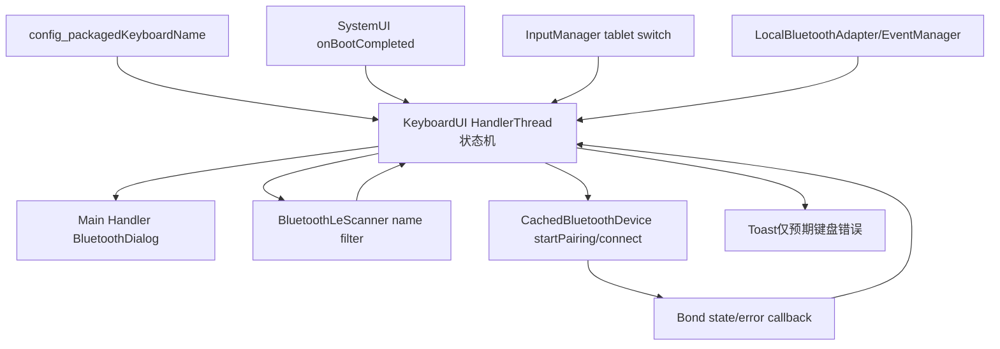
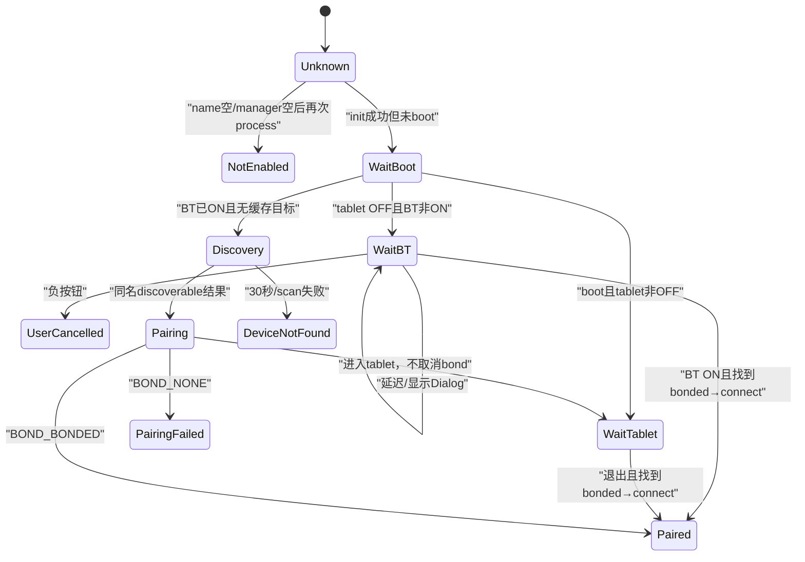
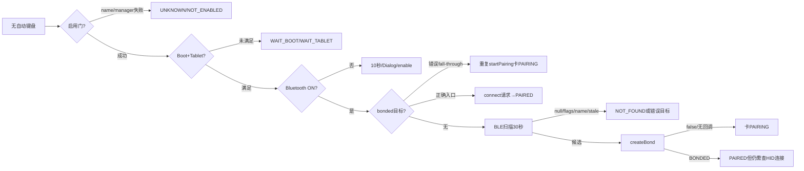

# 第 455 章 Android SystemUI KeyboardUI：蓝牙键盘自动配对、启动等待与状态机

> 源码基线：Android 11 / API 30 / `android-11.0.0_r48`。本章只在 macOS 阅读，不实际编译。核心文件：`KeyboardUI.java`、`BluetoothDialog.java`、SettingsLib `CachedBluetoothDevice.java`、`BluetoothUtils.java`、BluetoothManager/EventManager，以及 InputManager、BluetoothLeScanner 与 SystemUI 启动配置。本分支没有 KeyboardUI 专用单元测试。

## 1. 本章要解决什么问题

某些平板/二合一设备附带一把固定型号蓝牙键盘：SystemUI 怎样在开机、平板模式、蓝牙开关、BLE扫描、配对和连接之间自动协作？为什么要等 BootCompleted 和10秒？扫描30秒后怎样结束？用户取消后为什么不立即再烦他？

## 2. 一句话主线

KeyboardUI 读取资源中的 packaged keyboard name；若启用，就在专用 HandlerThread 上串行处理 Boot、tablet switch、Bluetooth状态、BLE扫描与bond回调，在主线程显示“是否开启蓝牙”系统Dialog；退出tablet模式且BT开启后按同名查已配对/缓存设备，必要时低延迟扫描30秒并自动 startPairing。

## 3. 这不是通用蓝牙键盘功能

只有 `config_packagedKeyboardName` 非空才启用，目标是设备厂商随机器打包的特定键盘，不会自动配对任意 HID。裸产品资源为空时应处于禁用状态；普通用户蓝牙键盘仍由 Settings/蓝牙面板处理。

## 4. 三个执行角色

Keyboard HandlerThread 是状态机 actor；main-looper KeyboardUIHandler 只创建/关闭 BluetoothDialog；BluetoothLeScanner 和 SettingsLib Bluetooth callback把外部事件转成 actor Message。设备状态不直接在 UI callback里决策。

## 5. 进程边界

KeyboardUI 在主 SystemUI 进程；Bluetooth Adapter/GATT/Bluetooth service通常在蓝牙进程/system_server侧，InputManager在system_server，配对进入Bluetooth stack；Dialog/Toast在SystemUI。API调用背后多次Binder切换。

## 6. 线程边界

start在SystemUI主线程创建名为Keyboard的后台HandlerThread；init/process/adapter状态/bond/scan转发都在该Looper；Dialog在main async Handler；InputManager listener明确传Keyboard Handler；BLE callback先由framework线程交付，再转Message。dump可能在别的线程且字段大多非volatile。

## 7. 总体架构



## 8. 状态列表如何分组

NOT_ENABLED/UNKNOWN 是初始化层；WAITING_FOR_BOOT、WAITING_FOR_TABLET_EXIT、WAITING_FOR_BLUETOOTH、WAITING_FOR_DEVICE_DISCOVERY 是门控/等待；PAIRING/PAIRED 是操作结果；PAIRING_FAILED/USER_CANCELLED/DEVICE_NOT_FOUND 是终止状态。

## 9. 事件列表如何分组

MSG_INIT/BOOT/PROCESS驱动主流程；ENABLE_BT/BT_STATE/BOND_STATE处理蓝牙控制；DEVICE_ADDED/SCAN_FAILED/ABORT处理扫描；SHOW/DISMISS_DIALOG在另一个Handler；SHOW_ERROR把全局SettingsLib错误筛成Toast。

## 10. start 做什么

把父 Context保存到 volatile字段，创建 background-priority HandlerThread，实例化 async KeyboardHandler并发送 MSG_INIT。没有started guard、没有保存thread引用用于停止，也没有stop生命周期。

## 11. 重复 start 的后果

每次创建新线程、注册新的 BluetoothCallback/InputManager listener、覆盖 mHandler，并设置新的全局 Bluetooth error listener；旧线程/回调仍活着却把事件发送到字段里最新 handler或持有旧inner对象，状态机会互相干扰。

## 12. init 的第一道开关

读取 internal resource keyboard name；空就return。此时没把 mState设NOT_ENABLED，因为 processKeyboardState尚未调用，dump会显示 mEnabled=false却STATE_UNKNOWN；NOT_ENABLED常量在正常早退路径反而用不到。

## 13. init 的第二道开关

Dependency取 LocalBluetoothManager；null也直接return并留下UNKNOWN。成功后才 `mEnabled=true`，取得 CachedDeviceManager、LocalAdapter、ProfileManager，注册 EventManager callback和全局 BluetoothUtils ErrorListener。

## 14. mProfileManager 是否被使用

字段保存 LocalBluetoothProfileManager，但本类后续没有引用。可能是旧连接逻辑残留；不能看到字段就推断 KeyboardUI按HID profile验证/连接。

## 15. InputManager 初始化

以 mHandler注册 tablet mode listener，并立即 `isInTabletMode()`取得三态switch：ON/OFF/UNKNOWN。UNKNOWN在主流程被当作“不是OFF”，因此等待退出；没有tablet switch的错误产品配置会永远不扫描。

## 16. init 的顺序陷阱

它先 `processKeyboardState()`，最后才创建 main KeyboardUIHandler。正常此时 boot尚未完成，流程停在WAITING_FOR_BOOT，不会用UI handler；若异常调用顺序让mBootCompleted提前true且需Dialog，就可能在mUIHandler仍null时NPE。

## 17. BootCompleted 怎样进入

SystemUI模块回调 `onBootCompleted()`只向Keyboard Handler发MSG；actor内设置boolean和 `mBootCompletedTime=uptimeMillis()`，仅当当前state正WAITING_FOR_BOOT才继续process。Boot消息与init都进同一Handler，正常start先排INIT。

## 18. 为什么用 uptimeMillis

10秒Dialog延迟从BootCompleted uptime算，深度睡眠时间不计入。目的是给蓝牙栈在设备清醒启动阶段留时间，避免SystemUI先弹“开启蓝牙”，几秒后系统自己又打开造成闪烁。

## 19. process 开头为何remove自身消息

每次处理先 removeMessages(MSG_PROCESS_KEYBOARD_STATE)，取消之前为10秒最早Dialog时刻安排的重试，避免多次定时触发。它不移除scan abort、BT/bond/scan result等其他事件。

## 20. 第一门：enabled

若false就STATE_NOT_ENABLED并return；但init的两个早退不调用process，所以这门只在额外process事件到达时才修正UNKNOWN。更直接应在早退前设state或统一走process。

## 21. 第二门：boot

未boot就WAITING_FOR_BOOT并return，不读tablet/BT，也不扫描。这样SystemUI早启动不会在开机动画/Setup尚未稳定时触发硬件配对。

## 22. 第三门：tablet mode

只允许switch明确OFF时继续。进入tablet模式时，若正扫描就stop；若正等BT就发dismiss Dialog；无论旧状态是什么都改WAITING_FOR_TABLET_EXIT。它不取消正在进行的bond。

## 23. 为什么合盖/平板模式停止键盘流程

附带键盘通常只在设备展开/脱离tablet模式时需要；合成平板形态继续扫描和弹Dialog会浪费电并打扰用户。这里依赖硬件switch事实，不通过窗口形态猜测。

## 24. Tablet listener 的去重

boolean true仅在旧三态不是ON时处理，false仅在旧值不是OFF时处理。UNKNOWN→ON/OFF都算变化；重复同值不process。表达式依赖&&优先于||，等价于两个加括号分支。

## 25. 第四门：Bluetooth state

若TURNING_ON就WAITING_FOR_BLUETOOTH不弹Dialog；若不是ON（OFF/TURNING_OFF/ERROR）就WAITING_FOR_BLUETOOTH并showBluetoothDialog；只有ON才查已配对/发现设备。

## 26. 为什么先异步dismiss旧Dialog

当旧state WAITING_FOR_BLUETOOTH而adapter已TURNING_ON或ON，先向UI handler发DISMISS，避免用户在系统正在开启时仍看到确认。之后TURNING_ON直接等，ON继续设备流程。

## 27. Dialog的10秒策略

用户setup已完成：若当前uptime已过boot+10s就发SHOW，否则在Keyboard Handler按绝对uptime安排PROCESS。Setup未完成：不询问，直接调用adapter.enable，方便安装向导中的实体键盘输入。

## 28. User setup 读取谁

通过 Secure.USER_SETUP_COMPLETE、UserHandle.USER_CURRENT现场读取当前用户。KeyboardUI没有USER_SWITCHED listener；定时Dialog跨用户切换时会沿旧状态继续，只有下一次process才重新读新当前用户。

## 29. enable 返回值被忽略

Setup自动enable和用户点OK后的enable都不检查boolean返回；状态保持WAITING_FOR_BLUETOOTH，期待 EventManager最终发STATE_ON。若请求立即失败且无后续state变化，状态与Dialog可能长期停住。

## 30. Boot到扫描时序

顺序记成：SystemUIApplication `start→MSG_INIT`，Keyboard线程完成name/manager/tablet初始化后停在WAIT_BOOT；Boot callback到来后要求tablet明确OFF，再读BT。BT关闭且Setup完成就等到boot+10秒、主线程显示Dialog、OK后回actor enable；BT已ON则查bonded/cached，均无目标才启动低延迟BLE扫描。这条顺序也解释了mUIHandler为何通常能在首次Dialog前创建完成。

## 31. Dialog 的窗口性质

BluetoothDialog继承SystemUIDialog，Window type改为TYPE_SYSTEM_DIALOG，并setShowForAllUsers(true)。它不是Activity，不出现在任务栈；标题/文案只询问是否开启蓝牙。

## 32. Dialog UI去重

MSG_SHOW时若mDialog非null就忽略；否则创建、设置正负按钮与dismiss listener并show。mDialog只在main Handler/click/dismiss访问，线程归属清晰。

## 33. 用户点取消

按钮listener把enable=0发给Keyboard Handler并立刻mDialog=null；actor收到后设STATE_USER_CANCELLED。不会关闭蓝牙，因为它原本就是off；也不会自动重弹，除非tablet形态变化重新进入流程。

## 34. 按Back/其他dismiss的差异

OnDismiss只把mDialog=null，不发送USER_CANCELLED。若Dialog可通过Back等方式关闭，后台state仍WAITING_FOR_BLUETOOTH；下次process可能重新显示。只有明确负按钮建立“用户取消”终态。

## 35. SHOW/DISMISS 消息的陈旧窗口

Keyboard线程发SHOW后，BT可能立刻ON并在同一actor随后发DISMISS/进入扫描；两个UI Message按这个发送顺序排队，所以最终会先show再dismiss，而非任意倒置。问题是UI线程若恰好执行了SHOW，蓝牙已开时仍可能闪一下，用户甚至可在DISMISS前点击；SHOW执行时不复查state，也不与后续DISMISS合并。

## 36. Dialog点击源码

```java
private final class BluetoothDialogClickListener
        implements DialogInterface.OnClickListener {
    @Override
    public void onClick(DialogInterface dialog, int which) {
        int enable = DialogInterface.BUTTON_POSITIVE == which ? 1 : 0;
        mHandler.obtainMessage(MSG_ENABLE_BLUETOOTH, enable, 0).sendToTarget();
        mDialog = null;
    }
}
```

## 37. 蓝牙ON后的第一步

调用getPairedKeyboard遍历 adapter.getBondedDevices，只用 `mKeyboardName.equals(device.getName())`精确匹配；找到后用CachedDeviceManager find或add包装。没有检查BluetoothClass、UUID、HID profile、地址或厂商数据。

## 38. 同名 bonded 设备的风险

任意已配对设备只要名字相同就被当打包键盘；多个同名时Set迭代首先命中的设备不稳定。名称可伪造且用户可改，不能作为强设备身份。

## 39. 何时自动 connect 已配对键盘

仅旧state是WAITING_FOR_TABLET_EXIT或WAITING_FOR_BLUETOOTH时：设PAIRED，调用 `device.connect(false)`并return。注释明确避免在其他偶发process中重新连接用户刚手动断开的键盘。

## 40. connect(false) 不等于连接成功

CachedBluetoothDevice发起profile连接，返回/ACK不在这里处理；KeyboardUI立刻STATE_PAIRED，也没有connection-state callback。PAIRED在本类更接近“已bond并发起连接”，不是输入已可用。

## 41. Boot时BT已ON的分支陷阱

Boot后旧state是WAITING_FOR_BOOT，而非WAITING_BT/TABLET；即使getPairedKeyboard非null，条件也不进入connect/return。代码随后又调用getDiscoveredKeyboard，缓存集合通常也含这个bonded设备，把它当待配对设备。

## 42. 已bond设备再次startPairing

getDiscovered返回同名CachedBluetoothDevice后，先设STATE_PAIRING再调用startPairing。SettingsLib最终调用 BluetoothDevice.createBond；对已bond设备通常返回false。返回值被忽略，又未必产生新的bond callback，状态可能永久PAIRING。

## 43. 如何修复已配对分支

只要paired device非null就不应落入discovered路径：允许自动连接的两个入口调用connect；其他入口至少设PAIRED并return，以尊重手动断开。getDiscovered也应只选BOND_NONE设备。

## 44. 为什么 clearNonBondedDevices

从WAITING_TABLET或WAITING_BT回来且没找到paired键盘，会清 SettingsLib所有non-bonded缓存，再开始发现。意图是丢掉旧广告缓存，避免对离线同名设备配对。

## 45. 清理范围过宽

clearNonBondedDevices不是只清目标键盘，可能移除其他蓝牙UI刚发现但未配对的耳机/设备缓存，影响Bluetooth Tile/SettingsLib共享视图。它是全局Manager上的副作用。

## 46. getDiscoveredKeyboard 的空名字问题

循环写 `d.getName().equals(mKeyboardName)`；设备name为null会NPE。paired查询反过来用非空mKeyboardName.equals(name)，是null-safe。onDeviceAddedInternal也以d.getName().equals写法重复风险。

## 47. 缓存发现不验证新鲜度

只要CachedDeviceManager里有同名对象就立即startPairing，不检查RSSI、最后发现时间、discoverable flag或bond state。只有从WAITING_BT/TABLET回来会先clear nonbonded；其他调用入口可消费陈旧缓存。

## 48. 没有缓存设备时开始BLE扫描

state先设WAITING_FOR_DEVICE_DISCOVERY，再调用startScanning。扫描filter按完整device name，callback type ALL_MATCHES，最多一条advertisement匹配，LOW_LATENCY，reportDelay=0；目标是快找近处附件，功耗由30秒timeout限制。

## 49. scanner 可能为空

即使adapter报告ON，`getBluetoothLeScanner()`仍可能因栈过渡/错误返回null；startScanning直接scanner.startScan会NPE。stopScanning有null检查，两边不对称。

## 50. startScan 异常没有收敛

SecurityException、IllegalStateException等未catch；也只有startScan返回后才创建abort message。异常会终止Keyboard Handler当前消息，state留WAITING_DISCOVERY、scanCallback非null但没有实际扫描/timeout。

## 51. scanAttempt 解决了什么

每次成功调用startScan后自增attempt，把编号放进30秒abort message；只有state仍WAIT_DISCOVERY且attempt等于当前才stop并STATE_DEVICE_NOT_FOUND。旧扫描timeout不会终止新扫描。

## 52. scanAttempt 没解决什么

ScanResult/ScanFailed消息不携attempt。旧callback已排队后stop，若恰逢新scan又处于WAIT_DISCOVERY，旧结果会被新会话接受并触发pair；generation只保护timeout，不保护所有异步事件。

## 53. stopScanning 的语义

若mScanCallback非null，现场取scanner；非null则stopScan，随后无论是否真正停止都把字段清null。已排队callback仍可到达，且若adapter off导致scanner null，旧注册无法显式注销。

## 54. scan超时后的状态

stop扫描并设DEVICE_NOT_FOUND，不Toast、不重试，也不关闭可能由KeyboardUI开启的Bluetooth；源码有FIXME询问是否应关。用户需切换tablet形态/重启等新入口才能再尝试。

## 55. ScanRecord 可为空

`isDeviceDiscoverable`直接 `result.getScanRecord().getAdvertiseFlags()`；某些结果ScanRecord为null会NPE。即使record存在，advertiseFlags未知时API常返回-1。

## 56. flags=-1 被误判为discoverable

代码用 `(flags & 0x03) != 0`；-1二进制全1，结果为3，所以“未提供flags”会当作general/limited discoverable。应先要求flags≥0，再判断低两位。

## 57. 名称filter与discoverable双门

ScanFilter在Bluetooth栈先按exact local name筛选，callback再检查discoverable bit。name filter降低误配，但名称不是认证；恶意/相邻设备可广播相同名称与flags。

## 58. 单条与批量结果政策不同

onBatch遍历discoverable结果选最高RSSI；onScanResult看到第一条discoverable就立即发送DEVICE_ADDED。reportDelay=0通常走单条，所以“选择最强设备”并不是主路径保证。

## 59. RSSI也不是可信身份

即使批量选最强，只说明接收信号更强，不能证明是随机器附带键盘。安全绑定应结合出厂地址/IRK、服务UUID、厂商数据、用户确认或受信任配对协议。

## 60. ScanCallback 源码

```java
private boolean isDeviceDiscoverable(ScanResult result) {
    final ScanRecord scanRecord = result.getScanRecord();
    final int flags = scanRecord.getAdvertiseFlags();
    return (flags & 0x03) != 0;
}

@Override
public void onScanResult(int callbackType, ScanResult result) {
    if (isDeviceDiscoverable(result)) {
        mHandler.obtainMessage(MSG_ON_BLUETOOTH_DEVICE_ADDED,
                result.getDevice()).sendToTarget();
    }
}
```

## 61. DEVICE_ADDED 如何进入Cached层

actor收到BluetoothDevice后通过findDevice，若无则addDevice；再检查当前state仍WAIT_DISCOVERY与名字相等，stop scan，调用startPairing，最后设STATE_PAIRING。

## 62. state 写在startPairing之后的影响

该路径先调用pair再写PAIRING；通常bond callback只是异步排到同一Handler，当前消息结束后才处理，所以能看到PAIRING。若startPairing内部同步通过全局ErrorListener发错误，错误Message也排队，仍在state写后执行。

## 63. 另一条配对路径顺序相反

getDiscoveredKeyboard路径先设PAIRING再startPairing。两条路径不一致，但都忽略boolean返回。统一成 `if (startPairing()) state=PAIRING else state=PAIRING_FAILED/show error`更清晰。

## 64. startPairing 的真实返回

CachedBluetoothDevice先在classic discovery时cancel discovery，然后调用BluetoothDevice.createBond；false直接返回false，不会自动抛异常。KeyboardUI忽略后，最常见结果就是没有任何回调来推进状态。

## 65. Bond callback 的筛选

只在state==PAIRING且device name等于目标时处理；BONDED→PAIRED，NONE→PAIRING_FAILED，BONDING忽略。这样不会把用户对其他设备的配对误记到本状态机。

## 66. 同名另一设备仍可污染

筛选没有比较正在配对的BluetoothDevice地址/对象；扫描键盘A后，键盘B或历史同名设备发生BOND_NONE/BONDED，也能推进当前会话。类没有保存`mTargetDevice`。

## 67. PAIRING 没有超时

30秒只覆盖scan；createBond请求成功后没有timeout/cancel。若蓝牙栈丢bond事件、设备离开或返回值被忽略，state可永久PAIRING，tablet mode变化之外没有恢复。

## 68. BONDED 后为何不手动connect

注释假设新配对完成后栈会自动尝试连接，所以只设PAIRED。没有验证HID profile已连接；若自动connect失败，KeyboardUI仍不重试也不提示连接失败。

## 69. Pairing failed 后怎么办

BOND_NONE设PAIRING_FAILED；不自动重扫、不弹专用Dialog。SettingsLib的unbond reason可能通过BluetoothUtils ErrorListener触发Toast，但状态机仍终止。改变tablet形态可重启流程。

## 70. Bluetooth state callback 处理很窄

只有“新state ON 且当前WAITING_FOR_BLUETOOTH”才process。OFF发生在扫描/PAIRING/PAIRED不会清资源或改state；用户取消后手动开BT也不会自动继续，符合不打扰但可能留下过时状态。

## 71. 扫描中BT关闭

状态callback OFF被忽略；平台通常终止BLE scan并可能onScanFailed，但不保证。30秒abort现场getscanner可能null，仍清callback并DEVICE_NOT_FOUND。没有转回WAIT_BT提示用户。

## 72. tablet mode 中配对回调

进入tablet时不取消正在pairing，却把state改WAIT_TABLET；随后BONDED/NONE callback因state不再PAIRING而忽略。退出tablet会重新查bonded，若配对已成可走connect分支。

## 73. “避免手动断开后重连”靠什么

没有监听connection callback，也不记录manual flag；只是限制自动connect只在两个明确门重新打开的state。其他process触发不会对paired device调用connect，但前述落入discovered再pair是逻辑漏洞。

## 74. ErrorListener 是进程级静态槽

`BluetoothUtils.setErrorListener`覆盖单一static引用；KeyboardUI不保存/恢复旧listener。SystemUI内其他SettingsLib蓝牙操作产生的错误也会送到KeyboardUI listener。

## 75. 为什么其他蓝牙错误可能静默

onShowErrorInternal只有state为PAIRING/PAIRING_FAILED且name等于packaged keyboard才Toast；Bluetooth Tile等对其他设备的SettingsLib错误会被这个全局listener接收后过滤掉，没有第二listener链。

## 76. Toast 在哪个线程

Error callback先发Keyboard Handler Message，onShowErrorInternal在有Looper的后台线程调用Toast.makeText/show。Android Toast可通过其Looper/Notification service工作，但UI反馈通常应统一post main；context也来自错误源而非固定SystemUI Context。

## 77. Error 的name也只是字符串

配对目标用名称筛选，error同样按name筛选；同名设备错误可被当成packaged keyboard错误。保存目标BluetoothDevice/地址并按对象核对更可靠。

## 78. UI/状态机并没有一体化事务

Dialog显示状态只在main mDialog，流程状态只在Keyboard线程mState；SHOW后状态变化虽会按actor顺序再发DISMISS，但中间可闪现/被点击，click回actor时也没有session核对。不能从“Dialog不见了”推断adapter已ON，也不能从一次OK推断enable成功。

## 79. USER_CANCELLED 是否永久

仅当前进程/当前形态周期。进入tablet会把任何旧state改WAIT_TABLET，退出后重新处理；SystemUI重启也从UNKNOWN开始。没有把“不要再询问”写Secure/Preferences。

## 80. DEVICE_NOT_FOUND 是否永久

同样只是内存终态；普通BT状态ON回调不重试，配置变化空实现，用户切换不处理。tablet模式ON→OFF或进程重启才有明确重试入口。

## 81. 配置变化为什么是空实现

KeyboardUI覆写onConfigurationChanged但不处理。locale变化后现有Dialog文案不会重建，packaged keyboard name资源overlay变化也不重读；只有新进程init会更新。

## 82. 多用户没有独立状态机

主SystemUI只有一套mState、target name、scan与Dialog，hardware Bluetooth也全局；USER_SETUP_COMPLETE却按CURRENT读取。用户切换期间Dialog showForAllUsers、定时任务和用户取消状态会跨用户延续。

## 83. Setup中自动开BT的权限政策

KeyboardUI是平台SystemUI，LocalBluetoothAdapter.enable可绕普通第三方限制；产品以“打包键盘保证Setup可输入”为依据自动开启。Setup完成后改为用户确认，体现相同硬件命令在不同阶段的交互政策。

## 84. 谁关闭由本类开启的Bluetooth

没人。scan超时旁边FIXME明确提出这个问题，但没有记录“BT原本off且由我开启”这一所有权。自动开启后即使找不到键盘，Bluetooth保持ON。

## 85. 主状态决策源码

```java
if (!mBootCompleted) {
    mState = STATE_WAITING_FOR_BOOT_COMPLETED;
    return;
}
if (mInTabletMode != InputManager.SWITCH_STATE_OFF) {
    if (mState == STATE_WAITING_FOR_DEVICE_DISCOVERY) stopScanning();
    else if (mState == STATE_WAITING_FOR_BLUETOOTH) {
        mUIHandler.sendEmptyMessage(MSG_DISMISS_BLUETOOTH_DIALOG);
    }
    mState = STATE_WAITING_FOR_TABLET_MODE_EXIT;
    return;
}
if (btState != BluetoothAdapter.STATE_ON) {
    mState = STATE_WAITING_FOR_BLUETOOTH;
    showBluetoothDialog();
    return;
}
```

## 86. 状态转移不是严格有限状态机

process可从几乎任意旧state重新经过门并覆盖；callback则只接受特定旧state。没有中央transition表验证非法边；例如PAIRED遇tablet ON可到WAIT_TABLET，PAIRING也可被直接覆盖，UNKNOWN早退不总进NOT_ENABLED。

## 87. 更准确的状态含义

WAIT_*是“下一事实门尚未满足”；PAIRING是“已发createBond并期待bond事件”，但源码可能没成功发；PAIRED是“bond事实或旧bond connect请求”，不保证连接；FAILED/CANCELLED/NOT_FOUND是“不再自动推进”，不是硬件最终事实。

## 88. 状态图



## 89. Boot已ON漏洞在图上哪里

WaitBoot直接进入ON处理时，paired device存在却因旧state不是WaitBT/WaitTablet而不return，随后走Cached discovered→Pairing；这条边不在设计意图图中，却由代码fall-through产生。读状态机必须看条件后的fall-through，不只看赋值语句。

## 90. stale scan结果的图外边

旧scan callback消息若在新Discovery阶段才处理，可直接Discovery→Pairing；消息不带attempt，状态门看不出它属于旧会话。所有外部事件都应带generation，而不只是timeout。

## 91. dump 提供哪些字段

mEnabled、所谓mBootCompleted、boot time、keyboard name、tablet三态和state字符串。没有BT adapter state、scanAttempt/callback、Dialog、目标device、bond/connection、scheduled messages、线程存活或“是否由我开启BT”。

## 92. dump 有一个直接错误

代码打印 `mBootCompleted=` 时拼的是 `mEnabled`，所以enabled后永远显示boot completed true，即使实际仍WAIT_BOOT。诊断必须同时看mState/bootTime，不能信这行。

## 93. dump 源码

```java
pw.println("  mEnabled=" + mEnabled);
pw.println("  mBootCompleted=" + mEnabled); // 应为 mBootCompleted
pw.println("  mBootCompletedTime=" + mBootCompletedTime);
pw.println("  mKeyboardName=" + mKeyboardName);
pw.println("  mInTabletMode=" + mInTabletMode);
pw.println("  mState=" + stateToString(mState));
```

## 94. dump 的内存可见性

mHandler/mUIHandler/context是volatile，mState/mEnabled/boot/tablet等不是。dump线程不经过Keyboard Handler同步读取，理论上可见旧值；最稳妥是actor处理dump请求或用不可变snapshot/volatile。

## 95. Bluetooth callback 生命周期

匿名BluetoothCallbackHandler注册后没有unregister引用；InputManager listener同样不注销；BluetoothUtils static ErrorListener持有KeyboardUI inner实例。只要进程活着对象不会释放，重复start尤其明显。

## 96. HandlerThread 异常会怎样

handleMessage没有总catch；在Android进程默认RuntimeInit未捕获异常处理下，Keyboard后台线程抛NPE/RuntimeException通常也会终止整个SystemUI进程并触发重启，而不只是静默死掉一条Looper。即使产品改了uncaught handler只保线程死亡，dump也没有thread-alive证据。

## 97. 最危险的NPE入口

scanner null、ScanRecord null、CachedBluetoothDevice.getName null、mUIHandler异常初始化顺序，以及LocalAdapter/Manager内部异常。目标资源非空才启用，可能让这类代码多年不在多数设备执行，OEM启用时才暴露。

## 98. 安全上为何名称匹配不足

BLE广告名称和Bluetooth friendly name都可伪造。代码会自动createBond，具体配对模型若无需用户PIN确认，攻击者可争抢；即使需要确认，也会制造提示/拒绝服务。出厂附件应有更强发现与认证信息。

## 99. 配对不等于信任任意输入

Android Bluetooth/HID/InputManager后续仍有profile与设备权限边界，但一旦攻击设备成功bond/connect，输入事件可影响系统。SystemUI自动化选择目标应比普通“显示同名设备”更严格。

## 100. 自动connect的隐私/体验边界

退出tablet或开启BT会主动connect已bond同名设备，可能连接到邻室键盘；但只在明确形态/开关转移时做，避免用户手动disconnect后马上抢回。没有RSSI/在坞检测，形态switch是唯一物理意图信号。

## 101. “不弹开启蓝牙Dialog”怎么查

看packaged name是否空、LocalBluetoothManager是否null、mState是否UNKNOWN/WAIT_BOOT/WAIT_TABLET/USER_CANCELLED、USER_SETUP_COMPLETE、boot uptime是否满10秒、BT是否TURNING_ON，以及UI Handler是否收到过陈旧DISMISS。

## 102. “一直扫描找不到”怎么查

确认BLE scanner非null、name完全匹配、广告flags存在且discoverable、callback/scan error、30秒attempt、CachedManager缓存、BT是否中途关闭。不要只在classic discovery列表找，因为这里用BLE scan API。

## 103. “找到却不配对”怎么查

查onScanResult→DEVICE_ADDED Message是否仍处于WAIT_DISCOVERY、CachedDevice name是否null/变化、startPairing返回boolean、createBond调用和BOND callback。源码不记录返回值，需额外日志/trace才能区分请求未发与回调丢失。

## 104. “显示PAIRED却不能打字”怎么查

PAIRED只证明bond callback或发过connect(false)；继续查CachedBluetoothDevice profile state、HID Host连接、InputManager设备枚举、key layout与事件。KeyboardUI没有connection证据，不能在本类结论处停止。

## 105. “已配对却又尝试配对”怎么查

特别看Boot时BT是否已经ON、进入process前旧state是否WAIT_BOOT。若是，paired分支不会return，getDiscovered会再次取到bonded缓存；这不是用户删bond，而是fall-through漏洞。

## 106. 更稳健的状态模型

actor保存 `generation、targetDeviceAddress、enabledByUs、scanSession、pairDeadline`；所有scan/bond/error消息带generation和device；paired事实与connected事实分开；每个transition显式处理entry/exit资源；Dialog show时复核state。

## 107. 更稳健的发现身份

资源至少提供服务UUID/厂商data/受信地址或设备证书，不只name；缓存候选要求BOND_NONE且本次scan观察到；批量短窗口按RSSI选但最终身份仍加密验证；已bond集合按地址记录匹配。

## 108. 更稳健的资源清理

保存HandlerThread、BluetoothCallback、Input listener与旧ErrorListener；stop/destroy时stopScan、remove全部message、dismiss Dialog、unregister、quitSafely并恢复/多播error listener。start加幂等guard。

## 109. 本分支没有专用测试

`SystemUI/tests`未找到KeyboardUI测试。状态多达十个、双Handler、Boot/Tablet/BT/scan/bond组合又含定时器，缺局部测试使fall-through、null与stale generation问题更难被自动发现。

## 110. 最该补的测试矩阵

name空/manager空、boot消息顺序、tablet ON/OFF/UNKNOWN、BT四态、setup完成与10秒、paired在WAIT_BOOT/WAIT_BT/WAIT_TABLET、cached null name、scanner/record null、flags=-1、timeout代际、startPairing false、bond同名异设备、Dialog陈旧消息、user切换和dump字段。

## 111. 完整故障导航



## 112. macOS只读练习一：手画状态转移

从processKeyboardState与四个Internal callback提取每个state的进入条件、退出事件和entry/exit副作用；特别画WAIT_BOOT且BT已ON+已有bonded键盘的fall-through。只读，不连接真实设备。

## 113. macOS只读练习二：推演Dialog竞态

假设boot+10秒临界点用户从别处开启BT：一条路径是BT_STATE_ON先被actor处理、移除延迟PROCESS而根本不SHOW；另一条是PROCESS先发SHOW，随后BT_STATE_ON再发DISMISS，主队列保持show→dismiss但可能闪现/误点。写出mDialog/mState并设计执行SHOW时复核WAIT_BT与generation的修复。

## 114. macOS只读练习三：审计BLE结果

对ScanRecord=null、flags=-1、同名弱/强两设备、旧scan结果晚到新scan、name变null分别推演；说明reportDelay=0为何通常不走“批量选最强”，并提出address/UUID/manufacturer data组合身份。

## 115. macOS只读练习四：区分bond与connect

沿 CachedBluetoothDevice.startPairing/createBond、BOND_BONDED、connect(false)、profile callback和InputManager分层，写出“STATE_PAIRED但不能输入”的至少四个原因；只定位源码与画图，不实际配对。

## 116. 复读后修正的第一个易错结论

不能说KeyboardUI会自动连接“任意蓝牙键盘”。它只在OEM配置目标name时启用，并只认完全同名；但name又不是可信身份，功能范围窄不等于安全识别强。

## 117. 复读后修正的第二个易错结论

不能把STATE_PAIRED解释为键盘已连接可输入。它可能来自BOND_BONDED，也可能只是对旧bond设备发connect后立刻写入；本类不观察profile connected或InputDevice出现。

## 118. 复读后确认的已bond漏洞

WAIT_BOOT时BT已ON是独立入口，paired device不会进入只允许WAIT_BT/WAIT_TABLET的return分支，随后缓存查找再次startPairing；createBond false又被忽略，无timeout，足以让状态卡PAIRING。修复必须阻止paired落入unbonded发现链。

## 119. 复读后确认的代际与全局副作用

scanAttempt只保护abort，不保护旧结果；全局clearNonBondedDevices影响其他蓝牙UI，static ErrorListener又吞下非目标设备错误；重复start还泄漏thread/callback/listener。它不是完全封闭的“小键盘模块”，而会改共享SettingsLib状态。

## 120. 本章结论

KeyboardUI用后台actor把Boot、tablet形态、BT开关、BLE发现和bond串成自动配对流程，并用10秒/30秒控制打扰与功耗；Setup阶段可自动开BT，日常则Dialog确认，用户取消和找不到成为内存终态。真正难点是状态含义和边界：PAIRED不等connected，名字不是身份，Boot已ON时bonded设备会fall-through再pair，startPairing返回被忽略且无超时，scan结果代际不全，null与全局BluetoothUtils副作用未隔离。按“门控→候选身份→命令ACK→bond→profile连接→InputDevice”六层阅读，才能解释不弹、找不到、重复配对和配上不能打字。
