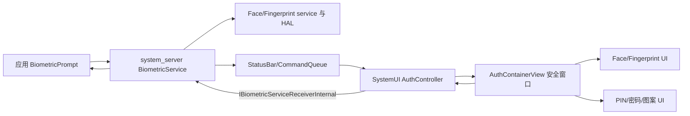
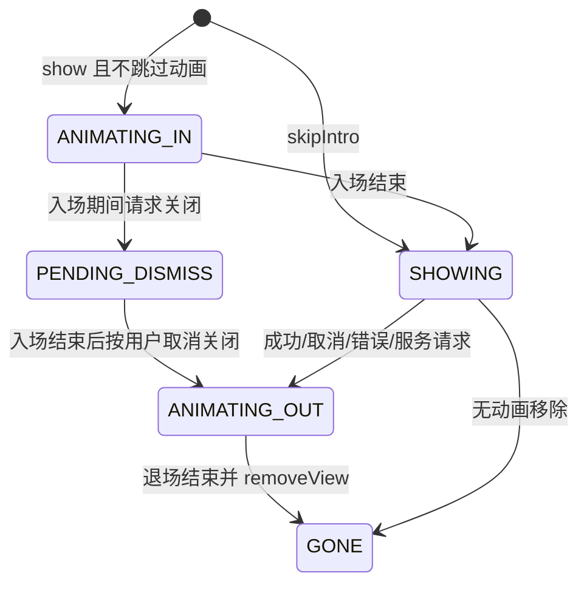
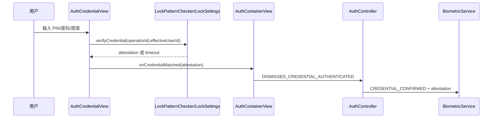

# 第 456 章 Android SystemUI AuthController：BiometricPrompt、生物认证、凭据回退与 Dialog 状态链

> 源码基线：Android 11 / API 30 / `android-11.0.0_r48`。本章只在 macOS 阅读，不实际编译。核心文件：`AuthController.java`、`AuthContainerView.java`、`AuthBiometricView.java`、`AuthBiometricFaceView.java`、`AuthBiometricFingerprintView.java`、`AuthCredentialView.java`、`AuthCredentialPasswordView.java`、`AuthCredentialPatternView.java`，并对照 `AuthControllerTest.java` 与 `AuthContainerViewTest.java`。

## 1. 本章先回答什么

应用调用 BiometricPrompt 后，SystemUI 为什么会出现可信认证面板？成功、失败、帮助、锁定、切后台、旋转屏幕和改用 PIN 各怎样流转？最重要的是：谁决定认证结果，谁只显示界面并转送结果？

## 2. 一句话主线

system_server 的 BiometricService 负责认证会话与硬件结果，借 CommandQueue 命令让主 SystemUI 的 AuthController 创建 AuthContainerView；容器承载人脸、指纹或设备凭据 UI，再经 `IBiometricServiceReceiverInternal` 把用户动作和最终关闭原因回给服务端。

## 3. 不要和锁屏解锁混为一谈

本章主线是应用侧 BiometricPrompt 的系统认证对话框，不是 Keyguard 解锁动画。两者可能使用相同传感器和 GateKeeper/HAT 概念，但入口、会话所有者、UI 容器和回调对象不同。

## 4. SystemUI 不判断指纹真假

AuthController 没有采集传感器数据，也不做模板比对。指纹/人脸 HAL、framework 服务判断成功后，才把 `onBiometricAuthenticated()` 等显示事件送给它；把 UI 代码叫“认证引擎”会误读信任边界。

## 5. 五个核心角色

BiometricService 是会话裁判；CommandQueue 是 system_server 到 SystemUI 的命令桥；AuthController 保存当前 Dialog 与回执 Binder；AuthContainerView 管窗口和进退场；AuthBiometricView/AuthCredentialView 管具体交互。

## 6. 总体架构图



## 7. 进程边界

应用在自己的进程；BiometricService、ActivityTaskManager、LockSettings/GateKeeper 相关服务在 system_server；AuthController 和视图在主 SystemUI 进程；传感器服务/HAL还可能跨 native/vendor 进程。一次认证并不是一个 Java 调用栈从头跑到底。

## 8. 线程边界

AuthController 的 UI 状态主要在 SystemUI 主线程；TaskStackListener 的 Binder 回调先到 Binder 线程，再 `mHandler.post` 回主线程。凭据校验由 LockPatternChecker 异步执行，结果再回视图线程；不能把所有字段都当成跨线程安全数据结构。

## 9. start 注册什么

`start()`向 CommandQueue 注册 callback，获取 WindowManager 和 IActivityTaskManager，并注册 TaskStackListener。构造器已提前动态注册 `ACTION_CLOSE_SYSTEM_DIALOGS` Receiver，因此生命周期入口分散在构造和 start 两处。

## 10. 重复 start 的隐患

代码没有 started guard，也不注销旧 TaskStackListener/CommandQueue callback。若异常重复启动，同一事件可能到达多次；本类按 SystemUI 单例、只启动一次的外部约束编写。

## 11. showAuthenticationDialog 的输入

输入包括 BiometricPrompt Bundle、服务端回执 Binder、模态位、人脸是否需确认、用户、调用包名、operationId 与 sysUiSessionId。`Utils.getAuthenticators(bundle)`只用于日志，真正配置仍由整个 Bundle向下传。

## 12. operationId 有什么意义

它不只是日志编号。切到设备凭据后，LockPatternChecker 用 operationId 验证凭据并取得与该操作绑定的 credential attestation/HAT，服务端据此继续受用户认证保护的操作。

## 13. sysUiSessionId 有什么意义

r48 容器主要把它写入日志，便于将显示、移除和回调关联到一场 UI 会话。它没有参与当前对象的代际校验，因此“有 session id 字段”不等于迟到事件已经被隔离。

## 14. SomeArgs 是请求快照

Controller 把八项参数装进 `SomeArgs`，保存到 `mCurrentDialogArgs`，旋转时复用它重建。这里从未调用 `recycle()`，长期频繁认证会失去对象池复用，并让旧 Bundle、receiver 和包名被引用得更久。

```java
SomeArgs args = SomeArgs.obtain();
args.arg1 = bundle;
args.arg2 = receiver;
args.argi1 = biometricModality;
args.arg3 = requireConfirmation;
args.argi2 = userId;
args.arg4 = opPackageName;
args.arg5 = operationId;
args.argi3 = sysUiSessionId;
```

## 15. 新请求为何跳过入场动画

若已有 Dialog，`skipAnimation=true`；新容器建好后，旧容器无动画、无回调移除，新容器直接显示。意图是应用快速取消再发起时避免闪烁，但旧 receiver 随后被新 receiver 覆盖。

## 16. 请求替换不是原子事务

顺序是保存新 args、构建新 Dialog、移除旧 Dialog、覆盖 receiver/currentDialog、显示新 Dialog。任何构建、移除或 addView 异常都会留下部分更新状态；源码没有 rollback。

## 17. 替换旧请求会不会回执

不会由 Controller 主动回执旧 receiver：它调用 `dismissWithoutCallback(false)`，接着覆盖 `mReceiver`。正常协议可能由 BiometricService先结束旧会话，但单看 SystemUI 没有用 session/generation 保证迟到动作不会击中新 receiver。

## 18. Controller 的当前账

核心仅三份：`mCurrentDialogArgs`、`mCurrentDialog`、`mReceiver`。它们没有被封装为不可分割 Session 对象，所以一次清理漏掉任一字段就可能出现“窗口没了但 receiver还在”等半状态。

## 19. 构建器到底返回什么

`buildDialog()`固定创建 AuthContainerView Builder，再按 modality mask 构造容器；Controller 只检查返回是否为 null。r48 的容器对不支持组合会在构造中早退但仍返回非 null，因此这道 null 防线不能覆盖所有坏模态。

## 20. 模态位的严格匹配

容器只接受“恰好指纹”或“恰好人脸”；face|fingerprint 会进入 unsupported 分支。分支把多个内部 View 留为 null，随后 addView/onAttached 很可能 NPE，而不是优雅报告不支持。

## 21. 为什么生产中不常撞到组合模态

BiometricService 通常先选择实际运行的单一 modality 再通知 SystemUI，而 authenticators allowed 可以是更宽的能力集合。这个外部不变量降低风险，却不能替代 UI 边界校验。

## 22. Window 类型

认证 UI 使用 `TYPE_STATUS_BAR_SUB_PANEL` 全屏透明系统窗口，不是应用 Activity。它有自己的 Binder token，由 SystemUI WindowManager 添加，因此不会作为普通 Activity 出现在任务栈。

## 23. FLAG_SECURE

LayoutParams 包含 `FLAG_SECURE`，防止普通截图/非安全显示捕获认证窗口内容。测试明确验证这个 flag；它保护显示内容，不等于整个认证协议只靠该 flag 安全。

## 24. SHOW_FOR_ALL_USERS

private flag 让系统窗口可面向所有用户显示，而实际凭据身份仍由 config userId 和 credential owner profile 决定。显示用户范围和校验用户身份是两套概念。

## 25. IME Insets 处理

窗口从 fitInsetsTypes 排除 IME，以便 PIN/密码面板自行适配软键盘，而不是被默认 inset 机械裁切。凭据全屏时背景取消点击也被禁用，防止误触关闭。

## 26. 容器状态机

状态依次可能是 UNKNOWN、ANIMATING_IN、PENDING_DISMISS、SHOWING、ANIMATING_OUT、GONE。它既是动画账，也是关闭回调何时发送的控制账；状态含义不清会直接造成错误回执。

## 27. 状态机图



## 28. 正常入场

容器先将 panel/scroll 向下偏移并将根 alpha 设0，再在下一帧做250ms位移与淡入；panel 动画结束调用 `onDialogAnimatedIn()`，将状态改 SHOWING，并通知 biometric view真正开始认证动画。

## 29. skipIntro 的细节

跳过入场时只把容器设为 SHOWING，没有调用 `mBiometricView.onDialogAnimatedIn()`。配置重建有 saved state可恢复；但“新请求替换旧请求”也会 skipIntro且没有 saved state，人脸初始脉冲等逻辑可能不启动。

## 30. 生物视图初始状态

AuthBiometricView 区分 animating-in/authenticating、help、error、pending confirmation、authenticated 等状态。Container 的动画结束通知是它从“等待容器稳定”进入正常认证展示的重要门。

## 31. 人脸与指纹的尺寸差异

人脸在无需确认时可用 small形态，错误或交互再扩展；指纹不支持 small，通常保持 medium。共同基类管理文字、按钮和状态，子类管理图标动画与错误后状态。

## 32. 帮助消息的显示条件

`onHelp()`只有 medium size才显示；small 人脸阶段到达的 help 会被忽略。这样减少小浮层抖动，但也意味着服务端已发出的提示未必被用户看到。

## 33. 软失败怎么处理

Controller 把 `BIOMETRIC_PAUSED_REJECTED` 和 `BIOMETRIC_ERROR_TIMEOUT`都归为 soft error，调用 `onAuthenticationFailed`。视图临时显示原因后恢复；timeout在这里不是立即关闭 Dialog 的硬错误。

## 34. 人脸软失败后的状态

Face view 出错后回 IDLE，并在 medium形态显示“重试”按钮，等待用户触发 receiver.onTryAgainPressed。指纹则通常回 AUTHENTICATING，允许继续放手指。

## 35. 硬错误怎么处理

其他错误由 FaceManager/FingerprintManager生成可读文本，视图进入 ERROR，延时约2秒后发 ACTION_ERROR，容器再以错误原因退场。未知 modality 得到空字符串，是边界输入下的弱降级。

## 36. Lockout 的特殊回退

若锁定/永久锁定且设备凭据允许，不显示硬错误后关闭，而调用 `animateToCredentialUI()`。这表示生物通道不可再用，但用户仍可用可信 PIN/密码/图案完成同一 operation。

## 37. 错误分类源码

```java
final boolean isLockout = error == BIOMETRIC_ERROR_LOCKOUT
        || error == BIOMETRIC_ERROR_LOCKOUT_PERMANENT;
final boolean isSoftError = error == BIOMETRIC_PAUSED_REJECTED
        || error == BIOMETRIC_ERROR_TIMEOUT;

if (mCurrentDialog.isAllowDeviceCredentials() && isLockout) {
    mCurrentDialog.animateToCredentialUI();
} else if (isSoftError) {
    mCurrentDialog.onAuthenticationFailed(errorMessage);
} else {
    mCurrentDialog.onError(errorMessage);
}
```

## 38. 成功但不需要确认

视图进入 AUTHENTICATED；指纹延时为0，人脸延时约500ms以完成图标/成功反馈，然后发 ACTION_AUTHENTICATED。容器映射为 `DISMISSED_BIOMETRIC_AUTHENTICATED`。

## 39. 成功且需要确认

先进入 PENDING_CONFIRMATION，展示肯定按钮。用户按肯定后变为 AUTHENTICATED，再发关闭；Controller最终映射为 `DISMISSED_REASON_BIOMETRIC_CONFIRMED`。

## 40. pending confirmation 时按否定

该按钮被解释为 USER_CANCELED，而不是普通 NEGATIVE。因为用户已经通过生物识别，只是拒绝确认此次操作；服务端收到的取消语义与认证前按“取消”不同。

## 41. 否定按钮的三种语义

等待确认时是 user cancel；设备凭据允许时是“改用设备凭据”；否则才是 negative dismissal。阅读按钮文字不足以判断回调原因，必须结合 biometric state与 authenticator配置。

## 42. 重试按钮链

Face view发 ACTION_BUTTON_TRY_AGAIN，Container调用 Controller.onTryAgainPressed，再通过 receiver告诉 BiometricService恢复尝试。UI自身不直接重启 HAL 会话。

## 43. early user cancel

背景/Back等用户取消时，Container先发 `BIOMETRIC_SYSTEM_EVENT_EARLY_USER_CANCEL`，再开始关闭。服务端可尽早停传感器，不必等350ms退场动画结束。

## 44. 睡眠取消的差异

WakefulnessLifecycle通知 `onStartedGoingToSleep()`时直接 animateAway(USER_CANCELED)，却没有先发 early system event。最终仍取消，但硬件停止时机和普通背景取消路径不完全相同。

## 45. Controller 对生物事件缺空检查

`onBiometricAuthenticated/help/error`直接解引用 mCurrentDialog。服务端 hide、任务切换或关闭广播已把它置 null后若又来迟到事件，会在 SystemUI 主线程 NPE；r48 没有 session id或 null guard吸收它。

## 46. 迟到事件为何现实

硬件、system_server Binder、CommandQueue 与 UI 动画分属不同队列。取消不是让所有在途消息瞬间消失；可靠实现要以会话代际过滤，而不能只依赖“服务端应该按顺序”。

## 47. Container 的动作到回执

成功/失败等动作先变成 AuthDialogCallback 内部 reason，Controller再映射成 BiometricPrompt 公共 dismissed reason。两层枚举不能混写，否则“内部按钮动作”和“对应用结果”会被误认为同一编号。

## 48. 原因映射表

用户取消→USER_CANCEL，否定按钮→NEGATIVE，确认按钮→BIOMETRIC_CONFIRMED，无确认成功→BIOMETRIC_CONFIRM_NOT_REQUIRED，错误→ERROR，服务端关闭→SERVER_REQUESTED，凭据成功→CREDENTIAL_CONFIRMED。

## 49. sendResultAndCleanUp 的正常路径

先跨 Binder调用 receiver.onDialogDismissed，再无论 RemoteException与否执行 `onDialogDismissed()`，清 receiver和 currentDialog。这样远端死掉也不会让本地正常路径一直认为 Dialog存在。

## 50. receiver 为 null 的反常路径

若 receiver 已null，方法记录错误后直接 return，不清 currentDialog。这会留下一个可能已退场的陈旧引用；“无法发送回执”与“本地不清理”被不必要地绑在一起。

## 51. onDismissed 未知原因

default只记录 `Unhandled reason`，同样不清理。IntDef是编译期提示，不阻止运行时异常值；更稳妥的边界策略应至少收敛本地状态。

## 52. hideAuthenticationDialog 的协议

服务端请求隐藏时，Container立即移除；Controller只把 currentDialog设null，不再回 receiver，因为注释说明 BiometricService已直接通知应用，避免绕 SystemUI一圈。

## 53. hide 没清什么

它不清 `mReceiver` 和 `mCurrentDialogArgs`。正常服务端之后不再触发 UI动作才无事；若旧 View迟到回调，Controller可能仍向旧 receiver发送 TryAgain/SystemEvent。

## 54. dismissFromSystemServer 的名字容易误导

它调用 `removeWindowIfAttached(true)`，只有此前已有 `mPendingCallbackReason`才会先回调。正常 server hide没有 pending reason，因此不会凭空发 SERVER_REQUESTED；该枚举来自其他内部关闭路径。

## 55. removeWindowIfAttached 实际未检查 attached

方法最终无条件 `mWindowManager.removeView(this)`，只以 STATE_GONE防重复。若 addView尚未成功或 View已被外部移除，可抛 IllegalArgumentException；名字比实现更安全。

## 56. 回调发生在 removeView 之前

先 `sendPendingCallbackIfNotNull()`，Controller会把 currentDialog清空，再 removeView。若后者抛异常，窗口可能仍在但 Controller已失去引用，形成孤儿 UI。

## 57. 入场期间关闭的关键缺陷

`animateAway`发现 ANIMATING_IN时只设 PENDING_DISMISS并 return，没有保存 sendReason或原 reason。于是成功、错误、服务关闭、无回调替换等不同请求都被压成同一个模糊状态。

## 58. 入场结束怎样处理 pending

`onDialogAnimatedIn()`看到 PENDING_DISMISS后固定调用 `animateAway(DISMISSED_USER_CANCELED)`。原始原因永久丢失，甚至原本 `sendReason=false` 的无回调关闭也会变成有回调的用户取消。

## 59. 缺陷源码

```java
if (mContainerState == STATE_ANIMATING_IN) {
    mContainerState = STATE_PENDING_DISMISS;
    return; // 没保存 sendReason 与 reason
}

// 入场动画结束
if (mContainerState == STATE_PENDING_DISMISS) {
    animateAway(AuthDialogCallback.DISMISSED_USER_CANCELED);
    return;
}
```

## 60. 测试证明了什么

`testOnDialogAnimatedIn_sendsCancelReason_whenPendingDismiss`明确断言 pending后回 USER_CANCELED。它证明 r48 当前行为稳定存在，但测试没有覆盖“pending最初来自成功/错误/无回调移除”，所以不能证明所有语义都正确。

## 61. Close System Dialogs 路径

广播到来时，Controller请求带动画但无回调地移除容器，立刻 currentDialog=null，然后自己向 receiver发 USER_CANCEL并清 receiver。正常 SHOWING状态下职责划分清楚。

## 62. Close 与入场动画竞态

若容器仍 ANIMATING_IN，`dismissWithoutCallback(true)`只留 PENDING_DISMISS；Controller又立即手动回 USER_CANCEL并清账。动画结束后旧容器会再次尝试 USER_CANCELED回调，Controller此时 receiver为null，留下错误日志和潜在陈旧清理行为。

## 63. 广播 RemoteException 后的残留

`mReceiver=null`写在 try内、Binder调用之后。远端调用抛 RemoteException时该赋值不会执行，currentDialog已null但 receiver仍旧；应把本地清理放 finally。

## 64. 任务栈监听的目的

认证发起应用离开前台后，不应让其认证面板继续覆盖别的应用。TaskStackListener取顶部任务包名，与 currentDialog 的 opPackageName不同就驱逐并按用户取消通知服务端。

## 65. 为什么先 post 主线程

TaskStackListener 可能从 Binder线程进入；它只向 Controller Handler投递 Runnable，保证与 Dialog账和 View操作在同一主线程串行。

## 66. 只比较包名的边界

同一包内换 Activity不会关闭；另一个窗口盖住但顶部 task没变也不会关闭。这里保护的是“发起包是否仍为顶层任务”近似条件，不是精确窗口可见性证明。

## 67. topActivity 空值

代码直接 `runningTasks.get(0).topActivity.getPackageName()`；列表非空但 topActivity为null会 NPE，且 catch只捕获 RemoteException。系统通常提供非空值，但边界未防御。

## 68. 空任务列表

getTasks(1)为空时保持 Dialog。系统启动/任务切换瞬间若暂时空，安全策略选择“暂不驱逐”，等下一次 task stack事件再评估。

## 69. 旧任务事件驱逐新 Dialog

Binder callback post的 Runnable不携带触发时的 dialog/session；执行时读取“当前”Dialog。若排队期间新认证已替换旧认证，旧事件可能按当时顶部包驱逐新 Dialog。

## 70. 任务驱逐 RemoteException

与广播相同，receiver置null在远端调用之后；异常会残留 receiver。区别是 currentDialog已先清，因此再次来的 UI callback可能发往一个没有窗口的旧会话。

## 71. 配置变化先保存什么

保存 container state、生物 UI是否显示、凭据 UI是否显示，以及 biometric view的状态、大小、指示文字和 TryAgain可见性等。随后旧容器无动画无回调移除。

## 72. 何时不重建

若保存状态为 ANIMATING_OUT，Controller不建新 Dialog，注释声称旧 Dialog应立即发送 pending callback。但紧接着调用的是 `dismissWithoutCallback(false)`，它以 sendReason=false移除，实际上不会发送 pending callback。

## 73. 配置变化的注释实现错位

因此旋转恰逢退场动画时，原本等待动画末尾发送的结果可能丢失：旧窗口被无回调移除，currentDialog设null，receiver仍在。这里应以源码行为为准，不能仅复述注释。

## 74. 凭据界面怎样跨旋转

若 saved state标记 credential showing，Controller直接修改原 BiometricPrompt Bundle，将 allowed authenticators改成 DEVICE_CREDENTIAL，再重建。这避免重新露出生物 UI，但也永久改变保存的请求参数。

## 75. 为什么 effectiveUserId 重要

传入 userId可能是 managed profile，而其锁屏凭据由父用户拥有。Container通过 `UserManager.getCredentialOwnerProfile(userId)`得到 effectiveUserId，校验必须针对真正的凭据所有者。

## 76. 凭据类型选择

LockPatternUtils查询 effective user的 credential type，再 inflate pattern、password或 PIN View。未知类型抛 IllegalStateException，不会悄悄当密码处理。

## 77. 从生物 UI 切到凭据 UI

用户点“使用 PIN/密码”或生物 lockout时，BiometricView先扩展为 LARGE并触发 ACTION_USE_DEVICE_CREDENTIAL；Container通知服务端后延迟 inflate全屏凭据 View，使 panel几何与内容动画衔接。

## 78. 重复切换请求

Container没有明确的 once guard；若按钮/错误组合重复触发，可能多次 post `addCredentialView`并添加多个凭据 View。正常按钮状态动画会降低概率，但不是代际防线。

## 79. 凭据验证链

PIN/密码/图案被包装为 LockscreenCredential，LockPatternChecker异步调用 LockSettings校验，返回 attestation与 timeout。成功时 userPresent并把 attestation交给 Container；失败时记录尝试、显示错误或锁定倒计时。

## 80. 凭据成功为什么不是简单 true

服务端需要可验证的证明把“解锁凭据已通过”绑定到 operationId；字节 attestation/HAT比 UI boolean更可信。SystemUI只转送它，不自行制造认证证明。

## 81. 凭据成功时序图



## 82. Password 的并发校验问题

`checkPasswordAndUnlock()`启动新 verify前不取消已有 `mPendingLockCheck`。用户快速多次按 Enter可并行验证，带来重复失败计数、多个 timeout UI或多个成功回调的可能。

```java
// Password：直接覆盖字段，没有先 cancel 旧任务
mPendingLockCheck = LockPatternChecker.verifyCredential(
        mLockPatternUtils, password, mOperationId,
        mEffectiveUserId, this::onCredentialVerified);

// Pattern：同文件族中的实现会先做
if (mPendingLockCheck != null) {
    mPendingLockCheck.cancel(false);
}
```

## 83. Pattern 做得不同

`onPatternDetected()`若已有 pending check先 `cancel(false)`，再验证新图案。它至少抑制重复输入，但 cancel(false)不打断正在运行任务，回调层仍最好以代际判断是否接受旧结果。

## 84. View detach 没取消校验

AuthCredentialView 的 onDetached只取消 error timer，不取消 `mPendingLockCheck`。窗口关闭/旋转后，异步结果仍可能修改已分离 View或再次向旧 Container回调。

## 85. 生物 View detach 更完整

AuthBiometricView 在 detach时 `removeCallbacksAndMessages(null)`，会取消成功延时、错误恢复和 error dismissal等本地 Handler任务。它仍无法撤销已经跨 Binder进入别处的事件。

## 86. Password 成功与失败 UI

成功隐藏 IME；失败清空输入框。空凭据直接 return，不发失败尝试，避免把空 Enter计入擦除/锁定次数。

## 87. Pattern 太短

短于最小长度时不调用远端 verify，也不计失败尝试，只显示错误并允许重画。这是输入格式不完整，不等同于一次真实错误凭据。

## 88. Pattern 的用户字段细节

校验使用 effectiveUserId，但可见图案设置读取 `mUserId`。在 profile共享父凭据场景，两者可能不同，显示策略与真正凭据所有者设置存在错位风险。

## 89. 失败尝试与擦除警告

基类计算当前失败次数+1，调用 reportFailedPasswordAttempt，并根据 DevicePolicy允许失败上限展示“还剩几次”或即将擦除用户/资料/设备的不可取消警告。

## 90. 并发校验放大策略风险

若 Password 同时启动两次错误验证，两次都可能基于接近的旧计数计算并分别 report。安全计数最终由 LockSettings/策略层裁决，但 UI文案与回调时序可能混乱。

## 91. lockout timeout

失败结果附 timeoutMs时，View进入锁定倒计时，暂时禁止输入并周期更新提示；结束后恢复输入。旋转/关闭会取消 error timer，但远端实际锁定状态仍由安全服务维护。

## 92. 保存生物 UI 状态

保存 biometric state、size、indicator文本/是否help或error、TryAgain可见性等。恢复时重新按完整展示时长调度提示，而不是保存“还剩多少毫秒”，所以旋转可能延长临时消息。

## 93. pending success 遇到旋转

旧 AuthBiometricView detach会清成功延时任务；新 View恢复 AUTHENTICATED状态是否重新触发最终 action要结合 restore/updateState路径核查，不能假设任何动画状态都天然可重放。

## 94. ERROR 的两个定时任务

临时错误先安排恢复状态，hard error又在相同延时安排 ACTION_ERROR。它们按 post顺序执行，可能先短暂恢复 UI再关闭；同一 Looper保证顺序，但视觉上仍可能闪动。

## 95. 动画不是结果真相

图标变绿、打勾或面板缩放只是 SystemUI投影；真正结果由服务端会话与回执确认。排查“看起来成功但应用没收到”要继续看 receiver Binder，而不是停在 View状态。

## 96. mReceiver 是单槽位

所有 TryAgain、CredentialPressed、SystemEvent和 dismiss都发往同一个字段，没有把 receiver与发出事件的具体 View绑定。旧 View迟到回调特别容易误投到新请求。

## 97. RemoteException 不是业务失败

它表示远端 Binder通信失败/进程死亡，不代表指纹不匹配。日志应与 biometric error区分；本地必须清理 UI和引用，避免通信故障演变为永久遮挡。

## 98. buildDialog 返回 null 防线不足

Controller写了 unsupported type日志，但当前 Builder通常仍返回一个半初始化 Container。真正稳健的做法是在构建前验证 modality，或让 Builder明确返回 null/抛受控异常并由 Controller回执失败。

## 99. addView 失败的后果

Controller已先把 receiver/currentDialog换成新对象，再调用 show→WindowManager.addView。若 token、内部 null或窗口异常导致失败，catch/rollback不存在，认证服务可能仍等待一个永远不会出现的 UI结果。

## 100. 没有 dump 的可观测性缺口

AuthController r48没有自己的 Dumpable输出。现场主要依赖 BiometricPrompt日志、sysUiSessionId、Window/Task与服务端 dumpsys；current args/receiver/container状态无法从统一 SystemUI dump直接查看。

## 101. 测试覆盖了哪些主路径

AuthControllerTest覆盖 dismissed reason映射、成功/失败/help/error转发、lockout凭据回退、server hide、快速替换跳动画、配置恢复、任务切换和 Close System Dialogs。

## 102. Container 测试覆盖了什么

覆盖各 biometric action的 callback、凭据 View装载、effective user、背景不可取消、pending dismiss固定按取消、FLAG_SECURE和 IME inset。它确认关键行为，但没有穷举竞态。

## 103. 测试没有覆盖的组合

包括 late biometric event after hide、receiver RemoteException后的字段、combined modality、skipIntro无 saved state、入场中无回调关闭、旋转时 ANIMATING_OUT、Password重复 Enter与 detach后凭据结果。

## 104. 读测试的正确姿势

测试说明维护者希望哪些行为保持，不自动证明所有未断言副作用正确。尤其 pending dismiss测试只断言最终 cancel，没有记录原始 reason；本章据生产源码指出原因折叠风险。

## 105. 典型故障：对话框不消失

先查 Container state是否卡 ANIMATING_IN/OUT，再查动画 endAction是否运行、removeView是否异常、Controller currentDialog是否仍在；最后查 receiver是否null使 sendResultAndCleanUp提前返回。

## 106. 典型故障：应用收不到成功

依次查硬件成功是否进 BiometricService、CommandQueue是否进 Controller、View是否进入 AUTHENTICATED、延时任务是否被 detach清掉、Container reason是否在入场时被折叠、receiver Binder是否抛异常。

## 107. 典型故障：旋转后卡住

重点看 saved container state、旧 Dialog是否 ANIMATING_OUT、是否走“不重建但无回调移除”分支、mCurrentDialogArgs是否完整，以及 credential showing是否把原 Bundle改为只允许凭据。

## 108. 典型故障：切后台仍显示

查 TaskStackListener是否注册、Binder callback是否 post主线程、getTasks是否为空/RemoteException、topActivity包名和 opPackageName是否相同；同包 Activity跳转本来就不会驱逐。

## 109. 典型故障：错误发给下一次认证

这是典型缺 generation：查新 Dialog替换时间、旧动画/凭据异步校验/TaskStack Runnable何时排队、当时 mReceiver是否已被覆盖。仅凭 sysUiSessionId日志能关联，源码未用它拒绝旧事件。

## 110. 更稳健的 Session 设计

把 args、dialog、receiver、sessionId、generation与closed状态封成 AuthSession；所有异步回调捕获 generation，主线程仅在等于 current generation时执行；close在 finally中一次性清全部引用并可幂等。

## 111. 更稳健的 pending close

PENDING_DISMISS应保存 `{sendReason, reason}`，多次关闭定义优先级或 first-wins；入场结束按原值退场。无动画关闭应能立即取消动画并安全 remove，不能把所有原因改成 USER_CANCELED。

## 112. macOS 只读练习一：追一次普通成功

用 `rg -n "showAuthenticationDialog|onBiometricAuthenticated|ACTION_AUTHENTICATED|DISMISSED_BIOMETRIC_AUTHENTICATED" frameworks/base/packages/SystemUI` 定位入口与回执；手画 BiometricService→CommandQueue→Controller→Container→receiver，禁止修改或编译。

## 113. macOS 只读练习二：验证入场竞态

并排阅读 AuthContainerView 的 `animateAway`、`onDialogAnimatedIn`与 `testOnDialogAnimatedIn_sendsCancelReason_whenPendingDismiss`；分别假设原始原因是成功、错误、无回调关闭，写出最后实际 reason。

## 114. macOS 只读练习三：追凭据证明

用 `rg -n "operationId|verifyCredential|credentialAttestation|CREDENTIAL_CONFIRMED"`阅读 AuthCredentialPasswordView/PatternView、AuthCredentialView、AuthContainerView和AuthController，解释为什么成功需要 byte[]而非 boolean。

## 115. macOS 只读练习四：做竞态审计表

只读列出 hide、Close System Dialogs、任务切换、配置变化、新请求替换五条路径，逐项记录是否清 dialog、receiver、args，是否回调、是否动画；圈出 RemoteException和 ANIMATING_IN/OUT下的不同结果。

## 116. 本章最容易误解的第一点

AuthController不是认证裁判，而是“当前认证 UI会话的单槽协调器”。它展示可信系统界面并转送用户动作；传感器真假判断和应用最终 callback属于服务端链。

## 117. 本章最容易误解的第二点

`dismissWithoutCallback`并不在所有状态下都绝对无回调：入场期间它只留下 PENDING_DISMISS，动画结束会固定走带 USER_CANCELED回调的 overload。这是状态组合后的真实行为。

## 118. 本章最容易误解的第三点

配置变化不是简单重新 inflate。它会保存状态、取消旧 View本地延时、可能改变原 prompt Bundle、复用 receiver/SomeArgs；恰逢退场动画时还可能丢 pending结果。

## 119. 本章结论

r48 将服务端认证、SystemUI安全窗口、生物交互和设备凭据回退分层清楚，主路径易懂；薄弱处集中在单槽 current账、缺少代际、入场原因折叠、配置退场回执错位、RemoteException清理不彻底与凭据异步任务生命周期。

## 120. 下一章预告

下一章转向 AppOpsController：SystemUI如何监听麦克风、相机、定位等 AppOps活动与 noted事件，按 UID/包聚合成隐私指示器事实，并处理超时、用户与回调线程。
