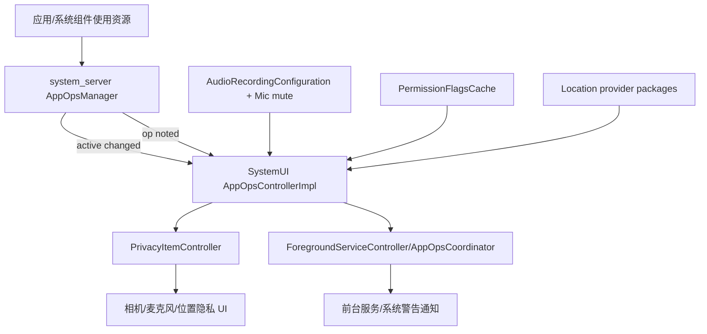
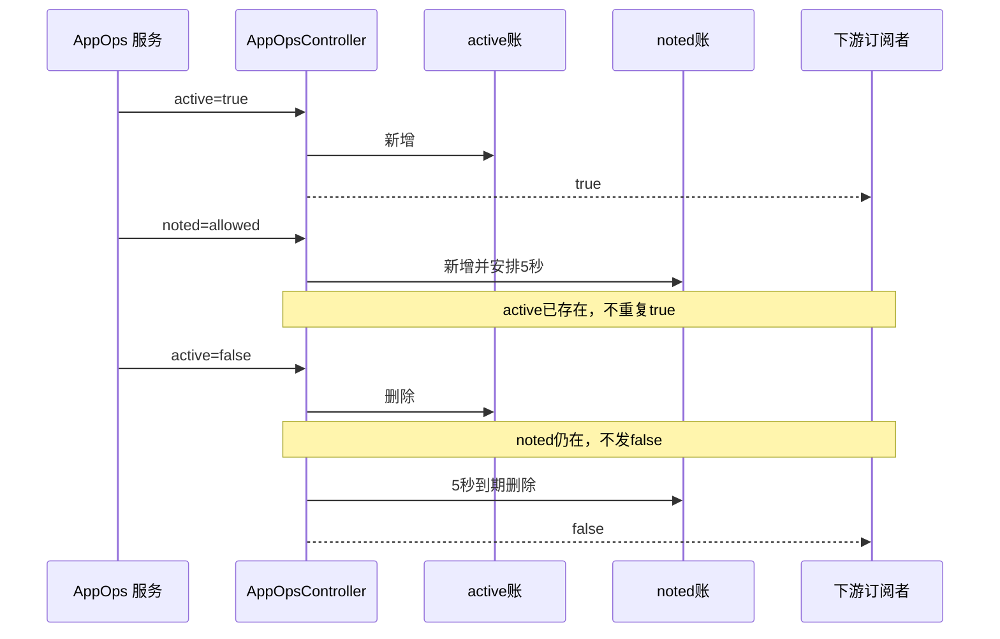
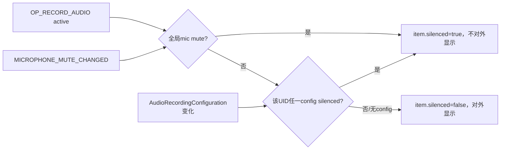

# 第 457 章 Android SystemUI AppOpsController：活跃操作、短时记录、麦克风静音与隐私投影链

> 源码基线：Android 11 / API 30 / `android-11.0.0_r48`。本章只在 macOS 阅读，不实际编译。核心文件：`AppOpsController.java`、`AppOpsControllerImpl.java`、`AppOpItem.java`、`PermissionFlagsCache.kt`、`PrivacyItemController.kt`、`PrivacyItem.kt`、`ForegroundServiceController.java`、`AppOpsCoordinator.java`，并对照 `AppOpsControllerTest.java`。本分支没有 PrivacyItemController 专用测试。

## 1. 本章解决什么问题

相机、麦克风或定位开始使用时，SystemUI怎样得知？一次很短的访问为何仍保留五秒？麦克风被系统静音时为什么不该显示“正在录音”？同一事实又怎样分别服务隐私指示器和前台服务通知？

## 2. 一句话主线

AppOpsControllerImpl监听 AppOpsManager 的 active与 noted事件，以 `(op, uid, package)`分别维护持续账和五秒短时账，再结合权限敏感标志、定位 provider与录音静音状态过滤；下游 PrivacyItemController按当前用户/profile映射成相机、麦克风、位置 PrivacyItem，ForegroundServiceController则给通知附加 AppOps事实。

## 3. AppOps 不是运行时权限本身

权限回答“应用是否获准做某类事”，AppOps还记录/控制某项实际操作是否发生或正在发生。SystemUI不重新授权，只消费 AppOps服务输出的使用事实。

## 4. active 与 noted 的区别

active适合有开始/结束区间的长期操作，如持续录音；noted表示一次被记录的瞬时访问，可能没有可观察的结束。Controller让 noted至少存在五秒，以免指示器一闪即逝。

## 5. 这不是全量 AppOps 观察器

OPS仅含 camera、phone-call camera、system alert window、record audio、phone-call microphone、coarse location、fine location七项。其余操作不会进入本类，即使 `isUserVisible`里写了额外判断也无事件来源。

## 6. 三层职责

AppOpsManager产生原始事件；AppOpsController做事实合并、可见性和麦克风修正；PrivacyItemController/通知控制器根据产品开关、用户和 UI需求投影。把三层混在一起会把“没监听”“被过滤”“下游没展示”误当同一问题。

## 7. 总体架构



## 8. 进程边界

AppOps、PackageManager、LocationManager和 AudioService主要在 system_server；应用实际资源访问发生在应用/媒体/相机等进程；Controller和下游在 SystemUI。监听回调背后是 Binder或系统服务 callback，SystemUI持有的是投影账，不是资源句柄。

## 9. 线程边界

Controller以注入的 Background Looper创建 H；通知订阅者统一 post到该 Handler。继续复读 framework `AppOpsManager`可确认：已废弃的 `startWatchingActive(int[], listener)`转交 Context main executor，所以 active入口在SystemUI主线程；`startWatchingNoted(int[], listener)`的 Binder Stub却直接调用 listener，因此 noted入口在Binder线程。Audio recording callback和麦克风静音广播指定 H，四种入口确实可能交错。

## 10. 构造阶段

取得 AppOpsManager、AudioManager、LocationManager、PermissionFlagsCache和 BroadcastDispatcher，建立每个支持 op的 ArraySet callback表，读取一次当前 mic mute，并向 DumpManager注册。此时并不监听 AppOps。

## 11. 懒监听策略

第一次加入有效 callback后才 `setListening(true)`；最后一个全局 callback移除后停止。这样无人消费时不维持 AppOps watcher、录音 callback与广播。

## 12. 开始监听的四件事

注册 active watcher、noted watcher、AudioRecordingCallback，并把当前 active recording configurations异步喂给同一 callback；最后通过 BroadcastDispatcher监听 `ACTION_MICROPHONE_MUTE_CHANGED`。

## 13. 停止监听的清理

停止两个 AppOps watcher和录音 callback，移除后台 Handler全部消息，注销广播，并分别清 active items、recordingsByUid和 noted items。它不向已经移除的最后订阅者补 false，这是合理的无人消费收尾。

## 14. setListening 不幂等

方法直接赋值后执行注册/注销，没有 `if (mListening == listening) return`。而 addCallback只要全局列表非空就再次调用 true，因此第二个消费者会重复请求注册 watcher、录音 callback和广播。

## 15. 重复注册的真实风险

复读framework后可精确限定：AppOps active/noted各自用 listener→Binder callback Map去重；AudioManager也检查同一 callback并只记warning。BroadcastDispatcher却把每次新建的 IntentFilter/HandlerExecutor封成不同 ReceiverData加入 Set，会让同一 receiver收到重复分发，直到 unregister按receiver一次清掉全部登记；此外每次仍会再次post初始录音配置。现有测试只覆盖单次监听。

## 16. callback 两本账

`mCallbacksByCode`决定某 op通知谁，`mCallbacks`只决定是否还有任何订阅者。前者每项是 Set去重，后者是 List，可产生不同步。

## 17. 同一 callback 重复 add

只要 op受支持，代码无论 Set.add是否真的新增都把 `added=true`并向全局 List再加一次。随后 remove一次会从 code set删掉 callback，却只删全局 List一个实例，可能无人接收但 Controller仍认为有人而持续监听。

## 18. 分批订阅的语义

同一 callback先订阅camera、再订阅mic，会在全局 List出现两份；移除camera只删一份，mic仍有效且保持监听。这能工作，却依赖重复 List作为“订阅批次数”而非明确引用计数，重复同批 add时就失真。

## 19. callback 集合的线程安全

add/remove通常由主线程调用，`notifySuscribersWorker`在后台 Handler直接遍历 ArraySet；没有锁或快照。并发增删可能数据竞争或 ConcurrentModification，接口未用主线程注解强制调用者纪律。

## 20. AppOpItem 身份

查找严格比较 code、uid、packageName，时间和 silenced不参与身份。同包在不同用户有不同 UID，因此天然分开；共享 UID下不同包仍靠package区分。

## 21. active 状态机

首次 active=true创建 item并返回“是否需要通知”；重复 true不变；active=false找到 item就删除并返回 true；无对应 item的 false忽略。它是集合边沿，不累计嵌套 start次数。

## 22. active 不做引用计数

若相同 `(op,uid,package)`有两个并行资源会话，而上游只以布尔边沿提供聚合状态则没问题；若上游可能分别报告 start/stop，本类第一条 stop就会过早删除。它依赖 AppOpsManager已聚合 active语义。

## 23. active 时间戳

item只在首次 active时用 `System.currentTimeMillis()`创建，重复 active不刷新。它表示本轮持续区间起点，不是最近一次事件时间。

## 24. noted 状态机

首次 allowed note创建 item；同身份再次 noted不新建、不再次通知 true，但取消旧移除任务并重新安排五秒。因此用户看到的是连续活动窗口，内部时间戳仍是第一次 note。

## 25. noted 五秒是最短保留

每次 note把删除 deadline向后推五秒。频繁 note可让 item一直存在；注释所说“不重复通知”指 true边沿只发一次，而不是第二次 note完全不处理。

## 26. Handler token 的用法

以 AppOpItem对象作消息 token，`removeCallbacksAndMessages(item)`只取消该 noted item的旧任务，再用同 token postDelayed。不同身份的 timeout互不影响。

## 27. active 与 noted 的并集语义

同一身份可同时各有一个 item。回调只在“并集从空变非空”时 true、从非空变空时 false；移除其中一份而另一份仍在不会发 false。

## 28. 并集时序图



## 29. 查询结果会出现重复 item

`getActiveAppOpsForUser`先复制可见 active，再复制可见 noted，不在 Controller层去重。因此同一身份同时 active+noted时列表有两项；单测明确断言 size=2。

## 30. 回调去重不等于查询去重

事件消费者收到一对 true/false边沿，而轮询消费者可能看到双项。PrivacyItemController之后映射为 data class并 `distinct()`，通知消费者则主要维护 Set；不能假设所有下游都自动去重。

## 31. noted 只接受 MODE_ALLOWED

denied/ignored等结果直接 return，不显示“应用尝试但被拒绝”。本类呈现实际允许的访问事实，而不是安全审计尝试日志。

## 32. active 回调没有 mode参数

它信任 AppOps active listener只报告应追踪的活动；可见性另由 permission flags过滤。若权限/模式中途变化，PermissionFlagsCache会更新，但 Controller不会主动重新通知已有 item。

## 33. 用户筛选

查询时用 `UserHandle.getUserId(uid)`与指定 userId比较；USER_ALL不过滤。没有把 isolated UID或 SDK sandbox等后续模型纳入r48逻辑。

## 34. user sensitive 门

普通camera/mic/location op先由 `AppOpsManager.opToPermission`映射权限，再查 `FLAG_PERMISSION_USER_SENSITIVE_WHEN_GRANTED`。未对应权限或没该标志就不向用户展示。

## 35. 为什么不是所有获准权限都展示

平台可把系统/默认组件的某权限标成不需对用户敏感展示，降低永久系统活动噪声。这里依据 PackageManager flags，而不是硬编码包白名单。

## 36. 强制可见的例外

SYSTEM_ALERT_WINDOW、MONITOR_HIGH_POWER_LOCATION、PHONE_CALL_CAMERA和PHONE_CALL_MICROPHONE直接可见，因为部分操作没有普通敏感权限映射或产品要求始终展示。

## 37. 一个不可达分支

`OP_MONITOR_HIGH_POWER_LOCATION`被 isUserVisible强制可见，却不在 OPS数组，因而本 Controller正常不会收到它。除非测试/外部直接调用入口传入，该分支是历史或未来扩展残留。

## 38. 定位 provider 的 camera 特例

若 OP_CAMERA的包属于 fused location provider packages，即使 permission flag路径不同也强制可见。代码每30秒最多向 LocationManager刷新一次 provider包列表。

## 39. provider 缓存用墙上时钟

刷新判断使用 currentTimeMillis，不是 uptime。用户把时间大幅调后可能让缓存比预期更久不刷新；调前会提前刷新。item时间戳同样是墙上时钟，但五秒删除由 Handler uptime调度。

## 40. provider 列表空值边界

`mLocationProviderPackages.contains`没有 null防护，依赖 LocationManager返回非null列表。首次刷新也依赖当前墙上时间大于初始0+30秒，正常Android epoch满足，但实现没有显式初始化哨兵。

## 41. PermissionFlagsCache 做什么

按 `(permission,package,uid)`缓存 PackageManager permission flags；第一次查询才注册 OnPermissionsChangedListener。某 UID权限变化时，只重查已经见过的 key。

## 42. Permission cache 的线程约束

注释要求后台调用，但 mutable Map没有同步；首次 get由 Controller后台查询路径或 callback worker触发，权限变化也投递 background executor。若该 executor不是严格单线程，仍可能并发读写。

## 43. 包卸载后的缓存

缓存没有 package removed/user removed清理，按见过的 UID持续保存 key；UID日后复用时新包名形成新 key，旧条目仍占内存。监听也从不注销。

## 44. 可见性过滤发生两次

回调发送前调用 isUserVisible，查询列表时又调用。这样非敏感 item仍可暂存在 active/noted内部账，却不暴露给消费者；权限标志变化后下一次查询可能得到不同结果。

## 45. 权限变化没有边沿通知

PermissionFlagsCache只刷新缓存，不通知 AppOpsController重新计算。一个已active op从不可见变可见时，查询会变化但订阅者未必收到触发；需要其他 AppOps/录音事件才驱动下游更新。

## 46. 麦克风为什么要看 AudioManager

AppOps active只说明应用持有录音操作，未必真的获得音频：全局 mic mute或AudioService把客户端录音 silenced时，隐私 UI不应说它正在采集声音。Controller为 OP_RECORD_AUDIO附加 `silenced`。



## 47. 初始录音配置补偿

注册 callback后立即异步读取 `getActiveRecordingConfigurations()`并主动调用 callback，避免 Controller启动监听前已存在的静音状态缺失。

## 48. recordingsByUid

每次配置变化先清 SparseArray，再按 clientUid分组保存全部 AudioRecordingConfiguration。它与 active items共用 `mActiveItems`锁，isAnyRecordingPausedLocked要求持该锁。

## 49. “Any paused”政策

某 UID只要任一 recording config `isClientSilenced()`就把整个 OP_RECORD_AUDIO item标 silenced。若同 UID同时有一条被静音、一条真正录音，指示器会整体隐藏，存在低报风险。

## 50. 没有 recording config 时

若mic未全局静音且该 UID没有配置，函数返回 false，于是 active AppOp仍显示。设计把 AppOps作为基本事实，Audio配置只用来确认暂停，不要求二者必须同时存在。

## 51. 全局 mic mute 优先

`mMicMuted`为true时所有 UID的 OP_RECORD_AUDIO都视为 silenced，无需检查配置。广播到达后台 Handler后现场重读 AudioManager状态，再遍历 active items修正。

## 52. 只修正 OP_RECORD_AUDIO

phone-call microphone不进入 silenced逻辑，因此全局静音时它仍可能显示。代码注释也明确 mSilenced只用于 RECORD_AUDIO；是否符合通话音频特殊语义由产品政策决定。

## 53. 静音边沿

item从未静音→静音时发 active=false；恢复时发 true。active item本身没有删除，只改变投影；查询过滤 `!item.isSilenced()`。

## 54. 静音 item 的结束事件不对称

active=true时若一开始就 silenced，`updateActives`返回 false，不发 true；之后 active=false删除 item却返回 true，可能发一个没有配对 true的 false。下游通常重算集合可容忍，但事件流并非严格成对。

## 55. noted 麦克风不看 silenced

noted item创建时不调用录音暂停判断，查询 noted也不检查 silenced。因此一次 allowed RECORD_AUDIO note可保留五秒，即使全局 mute；它表示访问被记录，而非持续声音采集。

## 56. 静音更新持锁发 post

`updateRecordingPausedStatus`在 active锁内修改 item并调用 notifySuscribers；后者只 post Runnable，不同步执行 callback，因此不会立即重入同锁。不过大量 item会在锁内创建大量消息。

## 57. active/noted 合并源码

```java
boolean activeChanged = updateActives(code, uid, packageName, active);
if (!activeChanged) return;
synchronized (mNotedItems) {
    alsoNoted = getAppOpItemLocked(mNotedItems, code, uid, packageName) != null;
}
if (!alsoNoted) {
    notifySuscribers(code, uid, packageName, active);
}
```

## 58. 两把锁的快照窗口

active更新后才另取 noted锁，noted路径反向先更新 noted再取 active锁。没有同时持两锁避免死锁，但两步间另一事件可穿插，导致重复或缺少边沿通知；最终查询账可能正确，事件序列却不一定严格线性化。

## 59. 一个交错例子

active=true新增后尚未查 noted；noted=true新增并看到 active存在所以不通知；active线程再看到 noted存在也不通知，结果并集从空变非空却没有任何 true。该竞态取决于 AppOps callback是否可能并行，源码锁设计没有排除。

## 60. 如何改进合并原子性

用一把 session lock同时保护 active/noted并在锁内计算 union前后布尔值，再锁外通知；或把所有原始事件先投递同一 H actor串行处理。这样无需跨两锁猜测时间顺序。

## 61. notify 的线程

入口 `notifySuscribers`统一 post H，再由 worker检查可见性并遍历 op对应 callback。下游不能假设在 SystemUI主线程；ForegroundServiceController明确再 post main。

```java
private void notifySuscribers(int code, int uid, String pkg, boolean active) {
    mBGHandler.post(() -> notifySuscribersWorker(code, uid, pkg, active));
}

private void notifySuscribersWorker(int code, int uid, String pkg, boolean active) {
    if (mCallbacksByCode.containsKey(code) && isUserVisible(code, uid, pkg)) {
        for (Callback cb : mCallbacksByCode.get(code)) {
            cb.onActiveStateChanged(code, uid, pkg, active);
        }
    }
}
```

## 62. callback异常

遍历没有 try/catch；任一 callback抛 RuntimeException会终止该 H消息，后续 callback收不到这一边沿。若异常逃出 Looper通常会杀 SystemUI进程，而非只损失一个订阅者。

## 63. mCallbacksByCode 只预建 OPS

add不支持 code只在 DEBUG时 wtf且不加入；notify也 containsKey防守。DEBUG常量false，产品现场对错误订阅没有明显日志，可观测性弱。

## 64. 停止监听会取消什么

`mBGHandler.removeCallbacksAndMessages(null)`不仅取消 noted timeout，也取消尚未执行的 subscriber通知和初始录音同步。之后清账，所以重新监听不会继承旧五秒窗口。

## 65. 重新监听不是状态恢复

active watcher是否立即回放当前 active由 AppOpsManager协议决定；本类只主动回放 Audio recording configs，不主动查询全部 active/noted AppOps。消费者短暂全部移除再加入可能出现观察空窗。

## 66. dump 能看到什么

输出 listening、Active Items和Noted Items，便于判断是上游没事件还是下游过滤。它没有输出 callbacks、recordingsByUid、micMuted、provider cache或permission flags，因此静音/可见性问题证据不完整。

## 67. dump 没加锁

遍历 active/noted列表时不持对应锁；后台 callback可能同时增删，可能读到非一致快照或抛并发异常。Dumpable并不自动让调用发生在 H线程。

## 68. AppOpItem.toString 的隐藏 bug

构造时保存一个 StringBuilder前缀，`toString()`每次都向同一个 builder追加 silenced和`)`。第二次 dump会变成类似 `Paused=false)false)`，日志越打越长并污染后续诊断。

```java
@Override
public String toString() {
    // mState 是构造期创建并保存在字段中的同一个 StringBuilder
    return mState.append(mSilenced).append(")").toString();
}
```

## 69. 正确的 toString

每次应新建字符串，或让保存字段只含不可变前缀并拼接返回但不修改。诊断函数原则上必须无副作用，否则观察本身改变被观察对象。

## 70. noted 时间戳的误导

同一 item重复 noted只续 deadline而不更新 `mTimeStarted`；dump显示的 time started若被下游使用，会看起来访问很久。当前 PrivacyItem不携时间，因此主要影响诊断/其他消费者。

## 71. PrivacyItemController 的输入范围

它只订阅 camera/phone-call camera、record audio/phone-call mic和 coarse/fine location，不订阅 system alert window。后者只服务前台服务/警告通知链，不属于三类隐私图标。

## 72. PrivacyItem 的身份

data class由 PrivacyType和 PrivacyApplication(packageName,uid)组成。coarse与fine映射同一 location，普通camera与phone-call camera映射同一 camera，所以 `distinct()`会把同应用同类型多 op合并。

## 73. Privacy 类型不保留 active/noted

下游只知道“此应用有这类近期/当前访问”，不知道来自 active还是 noted、开始时间、silenced或具体 op。五秒语义已经在上游折叠。

## 74. 当前用户与 profile

监听开始或 USER_SWITCHED/MANAGED_PROFILE_AVAILABLE/UNAVAILABLE广播时，后台读取 ActivityManager当前用户，再取 UserManager.getProfiles，形成 currentUserIds。工作资料可用时其 UID也进入投影。

## 75. AppOps callback 的用户门

先把 uid换userId；只有在 currentUserIds才 schedule update。后台用户事件仍留在 AppOpsController全局账中，但不触发当前 UI重算。

## 76. 用户切换的异步窗口

广播只向 bgExecutor排任务；旧 currentUserIds在任务执行前仍有效。此间旧用户 AppOps回调可能更新旧投影，新用户回调可能被忽略，随后完整查询才纠正。

## 77. updatePrivacyList 的查询

对每个 current profile调用 `getActiveAppOpsForUser`，flatMap、mapNotNull为 PrivacyItem、distinct后整体替换同步属性 privacyList，再投递 UI executor通知所有弱 callback。

## 78. 列表不是原子跨用户快照

每个 profile分别查询；查询间 AppOps账可变化，组合可能混合不同时刻。隐私指示器是最终一致投影，不是审计级事务快照。

## 79. 弱 callback

持 WeakReference避免 SystemUI UI对象忘记 remove时永久泄漏。通知时空引用被跳过，但不会立刻从列表清除；只有 removeCallback会顺便 remove所有 null项。

## 80. 重复 Privacy callback

addCallback直接向 mutableList添加 WeakReference，不去重。同一 callback重复add会收到多次列表通知；remove使用 equality匹配，会一次 removeIf清掉所有等于目标的活引用及空引用。

## 81. MyExecutor 的目的

把 add/remove/listening状态变化串到 UI DelayableExecutor；`updateListeningState`取消旧的0ms延迟任务再发新任务，用于合并同一轮 callback增删与 feature flag变化。

## 82. Kotlin `and` 的细节

`!callbacks.isEmpty() and (allIndicatorsAvailable || micCameraAvailable)`使用Boolean.and而非短路`&&`，两边都会求值；这里只读字段无副作用，结果等价，但写法容易让读者误以为是位运算错误。

## 83. 两个产品开关

ALL_INDICATORS控制包含位置的完整权限中心；MIC_CAMERA只启用麦克风/相机。位置 callback与映射都会在 all=false时过滤，即便 mic/camera开关为true。

## 84. r48 的决定性初始化缺口

PrivacyItemController声明 DeviceConfig listener和读取当前flag的方法，却在 init/其他路径从未调用 `addOnPropertiesChangedListener`，也从未用读取方法初始化 `allIndicatorsAvailable/micCameraAvailable`。两个字段保持false。

## 85. 缺口的直接结果

`setListeningState`要求至少一个 flag为true；在该类自身可达生产路径里条件永远false，因此即使 UI添加 callback，也不会向 AppOpsController订阅，privacyList保持空。不能把这段r48源码描述成已正常显示隐私指示器。

## 86. 为什么必须强调“本分支”

后续Android版本可能补齐注册/初始化，OEM也可能改源码。这里的结论来自 `android-11.0.0_r48`本地文件全局搜索：listener只有声明，没有使用；不是对所有Android 11产品一概而论。

## 87. 未注册 listener 源码证据

```kotlin
init {
    dumpManager.registerDumpable(TAG, this)
}

// 文件中虽有这两个读取函数和 devicePropertiesChangedListener，
// 但没有调用 deviceConfigProxy.addOnPropertiesChangedListener(...)
// 也没有把读取值赋给 allIndicatorsAvailable / micCameraAvailable。
```

## 88. 一个合理补齐方向

构造期在 UI executor注册 privacy namespace listener，读取两个初值并设置字段，再根据 callback数量更新 listening；同时提供销毁/测试替换路径。当前学习只做只读推演，不修改源码。

## 89. flag callback 的线程假设

代码注释称 DeviceConfig listener运行在 ui executor，因此直接遍历 callbacks；但由于注册代码缺失，这个线程保证也没有在本类建立。未来补齐时必须显式传 internalUiExecutor。

## 90. 关闭开关怎样清 UI

设计意图是 flag变化→延迟 setListeningState→remove AppOps callback与用户广播→`update(false)`；updatePrivacyList看到 listening=false便清空 privacyList并通知下游。

## 91. update(false) 的竞态

关闭监听安排一个后台清空任务；若开关很快重开并更新 users，旧任务可能在新任务后执行。没有 generation，bgExecutor若并行或时序交错，旧关闭任务可清掉新列表。

## 92. currentUserIds 的线程可见性

字段在 bgExecutor写，在 AppOps callback所在 AppOpsController H线程读，没有 volatile/同步。若两个 background执行器并非同一线程，Java内存可见性没有明确保证。

## 93. privacyList 只做浅拷贝

getter同步并 `toList()`，元素是不可变data class所以浅拷贝足够；setter同步。currentUserIds、flags、callbacks没有相同锁，dump仍可能组合不同时间点字段。

## 94. Privacy dump

显示 listening、current user ids、Privacy Items和仍存活callbacks。它不显示两个availability flag，也不显示待执行 update/listening任务；面对“永远空列表”，最关键的feature flag证据缺失。

## 95. ForegroundServiceController 是另一消费者

构造即订阅 camera、system alert、record audio、coarse/fine location，把后台 AppOps callback post主线程；按用户/package维护 feature Set，并更新对应通知 Entry的 active app ops。

## 96. 为什么它不受 Privacy flag缺口影响

它直接订阅 AppOpsController，不经过 PrivacyItemController和 DeviceConfig开关。因此隐私列表为空时，前台服务通知仍可能正确带上 app op事实；两条下游不可互相证明。

## 97. 新通知管线 AppOpsCoordinator

Coordinator attach时也订阅同一 APP_OPS，并在主 executor更新 ForegroundServiceController/NotificationEntry、invalidate list；旧/新管线迁移期间要注意是否同时实例化导致多消费者注册。

## 98. 多消费者放大重复监听 bug

ForegroundServiceController构造先 add，AppOpsCoordinator attach再 add，Privacy若启用又 add。因为 AppOpsController.add每次都 setListening(true)，这正是非幂等注册在生产中可达的场景。

## 99. AppOps 事实和通知 lifetime

AppOpsCoordinator还把前台服务通知最少保留五秒，但这与 noted op五秒是两套计时器：前者从 notification post time算，后者从最近一次 note算，不应合并解释。

## 100. 单元测试证明了什么

测试覆盖支持op监听、单callback add/remove、身份去重、按用户查询、非敏感过滤、noted重复续期、active/noted并集回调，以及录音暂停/恢复投影。

## 101. 测试明确接受双项查询

`testActiveOpNotRemovedAfterNoted`与反向测试都断言 active+noted时列表size为2且不提前false。这证明重复列表是r48设计/现状，不是我们误判。

## 102. 测试未覆盖什么

未覆盖第二消费者触发重复 setListening、同 callback重复add导致全局List残留、callback并发增删、active/noted双线程交错丢true、dump并发/toString累加、provider cache空值，以及 PrivacyItemController整条生产初始化。

## 103. 没有 Privacy 专用测试的后果

本地 tests目录搜索不到 PrivacyItemControllerTest，因此未注册 DeviceConfig listener没有被用例发现。AppOpsController测试全绿也只能证明上游事实层，不能证明隐私 UI链可达。

## 104. 故障导航：AppOps dump没有 item

先确认是否有任何 callback使 listening=true，再查 startWatching是否重复/失败、目标op是否在 OPS、上游mode是否allowed、停止监听是否清过账。不要先怪 Privacy映射。

## 105. 故障导航：内部有 item但查询没有

查 userId、permission flag是否 USER_SENSITIVE、camera包是否 provider、RECORD_AUDIO是否 silenced。active dump显示 item不代表 getActiveAppOps一定返回。

## 106. 故障导航：查询有 item但隐私列表空

r48首先查 PrivacyItemController availability字段和 listener注册缺口；再查 callback数量、listening、currentUserIds、location flag过滤和后台 update是否执行。通知链正常不能排除该问题。

## 107. 故障导航：图标延迟消失

若是 noted，这是最近一次note后至少五秒的设计；若同身份仍active，noted到期也不会false；若录音刚被静音，AudioRecordingCallback/广播到 H后才更新。

## 108. 故障导航：图标重复闪动

查 active/noted边沿交错、重复 watcher/callback、同一Privacy callback重复add、mic silenced true/false抖动，以及 permission visibility在查询和通知两处结果是否变化。

## 109. 改进优先级一

先让 `setListening`幂等，并用明确订阅记录替代 global List重复计数；callback通知取快照或统一主/后台 actor。它直接影响多个生产消费者。

## 110. 改进优先级二

把 active/noted放同一锁或同一事件队列，以 union前后状态产生边沿；为录音配置定义“任一active”而不是“任一silenced”的精确聚合，并处理无配对true的false。

## 111. 改进优先级三

补齐 Privacy DeviceConfig初始化/监听及测试，给用户/flag后台任务加 generation；完善 dump的flags、mic mute、recording和callbacks，并修复 AppOpItem.toString无副作用。

## 112. macOS 只读练习一：追 active/noted并集

用 `rg -n "onOpActiveChanged|onOpNoted|removeNoted|addNoted" frameworks/base/packages/SystemUI/src/com/android/systemui/appops`，画出 active先到、noted后到、active结束、五秒到期四步列表与callback，不修改或编译。

## 113. macOS 只读练习二：验证麦克风静音

并排阅读 `updateActives`、`isAnyRecordingPausedLocked`、`updateRecordingPausedStatus`和相关测试；分别推演全局mute、单UID两条录音一静一活、无recording config三种结果。

## 114. macOS 只读练习三：核查隐私链可达性

对 PrivacyItemController执行 `rg -n "devicePropertiesChangedListener|addOnPropertiesChangedListener|allIndicatorsAvailable|micCameraAvailable"`，证明哪些字段有声明/赋值、注册调用是否存在，再写出 setListeningState为何保持false。

## 115. macOS 只读练习四：比较两个五秒

只读定位 `NOTED_OP_TIME_DELAY_MS`和 AppOpsCoordinator的 `MIN_FGS_TIME_MS`；记录各自起点、续期条件、结束动作和消费者，解释它们数值相同却不是同一计时器。

## 116. 最容易误解的一点

`getActiveAppOps`名字中的 active包含 active和最近五秒 noted，而且同身份可返回两项。它是“当前或近期值得展示的AppOps投影”，不是纯 AppOps active快照。

## 117. 第二个易错点

mic AppOp active不必等于正在获得声音；r48用AudioRecordingConfiguration修正，但以“任一配置silenced”隐藏整个 UID，仍是近似政策而非音频数据面证明。

## 118. 第三个易错点

AppOpsController上游在r48有完整测试，不代表 PrivacyItemController下游可工作；本分支的 DeviceConfig listener未注册、初值未赋，必须按本地源码明确记录这一断链。

## 119. 本章结论

AppOpsController用两本身份账和五秒桥接，把短时与持续资源使用统一为边沿事件，并加入权限敏感度、用户与录音静音政策；核心风险是监听/订阅不幂等、双锁并集竞态、诊断副作用，以及 Privacy下游在r48的feature flag初始化缺口。

## 120. 下一章预告

下一章研究 SystemUI PrivacyChip与Header/状态栏投影：如果隐私事实可用，UI怎样聚合图标、显示Dialog/权限使用列表、处理配置和动画；同时严格区分r48可达代码与后续版本行为。
