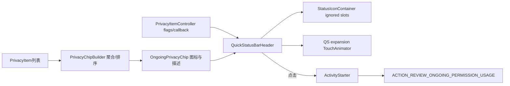
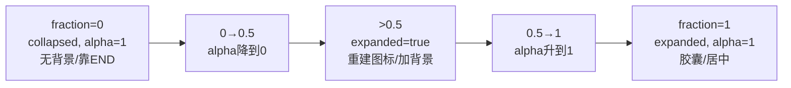
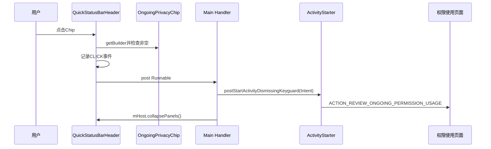

# 第 458 章 Android SystemUI OngoingPrivacyChip：隐私图标聚合、QS Header 动画与点击链

> 源码基线：Android 11 / API 30 / `android-11.0.0_r48`。本章只在 macOS 阅读，不实际编译。核心文件：`OngoingPrivacyChip.kt`、`PrivacyChipBuilder.kt`、`PrivacyItem.kt`、`PrivacyChipEvent.kt`、`QuickStatusBarHeader.java`、`QuickStatusBarHeaderController.java`、`ongoing_privacy_chip.xml`、`quick_status_bar_header_system_icons.xml`，并对照 `PrivacyChipBuilderTest.kt`。必须先记住第457章结论：裸r48 `PrivacyItemController`没有注册/初始化DeviceConfig开关，生产列表链默认不可达；本章同时讲设计链和这一实际入口断点。

## 1. 本章解决什么问题

如果相机、麦克风、位置 PrivacyItem已经到达，SystemUI怎样把多应用、多操作压成少量图标？QS从收起到展开时Chip为何先消失再出现并切换背景？点击后是谁展示权限使用详情？

## 2. 一句话主线

PrivacyChipBuilder把列表按应用和类型聚合、排序并生成类型图标；OngoingPrivacyChip重建ImageView、内容描述和收起/展开材质；QuickStatusBarHeader依据feature flag与列表控制可见性、抑制重复状态栏图标、驱动QS展开动画，并在点击时启动系统的 ongoing permission usage页面。

## 3. 先写清可达性

本地r48中 Header能注册 PrivacyItemController callback，Chip代码也完整，但 Controller的两个availability字段没有生产初始化路径，故 `getChipEnabled()`通常一直false。下面“列表到达后”的流程是现有代码设计能力，不应伪装成裸分支必然运行事实。

## 4. 这不是Android 12状态栏绿点

r48实现位于Quick Settings Header，是多枚权限类型图标和可选胶囊背景；不要拿后续版本的状态栏privacy dot、PrivacyDialogController或传感器开关UI反向解释这里。

## 5. 四个角色

PrivacyItemController供给当前用户列表和flag；PrivacyChipBuilder只做派生数据；OngoingPrivacyChip只管理View内容/材质；QuickStatusBarHeader负责生命周期、动画、图标槽政策、点击导航和事件统计。

## 6. 总体架构



## 7. 进程边界

Builder、Chip和Header都在主SystemUI进程；点击通过ActivityStarter跨进程/组件解析，最终由可处理系统Intent的权限使用页面展示详情。SystemUI不在本类内创建权限详情Dialog。

## 8. 线程边界

View创建、属性更新、点击和展开动画应在SystemUI主线程。PrivacyItemController设计上经 UI executor回调Header；Chip本身没有线程检查，若外部后台直接设置privacyList会违反View线程规则。

## 9. 布局嵌套

`ongoing_privacy_chip.xml`根是OngoingPrivacyChip，内有最小宽48dp、高度资源指定的FrameLayout background，再有横向LinearLayout icons_container。它被include进Header右侧weight=1、gravity=end的系统图标区域。

## 10. 为什么根高是match_parent

根占满Header高度以提供稳定点击/焦点范围，真正胶囊背景只有 `ongoing_appops_chip_height`。最小48dp放在background上，满足触控可达性而图标本身可以更小。

## 11. onFinishInflate

Chip只用 `requireViewById`保存background与icons_container，没有主动updateView。默认列表空、expanded=false且XML无背景，所以初始画面正确；之后属性setter驱动更新。

## 12. inflate之前调用setter

`privacyList`或`expanded`变化会立即updateView并访问lateinit字段。若调用发生在onFinishInflate前会抛UninitializedPropertyAccessException；正常Header只能在整棵layout inflate完后得到callback，依赖外部时序。

## 13. PrivacyItem数据结构

每项是 `(PrivacyType, PrivacyApplication(packageName,uid))`；类型只有CAMERA、MICROPHONE、LOCATION。不可变data class让equals/distinct天然按类型、包名和UID判断。

## 14. UID为何仍要保留

相同package字符串在不同用户对应不同应用身份；UID含用户部分。Builder按完整PrivacyApplication分组，不会把个人资料和工作资料同包错误合并。

## 15. 类型枚举顺序

源码声明CAMERA、MICROPHONE、LOCATION，Kotlin枚举自然顺序就是该次序。Builder对types调用distinct().sorted()，所以图标稳定按相机、麦克风、位置排列，不随AppOps事件到达顺序变化。

## 16. Builder的两种输出

`types`服务Chip图标与内容描述；`appsAndTypes`服务点击前空检查和潜在详情排序。当前Header不会直接拿appsAndTypes渲染应用名。

## 17. 按应用聚合

`groupBy({ application }, { privacyType })`把同一应用的类型放到List，再转Pair列表。它不对每应用的类型List做distinct；上游PrivacyItemController已全局distinct才通常没有重复。

## 18. Builder排序政策

应用先按拥有类型数量降序，再按其最小PrivacyType升序。多种资源的应用排前；同数量时相机优先、麦克风其次、位置最后。

## 19. 为什么位置放最后

测试注释说明位置希望落在“+其他应用”一类未来/外部详情摘要的后部。当前Chip只画全局类型图标，应用排序主要供appsAndTypes消费者，而不是改变图标顺序。

## 20. 重复item会扭曲排序

若绕过PrivacyItemController直接给Builder重复相同应用/类型，`it.second.size`会把重复也计数，使该应用错误前移；全局types会distinct。Builder并非对任意输入都规范化。

## 21. Builder源码

```kotlin
appsAndTypes = itemsList.groupBy({ it.application }, { it.privacyType })
        .toList()
        .sortedWith(compareBy(
                { -it.second.size },
                { it.second.min() }))
types = itemsList.map { it.privacyType }.distinct().sorted()
```

## 22. 图标生成

`generateIcons()`对每个type从资源取对应permission group drawable。它每次调用重新得到Drawable列表；Chip随后mutate、统一tint，再装入新ImageView。

## 23. 为什么要mutate

资源Drawable可能共享ConstantState；mutate避免给本Chip着色时污染同资源的其他使用者。随后用固定的status_bar_clock_color统一视觉风格。

## 24. 类型文字连接

0项返回空字符串；1项只返回类型名；2项及以上用本地化separator连接前N-1项，再加lastSeparator和最后一项。中文资源形成“相机、 麦克风 和 位置”一类本地化串。

## 25. joinWithAnd 的前置条件

内部调用 `subList(0,size-1)`和last，只能处理size≥2；public joinTypes已用when守住0/1，所以正常不会越界。不要孤立读private扩展后判定空列表崩溃。

## 26. separator是构造快照

Builder构造时读取两种连接符，之后配置/Locale变化不会自动刷新现有Builder。类型名在joinTypes时现场取资源，但连接符可能仍是旧Locale，直到privacyList再次赋值重建Builder。

## 27. privacyList setter

每次赋值先保存原List引用，再新建Builder并updateView；不比较equals。相同内容重复回调仍会removeAllViews、重新创建Drawable/ImageView并requestLayout。

## 28. 列表引用未复制

Chip直接保存调用方List；若它是可变List并被外部原地修改，builder是旧快照而privacyList的isEmpty结果可能变，产生二者不一致。PrivacyItemController getter通常返回新只读List，正常路径较安全。

## 29. builder是public var

外部可以单独setBuilder，却不会触发updateView，也不会同步privacyList。Header点击读取builder，视觉可能来自旧/新另一份状态；更好的API应只暴露只读派生值。

## 30. expanded setter

只有值真正变化才updateView。收起时无背景、无侧padding、图标间距collapsed且图标容器靠END；展开时有胶囊背景/侧padding、expanded间距且图标容器水平居中。

## 31. updateView总会刷新材质

无论列表是否为空，先按expanded设置background和padding。因此空Chip也可能内部持背景，只是Header通常将根GONE；OngoingPrivacyChip自身不依据空列表改visibility。

## 32. 图标重建算法

先removeAllViews；每个类型创建ImageView、CENTER_INSIDE，以固定iconSize加入；除第一枚外修改MarginLayoutParams.marginStart。没有复用旧View或Diff。

## 33. 只有类型没有应用图标

三种类型最多三枚图标；十个应用同时使用麦克风也只显示一个麦克风图标。Chip表达“哪些资源正在/近期被使用”，不表达应用数量。

## 34. iconsContainer重力

collapsed为CENTER_VERTICAL|END，让小图标靠右贴近状态图标；expanded为CENTER_VERTICAL|CENTER_HORIZONTAL，在至少48dp胶囊内居中。

## 35. 空列表处理

只removeAllViews，不清contentDescription、不清builder（builder已为空）也不清background。根View若未被Header设GONE，辅助功能仍可能读到上一轮描述。

## 36. content description

非空时先joinTypes，再固定使用 `ongoing_privacy_chip_content_multiple_apps`。即便列表只有一个应用，也宣布“有多个应用正在使用……”，而资源中明明存在single_app字符串却未使用。

## 37. 为什么Builder保留appsAndTypes

它足以判断单/多应用并生成更精确描述，但OngoingPrivacyChip没有使用。点击只检查size是否0；应用名称也不传给启动Intent。

## 38. Chip更新源码

```kotlin
if (!privacyList.isEmpty()) {
    generateContentDescription()
    setIcons(builder, iconsContainer)
    val lp = iconsContainer.layoutParams as FrameLayout.LayoutParams
    lp.gravity = Gravity.CENTER_VERTICAL or
            (if (expanded) Gravity.CENTER_HORIZONTAL else Gravity.END)
    iconsContainer.layoutParams = lp
} else {
    iconsContainer.removeAllViews()
}
requestLayout()
```

## 39. 固定颜色的配置边界

iconColor、尺寸、padding和backgroundDrawable都在View构造时读一次。Chip没有onConfigurationChanged覆写；Header的updateResources只重建Animator/外层尺寸，不刷新Chip这些字段，主题/密度就依赖View重建才能完全更新。

## 40. drawable实例复用

backgroundDrawable字段长期复用同一Drawable实例，在expanded切换时反复set/null。单个Chip没有共享污染；若主题动态改变，它仍是构造时资源。

## 41. Header何时找到Chip

QuickStatusBarHeader.onFinishInflate先取得各子View、为Chip设置统一onClick，再updateResources创建动画器，最后从PrivacyItemController读取两个availability字段。

## 42. 两个feature flag在Header的含义

`getChipEnabled()`是micCamera或all任一true；all还决定是否把location状态栏slot加入ignored列表。micCamera-only时Chip可显示相机/麦克风，但位置仍走普通状态栏图标政策。

## 43. r48实际初值

第457章已用全库搜索确认Controller两个字段默认false且没有生产赋值；Header onFinishInflate和setListening即使重复getter，也只能读false，除非OEM补丁/测试反射或其他代码版本补齐。

## 44. ignored slots为什么存在

Chip启用时Header告诉StatusIconContainer忽略camera、microphone，以及all模式下location，避免同一资源同时显示独立status icon和聚合Chip。

## 45. ignored不依赖列表非空

只要feature flag启用就忽略这些slot，即使当前没有PrivacyItem。访问发生时预期Chip接管；访问结束后两者都不显示。若Chip数据链断而flag却true，会造成独立图标被抑制、Chip又空的隐私盲区。

## 46. 初始add与后续set

onFinishInflate用 `addIgnoredSlots`，flag callback update用 `setIgnoredSlots`。后者会替换容器全部ignored slots，而不只更新privacy三项；若其他代码也设置ignored列表，可能被覆盖。

## 47. callback更新列表

`onPrivacyItemsChanged`先setPrivacyList重建图标，再按列表非空调用setChipVisibility。两个操作同一UI callback串行，正常不会出现可见空Chip。

## 48. callback更新flag

仅值变化时保存并update：重新计算ignored slots，并根据Chip当前privacyList再次决定可见性。flag关闭不会清Chip内部列表，只把根GONE；重开可立刻用旧列表显示，直到Controller新回调纠正。

## 49. 可见性双门

只有 `chipVisible && getChipEnabled()`才VISIBLE，否则GONE。chipVisible来自列表是否非空或“当前已经VISIBLE”的insets复查；feature flag始终是最终门。

## 50. 可见事件只记一次

Chip首次在本轮QS listening且尚未logged时记录event 601；之后列表变化、隐藏再显示也不重复，直到setListening(false)把logged清false。

## 51. “每次QS打开”是近似语义

注释把listening周期当作QS打开周期。若外层错误地长期保持listening或快速切换，统计边界随生命周期调用而非像素真正可见时间。

## 52. callback晚到的保护

setChipVisibility即使让Chip可见，也只有mListening为true才记view事件；避免用户已关QS后旧列表callback补记曝光。但它仍会修改View可见性，下一次打开看到该状态。

## 53. 监听生命周期

Header setListening true订阅Zen/Alarm、更新Lifecycle、现场重读flags并add Privacy callback；false全部移除并重置统计。onDetachedFromWindow强制setListening(false)。

## 54. Header重复监听是幂等的

开头若参数等于mListening直接return，避免重复add同一PIC callback。它比上一章AppOpsController.setListening更稳健。

## 55. 弱callback与晚回调

PrivacyItemController内部用WeakReference，但已排到UI executor的NotifyChangesToCallback直接保存callback对象引用，所以remove后在途任务仍可调用一次。Header用mListening仅保护日志，不阻止列表/visibility更新。

## 56. 收起到展开的alpha曲线

TouchAnimator给Chip alpha三个值`1→0→1`：QS收起时可见，中点完全透明，完全展开又可见。中点隐藏为几何样式切换提供遮罩。

```java
private void updatePrivacyChipAlphaAnimator() {
    mPrivacyChipAlphaAnimator = new TouchAnimator.Builder()
            .addFloat(mPrivacyChip, "alpha", 1, 0, 1)
            .build();
}

// setExpansion(...)
mPrivacyChip.setExpanded(expansionFraction > 0.5);
mPrivacyChipAlphaAnimator.setPosition(keyguardExpansionFraction);
```

## 57. expanded阈值

每次setExpansion用原始expansionFraction是否>0.5设置Chip.expanded。阈值刚跨过即重建图标/背景；与此同时alpha在中点约0，用户较难看到布局瞬跳。

## 58. 动画图



## 59. 0.5处的严格比较

恰好0.5时仍collapsed；略大才expanded。TouchAnimator中点alpha为0，边界的重建成本和requestLayout发生在手势过程中，可能影响帧稳定但视觉被透明遮挡。

## 60. 每帧是否都会重建

不会：expanded setter只在布尔变化时updateView，所以一个单向展开只在跨阈值时重建一次；手势在0.5附近来回抖动会反复重建。

## 61. forceExpanded的不一致

alpha position用 `keyguardExpansionFraction=forceExpanded?1:raw`，但Chip.expanded仍用原始fraction。forceExpanded=true且raw≤0.5时，Chip以alpha1显示collapsed材质，而其他Header按完全展开处理。

## 62. Header updateResources

配置、RTL、QS tile布局接近完成等会重算外层高度/padding并重建三个TouchAnimator。它不会把当前mKeyguardExpansionFraction立即重新apply到新Animator，因此重建后属性可能暂存Builder默认端点，直到下次setExpansion。

## 63. Animator初始属性风险

TouchAnimator.Builder.build本身通常不必立即设置View；新Animator创建后若没有下一次position，Chip alpha保留旧值。多数配置/布局流程随后会再驱动expansion，但源码没有显式保证。

## 64. 点击前为何抓builder

代码先读取Chip当前builder并检查appsAndTypes非空，避免空Chip点击启动页面。注释说“尽快抓取”，但后续只使用size检查，并不把该快照传进页面。

## 65. 点击真正启动什么

记录event 602，在新建main Handler上post，再让ActivityStarter以 `ACTION_REVIEW_ONGOING_PERMISSION_USAGE`启动Activity并dismiss keyguard，最后让QS host collapsePanels。

```java
PrivacyChipBuilder builder = mPrivacyChip.getBuilder();
if (builder.getAppsAndTypes().size() == 0) return;
mUiEventLogger.log(PrivacyChipEvent.ONGOING_INDICATORS_CHIP_CLICK);
new Handler(Looper.getMainLooper()).post(() -> {
    mActivityStarter.postStartActivityDismissingKeyguard(
            new Intent(Intent.ACTION_REVIEW_ONGOING_PERMISSION_USAGE), 0);
    mHost.collapsePanels();
});
```

## 66. 点击时序图



## 67. 为什么又新建Main Handler

View onClick本来就在主线程，ActivityStarter方法本身也带post语义；额外Handler造成一次队列延迟，没有明显线程转换收益。期间列表/flag可能变化，但Runnable不复查。

## 68. 页面数据不来自builder

Intent没有extras列出appsAndTypes；目标系统组件会自己查询ongoing permission usage。点击时Chip所见和页面打开时服务端所见可能不同，这是实时数据自然变化，不是快照详情。

## 69. mHost空值边界

Runnable无null检查调用 `mHost.collapsePanels()`；正常QS在setupHost后才能交互，若测试/异常布局让Chip先可点击，Activity启动后可能NPE。

## 70. flag关闭后的陈旧点击

setChipVisibility会把根GONE，正常用户点不到；若点击事件已排队，Runnable不复查flag和View attach，仍会打开页面并collapse。

## 71. Chip本身永远focusable

XML设focusable=true，visibility GONE时不参与焦点；VISIBLE时靠根contentDescription为TalkBack提供整体说明。单个ImageView未设各自描述，避免重复朗读。

## 72. 内容描述没有应用名

无论一个还是多个应用，只说正在使用哪些资源类型。隐私最小提示简洁，但单应用专用string闲置且无法告诉用户是谁，需点击详情页。

## 73. 图标颜色与深浅模式

Chip使用构造时status_bar_clock_color；Header其他系统图标通过DualTone/TintedIconManager计算。若主题使两者资源不一致，Chip不会随IconManager的setTint更新。

## 74. Header为什么抑制普通图标

状态栏icon slots通常由其他policy产生camera/mic/location独立图标；QS Header想用可点击的聚合Chip替代它们。ignored只作用该StatusIconContainer，不等于全系统删除slot。

## 75. setShouldRestrictIcons(false)

Header的StatusIconContainer不按通常最大icon数限制，仍显式忽略privacy slots。Chip放在邻接LinearLayout而不是IconManager group，因此不受slot排序/黑名单机制管理。

## 76. cutout布局复查Chip

onApplyWindowInsets更新中间Space与左右padding后，调用 `setChipVisibility(mPrivacyChip.getVisibility()==VISIBLE)`，实质只让feature flag再次否决当前可见状态，不会依据privacyList把GONE恢复为VISIBLE。

## 77. padding永远非null

代码保留 `if (padding==null)`分支，但本地 `StatusBarWindowView.paddingNeededForCutoutAndRoundedCorner`无论cutout有无都返回Pair。后面对padding.first的直接访问因此不NPE，null分支是过时防线。

## 78. 无cutout传入-1

Header把roundedCornerContentPadding参数传-1；helper在cutout=null时返回Pair(-1,-1)，于是走非null分支把系统图标padding设为负值并把cutout padding字段设-1。后续只在>0时使用，仍显示调用方与helper契约错位。

## 79. cutout从有变无的残留

`mHasTopCutout=false`和Space GONE只写在 `cutout!=null`且top rect空/corner分支；若同一View后续收到cutout=null，代码不显式清旧mHasTopCutout/Space。配置通常可能重建View，但本类自身不闭合状态。

## 80. insets与Chip无直接避让

cutout通过Space把左右两半分开，并调整system icons padding；Chip本身只在右半区域gravity=end。它不读取DisplayCutout，依赖Header父布局。

## 81. QS disabled

disable2 quick settings隐藏header text和quick status icons并缩短Header高度，但没有直接set privacyChip GONE；Chip位于quick status bar system icons内部，其祖先可见性/尺寸决定最终像素，需结合布局而非只读Chip字段。

## 82. onDetached清理

先setListening(false)，移除ringer observer与StatusBarIconController icon group，再super。Chip的OnClickListener和内部View无需显式注销；Privacy callback通过Controller remove。

## 83. QuickStatusBarHeaderController很薄

它只把listening同时传给carrier group和Header，TODO还说未来把View逻辑移入Controller。隐私业务仍全在View，单元测试和生命周期隔离较弱。

## 84. UiEvent只记录两类

PrivacyChipEvent定义VIEW=601、CLICK=602。没有记录类型数、应用、停留时间或页面成功打开，保护隐私但也无法用事件证明详情Activity启动成功。

## 85. VIEW不等于用户真的看到

满足VISIBLE、enabled、listening就记录，不检查alpha是否恰在动画中点0、是否被父View遮挡、屏幕是否点亮。它是逻辑曝光近似值。

## 86. CLICK记录早于启动

先log再post启动；Activity解析失败、keyguard流程失败或Runnable异常仍已有CLICK事件。统计表示点击意图，不表示目标页到达。

## 87. Builder测试覆盖

两项测试验证按应用聚合、类型数降序及camera→mic→location次序。它没有断言generateIcons、joinTypes、本地化连接符、重复item或单应用content description。

## 88. 缺少Chip/View测试

本分支搜索不到OngoingPrivacyChip或QuickStatusBarHeader隐私链专用测试；0.5阈值重建、alpha、flag切换、点击Intent、a11y描述和配置刷新未被局部测试锁定。

## 89. 上游测试不能替代UI测试

PrivacyChipBuilderTest通过只证明纯排序；AppOpsControllerTest通过只证明事实层。第457章的Controller入口断链与本章View边界都需要各自证据。

## 90. 典型问题：Chip永远不出现

按顺序查两个availability、PrivacyItemController listening/current users/list、Header mListening、callback是否到达、getChipEnabled和View祖先visibility。裸r48应先定位未注册DeviceConfig listener，而不是调图标资源。

## 91. 典型问题：独立图标也消失

查flag已true导致ignored slots生效，但Privacy列表是否因用户/权限/静音/入口缺陷为空。这是“替代UI启用、数据UI未启用”的跨层断裂。

## 92. 典型问题：Chip图标顺序错

确认类型enum声明顺序和输入是否含未知/重复项；全局types固定sorted，不受应用排序影响。若看到应用顺序问题，那属于目标详情页或appsAndTypes消费者，不是Chip图标。

## 93. 典型问题：展开时闪一下

查看expansionFraction是否在0.5附近反复、expanded setter是否反复updateView/requestLayout、alpha animator是否新建后未恢复position，以及列表callback是否同时重建图标。

## 94. 典型问题：TalkBack文案错误

单应用仍用multiple_apps是源码事实；Locale切换后检查旧Builder保存的separator；空列表时contentDescription未清也可能造成测试/异常可见状态陈旧。

## 95. 典型问题：点击没打开页面

先确认builder.appsAndTypes非空，否则直接return；再查CLICK event、main Handler Runnable、ActivityStarter Intent解析、keyguard dismissal与mHost。Chip列表本身不会作为extra传递。

## 96. 竞态：列表空→点击

用户DOWN时非空，onClick执行前列表callback可能已空并重建builder；onClick读取当时builder，空就return。反过来点击后才变空，已经post的页面仍会启动。

## 97. 竞态：关闭QS→晚列表

removeCallback无法取消已构造的单callback通知；晚回调可能set Chip列表/可见性，但mListening=false所以不记VIEW。下次打开会订阅并最终刷新，期间内部可能持陈旧列表。

## 98. 竞态：flag与list分属两个callback

flag callback和privacy list callback都在UI executor串行，但先后决定短暂状态：先flag true会先抑制slots而Chip仍空；先list到而flag false则Chip内部有图标但GONE，随后flag true才显示。

## 99. 为什么最终通常收敛

每个flag update都会按Chip现列表重算visibility，每个list update也按现flag重算；只要两类callback最终都到达，最终组合正确。中间帧仍可出现短暂空白。

## 100. 改进一：统一ViewModel

让下游接收一个不可变快照 `{enabledTypes, privacyItems, generation}`，在一次UI提交里同时更新ignored slots、Chip内容和visibility，避免flag/list分开交错。

## 101. 改进二：Chip增量与生命周期

privacyList setter先复制/规范化并equals去重；复用最多三个ImageView，只在类型集合变化时重建；inflate前缓存pending状态、onFinishInflate统一apply，detach后拒绝旧generation。

## 102. 改进三：无副作用builder

将builder改为private只读派生对象，点击取当前不可变snapshot；appsAndTypes每应用类型distinct，公开明确的isEmpty/appCount/types API而不是泄露内部Pair列表。

## 103. 改进四：无障碍

按appsAndTypes.size选择single/multiple字符串，空列表清contentDescription；Locale/config变化重建Builder并刷新尺寸、颜色、drawable，同时为焦点/点击状态提供清晰role。

## 104. 改进五：动画

以raw或effective expansion统一决定expanded与alpha；用迟滞阈值避免0.5抖动，Animator重建后立即setPosition当前fraction，并将布局切换限定在alpha真正为0的单次事务。

## 105. 改进六：点击

无需新建main Handler；在执行时复查attach、enabled和非空，ActivityStarter回执/异常可观测，mHost空时安全降级。若产品要求快照一致，应把session/token而非敏感应用列表放进受信Intent协议。

## 106. 本章源码阅读路径

先从PrivacyItem数据身份到Builder派生；再读Chip setter/updateView；随后从Header onFinishInflate→setListening→PIC callback→setChipVisibility；最后读setExpansion、onClick、ignored slots和Insets。

## 107. 不要先读资源猜逻辑

XML只能说明结构和默认属性；是否VISIBLE、画几个图标、背景何时出现、点击去哪里都在代码。反过来只读代码不看include位置，也会误判cutout和父布局可见性。

## 108. 如何证明当前入口断链

全库搜索PrivacyItemController的`devicePropertiesChangedListener`和`addOnPropertiesChangedListener`，确认只有声明无注册；再查availability赋值仅在该listener内。Header多次getter不会产生初始化副作用。

## 109. 如何证明点击不是本地Dialog

搜索 `ACTION_REVIEW_ONGOING_PERMISSION_USAGE`，从Header看到只构造Intent；本章文件族没有Dialog/WindowManager。继续由PackageManager/PermissionController解析属于下一层，不要凭UI外观命名。

## 110. 如何证明动画切换被隐藏

把TouchAnimator三点值和expanded `>0.5`放在同一坐标轴：阈值附近alpha恰到0。源码没有注释明说设计意图，这是从两段代码联合得到的合理推断，应标为推断而非API保证。

## 111. 本章检查清单

面对任意Chip问题依次问：flag可达吗、列表是谁的用户、类型是否规范、builder与list一致吗、View已inflate/attach吗、当前fraction/alpha/expanded是什么、ignored slots是否抢先生效、点击Intent是否被解析？

## 112. macOS 只读练习一：聚合一组列表

构造“应用A相机+麦克风、应用B位置、应用C相机”四项，按 `PrivacyChipBuilder.kt`手算appsAndTypes、types、图标顺序和joinTypes；再加入一项重复A相机，观察应用排序计数怎样变化。

## 113. macOS 只读练习二：画展开曲线

只读 `updatePrivacyChipAlphaAnimator`与`setExpansion`，列出fraction 0、0.49、0.5、0.51、1时的alpha、expanded、background、gravity；另外推演forceExpanded=true且raw=0的组合。

## 114. macOS 只读练习三：验证入口和图标替代

搜索availability赋值、DeviceConfig listener注册、`getIgnoredIconSlots`和`setChipVisibility`；分别写出“flag false+list非空”“flag true+list空”“flag true+list非空”时Chip与独立slots结果。

## 115. macOS 只读练习四：追点击跨组件链

从`onClick(mPrivacyChip)`追builder空检查、UiEvent、Main Handler、ActivityStarter、Intent action和collapsePanels；记录哪些步骤只证明请求发出，哪些仍需目标Activity/Intent解析证据。

## 116. 最容易误解的一点

Chip不是每个应用一个图标，而是每种资源一个图标；appsAndTypes虽排序应用，但当前Header只用它判断非空，详情由另一个系统页面现场查询。

## 117. 第二个易错点

Chip可见和普通camera/mic/location slot被忽略由同一flag政策驱动，却不是原子更新；入口断链或callback交错时可能同时都不显示。

## 118. 第三个易错点

展开动画不是简单淡入：它从可见淡到0，在不可见中点切换collapsed/expanded布局，再淡回可见。forceExpanded却只改alpha进度、不改样式判断，是r48边界。

## 119. 本章结论

r48的Builder与Chip以很小代码完成稳定类型排序、聚合图标、无障碍说明和QS中点换肤，Header补上生命周期、slot替代、统计与跨组件详情导航；主要问题是裸分支feature初始化断链、flag/list非原子、单应用文案与配置陈旧、0.5抖动重建、冗余点击post和Insets旧契约残留。

## 120. 下一章预告

下一章研究 SensorPrivacyController 与传感器隐私总开关：它和“正在使用资源”的PrivacyItem完全不同，负责麦克风/相机硬件级禁用状态、监听回调与QS/系统UI政策。
