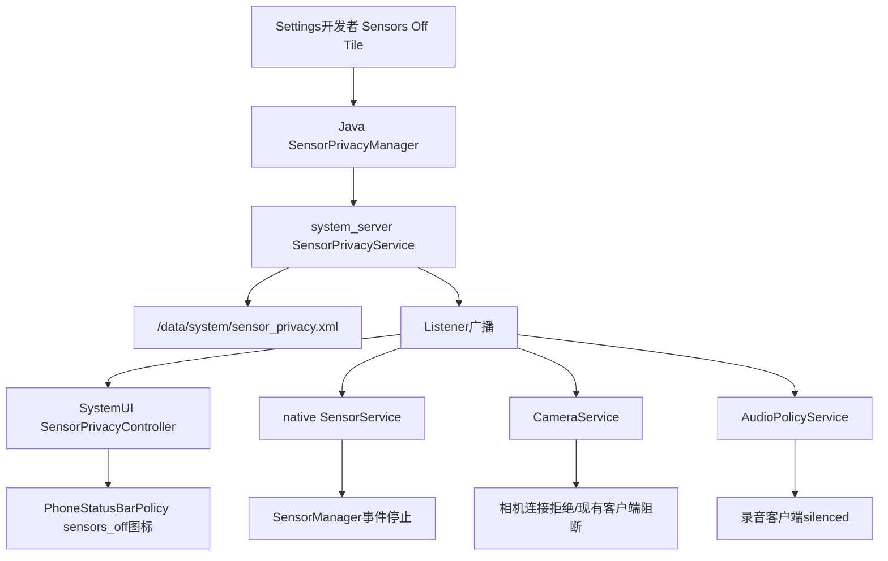
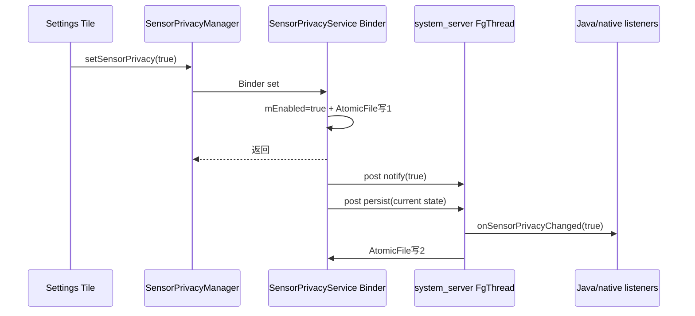
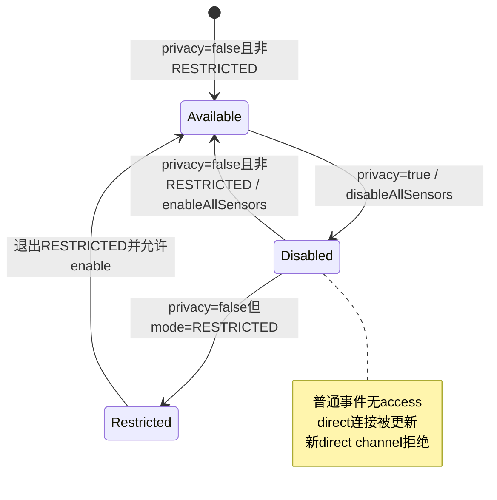

# 第 459 章 Android SystemUI SensorPrivacyController：传感器总开关、持久化、状态栏与数据面封锁链

> 源码基线：Android 11 / API 30 / `android-11.0.0_r48`。本章只在 macOS 阅读，不实际编译。核心文件：SystemUI `SensorPrivacyController.java`、`SensorPrivacyControllerImpl.java`、`PhoneStatusBarPolicy.java`，framework `SensorPrivacyManager.java`，system_server `SensorPrivacyService.java`，以及native `SensorPrivacyManager.cpp`、SensorService、CameraService、AudioPolicyService和Settings开发者快捷开关。不要把它与第457—458章“哪些应用正在使用资源”的AppOps/PrivacyItem链混为一谈。

## 1. 本章解决什么问题

“Sensors off”到底关了什么？SystemUI怎样显示总开关状态？真正阻止Camera、录音与SensorManager数据的是谁？开关怎样持久化、跨Binder通知，又有哪些r48实现缺口？

## 2. 一句话主线

拥有MANAGE_SENSOR_PRIVACY权限的Settings开发者Tile调用SensorPrivacyManager→system_server SensorPrivacyService设置一个全局boolean并通知监听者；SensorService、CameraService和AudioPolicyService据此停传感器、阻止/断开相机并静音录音，SystemUI薄Controller只缓存boolean并让PhoneStatusBarPolicy显示`sensors off`图标。

## 3. enabled 的反直觉语义

`sensor privacy enabled=true`表示隐私保护开启，也就是传感器被关闭；状态栏图标可见。不能把enabled读成“sensor硬件enabled”。

## 4. 与PrivacyItem的根本区别

PrivacyItem是使用事实：“某应用正在/近期使用相机、麦克风、位置”；SensorPrivacy是设备政策：“拒绝/静音整机敏感传感器”。前者可有应用维度，后者r48只有全局boolean。

## 5. r48不是每传感器单独开关

接口没有CAMERA/MICROPHONE sensor id，只有 `setSensorPrivacy(boolean)`。后续Android的单独mic/camera toggles不能反向套用到此处。

## 6. 总体架构



## 7. 进程边界

Settings Tile在Settings进程，SensorPrivacyService在system_server，SystemUI Controller在主SystemUI进程；SensorService、cameraserver和audioserver是native服务进程。一次开关会沿同一Binder服务扇出到四个消费者。

## 8. 线程边界

set Binder入口在system_server Binder线程同步写文件；Service再向FgThread Handler发回调/持久化消息。Java和native listener通过oneway Binder收到；SystemUI Controller在Binder线程更新并同步调用本地listeners，PhoneStatusBarPolicy再post主Handler改图标。

## 9. SystemServer启动顺序

SystemServer先同步start SensorPrivacyService并publish `sensor_privacy` Binder，稍后才在线程池启动SensorService。这样native SensorService注册时通常能读到服务；native manager否则会轮询等待。

## 10. Java Manager是隐藏系统API

`@SystemService(Context.SENSOR_PRIVACY_SERVICE)`且类/接口隐藏；普通应用不能使用。set方法还要求MANAGE_SENSOR_PRIVACY，查询/监听接口本身没有同等setter权限门。

## 11. Java Manager单例

静态sInstance在全进程只构造一次，通过ServiceManager.getServiceOrThrow取得Binder。保存首次Context但后续没使用；若错误传短生命周期Context会被单例引用，不过系统服务通常从长期Context取得。

## 12. Manager的监听映射

`ArrayMap<Java listener, ISensorPrivacyListener Stub>`保证同一个Java listener复用同一个Binder Stub。Stub收到boolean后直接调用原listener，不切换executor/Handler。

## 13. 回调线程由Binder决定

ISensorPrivacyListener是oneway AIDL；Java Stub在调用进程Binder线程执行。SensorPrivacyManager没有Executor overload，消费者必须自己转主线程。

## 14. add并非完全幂等

映射中已有listener时虽复用Stub，仍每次调用远端 `addSensorPrivacyListener(iListener)`。system_server会再次创建DeathRecipient并尝试RemoteCallbackList.register；重复调用不是无操作。

## 15. Manager remove的确定性bug

代码以 `mListeners.get(listener)`得到Binder Stub，却写 `mListeners.remove(iListener)`；Map的key是Java listener而不是Stub，所以本地映射删不掉。远端remove仍执行，但Manager永久持有listener/Stub。

## 16. remove bug源码

```java
ISensorPrivacyListener iListener = mListeners.get(listener);
if (iListener != null) {
    // 错：ArrayMap的key是OnSensorPrivacyChangedListener
    mListeners.remove(iListener);
    mService.removeSensorPrivacyListener(iListener);
}
```

## 17. remove后重新add

因为映射残留，重新add会复用旧Stub并再次注册远端；功能可能恢复，但Java listener无法被GC。频繁短生命周期listener会让Manager Map无界增长。

## 18. 服务死亡恢复

Java Manager保存固定Binder代理，没有DeathRecipient或重取/重注册逻辑；system_server通常与调用者共同重启，所以SystemUI场景影响有限，但独立进程面对服务异常会rethrow而非自愈。

## 19. native Manager策略不同

每个native对象缓存service；getService发现null/死Binder就checkService轮询，每25ms一次。它有linkToDeath/unlink接口，CameraService使用，SensorService/AudioPolicy只做普通注册。

## 20. native等待阈值单位

代码以uptime差大于1,000,000才放弃，单位是毫秒，约1000秒而非注释意义上的短超时；while里usleep25ms。服务长期缺失可让调用线程阻塞十六分多钟。

## 21. native查询的fail-open

取不到SensorPrivacyService时 `isSensorPrivacyEnabled()`返回false，假定保护关闭，以保持传感器可用。可用性优先，但服务故障时隐私政策失效。

## 22. system_server状态对象

SensorPrivacyServiceImpl以mLock保护AtomicFile和mEnabled；构造时从 `/data/system/sensor_privacy.xml`读取，然后onStart只发布Binder。没有用户id、sensor id或包维度。

## 23. 全局而非per-user

文件在data/system而非user目录，状态只有一份。一个用户打开Sensors Off会影响整机服务与其他用户；用户切换不会自动恢复各自偏好。

## 24. 缺文件默认false

首次启动没有XML时认为隐私未启用，即传感器正常可用。读取解析失败会删文件并同样fail-open为false。

## 25. 写入协议

set先检查MANAGE_SENSOR_PRIVACY，在锁内立刻赋mEnabled，用AtomicFile startWrite→XML→finishWrite；IOException时failWrite。无论落盘成功与否，内存状态都已改变并继续通知。

## 26. AtomicFile保护什么

它让一次文件替换在崩溃/写失败时尽量保留旧版本，不让半截XML成为正式文件；它不让“内存、三个native服务、SystemUI图标和文件”形成跨进程原子事务。

## 27. 同值也写也通知

set没有 `if (mEnabled==enable)return`。重复点击/调用同值仍写文件、post回调并让所有消费者重复执行disable/enable政策。

## 28. 一次set写两遍

Binder入口已经同步持久化；随后 `mHandler.onSensorPrivacyChanged`又排一个persistSensorPrivacyState消息。因此每次toggle正常会写AtomicFile两次，是明显的重复I/O。

## 29. 两次写的时序

第一次完成后才post；FgThread先处理listener广播，再处理第二次persist。快速连续开关时后置任务读取执行时的当前mEnabled，所以旧消息通常也写最新值，不会简单回滚，但会放大I/O。

## 30. set主链时序



## 31. 第一次写失败会怎样

仍返回正常、通知true；第二次异步persist可能成功，相当于自动重试。若两次都失败，本轮运行的服务/图标认为true，重启后文件旧值或无文件，状态反转。

## 32. 读取实现的关键bug

`XmlUtils.beginDocument`返回时parser已停在根START_TAG；代码却又 `parser.next()`，再从新位置读根的enabled attribute。无子内容的XML下一步通常是END_TAG，属性为null，`Boolean.valueOf(null)`得到false。

## 33. 重启恢复后果

即使文件写着enabled="true"，r48读取路径也大概率恢复为false且不报解析异常；文件不会被删。于是Sensors Off可能无法跨system_server重启/开机保持，必须以这段源码而非“有AtomicFile”推断持久性。

## 34. 读取bug源码

```java
XmlUtils.beginDocument(parser, XML_TAG_SENSOR_PRIVACY);
// 此刻就在根START_TAG
parser.next();
String tagName = parser.getName(); // 变量随后未使用
boolean enabled = Boolean.valueOf(
        parser.getAttributeValue(null, XML_ATTRIBUTE_ENABLED));
```

## 35. 正确读取方向

beginDocument后应直接读attribute，不额外next；再对缺失/非法值显式校验。当前Boolean.valueOf只在字符串忽略大小写等于true时返回true，其余静默false。

## 36. Service listener容器

FgThread Handler持RemoteCallbackList，并额外以ArrayMap记录每个ISensorPrivacyListener对应DeathRecipient。RemoteCallbackList负责广播快照和Binder死亡清理的一部分，手工DeathRecipient又调用remove。

## 37. add远端listener

每次构造新DeathRecipient、put到Map并RemoteCallbackList.register。没有检查已有同Binder；重复add会覆盖Map中的旧DeathRecipient却不destroy它，旧death link泄漏。

## 38. RemoteCallbackList重复注册

同一Binder第二次register通常返回false，不会重复广播；但代码忽略返回值，前述新DeathRecipient仍已link/覆盖。功能去重不等于资源无泄漏。

## 39. remove远端listener

从Map remove当前DeathRecipient并unlink，然后RemoteCallbackList.unregister。被重复add覆盖掉的更早DeathRecipient找不到，无法unlink。

## 40. 服务端不回放初值

addListener只登记，不立即调用当前mEnabled。每个消费者必须先同步isSensorPrivacyEnabled，再add listener；查询和注册之间仍有状态变化窗口。

## 41. 查询—注册竞态

若状态在“query返回false”和“listener注册完成”之间切到true，切换回调可能在listener未登记时广播掉，消费者永久保留false直到下次变化。Camera注册顺序甚至是先add再query，另有反向窗口。

## 42. 可靠订阅模式

服务端add应在同一锁登记并回放当前generation，或提供原子 `registerAndGetState`；消费者收到带版本状态后只接受更新代际，避免query/register二步缝隙。

## 43. FgThread广播

handle beginBroadcast，逐个oneway调用，RemoteException只记日志，最后finishBroadcast。没有过滤相同值，也没有按消费者线程分流。

## 44. listener死亡

DeathRecipient.binderDied回调Service remove；若linkToDeath一开始RemoteException被空catch，仍可能把死亡listener放入Map/RemoteCallbackList，缺少日志和回滚。

## 45. SystemUI Controller有多薄

构造取得SensorPrivacyManager，同步读boolean、注册自身listener并创建本地ArrayList；之后只缓存状态、管理本地callback。它不提供set、用户处理、dump或数据面控制。

## 46. 构造顺序窗口

源码在Manager.add之后才 `mListeners=new ArrayList`。Service不回放所以通常安全；但注册成功后恰逢状态切换，Binder callback可能在赋值前进入onSensorPrivacyChanged并解引用null列表。

## 47. 正确构造顺序

应先初始化lock/list，再查询/注册；最好用原子订阅API闭合查询竞态。final字段在构造完成前也能更清楚保证可见性。

## 48. Controller本地锁

mSensorPrivacyEnabled和listeners都由mLock保护；is读取加锁，add/remove/上游callback也加锁。mLock不是final但从不替换，功能可用、表达不严谨。

## 49. add立即回放

本地add把listener加入后在同一锁内立即以缓存值callback。PhoneStatusBarPolicy因此不用另外query也能获得初值；但它实际上先query设图标、后add又收到一次相同值。

## 50. 本地listener允许重复

ArrayList.add不去重。同对象add两次会立即回放两次，未来每次状态也通知两次；remove只删除第一个匹配，仍残留一份。

## 51. 持锁调用外部代码

notifyListenerLocked直接执行listener。listener可耗时、抛异常或重入Controller；所有读写在此期间被锁住，Binder回调也被拖慢。

## 52. 自移除可能崩遍历

onSensorPrivacyChanged用enhanced-for遍历ArrayList且持可重入锁；listener回调内remove自己会改变modCount，下一次iterator检查可能ConcurrentModificationException。锁不能阻止同线程重入修改。

## 53. listener异常传播

没有try/catch；一个listener抛RuntimeException会阻断后续listener并从SystemUI的Binder Stub返回异常。若发生在主线程add的立即回放，也可直接使初始化失败。

## 54. 相同值仍通知

Controller不比较旧值；服务每次同值set都会遍历所有本地listeners。PhoneStatusBarPolicy只是重复set icon visibility，其他消费者可能做昂贵工作。

## 55. Controller无法注销上游

单例构造后永久向Manager注册，类没有destroy；SystemUI进程生命周期内合理。但Manager remove bug意味着即使未来加destroy，本地Java listener引用也仍会泄漏，需两层一起修。

## 56. SystemUI回调源码

```java
public void onSensorPrivacyChanged(boolean enabled) {
    synchronized (mLock) {
        mSensorPrivacyEnabled = enabled;
        for (OnSensorPrivacyChangedListener listener : mListeners) {
            listener.onSensorPrivacyChanged(mSensorPrivacyEnabled);
        }
    }
}
```

## 57. PhoneStatusBarPolicy初始化

先为`sensors off` slot设置图标和无障碍描述，以Controller同步查询决定初始visibility；稍后add SensorPrivacy listener，add立即回放同值。

## 58. 为什么Policy再post Handler

Controller listener可能在Binder线程或add调用线程；Policy统一 `mHandler.post`到主线程调用StatusBarIconController，遵守UI/图标账线程归属。

## 59. 初始重复更新

构造的同步setVisibility与add回放后post的setVisibility通常值相同，产生一次冗余主线程消息。换来的是即使初始化和订阅间变化，回放仍有机会覆盖初值，但并未彻底消除query/register竞态。

## 60. 图标只表达总开关

slot `sensors_off`不列应用、不说明是哪类传感器，也不代表当前有访问；只要global privacy true就常驻。它与camera/mic/location active icons可在政策切换时出现短暂交错。

## 61. SystemUI没有切换Tile

全库搜索SystemUI没有调用setSensorPrivacy；真正的r48切换入口在Settings开发者选项的DevelopmentTiles.SensorsOff TileService。SystemUI只显示状态栏图标。

## 62. 为什么strings仍在SystemUI

SystemUI有`sensor_privacy_mode`和开关无障碍字符串资源，但本分支没有对应QSTile实现，可能是迁移/实验残留。看到文案不能推断Tile类存在。

## 63. Settings Tile生命周期

onCreate取得Manager、查询初值、取Metrics/Keyguard；setIsEnabled更新本地mIsEnabled、记录metrics并调用Manager。它没有注册SensorPrivacy listener，外部变化时Tile本地状态可能陈旧直到重建/刷新。

## 64. 锁屏保护方向

若当前Sensors Off已开启且Keyguard locked，Tile拒绝把它关闭，即不允许在锁屏重新启用传感器；当前关闭时仍允许在锁屏进一步关闭，符合隐私单向收紧。

## 65. Tile乐观状态

先写本地mIsEnabled再Binder set；RemoteException会由Manager rethrow，代码无rollback。UI Tile可能短暂显示新状态而服务调用失败。

## 66. 数据面一：SensorService

native SensorPrivacyPolicy启动时查询初值并注册listener；true时disableAllSensors，false时在非RESTRICTED模式enableAllSensors。事件连接的hasSensorAccess也现场要求privacy false。

## 67. 已有SensorManager连接

enable→privacy时SensorDevice禁用全部传感器、清pending flush connections，普通event connection不再有access；DirectConnection收到onSensorAccessChanged。不是只阻止新注册。

## 68. 重新开启传感器

privacy false调用enableAllSensors，恢复硬件与direct connections，但若SensorService正处RESTRICTED模式就拒绝。总开关不是唯一门，还受UID活跃、op restriction和operating mode约束。

## 69. 新direct channel

privacy true时createSensorDirectConnection直接返回nullptr，避免绕普通事件连接取数据。关闭后客户端通常需重新创建/配置。

## 70. SensorService状态图



## 71. 数据面二：CameraService

新connect在权限/UID检查后若privacy true返回ERROR_DISABLED；状态变化为true时listener调用blockAllClients，主动阻断已有相机客户端。

## 72. Camera恢复语义

false回调只更新boolean，不主动重连此前被block的客户端；应用必须重新open。隐私关闭是允许未来访问，不是恢复旧会话事务。

## 73. Camera服务死亡处理

Camera policy给SensorPrivacyService Binder linkToDeath；死亡时只设mRegistered=false，片段中没有立即重连。后续CameraService生命周期路径可能再次register，故障窗口仍需诊断。

## 74. Camera注册顺序

先add listener，再isEnabled查询，避免query后漏掉开启事件，却可能发生“回调写true后查询读旧/新值覆盖”的交错；没有generation仍不是原子快照。

## 75. 数据面三：AudioPolicyService

录音UID状态重算开头若privacy true直接 `silenceAllRecordings_l()`并return；listener变化调用updateUidStates，使所有active AudioRecord客户端切为silenced，而不是一定关闭AudioRecord对象。

```cpp
// AudioPolicyService::updateUidStates_l()中的最高优先级门
if (mSensorPrivacyPolicy->isSensorPrivacyEnabled()) {
    silenceAllRecordings_l();
    return;
}

// SensorService创建direct connection时也现场拒绝
if (mSensorPrivacyPolicy->isSensorPrivacyEnabled()) {
    ALOGE("Cannot create new direct connections when sensor privacy is enabled");
    return nullptr;
}
```

## 76. Audio恢复语义

false后updateUidStates重新按前台、敏感度、通话、助手等既有政策选可录客户端，符合条件者可解除silenced。并非所有录音无条件恢复声音。

## 77. 与AppOps mic silenced衔接

第457章AppOpsController监听AudioRecordingConfiguration.isClientSilenced；Sensors Off让AudioPolicy静音后，SystemUI会把OP_RECORD_AUDIO active item过滤掉。因此“总开关图标出现”和“正在录音图标消失”可形成跨层联动。

## 78. 三个数据面并非同一事务

Service依次oneway通知listeners，各进程调度不同；Camera可能先block、Audio稍后silence、SensorService再disable。短窗口内状态不一致，UI boolean回调也不证明所有硬件动作已ACK。

## 79. 回调没有完成确认

ISensorPrivacyListener只传enabled，无成功/失败返回；system_server不等待每个消费者真正完成封锁并汇总。安全依赖各服务把boolean作为本地访问门，而不只依赖一次动作。

## 80. 为什么现场访问门重要

Camera每次connect、SensorService每次access/direct创建都会查policy；即使初次disable动作丢失，后续入口仍拒绝。Audio也在状态重算中优先检查；持续会话动作仍要靠listener触发。

## 81. 不应声称关闭GPS定位

源码明确覆盖CameraService、AudioPolicy录音与SensorService管理的传感器；GNSS/网络定位有独立服务和政策。本章不把“all sensors”文案外推成所有位置来源都关闭。

## 82. 不应声称关闭生物认证

Fingerprint/Face认证服务不在本章搜索到的SensorPrivacy消费链；CameraService阻断普通相机不等于Face HAL认证一定受控。结论必须限定源码证据。

## 83. 权限边界

只有set强制MANAGE_SENSOR_PRIVACY；system_server用checkCallingOrSelfPermission。Settings系统应用具备能力，普通应用即使拿到隐藏API也会SecurityException。

## 84. Binder身份

permission检查发生在SensorPrivacyService Binder线程，使用原调用者身份；写文件与状态更新仍在system_server权限域。Handler后续持久化/通知已不需要调用者身份。

## 85. 文件权限与用户体验

AtomicFile位于/data/system，普通应用不可读；用户通过Tile和状态栏图标观察。文件存在不等于解析成功，第32节的parser位置必须核验。

## 86. 无dumpsys实现

SensorPrivacyService Stub未覆写dump，SystemUI Controller也非Dumpable。诊断要组合status icon、SensorService/Camera/Audio dumps、logcat和受权限保护的文件，而非期待统一`sensor_privacy` dump。

## 87. SensorService dump

native SensorService dump/proto包含sensor privacy enabled，可证明其本地policy；它与system_server mEnabled、Camera/Audio本地bool可能在事件传播窗口不同。

## 88. 日志缺口

SystemUI Controller无日志；Service持久化失败才log，正常set/listener不记EventLog；native消费者有部分ALOG。跨四进程复原切换时序较困难。

## 89. 单元测试缺口

本地SystemUI tests没有SensorPrivacyController专用测试，也未找到Service XML round-trip测试。重复listener、自移除、构造竞态、Manager remove key错误和重启恢复bug没有安全网。

## 90. 代码审查为何能发现持久化bug

无需编译：对照XmlUtils.beginDocument契约与read函数下一行parser.next即可证明读取位置错开；再看serializer把enabled放在根attribute。跨文件契约比方法名“readPersisted”更可靠。

## 91. 典型故障：重启后Sensors Off消失

先读/推演sensor_privacy.xml根attribute，再检查beginDocument后多余next；同时查解析异常日志和文件是否被删。不要只看写入时finishWrite成功。

## 92. 典型故障：图标开但相机短暂还能用

确认SystemUI收到boolean的时间、CameraService listener本地bool和blockAllClients是否执行；图标是政策通知，不是Camera完成ACK。新connect现场门最终应拒绝。

## 93. 典型故障：图标关但录音仍静音

Audio恢复还受UID状态、通话、敏感录音、权限等政策；Sensors Off false只移除最上层强制静音。查AudioRecordingConfiguration和AudioPolicy，而非反复切图标。

## 94. 典型故障：listener移除后仍泄漏

Java Manager远端确实unregister，功能回调可能停止；但本地Map因remove(iListener)键类型错误仍持原Java listener。内存泄漏与回调停止可以同时成立。

## 95. 典型故障：callback中remove崩溃

SystemUI Controller在enhanced-for持锁调用listener；自移除修改ArrayList。用堆栈确认ConcurrentModificationException，不要把synchronized误当成可安全重入迭代。

## 96. 典型故障：状态切换丢一次

重点查消费者query和register之间是否发生set、Service add是否回放（不会）、listener是否已在RemoteCallbackList。下一次变化会“治愈”，但当前状态可能长期错。

## 97. 改进一：Manager生命周期

remove应 `mListeners.remove(listener)`；add仅在新建Stub时远端注册，或明确引用计数；加入service death重连与listener重注册，null/异常路径回滚。

## 98. 改进二：Service原子订阅

提供registerAndGetState或注册后在同一序列回放 `{enabled,generation}`；重复Binder注册幂等且不新建DeathRecipient；remove/死亡统一清RemoteCallbackList与Map。

## 99. 改进三：持久化

删除同步/异步双写之一，beginDocument后直接读attribute，增加true/false round-trip、坏XML、I/O失败和快速toggle测试；明确落盘失败是否应该回滚内存/向调用者报告。

## 100. 改进四：SystemUI callbacks

先初始化列表再注册；本地listeners用Set或CopyOnWriteArrayList/锁内快照、锁外通知，支持自移除；相同值不重复分发，并允许指定Executor。

## 101. 改进五：可观测性

Service dump输出内存状态、文件解析值、listener数和generation；SystemUI dump输出缓存/listener数；三个native服务输出本地状态和最后callback时间，便于发现传播不一致。

## 102. 改进六：完成语义

若产品需要强安全确认，可让关键数据面报告应用政策完成，再决定UI“已关闭”状态；至少区分requested与effective。r48仅是最终一致boolean扇出。

## 103. 源码阅读顺序

从SystemUI Controller/PhonePolicy理解显示，再读Java Manager的Stub映射，接着读Service set/read/listener，最后到Sensor/Camera/Audio三个native policy。反向从图标猜硬件行为容易遗漏关键门。

## 104. 四类boolean要分开

system_server mEnabled、SystemUI cached enabled、三个native policy local enabled、Settings Tile mIsEnabled是不同副本。故障时逐个取证，不能因名称相同当成共享内存。

## 105. requested与effective

Tile本地值是用户请求，Service值是政策事实，native本地值是已收到政策，硬件/客户端是否已停是effective结果。r48没有统一ACK把四者收敛成强一致。

## 106. “全部传感器”的准确说法

产品文案和注释意图覆盖camera、microphone与SensorManager sensors；本地代码证实三个服务消费。对GNSS、蓝牙扫描、指纹/人脸等不在链中的数据源不作扩大结论。

## 107. 与AppOps的交叉

Sensors Off不通过AppOps撤销应用权限或删除active账；它在数据服务层拒绝/静音。AppOps/Audio配置随后可能让“正在使用”投影消失，但身份账和政策账仍是两条链。

## 108. 与权限的交叉

应用CAMERA/RECORD_AUDIO/BODY_SENSORS权限保持授予；关闭总开关后调用被统一阻断。重新开启无需重新请求运行时权限，但原会话未必自动恢复。

## 109. 与多用户的交叉

setter调用者和状态栏属于当前交互环境，服务状态却global；状态文件不按用户拆分，native数据面也整机执行。企业多用户政策应额外审查谁可见/可切该开发Tile。

## 110. 与锁屏的交叉

Settings Tile只阻止在锁屏从“off sensors”切回“on sensors”，不是Service安全门；拥有MANAGE_SENSOR_PRIVACY的其他调用者仍可set。真正授权由permission，不由Tile UI判断。

## 111. 本章检查清单

遇到问题依次问：谁发set、permission通过吗、system_server内存/文件各是什么、listener已注册吗、SystemUI与三个native副本是什么、现有连接是否已block/silence/disable、状态栏只是请求还是有效结果？

## 112. macOS 只读练习一：证明读取错位

并排阅读SensorPrivacyService的serializer/read函数与XmlUtils.beginDocument；画parser位于START_TAG、执行next到END_TAG、getAttributeValue返回null的步骤，说明为什么Boolean.valueOf得到false。

## 113. macOS 只读练习二：追一次开启

从Settings `DevelopmentTiles.SensorsOff.setIsEnabled(true)`追Java Manager、Service两次写/FgThread广播，再分别到SystemUI、SensorService、CameraService和AudioPolicyService，标出每次进程/线程切换。

## 114. macOS 只读练习三：审计listener生命周期

手算“同Java listener add两次、remove一次、再add”的Manager Map、远端RemoteCallbackList和DeathRecipient Map；指出哪部分去重、哪部分残留，以及Manager remove为何删错key。

## 115. macOS 只读练习四：区分三种恢复

只读推演privacy true→false后：SensorManager普通/Direct连接、已block Camera客户端、被silence AudioRecord各自是否自动恢复；把源码证明与需要客户端重试的部分分开。

## 116. 最容易误解的一点

SensorPrivacy enabled不是“传感器开启”，而是“Sensors Off保护开启”。SystemUI显示的是政策boolean，不是逐硬件关闭完成确认。

## 117. 第二个易错点

有AtomicFile不等于可恢复：r48写根attribute正确，读却在beginDocument后多走一步，true在重启时会静默读成false。

## 118. 第三个易错点

Controller有synchronized不等于listener安全；它持锁调用外部代码并直接遍历可变ArrayList，自移除/异常/耗时都能破坏分发。

## 119. 本章结论

r48以一个global boolean高效扇出到Sensor、Camera、Audio和SystemUI，数据服务也设置现场访问门而非只做UI；薄弱处集中在查询注册竞态、重复DeathRecipient、Java remove键错误、SystemUI持锁回调，以及最严重的XML读取错位和同步/异步双重持久化。

## 120. 下一章预告

下一章研究 LocationControllerImpl：位置总开关、活跃高功耗请求、AppOps位置使用、用户限制和状态栏location图标怎样协作，并与本章Sensors Off不覆盖GNSS的边界对照。
