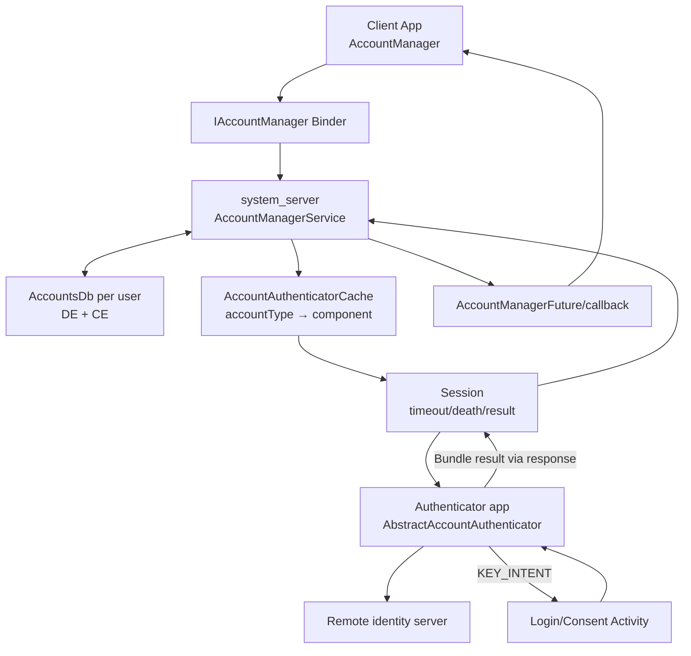
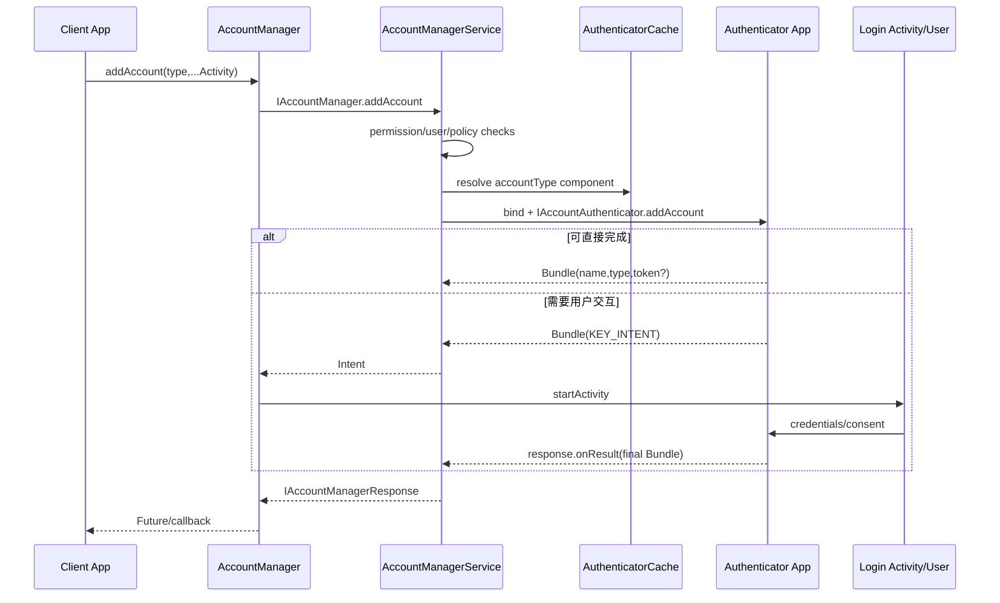
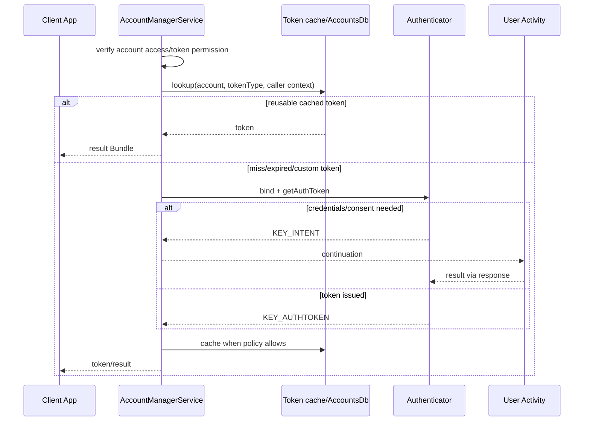

# 46 Android AccountManagerService、Authenticator 与认证令牌

> 源码版本：Android 11 / API 30 / `android-11.0.0_r48`  
> 学习方式：macOS 只读源码，不要求编译  
> 前置章节：[13 PMS](./13-PackageManagerService包管理与APK安装.md)、[23 权限](./23-Android权限AppOps与SELinux.md)、[45 账户同步](./45-Android账户同步SyncManagerSyncStorageEngine与SyncAdapter.md)

AccountManager 是账户身份与认证协调框架，不是远端 OAuth 服务器。system_server 保存按用户隔离的账户元数据和部分凭据，按 accountType 绑定 Authenticator 应用；具体登录页面、密码/token 换取、刷新和服务端协议由 Authenticator 实现。

---

## 1. 四个对象不要混淆

| 对象 | 含义 |
|---|---|
| `Account(name, type)` | 账户的轻量标识，不包含密码/token |
| 系统账户记录 | 每用户数据库中的账户、extras、visibility、grants 等 |
| Authenticator | 某 accountType 的认证插件 Service |
| auth token | 特定 account + tokenType + caller 场景下的短期访问凭据 |

远端登录 session/cookie 又是服务端概念，不等于 Android Account 对象。

---

## 2. 总体架构



一项 API 可能一次 Binder 往返就完成，也可能跨用户 UI 后再延续 Session。

---

## 3. Android 11 核心源码

```text
frameworks/base/core/java/android/accounts/Account.java
frameworks/base/core/java/android/accounts/AccountManager.java
frameworks/base/core/java/android/accounts/IAccountManager.aidl
frameworks/base/core/java/android/accounts/IAccountManagerResponse.aidl
frameworks/base/core/java/android/accounts/AbstractAccountAuthenticator.java
frameworks/base/core/java/android/accounts/IAccountAuthenticator.aidl
frameworks/base/core/java/android/accounts/IAccountAuthenticatorResponse.aidl
frameworks/base/core/java/android/accounts/AccountAuthenticatorResponse.java
frameworks/base/core/java/android/accounts/AccountAuthenticatorActivity.java
frameworks/base/core/java/android/accounts/AuthenticatorDescription.java
frameworks/base/core/java/android/accounts/ChooseTypeAndAccountActivity.java
frameworks/base/core/java/android/accounts/GrantCredentialsPermissionActivity.java
frameworks/base/services/core/java/com/android/server/accounts/AccountManagerService.java
frameworks/base/services/core/java/com/android/server/accounts/AccountAuthenticatorCache.java
frameworks/base/services/core/java/com/android/server/accounts/AccountsDb.java
```

---

## 4. 进程与线程

- Client AccountManager：调用 App 进程。
- AccountManagerService/AccountsDb：`system_server`。
- Authenticator：声明该 Service 的应用进程。
- Login/consent Activity：Authenticator 或系统 UI 进程。
- 远端认证：Authenticator 的网络线程。

AbstractAccountAuthenticator 的 Binder 方法不会替实现自动切后台线程；耗时网络操作不能阻塞 Binder/main thread，应返回 Intent 或自行异步后通过 response 回报。

---

## 5. Account 只是 name + type

```java
Account account = new Account("alice@example.com", "com.example.account");
```

`name` 是否邮箱由 provider 定义；`type` 用来选择 Authenticator。打印 Account 不会泄露 token，但 name 本身仍可能是隐私数据。

---

## 6. accountType

accountType 是 Authenticator 的命名空间。系统扫描 metadata 建立：

```text
com.example.account → com.example/.AuthenticatorService
```

不是 Java package 必须等于 type，但通常使用反向域名避免冲突。

---

## 7. Authenticator Manifest

```xml
<service
    android:name=".AuthenticatorService"
    android:permission="android.permission.BIND_ACCOUNT_AUTHENTICATOR"
    android:exported="true">
    <intent-filter>
        <action android:name="android.accounts.AccountAuthenticator" />
    </intent-filter>
    <meta-data
        android:name="android.accounts.AccountAuthenticator"
        android:resource="@xml/authenticator" />
</service>
```

signature 绑定权限允许 system_server 调用，同时阻止普通 App 任意绑定认证 Binder。

---

## 8. authenticator XML

```xml
<account-authenticator
    android:accountType="com.example.account"
    android:label="@string/account_label"
    android:icon="@drawable/ic_account"
    android:smallIcon="@drawable/ic_account_small"
    android:accountPreferences="@xml/account_preferences" />
```

metadata 描述类型和 UI 资源，不包含用户密码或服务器 client secret。

---

## 9. AccountAuthenticatorCache

基于 RegisteredServicesCache 扫描每用户 Authenticator Service，校验 metadata 并缓存 `AuthenticatorDescription → ServiceInfo`。

包安装、更新、删除会刷新。若原 accountType 的 Authenticator 消失，AccountManagerService 会验证并清理/标记相关账户。

---

## 10. AccountsDb

Android 11 每用户账户数据库拆分设备加密 DE 与凭据加密 CE 数据：

- DE：锁屏前可用的账户标识、visibility、grants 等必要信息。
- CE：解锁后才能访问的密码、auth token、extras 等敏感信息。

具体表结构以 `AccountsDb` 为准。user locked 时能枚举部分 Account 不等于能取 token。

---

## 11. 为什么分 DE/CE

Direct Boot 期间系统服务可能需要知道账户存在，但密码/token 应受用户凭据保护。解锁后通过关联 ID 合并 CE 信息。

这也是“开机后账户可见但同步需解锁”的原因之一。

---

## 12. UserAccounts

AccountManagerService 为每个 user 维护 UserAccounts：数据库、account cache、userData cache、authToken cache、visibility cache 和各类锁。

同名同类型账户在不同 user/profile 完全隔离。

---

## 13. addAccount 入口

```java
accountManager.addAccount(
        "com.example.account",
        "full_access",
        null,
        options,
        activity,
        callback,
        handler);
```

返回 `AccountManagerFuture<Bundle>`。如果需要 UI，结果 Bundle 先包含 `KEY_INTENT`，AccountManager 帮助启动 Activity，最终结果再完成 Future。

---

## 14. addAccount 主链



---

## 15. AccountManagerFuture

Future 代表异步结果，不应在主线程调用阻塞 `getResult()`。带 Activity 的任务基类会识别 KEY_INTENT 并启动 UI，Session 暂不关闭。

取消 Future 会通知服务/忽略结果，但不能自动撤回已发给远端的登录请求。

---

## 16. Bundle 协议

Authenticator 典型返回：

```text
KEY_ACCOUNT_NAME
KEY_ACCOUNT_TYPE
KEY_AUTHTOKEN
KEY_INTENT
KEY_BOOLEAN_RESULT
KEY_ERROR_CODE / KEY_ERROR_MESSAGE
```

Bundle 是 tagged union 风格协议：不同 API/阶段要求的字段不同。KEY_INTENT 与 final account/token 不能被一概当作同时存在。

---

## 17. Session

AccountManagerService 内部 Session：

- 继承 IAccountAuthenticatorResponse Stub。
- 记录 accountType、caller、user、是否期待 Activity。
- bind/unbind Authenticator。
- link caller/authenticator death。
- 超时清理。
- 统计结果/错误/Intent 次数。
- 把 Bundle 转交 client response。

它协调一次 API 会话，不是远端 OAuth session。

---

## 18. bindToAuthenticator

Session 通过 cache 找到 component，`bindServiceAsUser()` 启动 Authenticator；连接后保存 IAccountAuthenticator 并调用子类 `run()`。

失败原因包括 accountType 无 provider、component disabled、user stopped、进程启动失败、权限/签名 metadata 异常。

---

## 19. Session 生命周期

```text
create/register in active sessions
 → bind authenticator
 → run remote method
 → receive onResult/onError or KEY_INTENT continuation
 → close: remove timeout, unlink death, unbind, remove session
```

若 expectActivityLaunch 且返回 Intent，不能过早 close，否则 Activity 无法经 response 完成原请求。

---

## 20. 超时与死亡

Client Binder 死亡、Authenticator Binder 死亡或 timeout 都会关闭 Session，避免 system_server 永久持有连接。用户在登录 UI 停留时是否延长/保留取决于 Session 协议。

Authenticator 必须确保所有路径最终 onResult/onError，或返回合法 continuation Intent。

---

## 21. AbstractAccountAuthenticator

它提供 Transport Binder Stub，负责：

- enforce caller 是 AccountManagerService/system UID。
- 参数日志与异常转换。
- 把 IAccountAuthenticatorResponse 包装成 AccountAuthenticatorResponse。
- 调用开发者覆写的 addAccount/getAuthToken/confirmCredentials 等。

它不实现具体账号密码协议。

---

## 22. Authenticator 方法

主要抽象/可覆写方法：

- addAccount。
- confirmCredentials。
- getAuthToken。
- getAuthTokenLabel。
- updateCredentials。
- hasFeatures。
- editProperties。
- start/finish session。
- isCredentialsUpdateSuggested。

每个方法都通过 Bundle/response 支持直接完成或用户交互。

---

## 23. AccountAuthenticatorActivity

Authenticator 登录 Activity 可持有 `AccountAuthenticatorResponse`。完成时设置 result Bundle，Activity finish 后调用 response.onResult；取消则 onError/canceled。

只调用 Activity `setResult(RESULT_OK)` 不足以完成 AccountManager Session，必须遵守 Authenticator response 协议。

---

## 24. 添加账户到数据库

Authenticator 登录成功后通常调用 `AccountManager.addAccountExplicitly(account, password, userdata)`，或通过 addAccount final result 让流程完成。服务校验 caller 是否为该 accountType Authenticator/有管理资格。

远端注册成功与本地 DB insert 是两个提交点；失败补偿需业务设计。

---

## 25. addAccountExplicitly

它直接添加本地 Account 记录，不自动展示登录 UI、验证密码或向远端注册。只有 Authenticator/系统合规 caller 能管理对应类型。

返回 true 只说明本地添加成功，不证明远端凭据有效。

---

## 26. 密码存储

`setPassword/getPassword` 面向 Authenticator，敏感值存 CE DB，用户解锁前不可用。很多现代认证不保存长期密码，而保存 refresh credential 或由 Keystore/服务器机制管理。

普通 App 不应能读取其他类型账户密码。

---

## 27. userData

key/value extras 用于 Authenticator 的账户元数据，例如 server ID；它不是任意 App 公共偏好存储。读写权限受 accountType ownership 和访问规则限制。

敏感大对象不适合塞入 userData。

---

## 28. getAuthToken 入口

```java
accountManager.getAuthToken(
        account, "full_access", options,
        activity, callback, handler);
```

tokenType 由 Authenticator 定义，例如 read-only/full-access。它不是 Android 固定 OAuth scope，但实现可映射到 scope/audience。

---

## 29. getAuthToken 主链



---

## 30. 当前源码缓存快路径

AccountManagerService 在允许缓存的 token 模式下先读数据库：

```java
String authToken = readAuthTokenInternal(accounts, account, authTokenType);
if (authToken != null) {
    Bundle result = new Bundle();
    result.putString(AccountManager.KEY_AUTHTOKEN, authToken);
    result.putString(AccountManager.KEY_ACCOUNT_NAME, account.name);
    result.putString(AccountManager.KEY_ACCOUNT_TYPE, account.type);
    response.onResult(result);
    return;
}
```

这是裁剪后的快路径；完整代码在此前做 caller、visibility、permission、customTokens 等判断。

---

## 31. cache miss

服务创建 GetAuthToken Session，绑定 Authenticator 并调用：

```java
mAuthenticator.getAuthToken(
        this, account, authTokenType, loginOptions);
```

Authenticator 可返回 token、Intent 或错误。服务会校验返回的 account name/type/token，并按策略写 cache。

---

## 32. customTokens

Authenticator metadata 可声明 customTokens。此时 token 可能依赖 caller package/signature、具有自定义有效期和 cache 行为，AccountManagerService 不按普通 DB token 方式共享。

同一 account/tokenType 不保证不同 caller 得到相同 token。

---

## 33. tokenType

token cache key 至少关联 account 和 authTokenType；custom token 还关联 package/signature digest 等上下文。一个账户可同时有多个 token。

注销 full-access token 不应误以为所有 tokenType 都自动失效，除非 Authenticator/服务端这样实现。

---

## 34. invalidateAuthToken

客户端/Authenticator发现远端返回 401 时，可 invalidate 指定 accountType/token value。AccountManagerService 移除匹配缓存；下次 getAuthToken 再找 Authenticator。

invalidate 本地 cache 不自动撤销远端 token；远端 revocation 要调用服务端协议。

---

## 35. token 过期

普通 cache 可能不知道 JWT/OAuth token 内部 exp；Authenticator 应控制缓存策略、收到 401 后刷新，或使用 custom token expiry 支持。

系统 cache 命中只表示本地有字符串，不保证服务端仍接受。

---

## 36. auth token 权限

AccountManagerService 综合：

- caller 是否拥有/签名匹配 Authenticator。
- account visibility/access。
- tokenType grant。
- package UID/签名。
- user/profile policy。
- target SDK 与历史权限模型。

知道 Account name/type 不等于有权取 token。

---

## 37. Account visibility

Android 为每账户按 package 管理 visibility，例如 visible、user-managed visible/not-visible 等。`getAccounts()` 结果会按 caller 过滤。

账户确实存在但某 App 列表为空，可能是 visibility/access，而非 DB 丢失。

---

## 38. hasAccountAccess

检查 package/UID 是否可访问特定 Account，考虑 signature、visibility、grants 和特殊系统角色。调用时还必须验证 packageName 属于 calling UID，防止冒充其他包查询。

访问账户标识和获取特定 auth token 仍是不同权限层。

---

## 39. 用户授权 UI

历史 token permission 模型可通过 GrantCredentialsPermissionActivity 让用户授权某 App 使用账户/tokenType。现代 visibility/target SDK 规则也参与。

系统 UI 不能由 Authenticator 自画相同界面替代，因为 grant 要写入 AccountManagerService 管理的权限记录。

---

## 40. caller package 与 signature

options 常加入 caller package、UID、PID、signature digest 等，Authenticator 可据此签发 audience/权限不同的 custom token。

Authenticator 不应盲目信任客户端自己传入的 package 字符串，应使用 system_server 注入/验证的 caller 信息。

---

## 41. KEY_INTENT 安全检查

Authenticator 返回 Intent 时，AccountManagerService 会校验目标 Activity/signature/允许性，避免恶意 Authenticator 借 system flow 启动任意不可信组件或权限提升。

Intent 是 continuation，不等于调用成功。

---

## 42. notifyAuthFailure

某些 getAuthToken API 可要求认证失败通知。系统可能展示“需要登录”通知，点击进入 Authenticator Intent。

通知出现证明需要用户操作，不证明账户已被删除。

---

## 43. choose account 流程

`newChooseAccountIntent`/ChooseTypeAndAccountActivity 先按 caller 可见性、allowed accounts/types、user restriction 过滤，再让用户选或添加。

选择结果 Account 不附带 token；客户端还需单独 getAuthToken。

---

## 44. account access request

App 可请求访问某账户，系统决定是否展示授权 UI并写 visibility/grant。用户同意访问账户身份不自动授予所有 tokenType 和远端 scope。

权限要按最小范围设计。

---

## 45. start/finish session API

startAddAccountSession/startUpdateCredentialsSession 可先由 Authenticator 生成 sessionBundle，再在另一阶段 finishSession。适合设备间设置/受管流程或跨 UI 阶段延续。

sessionBundle 可能含敏感状态，AccountManagerService 会加密/封装并校验来源，客户端不应修改内部字段。

---

## 46. 密钥与 session bundle

服务对 session bundle 使用系统管理的加密机制，使调用者不能伪造 accountType/session 内容。finish 时解密并确认调用 package/UID 等上下文。

它是 Android 本地流程保护，不替代远端 TLS/OAuth state/PKCE。

---

## 47. removeAccount

移除需权限/Authenticator/用户交互，成功后：

- 删除 DE/CE 账户及 token/extras/grants。
- 更新 cache/visibility。
- 通知账户变化。
- 同步/Provider 等组件响应清理。

本地移除不必然删除远端账户或撤销所有远端 session。

---

## 48. Authenticator getAccountRemovalAllowed

系统可询问 Authenticator 是否允许移除，Authenticator 可返回 boolean 或 Intent 要求确认。最终 DB 删除仍由 AccountManagerService 负责。

Authenticator 不应自行直接篡改系统账户 DB。

---

## 49. renameAccount

重命名更新账户标识及关联数据/cache，并保留 previous name 兼容信息。远端用户名变化与本地 Account.name 更新需业务协调。

由于 Account 用 name+type 比较，旧对象可能不再匹配新账户。

---

## 50. validateAccountsInternal

服务在启动、包变化等时校验数据库账户对应的 Authenticator UID/type 是否仍可信。Authenticator 被卸载或 UID/signature 变化时清理不再合法的账户，防止新安装 App 接管旧类型秘密。

这是 package identity 与账户安全的重要连接点。

---

## 51. 签名变化风险

如果 accountType provider 被卸载后恶意 App 用相同 type 安装，系统不能把旧 token/password交给它。数据库记录保存 Authenticator UID/签名关联并在验证时清理/拒绝。

应用升级签名轮换需遵守平台认可的 lineage/迁移机制。

---

## 52. 多用户与 restricted profile

每 user 独立 AccountsDb。受限 profile 可共享某些父用户账户的受控视图，但访问/复制由系统与 DevicePolicy 限制。

跨用户 API 需要系统权限；普通 App不能仅凭同 packageName 读取另一 user token。

---

## 53. 用户锁定

CE 未解锁时：

- 可从 DE 知道部分账户存在。
- 无法读取 password/token/userdata。
- 需要凭据的 Session 可能失败/延迟。
- 解锁广播后 cache 与同步恢复。

错误提示应区分 locked 与 credentials invalid。

---

## 54. DevicePolicyManager

设备/资料所有者可禁止添加/移除某些账户类型或跨 profile 分享。Authenticator 自己返回允许也不能绕过系统 user restriction/policy。

企业设备排障要同时查看 DPM restriction。

---

## 55. 与 SyncManager 的关系

SyncManager 用 Account/type 选择 SyncAdapter，Adapter 再用 AccountManager 获取 token。账户删除/密码变化会触发同步取消或重试。

AccountManager 负责身份/凭据；SyncManager 负责何时同步；SyncAdapter 负责数据协议。

---

## 56. 与 Keystore 的关系

AccountsDb 受 FBE/系统权限保护，但高价值密钥也可能由 Android Keystore 硬件保护，DB只存 alias/包装数据。具体由 Authenticator 设计。

把 token 放 AccountManager 不自动使其成为硬件不可导出密钥。

---

## 57. 锁与数据库事务

AccountManagerService 有 cache lock、db lock 等顺序要求。数据库写与内存 cache 更新必须原子/一致，外部 Authenticator Binder 调用不应在不安全持锁状态下长时间阻塞。

阅读方法名/注解中的 lock 要求，关注异常路径是否回滚 cache。

---

## 58. 典型 getToken 时间线

| 时间 | 事件 | 尚不能证明 |
|---|---|---|
| 10:00:00 | client getAuthToken | 有访问权限 |
| 10:00:00.01 | permission/cache 检查 | token 服务端有效 |
| 10:00:00.03 | cache miss，绑定 Authenticator | 用户无需交互 |
| 10:00:00.10 | 返回 KEY_INTENT | 已得到 token |
| 10:00:10 | 用户登录成功 | 本地账户/token 已持久化 |
| 10:00:10.1 | final Bundle token | 业务 API 一定成功 |

---

## 59. “账户存在但取不到 token”

| 层 | 检查 |
|---|---|
| user | 是否正确 user、是否解锁 |
| visibility | caller 是否看得到/有 account access |
| grant | tokenType 权限/签名/owner |
| cache | token 是否缺失/过期/invalidate |
| Authenticator | component、bind、进程、metadata |
| UI | KEY_INTENT 是否启动/用户取消 |
| remote | 网络、认证、MFA、服务端策略 |

---

## 60. “重复弹登录页”

检查 token 是否保存、custom token expiry、Activity 是否 final onResult、Session 是否超时、401 后 invalidate 循环、refresh token 是否失效、caller signature/context 是否变化。

只看 UI Activity 结果不足以判断 AccountManager Session 已结束。

---

## 61. “某 App 看不到账户”

检查 package UID、签名、target SDK、account visibility、用户 grant、profile/user、GET_ACCOUNTS 历史权限和系统角色。其他 App 能看见不能证明此 caller 应可见。

账户列表是按 caller 过滤后的视图。

---

## 62. “token 返回但 API 401”

检查 tokenType/scope/audience、过期时间、服务器撤销、时钟、caller-specific token、Authorization 格式。invalidate 后重新获取；若仍失败进入 Authenticator/服务端日志。

cache hit 不是远端有效性证明。

---

## 63. 日志安全

不得记录 password、auth token、refresh token、完整 sessionBundle。账户名也应脱敏。AccountManagerService 自身 debug 输出尽量避免敏感内容，业务日志同样遵守。

调试 token 可记录 hash 前缀、type、expiry、result category，不能贴原值到学习笔记。

---

## 64. dumpsys 与只读观察

```bash
adb shell dumpsys account
adb shell dumpsys package <authenticator.package>
adb shell dumpsys user
adb shell dumpsys content
```

输出可能含账户 PII，只在受控设备使用并脱敏。本课程无需真实登录或导出凭据。

---

## 65. 源码路线一：客户端 Future

```text
frameworks/base/core/java/android/accounts/AccountManager.java
frameworks/base/core/java/android/accounts/IAccountManager.aidl
frameworks/base/core/java/android/accounts/IAccountManagerResponse.aidl
```

练习：追 getAuthToken/addAccount 的 Future、callback Handler 和 KEY_INTENT continuation。

---

## 66. 源码路线二：服务与数据库

```text
frameworks/base/services/core/java/com/android/server/accounts/AccountManagerService.java
frameworks/base/services/core/java/com/android/server/accounts/AccountsDb.java
```

练习：区分 DE/CE 表、UserAccounts cache、lock 和账户添加/token 读写事务。

---

## 67. 源码路线三：Authenticator 发现

```text
frameworks/base/services/core/java/com/android/server/accounts/AccountAuthenticatorCache.java
frameworks/base/core/java/android/accounts/AuthenticatorDescription.java
frameworks/base/services/core/java/com/android/server/accounts/AccountManagerService.java
```

练习：从 accountType 追 ServiceInfo、UID/signature 验证与包变化清理。

---

## 68. 源码路线四：Session

```text
frameworks/base/services/core/java/com/android/server/accounts/AccountManagerService.java
frameworks/base/core/java/android/accounts/IAccountAuthenticator.aidl
frameworks/base/core/java/android/accounts/IAccountAuthenticatorResponse.aidl
```

练习：追 Session bind、run、onResult/KEY_INTENT、timeout/death 和 close。

---

## 69. 源码路线五：Authenticator 应用

```text
frameworks/base/core/java/android/accounts/AbstractAccountAuthenticator.java
frameworks/base/core/java/android/accounts/AccountAuthenticatorResponse.java
frameworks/base/core/java/android/accounts/AccountAuthenticatorActivity.java
```

练习：追 Transport 权限、add/getToken callback、Activity final response 和异常转换。

---

## 70. 八组只读练习

1. **四对象表**：Account、DB、Authenticator、token。
2. **加账户图**：直接结果与 KEY_INTENT 两条路径。
3. **存储表**：DE/CE 各能放什么。
4. **Session 图**：bind、death、timeout、close。
5. **token 快路径**：permission→cache→Authenticator。
6. **权限矩阵**：owner/signature/visibility/grant/user。
7. **失效图**：401→invalidate→refresh/login。
8. **故障表**：看不到、取不到、重复 UI、401。

---

## 71. 初学者易混淆的十二点

1. Account 不含 password/token。
2. accountType 不是远端服务 URL。
3. AMS 不实现具体登录协议。
4. Authenticator Service 与登录 Activity 是两个组件。
5. KEY_INTENT 表示流程继续，不是成功。
6. AccountManager Session 不是 OAuth session。
7. addAccountExplicitly 不验证远端密码。
8. cache hit 不证明 token 服务端有效。
9. invalidate 本地 token 不等于远端 revoke。
10. 看见 Account 不等于有 token 权限。
11. DE 可见账户不等于 CE 凭据已解锁。
12. 同名账户在不同 user 是不同记录。

---

## 72. 自测题

1. Account 保存哪些字段？
2. AccountAuthenticatorCache 如何定位实现？
3. 为什么 Authenticator Service 要 exported=true 仍安全？
4. DE/CE 拆分解决什么？
5. Session 为什么要监听 Binder death？
6. KEY_INTENT 返回后为什么不关闭 Session？
7. 普通 token cache miss 后走什么链？
8. customTokens 有什么不同？
9. account visibility 与 token grant 有何差异？
10. invalidateAuthToken 是否撤销远端 token？
11. 用户锁定时为何看得到 Account 却取不到 token？
12. token 401 应怎样分层处理？

---

## 73. 参考答案

1. name 与 type（以及 Parcelable/accessId 等版本字段），不含凭据。
2. 扫描 AccountAuthenticator action/metadata，按 accountType 映射 Service component。
3. signature BIND_ACCOUNT_AUTHENTICATOR 只有 system_server 可持有。
4. Direct Boot 可见必要账户身份，同时凭据在解锁前受保护。
5. caller/authenticator 死亡后及时解绑、移除超时与 active session。
6. 用户 Activity 还需通过 response 回报最终 Bundle。
7. 创建 GetAuthToken Session，绑定 Authenticator 调 getAuthToken。
8. 可按 caller/signature 签发，使用自定义 cache/expiry，不按普通 DB token共享。
9. 前者决定能否看/访问账户；后者针对具体 tokenType 凭据。
10. 不会，只清本地缓存，远端需 revocation API。
11. Account identity 在 DE，密码/token 在 CE。
12. 核对 tokenType/audience/expiry，invalidate并刷新，再查 Authenticator与服务端。

---

## 74. 最终主线

```text
Client AccountManager.addAccount/getAuthToken
 → IAccountManager Binder 到 AccountManagerService
 → 校验 calling UID/package/user/policy/visibility/grant
 → 按 user 访问 AccountsDb 与内存 cache
 → token 命中则直接返回
 → 否则 AccountAuthenticatorCache 按 accountType 找 component
 → 创建 Session，监听死亡/超时，bindServiceAsUser
 → IAccountAuthenticator.addAccount/getAuthToken
 → Authenticator 访问远端并直接返回 Bundle，或返回 KEY_INTENT
 → 用户 Activity 完成交互后 response.onResult/onError
 → AccountManagerService 校验结果，更新 Account/token/cache/grant
 → IAccountManagerResponse 完成 Future/callback，Session close/unbind
```

面对账户问题，先确定 user、Account name/type 和 Authenticator component，再区分账户可见性、tokenType grant、DE/CE 解锁、cache、Session 绑定、用户 Intent 和远端认证。这样才能避免把“账户存在”“能看到账户”“能取 token”“token 可访问服务端”当成同一个状态。
