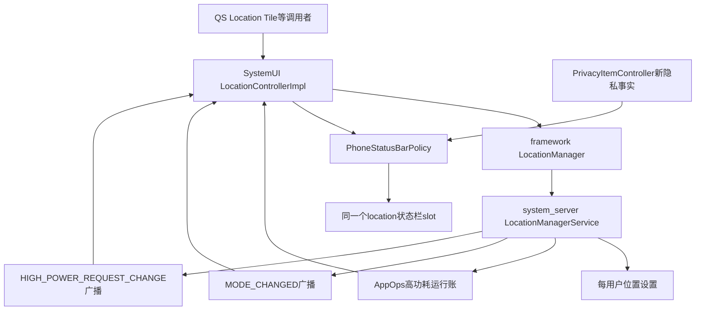
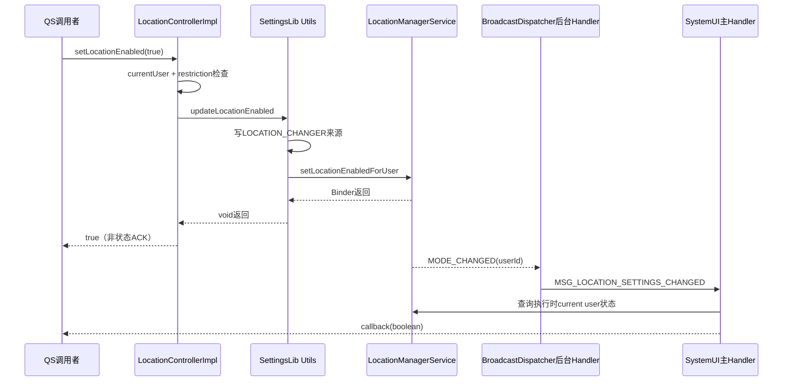
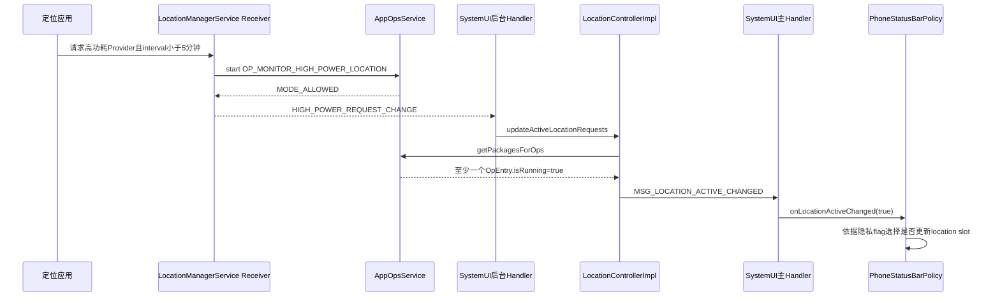

# 第 460 章 Android SystemUI LocationController：位置总开关、高功耗请求、用户限制与状态栏图标链

> 源码基线：Android 11 / API 30 / `android-11.0.0_r48`。本章只在 macOS 阅读，不实际编译。核心文件：SystemUI `LocationController.java`、`LocationControllerImpl.java`、`PhoneStatusBarPolicy.java`及对应测试；SettingsLib `Utils.java`；framework `LocationManager`、AppOps；system_server `LocationManagerService.java`、`AppOpsHelper.java`。阅读前先记住：位置总开关、位置请求、状态栏位置图标是三个不同事实。

## 1. 本章解决什么问题

用户点定位快捷开关后谁真正修改设置？SystemUI怎样知道设置变化？状态栏小位置图标为什么不是“定位总开关已开启”，而是某类位置使用正在发生？多用户、开机时序和隐私新旧链又会制造哪些边界？

## 2. 一句话主线

`LocationControllerImpl`一边通过`LocationManager`读写当前用户的位置总开关，另一边扫描AppOps的`OP_MONITOR_HIGH_POWER_LOCATION`运行态；`PhoneStatusBarPolicy`再根据隐私功能开关，在旧高功耗事实和新PrivacyItem位置事实之间选择一个来源控制同一个location状态栏slot。

## 3. 先拆开三个boolean

`isLocationEnabled()`回答“当前前台用户允许普通位置服务吗”；`isLocationActive()`回答“系统AppOps账上是否有高功耗位置请求运行”；隐私列表里的`showLocation`回答“当前投影列表是否含位置类型”。三者可以不同。

## 4. 开启不等于正在定位

用户打开位置总开关后，若没有应用请求位置，`enabled=true`而`active=false`，旧状态栏位置图标仍隐藏。图标不是设置页开关的镜像。

## 5. 正在定位也不是任意定位

r48旧链只检查`OP_MONITOR_HIGH_POWER_LOCATION`。低功耗、较慢或被LocationManagerService判为普通监控的请求，不会让`LocationControllerImpl.isLocationActive()`变成true。

## 6. “高功耗”的源码定义

LocationManagerService要求Provider的`powerRequirement == Criteria.POWER_HIGH`，并且请求间隔严格小于`5 * 60 * 1000`毫秒。恰好五分钟不满足“小于”，也不是这条高功耗监控账。

## 7. 参与者分层

QS等调用者使用`LocationController`；Controller负责设置读写和高功耗事实缓存；LocationManagerService管理请求与Provider；AppOps保存运行账；PhoneStatusBarPolicy只把所选事实投影成图标。

## 8. 总体架构图



## 9. 进程边界

`LocationControllerImpl`和`PhoneStatusBarPolicy`在SystemUI进程；LocationManager Java Manager仍在调用进程；LocationManagerService与AppOpsService在system_server。设置查询、设置修改和AppOps全量查询都会跨Binder。

## 10. 线程边界

Controller以主Looper串行维护callback列表，以注入的后台Looper接收两个广播；但构造函数还会在构造线程同步扫描AppOps。状态改变从后台写缓存，再向主Handler发通知。

## 11. 接口只有三项能力

`LocationController`暴露`isLocationActive`、`isLocationEnabled`和`setLocationEnabled`；callback则分`onLocationActiveChanged`与`onLocationSettingsChanged`。接口设计已经提示“活跃”和“设置”不可混写。

## 12. 单例生命周期

实现以Dagger `@Singleton`存在，构造后注册动态广播且没有destroy/unregister。它按SystemUI进程生命周期长期存活，这对系统组件合理，但测试或重建场景不能靠显式释放恢复干净状态。

## 13. 构造依赖

构造函数取得Context、主/后台Looper、BroadcastDispatcher和BootCompleteCache；随后查AppOpsManager与StatusBarManager。真正主逻辑使用前者，`mStatusBarManager`在该类中从未再读，是遗留字段。

## 14. 广播注册范围

过滤器监听`HIGH_POWER_REQUEST_CHANGE_ACTION`与`MODE_CHANGED_ACTION`，通过BroadcastDispatcher以`UserHandle.ALL`注册。这代表Controller可能收到不同用户的变化，不能自动推导事件用户就是当前前台用户。

## 15. 为什么放后台Handler

高功耗广播会触发`AppOpsManager.getPackagesForOps`跨Binder并遍历结果；放后台Looper避免在主线程直接做这段查询。设置广播本身只向主Handler投消息。

## 16. 构造期仍有同步Binder

注册后，构造函数立即调用`updateActiveLocationRequests()`；这次没有post到后台，而是在构造线程同步查询AppOps。若对象在主线程创建，冷启动关键路径仍可能被system_server响应拖慢。

## 17. 设置写入口

`setLocationEnabled(enabled)`先用`ActivityManager.getCurrentUser()`抓取当前前台用户，再检查该用户限制，最后调用SettingsLib helper。它不会保存用户选择，也不会等待广播确认。

## 18. 用户限制只检查一项

Controller只检查`UserManager.DISALLOW_SHARE_LOCATION`。若存在其他设备政策、权限或服务端失败，不能从这个单一boolean得出“切换一定成功”。

## 19. 设置写源码

```java
public boolean setLocationEnabled(boolean enabled) {
    int currentUserId = ActivityManager.getCurrentUser();
    if (isUserLocationRestricted(currentUserId)) {
        return false;
    }
    updateLocationEnabled(mContext, enabled, currentUserId,
            Settings.Secure.LOCATION_CHANGER_QUICK_SETTINGS);
    return true;
}
```

## 20. 返回true的准确语义

true只表示本地限制检查通过且helper调用正常返回；不是LocationManagerService的状态ACK。helper是void，Controller也没有回读确认。SecurityException、RemoteException包装异常或空服务会直接抛出，而不是返回false。

## 21. 注释中的同意Dialog已陈旧

方法注释仍说开启时可能弹用户同意Dialog，但r48 helper直接写来源标记并调用`setLocationEnabledForUser`，这段路径没有在Controller内构造Dialog。读实现应优先于沿袭注释。

## 22. SettingsLib helper做两件事

它先向`Settings.Secure.LOCATION_CHANGER`写`LOCATION_CHANGER_QUICK_SETTINGS`，记录变更来源；再取得LocationManager，调用指定用户的`setLocationEnabledForUser`。

## 23. 两步不是事务

`Settings.Secure.putIntForUser`返回值被忽略；随后Binder设置可能失败。于是来源标记和真正位置状态之间没有原子性，也没有回滚协议。

## 24. system_server写入口

LocationManagerService先用`ActivityManager.handleIncomingUser`校验/解析目标用户，再要求`WRITE_SECURE_SETTINGS`，然后使本地位置缓存失效，并委托SettingsHelper写该用户位置设置。

## 25. 权限边界

普通应用不能随意调用这条隐藏/受权路径。SystemUI是受信任系统组件；`DISALLOW_SHARE_LOCATION`是产品政策前置判断，system_server权限检查才是安全边界。

## 26. 当前用户快照竞态

Controller读取currentUserId和完成Binder调用之间，前台用户可能切换。调用仍准确作用于旧快照用户，但用户眼前可能已是新用户；没有generation或“仍为当前用户”复核。

## 27. 设置读入口

`isLocationEnabled()`每次重新取得LocationManager，并查询`ActivityManager.getCurrentUser()`对应的用户。它不缓存设置boolean，因此每次通知所有callback前都会重新跨Binder读取。

## 28. BootCompleteCache门

返回式先检查`mBootCompleteCache.isBootComplete()`，只有true才调用LocationManager。这利用Java短路避免服务尚未完全初始化时查询，并在开机完成前强制报告false。

## 29. false的两种含义

`isLocationEnabled()==false`可能是位置确实关闭，也可能只是SystemUI认为boot尚未完成。调用者只拿boolean，无法区分“权威关闭”和“当前不可查询”。

## 30. boot完成没有主动刷新

Controller只读取BootCompleteCache，却没有`addListener`。因此boot从false变true本身不会产生`MSG_LOCATION_SETTINGS_CHANGED`；若没有后续MODE_CHANGED或新callback触发，早期订阅者可能继续持有旧false。

## 31. 新订阅可偶然修复旧订阅者

每次addCallback都会排一条共享设置刷新消息；消息执行时遍历全部callback。boot后新增任一订阅者，会让旧订阅者也重新收到真实当前值，这属于副作用式修复，不是明确boot事件设计。

## 32. LocationManager空值边界

代码先取得服务再在短路右侧使用。boot未完成时即使返回null也不解引用；boot完成后null会NPE。系统设备正常应有服务，但实现没有显式故障语义。

## 33. MODE_CHANGED从哪里来

LocationManagerService监听每用户位置设置变化，调用`onLocationModeChanged(userId)`，使LocationManager本地缓存失效，构造带`EXTRA_LOCATION_ENABLED`的registered-only、foreground广播，并只发给该userId。

## 34. Controller不用广播extra

它收到MODE_CHANGED后不读`EXTRA_LOCATION_ENABLED`和事件用户，只向主Handler发刷新；最终又查询“执行时的当前用户”。这样避免盲信旧extra，却丢掉了事件归属信息。

## 35. 后台用户事件的效果

由于接收范围是ALL，后台用户改变位置设置也可能触发Controller；回调值却是当前前台用户的状态。因此监听者可能收到“值未变化”的冗余设置回调。

## 36. 用户切换没有显式监听

LocationControllerImpl不注册UserTracker或`ACTION_USER_SWITCHED`。LocationManagerService的current-user变化主要刷新Provider enable状态，并未在所读代码中因此发送MODE_CHANGED；Controller不能保证在切用户瞬间主动重报新用户总开关。

## 37. 设置callback是事件通知而非边沿

MODE_CHANGED每来一次就通知，不比较旧值；add也会通知。因此同一个boolean可连续多次回调。消费者应把它当“请刷新”而不是“值一定翻转”。

## 38. addCallback的消息顺序

add先向同一个主Handler发送`MSG_ADD_CALLBACK`，再发送`MSG_LOCATION_SETTINGS_CHANGED`。同线程消息队列保持发送顺序，所以正常情况下先入列表，再参与当前值回调。

## 39. 设置链时序图



## 40. removeCallback也异步

remove只是向主Handler发消息。调用返回时callback可能仍在列表；但若随后事件也按同一主Handler排队，先发remove通常先执行，后续主通知就看不到它。

## 41. 重复add没有去重

内部是ArrayList，`MSG_ADD_CALLBACK`直接add。同一对象添加两次会收到两次通知；remove一次只删除首个匹配项，仍残留一个订阅。

## 42. callback列表线程归属

所有增删和遍历都在主Handler中执行，避免普通并发修改。外部add/remove即使从其他线程调用，也只是投递消息。

## 43. 主Handler源码

```java
private void locationSettingsChanged() {
    boolean isEnabled = isLocationEnabled();
    Utils.safeForeach(mSettingsChangeCallbacks,
            cb -> cb.onLocationSettingsChanged(isEnabled));
}
```

## 44. 上段示意需再校正

源码先把`isLocationEnabled()`结果存入局部变量，再传给所有callback，而不是为每个callback重复查询。因此一轮通知只有一次设置查询，同轮订阅者看见同一个快照；add/remove则在`handleMessage`的另外两个case中直接修改ArrayList。

## 45. safeForeach真正保护什么

它按索引从末尾向前并跳过null。这里callback自移除只会排异步remove，当前遍历并不会立即改ArrayList；反向遍历仍给未来可能的直接增删留下更宽容的行为，但并非通用线程安全工具。

## 46. callback异常边界

`safeForeach`不捕获RuntimeException。任一callback抛异常会中断剩余通知并冒到主Looper；Controller没有隔离坏订阅者。

## 47. add只补设置、不补活跃

新增callback会立即收到一次`onLocationSettingsChanged`，但不会收到当前`onLocationActiveChanged`。若高功耗请求在订阅前已开始且构造期已缓存true，订阅者要主动调`isLocationActive()`才知道初值。

## 48. 这对PhoneStatusBarPolicy的影响

PhoneStatusBarPolicy构造时先把location slot隐藏，再addCallback；它没有在add后主动调用`updateLocationFromController()`。若Controller早已active=true且之后没有边沿，高功耗旧链可能保持图标隐藏。

## 49. 构造期初始化并不等于UI初始化

Controller注释说扫描当前状态并初始化status view，但它只写自己的boolean；当时通常尚无callback，且后续add不补active。该注释夸大了端到端效果。

## 50. 高功耗账从请求产生

LocationManagerService的Receiver维护每个调用者的UpdateRecord；`updateMonitoring`遍历有效记录，判断是否请求位置以及是否满足高功耗Provider和小于五分钟间隔。

## 51. Provider关闭时不计普通请求

若对应Provider对调用UID所属用户未启用，且请求不属于settings-exempt，记录会被跳过。只有有效请求才进入AppOps监控账。

## 52. 普通和高功耗是两项AppOp

服务先维护`OP_MONITOR_LOCATION`，再维护`OP_MONITOR_HIGH_POWER_LOCATION`。高功耗请求通常同时是位置请求，但SystemUI旧Controller只扫后一项。

## 53. AppOps start可能被拒绝

AppOpsHelper用`startOpNoThrow`，只有MODE_ALLOWED才返回true并把Receiver的monitoring状态设true。被政策拒绝的高功耗监控不会作为running项被SystemUI看到。

## 54. 停止如何闭账

请求移除、Provider变得不可用或访问检查失败时，服务调用`finishOp`并清mOpHighPowerMonitoring。AppOps的`OpEntry.isRunning()`随后应反映不再运行。

## 55. 广播只在本Receiver边沿发送

`mOpHighPowerMonitoring`与旧值不同时，LocationManagerService向`UserHandle.ALL`发HIGH_POWER_REQUEST_CHANGE广播。它只是告诉观察者“全局账可能变化”，不携带最终全局boolean。

## 56. 高功耗判定源码

```java
if (properties != null
        && properties.mPowerRequirement == Criteria.POWER_HIGH
        && updateRecord.mRequest.getInterval() < HIGH_POWER_INTERVAL_MS) {
    requestingHighPowerLocation = true;
}

boolean wasHighPowerMonitoring = mOpHighPowerMonitoring;
mOpHighPowerMonitoring = updateMonitoring(
        requestingHighPowerLocation, mOpHighPowerMonitoring, true);
if (mOpHighPowerMonitoring != wasHighPowerMonitoring) {
    mContext.sendBroadcastAsUser(
            new Intent(LocationManager.HIGH_POWER_REQUEST_CHANGE_ACTION), UserHandle.ALL);
}
```

## 57. 广播不是最终事实

两个应用中一个停止时会发广播，但另一个仍运行，系统总体active仍为true。Controller必须重新扫描全部AppOps，不能把“某Receiver发生false边沿”直接当全局false。

## 58. Controller扫描接口

`getPackagesForOps(new int[]{OP_MONITOR_HIGH_POWER_LOCATION})`返回PackageOps列表；无数据可返回null。Controller遍历每包的OpEntry，只要找到目标op且`isRunning()`就立即true。

## 59. 防御式双重检查

即便查询已用单op过滤，代码仍验证`opEntry.getOp()`；也防御`packages==null`与`opEntries==null`。它没有防御AppOpsManager本身为null。

## 60. 没有当前用户过滤

扫描不检查`PackageOps.getUid()`所属user，也不与ActivityManager current user/profile集合比较。因此其他用户仍running的高功耗账可以让当前SystemUI旧位置图标亮起。

## 61. 广播也是全用户

LocationManagerService把高功耗变化发给ALL，因为AppOps扫描本就按全局“是否存在任一运行项”聚合。此设计更像设备级使用灯，而不是严格的当前用户提示。

## 62. 不暴露应用身份

Controller最后只缓存一个boolean，丢弃package、uid和op时间信息。PhoneStatusBarPolicy只能显示通用location图标，不能告诉用户是谁在请求。

## 63. 不等于真实GNSS硬件常开

高功耗AppOp来自位置请求及Provider属性/间隔政策；它不是直接读取GNSS芯片电源寄存器。Provider可能合并请求、采用其他硬件，状态也可能受AppOps与设置影响。

## 64. GNSS还有额外广播来源

r48的`GnssVisibilityControl`也能发送同一HIGH_POWER_REQUEST_CHANGE_ACTION。对Controller而言它仍只是重新扫描触发器，最终事实仍取AppOps运行账。

## 65. active缓存更新规则

`updateActiveLocationRequests()`保存旧boolean，执行全量扫描并覆盖字段；只有新旧不同才向主Handler发送`MSG_LOCATION_ACTIVE_CHANGED`。所以active callback是边沿通知。

## 66. 与设置callback正相反

active相同就不回调；settings广播相同也照样回调。记忆口诀：高功耗链“比较后通知”，设置链“事件到就重读通知”。

## 67. 高功耗链时序图



## 68. 后台写主线程读的数据竞态

`mAreActiveLocationRequests`是普通boolean，既非volatile也未加锁。后台广播线程写，主Handler通知和外部主线程`isLocationActive()`读；消息队列通常带来实践中的时序，但源码字段本身没有明确Java内存可见性声明。

## 69. 回调参数与字段可能错代

后台快速产生`false→true→false`会排两条无payload的MSG；主Handler处理第一条时读取的是当前字段，可能已经false，于是两条回调都报false，丢失中间true。消息应携带值或generation才能保留边沿。

## 70. 多次后台更新是否并发

两个广播都投递到构造时新建、绑定同一`bgLooper`的Handler，因此广播回调通常由该Looper串行处理；但构造期同步扫描和外部线程读取仍不在同一actor内。

## 71. AppOps扫描成本

每次高功耗变化都进行全量PackageOps查询和嵌套遍历，直到找到running项。变动不频繁时可接受，但实现没有监听目标op的直接计数，也没有耗时统计。

## 72. 查询与广播之间仍可变化

Controller扫描结束后，另一请求可能立即开始或停止。后续广播通常会纠正，但不存在“读取快照版本+订阅”原子协议；丢广播或服务异常时缓存可陈旧。

## 73. PhoneStatusBarPolicy先建同一slot

初始化时为`mSlotLocation`设置`LOCATION_STATUS_ICON_ID`和无障碍描述，然后隐藏。无论旧高功耗链还是新PrivacyItem链，最终改的都是这个slot的visibility。

## 74. 为什么存在两套位置事实

旧系统图标强调高功耗位置使用；Android 11隐私指示器希望统一相机、麦克风、位置的应用使用事实。r48保留兼容分支，由`allIndicatorsAvailable`决定来源。

## 75. 状态栏选择源码

```java
public void onLocationActiveChanged(boolean active) {
    if (!mPrivacyItemController.getAllIndicatorsAvailable()) {
        updateLocationFromController();
    }
}

private void updateLocationFromController() {
    mIconController.setIconVisibility(
            mSlotLocation, mLocationController.isLocationActive());
}
```

## 76. callback参数被忽略

`active`参数没有使用，Policy再次读取Controller字段。这可取得最新值，却进一步放大第69节“无payload消息读当前字段”的代际折叠；回调名看似传边沿，消费端却把它当刷新信号。

## 77. 旧分支的条件

当`getAllIndicatorsAvailable()==false`，active变化调用`updateLocationFromController()`，location slot跟随高功耗全局boolean；PrivacyItem更新不会负责位置slot。

## 78. 新分支的条件

当all indicators可用，active callback被忽略；`updatePrivacyItems`扫描PrivacyItem列表，只要有`TYPE_LOCATION`就显示location slot。这时粗/细位置AppOps投影取代“仅高功耗”定义。

## 79. 新旧定义不可等同

新PrivacyItem位置事实可能包含粗略或精确位置使用，不要求高功耗Provider与五分钟阈值；它还经过当前用户、权限敏感性和历史/活跃列表政策。切flag可能改变图标语义。

## 80. r48裸分支的现实

前两章已通过全库搜索确认：PrivacyItemController声明DeviceConfig listener和初值false，却没有注册listener或初始化两个availability。在未有产品补丁的这份r48源码中，`allIndicatorsAvailable`保持false，实际走旧高功耗分支。

## 81. 这是源码基线结论

不要把“Android 11产品通常有隐私指示器”直接等同于此checkout可达代码。OEM补丁、不同tag或运行时注入会改变结果；本章只陈述本地r48源码能证明的路径。

## 82. flag切换交接不完整

PhoneStatusBarPolicy没有覆写`onFlagAllChanged`。即使外部补齐flag监听，仅flag变化本身也不会立即在旧源和新源间重算location slot，需等待privacy list或active事件。

## 83. 从false切到true的暂态

若旧高功耗图标正亮，flag变true但尚无PrivacyItem回调，旧图标可能继续亮；下一次`updatePrivacyItems`才按位置item修正。

## 84. 从true切到false的暂态

`updatePrivacyItems`在all=false时根本不写location slot；若此前新链显示/隐藏，切回旧链也要等下一次高功耗active边沿。当前缓存虽可查询，却没有交接触发。

## 85. Camera和Mic不走这条旧链

PrivacyItem更新始终直接控制camera和microphone slots；只有location slot被allIndicatorsAvailable条件包围。因此位置的兼容交接是特殊逻辑。

## 86. 设置变化不直接控制图标

PhoneStatusBarPolicy实现了`onLocationActiveChanged`，却没有用`onLocationSettingsChanged`更新location slot。关闭位置会通过服务结束请求、AppOps闭账后间接隐藏，而不是看到MODE_CHANGED就隐藏。

## 87. 间接隐藏可能有时差

设置关闭、Provider requirements重算、Receiver stop AppOp、发送高功耗广播、SystemUI扫描、主Handler改图标是多阶段链。总开关已关闭与图标消失不是一次原子提交。

## 88. 图标也不是位置成功证明

running AppOp只说明监控操作已开始；并不证明应用刚收到有效Location，也不证明GNSS已锁定卫星。首次定位、缓存位置、网络位置与硬件状态都不在此boolean中。

## 89. 无障碍描述的边界

location slot使用通用“location active”描述。旧链实际是高功耗请求，新链是PrivacyItem位置使用；同一文案隐藏了两个来源的语义差异。

## 90. 单测覆盖的第一件事

`testAddCallback_notifiedImmediately`证明add后设置callback会收到一次boolean，但没有断言值，也没有证明active初值补发。

## 91. 单测覆盖MODE_CHANGED

测试先add得到一次设置回调，再手工调用onReceive(MODE_CHANGED)，最终验证总计两次。它确认“事件即通知”，未覆盖广播用户与extra。

## 92. 单测覆盖remove

先处理完add，再排remove和MODE事件，最终无新增callback。它证明同一Looper队列顺序下的移除行为，不证明重复add一次remove的残留。

## 93. 自移除测试的真实含义

active/settings callback里调用remove只会再排Handler消息，所以当前safeForeach不会同步结构变化。测试证明“不崩”，不证明当前轮停止后续重复项或没有再次调用。

## 94. 测试Looper弱化线程问题

测试把mainLooper与bgLooper都设成同一个TestableLooper，手工直接调用`onReceive`。生产中的后台写、主线程读可见性与快速消息代际折叠没有被模拟。

## 95. AppOps扫描没有实测

active测试spy掉`areActiveHighPowerLocationRequests()`返回值，没有构造PackageOps/OpEntry；null列表、多用户项、running组合和Binder失败都未覆盖。

## 96. set路径没有实测

现有测试未验证用户限制、LOCATION_CHANGER来源标记、current-user竞态、LocationManager异常或返回true语义。注释陈旧也不会被测试发现。

## 97. boot路径没有实测

BootCompleteCache只是mock，未分别验证boot前false、boot完成无主动回调及新增订阅触发共享刷新。这是阅读实现才能发现的状态缺口。

## 98. PhoneStatusBarPolicy切源没有专门保障

需要单测覆盖allIndicatorsAvailable false/true切换、高功耗与PrivacyItem同时变化、flag单独变化和初始active=true订阅。当前所读Controller测试不覆盖端到端slot。

## 99. dump缺失

LocationControllerImpl没有实现Dumpable，无法直接从`dumpsys activity service SystemUIService`看到active缓存、callback数量、最后扫描时刻、当前用户或最近广播。这使陈旧图标定位依赖拼接多处证据。

## 100. 建议的最小dump字段

至少输出bootComplete、currentUser、isLocationEnabled查询结果、active缓存、最后AppOps扫描时间/耗时、running uid/package摘要、callback去重数量及隐私切源flag。

## 101. 故障一：开关已开但图标不亮

先判断是否真的有高功耗请求；再看interval与Provider power；查AppOps该op是否running；确认裸r48走旧分支；最后检查订阅发生在active初值之后却没有边沿补发的问题。

## 102. 故障二：没看到当前应用定位却亮图标

可能是后台用户的running高功耗op、另一包请求、GNSS可见性触发后的全局扫描，或UI仍持旧缓存。Controller不保留身份，需向AppOps/LocationManagerService侧追证据。

## 103. 故障三：切用户后Tile状态旧

核对Controller没有用户切换监听；看是否收到任何MODE_CHANGED或新callback刷新；比较ActivityManager当前用户与LocationManager按用户设置，避免只看旧UI缓存。

## 104. 故障四：图标闪烁或漏中间态

采集高功耗广播、后台扫描结果和主Handler处理时间。无payload MSG会在快速翻转时读取最新字段，多个边沿可能折叠成相同回调值。

## 105. 改进一：统一线程模型

把active扫描结果通过携带值和generation的不可变消息交给主线程，主线程独占缓存与callback；或把字段设volatile并仍用代际校验。单有volatile只能解决可见性，不能保留被折叠的中间边沿。

## 106. 改进二：补完整初始快照

add时在加入列表后同时向该callback回放settings和active，且标明snapshot语义；PhoneStatusBarPolicy便不依赖未来边沿初始化图标。

## 107. 改进三：显式跟踪用户

接入UserTracker，在用户变化时重新查询设置并按产品政策重新计算active；若图标只面向当前profile，应在AppOps扫描中以uid userId/profile过滤。

## 108. 改进四：完成boot闭环

注册BootCompleteCache listener；boot完成后在主线程重读当前用户设置并通知。这样false不再无限期兼具“未启动”和“确实关闭”两义。

## 109. 改进五：callback去重和异常隔离

用集合或添加前contains；remove清除所有重复项；通知时复制快照并按需要隔离异常。是否允许重复订阅应写进接口契约，而非由ArrayList偶然决定。

## 110. 改进六：新旧来源原子交接

PhoneStatusBarPolicy应处理`onFlagAllChanged`，在一次主线程事务中选择PrivacyItem或high-power snapshot并重写slot；切源事件要携带当前两边快照，避免等待下一随机事件。

## 111. 本章检查清单

能否分别回答enabled、high-power active、PrivacyItem location？能否指出5分钟严格阈值、AppOps running、ALL用户扫描、boot门、add不补active、无payload消息折叠及PhoneStatusBarPolicy切源条件？

## 112. macOS 只读练习一：追位置开关

依次用`rg`定位`setLocationEnabled`、SettingsLib `updateLocationEnabled`、`LocationManagerService.setLocationEnabledForUser`与`onLocationModeChanged`；手画来源标记写入、Binder设置、广播、主Handler回调四段，并标出哪一步不是ACK。

## 113. macOS 只读练习二：证明高功耗定义

搜索`HIGH_POWER_INTERVAL_MS`与`updateMonitoring`，记录Provider power、interval、Provider enabled/settings-exempt、AppOps MODE_ALLOWED四个条件；再说明为什么“GPS权限已授予”不足以推出状态栏图标亮。

## 114. macOS 只读练习三：构造多用户反例

只读比较HIGH_POWER广播的`UserHandle.ALL`、Controller扫描循环和PackageOps uid；写出“用户10运行高功耗请求、当前用户0无请求”时旧链boolean的推演，不修改也不运行源码。

## 115. macOS 只读练习四：审计初始与快速翻转

阅读addCallback、updateActiveLocationRequests和Handler；分别推演“订阅前active已true”与“后台true后立刻false、主队列尚未处理”两例，标出漏初值和无payload折叠发生点。

## 116. 最容易误解的一点

位置状态栏图标不是定位总开关指示灯。旧链表示系统范围至少一个高功耗监控AppOp running；新隐私链表示PrivacyItem中存在位置使用，二者都不等于“设置已开启”。

## 117. 第二个易错点

`setLocationEnabled`返回true不是异步链完成。真正状态变化、Provider重算、AppOps关闭和图标更新发生在返回之后，且没有统一事务或最终ACK。

## 118. 第三个易错点

`UserHandle.ALL`不自动等于“正确处理当前用户”。设置事件被重读成执行时current user，而高功耗扫描干脆不按用户过滤；两条链的用户语义不同。

## 119. 本章结论

LocationControllerImpl是两条窄控制链的汇合点：按当前用户读写位置总开关，按全局AppOps聚合高功耗请求。它以后台广播、主Handler callback和PhoneStatusBarPolicy完成UI投影，但r48存在boot无刷新、用户切换无监听、active初值不回放、普通boolean跨线程、无payload消息折叠、重复callback及新旧隐私来源交接不完整等边界。定位问题时必须沿“设置事实—请求/AppOps事实—图标来源”三层分别取证。

## 120. 下一章预告

第461章继续阅读SystemUI `KeyguardUpdateMonitor`，拆解锁屏状态聚合、SIM/电话/生物识别/用户切换事件、callback分发与代际状态边界。
